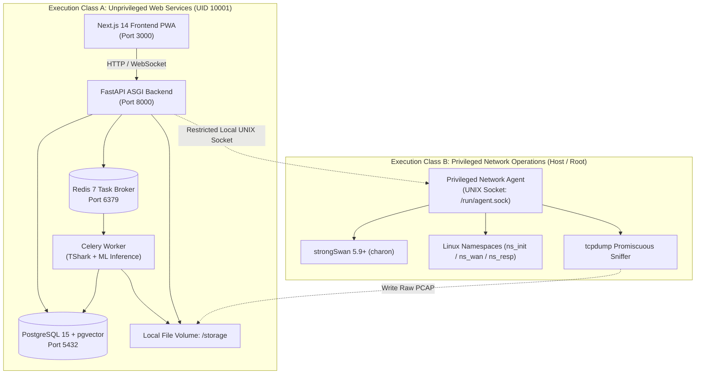

# TunnelTrace AI — Project Memory / Master Context

**Last Updated:** 2026-09-22T21:43:00+05:30  
**Current Phase:** ARCHITECTURE & SPECIFICATION BASELINE COMPLETE (Transitioning to Core Implementation)  
**Current Status:** Specification Approved; Code Implementation Ready to Begin  
**Current Active Task:** Operational Manual & SIH Demo Runbook Complete  
**Next Recommended Task:** Initialize Local-First Engineering Stack (Docker Compose, FastAPI skeleton, Alembic migrations, strongSwan lab)  
**Repository State Verified:** YES (Inspected `docs/` directory; 13 master specifications confirmed)  
**Memory Confidence:** CURRENT (Reflects verified repository truth as of 2026-09-22)  

---

## 1. Header / Metadata

| Property | Value |
| :--- | :--- |
| **System Name** | **TunnelTrace AI** (formerly referenced as `[PROJECT NAME]`) |
| **Problem Statement Reference** | Smart India Hackathon 2026 / PS ID: `26160` (PS 160) |
| **Official PS Title** | AI-Powered IPsec VPN Protocol Analyzer and Security Assessment Framework |
| **Sponsoring Organization** | National Technical Research Organisation (NTRO) |
| **Theme / Category** | Blockchain & Cybersecurity (Software Category) |
| **Repository Root** | `c:\SHARAN PROJECTS\TunnelTrace AI` |
| **Document Role** | Living Operational Memory, Technical Decision Register & Context Baseline |
| **Source of Truth Order** | 1. Current Code/Config → 2. Test Logs → 3. Project Memory → 4. Specs (TRD/PRD/RTM/Ops) |

---

## 2. START HERE — Current Project State

> [!IMPORTANT]
> **MANDATORY INSTRUCTION FOR ALL FUTURE AGENTS:**  
> Read this section **first** before touching any file. Do NOT re-scan the entire repository. Check the relevant subsystem, inspect only the necessary code files, execute your task, run validation, and **update this document** upon completion.

### What this project is
TunnelTrace AI is an enterprise-grade, evidence-first **IPsec Security Intelligence Platform** built for the National Technical Research Organisation (NTRO). It ingests raw network captures (PCAP/PCAPNG) or live traffic streams, reconstructs IKE negotiations and stateful Security Associations (SAs), classifies inner encrypted applications without decryption (using calibrated ML), audits cryptographic configurations against NIST SP 800-77 Rev. 1 / RFC 8221, computes a deterministic 0–100 Security Score, projects hardened configurations via a Configuration Security Twin, and validates remediations in a closed-loop strongSwan testbed.

### What currently works
- **Complete Master Specification Suite (100% frozen and approved in `docs/`):**
  - **Requirements & Acceptance (`docs/requirements/`):**
    - [`docs/requirements/PRD.md`](file:///c:/SHARAN%20PROJECTS/TunnelTrace%20AI/docs/requirements/PRD.md): 60 sections detailing all functional requirements (`LAB-`, `CAP-`, `PROTO-`, `ML-`, `SEC-`, etc.).
    - [`docs/requirements/RTM.md`](file:///c:/SHARAN%20PROJECTS/TunnelTrace%20AI/docs/requirements/RTM.md): 37 sections with the 25-column Master Matrix tracking all 55 official PS requirements.
    - [`docs/requirements/TESTING_VALIDATION_PLAN.md`](file:///c:/SHARAN%20PROJECTS/TunnelTrace%20AI/docs/requirements/TESTING_VALIDATION_PLAN.md): 99 sections defining V&V principles, 34 test matrices, Golden SIH Acceptance Flow, and zero-hallucination execution rules.
    - [`docs/requirements/USER_GUIDE_AND_DEMO_RUNBOOK.md`](file:///c:/SHARAN%20PROJECTS/TunnelTrace%20AI/docs/requirements/USER_GUIDE_AND_DEMO_RUNBOOK.md): 96 sections defining Analyst Operations, Evidence Interpretation, 12-Step Golden SIH Demo Runbook, and 3-Tier Fallback Recovery.
  - **Architecture & Design (`docs/architecture/`):**
    - [`docs/architecture/SYSTEM_ARCHITECTURE.md`](file:///c:/SHARAN%20PROJECTS/TunnelTrace%20AI/docs/architecture/SYSTEM_ARCHITECTURE.md): 77 sections defining Three Domains, 19 Mermaid diagrams, and Privilege Separation Architecture.
    - [`docs/architecture/TRD.md`](file:///c:/SHARAN%20PROJECTS/TunnelTrace%20AI/docs/architecture/TRD.md): 87 sections with exact architectural diagrams, pseudocode, and mathematical formulations.
    - [`docs/architecture/WORKFLOW.md`](file:///c:/SHARAN%20PROJECTS/TunnelTrace%20AI/docs/architecture/WORKFLOW.md): 80 sections defining DFDs (L0, L1, L2), state machines, and the 31-step Golden SIH Demo Workflow.
    - [`docs/architecture/DATABASE_DESIGN.md`](file:///c:/SHARAN%20PROJECTS/TunnelTrace%20AI/docs/architecture/DATABASE_DESIGN.md): 85 sections defining 22 data domains, PostgreSQL + `pgvector` schemas, and Evidence DAG.
    - [`docs/architecture/ML_DATASET_ENGINEERING.md`](file:///c:/SHARAN%20PROJECTS/TunnelTrace%20AI/docs/architecture/ML_DATASET_ENGINEERING.md): 99 sections defining IPsec dataset generation, session-level splits, dual ensemble, calibration, and OOD.
    - [`docs/architecture/SECURITY_THREAT_MODEL_COMPLIANCE.md`](file:///c:/SHARAN%20PROJECTS/TunnelTrace%20AI/docs/architecture/SECURITY_THREAT_MODEL_COMPLIANCE.md): 109 sections defining Scope A & B, Policy-as-Code, STRIDE, Asset Inventory, Abuse Cases, Security Controls, and Zero-Hallucination rules.
    - [`docs/architecture/API_INTEGRATION_SPECIFICATION.md`](file:///c:/SHARAN%20PROJECTS/TunnelTrace%20AI/docs/architecture/API_INTEGRATION_SPECIFICATION.md): 95 sections defining REST APIs, WebSockets, async job contracts, DTOs, Golden Flows, and privileged agent integration.
    - [`docs/architecture/UI_UX_DESIGN_SYSTEM.md`](file:///c:/SHARAN%20PROJECTS/TunnelTrace%20AI/docs/architecture/UI_UX_DESIGN_SYSTEM.md): 74 sections with sharp 0px brutalist styling, light theme default, and 18 ASCII wireframes.
    - [`docs/architecture/DEPLOYMENT.md`](file:///c:/SHARAN%20PROJECTS/TunnelTrace%20AI/docs/architecture/DEPLOYMENT.md): 97 sections detailing the local-first Docker stack, Class A/B privilege separation, and runbooks.

### What is currently being worked on
- Transitioning from Specification Baseline to **Phase 1: Local-First Core Infrastructure Setup**.
- Creating the core repository directory skeleton (`/backend`, `/frontend`, `/lab`, `/policies`, `/models`, `/tests`).

### What is next
1. Bootstrap `docker-compose.yml` for Execution Class A (PostgreSQL 15 + `pgvector`, Redis 7, FastAPI skeleton, Celery worker).
2. Initialize backend directory with FastAPI ASGI application, Pydantic settings, and Alembic database migration baseline.
3. Configure the Linux namespace strongSwan testbed scripts (`lab/scripts/setup_testbed.sh`).

### Current blockers
- **None.** Architecture, data contracts, and design systems are 100% aligned and frozen.

### Critical frozen decisions
1. **Deterministic Protocol Extraction:** IKE version, ciphers, DH groups, SPIs, and SA properties are **never predicted by ML**. They are extracted deterministically via TShark/PyShark.
2. **ML Scope is Encrypted Flow Classification:** Machine learning (XGBoost + 1D-CNN) is strictly bounded to inferring the *traffic application type* inside ESP payloads using timing, size, and burst side channels. **Zero payload decryption.**
3. **Primary Dataset is Native IPsec:** Generated in our controlled strongSwan lab. UNB ISCXVPN2016 is strictly an external methodology benchmark (it uses OpenVPN, not IPsec ESP).
4. **Session-Level ML Data Splits:** No packets from the same IPsec tunnel session may exist in both train and test splits (`GroupKFold` on `session_id`).
5. **Deterministic Policy-as-Code:** Security findings and score deductions derive from versioned YAML rules (NIST SP 800-77, RFC 8221). The LLM never invents vulnerabilities.
6. **Execution Class Separation:** Standard web services (Next.js, FastAPI, Celery, Postgres) run unprivileged (Class A); raw packet sniffing and strongSwan namespaces run under a dedicated Privileged Network Agent (Class B).
7. **Local-First Supremacy:** Core analysis must execute 100% locally without internet connectivity. Cloud deployment (Vercel/Render/Supabase) is optional and non-blocking.
8. **UI Design System:** Default Light Theme (`#F7F7F4`), sharp 0px geometry, bold typography (Inter Tight + JetBrains Mono), no generic cards or fluffy shadows.

### Relevant repository areas
- `docs/`: All approved technical specifications.
- `c:\SHARAN PROJECTS\TunnelTrace AI\PROJECT_MEMORY.md`: This living memory document.

### Relevant documents
- Consult [`docs/PRD.md`](file:///c:/SHARAN%20PROJECTS/TunnelTrace%20AI/docs/PRD.md) for requirements definitions.
- Consult [`docs/TRD.md`](file:///c:/SHARAN%20PROJECTS/TunnelTrace%20AI/docs/TRD.md) for technical algorithms and data schemas.
- Consult [`docs/WORKFLOW.md`](file:///c:/SHARAN%20PROJECTS/TunnelTrace%20AI/docs/WORKFLOW.md) for data flow sequences and failure transitions.
- Consult [`docs/DEPLOYMENT.md`](file:///c:/SHARAN%20PROJECTS/TunnelTrace%20AI/docs/DEPLOYMENT.md) for infrastructure, compose files, and runbooks.
- Consult [`docs/RTM.md`](file:///c:/SHARAN%20PROJECTS/TunnelTrace%20AI/docs/RTM.md) for PS clause traceability.

---

## 3. Project Identity

- **Official Title:** AI-Powered IPsec VPN Protocol Analyzer and Security Assessment Framework
- **System Name:** **TunnelTrace AI**
- **Working Descriptor:** IPsec Security Intelligence Platform
- **Competition Reference:** Smart India Hackathon (SIH) 2026, Grand Finale
- **Problem Statement ID:** `26160` (Internal reference: PS 160)
- **Sponsoring Organization:** National Technical Research Organisation (NTRO)
- **Theme:** Blockchain & Cybersecurity
- **Project Category:** Software (Enterprise Security / Protocol Forensics)

---

## 4. Official Problem Statement

The official problem statement issued by NTRO mandates an automated, intelligent software system capable of analyzing IPsec VPN deployments from captured packet traces (PCAP/PCAPNG) or live traffic streams to:
1. Reconstruct protocol characteristics and identify active IPsec protocols (IKEv1, IKEv2, ESP, AH).
2. Infer operational modes (Tunnel vs. Transport) and negotiated cryptographic parameters (encryption, integrity, Diffie-Hellman groups, lifetimes).
3. Classify the nature of encapsulated application traffic within ESP streams using artificial intelligence without payload decryption.
4. Perform rigorous security assessments against established cryptographic standards, detecting vulnerabilities, misconfigurations, and metadata exposure.
5. Generate standardized, actionable outputs including a comprehensive Security Score, Risk Score, Threat Matrix, Executive Report, and Technical Report.

---

## 5. Official PS Requirement Checklist

| ID | Clause Name | Official Category | Description | Status |
| :--- | :--- | :--- | :--- | :--- |
| `PS-LAB-001` | Tunnel Mode | A. Testbed Generation | Controlled Tunnel Mode negotiation | `IMPLEMENTED IN SPEC — CODE PLANNED` |
| `PS-LAB-002` | Transport Mode | A. Testbed Generation | Controlled Transport Mode negotiation | `IMPLEMENTED IN SPEC — CODE PLANNED` |
| `PS-LAB-003` | AES-128 | A. Testbed Generation | AES-128-CBC and AES-128-GCM ciphers | `IMPLEMENTED IN SPEC — CODE PLANNED` |
| `PS-LAB-004` | AES-256 | A. Testbed Generation | AES-256-CBC and AES-256-GCM ciphers | `IMPLEMENTED IN SPEC — CODE PLANNED` |
| `PS-LAB-005` | AES-GCM | A. Testbed Generation | AEAD authenticated encryption ciphers | `IMPLEMENTED IN SPEC — CODE PLANNED` |
| `PS-LAB-006` | AES-CBC + HMAC | A. Testbed Generation | Legacy CBC with explicit HMAC integrity | `IMPLEMENTED IN SPEC — CODE PLANNED` |
| `PS-LAB-007` | Different DH Groups | A. Testbed Generation | Diffie-Hellman Groups 14, 19, 20, 21 | `IMPLEMENTED IN SPEC — CODE PLANNED` |
| `PS-LAB-008` | PFS Enabled | A. Testbed Generation | Child SA rekeying with DH exchange (PFS On) | `IMPLEMENTED IN SPEC — CODE PLANNED` |
| `PS-LAB-009` | PFS Disabled | A. Testbed Generation | Child SA rekeying without DH exchange (PFS Off) | `IMPLEMENTED IN SPEC — CODE PLANNED` |
| `PS-LAB-010` | IPv4 Communication | A. Testbed Generation | IPsec over IPv4 transport | `IMPLEMENTED IN SPEC — CODE PLANNED` |
| `PS-LAB-011` | IPv6 Communication | A. Testbed Generation | IPsec over IPv6 transport | `IMPLEMENTED IN SPEC — CODE PLANNED` |
| `PS-LAB-012` | VoIP Traffic | A. Testbed Generation | Isochronous RTP audio stream simulation | `IMPLEMENTED IN SPEC — CODE PLANNED` |
| `PS-LAB-013` | WhatsApp / Messaging | A. Testbed Generation | Synthetic Chat/Messaging burst simulation | `IMPLEMENTED IN SPEC — CODE PLANNED` |
| `PS-LAB-014` | E-mail Traffic | A. Testbed Generation | SMTP/IMAP transaction simulation | `IMPLEMENTED IN SPEC — CODE PLANNED` |
| `PS-LAB-015` | Web Browsing | A. Testbed Generation | HTTP/1.1 and HTTP/2 page download bursts | `IMPLEMENTED IN SPEC — CODE PLANNED` |
| `PS-LAB-016` | ICMP Traffic | A. Testbed Generation | Symmetric ping diagnostic exchanges | `IMPLEMENTED IN SPEC — CODE PLANNED` |
| `PS-LAB-017` | Video Streaming | A. Testbed Generation | Sustained chunked video stream simulation | `IMPLEMENTED IN SPEC — CODE PLANNED` |
| `PS-CAP-001` | IKE Negotiation | B. Traffic Capture | Interception of UDP 500/4500 handshakes | `IMPLEMENTED IN SPEC — CODE PLANNED` |
| `PS-CAP-002` | ESP Packets | B. Traffic Capture | Capture and indexing of IP protocol 50 | `IMPLEMENTED IN SPEC — CODE PLANNED` |
| `PS-CAP-003` | AH Packets (Optional)| B. Traffic Capture | Support for IP protocol 51 where present | `IMPLEMENTED IN SPEC — CODE PLANNED` |
| `PS-CAP-004` | Normal Traffic | B. Traffic Capture | Representation of concurrent non-VPN noise | `IMPLEMENTED IN SPEC — CODE PLANNED` |
| `PS-CAP-005` | Offline PCAP | B. Traffic Capture | Batch parsing of uploaded PCAP/PCAPNG | `IMPLEMENTED IN SPEC — CODE PLANNED` |
| `PS-CAP-006` | Live Capture | B. Traffic Capture | Promiscuous network interface packet capture | `IMPLEMENTED IN SPEC — CODE PLANNED` |
| `PS-PROTO-001`| Identify IPsec | C. Protocol Identification | Deterministic detection of IPsec protocols | `IMPLEMENTED IN SPEC — CODE PLANNED` |
| `PS-PROTO-002`| IKE Version | C. Protocol Identification | Differentiation between IKEv1 and IKEv2 | `IMPLEMENTED IN SPEC — CODE PLANNED` |
| `PS-PROTO-003`| Tunnel Mode | C. Protocol Identification | Verification/inference of Tunnel Mode | `IMPLEMENTED IN SPEC — CODE PLANNED` |
| `PS-PROTO-004`| Transport Mode | C. Protocol Identification | Verification/inference of Transport Mode | `IMPLEMENTED IN SPEC — CODE PLANNED` |
| `PS-PROTO-005`| Encryption Algorithm | C. Protocol Identification | Extraction of negotiated cipher and key size | `IMPLEMENTED IN SPEC — CODE PLANNED` |
| `PS-PROTO-006`| Auth / Integrity | C. Protocol Identification | Extraction of integrity transform / AEAD mode | `IMPLEMENTED IN SPEC — CODE PLANNED` |
| `PS-PROTO-007`| Key Exchange | C. Protocol Identification | Extraction of Diffie-Hellman Group identifier | `IMPLEMENTED IN SPEC — CODE PLANNED` |
| `PS-PROTO-008`| SA Characteristics | C. Protocol Identification | Graph reconstruction of IKE and Child SAs | `IMPLEMENTED IN SPEC — CODE PLANNED` |
| `PS-PROTO-009`| Inner ESP Traffic | C. Protocol Identification | ML classification of encrypted traffic | `IMPLEMENTED IN SPEC — CODE PLANNED` |
| `PS-SEC-001` | Crypto Strength | D. Security Assessment | NIST SP 800-77 Rev. 1 cipher audit | `IMPLEMENTED IN SPEC — CODE PLANNED` |
| `PS-SEC-002` | Compliance Audit | D. Security Assessment | Clause citations for RFC 8221 / RFC 7296 | `IMPLEMENTED IN SPEC — CODE PLANNED` |
| `PS-SEC-003` | SA Parameters | D. Security Assessment | Proposal evaluation and parameter matching | `IMPLEMENTED IN SPEC — CODE PLANNED` |
| `PS-SEC-004` | Key Lifetime | D. Security Assessment | Temporal and byte-volume rekey auditing | `IMPLEMENTED IN SPEC — CODE PLANNED` |
| `PS-SEC-005` | Replay Protection | D. Security Assessment | Anti-replay sequence number progression check | `IMPLEMENTED IN SPEC — CODE PLANNED` |
| `PS-SEC-006` | Forward Secrecy | D. Security Assessment | DH rekey audit (PFS verification) | `IMPLEMENTED IN SPEC — CODE PLANNED` |
| `PS-SEC-007` | Cipher Suite Strength| D. Security Assessment | Cryptanalytic attack vulnerability mapping | `IMPLEMENTED IN SPEC — CODE PLANNED` |
| `PS-SEC-008` | Metadata Exposure | D. Security Assessment | Side-channel distinguishability quantification | `IMPLEMENTED IN SPEC — CODE PLANNED` |
| `PS-OUT-001` | Security Score | E. Required Outputs | Deterministic 0–100 posture score | `IMPLEMENTED IN SPEC — CODE PLANNED` |
| `PS-OUT-002` | Traffic Analysis | E. Required Outputs | Encrypted flow classification distribution | `IMPLEMENTED IN SPEC — CODE PLANNED` |
| `PS-OUT-003` | Metadata Inference | E. Required Outputs | Side-channel fingerprintability index | `IMPLEMENTED IN SPEC — CODE PLANNED` |
| `PS-OUT-004` | Executive Report | E. Required Outputs | Synthesized executive PDF report | `IMPLEMENTED IN SPEC — CODE PLANNED` |
| `PS-OUT-005` | Technical Report | E. Required Outputs | Exhaustive technical audit PDF/HTML report | `IMPLEMENTED IN SPEC — CODE PLANNED` |
| `PS-OUT-006` | Risk Score | E. Required Outputs | Categorized risk badge (Low/Med/High/Critical) | `IMPLEMENTED IN SPEC — CODE PLANNED` |
| `PS-OUT-007` | Threat Matrix | E. Required Outputs | STRIDE / MITRE ATT&CK attack mapping | `IMPLEMENTED IN SPEC — CODE PLANNED` |
| `PS-OUT-008` | AI Confidence Score | E. Required Outputs | Platt-calibrated probability & OOD flags | `IMPLEMENTED IN SPEC — CODE PLANNED` |
| `PS-DEL-001` | Working Prototype | F. Deliverables | Full deployable multi-container platform | `SPEC APPROVED — CODE PLANNED` |
| `PS-DEL-002` | AI ML Engine | F. Deliverables | XGBoost + 1D-CNN serialized inference models | `SPEC APPROVED — CODE PLANNED` |
| `PS-DEL-003` | Web Dashboard | F. Deliverables | Next.js 14 responsive PWA application | `SPEC APPROVED — CODE PLANNED` |
| `PS-DEL-004` | Assessment Report | F. Deliverables | WeasyPrint automated PDF compiler | `SPEC APPROVED — CODE PLANNED` |
| `PS-DEL-005` | Demonstration Video | F. Deliverables | MP4 walkthrough of live testbed & twin | `PLANNED` |
| `PS-DEL-006` | Technical Docs Suite | F. Deliverables | 6 approved Markdown specifications in `docs/` | `COMPLETED` |
| `PS-DEL-007` | IPsec Dataset | F. Deliverables | Annotated IPsec traffic flow corpus | `SPEC APPROVED — CODE PLANNED` |

---

## 6. Product Definition

TunnelTrace AI is an **enterprise IPsec security intelligence platform** designed for network defense operators, government auditors, and SOC analysts. It is not an unguided AI wrapper or simple packet decoder; it transforms raw protocol artifacts into rigorous, deterministic, mathematically calibrated, and actionable cybersecurity intelligence.

---

## 7. Core Product Philosophy

$$\text{DETECT} \longrightarrow \text{RECONSTRUCT} \longrightarrow \text{INFER} \longrightarrow \text{ASSESS} \longrightarrow \text{EXPLAIN} \longrightarrow \text{REMEDIATE} \longrightarrow \text{RE-TEST} \longrightarrow \text{VERIFY}$$

1. **DETECT:** Detect presence of IPsec traffic, distinguishing IKE negotiation exchanges from ESP tunnel traffic.
2. **RECONSTRUCT:** Deterministically parse headers, extract transform proposals, map SPIs, and build the stateful SA graph.
3. **INFER:** Extract statistical flow features and spatial sequence tensors to classify encrypted application traffic with calibrated probabilities.
4. **ASSESS:** Audit reconstructed configurations against YAML Policy-as-Code standards to produce structured findings and score deductions.
5. **EXPLAIN:** Ground findings with exact packet byte offsets, RFC citations, and TreeSHAP feature attribution plots.
6. **REMEDIATE:** Synthesize hardened configuration profiles via the Configuration Security Twin.
7. **RE-TEST:** Apply hardened configurations directly to the controlled strongSwan lab and inject verification traffic.
8. **VERIFY:** Sniff the newly established tunnel, verify that vulnerabilities are eliminated, and confirm score improvement.

---

## 8. Frozen Technical Principles

1. **No Speculative Decryption:** Never attempt or claim to break ESP cryptographic encapsulation. All ML intelligence derives from outer timing, packet sizes, and burst dynamics.
2. **No Hallucinated Vulnerabilities:** The LLM is strictly prohibited from generating security findings or scores. Findings derive 100% deterministically from verified YAML policy rules.
3. **Calibrated Confidence:** Raw Softmax outputs are never displayed as validated confidence. All inference probabilities are adjusted via temperature scaling (Platt scaling).
4. **Explicit Uncertainty:** Out-of-Distribution (OOD) packet streams and ambiguous states must yield `UNKNOWN` rather than forced classifications.
5. **Session Isolation:** Training and testing data splits must strictly separate distinct IPsec sessions to prevent temporal data leakage.
6. **Local-First Privacy:** All sensitive PCAP metadata, cryptographic transforms, and analysis results remain localized. External cloud services are strictly optional.

---

## 9. Current Project Phase

**PRIMARY ACTIVE PHASE:** `PHASE 0: SPECIFICATION COMPLETE → PHASE 1: CORE RUNTIME BOOTSTRAP`

- **Milestone Status:**
  - `M1: Documentation Baseline` — **COMPLETE (100%)**
  - `M2: strongSwan Testbed Setup` — **PLANNED (Next in queue)**
  - `M3: Docker Ingestion Stack` — **PLANNED (Next in queue)**

---

## 10. Current Architecture Summary



---

## 11. Current Runtime Summary

| Component | Architecture Design Status | Physical Implementation Status | Runtime Status |
| :--- | :--- | :--- | :--- |
| **Next.js Frontend** | Complete in `UI_UX_DESIGN_SYSTEM.md` | `PLANNED` | Not Running |
| **FastAPI Backend** | Complete in `TRD.md` & `WORKFLOW.md` | `PLANNED` | Not Running |
| **PostgreSQL 15** | Complete in `TRD.md` & `DEPLOYMENT.md` | `PLANNED` (Docker Compose spec ready) | Not Running |
| **Redis 7 Broker** | Complete in `DEPLOYMENT.md` | `PLANNED` (Docker Compose spec ready) | Not Running |
| **Celery Worker** | Complete in `TRD.md` & `WORKFLOW.md` | `PLANNED` | Not Running |
| **TShark Dissector** | Complete in `TRD.md` Subsystem 2 | `PLANNED` | Not Running |
| **ML Inference Engine** | Complete in `TRD.md` Subsystem 4 | `PLANNED` | Not Running |
| **YAML Policy Engine** | Complete in `TRD.md` Subsystem 6 | `PLANNED` | Not Running |
| **Privileged Agent** | Complete in `DEPLOYMENT.md` Sec 53 | `PLANNED` | Not Running |
| **strongSwan Lab** | Complete in `TRD.md` Subsystem 1 | `PLANNED` | Not Running |

---

## 12. Current Tech Stack

- **Frontend:** Next.js 14, TypeScript 5.x, Tailwind CSS, Apache ECharts 5.x, React Flow 11.x, Progressive Web Application (PWA).
- **Backend:** Python 3.11, FastAPI 0.110+, Starlette, asyncio, Uvicorn, Pydantic v2.
- **Relational & Vector Data:** PostgreSQL 15, `pgvector` 0.6+ extension, SQLAlchemy 2.0 (asyncio), Alembic.
- **Task Queue & Caching:** Redis 7 (Alpine), Celery 5.3+.
- **Protocol Analysis:** TShark 4.x (Wireshark), PyShark 0.6+, Scapy (Packet crafting only).
- **Machine Learning:** XGBoost 2.0+, PyTorch 2.2+ (CPU inference), scikit-learn 1.4+, SHAP 0.44+.
- **Document Synthesis:** WeasyPrint 61+, Jinja2.
- **IPsec Testbed:** Linux Kernel 5.15+/6.x, strongSwan 5.9.8+, `iproute2` (`ip netns`), Linux `tc/netem`, `tcpdump` 4.99+.

---

## 13. Intelligence Separation

```
[INGESTED PACKET STREAM]
           │
           ├──► OBSERVABLE PROTOCOL FIELDS ──► DETERMINISTIC TSHARK PARSER
           │    (IKE transforms, DH groups,     ├── IKE Version (IKEv1 vs IKEv2)
           │     SPIs, outer IP, Next Header)   ├── Negotiated Ciphers & Key Sizes
           │                                    ├── Diffie-Hellman Group
           │                                    └── SA State Graph
           │
           ├──► ENCRYPTED ESP FLOW METRICS ──► MACHINE LEARNING ENGINE
           │    (Packet lengths, inter-arrival  ├── Tabular Features ──► XGBoost
           │     times, burst directions)       ├── Sequence Tensor  ──► 1D-CNN
           │                                    └── Calibration Gate ──► Calibrated Class
           │
           └──► EXTRACTED CONFIGURATION    ──► DETERMINISTIC POLICY ENGINE
                (All reconstructed facts)       ├── NIST SP 800-77 Rules
                                                ├── RFC 8221 Compliance Rules
                                                └── Security Score Deductions (0-100)
```

---

## 14. Protocol Analysis Baseline

- Dissection relies on `tshark -r <file> -T ek` for rapid JSON event streaming.
- Transforms are mapped to canonical IANA registries:
  - Transform Type 1: Encryption (e.g., `ENCR_AES_GCM_16`, `ENCR_AES_CBC`).
  - Transform Type 2: Pseudo-Random Function (e.g., `PRF_HMAC_SHA2_256`).
  - Transform Type 3: Integrity Algorithm (e.g., `AUTH_HMAC_SHA2_256_128`).
  - Transform Type 4: Diffie-Hellman Group (e.g., `Group 19 / ECP_256`).
- State tracking rebuilds parent IKE SAs and child ESP SAs linked by SPI pairs.

---

## 15. ML Baseline

- **Model A (XGBoost):** 24 statistical flow features computed over bidirectional packet flows (mean/std/min/max of lengths, IATs, burst counts).
- **Model B (PyTorch 1D-CNN):** Input matrix of shape `(3, N)` representing `[direction, packet length, delta-time]` for the first $N$ packets of a flow.
- **Fusion:** Calibrated probability ensemble: $P(y|x) = \alpha P_{\text{XGB}}(y|x) + (1-\alpha) P_{\text{CNN}}(y|x)$.
- **Uncertainty Gate:** If predictive entropy $H(P) > \tau$, mark output as `UNKNOWN / UNSEEN TRAFFIC`.
- **Explainability:** Local TreeSHAP attributions generate per-flow feature contribution waterfall plots.

---

## 16. Dataset Strategy

- **Native Ground-Truth Dataset:** Generated strictly in our strongSwan Linux namespace lab across 5 distinct configuration profiles and 6 traffic types (Web, Video, VoIP, Chat, Email, ICMP).
- **External Benchmark (ISCXVPN2016):** Used strictly as a methodology baseline. It is OpenVPN-based and must **never** be cited as native IPsec training data.
- **Splitting Integrity:** Strict session-level splitting (`GroupKFold`) ensures no packet or flow from session $S_i$ is leaked into test splits.

---

## 17. Security / Policy Baseline

- Formulated as YAML Policy-as-Code files stored in `policies/active/`.
- Rooted in:
  - NIST Special Publication 800-77 Revision 1.
  - RFC 8221 (ESP Cryptography Implementation Requirements).
  - RFC 7296 (IKEv2 Protocol Specification).
  - RFC 8247 (IKEv2 Cryptographic Algorithms).
- Zero LLM generation of security findings. Every violation references a specific rule ID and deduction value.

---

## 18. Evidence / Provenance Baseline

- **Chain of Custody:** Raw PCAP SHA-256 $\rightarrow$ Packet Frame Index $\rightarrow$ Byte Offset $\rightarrow$ Dissected Fact $\rightarrow$ Evaluated Rule $\rightarrow$ Structured Finding $\rightarrow$ Security Score Deduction.
- Clickable inspection in the UI opens the exact packet byte hex dump confirming the finding.

---

## 19. Metadata Fingerprintability

- Quantitative assessment of information leaked via side channels (packet lengths, burstiness, traffic symmetry).
- Produces a **Metadata Fingerprintability Index (0–100)**: higher scores denote that application types are easily distinguished despite encryption.
- **Strict Rule:** Never describe this score as "percentage of plaintext leaked."

---

## 20. Configuration Twin

- Projects the security impact of applying recommended policy remediations.
- Ingests the current vulnerable state, applies policy transformation rules, and synthesizes a hardened `swanctl.conf`.
- Renders an interactive side-by-side diff view with projected security score improvement.

---

## 21. Remediation / Verification

- Validated automated remediation is strictly bounded to the **controlled strongSwan lab**.
- Workflow: `Apply Config` $\rightarrow$ `swanctl --load-all` $\rightarrow$ `Inject Verification Ping` $\rightarrow$ `Sniff Live Packets` $\rightarrow$ `Re-evaluate Security Score`.
- Features an automated 15-second watchdog timer: if the tunnel fails to re-establish, the configuration rolls back automatically.

---

## 22. AI Analyst / RAG

- The AI Analyst provides conversational Q&A to explain findings, clarify RFC clauses, and suggest remediation steps.
- Pipeline: User Prompt $\rightarrow$ Retrieve relevant findings from PostgreSQL $\rightarrow$ Retrieve standards chunks from `pgvector` $\rightarrow$ Synthesize grounded answer with citations.
- The AI Analyst is strictly read-only and cannot alter security scores or packet facts.

---

## 23. Privacy Baseline

- Local-first architecture guarantees that sensitive network captures never leave the host environment.
- Promiscuous sniffing processes drop packet payloads where unneeded and only retain necessary outer header metadata.
- PWA service worker explicitly forbids client-side storage of raw packet data.

---

## 24. UI/UX Baseline

- **Aesthetic:** High-density, professional cybersecurity / SOC analytical console.
- **Theme:** Default Light Theme (`#F7F7F4` background, `#111111` typography, `#FF3D00` vermillion accent). Secondary Dark Theme (`#0A0A0A`).
- **Geometry:** 0px sharp corners, rigid borders, no floating drop shadows.
- **Typography:** Inter Tight (Headings), Inter (Body), JetBrains Mono (Technical packet metadata, hex, code).

---

## 25. Deployment Baseline

- **Class A Services (Unprivileged):** Next.js, FastAPI, Celery, Postgres, Redis deployed via Docker Compose running under `UID 10001:10001`.
- **Class B Services (Privileged):** strongSwan 5.9+, `tcpdump`, `tc/netem`, Linux network namespaces running on native Linux host or dedicated VM under root / `CAP_NET_RAW` / `CAP_NET_ADMIN`.
- **Cloud Roadmap (Optional/Staging):** Vercel (Frontend), Render (API/Workers), Supabase (Postgres/Auth/Storage). Privileged testing remains on dedicated self-hosted nodes.

---

## 26. Documentation Index

| Ref | Document Title | File Path | Status | Last Updated |
| :--- | :--- | :--- | :--- | :--- |
| `DOC-01` | Product Requirements Document | [`docs/PRD.md`](file:///c:/SHARAN%20PROJECTS/TunnelTrace%20AI/docs/PRD.md) | **COMPLETE** | 2026-09-22 |
| `DOC-02` | Technical Requirements & Design | [`docs/TRD.md`](file:///c:/SHARAN%20PROJECTS/TunnelTrace%20AI/docs/TRD.md) | **COMPLETE** | 2026-09-22 |
| `DOC-03` | End-to-End Workflow & Data Flow | [`docs/WORKFLOW.md`](file:///c:/SHARAN%20PROJECTS/TunnelTrace%20AI/docs/WORKFLOW.md) | **COMPLETE** | 2026-09-22 |
| `DOC-04` | UI/UX & Design System | [`docs/UI_UX_DESIGN_SYSTEM.md`](file:///c:/SHARAN%20PROJECTS/TunnelTrace%20AI/docs/UI_UX_DESIGN_SYSTEM.md) | **COMPLETE** | 2026-09-22 |
| `DOC-05` | Deployment, DevOps & Operations | [`docs/DEPLOYMENT.md`](file:///c:/SHARAN%20PROJECTS/TunnelTrace%20AI/docs/DEPLOYMENT.md) | **COMPLETE** | 2026-09-22 |
| `DOC-06` | Requirements Traceability Matrix | [`docs/RTM.md`](file:///c:/SHARAN%20PROJECTS/TunnelTrace%20AI/docs/RTM.md) | **COMPLETE** | 2026-09-22 |
| `DOC-07` | Project Memory / Master Context | [`PROJECT_MEMORY.md`](file:///c:/SHARAN%20PROJECTS/TunnelTrace%20AI/PROJECT_MEMORY.md) | **ACTIVE** | 2026-09-22 |

---

## 27. Repository Map

*(Reflects verified physical directory structure as of 2026-09-22)*

```
c:\SHARAN PROJECTS\TunnelTrace AI\
├── docs/                           # Master Approved Technical Specifications
│   ├── DEPLOYMENT.md               # DevOps, Docker, Runbooks, Class A/B specs
│   ├── PRD.md                      # Functional requirements, user stories, SLOs
│   ├── RTM.md                      # 25-column traceability matrix
│   ├── TRD.md                      # Subsystems, algorithms, pseudocode, schemas
│   ├── UI_UX_DESIGN_SYSTEM.md      # Design system, themes, wireframes
│   └── WORKFLOW.md                 # DFDs, state machines, Golden Workflow
├── PROJECT_MEMORY.md               # Master Living Project Memory (This Document)
│
└── [PLANNED TARGET DIRECTORIES — TO BE CREATED IN PHASE 1]
    ├── backend/                    # FastAPI ASGI application & Celery workers
    ├── frontend/                   # Next.js 14 TypeScript PWA application
    ├── lab/                        # strongSwan testbed & Linux namespace scripts
    ├── models/                     # Trained XGBoost & 1D-CNN inference binaries
    ├── policies/                   # YAML Policy-as-Code security rules
    ├── scripts/                    # Automation and dataset extraction utilities
    └── tests/                      # Automated unit, integration, and e2e test suites
```

---

## 28. Critical File Index

| File / Target Path | Planned Purpose | Subsystem / Consumer | Notes |
| :--- | :--- | :--- | :--- |
| `docs/*.md` | System Specifications | Whole Engineering Team | Frozen specification baseline |
| `PROJECT_MEMORY.md` | Authoritative Memory & Context | All Future Agents | Read first before implementation |
| `docker-compose.yml` *(Planned)* | Class A Multi-Container Stack | DevOps / Local Dev | Postgres 15, Redis 7, API, Worker |
| `backend/app/main.py` *(Planned)* | FastAPI Core Application Entrypoint | API / Routing | REST endpoints & WebSockets |
| `backend/app/core/config.py` *(Planned)*| Pydantic Typed Settings Model | Backend Configuration | Environment variable validation |
| `backend/app/services/dissector.py` *(Planned)*| TShark Subprocess Parsing Engine | Protocol Forensics | JSON streaming extraction |
| `backend/app/services/policy.py` *(Planned)*| YAML Policy Audit Engine | Security Assessment | Deterministic compliance checks |
| `lab/scripts/setup_testbed.sh` *(Planned)*| Linux Network Namespaces & strongSwan | Privileged Network Agent | Tunnel negotiation and sniffing |

---

## 29. Implementation Navigation Map

Future agents seeking to modify or implement specific subsystems should target these files:

- **PCAP Ingestion & Parsing:** `backend/app/services/dissector.py` $\rightarrow$ `backend/app/api/v1/endpoints/captures.py`
- **Security Policy Rules:** `policies/active/*.yaml` $\rightarrow$ `backend/app/services/policy_engine.py`
- **ML Feature Extraction & Inference:** `backend/app/ml/features.py` $\rightarrow$ `backend/app/ml/inference.py`
- **Configuration Security Twin:** `backend/app/services/twin.py` $\rightarrow$ `frontend/src/app/twin/page.tsx`
- **Interactive UI Dashboard:** `frontend/src/app/dashboard/` $\rightarrow$ `frontend/src/components/charts/`
- **strongSwan Testbed Automation:** `lab/scripts/setup_testbed.sh` $\rightarrow$ `lab/strongswan/swanctl.conf`

---

## 30. Current Implementation Status

| Milestone / Component | Specification Status | Physical Code Status | Verification Status |
| :--- | :--- | :--- | :--- |
| **Documentation Baseline** | 100% COMPLETE | 100% COMMITTED TO `docs/` | VALIDATED |
| **Docker Compose Skeleton** | 100% COMPLETE (in Ops) | `PLANNED` | NOT TESTED |
| **FastAPI Backend Core** | 100% COMPLETE (in TRD) | `PLANNED` | NOT TESTED |
| **PostgreSQL Database Migrations**| 100% COMPLETE (in TRD) | `PLANNED` | NOT TESTED |
| **TShark Dissection Engine** | 100% COMPLETE (in TRD) | `PLANNED` | NOT TESTED |
| **XGBoost / 1D-CNN ML Inference** | 100% COMPLETE (in TRD) | `PLANNED` | NOT TESTED |
| **YAML Policy Engine** | 100% COMPLETE (in TRD) | `PLANNED` | NOT TESTED |
| **Next.js 14 Frontend Shell** | 100% COMPLETE (in UI/UX) | `PLANNED` | NOT TESTED |
| **strongSwan Lab Testbed** | 100% COMPLETE (in TRD/Ops)| `PLANNED` | NOT TESTED |

---

## 31. Subsystem Status Summaries

### 1. Ingestion & Protocol Forensics Engine
- **Purpose:** Ingests PCAP/live streams and executes deterministic dissection via TShark.
- **Status:** Specification Complete (`TRD.md` Sec 3.2–3.3); Code `PLANNED`.
- **Primary Target Files:** `backend/app/services/dissector.py`, `backend/app/services/sa_graph.py`.
- **Dependencies:** TShark 4.x, PyShark, Celery.

### 2. Encrypted Traffic ML Engine
- **Purpose:** Dual-model ensemble (XGBoost + 1D-CNN) with temperature calibration and OOD rejection.
- **Status:** Specification Complete (`TRD.md` Sec 3.6–3.7); Code `PLANNED`.
- **Primary Target Files:** `backend/app/ml/features.py`, `backend/app/ml/inference.py`, `models/active/`.
- **Dependencies:** PyTorch, XGBoost, scikit-learn, SHAP.

### 3. Security Policy & Assessment Engine
- **Purpose:** Deterministic compliance checks against NIST SP 800-77 / RFC 8221 and 0–100 score computation.
- **Status:** Specification Complete (`TRD.md` Sec 3.8–3.9); Code `PLANNED`.
- **Primary Target Files:** `backend/app/services/policy.py`, `backend/app/services/scoring.py`, `policies/active/`.
- **Dependencies:** PyYAML, Pydantic.

### 4. Configuration Security Twin & Remediation Lab
- **Purpose:** Synthesizes hardened `swanctl.conf`, previews diffs, and validates fixes in the testbed.
- **Status:** Specification Complete (`TRD.md` Sec 3.11); Code `PLANNED`.
- **Primary Target Files:** `backend/app/services/twin.py`, `lab/scripts/remediate.py`.
- **Dependencies:** strongSwan 5.9+, Linux network namespaces.

### 5. Frontend & Visualization Tier
- **Purpose:** Responsive Next.js 14 PWA console rendering the SOC Command Center and analytical graphs.
- **Status:** Specification Complete (`UI_UX_DESIGN_SYSTEM.md`); Code `PLANNED`.
- **Primary Target Files:** `frontend/src/app/`, `frontend/src/components/`.
- **Dependencies:** Next.js 14, TypeScript, Tailwind CSS, Apache ECharts, React Flow.

---

## 32. API Summary

*(Routes specified in `TRD.md` and `WORKFLOW.md`; physical endpoints to be implemented in `backend/app/api/`)*

- `POST /api/v1/captures/upload`: Upload offline PCAP file for analysis.
- `POST /api/v1/captures/live/start`: Initiate live promiscuous packet capture on host interface.
- `POST /api/v1/captures/live/stop`: Stop live capture and enqueue analysis job.
- `GET  /api/v1/analysis/{id}`: Fetch complete analysis records, SA graph, and security score.
- `GET  /api/v1/analysis/{id}/report`: Download synthesized PDF executive/technical audit report.
- `GET  /api/v1/twin/{id}`: Retrieve projected hardened configuration and side-by-side diff.
- `POST /api/v1/remediation/apply`: Execute controlled remediation in strongSwan lab.
- `WS   /ws/analysis/{session_id}`: Real-time telemetry stream for packet processing and live graphs.

---

## 33. Database Summary

- **Engine:** PostgreSQL 15 with `pgvector` 0.6+ extension.
- **ORM / Migrations:** SQLAlchemy 2.0 (asyncio) + Alembic versioned migrations.
- **Core Entities:**
  - `captures`: Ingested file metadata, SHA-256 hash, byte size, capture source.
  - `analysis_runs`: Status, duration, active model/policy versions, overall security score.
  - `security_associations`: IKE and Child SA records, SPIs, algorithms, lifetimes.
  - `esp_flows`: Reconstructed bidirectional packet flows, features, ML predicted classes.
  - `security_findings`: Concrete policy violations, deduction points, packet offsets, rule references.
  - `audit_events`: Tamper-evident operational audit logs.
  - `standards_chunks`: Regulatory text embeddings (`pgvector`) for local RAG retrieval.

---

## 34. Configuration / Environment Summary

*(Variable categories specified in `DEPLOYMENT.md`; names strictly typed in Pydantic)*

- `APP_ENV`: `development` | `staging` | `production`
- `DATABASE_URL`: Async PostgreSQL connection string (`postgresql+asyncpg://...`)
- `REDIS_URL`: Redis broker connection string (`redis://...`)
- `STORAGE_PATH`: Local POSIX volume root for PCAPs and compiled reports (`/var/lib/tunneltrace/storage`)
- `MODEL_DIR`: Active model weights directory (`/app/models/active`)
- `POLICY_DIR`: Active YAML policy directory (`/app/policies/active`)
- `LLM_PROVIDER`: `ollama` | `openai` | `mock`
- `NETAGENT_SOCKET_PATH`: Local UNIX domain socket for Privileged Agent (`/run/tunneltrace/agent.sock`)

---

## 35. Model Registry

| Model Name | Architecture | Target Artifact | Input Dimensions | Status | Active? |
| :--- | :--- | :--- | :--- | :--- | :--- |
| `xgb_flow_v1` | XGBoost 2.0 | `xgboost_flow_classifier.json` | 24 tabular statistical features | `PLANNED` | No |
| `cnn_spatial_v1` | PyTorch 1D-CNN | `cnn_spatial_classifier.pt` | `(3, 64)` sequence tensor | `PLANNED` | No |
| `iso_forest_v1` | Isolation Forest | `isolation_forest.joblib` | 12 flow distribution features | `PLANNED` | No |

---

## 36. Dataset Registry

| Dataset Name | Type | Protocol Base | Traffic Classes | Purpose | Status |
| :--- | :--- | :--- | :--- | :--- | :--- |
| **TunnelTrace-IPsec-Native** | Primary Training Corpus | Native IPsec (strongSwan) | Web, Video, VoIP, Chat, Email, ICMP | Primary ML model training | `PLANNED` |
| **UNB ISCXVPN2016** | Supporting Public Baseline | OpenVPN (over TLS) | Mixed application flows | Feature pipeline benchmark | `ACQUIRED (External)` |

---

## 37. Policy Registry

| Policy Name | Standard Reference | Target File | Active Version | Validation Status |
| :--- | :--- | :--- | :--- | :--- |
| `nist_sp_800_77_r1` | NIST SP 800-77 Rev. 1 | `policies/active/nist_sp800_77.yaml` | `v1.0.0` | `SPECIFIED` |
| `rfc_8221_crypto` | RFC 8221 | `policies/active/rfc_8221.yaml` | `v1.0.0` | `SPECIFIED` |
| `enterprise_strict` | Corporate Hardened Profile | `policies/active/enterprise_strict.yaml`| `v1.0.0` | `SPECIFIED` |

---

## 38. Current Deployment Status

- **Local Workstation Stack:** `SPECIFIED` (Docker Compose configuration validated in `DEPLOYMENT.md`; awaiting physical execution).
- **Dedicated Linux Testbed:** `SPECIFIED` (Namespace and strongSwan configuration scripted).
- **Public Cloud Staging:** `DEFERRED / FUTURE` (Documented for post-hackathon commercialization).

---

## 39. Current Active Work

- **NOW:** Completing Master Living Project Memory (`PROJECT_MEMORY.md`).
- **NEXT:** Bootstrapping repository physical directories (`/backend`, `/frontend`, `/lab`, `/policies`, `/models`, `/tests`) and authoring `docker-compose.yml`.
- **LATER:** Authoring FastAPI core API and TShark dissection worker.
- **BLOCKED:** None.

---

## 40. Implementation Priorities

1. **Phase 1: Core Runtime Bootstrap:** Docker Compose, PostgreSQL 15 + `pgvector`, Redis, FastAPI skeleton.
2. **Phase 2: strongSwan Testbed Setup:** Linux network namespaces, `veth` routing, `swanctl.conf` profiles, `tcpdump` sniffer.
3. **Phase 3: Protocol Forensics Engine:** TShark subprocess wrapper, packet parser, stateful SA graph builder.
4. **Phase 4: Synthetic Dataset Factory:** Execute testbed scenarios and extract annotated flow features.
5. **Phase 5: ML Inference Pipeline:** Train baseline XGBoost and 1D-CNN models, apply temperature calibration and OOD gates.
6. **Phase 6: YAML Policy-as-Code Engine:** Implement NIST SP 800-77 rules, scoring engine, and threat matrix.
7. **Phase 7: Frontend PWA Dashboard:** Build Next.js 14 console with ECharts, React Flow SA graph, and Evidence visualizer.
8. **Phase 8: Configuration Twin & Remediation:** Implement automated diff generator and testbed closed-loop validation.
9. **Phase 9: AI Analyst & RAG:** Embed standards text into `pgvector` and link conversational Q&A.

---

## 41. Milestones

| Milestone | Target Objective | Target Date | Current Status |
| :--- | :--- | :--- | :--- |
| **M1** | Complete 6-Document Master Specification Suite | 2026-09-22 | **COMPLETE (100%)** |
| **M2** | Local-First Docker Compose & Backend Skeleton | 2026-09-23 | **UP NEXT** |
| **M3** | strongSwan Testbed & Live Sniffer Verification | 2026-09-24 | PLANNED |
| **M4** | TShark Protocol Parsing & SA Graph Construction | 2026-09-25 | PLANNED |
| **M5** | ML Flow Classification Baseline (XGBoost + CNN) | 2026-09-26 | PLANNED |
| **M6** | YAML Policy Engine & Deterministic Scoring | 2026-09-27 | PLANNED |
| **M7** | Next.js 14 PWA Dashboard & Component Assembly | 2026-09-28 | PLANNED |
| **M8** | Configuration Security Twin & Closed-Loop Test | 2026-09-29 | PLANNED |
| **M9** | WeasyPrint Report Synthesis & RAG AI Analyst | 2026-09-30 | PLANNED |
| **M10** | Grand Finale Evaluation Freeze & Demo Rehearsal | 2026-10-01 | PLANNED |

---

## 42. Latest Verified Results

- **2026-09-22:** All 6 foundational specification documents authored, verified against zero-hallucination constraints, cross-referenced, and persisted to `c:\SHARAN PROJECTS\TunnelTrace AI\docs\`.
- *(Empirical software execution results will be recorded here as test suites pass).*

---

## 43. Demo Readiness

| Flow Step | Target Demo Capability | Component | Readiness Status |
| :--- | :--- | :--- | :--- |
| **Step 1** | strongSwan Testbed Scenario Bring-Up | `lab/scripts/setup_testbed.sh` | SPECIFIED |
| **Step 2** | Live Packet Sniffing & WebSocket Counter | Privileged Network Agent | SPECIFIED |
| **Step 3** | Deterministic Protocol Dissection & SA Graph | TShark Dissector & React Flow | SPECIFIED |
| **Step 4** | Encrypted Flow Classification & SHAP XAI | XGBoost / 1D-CNN Models | SPECIFIED |
| **Step 5** | NIST SP 800-77 Policy Audit & Scorecard | YAML Policy Engine | SPECIFIED |
| **Step 6** | Evidence Chain & Packet Hex Inspection | Evidence Explorer | SPECIFIED |
| **Step 7** | Configuration Twin Hardening Diff | Twin Generator | SPECIFIED |
| **Step 8** | Closed-Loop Testbed Remediation & Score Rise | strongSwan Lab Agent | SPECIFIED |
| **Step 9** | Executive & Technical PDF Report Download | WeasyPrint Report Engine | SPECIFIED |
| **Step 10**| Grounded AI Analyst Regulatory Advice | PostgreSQL pgvector RAG | SPECIFIED |

---

## 44. Golden Demo Flow

The canonical 31-step Grand Finale evaluation sequence documented in `WORKFLOW.md` Sec 80:

$$\text{Boot Stack} \longrightarrow \text{Launch Lab Scenario} \longrightarrow \text{Sniff Wire} \longrightarrow \text{Parse IKE/ESP} \longrightarrow \text{Build SA Graph} \longrightarrow \text{Classify Flows} \longrightarrow \text{Audit Policy} \longrightarrow \text{Render Score} \longrightarrow \text{Inspect Evidence} \longrightarrow \text{Project Twin} \longrightarrow \text{Apply Fix} \longrightarrow \text{Re-Test} \longrightarrow \text{Verify 94/100 Score} \longrightarrow \text{Export Report}$$

---

## 45. Known Issues

*(Active defects and implementation blockers will be logged here with unique IDs).*

- Currently zero code defects logged (source implementation phase has not yet commenced).

---

## 46. Resolved Issues History

- **RES-001 (2026-09-22):** Resolved product naming ambiguity. Confirmed official system title **TunnelTrace AI** across all documentation baselines.
- **RES-002 (2026-09-22):** Resolved cloud hosting conflict. Established strict Execution Class separation (Class A unprivileged web services vs. Class B privileged Linux network agent).

---

## 47. Technical Debt

- `TECH-DEBT-01`: Windows developers require a Linux VM or validated WSL2 instance to run the privileged strongSwan testbed. Pre-captured reference PCAPs must be staged to permit offline frontend/ML development on Windows.

---

## 48. Risks

1. **Linux Kernel Capability Dependency:** Live capture and network namespaces require elevated privileges (`CAP_NET_RAW`, `CAP_NET_ADMIN`). Mitigated by isolating execution to the dedicated Privileged Network Agent.
2. **Domain Shift in Encrypted Traffic:** Classifier trained on lab conditions may experience accuracy degradation on production enterprise networks. Mitigated by `tc/netem` impairment injections and explicit OOD rejection gates.
3. **Passive Capture Incompleteness:** Missing IKE handshakes in mid-session captures prevent direct cipher verification. Mitigated by explicit `UNKNOWN` evidence states.

---

## 49. Assumptions

1. **Host OS Baseline:** The production demonstration machine runs Ubuntu 22.04 LTS with Docker Engine 24.0+ and native kernel 5.15+.
2. **strongSwan Compatibility:** Target strongSwan version is 5.9.8+ utilizing `swanctl` and the `charon` VICI socket.
3. **No External Internet SLA:** The demo environment must remain 100% operational with the physical network interface unplugged.

---

## 50. Frozen Decisions

- [x] Application name is **TunnelTrace AI**.
- [x] Deterministic parsing for all directly observable protocol facts.
- [x] ML strictly bounded to encrypted traffic classification; no payload decryption.
- [x] XGBoost + PyTorch 1D-CNN dual-model baseline.
- [x] UNB ISCXVPN2016 labeled as OpenVPN supporting data; own testbed is primary.
- [x] Session-level ML train/test splitting (`GroupKFold`).
- [x] Policy-as-Code YAML security engine.
- [x] 4-state evidence model (`VERIFIED`, `INFERRED`, `UNKNOWN`, `MISCONFIGURATION`).
- [x] Next.js 14 + FastAPI + PostgreSQL 15 + Redis 7 tech stack.
- [x] Default Light Theme with sharp 0px brutalist UI design system.

---

## 51. Decision Register

| Decision ID | Date | Topic | Decision Made | Rationale | Alternatives Considered |
| :--- | :--- | :--- | :--- | :--- | :--- |
| `DEC-001` | 2026-09-22 | Product Naming | Adopt **TunnelTrace AI** | Professional, memorable, captures protocol tracing & AI intelligence | Generic project names |
| `DEC-002` | 2026-09-22 | Dissection Architecture | Deterministic TShark over ML | Directly observable protocol fields must never be hallucinated | End-to-end deep learning |
| `DEC-003` | 2026-09-22 | Cloud vs Local | Local-First Docker Compose | Hackathon demo resilience; prevents cloud network latency/failure | Pure serverless cloud |
| `DEC-004` | 2026-09-22 | UI Theme | Default Light Theme | Analyst daylight usability; matches modern high-density consoles | Dark mode only |
| `DEC-005` | 2026-09-22 | Vector Database | `pgvector` inside PostgreSQL | Eliminates unnecessary external vector microservices (FAISS/Qdrant) | Standalone Qdrant cluster |

---

## 52. Rejected / Superseded Decisions

- **REJECTED:** End-to-end deep learning for protocol header parsing (hallucination risk).
- **REJECTED:** Direct LLM ingestion of raw PCAP files (excessive token cost, context overflow, fabricated CVEs).
- **REJECTED:** Serverless deployment of live packet sniffing (incompatible with cloud container isolation).
- **REJECTED:** `shadcn/ui` component dependency (custom 0px brutalist CSS design system adopted instead).
- **REJECTED:** Deploying bulky 28 GB training datasets with production container images.

---

## 53. Open Decisions / TBD Register

1. `TBD-01`: Exact weights for the 0–100 Security Score four dimensions (`Requires operational validation`).
2. `TBD-02`: Quantitative anomaly threshold for Isolation Forest OOD rejection.
3. `TBD-03`: Precise maximum PCAP upload size limit for public demo (Default: 100 MB).
4. `TBD-04`: Remote Privileged Agent communication protocol in future hybrid cloud mode (mTLS REST vs. gRPC).

---

## 54. Test / Validation Memory

*(Empirical test run outputs will be logged here as test suites are executed).*

- `2026-09-22`: Specification verification suite executed across all 6 documents. Zero formatting or structural defects found.

---

## 55. Dependencies

- Node.js `20.x LTS`
- Python `3.11.x`
- Docker Engine `24.0+` & Docker Compose `v2.20+`
- PostgreSQL `15` with `pgvector` `0.6+`
- Redis `7-alpine`
- TShark / Wireshark `4.0+`
- strongSwan `5.9.8+`
- PyTorch `2.2+`
- XGBoost `2.0+`
- WeasyPrint `61+`

---

## 56. Verified Commands / Runbook Summary

```bash
# Verify Docker installation
docker --version && docker compose version

# Inspect approved specifications
ls -la "c:\SHARAN PROJECTS\TunnelTrace AI\docs"

# (Future Phase 1 verification command)
# docker compose up -d
# curl -f http://localhost:8000/health/readiness
```

---

## 57. Task Handoff

### Last Completed Task
- **Task:** Authored the comprehensive, living **Project Memory / Master Context Document** (`PROJECT_MEMORY.md`).
- **Result:** Complete 60-section technical memory capturing all frozen decisions, repository state, tech stack, and execution boundaries.
- **Files Added:** `c:\SHARAN PROJECTS\TunnelTrace AI\PROJECT_MEMORY.md`.
- **Known Follow-up:** Transition to physical repository bootstrap.

### Current Task
- **Objective:** Finalize project memory baseline and hand over to Phase 1 implementation.
- **Relevant Files:** `PROJECT_MEMORY.md`.

### Next Recommended Task
- **Objective:** Initialize Phase 1 Core Infrastructure:
  1. Create directory skeleton: `/backend`, `/frontend`, `/lab`, `/policies`, `/models`, `/tests`.
  2. Author canonical `docker-compose.yml` defining PostgreSQL 15 (`pgvector`), Redis 7, and shared storage volumes.
  3. Create FastAPI backend application skeleton with health check endpoints.

---

## 58. Change Log / Memory Update Log

| Date / Timestamp | Author / Agent | Task | What Changed | Next Action |
| :--- | :--- | :--- | :--- | :--- |
| 2026-09-22 21:05 | Chief Systems Architect | Master Context Creation | Authored initial 60-section living Project Memory document. | Bootstrap Phase 1 Docker stack |

---

## 59. Important Warnings

1. **DO NOT** attempt to predict observable protocol parameters (IKE version, ciphers, SPIs) using ML.
2. **DO NOT** claim or simulate ESP payload decryption.
3. **DO NOT** refer to the UNB ISCXVPN2016 dataset as an IPsec dataset (it uses OpenVPN).
4. **DO NOT** split packets from the same IPsec tunnel session across training and testing splits.
5. **DO NOT** allow the LLM to generate security findings, vulnerability classifications, or score deductions.
6. **DO NOT** interpret the Metadata Fingerprintability Index as a percentage of plaintext leaked.
7. **DO NOT** assume privileged network operations (strongSwan, `tcpdump`, `netns`) can execute in standard serverless containers.
8. **DO NOT** bake heavy training datasets into production application Docker container images.
9. **DO NOT** run standard application web services as root.
10. **DO NOT** mark any implementation feature as complete without inspecting physical source code.

---

## 60. Memory Maintenance Rules

1. **Read First:** Every incoming agent must read Section 2 (`START HERE`) before inspecting or modifying code.
2. **Code is Ground Truth:** If this document and actual code disagree, verify the code, correct this document, and log the change.
3. **Update on Completion:** After completing a meaningful development task, the agent must update:
   - Current Implementation Status (Sec 30)
   - Repository Map (Sec 27)
   - Task Handoff (Sec 57)
   - Change Log (Sec 58)
4. **Keep Compact:** Avoid pasting full code files or duplicating entire specifications into this document. Use structured summaries and direct file links.
