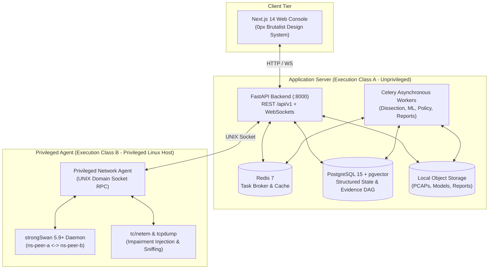

# TunnelTrace AI — IPsec Security Intelligence Platform
### Smart India Hackathon 2026 — Problem Statement ID: 26160 (PS 160)
#### Sponsoring Agency: National Technical Research Organisation (NTRO) | Theme: Blockchain & Cybersecurity

[](LICENSE)
[](PROJECT_MEMORY.md)
[](docs/architecture/DEPLOYMENT.md)
[](docs/architecture/SECURITY_THREAT_MODEL_COMPLIANCE.md)

---

## Executive Summary

**TunnelTrace AI** is an enterprise-grade, evidence-first **AI-Powered IPsec VPN Protocol Analyzer and Security Assessment Framework** developed for the **National Technical Research Organisation (NTRO)** under Smart India Hackathon 2026.

Unlike generic packet sniffers or opaque black-box AI tools, TunnelTrace AI enforces strict epistemic separation between **deterministic protocol forensics** (reconstructing IKE/ESP state machines and SPI bindings directly from packet headers) and **probabilistic machine learning** (classifying encapsulated application traffic types using packet length and timing side channels with **zero payload decryption**). It evaluates observed cryptographic postures against versioned Policy-as-Code rules (NIST SP 800-77 Rev. 1 / RFC 8221), links every finding to raw wire byte offsets, projects hardening proposals in a **Configuration Security Twin**, and verifies remediations through closed-loop re-testing in an isolated strongSwan lab.

---

## Core Capabilities & Architectural Pillars

```
┌────────────────────────────────────────────────────────────────────────┐
│                        CORE ARCHITECTURAL PILLARS                      │
├────────────────────────────────────────────────────────────────────────┤
│ 1. DETERMINISTIC PROTOCOL FORENSICS                                    │
│    IKEv1/IKEv2 state machines, cryptographic transform extraction,     │
│    bidirectional Child SA pairing, SPI mapping, and NAT-T tracking.    │
├────────────────────────────────────────────────────────────────────────┤
│ 2. ENCRYPTED TRAFFIC INFERENCE (ZERO DECRYPTION)                       │
│    Dual-ensemble classification (XGBoost + 1D-CNN) over 24 tabular     │
│    features and (3, N) packet tensors. Platt calibrated confidence     │
│    and Shannon entropy Out-of-Distribution (OOD) gating.               │
├────────────────────────────────────────────────────────────────────────┤
│ 3. DETERMINISTIC POLICY-AS-CODE & SECURITY SCORE                       │
│    YAML-driven compliance evaluation against NIST SP 800-77 Rev. 1 and  │
│    RFC 8221. Transparent, auditable 0–100 Security Score.              │
├────────────────────────────────────────────────────────────────────────┤
│ 4. CONFIGURATION SECURITY TWIN & CLOSED-LOOP REMEDIATION               │
│    What-if simulation of ciphersuite upgrades without touching live     │
│    links. Automated patch generation and re-test verification in lab.  │
├────────────────────────────────────────────────────────────────────────┤
│ 5. CRYPTOGRAPHIC EVIDENCE DAG & LOCAL RAG ASSISTANT                    │
│    Byte-level provenance tracing findings to packet frame offsets.     │
│    Grounded AI Analyst explaining RFC citations without hallucination. │
└────────────────────────────────────────────────────────────────────────┘
```

---

## Repository Documentation Index

The complete specification suite is organized into [`docs/requirements/`](docs/requirements/) and [`docs/architecture/`](docs/architecture/):

### 1. Requirements & Acceptance Documentation ([`docs/requirements/`](docs/requirements/))
- **[Product Requirements Document (PRD)](docs/requirements/PRD.md):** 60 sections detailing all functional requirements (`LAB-`, `CAP-`, `PROTO-`, `SA-`, `FLOW-`, `ML-`, `SEC-`, `REM-`).
- **[Requirements Traceability Matrix (RTM)](docs/requirements/RTM.md):** 37 sections with a 25-column matrix mapping all 55 NTRO PS requirements to components, tests, and demo proofs.
- **[Testing, Validation & Evaluation Plan](docs/requirements/TESTING_VALIDATION_PLAN.md):** 99 sections defining V&V levels L1–L10, 34 test matrices, Golden SIH Acceptance Flow, and zero-hallucination rules.
- **[User / Analyst Guide + Demo Runbook](docs/requirements/USER_GUIDE_AND_DEMO_RUNBOOK.md):** 96 sections covering analyst operations, evidence interpretation, 12-step SIH Demo Runbook, and 3-tier fallback matrix.

### 2. Architecture & Design Documentation ([`docs/architecture/`](docs/architecture/))
- **[System Architecture & Design (SAD)](docs/architecture/SYSTEM_ARCHITECTURE.md):** 77 sections, 19 Mermaid diagrams, Three Domains, Class A (unprivileged) vs. Class B (privileged) isolation.
- **[Technical Requirements & Design (TRD/TDD)](docs/architecture/TRD.md):** 87 sections with exact mathematical formulations, transform lookups, and subsystem schemas.
- **[End-to-End Workflow & Data Flow](docs/architecture/WORKFLOW.md):** 80 sections defining DFD Level 0/1/2, state machines, and the 31-step Golden SIH Demonstration Workflow.
- **[Data Architecture & Database Design](docs/architecture/DATABASE_DESIGN.md):** 85 sections defining 22 data domains, PostgreSQL 15 + `pgvector` schemas, 38-table dictionary, and Evidence DAG.
- **[ML & Dataset Engineering](docs/architecture/ML_DATASET_ENGINEERING.md):** 99 sections detailing native strongSwan dataset generation, session-level splits (`GroupKFold`), dual ensemble, calibration, and OOD.
- **[Security, Threat Model & Compliance](docs/architecture/SECURITY_THREAT_MODEL_COMPLIANCE.md):** 109 sections defining Scope A & B, Policy-as-Code, STRIDE, Asset Inventory, 10 Abuse Cases, and zero-hallucination rules.
- **[API & Integration Specification](docs/architecture/API_INTEGRATION_SPECIFICATION.md):** 95 sections defining REST `/api/v1` routes, WebSockets, async job contracts, Pydantic DTOs, and socket RPC.
- **[UI/UX & Design System Document](docs/architecture/UI_UX_DESIGN_SYSTEM.md):** 74 sections with 0px brutalist styling, Light default (`#F7F7F4`), Dark secondary, and 18 ASCII wireframes.
- **[Deployment, DevOps & Operations](docs/architecture/DEPLOYMENT.md):** 97 sections detailing the local-first Docker Compose stack, Class A/B isolation, and 17 operational runbooks.

### 3. Living Operational Context
- **[Master Project Memory](PROJECT_MEMORY.md):** Single source of living operational truth tracking all frozen decisions, repository state, and implementation milestones.

---

## High-Level System Architecture



---

## Technology Stack

| Layer | Technologies | Primary Function |
| :--- | :--- | :--- |
| **Frontend** | Next.js 14, TypeScript, Tailwind CSS, React Flow | High-density 0px brutalist SOC console, SA visualizer |
| **Backend API** | Python 3.11+, FastAPI, Pydantic v2, SQLAlchemy 2.0 | Asynchronous REST endpoints, typed DTOs, WebSockets |
| **Worker & Queue** | Celery 5.3+, Redis 7 | Asynchronous job pipeline, stage tracking, event dispatch |
| **Persistence** | PostgreSQL 15, `pgvector 0.6+` | Relational metadata, Evidence DAG, RAG vector embeddings |
| **Protocol Forensics**| TShark / PyShark, Scapy | Deterministic IKE/ESP header dissection, SPI extraction |
| **Machine Learning** | XGBoost, PyTorch (1D-CNN), TreeSHAP, scikit-learn | Encrypted traffic classification, side-channel inference |
| **Policy Engine** | PyYAML, Custom Policy Evaluator | NIST SP 800-77 / RFC 8221 Policy-as-Code evaluation |
| **VPN Testbed** | strongSwan 5.9+, Linux Network Namespaces, `tc/netem`| Controlled IKE/ESP traffic synthesis, closed-loop re-test |

---

## Getting Started (Local Development)

```bash
# 1. Clone the repository
git clone https://github.com/sharancode3/TunnelTrace-AI.git
cd TunnelTrace-AI

# 2. Review the Living Master Memory & Runbook
cat PROJECT_MEMORY.md
cat docs/requirements/USER_GUIDE_AND_DEMO_RUNBOOK.md

# 3. Development Stack (Docker Compose - Phase 1 Implementation)
docker compose up -d
```

---

## Problem Statement Attribution

- **Competition:** Smart India Hackathon (SIH) 2026, Grand Finale
- **Problem Statement ID:** `26160` (PS 160)
- **Title:** AI-Powered IPsec VPN Protocol Analyzer and Security Assessment Framework
- **Organization:** National Technical Research Organisation (NTRO)
- **Theme:** Blockchain & Cybersecurity
- **Category:** Software
