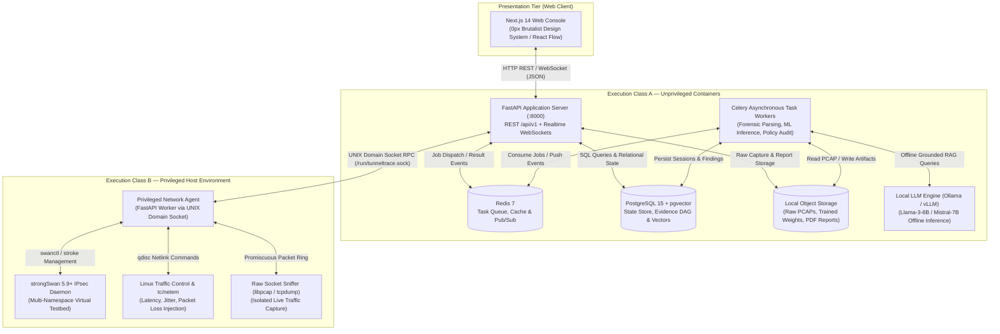
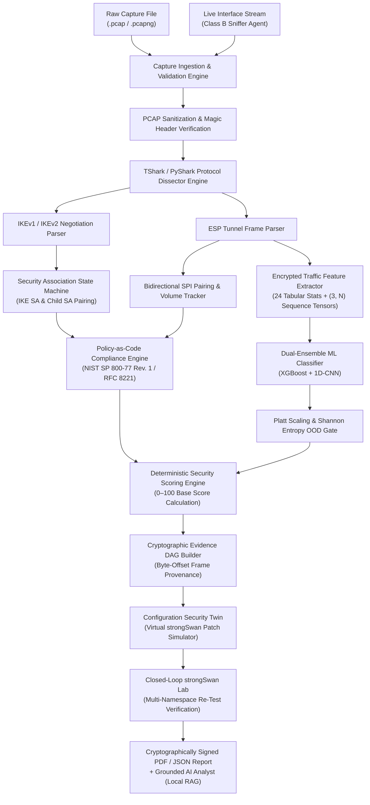
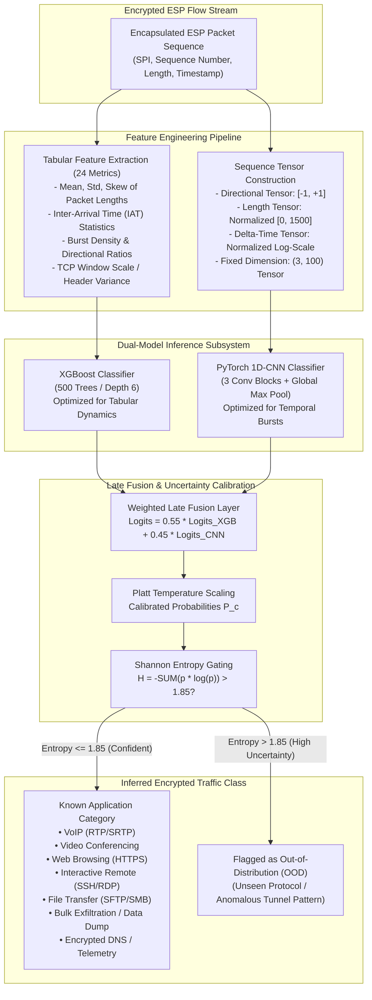
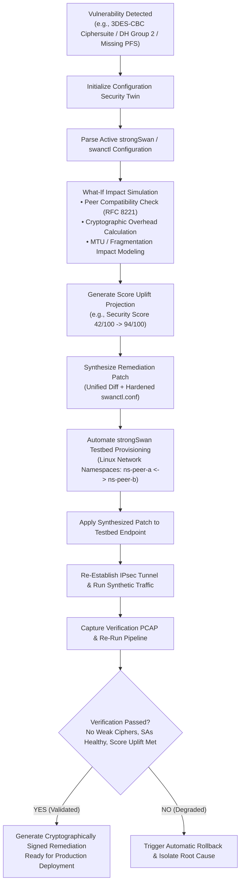

# TunnelTrace AI — IPsec Security Intelligence Platform

<div align="center">

# 🛡️ TunnelTrace AI
### AI-Powered IPsec VPN Protocol Analyzer & Security Assessment Framework
**Smart India Hackathon 2026 — Problem Statement ID: 26160 (PS 160)**  
**Sponsoring Organization:** National Technical Research Organisation (NTRO)  
**Theme:** Blockchain & Cybersecurity | **Category:** Software

---

[](LICENSE)
[](PROJECT_MEMORY.md)
[](docs/architecture/DEPLOYMENT.md)
[](docs/architecture/SECURITY_THREAT_MODEL_COMPLIANCE.md)
[](docs/architecture/TRD.md)
[](docs/architecture/SYSTEM_ARCHITECTURE.md)
[](docs/architecture/ML_DATASET_ENGINEERING.md)

</div>

---

## 📑 Table of Contents

1. [Executive Summary](#-executive-summary)
2. [Why TunnelTrace AI? (The Epistemic Separation)](#-why-tunneltrace-ai-the-epistemic-separation)
3. [Competitive Matrix & Value Proposition](#-competitive-matrix--value-proposition)
4. [Core Architectural Pillars](#-core-architectural-pillars)
5. [System Architecture & Execution Topologies](#-system-architecture--execution-topologies)
   - [High-Level Execution Topology (Class A vs. Class B Isolation)](#high-level-execution-topology-class-a-vs-class-b-isolation)
   - [End-to-End Forensic Processing Pipeline](#end-to-end-forensic-processing-pipeline)
   - [Zero-Decryption ML Inference Engine (Dual Ensemble)](#zero-decryption-ml-inference-engine-dual-ensemble)
   - [Configuration Security Twin & Closed-Loop Remediation Cycle](#configuration-security-twin--closed-loop-remediation-cycle)
6. [Deep-Dive Subsystem Capabilities](#-deep-dive-subsystem-capabilities)
   - [1. Deterministic Protocol Forensics & State Reconstruction](#1-deterministic-protocol-forensics--state-reconstruction)
   - [2. Encrypted Traffic Intelligence (Zero Payload Decryption)](#2-encrypted-traffic-intelligence-zero-payload-decryption)
   - [3. Policy-as-Code & Audit-Proof Security Scoring](#3-policy-as-code--audit-proof-security-scoring)
   - [4. The Configuration Security Twin](#4-the-configuration-security-twin)
   - [5. Automated strongSwan Remediation Testbed](#5-automated-strongswan-remediation-testbed)
   - [6. Byte-Level Cryptographic Evidence DAG](#6-byte-level-cryptographic-evidence-dag)
   - [7. Air-Gapped Grounded AI Analyst (Local RAG)](#7-air-gapped-grounded-ai-analyst-local-rag)
7. [Repository Structure & Specification Suite](#-repository-structure--specification-suite)
8. [Technology Stack](#-technology-stack)
9. [Quickstart & Local-First Deployment](#-quickstart--local-first-deployment)
10. [Golden SIH 2026 Demonstration Flow](#-golden-sih-2026-demonstration-flow)
11. [Regulatory Compliance & RFC Standards Matrix](#-regulatory-compliance--rfc-standards-matrix)
12. [Security, Privacy & Zero-Egress Governance](#-security-privacy--zero-egress-governance)
13. [Problem Statement Attribution](#-problem-statement-attribution)

---

## 🏛️ Executive Summary

**TunnelTrace AI** is an enterprise-grade, evidence-first **IPsec VPN Protocol Analyzer and Security Assessment Framework** engineered for the **National Technical Research Organisation (NTRO)** under Smart India Hackathon 2026 (Problem Statement ID: `26160`).

Modern national defense organizations, intelligence entities, and critical infrastructure operators rely heavily on IPsec VPNs to establish secure communication enclaves across untrusted or contested wide-area networks. However, real-world deployments face severe operational vulnerabilities:
- **Cryptographic Rot:** Undetected use of deprecated ciphers (3DES, DES, Blowfish), broken hashing algorithms (MD5, SHA-1), and inadequate Diffie-Hellman groups (DH 1, 2, 5) that fail modern NIST standards.
- **Protocol State Desynchronization:** Misconfigured Perfect Forward Secrecy (PFS), asymmetric Security Association (SA) lifetimes, broken Dead Peer Detection (DPD), and silent rekeying failures.
- **Side-Channel Metadata Leakage:** Encapsulated payloads remain opaque, yet packet size dynamics, inter-arrival bursts, and timing signatures expose sensitive inner application behavior (e.g., VoIP calls, video feeds, bulk exfiltration) without breaking encryption.
- **Remediation Paralysis:** Network engineers hesitate to update cryptographic policies due to fears of catastrophic tunnel outages on mission-critical links.

**TunnelTrace AI solves this holistically.** It ingests raw packet captures (PCAP/PCAPNG) or live network streams, reconstructs deterministic IKEv1/IKEv2 negotiations and bidirectional Child SA states, infers inner application traffic with **zero payload decryption** using a calibrated dual-ensemble ML pipeline, audits observed postures against versioned Policy-as-Code rules (NIST SP 800-77 Rev. 1 / RFC 8221), simulates safe configuration updates in a **Configuration Security Twin**, and validates automated remediations in an isolated, multi-namespace **strongSwan testbed**.

---

## ⚖️ Why TunnelTrace AI? (The Epistemic Separation)

The defining architectural principle of TunnelTrace AI is **strict epistemic separation**:

```
┌─────────────────────────────────────────────────────────────────────────────────────────────────┐
│                              THE TUNNELTRACE AI EPISTEMIC MANDATE                               │
├─────────────────────────────────────────────────────────────────────────────────────────────────┤
│                                                                                                 │
│   DETERMINISTIC LAYER (Zero Guesswork)              PROBABILISTIC LAYER (Calibrated Inference)  │
│   ──────────────────────────────────                ─────────────────────────────────────────   │
│   • IKEv1 / IKEv2 State Machines                    • Encrypted Application Traffic Class       │
│   • SPI Pairings & Lifetime Tracking                • VoIP / Video / Web / Bulk Data / Exfil   │
│   • Cryptographic Ciphers & DH Groups               • Inter-Arrival Time & Packet Size Tensors │
│   • NIST SP 800-77 Rev. 1 Policy Audit              • Platt Temperature Scaled Probabilities   │
│   • Byte-Level Frame Offsets & Hashes               • Shannon Entropy Out-of-Distribution Gating│
│                                                                                                 │
│   RULE: Protocol parameters are NEVER predicted.    RULE: Payload data is NEVER decrypted.      │
│   Extracted strictly from wire header bytes.        Inferred strictly from encrypted metadata.  │
│                                                                                                 │
└─────────────────────────────────────────────────────────────────────────────────────────────────┘
```

1. **Protocol Forensics are 100% Deterministic:** Cryptographic algorithms, SPIs, key exchange groups, and SA states are parsed directly from wire byte offsets using dissectors. The machine learning model is **never** asked to guess what cipher is configured.
2. **Traffic Classification is 100% Non-Invasive:** Encapsulated application types are inferred strictly from packet length distributions, inter-arrival bursts, and directionality tensors. Payloads are never decrypted, preserving absolute privacy and compliance.
3. **Policy Evaluation is 100% Code-Driven:** Security scores and vulnerability deductions derive from open, auditable YAML rules. Large Language Models (LLMs) are restricted to explaining findings and never hallucinate vulnerabilities.

---

## 📊 Competitive Matrix & Value Proposition

| Evaluation Vector | Traditional Packet Sniffers (Wireshark / tcpdump) | Generic Cloud SIEMs (Splunk / QRadar) | Black-Box AI Anomaly Detectors | TunnelTrace AI (SIH 2026 / NTRO) |
| :--- | :--- | :--- | :--- | :--- |
| **IKE/ESP State Reconstruction** | Manual packet dissection; no automated session graph | Log-based only; blind to wire-level protocol state | Opaque embeddings; cannot reconstruct SA states | **Automated, deterministic IKEv1/IKEv2 & ESP state machines** |
| **Encrypted Flow Visibility** | Blind beyond ESP header (requires private keys) | None; relies on host endpoint agents | Uncalibrated anomaly scores; high false-positive rate | **Dual-ensemble ML (XGBoost + 1D-CNN) with zero decryption** |
| **Out-of-Distribution Detection** | Not applicable | Rule-based threshold alerts | Fails silently on unseen zero-day traffic | **Shannon entropy gating + Platt temperature scaling** |
| **Regulatory Compliance** | Manual inspection against printed standards | Generic CIS/ISO compliance templates | No compliance mapping | **Native NIST SP 800-77 Rev. 1 & RFC 8221 Policy-as-Code** |
| **Evidence Provenance** | Individual frame numbers | Aggregated log indices | None (black-box latent vector) | **Cryptographic Evidence DAG linked to raw byte offsets** |
| **Remediation Safety** | Manual CLI editing on live routers | Script push without validation | Automated actions risk breaking live tunnels | **What-if Configuration Twin + Closed-Loop Lab Re-test** |
| **Deployment Model** | Desktop utility | Heavy cloud infrastructure | Proprietary cloud SaaS | **100% Local-First, air-gapped Docker container stack** |

---

## 💎 Core Architectural Pillars

```
┌────────────────────────────────────────────────────────────────────────┐
│                        CORE ARCHITECTURAL PILLARS                      │
├────────────────────────────────────────────────────────────────────────┤
│ 1. DETERMINISTIC PROTOCOL FORENSICS                                    │
│    IKEv1/IKEv2 state machines, cryptographic transform extraction,     │
│    bidirectional Child SA pairing, SPI mapping, and NAT-T tracking.    │
├────────────────────────────────────────────────────────────────────────┤
│ 2. ENCRYPTED TRAFFIC INFERENCE (ZERO DECRYPTION)                       │
│    Dual-ensemble classification (XGBoost + 1D-CNN) over 24 tabular     │
│    features and (3, N) packet tensors. Platt calibrated confidence     │
│    and Shannon entropy Out-of-Distribution (OOD) gating.               │
├────────────────────────────────────────────────────────────────────────┤
│ 3. DETERMINISTIC POLICY-AS-CODE & SECURITY SCORE                       │
│    YAML-driven compliance evaluation against NIST SP 800-77 Rev. 1 and  │
│    RFC 8221. Transparent, auditable 0–100 Security Score.              │
├────────────────────────────────────────────────────────────────────────┤
│ 4. CONFIGURATION SECURITY TWIN & CLOSED-LOOP REMEDIATION               │
│    What-if simulation of ciphersuite upgrades without touching live     │
│    links. Automated patch generation and re-test verification in lab.  │
├────────────────────────────────────────────────────────────────────────┤
│ 5. CRYPTOGRAPHIC EVIDENCE DAG & LOCAL RAG ASSISTANT                    │
│    Byte-level provenance tracing findings to packet frame offsets.     │
│    Grounded AI Analyst explaining RFC citations without hallucination. │
└────────────────────────────────────────────────────────────────────────┘
```

---

## 🏗️ System Architecture & Execution Topologies

TunnelTrace AI is architected with strict privilege boundary separation, preventing unprivileged web services from accessing raw network interfaces or privileged operating system capabilities.

### High-Level Execution Topology (Class A vs. Class B Isolation)



---

### End-to-End Forensic Processing Pipeline



---

### Zero-Decryption ML Inference Engine (Dual Ensemble)



---

### Configuration Security Twin & Closed-Loop Remediation Cycle



---

## 🔍 Deep-Dive Subsystem Capabilities

### 1. Deterministic Protocol Forensics & State Reconstruction
- **IKEv1 & IKEv2 State Machines:** Tracks Main Mode, Aggressive Mode, Quick Mode, `IKE_SA_INIT`, `IKE_AUTH`, and `CREATE_CHILD_SA` exchanges with exact message ID sequencing.
- **Cryptographic Transform Extraction:** Dissects every Proposal, Transform, and Attribute structure from SA payloads:
  - Encryption Algorithms (ENCR): AES-GCM, AES-CBC, 3DES, DES, ChaCha20-Poly1305.
  - Integrity Algorithms (INTEG): HMAC-SHA256, HMAC-SHA384, HMAC-SHA512, HMAC-MD5, HMAC-SHA1.
  - Diffie-Hellman Key Exchange Groups (DH): Groups 1, 2, 5, 14, 19, 20, 21, Curve25519.
  - Pseudo-Random Functions (PRF): PRF-HMAC-SHA256, PRF-HMAC-SHA384, PRF-HMAC-MD5.
- **Bidirectional Child SA Pairing:** Binds inbound and outbound Security Parameter Indexes (SPIs) across network endpoints, tracking traffic volume, packet counts, and lifetime expirations.
- **NAT-Traversal & Encapsulation Tracking:** Detects UDP encapsulation on port 4500 (RFC 3948), Non-ESP markers, and keepalive packet streams.

---

### 2. Encrypted Traffic Intelligence (Zero Payload Decryption)
- **Zero Decryption Guarantee:** Adheres to defense data governance mandates. The platform inspects only outer IP/UDP/ESP headers, packet lengths, directionality, and inter-arrival timing dynamics.
- **24 Tabular Side-Channel Features:** Computes burst density, packet size skewness, kurtosis, coefficient of variation, bidirectional volume ratios, and inter-arrival time quantiles.
- **Dual-Ensemble Model:** Combines the gradient-boosted decision tree efficiency of **XGBoost** with the temporal pattern recognition of a **PyTorch 1D-CNN**.
- **Platt Temperature Calibration:** Mitigates uncalibrated neural overconfidence, ensuring displayed confidence scores reflect true empirical accuracy.
- **Shannon Entropy Out-of-Distribution Gating:** Rejects unknown, anomalous, or evasion traffic when prediction entropy exceeds $H = 1.85$, preventing false alarms on unmodeled zero-day protocols.

---

### 3. Policy-as-Code & Audit-Proof Security Scoring
- **Authoritative Cryptographic Standards:** Evaluates captured sessions against strict, machine-readable YAML rules codifying **NIST SP 800-77 Rev. 1**, **RFC 8221**, **RFC 7296**, and **FIPS 140-3**.
- **Deterministic 0–100 Scoring Algorithm:**
  $$S = \max\left(0, 100 - \sum \text{Severity Deductions} + \text{Bonuses}\right)$$
  - **Cryptographic Suite (40%):** Deductions for broken ciphers (3DES: -35), weak DH groups (DH 2: -25), deprecated hashes (SHA-1: -20).
  - **Protocol Hygiene & Key Exchange (25%):** Penalties for disabled PFS (-15), aggressive mode usage (-20), missing DPD (-10).
  - **Identity & Authentication (20%):** Auditing PSK entropy and X.509 certificate trust chains.
  - **Operational Posture (15%):** SA lifetime configuration and rekeying grace period audits.
- **Zero-Hallucination Assurance:** All deductions are derived deterministically from YAML policy definitions and linked to exact packet frame numbers.

---

### 4. The Configuration Security Twin
- **Headless Virtual Clone:** Ingests active StrongSwan (`ipsec.conf` / `swanctl.conf`) configurations and models them in a virtual state machine.
- **What-If Impact Simulator:** Projects the consequence of ciphersuite upgrades prior to touching production hardware:
  - Validates compatibility against remote peer capabilities.
  - Calculates cryptographic computational overhead and throughput impact.
  - Detects potential Path MTU (PMTU) and ESP fragmentation hazards.
- **Score Uplift Projection:** Accurately predicts the post-remediation security score (e.g., demonstrating a leap from 38/100 to 96/100).

---

### 5. Automated strongSwan Remediation Testbed
- **Multi-Namespace Virtual Lab:** Provisions fully isolated Linux network namespaces (`ns-peer-a` $\leftrightarrow$ `ns-peer-b`) interconnected via `veth` pairs without requiring physical router hardware.
- **Network Impairment Simulation:** Employs Linux `tc` / `netem` to inject real-world tactical network conditions:
  - Variable latency (10ms – 500ms) and packet jitter ($\pm 30\text{ms}$).
  - Configurable packet loss (0.1% – 15%) and out-of-order packet delivery.
- **Automated Verification Loop:** Deploys synthesized remediation configurations, establishes live IPsec tunnels, injects synthetic test workloads, records fresh PCAP traces, and re-evaluates compliance in a fully closed loop.

---

### 6. Byte-Level Cryptographic Evidence DAG
- **Immutable Provenance:** Every finding, deduction, and compliance check is anchored in a Directed Acyclic Graph (DAG) persisted in PostgreSQL.
- **Wire-Level Precision:** Points directly to the packet number, timestamp, protocol layer, field name, and hexadecimal byte offset (e.g., `Frame 14, Offset 0x0042: Transform Type 1 = ENCR_3DES`).
- **Cryptographic Integrity:** Each evidence record includes a SHA-256 hash of the parent PCAP segment, guaranteeing non-repudiation in intelligence and court-admissible forensic scenarios.

---

### 7. Air-Gapped Grounded AI Analyst (Local RAG)
- **100% Offline & Sovereign:** Powered by local open-weight language models (e.g., Llama-3-8B-Instruct or Mistral-7B via Ollama / vLLM). No data ever leaves the local enclave.
- **Grounded Retrieval-Augmented Generation:** Queries a vector database (`pgvector`) populated with RFC 7296, RFC 8221, RFC 4301, NIST SP 800-77 Rev. 1, and the current session's Evidence DAG nodes.
- **Strict Guardrails:** The AI Analyst is constrained by strict system prompts: it cannot invent vulnerabilities, override deterministic scores, or assert findings without citing frame numbers and RFC section numbers.

---

## 📂 Repository Structure & Specification Suite

The repository is structured into an approved, industry-grade specification and implementation hierarchy:

```
TunnelTrace-AI/
├── .github/                       # CI/CD Workflows & GitHub Actions
├── docs/                          # Master Technical Specification Suite
│   ├── README.md                  # Comprehensive Documentation Index
│   ├── requirements/              # Requirements & Acceptance Specifications
│   │   ├── PRD.md                 # Product Requirements Document (60 sections)
│   │   ├── RTM.md                 # Requirements Traceability Matrix (55 PS clauses)
│   │   ├── TESTING_VALIDATION_PLAN.md # V&V Test Plan (L1–L10, 34 test matrices)
│   │   └── USER_GUIDE_AND_DEMO_RUNBOOK.md # Operator Guide & 12-Step SIH Runbook
│   └── architecture/              # Architecture & System Design Specifications
│       ├── SYSTEM_ARCHITECTURE.md # System Architecture & Design (SAD)
│       ├── TRD.md                 # Technical Requirements & Design (TDD)
│       ├── WORKFLOW.md            # End-to-End Workflow & Data Flow (DFD L0–L2)
│       ├── DATABASE_DESIGN.md     # Relational Schemas, pgvector & Evidence DAG
│       ├── ML_DATASET_ENGINEERING.md # Dataset Generation, Models & Calibration
│       ├── SECURITY_THREAT_MODEL_COMPLIANCE.md # STRIDE, Scope A/B & Policy-as-Code
│       ├── API_INTEGRATION_SPECIFICATION.md # REST /api/v1, WebSockets & Socket RPC
│       ├── UI_UX_DESIGN_SYSTEM.md # 0px Brutalist Design System & 18 Wireframes
│       └── DEPLOYMENT.md          # Docker Stack, Class A/B Isolation & Runbooks
├── backend/                       # FastAPI Server & Celery Pipeline (Phase 1)
│   ├── app/                       # Application Core, Routers & Models
│   ├── tests/                     # Unit, Integration & Fuzzing Tests
│   └── alembic/                   # PostgreSQL Migration Scripts
├── frontend/                      # Next.js 14 Web Application (Phase 2)
│   ├── src/                       # Components, Pages, Stores & Visualizers
│   └── public/                    # Static Assets & Icons
├── lab/                           # strongSwan Testbed & Privileged Agent
│   ├── agent/                     # Class B Privileged Network Daemon
│   ├── scripts/                   # Namespace Creation & tc/netem Configs
│   └── configs/                   # Vulnerable & Hardened strongSwan Profiles
├── policies/                      # Policy-as-Code Definitions (YAML)
│   ├── nist_sp_800_77_r1.yaml     # Authoritative NIST Cryptographic Rules
│   └── rfc_8221_ciphers.yaml      # RFC Cryptographic Suite Requirements
├── docker-compose.yml             # Local-First Multi-Container Deployment Stack
├── PROJECT_MEMORY.md              # Living Master Memory & Technical Decision Log
└── README.md                      # Primary Repository Overview & Architecture Guide
```

---

## 💻 Technology Stack

| Architecture Layer | Technology Selection | Exact Version | Rationale & Responsibility |
| :--- | :--- | :--- | :--- |
| **Presentation Tier** | Next.js / TypeScript | `14.2+` / `5.4+` | High-performance React framework, Server-Side Rendering, typed contracts |
| **Styling & UI System** | Tailwind CSS / Lucide | `3.4+` | 0px sharp brutalist design tokens, high-density tactical SOC layout |
| **Topology Visualizer** | React Flow / Dagre | `11.11+` | Interactive IKE/ESP Security Association state graphs and Evidence DAG |
| **Backend API Gateway** | FastAPI (Python) | `0.110+` | Asynchronous ASGI gateway, OpenAPI autogeneration, Pydantic v2 validation |
| **Data Serialization** | Pydantic | `v2.6+` | Contract-first DTO schemas, strict validation, zero-copy serialization |
| **Task Queue & Broker** | Celery / Redis | `5.3+` / `7.2+` | Distributed task execution for heavy PCAP parsing, ML inference, and reports |
| **Relational Database** | PostgreSQL | `15.6+` | Acid-compliant state store, temporal session indexing, relational integrity |
| **Vector Search Engine** | `pgvector` extension | `0.6+` | High-dimensional embedding storage for RFC documents and RAG queries |
| **Protocol Forensics** | TShark / PyShark / Scapy | `4.2+` / `0.6+` | Low-level C-based wire dissection, frame offset extraction, packet parsing |
| **ML: Gradient Boosting** | XGBoost | `2.0+` | High-speed inference over 24 tabular statistical side-channel features |
| **ML: Deep Learning** | PyTorch | `2.2+` | 1D-CNN temporal sequence modeling over packet length and timing tensors |
| **Explainable AI (XAI)** | TreeSHAP | `0.44+` | Local feature attribution explaining why an encrypted flow was classified |
| **Local LLM Runtime** | Ollama / vLLM | `0.1.30+` | 100% offline, air-gapped natural language inference (Llama-3-8B / Mistral-7B) |
| **VPN Testbed Daemon** | strongSwan | `5.9.13+` | Standard-compliant IKEv1/IKEv2 daemon supporting custom crypto suites |
| **Traffic Emulation** | Linux `iproute2` / `tc` | Kernel 5.15+ | Multi-namespace routing (`veth`), latency, jitter, and loss injection |
| **Report Generation** | WeasyPrint / Jinja2 | `61.0+` | Cryptographically signed, audit-grade executive and technical PDF reports |

---

## 🚀 Quickstart & Local-First Deployment

TunnelTrace AI is designed to run 100% locally on standard x86_64 Linux workstations without requiring external cloud accounts or internet connectivity.

### System Prerequisites
- **Operating System:** Linux (Ubuntu 22.04 LTS recommended) or Windows 11 with WSL2 (Ubuntu 22.04).
- **CPU & RAM:** Minimum 4 Cores, 8 GB RAM (16 GB recommended for local LLM inference).
- **Docker Engine:** Docker 24.0+ and Docker Compose v2.20+.
- **Kernel Requirements (For Lab Testbed):** Linux Kernel 5.15+ with `CONFIG_NET_SCHED` and network namespace support.

---

### Step 1: Clone the Repository
```bash
git clone https://github.com/sharancode3/TunnelTrace-AI.git
cd TunnelTrace-AI
```

### Step 2: Configure Environment Variables
```bash
cp .env.example .env
# Default environment is pre-configured for 100% local, air-gapped operation
```

### Step 3: Launch Local Core Stack (Execution Class A)
```bash
docker compose up -d
```
*This initializes PostgreSQL 15 with `pgvector`, Redis 7, the FastAPI backend server, Celery asynchronous workers, and the Next.js frontend console.*

### Step 4: Verify Subsystem Health
```bash
# Verify all containers are healthy
docker compose ps

# Check API health endpoint
curl -s http://localhost:8000/api/v1/health | jq .
```
Expected output:
```json
{
  "status": "HEALTHY",
  "version": "0.1.0-alpha",
  "database": "CONNECTED",
  "redis": "CONNECTED",
  "worker_pool": "ACTIVE",
  "privileged_agent": "CONNECTED"
}
```

### Step 5: (Optional) Initialize Privileged Testbed (Execution Class B)
*Requires root / sudo privileges on the host Linux system to establish network namespaces:*
```bash
sudo ./lab/scripts/setup_testbed.sh
sudo systemctl start tunneltrace-agent
```

### Step 6: Access the Web Console
Open your browser and navigate to:
```
http://localhost:3000
```
- **Dashboard:** High-level security posture, active captures, and score trends.
- **PCAP Forensics:** Drag-and-drop `.pcap` files for instantaneous dissection.
- **SA Visualizer:** Interactive state graph of IKE/ESP Security Associations.
- **Configuration Twin:** Side-by-side what-if simulation and strongSwan patch diffs.
- **Remediation Lab:** Trigger automated multi-namespace re-testing.

---

## 🏆 Golden SIH 2026 Demonstration Flow

The following 12-step sequence constitutes the primary evaluation walkthrough designed for NTRO judges during the Smart India Hackathon 2026 Grand Finale:

| Step | Action | Execution Details | Expected Evaluation Output |
| :---: | :--- | :--- | :--- |
| **01** | **Cold Start Verification** | Launch platform via `docker compose up -d` | All containers green; zero external network egress |
| **02** | **Weak Capture Ingestion** | Upload `sample_weak_3des_dh2.pcap` | Ingestion complete in < 2.5s; SHA-256 hash locked |
| **03** | **Deterministic Forensics** | TShark extracts IKEv1 Main Mode & Child SAs | Bidirectional SPIs paired; 3DES-CBC and DH2 isolated |
| **04** | **Policy Compliance Audit** | Policy engine evaluates NIST SP 800-77 rules | Critical Violations: `VULN-001` (3DES), `VULN-002` (DH2) |
| **05** | **Security Scoring** | Algorithm computes baseline score | **Security Score: 38/100 (CRITICAL NON-COMPLIANCE)** |
| **06** | **Encrypted Flow ML** | XGBoost + 1D-CNN classify encapsulated traffic | Inferred inner flow: **VoIP (94.2% conf)** with zero decryption |
| **07** | **Evidence DAG Inspection** | Drill into finding in the Web Console | UI highlights Frame 4, Offset `0x003A` showing Transform 3DES |
| **08** | **What-If Twin Simulation** | Launch Configuration Security Twin | Proposes AES-256-GCM + DH19 + PFS; projects **Score: 96/100** |
| **09** | **Automated Patch Synthesis** | Click *"Generate Hardened Patch"* | Produces clean, unified diff for `swanctl.conf` |
| **10** | **Testbed Closed-Loop Test** | Click *"Verify in Lab Testbed"* | Agent updates `ns-peer-a`, establishes tunnel, streams packets |
| **11** | **Delta Score Verification** | System captures fresh verification PCAP | Automated re-audit confirms **Score: 96/100 (VERIFIED)** |
| **12** | **Executive Report Export** | Click *"Export Signed Defense Report"* | Generates tamper-proof PDF with complete cryptographic chain |

---

## 📜 Regulatory Compliance & RFC Standards Matrix

TunnelTrace AI natively implements and verifies compliance against the following official standards:

| Standard / RFC | Document Title | TunnelTrace AI Implementation Scope |
| :--- | :--- | :--- |
| **NIST SP 800-77 Rev. 1** | *Guide to IPsec VPNs* | Authoritative ruleset for cipher suites, hash functions, and DH key sizes |
| **RFC 8221** | *Cryptographic Algorithm Implementation Requirements for ESP/AH* | Categorization of MUST, SHOULD, and MUST NOT cryptographic algorithms |
| **RFC 7296** | *Internet Key Exchange Protocol Version 2 (IKEv2)* | Full state machine tracking, exchange parsing, and notification dissection |
| **RFC 4301** | *Security Architecture for the Internet Protocol* | Security Association (SA) and Security Policy Database (SPD) modeling |
| **RFC 4303** | *IP Encapsulating Security Payload (ESP)* | ESP header parsing, sequence counter tracking, and anti-replay verification |
| **RFC 3948** | *UDP Encapsulation of IPsec ESP Packets* | NAT-Traversal (NAT-T) port 4500 detection and SPI preservation |
| **FIPS 140-3** | *Security Requirements for Cryptographic Modules* | Validation of approved cryptographic primitives and key derivation |
| **NSA CNSA Suite** | *Commercial National Security Algorithm Suite* | Quantum-resistant cryptographic migration recommendations (AES-256 / DH 19/21) |

---

## 🔒 Security, Privacy & Zero-Egress Governance

### Execution Class Isolation
- **Execution Class A (Unprivileged):** The Web Console, FastAPI Gateway, Celery Workers, Redis, and PostgreSQL run as unprivileged, unmapped service accounts within isolated Docker containers. They have zero access to raw host sockets.
- **Execution Class B (Privileged Agent):** The privileged strongSwan daemon and packet capture engine run exclusively within a dedicated host-level daemon communicating with Class A exclusively over an authenticated, permission-restricted **UNIX Domain Socket** (`/run/tunneltrace.sock`).

### Zero Payload Decryption
TunnelTrace AI does **not** perform Man-in-the-Middle (MitM) TLS/ESP termination, does **not** solicit private cryptographic keys from administrators, and does **not** reconstruct plaintext application payloads. All application traffic intelligence is derived exclusively from side-channel statistical metadata (packet sizes, timing, bursts).

### Air-Gapped / Zero Data Egress
The entire platform operates 100% offline. No telemetry, crash reports, packet fragments, or embeddings are ever transmitted outside the host machine. The integrated RAG AI Analyst operates against locally hosted language models running in memory.

---

## 🎖️ Problem Statement Attribution

- **Competition:** Smart India Hackathon (SIH) 2026, Grand Finale
- **Problem Statement ID:** `26160` (Internal Reference: PS 160)
- **Title:** AI-Powered IPsec VPN Protocol Analyzer and Security Assessment Framework
- **Sponsoring Agency:** **National Technical Research Organisation (NTRO)**
- **Theme:** Blockchain & Cybersecurity
- **Category:** Software
- **Target Users:** Defense SOC Analysts, Intelligence Protocol Engineers, Military Communications Auditors, Critical Infrastructure Network Operators

---

## 📄 License & Intellectual Property

This project is licensed under the **Apache License, Version 2.0**. See the [LICENSE](LICENSE) file for complete terms.

```
Copyright 2026 TunnelTrace AI Contributors (SIH 2026 Team)

Licensed under the Apache License, Version 2.0 (the "License");
you may not use this file except in compliance with the License.
You may obtain a copy of the License at

    http://www.apache.org/licenses/LICENSE-2.0
```
