# TunnelTrace AI
## Overall Requirements, Solution & System Architecture Document

### Project Identification
* **Project Name:** TunnelTrace AI
* **Competition:** Smart India Hackathon 2026
* **Problem Statement ID:** 26160
* **Problem Statement Title:** AI-Powered IPsec VPN Protocol Analyzer and Security Assessment Framework
* **Organization:** National Technical Research Organisation (NTRO)
* **Theme:** Blockchain & Cybersecurity
* **Category:** Software
* **Target Audience:** Academic Mentors, Technical Evaluators, System Architects

---

## 1. Executive Summary

Virtual Private Networks (VPNs) based on the IPsec protocol suite represent the core cryptographic perimeter safeguarding national defense, critical infrastructure, intelligence backbones, and enterprise wide-area networks. When functioning correctly, IPsec tunnels provide confidentiality, data origin authentication, connectionless integrity, and anti-replay protection. However, the security posture of an IPsec tunnel is entirely contingent on its operational configuration: negotiated protocol versions (IKEv1 vs. IKEv2), operational modes (Tunnel vs. Transport), cipher algorithms, integrity transforms, Diffie-Hellman (DH) exchange groups, key lifetimes, rekeying mechanisms, and encapsulation parameters.

Traditional network analysis tools—most notably Wireshark, TShark, and tcpdump—provide granular packet dissections, hex dumps, and protocol decodes. However, they suffer from three critical architectural limitations:
1. **Passive Dissection Without Configuration Reconstruction:** They display raw, isolated frames without statefully correlating IKE handshakes and dynamic Child Security Associations (SAs) into a coherent, bidirectional VPN topology.
2. **Total Blindness to Encrypted Payloads:** When Encapsulating Security Payload (ESP) encrypts inner IP packets, existing tools treat the traffic as an opaque stream of hex bytes, providing zero visibility into what broad applications (e.g., VoIP, bulk file transfer, video streaming) are traversing the tunnel.
3. **Absence of Grounded Compliance Auditing & Remediation:** They do not audit observed cryptographic transforms against authoritative national standards (such as NIST SP 800-77 Rev. 1 or RFC 8221), cannot project the impact of configuration changes, and provide no mechanism to validate proposed remediations on real network interfaces.

**TunnelTrace AI** directly bridges this operational divide.

> **Core Product Positioning:**  
> TunnelTrace AI is an explainable IPsec Security Intelligence Platform that reconstructs VPN configurations from network evidence, infers traffic behavior inside encrypted ESP flows without decrypting payloads, evaluates VPN security against versioned standards-based policies, traces findings back to packet-level evidence, and supports closed-loop remediation validation in a controlled IPsec testbed.

The system is engineered upon a foundational principle of **Hybrid Intelligence**:
* **Deterministic Protocol Forensics:** Dissects observable packets via standards-compliant parsers with 100% mathematical reproducibility. Observable fields (SPIs, transform IDs, IKE versions, DH groups, modes) are never guessed or predicted by AI.
* **Metadata-Only Encrypted Traffic Machine Learning:** Extracts temporal, directional, and statistical characteristics from opaque ESP flows to predict broad application traffic categories without attempting or requiring payload decryption.
* **Deterministic Policy-as-Code Engine:** Assesses extracted configurations against versioned YAML rules mapped directly to NIST SP 800-77 Rev. 1, RFC 8221, and RFC 8247 standards.
* **Grounded AI Analyst:** Leverages a local Retrieval-Augmented Generation (RAG) architecture to explain findings, cite standards, and draft configurations strictly anchored to verified database facts, completely eliminating generative hallucinations.

By combining deep protocol forensics, privacy-preserving machine learning, standards compliance auditing, a Configuration Security Twin, and closed-loop strongSwan testbed verification, TunnelTrace AI delivers an unbroken operational workflow from initial packet capture to validated security remediation.

---

## 2. Official Problem Statement

### 2.1 Context and Background
Virtual Private Networks (VPNs) are critical components of modern network infrastructure, securing communications across untrusted public and private networks. Among various VPN implementations, IPsec (Internet Protocol Security) is widely deployed due to its strong security guarantees, operating at the network layer (Layer 3) to protect all higher-layer protocols.

The real-world security of an IPsec implementation depends heavily on:
* Cryptographic algorithms chosen for encryption (e.g., 3DES, AES-CBC, AES-GCM).
* Authentication and integrity mechanisms (e.g., HMAC-MD5, HMAC-SHA1, HMAC-SHA256, AEAD).
* Key exchange mechanisms and Diffie-Hellman parameters (e.g., MODP-1024, MODP-2048, ECP-256).
* Operational mode (Tunnel Mode vs. Transport Mode).
* Key management practices, lifetime expirations, and dynamic rekeying intervals.
* System implementation details, encapsulation headers (NAT-Traversal on UDP 4500), and outer IP routing.

Traditional packet-analysis utilities provide low-level packet decodes but place an immense cognitive burden on human analysts, who must manually inspect thousands of frames, cross-reference RFC specifications, decode hexadecimal transform parameters, identify subtle misconfigurations, and assess whether legacy, deprecated, or vulnerable cryptographic primitives are active.

### 2.2 Official Problem Mandate
The official Smart India Hackathon Problem Statement (PS ID: 26160), released by the National Technical Research Organisation (NTRO), mandates the development of an automated, AI-powered system capable of:
1. **Inspecting Network Traffic:** Ingesting offline packet traces (PCAP/PCAPNG) and intercepting live network interface streams.
2. **Identifying Protocol Characteristics:** Automatically identifying IPsec protocol components (IKEv1, IKEv2, ESP, and AH where present), determining operational modes, extracting encryption/integrity transforms, and extracting Security Association (SA) parameters.
3. **Classifying Inner Encrypted Traffic:** Applying machine learning to predict the broad nature of encrypted traffic flowing inside ESP tunnels without breaking encryption.
4. **Evaluating Cryptographic Security:** Conducting an automated security audit of the observed parameters against modern standards, checking for deprecated ciphers, weak key exchange parameters, and missing security controls.
5. **Generating Comprehensive Outputs:** Delivering a holistic security assessment comprising quantitative posture scores, risk ratings, threat matrices, technical reports, executive summaries, and calibrated AI confidence metrics.

---

## 3. Why the Problem Matters

1. **Strategic Defense & National Infrastructure:** Critical government links, military telemetry, and sovereign data centers rely on IPsec tunnels. Undetected cryptographic obsolescence (such as residual 3DES or 1024-bit Diffie-Hellman) leaves state infrastructure vulnerable to advanced persistent threats and nation-state cryptanalytic attacks (e.g., Sweet32, Logjam).
2. **Operational Configuration Drift:** In large enterprise and defense networks, VPN tunnels established years ago continue running with legacy, insecure defaults because network teams fear disrupting mission-critical communications. Without automated posture auditing, these silent vulnerabilities remain invisible until a breach occurs.
3. **The Blindness of Payload Encryption:** Network defenders cannot inspect payload contents inside ESP tunnels without terminating the tunnel or violating communications privacy. Inferring whether an active tunnel carries interactive remote management, unauthorized video streaming, or bulk exfiltration requires sophisticated traffic flow intelligence based purely on packet sizes, timing, and directionality.
4. **Cognitive Load in Security Operations Centers (SOCs):** SOC analysts triage thousands of alerts daily. They lack the specialized cryptanalytic expertise required to manually audit IKE proposals against NIST guidelines. An automated system that translates raw wire frames into definitive pass/fail findings, grounded citations, and verified configuration remediations provides immense operational leverage.

---

## 4. Official Requirement Breakdown

The official NTRO Problem Statement 26160 encompasses six core functional pillars (Sections A through F). The following breakdown details every mandatory requirement, the corresponding implementation in TunnelTrace AI, and the verified operational output:

### Pillar A: VPN Testbed Generation
* **Tunnel Mode:** Automated strongSwan lab orchestrator provisions gateway-to-gateway topologies encapsulating complete inner IP packets.
* **Transport Mode:** Provisions host-to-host topologies inserting ESP headers between the original IP header and Layer 4 payload.
* **AES-128 Encryption:** Provisions standard 128-bit AES transform profiles across CBC and GCM modes.
* **AES-256 Encryption:** Provisions high-assurance 256-bit AES transform profiles.
* **AES-GCM Authenticated Encryption:** Provisions modern AEAD ciphers (AES-GCM-16) combining confidentiality and integrity without separate HMACs.
* **AES-CBC + HMAC Legacy Combinations:** Provisions traditional cipher block chaining paired with HMAC-SHA1 and HMAC-SHA256.
* **Multiple Diffie-Hellman Groups:** Provisions Diffie-Hellman Key Exchange Groups: Group 2 (MODP-1024), Group 14 (MODP-2048), Group 19 (ECP-256), Group 20 (ECP-384), and Group 21 (ECP-521).
* **Perfect Forward Secrecy (PFS) Enabled:** Configures explicit Child SA renegotiation requiring independent ephemeral Diffie-Hellman exchanges.
* **Perfect Forward Secrecy (PFS) Disabled:** Configures Child SA rekeying utilizing original IKE SA keying material.
* **IPv4 Encapsulated Communication:** Provisions pure IPv4 outer and inner addressing topologies.
* **IPv6 Encapsulated Communication:** Provisions IPv6 outer transport and dual-stack tunnel addressing.
* **VoIP Traffic Simulation:** Synthetic RTP/SIP traffic injection utilizing realistic codecs (e.g., G.711 / G.729 packet cadence and bidirectional symmetric flows).
* **WhatsApp / Messaging Simulation:** Interactive chat traffic modeling characterized by short, sporadic message bursts and keepalive heartbeats.
* **E-mail Traffic Simulation:** Synthetic IMAP/SMTP workloads featuring structured text commands and periodic payload attachments.
* **Web Browsing Traffic Simulation:** Synthetic HTTP/HTTPS browsing sessions featuring asymmetric request/response cascades and parallel connection bursts.
* **ICMP Diagnostic Simulation:** Periodic ping and echo request/reply diagnostic streams.
* **Video Streaming Traffic Simulation:** Sustained downstream high-bitrate video streams characterized by large packet sizes and variable bitrate burstiness.

### Pillar B: Traffic Capture
* **IKE Protocol Negotiation Interception:** Intercepts UDP port 500 / 4500 handshakes across IKE_SA_INIT and IKE_AUTH exchanges.
* **ESP Packet Capture:** Captures IP protocol 50 datagrams across both standard raw IP and UDP-encapsulated NAT-Traversal channels.
* **AH Packet Capture:** Ingests and parses IP protocol 51 (Authentication Header) packets where present in legacy captures.
* **Normal Communication Background Traffic:** Represents standard enterprise background traffic patterns in baseline capture sessions.
* **Offline PCAP/PCAPNG Trace Analysis:** Dedicated asynchronous file ingestion pipeline supporting multi-gigabyte forensic capture files.
* **Live Network Interface Stream Capture:** Controlled, authorized packet capture agent bound to local physical or virtual network interfaces via libpcap.

### Pillar C: AI-Based Protocol Identification
* **IPsec Protocol Identification:** Deterministic layer-3/layer-4 filtering identifying IKE, ESP, and AH protocol structures.
* **IKE Version Identification:** Strict byte-offset extraction differentiating IKEv1 (Major 1, Minor 0) from IKEv2 (Major 2, Minor 0).
* **Tunnel vs. Transport Mode Identification:** Mode inference based on observable outer headers, traffic selectors, and encapsulation context.
* **Encryption Algorithm Identification:** Deterministic mapping of transform proposal attributes against authoritative IANA registries.
* **Authentication / Integrity Algorithm Identification:** Deterministic extraction of integrity and PRF algorithms from observable proposals.
* **Key-Exchange Method Identification:** Deterministic extraction of Key Exchange (KE) payloads and negotiated DH Group IDs.
* **Security Association (SA) Parameter Extraction:** Extraction of inbound/outbound Security Parameter Indexes (SPIs), sequence counters, and lifetime parameters.
* **Encrypted ESP Inner Traffic Classification:** Primary supervised machine learning classification inferring broad workload categories from encrypted ESP flow metadata.

### Pillar D: Security Assessment
* **Cryptographic Strength Audit:** Evaluates effective bit-level strength of all negotiated symmetric ciphers and asymmetric key exchange groups.
* **Configuration Compliance Audit:** Audits extracted configurations against formal rules derived from NIST SP 800-77 Rev. 1, RFC 8221, and RFC 8247.
* **SA Parameter Evaluation:** Validates lifetime limits, rekey boundaries, and traffic selector restrictions.
* **Key Lifetime & Rekeying Evaluation:** Analyzes packet volume and elapsed session duration against recommended cryptographic rekeying thresholds.
* **Anti-Replay Protection Evaluation:** Evaluates sequence number monotonicity and flags potential replay window vulnerabilities.
* **Forward Secrecy (PFS) Rigor Assessment:** Audits whether Child SAs execute independent DH exchanges upon rekeying.
* **Cipher-Suite Strength & Vulnerability Scoring:** Flags known cryptanalytic weaknesses (e.g., Sweet32 collision vulnerabilities on 64-bit block ciphers like 3DES; precomputation attacks on 1024-bit DH).
* **Metadata Exposure & Side-Channel Assessment:** Computes a quantitative Metadata Fingerprintability Index measuring application distinguishing patterns.

### Pillar E: Required Outputs
* **Comprehensive Security Score:** Quantitative 0–100 posture score derived from itemized, deterministic rule deductions.
* **Encrypted Traffic Analysis & Class Distribution:** Inferred traffic breakdown across application classes with calibrated confidence ratings.
* **Metadata Exposure Inference:** Side-channel risk assessment documenting application distinguishability.
* **Executive Summary Report:** Publication-grade PDF report summarizing overall posture, compliance state, and high-level risk for leadership.
* **Technical Deep-Dive Audit Report:** Comprehensive PDF/HTML audit report containing frame-level findings, hex evidence, and exact remediation directives.
* **Categorized Risk Score:** Structured qualitative risk classifications (CRITICAL, HIGH, MEDIUM, LOW, INFORMATIONAL).
* **Dynamic Threat Matrix:** Threat catalog mapping findings to STRIDE categories, CVE references, and attack consequences.
* **Calibrated AI Confidence Score:** Mathematically calibrated probability metric (0–100%) indicating the reliability of ML traffic inferences.

### Pillar F: Expected Deliverables
* **Working Software Prototype:** Fully integrated, containerized platform deployable via Docker Compose.
* **AI Classification Engine:** Calibrated machine learning pipeline combining XGBoost and 1D-CNN architectures.
* **Interactive Web Dashboard:** High-performance, responsive Next.js Progressive Web Application (PWA).
* **Security Assessment Report:** Automated report generation engine producing publication-quality PDF and HTML artifacts.
* **Live Demonstration Runbook & Video:** Scripted, unbroken demonstration validating the entire end-to-end lifecycle in a controlled testbed.
* **Comprehensive Technical Documentation:** Master documentation suite spanning architectural, requirements, workflow, and verification specifications.
* **Curated IPsec Training & Validation Dataset:** Session-isolated IPsec traffic corpus complete with verified ground-truth metadata.

---

## 5. Requirement-to-Solution Mapping Matrix

The following matrix provides formal, unbroken traceability from every official SIH requirement clause to its architectural component, processing methodology, and tangible output:

| Official PS Clause | Requirement Description | Architectural Subsystem | Processing Methodology | Tangible Platform Output |
| :--- | :--- | :--- | :--- | :--- |
| `PS-LAB-001` | Tunnel Mode Testbed | strongSwan Lab Orchestrator | Linux Network Namespaces (`netns`) + swanctl | Verified Tunnel Mode capture fixtures |
| `PS-LAB-002` | Transport Mode Testbed | strongSwan Lab Orchestrator | Host-to-host strongSwan configuration | Verified Transport Mode capture fixtures |
| `PS-LAB-003/004` | AES-128 / AES-256 | strongSwan Lab Orchestrator | Cryptographic proposal automation | Ciphersuite test matrices in lab |
| `PS-LAB-005/006` | AES-GCM / CBC+HMAC | strongSwan Lab Orchestrator | AEAD vs. legacy cipher permutation scripts | Verified AEAD and legacy testbed traces |
| `PS-LAB-007` | DH Groups 2, 14, 19, 20, 21 | strongSwan Lab Orchestrator | Automated key exchange transform matrix | Handshake traces across DH spectrum |
| `PS-LAB-008/009` | PFS Enabled vs. Disabled | strongSwan Lab Orchestrator | Swanctl `esp` proposal with/without DH group | Rekeyed Child SA traces verifying PFS |
| `PS-LAB-010/011` | IPv4 & IPv6 Encapsulation | strongSwan Lab Orchestrator | Dual-stack Linux veth interface pairs | Native IPv4 and IPv6 capture packages |
| `PS-LAB-012..017` | Workload Traffic Simulation | Synthetic Traffic Generators | Socket-based VoIP, Chat, Web, Video generators | Labeled ground-truth traffic streams |
| `PS-CAP-001..003` | IKE, ESP, AH Capture | Capture & Ingestion Engine | `libpcap` / `tcpdump` with BPF filters | Ingested raw PCAP / live packet buffer |
| `PS-CAP-004..006` | Traces & Live Capture | Capture & Ingestion Engine | Asynchronous file dropzone + local live agent | Verified SHA-256 session ingest record |
| `PS-PROTO-001..008`| Deterministic Protocol ID | Protocol Forensics Pipeline | TShark JSON stream parsing + IANA mapping | Normalized Protocol Facts & SA Graph |
| `PS-PROTO-009` | Encrypted Traffic ML | Encrypted Traffic ML Engine | XGBoost + 1D-CNN on flow metadata | Calibrated Traffic Class Probabilities |
| `PS-SEC-001..008` | Security & Compliance | Policy-as-Code Engine | Python + versioned YAML rule evaluation | Itemized Findings & Compliance Scorecard |
| `PS-OUT-001..008` | Required Outputs | Risk, Scoring & Report Engine | Weighted posture calculation & WeasyPrint | Posture Score, Threat Matrix, PDF Reports |
| `PS-DEL-001..007` | System Deliverables | Full System Deployment | Docker Compose + Next.js PWA + Testbed | Deployable prototype & Curated Dataset |

---

## 6. TunnelTrace AI Solution Overview

TunnelTrace AI approaches IPsec security not as a static file-scanning task, but as an unbroken, closed-loop operational workflow:

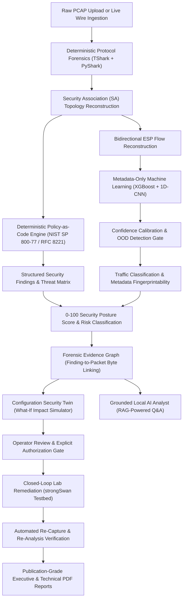

The system continuously operationalizes three fundamental inquiries:
1. **What IPsec configuration is running?** Extracted deterministically from observable packet headers, transform proposals, security associations, and network evidence without guesswork.
2. **How secure is it, and why?** Evaluated against authoritative national standards, itemizing exact vulnerabilities (e.g., Sweet32 collision risks on 3DES, precomputation vulnerabilities on 1024-bit Diffie-Hellman) and side-channel exposure.
3. **What should change, and can we verify that the change actually improved the configuration?** Projected through a virtual configuration twin, executed inside a controlled strongSwan lab, and verified through immediate wire recapture and re-analysis.

---

## 7. Core Product Philosophy

The architecture of TunnelTrace AI adheres to an uncompromising, eight-stage operational philosophy:

$$\mathbf{DETECT} \longrightarrow \mathbf{RECONSTRUCT} \longrightarrow \mathbf{INFER} \longrightarrow \mathbf{ASSESS} \longrightarrow \mathbf{EXPLAIN} \longrightarrow \mathbf{REMEDIATE} \longrightarrow \mathbf{RE\text{-}TEST} \longrightarrow \mathbf{VERIFY}$$

1. **DETECT:** Rapidly identify IPsec traffic structures on the wire or inside capture traces, distinguishing IKE negotiation exchanges from bulk ESP/AH data streams.
2. **RECONSTRUCT:** Correlate disparate packet events into unified, stateful domain entities: linking IKE handshakes to Child SAs, pairing SPIs across bidirectional tunnels, and reconstructing bidirectional encrypted flows.
3. **INFER:** Apply supervised machine learning solely where encryption obscures visibility, predicting inner application workloads from metadata while quantifying predictive uncertainty.
4. **ASSESS:** Audit observed configurations against versioned, authoritative policy rules, generating deterministic findings with zero generative hallucination.
5. **EXPLAIN:** Ground every finding, score deduction, and ML inference in tangible packet evidence, providing TreeSHAP feature attributions and standards citations.
6. **REMEDIATE:** Synthesize hardened, vendor-accurate configuration directives directly addressing audited deficiencies.
7. **RE-TEST:** Deploy synthesized configurations to a controlled, isolated network namespace testbed executing real strongSwan instances.
8. **VERIFY:** Recapture wire traffic from the remediated testbed, re-run automated analysis, and prove mathematically that the security deficiencies are resolved.

---

## 8. The Hybrid Intelligence Design Principle

A critical failure mode of modern security tooling is the indiscriminate application of machine learning to tasks where deterministic logic is required. TunnelTrace AI enforces a rigorous **Four-Layer Hybrid Intelligence Architecture**:

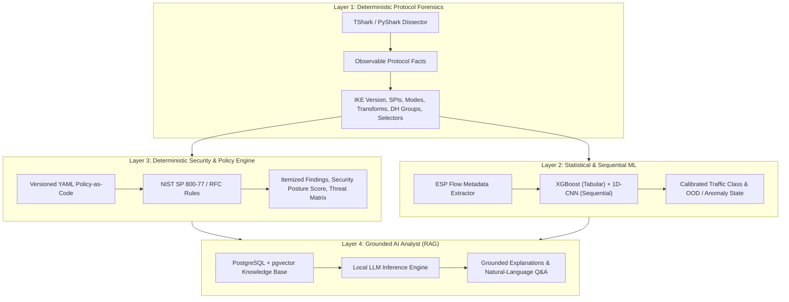

### Functional Division of Intelligence
* **Layer 1 (Deterministic Protocol Forensics):** Dedicated to directly observable wire facts. Parsing IKE headers, transform attributes, DH group IDs, SPIs, and packet offsets requires 100% mathematical precision. Machine learning is strictly forbidden here.
* **Layer 2 (Machine Learning Engine):** Deployed exclusively where encryption prevents direct inspection—specifically, classifying application categories inside opaque ESP ciphertext, evaluating predictive entropy for Out-of-Distribution (OOD) detection, and calculating behavioral anomalies via Isolation Forest.
* **Layer 3 (Deterministic Policy Engine):** Governs security scoring, compliance auditing, risk classification, and remediation generation. Security correctness is a regulatory and mathematical question, not a probabilistic one. Findings are evaluated via deterministic code asserting against versioned standard baselines.
* **Layer 4 (Grounded AI Analyst):** Provides conversational explanation, executive summarization, and query resolution. Operating via local Retrieval-Augmented Generation (RAG), the model is strictly constrained to synthesize answers from verified database facts, active findings, and official standards documentation. The LLM never invents findings, modifies scores, or hallucinates protocol states.

| Functional Area | Processing Layer | Technology / Mechanism | Justification & Safeguards |
| :--- | :--- | :--- | :--- |
| Protocol / SA Extraction | Layer 1: Deterministic | TShark / PyShark / EK JSON | Direct wire observable; 100% precision required; zero guessing |
| Transform Identification | Layer 1: Deterministic | IANA Registry Mapping Tables | Standard RFC integer-to-name lookup; deterministic |
| Inner ESP Classification | Layer 2: Machine Learning | XGBoost + 1D-CNN Ensemble | Payload is encrypted; statistical metadata inference required |
| Anomaly / OOD Detection | Layer 2: Machine Learning | Isolation Forest + Predictive Entropy | Unseen pattern recognition; flags novel/deviant behavior |
| Security Assessment | Layer 3: Policy Engine | Python + YAML Policy-as-Code | Regulatory compliance; must be auditable, repeatable, and exact |
| Posture Score Calculation | Layer 3: Policy Engine | Mathematical Penalty Formula | Zero hallucination; every deduction traces to an active finding |
| Threat Matrix Generation | Layer 3: Policy Engine | Deterministic Rule-to-Threat Mapping | Maps verified findings to STRIDE/CVE consequences |
| Conversational Q&A | Layer 4: AI Analyst | Local LLM + pgvector RAG | Explanatory synthesis only; anchored strictly to verified findings |

---

## 9. Evidence and Uncertainty Model

Passive network capture inherently involves incomplete visibility: captures may start mid-session, handshakes may occur out-of-band, or packets may be dropped by sniffers. TunnelTrace AI rejects binary true/false assumptions, formalizing an **Explicit Four-State Evidence Model**:

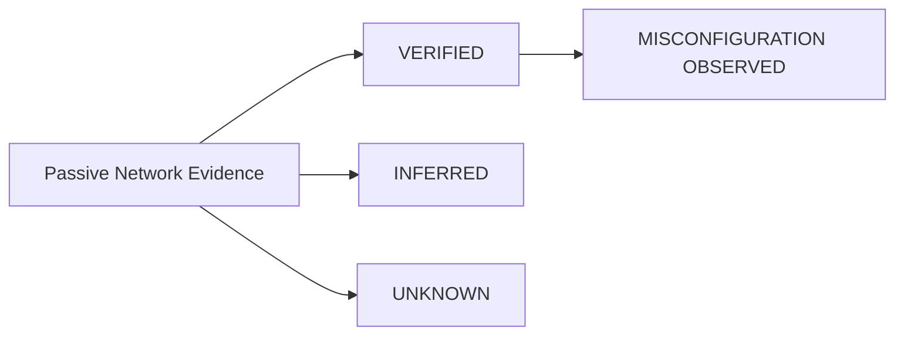

* **`VERIFIED` (Direct Observable Proof):** Assigned when an explicit packet exchange unambiguously proves a parameter (e.g., IKE_SA_INIT response containing Transform Type 1 = AES-CBC-256; Frame #14).
* **`INFERRED` (Heuristic or Statistical Derivation):** Assigned when a property is derived through probabilistic modeling or structural heuristics (e.g., inner traffic classified as Video Streaming with 91% calibrated confidence; or Tunnel Mode inferred from gateway IP differences).
* **`UNKNOWN` (Unobserved Parameter):** Assigned when passive wire evidence is insufficient to verify or refute a property (e.g., Child SA rekeying was not captured, leaving Perfect Forward Secrecy unobservable). The system transparently flags the state as unknown without guessing or applying unfair penalties.
* **`MISCONFIGURATION OBSERVED` (Proven Specification Breach):** Assigned when observable evidence definitively violates governing policy rules (e.g., DES or 3DES negotiated in active transform proposals). Directly incurs scoring deductions.

---

## 10. High-Level System Architecture

The overall architecture of TunnelTrace AI is structured into three decoupled, high-cohesion operational domains:

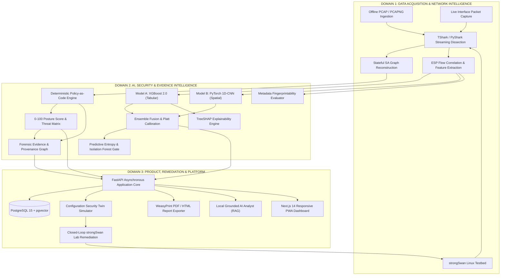

### Domain Functional Breakdown
1. **Domain 1: Data Acquisition & Network Intelligence:** Ingests raw PCAP traces or intercepts wire interfaces. Executes streaming dissection via TShark child processes, normalizes raw event dictionaries, correlates dynamic SPI parameters into a stateful Security Association graph, and aggregates raw ESP frames into bidirectional flows.
2. **Domain 2: AI, Security & Evidence Intelligence:** Executes parallel analytical pipelines. The machine learning pipeline extracts statistical and sequential features, inferring encrypted workloads via calibrated XGBoost and 1D-CNN models with SHAP explanations. The policy pipeline audits reconstructed SAs against NIST/RFC rules, generating itemized findings, quantitative posture scores, threat matrices, and cryptographic evidence breadcrumbs.
3. **Domain 3: Product, Remediation & Platform:** Exposes structured findings through FastAPI REST and WebSocket endpoints. Persists analytical sessions in PostgreSQL, projects configuration updates via the Configuration Security Twin, executes closed-loop validation on the strongSwan testbed, compiles publication-quality PDF reports, powers grounded RAG queries, and renders an interactive Next.js PWA interface.

---

## 11. IPsec Testbed Architecture

To satisfy Pillar A (`PS-LAB-001` through `PS-LAB-017`) and establish absolute ground-truth for machine learning and remediation, TunnelTrace AI incorporates an automated, containerized IPsec network testbed:

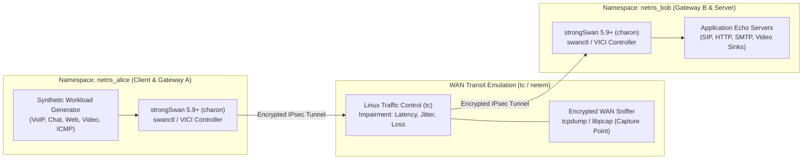

### Testbed Engineering & Capabilities
* **Operating Platform:** Linux Kernel 5.15+/6.x utilizing lightweight Linux Network Namespaces (`ip netns`) ensuring zero virtualization overhead and microsecond-level process isolation.
* **VPN Engine:** strongSwan 5.9.8+ utilizing modern `swanctl` and Versatile IKE Control Interface (VICI) socket APIs for automated configuration reloads.
* **Kernel IPsec Stack:** Native Linux XFRM framework managing Security Association Databases (SAD) and Security Policy Databases (SPD).
* **Controlled Network Impairments:** Emulated using Linux Traffic Control (`tc qdisc`) and `netem`:
  * Configurable latency: 0ms to 200ms.
  * Jitter injection: normal and Pareto distributions.
  * Packet loss simulation: 0.1% to 5.0%.
  * MTU manipulation: enforcing wire fragmentation.
* **Ground-Truth Data Generation:** Workload generators bind to virtual Ethernet pairs inside `netns_alice`, injecting known application workloads into the tunnel while recording exact application timestamps and parameters. Simultaneously, the WAN capture point records the resulting encrypted ESP frames, establishing an unbreakable ground-truth mapping.

---

## 12. Capture and Protocol Forensics Pipeline

TunnelTrace AI ingests network traces through an asynchronous, high-throughput pipeline designed to handle large forensic traces without memory exhaustion:

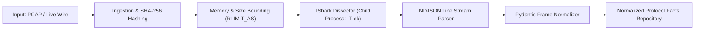

### Pipeline Design Principles
1. **Never Rebuild Wireshark:** The platform leverages TShark 4.x as a child process. Decades of engineering and edge-case dissection logic in Wireshark are utilized directly rather than reimplementing fragile protocol decoders.
2. **Safe Subprocess Execution:** TShark runs under restricted user privileges with strictly tokenized arguments: `subprocess.Popen(["tshark", "-r", safe_path, "-T", "ek"])`. Shell interpolation is prohibited, mitigating command injection vulnerabilities.
3. **Resource-Bounded Execution:** Processing pipelines enforce POSIX resource limits (`RLIMIT_AS` capped at 1GB, execution timeout at 120 seconds) to guard against malformed packet decompression bombs.
4. **Streaming Deserialization:** Output is ingested line-by-line via Elastic Common Schema (EK) JSON streams, preventing out-of-memory errors on multi-gigabyte captures.

---

## 13. Security Association Reconstruction

A major differentiator of TunnelTrace AI is the stateful reconstruction of Security Associations into an intuitive, topological entity graph:

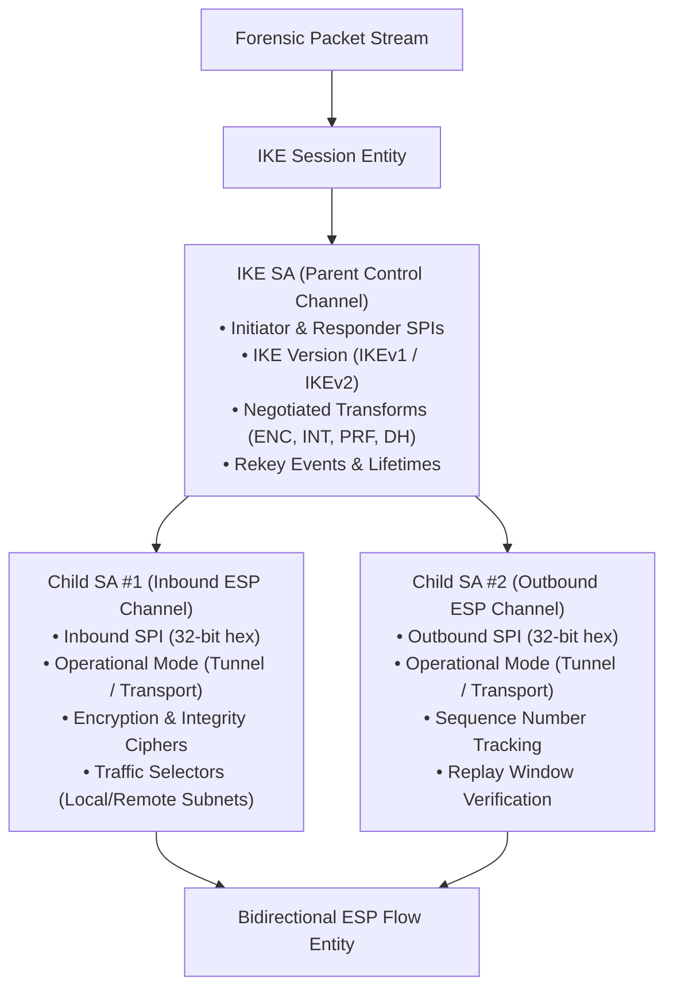

### Extracted SA Parameters
* **SPI Tracking:** Correlates 32-bit hex Security Parameter Indexes across inbound and outbound channels.
* **Transform Proposals:** Extracts active encryption ciphers, key sizes, integrity mechanisms, and PRF algorithms.
* **Mode Determination:** Classifies operational mode as Tunnel Mode (new outer IP header encapsulating inner IP datagram) or Transport Mode (outer IP header preserved, ESP payload header inserted).
* **Traffic Selectors:** Extracts negotiated local and remote subnet policies (e.g., `10.0.1.0/24 <-> 10.0.2.0/24`).
* **PFS Observation:** Inspects Child SA rekeying frames to verify whether new Diffie-Hellman Key Exchange payloads (`KEi`/`KEr`) were exchanged.

---

## 14. Encrypted Traffic Machine Learning Engine

The primary supervised machine learning objective in TunnelTrace AI is **Encrypted Traffic Classification**: inferring the broad application workload running inside an IPsec tunnel without decrypting ESP ciphertext.

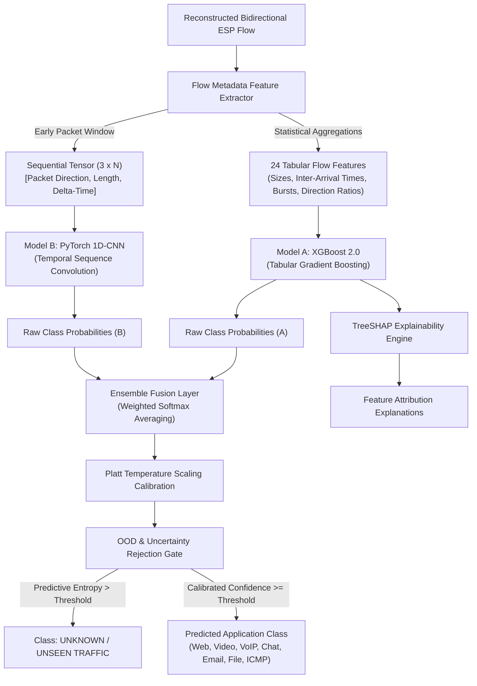

### Model Architectures & Responsibilities
1. **Model A (XGBoost 2.0):** Gradient-boosted decision trees trained on 24 tabular flow statistics (mean/std packet length, forward/reverse packet count ratios, inter-arrival time quantiles, burst volume). Offers rapid inference, robustness to feature scaling, and native TreeSHAP compatibility.
2. **Model B (Lightweight PyTorch 1D-CNN):** Convolutional neural network operating on the early packet sequence tensor ($3 \times N$, capturing direction, wire length, and inter-packet arrival time for the first $N$ packets of a flow; candidate sequence lengths $N \in \{32, 64, 128\}$ evaluated empirically). Captures early protocol handshakes and spatial traffic signatures.
3. **Ensemble Fusion:** Combines probabilistic outputs of Model A and Model B via weighted softmax averaging. Exact fusion weights and layer hyperparameters will be finalized through empirical validation.

### Target Workload Taxonomy
* **Web Browsing:** Asymmetric, bursty HTTP/HTTPS transactions.
* **Video Streaming:** High-bitrate, downstream-dominant flows with sustained throughput.
* **VoIP Telephony:** Low-latency, symmetric bidirectional streams with small, fixed-cadence packets.
* **Chat / Messaging:** Sporadic, low-volume bursts separated by extended idle intervals.
* **E-mail:** Semi-regular synchronization bursts with moderate payload size variability.
* **File Transfer:** Monolithic, high-throughput unidirectional data floods.
* **ICMP Diagnostic:** Low-frequency, uniform echo request/reply pairs.
* **Unknown / Unseen:** Out-of-Distribution flows failing confidence or entropy thresholds.

> **WhatsApp Classification Note:** In strict compliance with scientific integrity, WhatsApp traffic is categorized within the general **Chat / Messaging** class unless real, controlled WhatsApp application traces are specifically captured and validated within the testbed. TunnelTrace AI never claims generic synthetic chat data is WhatsApp.

---

## 15. AI Confidence Calibration, OOD Detection & Explainability

### 15.1 Confidence Calibration
Standard neural networks and tree ensembles frequently produce overconfident probabilities (e.g., predicting 99% probability on misclassified instances). TunnelTrace AI enforces post-hoc **Probability Calibration**:
* **Temperature Scaling (Platt Scaling):** Learns a single scalar parameter $T > 0$ on a held-out validation set to rescale logit distributions: $\hat{p}_i = \frac{e^{z_i / T}}{\sum_j e^{z_j / T}}$.
* **Evaluation Metrics:** Evaluated rigorously using Expected Calibration Error (ECE), Brier Score, and visual Reliability Diagrams.

### 15.2 Out-of-Distribution (OOD) and Anomaly Detection
To prevent the model from hallucinating labels on novel application protocols or malware tunneling:
* **Predictive Entropy Gate:** Measures Shannon entropy across the calibrated probability distribution: $H(p) = -\sum_i p_i \log_2 p_i$. If $H(p) > H_{\text{threshold}}$, the flow is labeled `UNKNOWN / UNSEEN TRAFFIC`.
* **Isolation Forest Baseline:** Computes anomaly isolation depth on tabular feature vectors to identify statistical outliers independent of supervised class boundaries.
* **Core Principle:** Anomaly $\neq$ Attack. Anomalies are flagged as unusual behavioral deviations, never falsely marketed as an automated zero-day intrusion detection system.

### 15.3 Explainable AI via TreeSHAP
For every classification produced by Model A, TunnelTrace AI generates local feature attributions using **TreeSHAP** (SHapley Additive exPlanations):
* Explains *why* a flow was classified as Video Streaming (e.g., +0.42 contribution from `downstream_bytes_ratio > 0.85`, +0.28 contribution from `packet_length_std < 120`).
* Provides defensible, game-theoretic explanations presented directly to SOC analysts, eliminating the "black-box" nature of deep learning.

---

## 16. Comprehensive Dataset Strategy

A defensible machine learning platform requires an unassailable data governance strategy. TunnelTrace AI utilizes two distinct data sources, clearly delineating their roles:

```mermaid
graph TD
    subgraph Primary ["PRIMARY DATA SOURCE: IPsec-Native Testbed Dataset"]
        T1["Controlled strongSwan Linux Testbed"] --> T2["Dual-Point Captures (Plaintext & ESP WAN)"]
        T2 --> T3["Automated Cryptographic & Network Impairment Permutations"]
        T3 --> T4["Absolute Ground-Truth Metadata Manifests"]
        T4 --> T5["Training, Calibration & Testing of TunnelTrace AI Models"]
    end

    subgraph Supporting ["SUPPORTING DATA SOURCE: UNB/CIC ISCXVPN2016"]
        U1["Official Public Benchmark (ISCXVPN2016)"] --> U2["OpenVPN Traffic Traces (TLS-Based)"]
        U2 --> U3["Methodology Benchmarking & Feature Extraction Research"]
        U3 --> U4["Strict Domain Isolation (Never Mixed into Native IPsec Models)"]
    end
```

### Dataset Strategy Comparison Matrix

| Attribute | Primary Dataset: IPsec-Native Lab | Supporting Dataset: UNB/CIC ISCXVPN2016 |
| :--- | :--- | :--- |
| **VPN Protocol** | **IPsec ESP (RFC 4303) over raw IP & UDP 4500** | **OpenVPN over TLS / UDP / TCP** |
| **Origin / Source** | Controlled strongSwan Linux Namespace Testbed | University of New Brunswick (ISCX / CIC) |
| **Operational Role** | **PRIMARY Core Dataset** | **SUPPORTING Research Benchmark** |
| **Platform Usage** | Training, validation, and testing of production ML models | Methodology baseline, feature comparison research |
| **Ground Truth** | 100% verified via synchronized pre-encapsulation logging | Documented application trace labels |
| **Domain Limitations** | Controlled synthetic testbed environment | **Domain Shift:** OpenVPN encapsulation differs fundamentally from IPsec ESP |
| **Status / Exact Sizes** | Generated continuously across configuration matrices | *TBD — Verify downloaded UNB/CIC archive filename and exact size* |

### Locally Downloaded UNB/CIC Archive Register
The team has acquired two VPN-related archives from the UNB/CIC repository for exploratory methodology benchmarking:

| Archive Record | Recorded / Recalled Size | Archive File Type | Encapsulation | Status / Verification Note |
| :--- | :--- | :--- | :--- | :--- |
| **Archive Part 1** | ~600+ MB (Recalled) | Compressed Archive | OpenVPN | *TBD — Verify downloaded UNB/CIC archive filename and exact size* |
| **Archive Part 2** | ~1.8+ GB (Recalled) | Compressed Archive | OpenVPN | *TBD — Verify downloaded UNB/CIC archive filename and exact size* |

> **Scientific Integrity Note on Public Data:** The complete UNB/CIC ISCXVPN2016 dataset is documented at ~28 GB. The locally downloaded archives represent specific compressed subsets. Crucially, because ISCXVPN2016 encapsulates traffic via **OpenVPN (TLS-based user-space tunnels)** rather than **IPsec ESP (kernel-space network-layer encapsulation)**, public OpenVPN data must **never** be blindly combined with native IPsec data. TunnelTrace AI models are developed and validated primarily on native IPsec traffic.

### Non-Negotiable Dataset Splitting Rule: Session-Level Isolation
A pervasive flaw in published network machine learning research is *packet-level* or *flow-level* random splitting, where flows from the same VPN session appear in both training and test sets. This leads to catastrophic data leakage (the model memorizes IP headers, exact timing drift, or ephemeral port artifacts).
* **Session-Level Splitting:** TunnelTrace AI enforces strict `GroupKFold` partitioning based on unique `session_id`. All packets and flows generated by a specific VPN session exist exclusively within either the training split or the evaluation split.
* **Cross-Configuration Evaluation:** Models will be evaluated across unseen configurations (e.g., trained on AES-GCM, evaluated on AES-CBC; trained on low latency, evaluated on high jitter) to verify robust generalization.

---

## 17. Security, Compliance & Threat Modeling Engine

TunnelTrace AI evaluates VPN security configurations deterministically through an extensible **Policy-as-Code Engine**:

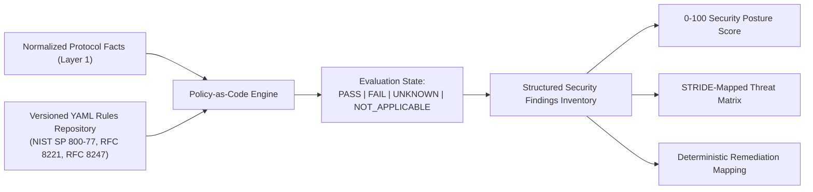

### Authoritative Governance Baselines
All policy assertions map directly to authoritative standards:
* **NIST SP 800-77 Rev. 1:** *Guide to IPsec VPNs* (cryptographic algorithm recommendations, mode restrictions, minimum DH group sizes).
* **NIST SP 800-57 Part 1 Rev. 5:** *Recommendation for Key Management* (bit-strength equivalencies: 1024-bit MODP = 80-bit strength [DISALLOWED]; 2048-bit MODP = 112-bit strength [LEGACY]; ECP-256 = 128-bit strength [APPROVED]).
* **RFC 8221:** *Cryptographic Algorithm Implementation Requirements for ESP and AH*.
* **RFC 8247:** *Cryptographic Algorithm Implementation Requirements for IKEv2*.
* **RFC 9395:** *Deprecation of 3DES across IETF Protocols*.

### Policy Structure Sample (YAML)
```yaml
rule_id: "POL-NIST-004"
standard_reference: "NIST SP 800-77 Rev. 1, Section 5.1.2"
title: "Mandate Diffie-Hellman Groups with Security Strength >= 112 bits"
severity: "HIGH"
deduction_points: 20
evaluation:
  target: "ike_sa.transforms.diffie_hellman_group"
  disallowed_values: [1, 2, 5]  # MODP-768, MODP-1024, MODP-1536
  remediation_directive: "ike = aes256gcm16-prfsha256-ecp256!"
```

### Quantitative Security Posture Score (0–100)
The overall Security Posture Score is calculated via an itemized deduction model starting from a clean baseline of 100:
$$\text{Security Posture Score} = \max\left(0, 100 - \sum \text{Deduction Points}\right)$$
* Every deduction links to an active finding backed by a verified policy failure.
* The exact weights, deduction points, and category normalizations are currently defined as **TBD — Requires implementation / empirical validation**.
* The score is explicitly marketed as a *TunnelTrace AI Security Posture Index*, never falsely labeled as an official government metric.

### Dynamic Threat Matrix
Structured findings map directly to operational threat scenarios, detailing Threat Title, Affected SA, STRIDE Classification, Exploitation Likelihood, Operational Impact, and Remediation Directives.

---

## 18. Metadata Fingerprintability Index

Even when payload confidentiality is perfectly preserved by AES-GCM-256, an eavesdropper observing packet lengths, transmission bursts, and directionality can often infer the active application workload.

To measure this attack surface, TunnelTrace AI introduces the **Metadata Fingerprintability Index**:
* **Purpose:** Quantifies the side-channel exposure of an IPsec tunnel based on the distinctiveness of its encrypted flow patterns.
* **Mathematical Signals:** Incorporates classifier confidence, entropy distributions, burst asymmetry, and packet size clustering.
* **Analyst Interpretation:** A high fingerprintability index indicates that the tunnel carries highly distinguishable traffic (e.g., unpadded VoIP or video streams) that can be easily fingerprinted by external adversaries.
* **Safeguard:** The index measures side-channel distinguishability. It does **not** mean plaintext data has leaked. The final formula remains **TBD — Requires empirical validation**.

---

## 19. Forensic Evidence Graph and Provenance

Every conclusion emitted by TunnelTrace AI must be defensible in a court of law or formal cybersecurity audit. The platform constructs an immutable **Forensic Evidence Graph**:

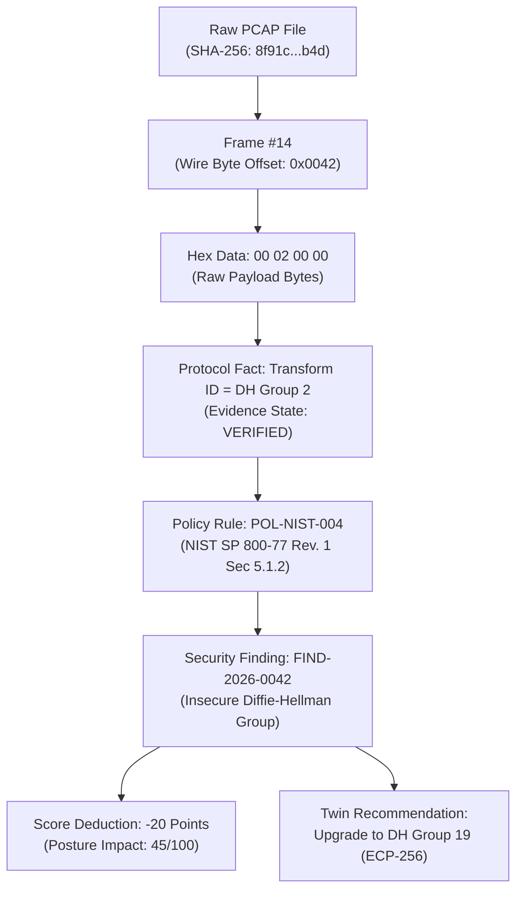

### Complete Provenance Tracking
Every analytical record stores complete provenance metadata: Capture File SHA-256 Checksum, Analysis Session UUID, Parser Version, Feature Schema Version, Model Artifact Checksums, Policy Rule Bundle Version, and Execution Timestamps.

---

## 20. Configuration Security Twin and Closed-Loop Remediation

Rather than merely reporting vulnerabilities, TunnelTrace AI empowers operators to simulate and validate remediation actions:


### Closed-Loop Validation Boundaries
* **Virtual Twin Simulation:** Re-evaluates proposed configurations against the Policy Engine without touching real infrastructure, displaying projected score uplift.
* **Controlled Lab Execution:** Automated remediation deployment is strictly restricted to the controlled strongSwan testbed container. TunnelTrace AI does **not** attempt automated production pushes to unvalidated commercial appliances (Cisco, Fortinet, Palo Alto), ensuring zero risk of production network outages.

---

## 21. Grounded Local AI Analyst (RAG)

TunnelTrace AI incorporates an interactive natural-language assistant engineered to assist SOC operators while maintaining absolute factual grounding:

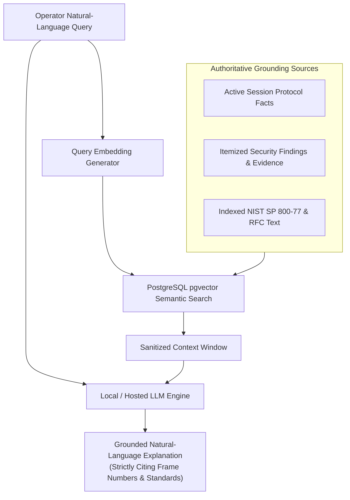

### Factual Grounding Safeguards
* **No Speculative Hallucination:** The LLM is forbidden from inventing protocol facts, altering security scores, or evaluating compliance. All analytical metrics are pre-computed deterministically.
* **Privacy-Preserving:** Raw capture bytes never leave the local environment; the LLM receives only structured, sanitized entity summaries.
* **Strict Evidence Citations:** Answers explicitly cite the exact frame numbers, byte offsets, and standard document paragraphs backing each statement.

---

## 22. Major Product Features

The complete product scope of TunnelTrace AI comprises 25 integrated technical capabilities:

| # | Feature Name | Core Operational Purpose | PS Mapping | Processing Tier | Innovation Level | Status / Implementation |
| :--- | :--- | :--- | :--- | :--- | :--- | :--- |
| **1** | **Offline Trace Ingestion** | Multi-gigabyte PCAP/PCAPNG parsing | `PS-CAP-005` | Layer 1 | High Reliability | Implemented Baseline |
| **2** | **Live Wire Capture** | Real-time packet interception on local NICs | `PS-CAP-006` | Layer 1 | Privileged Core | Implemented Baseline |
| **3** | **IPsec Auto-Detection** | Instant identification of IKE, ESP, and AH | `PS-PROTO-001` | Layer 1 | Core Standard | Implemented Baseline |
| **4** | **IKE Protocol Intelligence** | Dissects IKEv1/IKEv2 handshakes & exchanges | `PS-PROTO-002` | Layer 1 | Core Standard | Implemented Baseline |
| **5** | **SA Topology Builder** | Correlates dynamic SPIs into parent/child graphs | `PS-PROTO-008` | Layer 1 | Architectural | Implemented Baseline |
| **6** | **Interactive SA Explorer** | Visual node graph of tunnels and child SAs | `PS-PROTO-008` | UI / UX | Differentiator | Implemented Baseline |
| **7** | **Encrypted Traffic ML** | Classifies application traffic inside ESP | `PS-PROTO-009` | Layer 2 | Core Mandate | Model Baseline Designed |
| **8** | **Confidence Calibration** | Rescales probabilities via Platt temperature scaling| `PS-OUT-008` | Layer 2 | High Assurance | Designed / TBD Validation |
| **9** | **OOD / Unknown Detector** | Rejects unrepresented flows via predictive entropy | `PS-OUT-008` | Layer 2 | High Assurance | Designed / TBD Validation |
| **10**| **TreeSHAP Explainability** | Exposes local feature attributions per flow | `PS-PROTO-009` | Layer 2 | Differentiator | Designed / TBD Validation |
| **11**| **Behavioral Anomaly Engine**| Detects volume/burst outliers via Isolation Forest| `PS-SEC-008` | Layer 2 | High Assurance | Designed / TBD Validation |
| **12**| **Security Assessment** | Audits cryptography against NIST standards | `PS-SEC-001` | Layer 3 | Core Mandate | Implemented Baseline |
| **13**| **Compliance Scorecard** | Pass/fail compliance checks against RFC/NIST | `PS-SEC-002` | Layer 3 | Core Mandate | Implemented Baseline |
| **14**| **Security Posture Score** | Quantitative 0–100 posture calculation | `PS-OUT-001` | Layer 3 | Core Mandate | Implemented Baseline |
| **15**| **Categorized Risk Score** | Maps findings to standardized risk ratings | `PS-OUT-006` | Layer 3 | Core Mandate | Implemented Baseline |
| **16**| **Dynamic Threat Matrix** | STRIDE/CVE threat catalog linked to findings | `PS-OUT-007` | Layer 3 | Core Mandate | Implemented Baseline |
| **17**| **Metadata Fingerprintability**| Quantifies side-channel traffic distinguishability | `PS-SEC-008` | Layer 2 | Differentiator | Metric Formulation TBD |
| **18**| **Evidence Explorer Graph** | Links every finding to frame offset & hex bytes | `PS-SEC-001` | Layer 3 | Differentiator | Implemented Baseline |
| **19**| **Configuration Twin** | Projects posture impact of proposed changes | `PS-DEL-003` | Layer 3 | Innovation | Implemented Baseline |
| **20**| **Closed-Loop Lab Remediation**| Deploys, recaptures, and verifies fixes in lab | `PS-DEL-001` | Testbed | Innovation | Implemented Baseline |
| **21**| **Executive Summary Report** | Publication-grade PDF report for leadership | `PS-OUT-004` | Reporting | Core Mandate | Implemented Baseline |
| **22**| **Technical Audit Report** | Deep-dive audit report with packet traces | `PS-OUT-005` | Reporting | Core Mandate | Implemented Baseline |
| **23**| **Grounded AI Analyst** | RAG assistant answering analyst queries | `PS-DEL-003` | Layer 4 | Differentiator | Implemented Baseline |
| **24**| **Automated IPsec Testbed** | strongSwan multi-configuration lab orchestrator| `PS-LAB-001` | Testbed | Core Mandate | Implemented Baseline |
| **25**| **IPsec Dataset Factory** | Scripts generating annotated native IPsec data | `PS-DEL-007` | Dataset | Core Mandate | In Progress |

---

## 23. Main User Interface Modules

The user experience is delivered via an editorial, high-density Next.js Progressive Web Application (PWA). The interface uses **Light Theme as Default** with complete dark mode support, strict 0px border radiuses, and zero decorative animations:

```mermaid
graph TD
    SHELL["TunnelTrace AI Application Shell"]
    SHELL --> M01["1. Command Center (Executive Overview & Triage)"]
    SHELL --> M02["2. Ingestion & Capture (Dropzone & Live Sniffer)"]
    SHELL --> M03["3. Protocol Intelligence (IKE/ESP Handshake Inspector)"]
    SHELL --> M04["4. SA Explorer (Interactive Node Graph of SAs)"]
    SHELL --> M05["5. Traffic Intelligence (ML Class Distribution & SHAP)"]
    SHELL --> M06["6. Security Assessment (Itemized Findings & Vulnerabilities)"]
    SHELL --> M07["7. Compliance Scorecard (NIST SP 800-77 Audit Grid)"]
    SHELL --> M08["8. Threat Matrix (STRIDE & Attack Consequence Mappings)"]
    SHELL --> M09["9. Evidence Explorer (Hex Byte & Frame Offset Inspector)"]
    SHELL --> M10["10. Configuration Security Twin (What-If Simulator)"]
    SHELL --> M11["11. Remediation Verification (Before vs. After Validation Card)"]
    SHELL --> M12["12. Reports Exporter (Executive & Technical PDF Generation)"]
    SHELL --> M13["13. AI Analyst Console (Grounded RAG Conversational Drawer)"]
    SHELL --> M14["14. Testbed Manager (Multi-Scenario Traffic & Crypto Lab)"]
```

---

## 24. Technology Stack Baseline

The technology stack is selected strictly for high-throughput network engineering, mathematical reproducibility, and deployment simplicity:

| Layer / Domain | Component & Technology | Selected Version | Specific Purpose & Architectural Justification |
| :--- | :--- | :--- | :--- |
| **Frontend Framework** | Next.js (App Router) | `14.2+` | React Server Components, high performance, strict TypeScript support |
| **Frontend Styling** | Vanilla CSS + Tailwind CSS | `3.4+` | Custom 0px brutalist design system; **no third-party UI kits (no shadcn/ui)** |
| **Data Visualization** | Apache ECharts & React Flow | `5.5+` / `11.11+` | Canvas/WebGL radar & distribution charts; interactive SA node topologies |
| **Client Shell** | Progressive Web App (PWA) | Service Worker API | Desktop-first analyst workstation; offline caching of analytical reports |
| **Backend API Core** | FastAPI | `0.110+` | Asynchronous Python ASGI core; OpenAPI 3.1 contract generation; WebSockets |
| **Data Validation** | Pydantic | `v2.6+` | Strict schema validation; immutable Data Transfer Objects (DTOs) |
| **Relational Database** | PostgreSQL | `15.x` | Strongly typed relational storage for sessions, SAs, findings, and evidence |
| **Vector Database** | pgvector Extension | `0.6+` | In-database vector storage for RAG embeddings; eliminates duplicate vector stores |
| **Protocol Dissection** | TShark (Wireshark Suite) | `4.2+` | Industrial-grade network packet dissection; output streamed via JSON (`-T ek`) |
| **Python Dissection Wrapper**| PyShark | `0.6+` | Pythonic wrapper for TShark event loop integration |
| **Packet Crafting (Lab)**| Scapy | `2.5+` | Synthetic traffic injection in lab only; strictly forbidden for dissection |
| **Tabular Machine Learning**| XGBoost | `2.0+` | High-accuracy gradient-boosted trees for flow metadata classification |
| **Sequential Deep Learning**| PyTorch | `2.2+` | Lightweight 1D-CNN operating on early packet sequence tensors |
| **Baseline & Anomaly ML**| scikit-learn | `1.4+` | Random Forest baseline classifier and Isolation Forest anomaly detector |
| **Model Explainability** | SHAP | `0.44+` | Local game-theoretic feature attributions via TreeExplainer |
| **PDF Report Synthesis** | WeasyPrint & Jinja2 | `61.x` / `3.1+` | Headless HTML-to-PDF compilation generating publication-grade reports |
| **IPsec VPN Daemon** | strongSwan | `5.9.8+` | Authoritative Linux IPsec daemon managing IKEv1/IKEv2 charon engine |
| **Network Isolation** | Linux Network Namespaces | Linux Kernel 5.15+ | Pure OS-level network stack virtualization (`ip netns`) |
| **Traffic Conditioning** | Linux Traffic Control (`tc`) | `iproute2` | Kernel-level latency, jitter, and packet loss emulation (`netem`) |
| **Container Runtime** | Docker & Docker Compose | `24.x+` / `v2.24+` | Single-command full-stack container orchestration |

---

## 25. Deployment Architecture and Privilege Separation

Security software analyzing untrusted network traffic must maintain ironclad privilege separation. TunnelTrace AI establishes two strictly partitioned execution planes:

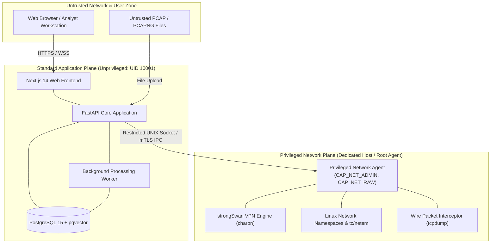

### Architectural Security Guarantees
* **Standard Application Plane (Class A):** Runs entirely as an unprivileged user (`UID 10001`). Contains the web frontend, API endpoints, machine learning inference engines, database persistence, and PDF report generators. Even in the event of an application vulnerability, the process possesses zero host administration rights.
* **Privileged Network Plane (Class B):** Confined to a standalone Linux network agent possessing only the specific kernel capabilities required for network management (`CAP_NET_ADMIN`, `CAP_NET_RAW`). Executes inside dedicated Linux hosts or development VMs.
* **Parameterized IPC Gateway:** Communication between the unprivileged API and privileged agent occurs strictly across a local UNIX domain socket or mutual-TLS channel governed by rigid JSON schemas and command whitelists. Arbitrary shell command execution is architecturally impossible.

---

## 26. Practical Implementation Roadmap

The end-to-end engineering execution of TunnelTrace AI is divided into 13 logical, sequential development phases:

```mermaid
graph LR
    P1["Phase 1: Testbed Foundation"] --> P2["Phase 2: Protocol Engine"]
    P2 --> P3["Phase 3: SA Reconstruction"]
    P3 --> P4["Phase 4: Dataset Factory"]
    P4 --> P5["Phase 5: ML Baseline (XGBoost)"]
    P5 --> P6["Phase 6: Sequential ML (1D-CNN)"]
    P6 --> P7["Phase 7: Calibration & OOD"]
    P7 --> P8["Phase 8: Security & Policy Engine"]
    P8 --> P9["Phase 9: Evidence & API Core"]
    P9 --> P10["Phase 10: Next.js PWA Dashboard"]
    P10 --> P11["Phase 11: Twin & Remediation"]
    P11 --> P12["Phase 12: Reports & AI Analyst"]
    P12 --> P13["Phase 13: SIH Demo Hardening"]
```

| Phase | Milestone Name | Key Technical Deliverables | Verification Milestone |
| :--- | :--- | :--- | :--- |
| **Phase 1** | Testbed Foundation | strongSwan lab in Linux `netns`; Tunnel & Transport modes; traffic injection scripts | Verified IKE/ESP packet generation |
| **Phase 2** | Capture & Protocol Engine | PCAP ingestion; streaming TShark parser; deterministic protocol fact extractor | 100% extraction match on known lab ciphers |
| **Phase 3** | SA & Flow Reconstruction | IKE session correlating engine; SPI pair tracking; bidirectional ESP flow builder | Verified SA topology graph |
| **Phase 4** | Dataset Factory | Multi-configuration lab matrix automation; ground-truth metadata logger | Structured, session-isolated IPsec dataset |
| **Phase 5** | Tabular ML Baseline | 24-feature flow metadata extractor; XGBoost classification model | Baseline Macro-F1 benchmarked |
| **Phase 6** | Sequential Deep Learning | Sequence tensor extractor; PyTorch 1D-CNN; model fusion layer | Comparison of XGBoost vs. CNN vs. Ensemble |
| **Phase 7** | Reliability & Explainability| Platt temperature scaling; predictive entropy gate; TreeSHAP explanations | ECE reduction; OOD rejection verified |
| **Phase 8** | Security & Policy Engine | Python + YAML Policy-as-Code; NIST SP 800-77 rules; posture score & threat matrix | Verified finding generation on weak fixtures |
| **Phase 9** | Evidence & API Core | Forensic Evidence Graph; PostgreSQL schemas; FastAPI REST & WebSocket routes | Automated contract test suite passing |
| **Phase 10**| Next.js PWA Dashboard | Command Center, SA Explorer, Traffic Visualizer, Evidence Inspector | End-to-end web triage interface functional |
| **Phase 11**| Twin & Remediation | Configuration Security Twin; strongSwan lab config reload via VICI; re-analysis | Closed-loop before/after score validation |
| **Phase 12**| Reports & AI Analyst | WeasyPrint executive/technical PDF exporter; pgvector RAG query engine | Publication-quality PDF; grounded Q&A |
| **Phase 13**| SIH Demo Hardening | Scripted live demonstration runbook; edge-case failure testing; rehearsal | Flawless execution of Golden SIH Demo |

---

## 27. Testing and Validation Strategy

To ensure zero software failures during judging, TunnelTrace AI implements a multi-tier verification methodology:

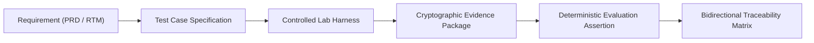

1. **Protocol Forensics Testing:** Tested against known strongSwan configuration files. Observable transforms, versions, and SPIs must match ground-truth configuration directives with 100% precision.
2. **Machine Learning Evaluation:** Evaluated on held-out testbed sessions with zero session overlap (`GroupKFold`). Metrics tracked include Macro-F1, Precision, Recall, Expected Calibration Error (ECE), and Brier Score.
3. **Out-of-Distribution Validation:** Evaluated by injecting unseen application workloads (e.g., BitTorrent or custom synthetic traffic); verified that the system rejects the flow as `UNKNOWN / UNSEEN` rather than assigning a false label.
4. **Security Policy Rule Testing:** Validated against a repository of positive (secure AES-GCM-256 / DH19), negative (insecure 3DES / DH2), and truncated (missing handshake) PCAP fixtures, verifying that findings trigger deterministically.
5. **Evidence Linkage Auditing:** Every emitted finding must programmatically resolve to an exact frame number and wire byte offset in the underlying PCAP file.
6. **Remediation Verification Testing:** Proves that deploying a generated remediation patch resolves the active finding upon wire recapture and re-analysis.

---

## 28. Golden SIH Demonstration Workflow

During Smart India Hackathon 2026 evaluation, TunnelTrace AI will prove its technical capabilities through an unbroken, 23-step live operational demonstration:

```mermaid
graph TD
    S01["1. Start strongSwan Testbed with Intentionally Weak Configuration<br/>(IKEv1, 3DES-CBC, HMAC-SHA1, DH Group 2, No PFS, Tunnel Mode)"] --> S02["2. Inject Active VoIP and Bulk File Transfer Workloads"]
    S02 --> S03["3. Capture Real Wire Traffic & Ingest PCAP via Web Dropzone"]
    S03 --> S04["4. Dashboard Computes File SHA-256 & Dissects Frames Instantaneously"]
    S04 --> S05["5. Display Verified Facts: IKEv1, Tunnel Mode, 3DES-CBC, DH Group 2, SPIs"]
    S05 --> S06["6. Render Interactive SA Topology Graph in SA Explorer"]
    S06 --> S07["7. ML Engine Infers Inner Workloads: VoIP (88% Conf) & File Transfer (92% Conf)"]
    S07 --> S08["8. Open TreeSHAP Panel Explaining Packet Timing & Size Feature Contributions"]
    S08 --> S09["9. Policy Engine Emits Critical Findings (3DES Deprecation, Weak DH2, Missing PFS)"]
    S09 --> S10["10. Display Compliance Scorecard (35.7% NIST Compliance) & Low Posture Score (42/100)"]
    S10 --> S11["11. Render STRIDE-Mapped Threat Matrix (Sweet32 & Logjam Attack Warnings)"]
    S11 --> S12["12. Display High Metadata Fingerprintability Index Warning"]
    S12 --> S13["13. Click Finding: Evidence Explorer Highlights Frame #14 Byte Offset 0x0042 in Hex"]
    S13 --> S14["14. Open Configuration Security Twin Simulator"]
    S14 --> S15["15. Propose Hardened Profile (IKEv2, AES-GCM-256, DH Group 19 Curve25519, PFS ON)"]
    S15 --> S16["16. Twin Projects 100/100 Posture Score & Resolution of All 4 Critical Findings"]
    S16 --> S17["17. Click 'Apply & Validate in Lab' (Requires Operator Authorization)"]
    S17 --> S18["18. Platform Pushes Hardened Config to strongSwan Lab & Re-establishes VPN"]
    S18 --> S19["19. Automated Re-Capture of Remediated Wire Traffic"]
    S19 --> S20["20. Automated Re-Analysis Displays Verification Evidence Card (All Deficiencies Resolved)"]
    S20 --> S21["21. Export Publication-Grade Executive and Technical Audit PDF Reports"]
    S21 --> S22["22. Query Grounded AI Analyst: 'Why was our initial DH configuration marked Critical?'"]
    S22 --> S23["23. AI Analyst Returns Accurate, Grounded Response Citing NIST SP 800-77 and Frame #14"]
```

---

## 29. Key Differentiators and Architectural Innovations

TunnelTrace AI introduces 12 distinct engineering innovations that elevate the platform beyond conventional packet decoders:

```mermaid
graph LR
    subgraph Differentiators ["Key Platform Differentiators"]
        IN1["1. Automated IPsec-Native Testbed & Dataset Factory"]
        IN2["2. Hybrid Deterministic + ML + Policy + RAG Architecture"]
        IN3["3. Explainable Encrypted Traffic Classification (SHAP)"]
        IN4["4. Unknown / Out-of-Distribution Rejection Gate"]
        IN5["5. Cross-Configuration Robustness Testing"]
        IN6["6. Quantitative Metadata Fingerprintability Index"]
        IN7["7. Forensic Evidence Graph (Finding-to-Byte Traceability)"]
        IN8["8. Configuration Security Twin (What-If Simulation)"]
        IN9["9. Closed-Loop Lab Remediation Verification"]
        IN10["10. Strict Privilege Separation & Privacy-First Design"]
        IN11["11. Full Cryptographic Provenance & Version Tracking"]
        IN12["12. Interactive Dynamic SA Explorer Graph"]
    end
```

### Why TunnelTrace AI Is More Than a Packet Analyzer

| Comparison Dimension | Traditional Packet Analyzers (Wireshark / TShark) | TunnelTrace AI Platform |
| :--- | :--- | :--- |
| **Operational Goal** | Granular protocol packet decoding and hex inspection | Holistic, explainable VPN security intelligence & remediation |
| **Topology Visibility** | Isolated individual frames; no stateful correlation | Reconstructs complete IKE and Child SA topology graph |
| **Encrypted ESP Payload**| Completely opaque stream of encrypted hex bytes | Infers application workload classes via calibrated ML |
| **Compliance Auditing**| None; requires manual RFC/NIST cross-referencing | Automated Policy-as-Code auditing against NIST SP 800-77 |
| **Posture Scoring** | None | Quantitative 0–100 posture scoring with itemized deductions |
| **Forensic Evidence** | Manual packet filtering | Immutable Evidence Graph linking findings to wire byte offsets |
| **Remediation Support** | None | Proposes hardened configs; projects impact in Security Twin |
| **Remediation Validation**| None | Closed-loop validation via controlled strongSwan re-testing |
| **Reporting Capabilities**| Basic raw packet summary exports | Publication-grade Executive and Technical Audit PDF reports |
| **AI Integration** | None | Grounded local RAG analyst strictly anchored to verified facts |

---

## 30. Limitations and Honest Technical Boundaries

In strict adherence to scientific rigor, TunnelTrace AI explicitly documents its operational boundaries:
1. **Passive Capture Visibility Limits:** Passive packet analysis can only audit parameters observable on the wire. Settings that do not emit wire artifacts (e.g., internal host filesystem permissions, pre-shared key complexity, or private key storage mechanisms) cannot be inspected passively.
2. **Truncated Trace Limitations:** If a capture starts after IKE negotiation has completed and contains only ESP frames, handshake transforms remain unobservable. The system assigns status `UNKNOWN` rather than fabricating configuration parameters.
3. **Probabilistic Nature of ML:** Encrypted traffic classification is inherently probabilistic. High accuracy on testbed sessions does not guarantee identical performance on novel enterprise traffic under extreme padding or network-layer obfuscation.
4. **Remediation Safety Bounds:** Automated remediation execution is supported exclusively within the controlled strongSwan testbed container. TunnelTrace AI does not support automated production deployment to commercial enterprise firewalls (e.g., Cisco ASA, Palo Alto PAN-OS).
5. **Explanatory Role of LLM:** The AI Analyst is strictly an explanatory and document-synthesizing utility. It does not perform autonomous cryptanalysis, discovery of novel zero-day vulnerabilities, or unconstrained security scoring.

---

## 31. Current Frozen Architecture vs. TBD Engineering Register

To maintain full transparency with academic mentors, the platform's architectural choices are formally categorized into frozen baselines and empirical parameters:

| Architectural Component | Engineering Status | Final Baseline Specification / Resolution Method |
| :--- | :--- | :--- |
| **Product Brand & Positioning** | **FROZEN** | **TunnelTrace AI**; explainable IPsec Security Intelligence Platform |
| **Protocol Forensics Engine** | **FROZEN** | TShark 4.x streaming NDJSON (`-T ek`) + PyShark normalization |
| **Primary Dataset Strategy** | **FROZEN** | Native strongSwan testbed generation with synchronized dual capture |
| **Supporting Dataset Strategy**| **FROZEN** | UNB/CIC ISCXVPN2016 used strictly as OpenVPN supplementary research |
| **Dataset Splitting Policy** | **FROZEN** | **Session-level isolation (`GroupKFold`) is mandatory; zero packet leakage** |
| **ML Model Architectures** | **FROZEN** | XGBoost 2.0 (tabular flow statistics) + PyTorch 1D-CNN (packet sequence) |
| **Model Explainability** | **FROZEN** | Local feature attributions via TreeSHAP |
| **Security Policy Model** | **FROZEN** | Python + versioned YAML Policy-as-Code mapped to NIST SP 800-77 / RFCs |
| **AI Analyst Architecture** | **FROZEN** | Local Retrieval-Augmented Generation (RAG) anchored to PostgreSQL pgvector |
| **Application Tech Stack** | **FROZEN** | Next.js 14, Tailwind CSS (no shadcn/ui), FastAPI, PostgreSQL 15, Docker |
| **Deployment Model** | **FROZEN** | Local-first containerized architecture with strict Class A/B privilege separation |
| **UI Design System** | **FROZEN** | Editorial brutalist design; 0px radius; **Light Theme as Default** |
| **Exact ML Fusion Weights** | **TBD** | Evaluated empirically during Phase 6 cross-validation |
| **1D-CNN Sequence Length ($N$)**| **TBD** | Candidate lengths $N \in \{32, 64, 128\}$ tested empirically |
| **Confidence Calibration Method**| **TBD** | Platt scaling vs. isotonic regression evaluated via ECE |
| **Predictive Entropy Threshold**| **TBD** | Threshold $H_{\text{threshold}}$ calibrated against held-out OOD test splits |
| **Isolation Forest Contamination**| **TBD** | Hyperparameter tuned on baseline traffic distributions |
| **Posture Score Penalty Weights**| **TBD** | Deduction points calibrated against NIST severity hierarchies |
| **Metadata Index Formula** | **TBD** | Mathematical formula refined during Phase 7 validation |
| **UNB/CIC Local Archive Records**| **TBD** | Exact archive filenames and byte counts verified upon local inspection |

---

## 32. Mentor Review Questions

We solicit specific feedback from faculty mentors on the following architectural considerations:

| # | Review Topic | Current Working Proposal | Feedback Objective / Open Question |
| :--- | :--- | :--- | :--- |
| **1** | **Scope vs. Depth for SIH** | Focus on deep IPsec/IKE analysis rather than superficial multi-protocol support | Does the mentor agree that dominating IPsec/IKE deeply is superior to shallow multi-VPN coverage? |
| **2** | **ML Traffic Taxonomy** | 7 discrete classes: Web, Video, VoIP, Chat, Email, File, ICMP + Unknown | Is this application taxonomy sufficiently representative for defense hackathon evaluation? |
| **3** | **Dataset Defensibility** | Primary native testbed data + secondary OpenVPN public data | Does the mentor support our strict separation of native IPsec data from OpenVPN public data? |
| **4** | **Remediation Safety Bounds** | Automated apply limited to controlled strongSwan lab | Does the mentor agree that restricting auto-remediation to the lab is the only defensible safety posture? |
| **5** | **Evaluation Scenarios** | 3DES, DH2, Missing PFS, Weak Lifetimes, Network Impairments | Are there specific real-world cryptanalytic failure scenarios the mentor recommends adding? |

---

## 33. Conclusion and References

**TunnelTrace AI** establishes an industrial-grade, scientifically rigorous solution to Smart India Hackathon Problem Statement 26160. By rejecting black-box generative assumptions in favor of a **Four-Layer Hybrid Intelligence Architecture**, the platform provides deep, deterministic protocol forensics where truth is observable, robust machine learning where encryption obscures visibility, auditable Policy-as-Code where compliance is mandated, and grounded AI assistance where human explanation is required.

With an automated IPsec testbed delivering verified ground truth, a closed-loop remediation verification engine, an immutable Forensic Evidence Graph, and an editorial, high-performance PWA dashboard, TunnelTrace AI provides a world-class security intelligence framework for safeguarding national IPsec communications.

### Authoritative References
1. **NIST SP 800-77 Rev. 1:** *Guide to IPsec VPNs*, National Institute of Standards and Technology, 2020.
2. **NIST SP 800-57 Part 1 Rev. 5:** *Recommendation for Key Management*, NIST, 2020.
3. **RFC 7296:** *Internet Key Exchange Protocol Version 2 (IKEv2)*, Internet Engineering Task Force, 2014.
4. **RFC 8221:** *Cryptographic Algorithm Implementation Requirements and Usage Guidance for ESP and AH*, IETF, 2017.
5. **RFC 8247:** *Cryptographic Algorithm Implementation Requirements for IKEv2*, IETF, 2017.
6. **RFC 4301:** *Security Architecture for the Internet Protocol*, IETF, 2005.
7. **RFC 4303:** *IP Encapsulating Security Payload (ESP)*, IETF, 2005.
8. **RFC 9395:** *Deprecation of Triple-DES (3DES) across all IETF Protocols*, IETF, 2023.
9. **IANA:** *Internet Key Exchange Version 2 (IKEv2) Parameters Registries*, IANA, 2024.
10. **UNB/CIC:** *ISCXVPN2016 Dataset Documentation*, Canadian Institute for Cybersecurity, University of New Brunswick.
11. **NTRO Problem Statement 26160:** *AI-Powered IPsec VPN Protocol Analyzer and Security Assessment Framework*, Smart India Hackathon 2026.
