# TUNNEL TRACE AI
## Overall Requirements, Solution & System Architecture Document

---

### Document Control & Metadata

| Attribute | Specification Details |
| :--- | :--- |
| **Project Name** | TUNNEL TRACE AI |
| **Document Classification** | Master Requirements, Solution & System Architecture Document |
| **Target Audience** | Project Mentors, Faculty Guides, SIH Technical Evaluators, Engineering Leads |
| **Competition** | Smart India Hackathon 2026 |
| **Problem Statement ID** | 26160 |
| **Problem Statement Title** | AI-Powered IPsec VPN Protocol Analyzer and Security Assessment Framework |
| **Sponsoring Organization** | National Technical Research Organisation (NTRO) |
| **Category & Theme** | Software \| Blockchain & Cybersecurity |
| **Current Baseline Status** | Architecture Design & Specifications Frozen; Implementation & Empirical Validation In Progress |
| **Document Version** | 2.0.0 (Pre-Implementation Master Baseline) |

---

## 1. Document Purpose

This master document serves as the single technical blueprint and mentor-facing presentation guide for **TUNNEL TRACE AI**. It consolidates the full architectural, algorithmic, operational, and validation framework of the project into a unified document. 

A technical mentor, faculty advisor, or hackathon evaluator reading this document will understand:
1. The exact technical demands of SIH Problem Statement 26160 (NTRO).
2. Why standard packet analysis tools fail to meet modern VPN assessment needs.
3. The hybrid engineering design of TUNNEL TRACE AI (Deterministic Protocol Forensics + Supervised Flow ML + Policy-as-Code Compliance + Grounded Retrieval-Augmented Explanation).
4. The synthetic and empirical dataset strategy, separating primary IPsec-native data generation from secondary OpenVPN baseline data.
5. The complete closed-loop workflow: from raw packet ingestion to automated Security Association (SA) reconstruction, encrypted payload traffic classification without decryption, standards-based policy scoring, Configuration Security Twin modeling, and verifiable testbed remediation.
6. The exact demarcation between frozen architectural choices and parameters requiring empirical validation.

---

## 2. Executive Summary

Virtual Private Networks (VPNs) built on the IPsec protocol suite form the backbone of government, military, critical infrastructure, and enterprise data protection across untrusted wide-area networks. However, the operational security of IPsec deployments remains fragile. Security is governed by dozens of interdependent parameters: IKE versioning, Diffie-Hellman / Key Exchange (KE) groups, symmetric cipher choices, integrity hashing, Perfect Forward Secrecy (PFS) settings, Security Association (SA) lifetimes, replay protection windows, and Traffic Selector constraints. A single legacy choice (such as 3DES, CBC with weak HMAC, DH Group 2, or omitted PFS) undermines the confidentiality and integrity guarantees of an entire tunnel.

Existing network analysis tools provide low-level packet dissection but place the burden of protocol reconstruction, policy compliance, and traffic inference entirely on human experts. Furthermore, when analyzing encrypted Encapsulating Security Payload (ESP) streams, standard tools are blind to payload contents without access to private session keys.

**TUNNEL TRACE AI** resolves this operational gap as an **explainable IPsec Security Intelligence Platform**. The system does not merely capture packets; it answers three core operational questions:
1. **What IPsec configuration is running?** (Reconstructed deterministically from IKE exchanges, Security Associations, and packet headers).
2. **How secure is it, and why?** (Evaluated against formal cryptographic standards including NIST SP 800-77 Rev. 1, RFC 8221, RFC 8247, and RFC 7296 using versioned Policy-as-Code).
3. **What should be changed, and can the system verify that the change improved security?** (Projected via a Configuration Security Twin and verified through closed-loop re-testing in a controlled testbed).

### Core Differentiator Summary
- **Zero Decryption Required:** Inspects encrypted ESP flows using external statistical and sequential metadata (packet lengths, inter-arrival times, burst directions) to infer high-level application categories (VoIP, Video, Messaging, Web, Email, File Transfer) without decrypting payloads.
- **Hybrid Intelligence Architecture:** Enforces strict boundaries: direct protocol facts are deterministic; traffic categorization is probabilistic (XGBoost + 1D-CNN); security scoring is deterministic Policy-as-Code; and natural language explanations are grounded in verified evidence via RAG.
- **Closed-Loop Remediation:** Goes beyond static reporting by providing a sandbox environment to apply configuration changes, re-capture traffic, re-analyze sessions, and verify compliance upgrades.

---

## 3. Project Identity

| Parameter | Project Identity Specification |
| :--- | :--- |
| **System Name** | TUNNEL TRACE AI |
| **Short Identifier** | TunnelTrace |
| **Tagline** | Explainable IPsec Security Intelligence & Protocol Assessment Framework |
| **Problem Statement** | SIH 2026 / PS 26160 / Software / Blockchain & Cybersecurity |
| **Stakeholder Agency** | National Technical Research Organisation (NTRO) |
| **Core Paradigm** | Hybrid Network Protocol Forensics + Applied Encrypted Traffic Machine Learning |
| **Target Runtime** | Local-first containerized system with privileged Linux network inspection capabilities |

---

## 4. Official Problem Statement

The official problem statement issued by the National Technical Research Organisation (NTRO) reads as follows:

> **Background:** Virtual Private Networks (VPNs) are critical for securing data communications across untrusted networks. IPsec, a widely deployed VPN protocol suite, ensures data confidentiality, integrity, and authentication. However, the security provided by IPsec VPNs heavily depends on proper implementation and configuration, including the choice of cryptographic algorithms, operational modes, and key management practices. Misconfigurations, deprecated algorithms, or weak implementations can severely compromise the security posture of an organization. Traditional packet-analysis tools can capture and inspect network traffic, but they often require significant manual analysis and specialized knowledge to assess the security of IPsec implementations.
>
> **Description:** The objective is to develop an automated software framework that utilizes artificial intelligence and packet-level inspection to analyze IPsec VPN protocol configurations and assess their security posture. The tool should inspect captured network traffic or live streams, identify IPsec protocol characteristics, infer operational modes, evaluate cryptographic strength, and detect vulnerabilities or misconfigurations. The framework should provide a comprehensive security assessment, identifying potential risks and suggesting remediation strategies.

---

## 5. Problem Background & Industry Context

IPsec operates at the Network Layer (OSI Layer 3) through two cooperating protocol mechanisms:
1. **Internet Key Exchange (IKEv1 / IKEv2):** Controls peer authentication, cryptographic negotiation, and dynamic key management over UDP port 500 / 4500.
2. **Data Encapsulation Protocols:**
   - **Encapsulating Security Payload (ESP, IP Protocol 50):** Encapsulates and encrypts transport or network payloads, providing confidentiality, integrity, and replay protection.
   - **Authentication Header (AH, IP Protocol 51):** Authenticates the outer IP header and payload without encryption (rarely deployed due to NAT incompatibility).

### The Operational Challenge
In enterprise and defense deployments, security administrators face major hurdles:
- **Heterogeneous & Legacy Endpoints:** Interoperability pressures force gateways to support outdated cipher suites (3DES, AES-CBC without authenticated encryption, SHA-1, DH Groups 2 and 5).
- **Silent Degradation:** During IKE negotiation, if a client proposes a weak fallback transform and the responder accepts it, the tunnel operates under reduced security without raising alerts.
- **Encrypted Blindness:** Once ESP takes over, network operations teams cannot identify what types of traffic traverse the tunnel, making traffic engineering and metadata leak detection difficult.
- **Manual Dissection Burden:** An analyst using standard tools like Wireshark must manually inspect multi-packet IKE exchanges, map initiator and responder Security Parameter Indexes (SPIs), decode nested transform payloads, cross-reference RFCs, and trace Child SAs.

---

## 6. Official PS Requirements

The official problem statement outlines specific functional mandates across six core areas:

**MANDATORY REQUIREMENTS MATRIX**

| Requirement Area | Scope & Protocol Coverage Specified by NTRO |
| :--- | :--- |
| A. VPN Testbed | Tunnel Mode, Transport Mode, AES-128, AES-256, AES-GCM, AES-CBC+HMAC, |
|  | Various DH/KE Groups, PFS Enabled, PFS Disabled, IPv4, IPv6, |
|  | Workloads: VoIP, WhatsApp, Email, Web Browsing, ICMP, Video Streaming |
| B. Traffic Capture | IKE Negotiation, ESP, AH where present, Offline PCAP/PCAPNG, Live Stream |
| C. Protocol Detection | IPsec detection, IKE version, Mode, Encryption, Integrity, Key Exchange, |
|  | SA characteristics, Traffic prediction inside ESP |
| D. Security Assessment | Cryptographic strength, Compliance, SA parameters, Key lifetime, |
|  | Replay protection, Forward Secrecy, Metadata exposure |
| E. Output Requirements | Security Score, Traffic Analysis, Metadata Inference, Executive Report, |
|  | Technical Report, Risk Score, Threat Matrix, AI Confidence Score |
| F. Deliverables | Software Prototype, AI Classification Engine, Interactive Dashboard, |
|  | Assessment Report, Demo Video, Technical Documentation, Dataset |

---

## 7. Key Challenges in IPsec VPN Analysis

1. **Information Asymmetry in Passive Capture:** A passive network capture cannot read endpoint memory or internal gateway configuration files. It only observes traffic traversing the physical or virtual link. If the initial IKE negotiation was not captured, session keys and negotiated transform structures are absent, leaving only raw ESP flows identified by 32-bit SPIs.
2. **Encrypted Payload Opacity:** ESP encrypts the transport header and payload. Traditional deep packet inspection (DPI) relying on port signatures (e.g., port 80/443/5060) or application regexes cannot read ESP. Traffic analysis must rely entirely on side-channel metadata: packet sizes, directional timing, and burst dynamics.
3. **Over-Reliance on Machine Learning:** Attempting to use ML to guess whether a tunnel uses AES-256 or DH Group 14 is methodologically flawed. Cryptographic proposals are negotiated in plaintext during initial IKE phases. Predicting observable protocol transforms with statistical classifiers introduces hallucinations into what should be an exact forensic audit.
4. **Domain Shift Between VPN Protocols:** OpenVPN over TLS exhibits distinct framing, handshake, and encapsulation behaviors compared to IPsec ESP operating directly over IP (Protocol 50) or UDP encapsulation (Port 4500). Training models on public OpenVPN datasets and applying them directly to IPsec results in poor generalization.
5. **Remediation Gap:** Identifying a security vulnerability is only half the battle. Administrators require a safe, non-disruptive method to test recommended configuration fixes before deploying them to production.

---

## 8. Tunnel Trace AI Proposed Solution

TUNNEL TRACE AI solves these challenges by implementing an integrated, modular security intelligence architecture. The platform operates on four distinct layers:

1. **Protocol Forensics Engine:** Employs deterministic network parsing via TShark to extract observable facts from unencrypted IKE handshakes and ESP/AH packet headers.
2. **Encrypted Flow Intelligence Engine:** Uses a hybrid machine learning pipeline (XGBoost for engineered tabular flow features + 1D-CNN for early packet sequence dynamics) to classify application types inside encrypted ESP flows without payload decryption.
3. **Policy & Compliance Engine:** Applies versioned YAML Policy-as-Code against authoritative standards (NIST SP 800-77 Rev. 1, RFC 8221, RFC 8247, RFC 7296) to generate deterministic findings, risk scores, and a Threat Matrix.
4. **Closed-Loop Remediation Engine:** Leverages a Configuration Security Twin and an automated strongSwan testbed to simulate, apply, and verify recommended configuration hardening.

---

## 9. Product Goals & Non-Goals

### Product Goals
- Provide fully automated, deterministic parsing of IKEv1, IKEv2, ESP, and AH traffic from PCAP files or live network interfaces.
- Accurately reconstruct the complete lifecycle of Security Associations (IKE SA and Child SAs) and link them to active ESP streams via SPI mapping.
- Classify application traffic categories traversing encrypted ESP tunnels using side-channel flow metadata with calibrated confidence and explicit Out-Of-Distribution (OOD) handling.
- Deliver evidence-backed security audits that trace every security finding directly to specific packet frame numbers and byte offsets.
- Offer an interactive Configuration Security Twin to model policy hardening before deployment.
- Provide automated closed-loop remediation validation within a controlled Linux strongSwan testbed.

### Product Non-Goals
- **No Payload Decryption:** TUNNEL TRACE AI does not attempt to break AES encryption, factor private keys, or decrypt ESP payloads.
- **Not a Generic IDS/IPS:** It is not a signature-based intrusion detection system (like Snort or Suricata) and does not detect malware payloads or exploit shellcodes.
- **Not a Production Firewall Configurator:** The prototype does not execute automatic configuration push to proprietary enterprise appliances (such as Cisco ASA, FortiGate, or Palo Alto). Automatic remediation is intentionally restricted to the controlled strongSwan lab.
- **No Unbounded AI Authority:** The system does not allow Large Language Models to invent protocol facts, security findings, compliance states, or risk scores.

---

## 10. Core Product Philosophy

The operational paradigm of TUNNEL TRACE AI follows an eight-stage closed loop:

``
DETECT ──> RECONSTRUCT ──> INFER ──> ASSESS ──> EXPLAIN ──> REMEDIATE ──> RE-TEST ──> VERIFY
``

**OPERATIONAL PARADIGM STAGES**

| Stage | System Action & Operational Guarantee |
| :--- | :--- |
| DETECT | Ingest raw packets from PCAP/PCAPNG or live Linux network tap; detect IPsec. |
| RECONSTRUCT | Parse IKE exchanges, map SPIs, resolve transforms, and reconstruct Child SAs. |
| INFER | Extract ESP flow metadata; predict application traffic class via ML without keys. |
| ASSESS | Execute versioned Policy-as-Code against NIST and RFC baselines; score posture. |
| EXPLAIN | Bind all findings to packet frame evidence; generate SHAP feature attribution. |
| REMEDIATE | Generate hardened configuration files; model projected score in Configuration Twin. |
| RE-TEST | Deploy hardened configuration into controlled strongSwan network testbed. |
| VERIFY | Re-capture traffic, re-execute analysis, and mathematically verify risk resolution. |

---

## 11. Deterministic vs ML vs Policy vs LLM

To maintain absolute scientific and forensic credibility, TUNNEL TRACE AI strictly separates analytical responsibilities across four distinct intelligence paradigms:

**HYBRID INTELLIGENCE RESPONSIBILITY MATRIX**

| System Task | Analytical Paradigm | Primary Technology | Justification |
| :--- | :--- | :--- | :--- |
| Protocol Detection | Deterministic Forensics | TShark / Dissectors | Exact protocol headers |
| Transform Analysis | Deterministic Forensics | IKE Parser Engine | Direct binary payloads |
| SA Reconstruction | Deterministic Forensics | State Graph Tracker | Explicit SPI linkages |
| Traffic Prediction | Supervised Machine Learning | XGBoost + 1D-CNN | Payload is encrypted |
| Anomaly Detection | Unsupervised ML | Isolation Forest | Unknown traffic behavior |
| Security Scoring | Policy-as-Code Engine | YAML Rules / Python | Strict standards audit |
| Threat Assessment | Deterministic Mapping | Threat Matrix Engine | Standards-based impact |
| Evidence Tracing | Relational Provenance | PostgreSQL Graph Index | Non-repudiable audit |
| Natural Language QA | Grounded RAG + LLM | pgvector + Local LLM | Human explanation only |

---

## 12. Overall System Architecture

The TUNNEL TRACE AI platform is organized into three decoupled architectural domains operating over a strict security and privilege boundary:

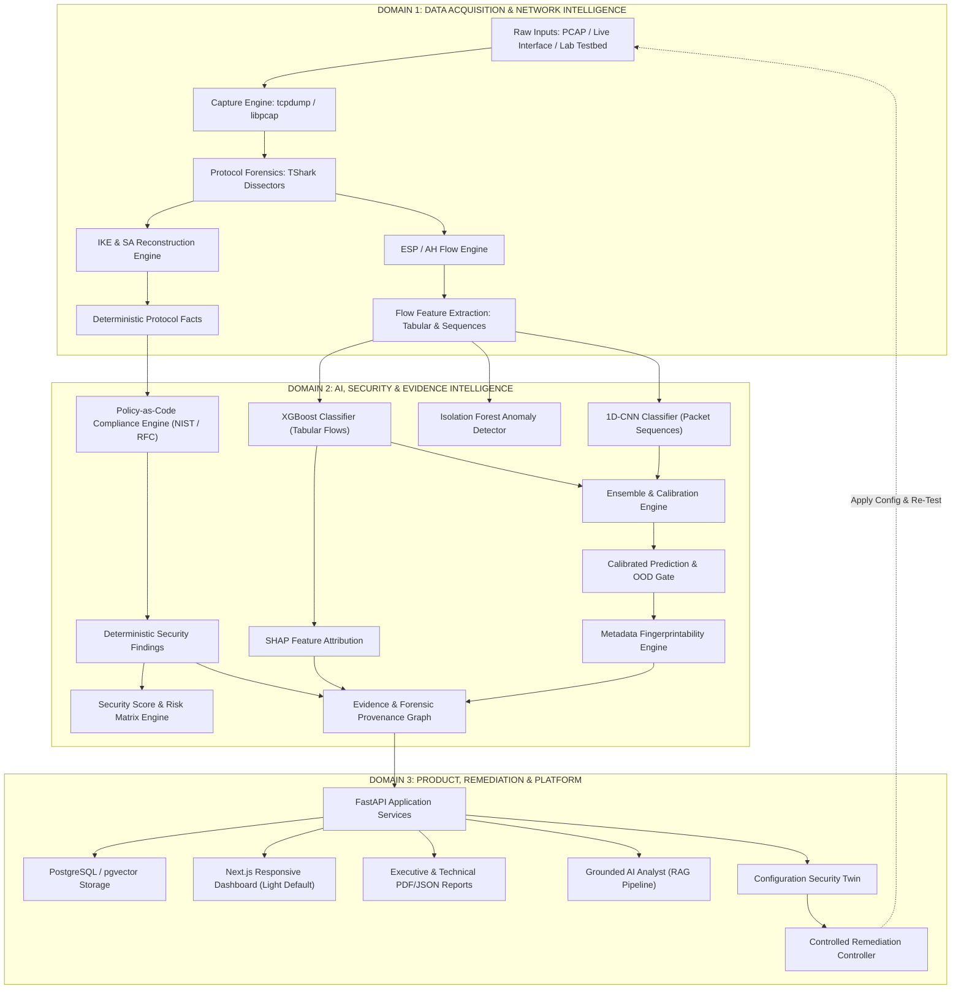
``

---

## 13. Three Main Architecture Domains

### Domain 1: Data Acquisition & Network Intelligence
- **Purpose:** Ingest raw packets from live network interfaces or PCAP files, decode layered protocols, extract deterministic parameters, reconstruct Security Association states, and aggregate ESP packets into structured flows.
- **Technologies:** Linux XFRM, strongSwan 5.9+, tcpdump, libpcap, TShark, PyShark.
- **Output:** Normalized protocol facts (JSON) and bidirectional flow feature records.

### Domain 2: AI, Security & Evidence Intelligence
- **Purpose:** Process encrypted flow features using statistical and deep learning models; evaluate protocol configurations against security standards; calculate multi-dimensional risk scores; and bind every finding to immutable packet evidence.
- **Technologies:** XGBoost, PyTorch, scikit-learn, SHAP, Python YAML Policy-as-Code Engine.
- **Output:** Calibrated traffic predictions, SHAP explanations, compliance audits, security scores, and forensic evidence links.

### Domain 3: Product, Remediation & Platform
- **Purpose:** Provide an intuitive, responsive user interface for security analysts, generate executive and technical documentation, support conversational natural-language exploration through grounded RAG, and orchestrate closed-loop remediation within the testbed.
- **Technologies:** FastAPI, PostgreSQL, pgvector, Next.js, TypeScript, Tailwind CSS, Apache ECharts, React Flow.
- **Output:** Interactive visual dashboards, downloadable audit reports, interactive twin modeling, and verified testbed configurations.

---

## 14. End-to-End Workflow

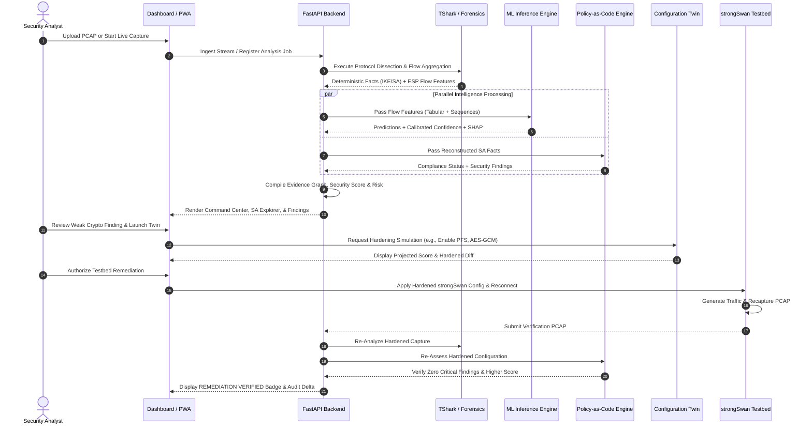
``

---

## 15. IPsec Testbed Architecture

To satisfy the strict requirements of SIH Problem Statement 26160, TUNNEL TRACE AI incorporates an automated, isolated, Linux-native IPsec testbed. The testbed runs across network namespaces, allowing repeatable generation of both compliant and vulnerable VPN configurations alongside varied network traffic workloads.

```mermaid
graph LR
    subgraph CLIENT_NS["Client Namespace (ns_client)"]
        TG["Traffic Generator: curl / iperf3 / ffmpeg / scp"]
        EP_A["Virtual Interface: veth_client (10.0.1.2)"]
        TG --> EP_A
    end

    subgraph GW_A_NS["Gateway A Namespace (ns_gw_a)"]
        GW_A_IN["Private Interface (10.0.1.1)"]
        SW_A["strongSwan 5.9+ (IPsec Endpoint A)"]
        WAN_A["WAN Interface: veth_wan_a (192.168.100.1)"]
        EP_A --- GW_A_IN
        GW_A_IN --> SW_A
        SW_A --> WAN_A
    end

    subgraph WAN_NS["Untrusted WAN Namespace (ns_wan)"]
        WAN_A --- BR["Virtual Bridge / Netem WAN Tap"]
        NETEM["tc netem: Latency, Jitter, Packet Loss Injection"]
        DUMP["Capture Point: tcpdump / libpcap (WAN PCAP Tap)"]
        BR --- NETEM
        NETEM --- DUMP
        DUMP --- WAN_B
    end

    subgraph GW_B_NS["Gateway B Namespace (ns_gw_b)"]
        WAN_B["WAN Interface: veth_wan_b (192.168.100.2)"]
        SW_B["strongSwan 5.9+ (IPsec Endpoint B)"]
        GW_B_OUT["Private Interface (10.0.2.1)"]
        WAN_B --> SW_B
        SW_B --> GW_B_OUT
    end

    subgraph SERVER_NS["Server Namespace (ns_server)"]
        EP_B["Virtual Interface: veth_server (10.0.2.2)"]
        SRV["Workload Targets: Nginx / RTMP / SIP / Echo Server"]
        GW_B_OUT --- EP_B
        EP_B --> SRV
    end
```
``

### Testbed Parameter Variation Matrix

**TESTBED CONFIGURATION MATRIX**

| Dimension | Supported Experimental Values | Purpose / Requirement Trace |
| :--- | :--- | :--- |
| Operational Mode | Tunnel Mode, Transport Mode | Mandatory PS Requirement A |
| IP Protocol Version | IPv4, IPv6 | Mandatory PS Requirement A |
| Encryption Cipher | AES-128-CBC, AES-256-CBC, AES-128-GCM, | Test legacy vs modern AEAD; |
|  | AES-256-GCM, 3DES (legacy test fixture) | Mandatory PS Requirement A |
| Integrity Hashing | HMAC-SHA256, HMAC-SHA384, HMAC-SHA1, None | Test integrity algorithms |
| Key Exchange / DH | Group 2 (1024-bit), Group 14 (2048-bit), | Evaluate cryptographic bits |
|  | Group 19 (ECP-256), Group 20 (ECP-384) | of security |
| Forward Secrecy | PFS Enabled (rekey DH), PFS Disabled | Assess forward secrecy posture |
| Encapsulation | Direct ESP (IP proto 50), NAT-T (UDP 4500) | Verify NAT traversal handling |
| Impairment (tc) | Delay: 5-150ms, Jitter: 1-30ms, Loss: 0-5% | Validate ML robustness under |
|  | Bandwidth: 1Mbps-100Mbps | real-world network turbulence |

---

## 16. Traffic Capture Architecture

TUNNEL TRACE AI supports two distinct ingestion pipelines:
1. **Offline Capture Ingestion:** Ingests standard `.pcap` and `.pcapng` files up to 2 GB via chunked HTTP upload or local filesystem binding. The file is hashed with SHA-256 immediately upon arrival to guarantee forensic integrity.
2. **Authorized Live Capture:** Binds to designated Linux host interfaces via `libpcap` running inside a privileged worker container. Live capture requires explicit administrative authorization and operates in read-only tap mode.

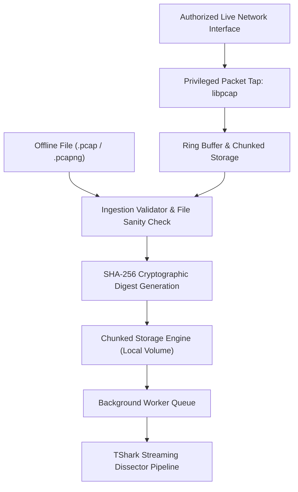
``

---

## 17. Protocol Forensics Engine

The Protocol Forensics Engine processes packet captures deterministically without executing external shell commands or invoking heuristic ML models. It interacts directly with the compiled dissector tree of TShark.

### Extracted Deterministic Parameters
- **IKE Protocol Details:** Version (IKEv1 / IKEv2), Exchange Type (IKE_SA_INIT, IKE_AUTH, CREATE_CHILD_SA, INFORMATIONAL), Initiator SPI, Responder SPI, Message ID.
- **Negotiated Transforms:** Encryption algorithms (ENCR), Key Exchange / DH groups (D-H), Pseudorandom functions (PRF), Integrity hashes (INTEG).
- **Security Associations:** Child SA creation, proposal acceptance, SPI allocations.
- **Network Metadata:** Encapsulation format (Raw ESP on Protocol 50 vs. UDP Encapsulation on Port 4500 for NAT-T), Traffic Selectors (source/destination subnets and ports), Sequence numbers.

---

## 18. Security Association (SA) Reconstruction

IPsec connections operate as a hierarchy of bidirectional security relationships. The SA Reconstruction Engine assembles individual packet observations into a coherent state model:

``
Capture Run
  └── IKE Session (Initiator SPI, Responder SPI)
        ├── IKE SA (Control Plane: Transforms, DH Group, PRF, Key Lifetimes)
        └── Child SA Pairs (Data Plane: Inbound SPI, Outbound SPI)
              ├── Traffic Selectors (Source Subnet <-> Destination Subnet)
              ├── Encapsulation Parameters (Tunnel vs. Transport Mode)
              └── Associated ESP Traffic Flows (Directional Packet Sequences)
``

### Forensic Uncertainty & Evidence States
Passive analysis cannot observe parameters that were never transmitted across the monitored link. Rather than hallucinating missing configuration details, TUNNEL TRACE AI enforces four discrete evidence states:

**EVIDENCE UNCERTAINTY STATES**

| Evidence State | Forensic Definition & Handling Rule |
| :--- | :--- |
| VERIFIED | Directly observed and validated within captured packet headers or payloads. |
| INFERRED | Statistically deduced from flow dynamics with high calibrated confidence. |
| UNKNOWN | Unobserved in capture (e.g., missing IKE handshake); flagged as UNKNOWN. |
| MISCONFIGURATION | Conflicting or structurally broken protocol implementations observed. |

---

## 19. Flow Reconstruction

Packets matching an established Child SA (or observed ESP SPI in the absence of IKE handshakes) are assembled into bidirectional network flows. Flow aggregation utilizes an inactivity timeout threshold (typically 60 seconds) or an explicit IKE SA termination message.

### Extracted Flow Dimensions
- **Volumetric Metrics:** Total packet count, total byte volume, forward-to-reverse packet ratio, forward-to-reverse byte ratio.
- **Timing & Rate Dynamics:** Flow duration, inter-arrival time mean, variance, skewness, and min/max bounds per direction.
- **Packet Length Distributions:** Minimum, maximum, mean, and standard deviation of packet lengths; quartile boundaries.
- **Burst Dynamics:** Run-length distributions of consecutive packets in a single direction; idle time distributions between packet bursts.

---

## 20. Machine Learning Traffic Intelligence

TUNNEL TRACE AI does not attempt to decrypt ESP packets. Instead, it classifies the broad category of traffic traversing an encrypted tunnel by analyzing observable side-channel flow patterns.

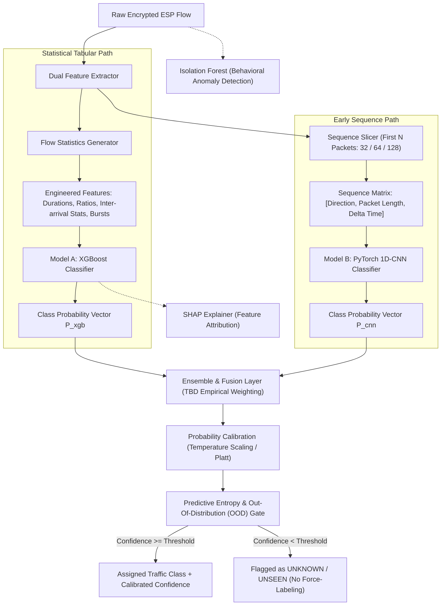
``

---

## 21. Model A: XGBoost Classifier

- **Input:** Engineered tabular vector of flow statistics (durations, packet size percentiles, inter-arrival dynamics, burst ratios).
- **Role:** High-performance tabular baseline that provides computational efficiency, resilience against outliers, and native integration with TreeSHAP for explainable AI.
- **Target Application Classes:**
  1. Web Browsing (HTTPS / HTTP)
  2. Video Streaming
  3. Voice over IP (VoIP)
  4. Chat / Instant Messaging (including WhatsApp behavior)
  5. Email (IMAP / SMTP / POP3)
  6. ICMP Network Probing
  7. File Transfer (SCP / SFTP / FTP)
  8. Unknown / Unseen Traffic

---

## 22. Model B: Lightweight 1D-CNN

- **Input:** Sequential matrix representing the first $N$ packets of an ESP flow (candidate sequence lengths: 32, 64, or 128 packets). Each packet is encoded as a three-dimensional vector:
  $$\mathbf{x}_i = [\text{Direction} \in \{-1, +1\}, \text{Packet Length} \in [0, 65535], \Delta \text{Time} \in [0, \infty)]$$
- **Role:** Captures early application handshake patterns, negotiation exchanges, and initial burst structures that tabular statistical aggregates compress away.
- **Architecture:** Lightweight multi-layer 1D convolutional network with batch normalization, ReLU activations, max pooling, and global average pooling before the classification head.

---

## 23. Model Calibration & AI Confidence

Standard machine learning models frequently produce overconfident probabilities that do not reflect true posterior accuracy. TUNNEL TRACE AI requires that all confidence scores be formally calibrated before presentation to the analyst.

- **Calibration Approach:** Post-hoc probability calibration via Temperature Scaling for neural sequence outputs and Platt Scaling / Isotonic Regression for tree-based models.
- **Evaluation Metrics:** Evaluated across test splits using Expected Calibration Error (ECE), Brier Score, and Reliability Diagrams.
- **Operational Rule:** An uncalibrated probability score must never be presented as an authoritative AI Confidence Metric.

---

## 24. Out-Of-Distribution (OOD) & Unknown Traffic Detection

A critical vulnerability of deployed network classifiers is force-labeling unseen applications into pre-existing training classes. TUNNEL TRACE AI implements explicit Out-Of-Distribution detection:

- **Mechanism:** Evaluates predictive entropy across the calibrated probability distribution combined with Mahalanobis distance in the feature space.
- **Operational Rule:** If an encrypted ESP flow does not exhibit sufficient similarity to known training distributions, the system labels it as **UNKNOWN / UNSEEN**. The platform explicitly prioritizes conservative classification over false certainty.

---

## 25. Explainability & SHAP Integration

To ensure full transparency, the system couples XGBoost predictions with SHAP (SHapley Additive exPlanations):

- **Purpose:** Identifies exactly which packet size distributions, burst directions, or timing intervals caused a specific encrypted flow to be classified under an application category.
- **Example Operational Attribution:** A flow classified as *Video Streaming* will highlight positive SHAP contributions from high sustained downstream packet lengths and low inter-arrival variance, contrasting with the bursty, bi-directional, small-packet profile characteristic of *Chat / Messaging*.
- **Forensic Guarantee:** Explanations are derived from mathematical feature contributions rather than synthetic text generation.

---

## 26. Behavioral Anomaly Detection

In parallel with supervised classification, TUNNEL TRACE AI deploys an unsupervised **Isolation Forest** to detect behavioral anomalies across ESP flows:

- **Observed Metrics:** Uncharacteristic throughput surges, unexpected packet size anomalies, abnormal SA rekey frequencies, or unusual peer communication volumes.
- **Strict Analytical Demarcation:** The system explicitly maintains that **Anomaly $\neq$ Attack**. Anomalous behavior is reported as an operational outlier requiring administrative review, not as a confirmed intrusion or zero-day exploit.

---

## 27. Dataset Strategy

The development of machine learning models for IPsec requires a transparent and methodologically sound data strategy. TUNNEL TRACE AI establishes a strict distinction between primary empirical data and supplementary public benchmarks.

**DATASET STRATEGY MATRIX**

| Dimension | Primary IPsec-Native Data | Supplementary Data | Downloaded Archive Status |
| :--- | :--- | :--- | :--- |
| Dataset Identifier | TunnelTrace Native IPsec | UNB/CIC ISCXVPN2016 | UNB/CIC Local Archives |
| Encapsulation Type | Native IPsec (ESP/AH) | OpenVPN over TLS | OpenVPN over TLS |
| Source Environment | Controlled strongSwan Lab | University of NB/CIC | Pre-downloaded Local Pkg |
| Role in Project | PRIMARY Training & Audit | SECONDARY Benchmark | Baseline Inspection |
| Ground Truth Trace | Paired Pre/Post Encrypt | Application Labels | Package Metadata Labels |
| Protocol Alignment | 100% Exact Match | Domain Shift Present | Domain Shift Present |
| Current Status | Generation In Progress | Reference Baseline | TBD - Local Verification |

---

## 28. Own IPsec-Native Dataset Generation

Because public network datasets almost universally capture OpenVPN or raw TLS rather than native IPsec ESP, the primary dataset for TUNNEL TRACE AI is generated directly within our automated testbed:

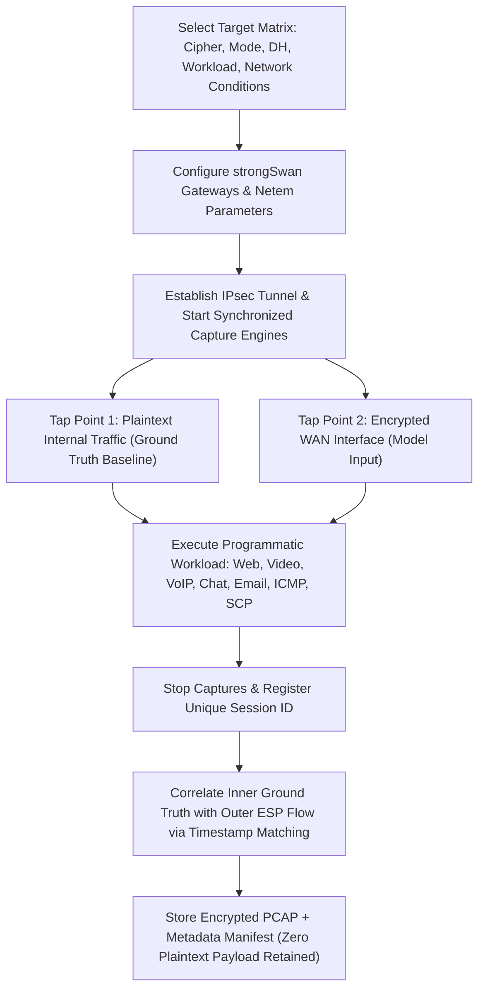
``

---

## 29. UNB/CIC Supplementary Dataset & Local File Accounting

The project incorporates the public UNB/CIC ISCXVPN2016 dataset solely as a supplementary reference for encrypted-traffic methodology research and feature extractor benchmarking.

### Critical Protocol Demarcation
ISCXVPN2016 captures traffic encapsulated via OpenVPN over TLS. OpenVPN introduces distinct user-space framing, TLS records, and transport wrappers that do not match the binary framing of IPsec ESP operating directly over IP Protocol 50 or UDP port 4500. Consequently, UNB/CIC data is never mixed homogeneously with native IPsec training data.

### Local Downloaded Archive Tracking
The engineering team has downloaded two initial archive packages from the UNB/CIC repository for exploratory evaluation:
- *File 1 Status:* Downloaded; estimated size ~600+ MB (`TBD — Verify downloaded UNB/CIC archive filename and exact size`).
- *File 2 Status:* Downloaded; estimated size ~1.8+ GB (`TBD — Verify downloaded UNB/CIC archive filename and exact size`).
- *Total Dataset Context:* The complete UNB/CIC ISCXVPN2016 corpus comprises ~28 GB of traffic. Downloaded archives represent targeted subsets and must be verified locally prior to experimental benchmarking.

---

## 30. Ground Truth Methodology

In commercial networks, obtaining verified ground truth for encrypted traffic without decrypting user payloads is notoriously difficult. TUNNEL TRACE AI achieves non-repudiable ground truth exclusively within its controlled testbed by intercepting traffic at two synchronized vantage points:
1. **Internal Client Interface (Pre-Encryption):** Captures cleartext application signatures, HTTP request headers, DNS lookups, or SIP signaling frames to establish verified application labels.
2. **External WAN Interface (Post-Encryption):** Captures the resulting encrypted ESP packets identified by the active SPI.
3. **Correlation Engine:** Binds the verified internal label to the external ESP flow based on strict timing synchronization, then permanently discards internal cleartext payloads.

---

## 31. Dataset Splitting & Leakage Prevention

A critical error in network machine learning is random packet or flow splitting, where packets from the same communication session appear in both training and test sets, artificially inflating accuracy.

- **Mandatory Splitting Rule:** TUNNEL TRACE AI strictly enforces **Session-Level Splitting** (GroupKFold by Session ID).
- **Guarantee:** All flows, packets, and bursts originating from a given testbed run or capture session are assigned exclusively to either the training split, validation split, or test split. No session data crosses the split boundary.

---

## 32. Cross-Configuration Evaluation

To verify that models learn generalizable application traffic behavior rather than memorizing specific cryptographic packet lengths or network artifacts, the platform incorporates cross-configuration stress testing:

**CROSS-CONFIGURATION EVALUATION MATRIX**

| Test Dimension | Training Distribution | Evaluation Hold-Out | Evaluation Objective |
| :--- | :--- | :--- | :--- |
| Cipher Invariance | AES-128-GCM Flows | AES-256-CBC + HMAC | Verify model does not overfit |
|  |  |  | to specific cipher pad lengths |
| Protocol Version | IPv4 En-route ESP | IPv6 En-route ESP | Verify robustness across IP |
|  |  |  | header length differences |
| Network Conditions | Baseline LAN (0ms loss | Netem Jitter & Loss | Prove stability under real |
|  | 0ms delay) | (50ms delay, 2% loss) | WAN degradation |
| Operational Mode | Tunnel Mode | Transport Mode | Evaluate mode boundary shifts |

---

## 33. Security Assessment Engine

Security assessment within TUNNEL TRACE AI is entirely deterministic and decoupled from machine learning. The engine evaluates observed protocol parameters against formal cryptographic security standards encoded as versioned YAML Policy-as-Code.

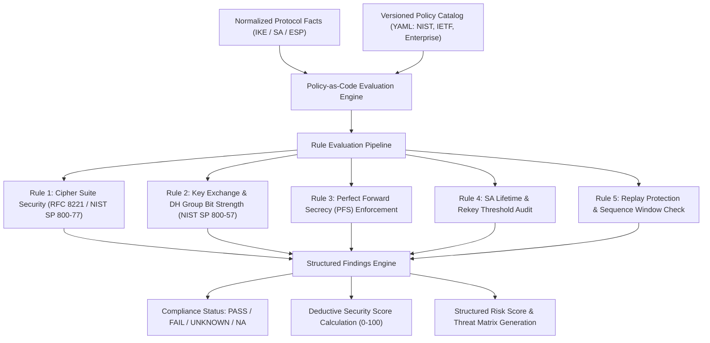
``

---

## 34. Authoritative Standards & Policy-as-Code

The Policy Engine implements baseline profiles sourced directly from authoritative international standards:
- **NIST SP 800-77 Rev. 1:** Guide to IPsec VPNs.
- **NIST SP 800-57 Part 1 Rev. 5:** Recommendation for Key Management (cryptographic algorithm security strengths).
- **RFC 7296:** Internet Key Exchange Protocol Version 2 (IKEv2).
- **RFC 8221:** Cryptographic Algorithm Implementation Requirements for ESP and AH.
- **RFC 8247:** Cryptographic Algorithm Implementation Requirements for IKEv2.
- **RFC 4301 / 4303:** Security Architecture for the Internet Protocol & ESP Specifications.

---

## 35. Security Score Methodology

The **Security Score** is a product-defined, fully transparent 0–100 index representing the defensive posture of an evaluated IPsec deployment.

### Scoring Dimensions & Principles
1. **Deterministic Deductions:** The score begins at 100 and deducts points strictly based on verified policy findings.
2. **Transparent Traceability:** Every score deduction must trace directly to a specific finding, rule ID, and packet frame reference.
3. **No Black-Box Scoring:** The score is never generated by an ML model or LLM.
4. **Scoring Dimensions:**
   - Cryptographic Algorithm Strength (Cipher & Integrity)
   - Key Exchange & Diffie-Hellman Bit Security
   - Perfect Forward Secrecy (PFS) Enforcement
   - Security Association Management & Rekey Lifetimes
   - Anti-Replay Protection & Sequence Windowing
   - Operational Compliance Against Selected Profile
   - Side-Channel Metadata Exposure
5. **Exact Dimension Weights:** `TBD — Requires empirical validation and mentor review`.

---

## 36. Risk Scoring & Threat Matrix

Findings generated by the Policy Engine map into a structured **Threat Matrix** detailing potential adversarial exploitation:

**STRUCTURED THREAT MATRIX**

| Threat Category | Triggering Condition | Likelihood | Severity | Authoritative Standard |
| :--- | :--- | :--- | :--- | :--- |
| Deprecated Cipher | 3DES or DES negotiated | HIGH | CRITICAL | NIST SP 800-77 / RFC 8221 |
| Sweet32 Collision | 64-bit block ciphers | MEDIUM | HIGH | CVE-2016-2183 / RFC 8221 |
| Weak Key Exchange | DH Group 1 or 2 | HIGH | CRITICAL | NIST SP 800-57 / RFC 8247 |
| Missing PFS | Child SA rekey without | MEDIUM | HIGH | NIST SP 800-77 Rev. 1 |
|  | new Diffie-Hellman ex |  |  |  |
| Replay Exposure | Sequence counter wrap | LOW | HIGH | RFC 4303 (Section 3.3.3) |
|  | or disabled anti-rep |  |  |  |
| Metadata Profiling | High fingerprintabili | MEDIUM | MEDIUM | Side-Channel Leakage Model |

---

## 37. Metadata Fingerprintability

Even when an IPsec tunnel utilizes strong cryptographic transforms (e.g., AES-256-GCM with DH Group 19), external metadata remains visible to network eavesdroppers:
- Outer IP addresses and geographic locations.
- ESP packet lengths revealing payload size distributions.
- Precise packet inter-arrival times and burst characteristics.
- Total communication volume and temporal usage schedules.

### Metadata Fingerprintability Index
TUNNEL TRACE AI introduces an experimental **Metadata Fingerprintability Index** that measures how readily an outside observer can fingerprint the underlying application workload without decryption:
- **Input Signals:** Calibrated classifier certainty, burst predictability, and packet-size clustering.
- **Strict Analytical Demarcation:** The system explicitly maintains that **High Fingerprintability $\neq$ Plaintext Leakage**. A score of 80/100 does not indicate that 80% of data was compromised; it indicates that traffic patterns are 80% distinguishable from background noise.
- **Exact Formulation:** `TBD — Requires empirical validation`.

---

## 38. Evidence & Forensic Provenance

A foundational tenet of TUNNEL TRACE AI is absolute forensic non-repudiation. Every conclusion asserted by the platform links to an immutable chain of evidence:

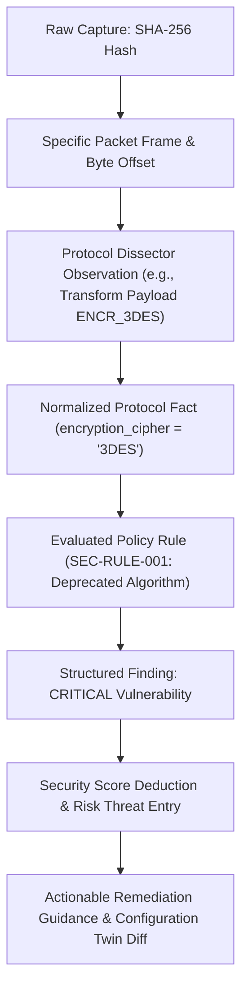
``

### Tracked Provenance Metadata
Every generated analysis record stores:
- Source PCAP SHA-256 digest and capture timestamp.
- Software parser version and dissector build number.
- Machine learning model identifiers and feature schema version hashes.
- Policy-as-Code ruleset version and compliance profile identifier.
- Unique execution UUID linking all database records.

---

## 39. Configuration Security Twin

The **Configuration Security Twin** is an interactive configuration modeling tool that allows security administrators to simulate the impact of security hardening before modifying active gateways.

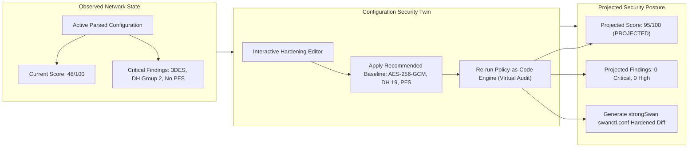
``

*Operational Boundary:* The Configuration Security Twin is a policy and compliance projection tool; it is not a full-scale network traffic emulator.

---

## 40. Closed-Loop Remediation Engine

TUNNEL TRACE AI bridges the gap between passive reporting and active operational validation through its **Closed-Loop Remediation** pipeline:

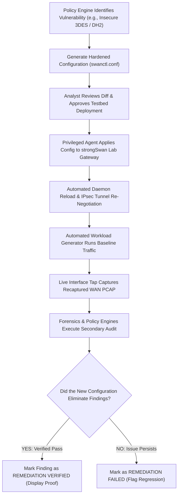
``

### Safety & Automation Boundaries
To protect operational infrastructure:
- **Restricted Target:** Automated remediation execution is strictly restricted to the local strongSwan testbed environment.
- **No Production Automation:** The platform does not push configuration changes to production firewalls or third-party appliances (Cisco, FortiGate, pfSense). Support for third-party systems is strictly limited to generating exportable configuration diffs.

---

## 41. Reporting System

The platform automatically compiles two distinct, formal report formats:

### 1. Executive Summary Report
- **Target Audience:** Chief Information Security Officers (CISOs), compliance managers, and executive leadership.
- **Contents:** High-level Security Posture Score (0–100), overall risk categorization, compliance status across regulatory baselines (NIST, IETF), summary of critical vulnerabilities, and strategic remediation milestones.

### 2. Technical Audit & Forensic Report
- **Target Audience:** Network security engineers, SOC analysts, and incident responders.
- **Contents:** Full forensic provenance (PCAP SHA-256, tool versions), detailed IKE exchange timeline, complete Security Association tables (SPIs, transforms, lifetimes), encrypted ESP flow classifications with calibrated confidence, SHAP feature attributions, exact packet frame evidence links, and copy-pasteable configuration remediation diffs.

---

## 42. Grounded AI Analyst (RAG Pipeline)

To assist analysts in interpreting complex cryptographic findings without introducing artificial hallucinations, TUNNEL TRACE AI incorporates a **Grounded Retrieval-Augmented Generation (RAG)** assistant:

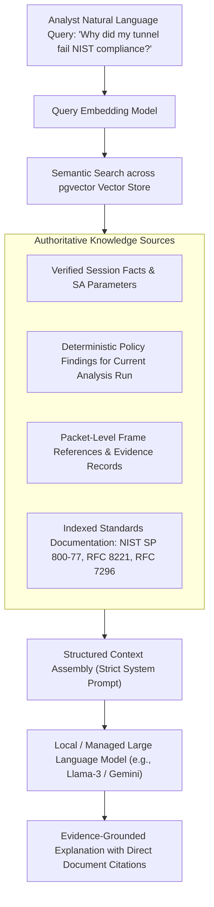
``

### Absolute Governance Constraints
- The LLM is strictly an **explanatory interface**.
- The LLM is technically barred from asserting protocol facts, generating security findings, modifying security scores, or determining compliance states.
- If the RAG service or LLM endpoint is offline, 100% of core platform capabilities (forensics, classification, policy evaluation, reporting, and remediation) remain fully operational.

---

## 43. Product & UI Modules

The user interface of TUNNEL TRACE AI is structured into fourteen specialized operational modules designed for high-density, low-latency cybersecurity investigation:

**USER INTERFACE MODULE MATRIX**

| Module Name | Operational Purpose & User Capabilities |
| :--- | :--- |
| 1. Command Center | Unified SOC overview displaying security score, active alerts, and quick-stats |
| 2. Analyze Hub | Drag-and-drop PCAP upload, live capture initialization, and run management |
| 3. Protocol Intel | Detailed IKE exchange timeline, transform breakdowns, and packet-level decode |
| 4. SA Explorer | Interactive React Flow graph visualizing IKE SAs, Child SAs, SPIs, and flows |
| 5. Traffic Intel | Encrypted flow classification dashboard, confidence meters, and volume graphs |
| 6. Security Audit | Interactive findings table filterable by severity, rule ID, and impact |
| 7. Compliance Hub | Regulatory compliance checklist tracking adherence to NIST and RFC standards |
| 8. Threat Matrix | Visual mapping of vulnerabilities to threat actors, likelihood, and severity |
| 9. Evidence Browser | Frame-by-frame packet inspection tying findings directly to raw hex decodes |
| 10. Security Twin | What-if configuration simulator modeling score changes before deployment |
| 11. Remediation | Side-by-side configuration diff viewer and automated lab re-test trigger |
| 12. Report Engine | One-click export of Executive and Technical audit reports in PDF / JSON format |
| 13. AI Analyst | Grounded conversational assistant answering forensic and standards questions |
| 14. Testbed Lab | Topology manager to configure, run, and capture traffic across strongSwan lab |

### Design Standards
- **Color Theme:** Clean Light Mode default engineered for high-contrast visibility during daytime audits; Dark Mode toggle supported.
- **Responsive Architecture:** Desktop-first SOC workstation layout; adaptive layouts for tablet and mobile PWA monitoring.

---

## 44. Data Architecture Summary

The storage architecture cleanly separates structured analytical entities from raw binary capture files:

**DATA STORAGE ARCHITECTURE**

| Storage Tier | Technology | Stored Data Entities |
| :--- | :--- | :--- |
| Relational DB | PostgreSQL 16+ | Analysis jobs, reconstructed SAs, flows, |
|  |  | policy findings, risk scores, audit logs |
| Vector Store | pgvector extension | RFC standards text, NIST guidelines, and local |
|  |  | documentation embeddings for RAG retrieval |
| File / Object Store | Local Volume / MinIO | Raw PCAP/PCAPNG files, generated PDF audit |
|  |  | reports, raw ML model artifacts |
| Cache & Message Bus | Redis (Optional / Async) | Real-time background job state, WebSocket push |
|  |  | queues for live analysis streaming |

*Data Storage Rule:* Raw multi-gigabyte PCAP binaries are never stored directly within PostgreSQL database tables; they reside in managed object storage referenced by SHA-256 hashes.

---

## 45. Technology Stack

The platform is constructed using an enterprise-grade, maintainable open-source technology stack:

**TECHNOLOGY STACK MATRIX**

| Architectural Layer | Selected Technology | Technical Selection Rationale |
| :--- | :--- | :--- |
| Frontend Framework | Next.js 14+ (React / TS) | High-performance SSR/SSG, type safety, modular |
| Styling & UI Tokens | Tailwind CSS (Vanilla CSS) | Lightweight, predictable design system |
| Graph Visualization | React Flow | Native node-edge visualization for SA Explorer |
| Analytics Charting | Apache ECharts | High-performance canvas rendering for flows |
| Backend API Server | Python 3.11+ / FastAPI | Asynchronous throughput, native ML integration |
| Network Parsing | TShark / PyShark / libpcap | Industry-standard, robust protocol dissectors |
| Testbed Environment | Linux / strongSwan 5.9+ | Reference enterprise open-source IPsec gateway |
| Impairment Engine | Linux iproute2 (tc netem) | Kernel-level latency, jitter, and loss injection |
| Tabular ML Model | XGBoost | Fast, robust, gradient-boosted decision trees |
| Sequence ML Model | PyTorch (1D-CNN) | Flexible temporal deep learning on early packets |
| Explainable AI | SHAP (TreeSHAP) | Mathematically rigorous feature attribution |
| Anomaly Detection | scikit-learn (Isolation F.) | Lightweight, unsupervised outlier identification |
| Policy Engine | Python / PyYAML | Declarative, human-readable Policy-as-Code rules |
| Database & Vector | PostgreSQL 16+ / pgvector | Unified ACID relational and semantic search |
| Containerization | Docker / Docker Compose | Reproducible, cross-platform deployment |

---

## 46. Deployment Architecture

TUNNEL TRACE AI implements a local-first deployment model running through Docker Compose, ensuring sensitive network captures remain within the security perimeter:

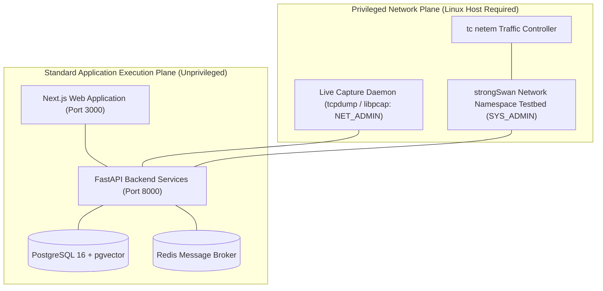
``

---

## 47. Privileged Network Boundary

A fundamental architectural distinction exists between unprivileged web services and privileged network daemons:
- **Unprivileged Plane:** Web UI, API servers, machine learning inference workers, policy engines, and database containers run under standard, non-root user namespaces.
- **Privileged Plane:** Live network packet capturing (`libpcap`), network namespace orchestration (`ip netns`), IPsec cryptographic policy configuration (`setkey` / XFRM), and network impairment injection (`tc netem`) require Linux kernel capabilities (`CAP_NET_ADMIN`, `CAP_NET_RAW`, `CAP_SYS_ADMIN`).
- **Isolation Guarantee:** Browser environments and serverless runtimes can never directly execute raw socket operations. All privileged actions are mediated through authenticated backend worker services.

---

## 48. Testing & Validation Approach

Validation within TUNNEL TRACE AI is structured across distinct technical layers, avoiding artificial performance claims:

**TESTING & VALIDATION MATRIX**

| Subsystem | Target Assessment Metric | Validation Methodology |
| :--- | :--- | :--- |
| Protocol Engine | 100% Parsing Accuracy | Evaluated against golden strongSwan testbed PCAPs |
|  | on Known IKE / ESP Fields | with known ground-truth cryptographic transforms |
| ML Flow Classifier | Macro-F1, Precision, | Evaluated exclusively on held-out, session-level |
|  | Per-Class Recall | isolated test splits (GroupKFold by Session ID) |
| Model Calibration | Expected Calibration Error | Evaluated via Reliability Diagrams and Brier |
|  | (ECE) & Brier Score | Scores before and after post-hoc calibration |
| OOD Detection | False Positive Rate on | Evaluated by injecting completely unseen network |
|  | Unseen Traffic Classes | protocols (e.g., BitTorrent, Tor) into pipeline |
| Policy Engine | Zero Logic Regressions | Positive, negative, and edge-case unit test |
|  | on Regulatory Baselines | fixtures validating RFC and NIST compliance rules |
| Remediation Engine | Deterministic Risk Delta | Before-and-after testbed re-captures verifying |
|  | Verification | eradication of target security findings |

---

## 49. Implementation Roadmap

The engineering execution plan is divided into eleven sequential, verifiable phases:

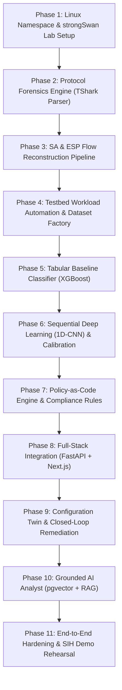
``

---

## 50. Main Innovations

**KEY INNOVATION MATRIX**

| Innovation Pillar | Technical Impact & Competitive Advancement |
| :--- | :--- |
| 1. Hybrid Engine | Decouples deterministic protocol facts from probabilistic ML flow inference |
| 2. Zero Decryption | Identifies applications inside ESP via side-channel metadata without keys |
| 3. Dataset Factory | Programmatically generates native IPsec captures with synchronized ground truth |
| 4. OOD Gatekeeper | Rejects unseen applications as UNKNOWN rather than hallucinating wrong labels |
| 5. Evidence Provenance | Maps every finding directly to raw packet frames, byte offsets, and RFC specs |
| 6. Security Twin | Models the security score impact of proposed configuration changes in advance |
| 7. Closed-Loop Lab | Applies configuration fixes to active gateways and verifies them via re-test |
| 8. Grounded RAG | Explains cryptographic standards without allowing the LLM to invent findings |

---

## 51. Requirement-to-Solution Mapping

This matrix explicitly demonstrates how TUNNEL TRACE AI satisfies every mandatory provision of SIH Problem Statement 26160:

**REQUIREMENT-TO-SOLUTION MAPPING**

| Official PS Requirement | Solution Subsystem | Technical Mechanism | Status |
| :--- | :--- | :--- | :--- |
| Tunnel & Transport Modes | Testbed + Forensics Engine | Linux XFRM + TShark | PLANNED / VALID |
| AES-128, AES-256, GCM | Testbed + Forensics Engine | strongSwan Transforms | PLANNED / VALID |
| CBC + HMAC Ciphers | Testbed + Forensics Engine | strongSwan Transforms | PLANNED / VALID |
| DH / Key Exchange Groups | Testbed + Forensics Engine | IKE Transform Parser | PLANNED / VALID |
| PFS Enabled vs Disabled | Testbed + Policy Engine | Child SA Rekey Audit | PLANNED / VALID |
| IPv4 & IPv6 Compatibility | Testbed + Ingestion Engine | Dual-Stack Netns | PLANNED / VALID |
| VoIP, WhatsApp, Streaming | Testbed Workloads + ML Engine | Application Scripts | PLANNED / VALID |
| Offline PCAP & Live Tap | Ingestion & Capture Engine | libpcap + TShark | PLANNED / VALID |
| Identify Transforms & SAs | Forensics & SA Tracker | State Machine Parser | PLANNED / VALID |
| Traffic Prediction in ESP | Encrypted ML Intelligence | XGBoost + 1D-CNN | PLANNED / VALID |
| Cryptographic Compliance | Security Policy Engine | NIST / RFC Rules | PLANNED / VALID |
| Security & Risk Scoring | Security Score & Threat Matrix | Deductive Scoring | PLANNED / VALID |
| Comprehensive Reporting | Executive & Technical Exporters | PDF / JSON Generator | PLANNED / VALID |
| Grounded Explanation | AI Analyst Engine | pgvector + RAG LLM | PLANNED / VALID |

---

## 52. SIH Golden Demo Flow

The live demonstration of TUNNEL TRACE AI for the SIH evaluation panel follows a seamless, 28-step operational script:

```mermaid
graph TD
    A["1. Launch strongSwan Testbed with Vulnerable Config (3DES, DH2, No PFS)"] --> B["2. Generate Mixed Workload (Video, VoIP, Web, Messaging)"]
    B --> C["3. Live-Capture Network Traffic into TUNNEL TRACE AI"]
    C --> D["4. System Detects IPsec, Reconstructs IKE Session & Child SAs"]
    D --> E["5. Display SA Explorer Graph & Reconstructed SPI Mappings"]
    E --> F["6. Show Encrypted Flow Predictions (VoIP, Video) Without Decryption"]
    F --> G["7. Demonstrate Calibrated AI Confidence & SHAP Feature Importance"]
    G --> H["8. Highlight Critical Policy Failures (NIST SP 800-77 Non-Compliance)"]
    H --> I["9. Display Deductive Security Score: 42/100 (HIGH RISK)"]
    I --> J["10. Click Vulnerability & Trace Directly to Frame Hex in Evidence Explorer"]
    J --> K["11. Open Configuration Security Twin & Load Hardened Profile"]
    K --> L["12. Display Projected Security Score Improvement: 95/100"]
    L --> M["13. Click Authorize Remediation (Deploys AES-256-GCM + DH19 to Lab)"]
    M --> N["14. Gateway Re-Negotiates; Testbed Recaptures New Traffic Stream"]
    N --> O["15. Secondary Audit Executes: Zero Critical Findings Detected"]
    O --> P["16. System Displays REMEDIATION VERIFIED Badge & Exports Final Audit PDF"]
```
``

---

## 53. Demo Fallback Strategy

To guarantee an uninterrupted presentation regardless of venue connectivity or hardware constraints, the team maintains a three-tiered fallback plan:
- **Level 1 (Primary Live Demo):** Real-time execution across the automated local strongSwan testbed with live traffic generation and dynamic remediation.
- **Level 2 (Pre-Captured Lab Fixtures):** Instant replay of pre-recorded, multi-scenario PCAP captures generated directly from the identical testbed environment.
- **Level 3 (Deterministic Offline Mode):** Completely disconnected local execution using pre-computed vector indices, cached model artifacts, and pre-rendered reporting templates. The core platform does not require external internet or cloud LLM availability.

---

## 54. Major Technical Risks & Mitigation

**TECHNICAL RISK MATRIX**

| Identified Risk | Severity / Impact | Engineering Mitigation Strategy |
| :--- | :--- | :--- |
| Testbed Overfitting | High / Poor real-world | Inject synthetic jitter, loss, and latency via tc |
|  | generalization | netem; execute cross-configuration hold-out validation |
| OpenVPN Shift | High / Model failure | Explicitly restrict UNB/CIC data to secondary research |
|  | on native IPsec ESP | Primary model training uses native testbed IPsec data |
| Incomplete Handshake | Med / Missing crypto | Gracefully degrade to UNKNOWN states; infer flow |
| Ingestion | parameters in capture | dynamics without hallucinating missing transform facts |
| Model Overconfidenc | Med / False certainty | Enforce post-hoc calibration (ECE) and explicit |
|  | on ambiguous flows | predictive entropy gating (flag as UNKNOWN / UNSEEN) |
| Memory Consumption | Med / Host crashes | Stream packets through TShark using chunked iterators; |
| on Large PCAPs | during large analysis | avoid loading raw capture files entirely into memory |
| Privileged Boundary | Med / Container breach | Strictly isolate privileged network capabilities |
| Violation | or system instability | to dedicated background workers; drop root on API |

---

## 55. Known System Limitations

1. **Passive Observability Limits:** A passive network capture cannot observe parameters never transmitted over the wire (e.g., local gateway memory state, internal pre-shared key text, or private RSA keys).
2. **Incomplete Captures:** If a capture commences after the initial IKE handshake has completed, negotiated transform proposals cannot be recovered. The system accurately marks these transforms as `UNKNOWN` rather than guessing.
3. **Probabilistic Traffic Classification:** Classifying encrypted traffic without payload access is inherently statistical. While calibrated confidence mitigates false certainty, classification cannot achieve 100% mathematical certainty under extreme network shaping or padding.
4. **Remediation Target Scope:** Automated remediation execution is currently engineered and validated exclusively for the Linux strongSwan testbed. Support for commercial hardware appliances remains a future roadmap objective.
5. **Score Definition:** The Security Score is an analytical, product-defined index derived from published standards; it is not an official government certification score issued by NIST or NTRO.

---

## 56. Architecture Component Matrix

**ARCHITECTURE COMPONENT MATRIX**

| Component Name | Domain | Core Purpose | Primary Inputs | Primary Output / Tech |
| :--- | :--- | :--- | :--- | :--- |
| Testbed Manager | Dom. 1 | Automated Lab Setup | Topology Config | Linux Netns / strongSwan |
| Ingestion Engine | Dom. 1 | Packet Stream Ingest | PCAP / Live Tap | Validated Packet Stream |
| Protocol Forensics | Dom. 1 | Packet Dissection | Raw Frames | Normalized JSON Facts |
| SA Tracker | Dom. 1 | Reconstruct SAs | IKE / ESP Headers | SA Graph & SPI Table |
| Flow Engine | Dom. 1 | Assemble ESP Flows | ESP Packets | Bi-directional Flows |
| Feature Extractor | Dom. 1 | Feature Engineering | Assembled Flows | Tabular & Sequence Mats |
| XGBoost Classifier | Dom. 2 | Tabular Flow ML | Flow Statistics | Class Probability Vector |
| 1D-CNN Classifier | Dom. 2 | Sequential Packet ML | Early Packet Seq | Sequence Probabilities |
| Calibration & OOD | Dom. 2 | Reliability & Gating | Raw Model Output | Calibrated Label / OOD |
| SHAP Explainer | Dom. 2 | Feature Attribution | Model & Flow Vector | SHAP Feature Values |
| Isolation Forest | Dom. 2 | Anomaly Detection | Flow Features | Outlier Anomaly Flags |
| Policy Engine | Dom. 2 | Compliance Audit | Protocol Facts | Compliance Audit States |
| Scoring Engine | Dom. 2 | Posture Calculation | Policy Findings | Security Score & Risk |
| Provenance Graph | Dom. 2 | Forensic Evidence | Facts & Findings | Relational Evidence Map |
| Backend API | Dom. 3 | Platform Services | Worker Results | FastAPI Endpoints |
| Database & Vector | Dom. 3 | Persistent Storage | Structured Records | PostgreSQL / pgvector |
| Interactive UI | Dom. 3 | SOC Visual Dashboard | API Endpoints | Next.js / React Flow |
| Security Twin | Dom. 3 | Policy Simulation | Proposed Config | Projected Posture Diff |
| Remediation Engine | Dom. 3 | Closed-Loop Validate | Approved Fix | Verified Testbed State |
| AI Analyst (RAG) | Dom. 3 | Grounded Explanation | User Queries | Contextual Explanations |

---

## 57. Open Decisions & TBD Matrix

To preserve scientific rigor, TUNNEL TRACE AI explicitly itemizes design parameters currently designated as frozen versus those subject to ongoing empirical validation:

**FROZEN VS TBD DESIGN MATRIX**

| Architectural Decision / Parameter | Engineering Status | Validation Path |
| :--- | :--- | :--- |
| Core Product Positioning | FROZEN | Architectural Baseline |
| Four-Layer Intelligence Separation | FROZEN | Architectural Baseline |
| Model A Selection: XGBoost | FROZEN | Empirical Tabular Baseline |
| Model B Selection: PyTorch 1D-CNN | FROZEN | Sequence Modeling Baseline |
| Own IPsec Testbed as Primary Data | FROZEN | Protocol-Native Necessity |
| UNB/CIC Data as Secondary Bench. | FROZEN | Protocol-Domain Boundary |
| Session-Level Data Splitting | FROZEN | Data Leakage Prevention |
| Policy-as-Code Engine via YAML | FROZEN | Deterministic Compliance |
| Closed-Loop strongSwan Remediation | FROZEN | Verifiable Prototype Scope |
| Local-First Desktop PWA Stack | FROZEN | Enterprise Privacy Default |
| Sequence Length N (1D-CNN) | TBD - Requires Empirical Valid. | Benchmark 32 vs 64 vs 128 |
| Model Ensemble Fusion Weights | TBD - Requires Empirical Valid. | Optimization on Val Split |
| Calibration Method (Platt vs Temp) | TBD - Requires Empirical Valid. | Minimize ECE on Validation |
| OOD Entropy Cutoff Threshold | TBD - Requires Empirical Valid. | Test with Unseen Datasets |
| Isolation Forest Anomaly Cutoff | TBD - Requires Empirical Valid. | Contamination Tuning |
| Exact Security Score Weights | TBD - Requires Empirical Valid. | Mentor & Standards Review |
| Metadata Fingerprintability Form. | TBD - Requires Empirical Valid. | Feature Information Metric |
| Exact Downloaded UNB Archive Spec | TBD - Requires Local File Verify | Inspect Local Archives |

---

## 58. Mentor Review Summary

To facilitate an efficient review with project mentors, faculty advisors, and technical evaluators, this summary synthesizes the essence of TUNNEL TRACE AI:

1. **What We Are Building:** An automated, explainable security intelligence platform that inspects IPsec VPN traffic, audits cryptographic posture against official standards, classifies encrypted application flows without decryption, and verifies configuration remediation in a controlled lab.
2. **Why This Approach:** Traditional packet analyzers display raw bytes but require manual interpretation. Pure machine learning systems hallucinate when predicting observable protocol facts. TUNNEL TRACE AI uses a hybrid architecture: direct facts are parsed deterministically, encrypted flows are classified via ML, compliance is scored via Policy-as-Code, and human explanations are grounded via RAG.
3. **Where Data Comes From:** The primary dataset is generated programmatically within our own multi-namespace Linux strongSwan testbed, guaranteeing native IPsec ESP ground truth. Public UNB/CIC datasets are utilized strictly as secondary comparative benchmarks due to protocol domain shift.
4. **How Security Is Assessed:** Evaluated deterministically against NIST SP 800-77 Rev. 1, RFC 8221, and RFC 8247 using declarative YAML policies. Every score deduction traces directly to specific packet frame numbers and byte offsets.
5. **How We Prove It Works:** We demonstrate an end-to-end operational loop: start with a vulnerable tunnel, identify vulnerabilities, infer encrypted application traffic, simulate hardening in a Configuration Security Twin, apply the fix to the testbed, re-capture traffic, and verify that the security findings are resolved.

---

## 59. Areas for Mentor Feedback & Guidance

The engineering team welcomes specific guidance from technical mentors on the following architectural items:

**MENTOR DISCUSSION TOPICS**

| No. | Strategic Architecture & Validation Question |
| :--- | :--- |
| 1. | Does the scope of the Linux strongSwan testbed sufficiently cover the evaluation scenarios |
|  | expected by the NTRO technical panel, or should additional edge cases be prioritized? |
| 2. | What specific weighting distribution across cryptographic strength vs. metadata exposure |
|  | would best align with government compliance expectations for the Security Score? |
| 3. | Are there specific legacy enterprise ciphers (e.g., Camellia, SEED, or proprietary DH groups) |
|  | that should be explicitly incorporated into our negative test fixtures? |
| 4. | Does the proposed session-level dataset splitting methodology adequately satisfy defense |
|  | evaluation standards for machine learning validity? |
| 5. | What additional side-channel traffic features would provide the strongest mathematical value |
|  | for refining the Metadata Fingerprintability Index? |

---

## 60. References

1. **NIST Special Publication 800-77 Revision 1:** *Guide to IPsec VPNs*, National Institute of Standards and Technology, 2020.
2. **NIST Special Publication 800-57 Part 1 Revision 5:** *Recommendation for Key Management*, National Institute of Standards and Technology, 2020.
3. **RFC 7296:** *Internet Key Exchange Protocol Version 2 (IKEv2)*, Internet Engineering Task Force (IETF), 2014.
4. **RFC 8221:** *Cryptographic Algorithm Implementation Requirements and Usage Guidance for Encapsulating Security Payload (ESP) and Authentication Header (AH)*, IETF, 2017.
5. **RFC 8247:** *Cryptographic Algorithm Implementation Requirements and Usage Guidance for IKEv2*, IETF, 2017.
6. **RFC 4301:** *Security Architecture for the Internet Protocol*, IETF, 2005.
7. **RFC 4303:** *IP Encapsulating Security Payload (ESP)*, IETF, 2005.
8. **UNB/CIC ISCXVPN2016 Dataset:** *Characterization of Encrypted Traffic with a Comprehensive Analysis of VPN and non-VPN Traffic*, University of New Brunswick, Canadian Institute for Cybersecurity, 2016.
9. **strongSwan Documentation:** *strongSwan IPsec Architecture & Configuration Reference*, strongSwan Project, 2024.
10. **Lundberg, S. M., & Lee, S.-I.:** *A Unified Approach to Interpreting Model Predictions (SHAP)*, Advances in Neural Information Processing Systems (NeurIPS), 2017.
11. **Guo, C., Pleiss, G., Sun, Y., & Weinberger, K. Q.:** *On Calibration of Modern Neural Networks*, International Conference on Machine Learning (ICML), 2017.
