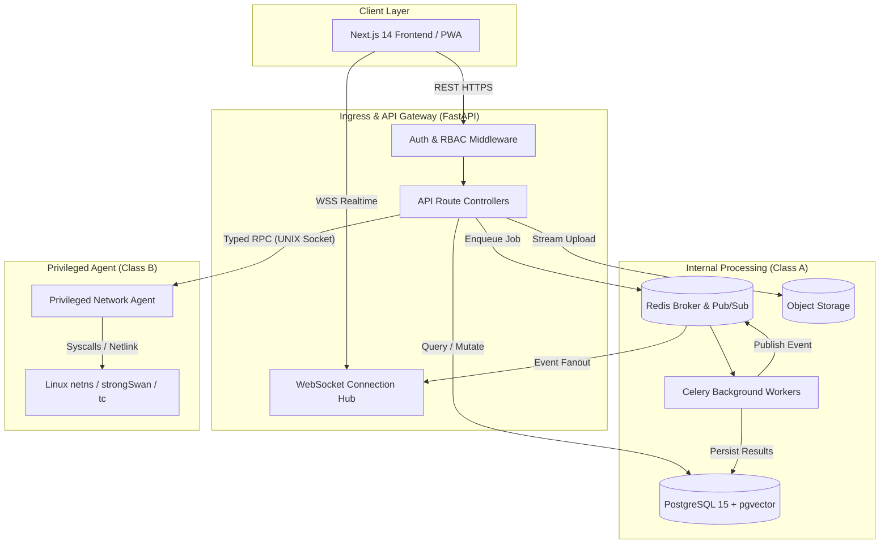
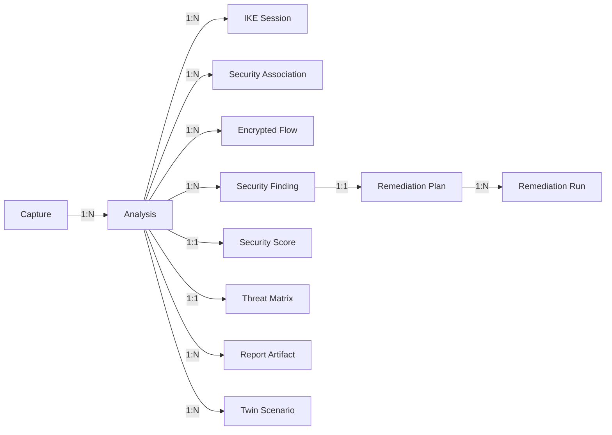
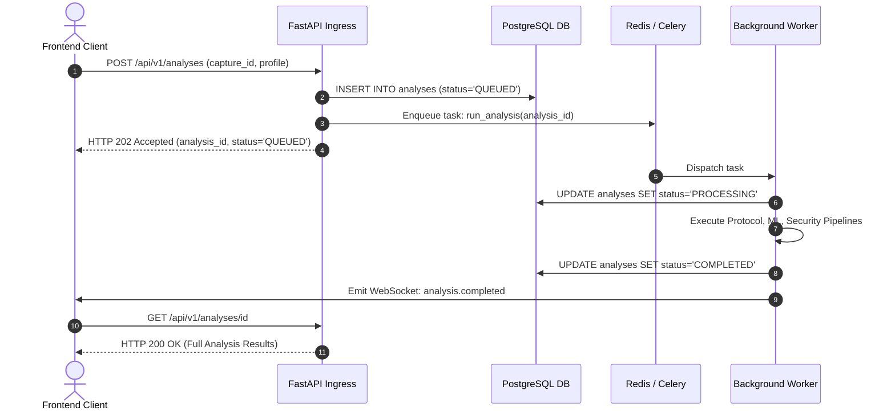
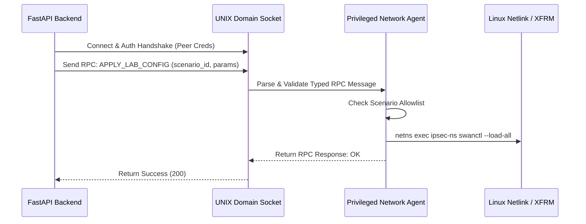

# API & INTEGRATION SPECIFICATION
## [PROJECT NAME] — IPsec Security Intelligence Platform
### Smart India Hackathon 2026 — Problem Statement ID: 26160 (PS 160)
#### Sponsoring Organization: National Technical Research Organisation (NTRO) | Theme: Blockchain & Cybersecurity

---

## 1. Document Control

| Property | Value |
| :--- | :--- |
| **Document Title** | API & Integration Specification |
| **Document Identifier** | `TT-API-2026-V1.0` |
| **Product Working Descriptor** | IPsec Security Intelligence Platform |
| **Official Application Baseline** | [PROJECT NAME] (TunnelTrace AI) |
| **Problem Statement ID** | 26160 (PS 160) |
| **Sponsoring Agency** | National Technical Research Organisation (NTRO) |
| **Document Classification** | Technical Specification / API Contract Baseline |
| **Document Status** | Approved Engineering Specification (PROPOSED CONTRACTS) |
| **Author** | Principal API Architect, FastAPI Backend Lead & Integration Architecture Team |
| **Current Document Version** | `1.0.0` |
| **Release Date** | September 2026 |
| **Applicable Target Environment** | Local-First Docker Compose / Edge Appliance / Hybrid Cloud Staging |

---

## 2. Revision History

| Version | Release Date | Author / Role | Summary of Changes |
| :--- | :--- | :--- | :--- |
| `0.1.0` | 2026-09-16 | Lead Backend Architect | Initial endpoint mapping, resource hierarchy, and error model. |
| `0.5.0` | 2026-09-19 | API Integration Lead | Added WebSocket event contracts, async job patterns, and DTO schemas. |
| `0.9.0` | 2026-09-21 | Systems Integration Lead | Added Privileged Agent RPC specs, internal engine contracts, and Golden Flows. |
| `1.0.0` | 2026-09-22 | Principal Architecture Lead | Finalized 95 sections, 17 Mermaid diagrams, 16 tables, zero-hallucination compliance. |

---

## 3. Purpose

This document establishes the definitive, contract-first **API & Integration Specification** for **[PROJECT NAME]**. It serves as the authoritative interface agreement governing all communication between:
- Frontend Client (Next.js 14 / TypeScript / PWA) and Backend API (FastAPI).
- Backend Application and Asynchronous Task Workers (Redis / Celery).
- Backend Application and Privileged Network Agent (Linux `netns` / `strongSwan` / `tc` / `tcpdump`).
- Backend Application and Persistence / Storage Layers (PostgreSQL 15 `pgvector`, MinIO / S3).
- Analytical Engines (Protocol Forensics, ML Classifier, Policy Engine, Evidence DAG, Local RAG).

It provides complete request/response schemas, WebSocket event envelopes, error taxonomies, and integration boundaries so that distributed engineering teams can build and test components independently without ambiguous interface assumptions.

---

## 4. Scope

This specification governs:
- **Inbound Client Protocols:** Synchronous HTTP/REST (JSON) and Asynchronous WebSockets (WSS).
- **Internal Messaging Protocols:** Redis task queues, Celery worker serialization, and UNIX domain socket RPCs.
- **Resource Entities:** Captures, Analyses, IKE Sessions, Security Associations, Encrypted Flows, Predictions, Findings, Compliance Profiles, Security Scores, Risks, Threats, Evidence Graphs, Configuration Twins, Remediation Runs, Reports, Testbed Scenarios, and Jobs.
- **Data Lifecycle States:** Uploading, Ingesting, Dissecting, Classifying, Auditing, Generating, Remediating, Verifying, and Archiving.

---

## 5. Relationship to Other Documents

This specification interfaces directly with the master system documentation:
- **Product Requirements Document ([PRD.md](file:///c:/SHARAN%20PROJECTS/TunnelTrace%20AI/docs/PRD.md)):** Defines functional capabilities mapped to API IDs.
- **Technical Requirements Document ([TRD.md](file:///c:/SHARAN%20PROJECTS/TunnelTrace%20AI/docs/TRD.md)):** Defines subsystem responsibilities and data models.
- **System Architecture & Design ([SYSTEM_ARCHITECTURE.md](file:///c:/SHARAN%20PROJECTS/TunnelTrace%20AI/docs/SYSTEM_ARCHITECTURE.md)):** Defines component topology and privilege boundaries.
- **Data Architecture & Database Design ([DATABASE_DESIGN.md](file:///c:/SHARAN%20PROJECTS/TunnelTrace%20AI/docs/DATABASE_DESIGN.md)):** Defines persistence entities decoupled from API DTOs.
- **ML & Dataset Engineering ([ML_DATASET_ENGINEERING.md](file:///c:/SHARAN%20PROJECTS/TunnelTrace%20AI/docs/ML_DATASET_ENGINEERING.md)):** Defines model feature schemas and prediction contracts.
- **Security & Threat Model ([SECURITY_THREAT_MODEL_COMPLIANCE.md](file:///c:/SHARAN%20PROJECTS/TunnelTrace%20AI/docs/SECURITY_THREAT_MODEL_COMPLIANCE.md)):** Establishes authentication, RBAC, and input validation requirements.

---

## 6. API Design Goals

1. **Resource-Oriented Ergonomics:** Consistent URI structures representing durable domain entities with standard HTTP verbs.
2. **Contract-First Stability:** Strictly typed, OpenAPI 3.1-compliant Pydantic DTOs for all request and response structures.
3. **Decoupled Asynchrony:** Non-blocking processing of multi-gigabyte captures via dedicated background job tokens and WebSocket telemetry.
4. **Strict Architectural Decoupling:** API Data Transfer Objects (DTOs) remain completely isolated from internal database ORM entities.
5. **Deterministic Evidence Fidelity:** Protocol facts and compliance states preserve explicit evidence categories (`VERIFIED`, `INFERRED`, `UNKNOWN`).
6. **Zero-Trust Privilege Boundary:** Host-level networking operations are entirely inaccessible via general web endpoints.

---

## 7. Design Principles

```
  [ Client Request ] ──► [ Schema Validation ] ──► [ Auth / RBAC Gate ]
                                                           │
                                                           ▼
  [ Database DTO ]  ◄── [ Business Engine ]  ◄── [ Object-Level Ownership ]
```

1. **Schema Strictness:** Reject unexpected request fields (`extra = "forbid"`). Never silently ignore malformed inputs.
2. **Predictable Status Codes:** Follow RFC 9110 HTTP semantics. Never return `200 OK` for application-level failures.
3. **Preservation of Domain Uncertainty:** Represent `UNKNOWN` as a legitimate analytical outcome, not an HTTP 404 or 500 error.
4. **Idempotency for Mutating Actions:** Support `Idempotency-Key` headers for critical execution and remediation requests.
5. **Data Minimization:** Response payloads return only attributes necessary for the requesting client interface.

---

## 8. Assumptions

1. **Client JSON Capabilities:** Clients support native JSON parsing, ISO 8601 timestamps, and UTF-8 encoding.
2. **Network Protocol Support:** Client environments support standard WebSocket (RFC 6455) connections over TLS (`wss://`).
3. **Monotonic Clocks:** Backend and worker nodes synchronize clocks via NTP to ensure monotonic event ordering.

---

## 9. Constraints

1. **Air-Gapped Compatibility:** Core APIs must operate without internet connectivity or external SaaS dependencies.
2. **No Arbitrary Command Endpoints:** No endpoint may accept arbitrary shell strings, raw script executions, or raw BPF filters.
3. **Memory Boundary:** Dissection endpoints must never load full PCAP binaries into memory; streams and file offsets are used exclusively.
4. **Single-Node Base Constraint:** Baseline implementation must function seamlessly within standard Docker Compose on a single Linux host.

---

## 10. Technology Baseline

- **Backend Framework:** FastAPI (Python 3.11+) with AsyncIO.
- **Data Validation & Serialization:** Pydantic v2.
- **Task Queue & Message Broker:** Celery 5.3+ backed by Redis 7.
- **Relational Database:** PostgreSQL 15 with `pgvector 0.6+`.
- **Database Access:** SQLAlchemy 2.0 (Async Session) + Alembic.
- **Realtime Push:** Native FastAPI WebSockets + Redis Pub/Sub backend.
- **Dissection Engine:** TShark subprocesses via isolated pipes.
- **Privileged Agent Transport:** Local UNIX domain socket with typed binary/JSON RPC.

---

## 11. Interface Categories

| Interface Class | Communication Channel | Primary Actors | Protocol / Format | Security Boundary |
| :--- | :--- | :--- | :--- | :--- |
| **Category 1: External App API** | Northbound Ingress | Frontend PWA $\leftrightarrow$ FastAPI | HTTPS / REST / JSON | Untrusted $\rightarrow$ DMZ (Auth Required) |
| **Category 2: Realtime Event API** | Northbound Push | Backend $\rightarrow$ Frontend PWA | WSS / JSON Event Envelope | Authenticated WebSocket |
| **Category 3: Internal Integration** | East-West Bus | FastAPI $\leftrightarrow$ Celery Workers | Redis / Typed Python DTOs | Internal Class A Network |
| **Category 4: Privileged Control** | Southbound RPC | Backend $\rightarrow$ Privileged Agent | UNIX Domain Socket / RPC | Class A $\rightarrow$ Class B Boundary |

---

## 12. API Architecture Overview



---

## 13. API Versioning

- **URI Versioning:** All proposed public application routes are prefixed with `/api/v1`.
- **Deprecation Strategy:** Non-breaking changes (additive optional fields) are released within the minor version. Breaking changes necessitate a `/api/v2` namespace.
- **Lifecycle Headers:** Deprecated endpoints return RFC 8594 standard headers:
  ```http
  Deprecation: @1773964800
  Sunset: Wed, 31 Dec 2026 23:59:59 GMT
  Link: </api/v2/analyses>; rel="successor-version"
  ```

---

## 14. Naming Conventions

- **URIs:** Lowercase, hyphen-separated, resource-oriented plural nouns (`/analyses`, `/security-associations`, `/remediation-runs`).
- **Query Parameters:** Lowercase, snake_case (`page_size`, `cursor`, `severity_filter`).
- **JSON Request/Response Keys:** Lowercase, snake_case (`analysis_id`, `created_at`, `calibrated_confidence`).
- **Enum Constants:** Uppercase, underscore-separated strings (`VERIFIED`, `INFERRED`, `UNKNOWN`, `MISCONFIGURATION_OBSERVED`).

---

## 15. Resource Model



---

## 16. Authentication Boundary

- **Authentication Mechanism:** HTTP Bearer JSON Web Tokens (JWT) signed with HMAC-SHA256 (or asymmetric ed25519 in enterprise mode).
- **Header Format:** `Authorization: Bearer <access_token>`
- **Token Verification:** Every protected request decodes and cryptographically validates the token payload, verifying expiration (`exp`), issuer (`iss`), and subject identity (`sub`).

---

## 17. Authorization / Capabilities

Access is evaluated based on discrete capability claims mapped to users:

| Capability Identifier | Description | Applicable Resource Actions |
| :--- | :--- | :--- |
| `CAP_ANALYSIS_READ` | Permission to view analyses, findings, and evidence | `GET /analyses/*`, `GET /findings/*` |
| `CAP_CAPTURE_WRITE` | Permission to upload and delete PCAP files | `POST /captures`, `DELETE /captures/*` |
| `CAP_LIVE_CAPTURE` | Permission to trigger live wire capture on lab interfaces | `POST /live-captures/start` |
| `CAP_TESTBED_EXECUTE` | Permission to execute strongSwan testbed scenarios | `POST /testbed/runs` |
| `CAP_REMEDIATE_WRITE`| Permission to execute and verify lab remediations | `POST /remediation-runs` |
| `CAP_POLICY_ADMIN` | Permission to upload and activate policy bundles | `POST /policies/bundles` |
| `CAP_MODEL_ADMIN` | Permission to inspect and activate model weights | `POST /models/bundles` |

---

## 18. Object-Level Authorization

Every database query accessing analyses, captures, or findings strictly scopes records to the authenticated tenant/workspace:
```sql
SELECT * FROM analyses 
WHERE id = :analysis_id AND workspace_id = :authenticated_user_workspace_id;
```
If an identifier exists but belongs to a different workspace, the backend returns `404 Not Found` to prevent resource enumeration.

---

## 19. Request Validation

FastAPI routes enforce Pydantic v2 schemas configured with strict type validation:
```python
from pydantic import BaseModel, ConfigDict, Field

class ProposedBaseModel(BaseModel):
    model_config = ConfigDict(
        extra="forbid",
        str_strip_whitespace=True,
        validate_assignment=True
    )
```
Requests containing undeclared fields, invalid types, or out-of-bound numerical values are halted at the controller layer and return structured `422 Unprocessable Entity` errors.

---

## 20. Response Design

Standard responses return pure typed payloads without arbitrary wrapping:

```json
{
  "id": "anl_8f91c0b2-4d1a-4c2e-9b81-e2a1b94d8e33",
  "capture_id": "cap_3b1f9c84-11e2-45a0-9c21-b0e2f14d8a11",
  "status": "COMPLETED",
  "created_at": "2026-09-22T21:40:00.000Z",
  "completed_at": "2026-09-22T21:40:24.512Z",
  "security_score": 85,
  "findings_count": 3
}
```

---

## 21. Error Model

All API errors return a standard JSON error envelope conforming to RFC 7807:

```json
{
  "error_code": "CAPTURE_CORRUPTED",
  "message": "The uploaded capture file terminates unexpectedly at byte offset 1420.",
  "category": "INGESTION_ERROR",
  "request_id": "req_a1b2c3d4-e5f6-7890-abcd-ef1234567890",
  "retryable": false,
  "details": {
    "byte_offset": 1420,
    "expected_magic": "0xa1b2c3d4",
    "encountered_magic": "0x00000000"
  }
}
```

---

## 22. Correlation / Trace Model

- **Trace Propagation:** Every inbound request receives an HTTP `X-Request-ID` header (or generates a UUIDv4 if omitted).
- **Propagation Vector:** The `request_id` travels through FastAPI context vars $\rightarrow$ Celery task metadata $\rightarrow$ Dissection job logs $\rightarrow$ WebSocket event envelopes $\rightarrow$ Database audit records.

---

## 23. Idempotency

Mutating endpoints (`POST /remediation-runs`, `POST /analyses`, `POST /reports`) accept an optional header:
```http
Idempotency-Key: <client-generated-uuidv4>
```
The backend caches the execution status and response payload in Redis for 86,400 seconds (24 hours). Repeated requests with the identical key return the cached response without re-triggering background execution.

---

## 24. Pagination

List endpoints support cursor-based pagination for high-volume entities (flows, packets) and offset pagination for low-volume entities (analyses, reports):

```json
{
  "items": [],
  "pagination": {
    "total_count": 1420,
    "limit": 50,
    "cursor_next": "eyJpZCI6ICJmbG93XzEyMyIsICJ0cyI6IDE3MjcwMzA0MDB9",
    "has_more": true
  }
}
```

---

## 25. Filtering / Sorting

- **Filter Syntax:** Standard query parameters with typed operators (`status=COMPLETED`, `severity=HIGH`, `min_confidence=0.85`).
- **Sorting Syntax:** `sort=field:asc` or `sort=field:desc` (`sort=created_at:desc`). Only pre-indexed database columns are permitted as sort targets.

---

## 26. Async Job Pattern



---

## 27. WebSocket Architecture

- **Endpoint URI:** `WSS /api/v1/ws/events`
- **Connection Handshake:** Client connects passing JWT token via `Sec-WebSocket-Protocol` or signed query ticket.
- **Subscription Model:** Clients send subscription frames over a single multiplexed socket:
  ```json
  {
    "action": "subscribe",
    "resource_type": "analysis",
    "resource_id": "anl_8f91c0b2-4d1a-4c2e-9b81-e2a1b94d8e33"
  }
  ```

---

## 28. Event Envelope

Every realtime message pushed over WebSockets adheres to the standard event envelope:

```json
{
  "event_id": "evt_99f1a2b3-8c4d-4e5f-a6b7-c8d9e0f1a2b3",
  "event_type": "analysis.stage_changed",
  "timestamp": "2026-09-22T21:40:12.105Z",
  "resource_type": "analysis",
  "resource_id": "anl_8f91c0b2-4d1a-4c2e-9b81-e2a1b94d8e33",
  "sequence_number": 4,
  "payload": {
    "previous_stage": "PROTOCOL_ANALYSIS",
    "current_stage": "ML_ANALYSIS",
    "progress_percent": 65
  }
}
```

---

## 29. Event Catalogue

| Event Type | Producer | Trigger Condition | Payload Summary |
| :--- | :--- | :--- | :--- |
| `analysis.stage_changed` | Celery Worker | Analysis transitions between processing phases | Current stage, progress percent, stage timestamp |
| `analysis.completed` | Celery Worker | Complete analysis pipeline execution successful | Final status, duration, score, finding count |
| `analysis.failed` | Celery Worker | Pipeline encountered fatal unrecoverable error | Error code, failure message, terminating stage |
| `live_capture.packet_batched`| Network Agent | Batch of live packets captured and queued | Packet count increment, byte delta, current rate |
| `live_capture.stopped` | Network Agent | Live capture terminated manually or via timeout | Total packets, capture duration, storage artifact ID |
| `finding.created` | Security Engine | New compliance or vulnerability finding discovered | Finding ID, severity, title, affected entity |
| `remediation.verified` | Celery Worker | Post-remediation verification capture analyzed | Verification outcome (`VERIFIED_RESOLVED`), delta score |
| `testbed.run_completed` | Network Agent | strongSwan testbed scenario execution finished | Scenario ID, run status, PCAP artifact ID |

---

## 30. System / Health API

### `API-SYS-001`: Health Check (Liveness)
- **Method / Path:** `GET /api/v1/system/health/live`
- **Purpose:** Kubernetes / Docker liveness probe verifying process responsiveness.
- **Sync/Async:** Synchronous
- **Response `200 OK`:**
  ```json
  { "status": "UP", "timestamp": "2026-09-22T21:40:00Z" }
  ```

### `API-SYS-002`: Readiness Probe
- **Method / Path:** `GET /api/v1/system/health/ready`
- **Purpose:** Verifies operational readiness of PostgreSQL, Redis, and storage.
- **Sync/Async:** Synchronous
- **Response `200 OK`:**
  ```json
  {
    "status": "READY",
    "components": {
      "database": "UP",
      "redis": "UP",
      "storage": "UP",
      "tshark": "UP",
      "privileged_agent": "UP"
    }
  }
  ```

---

## 31. Capture API

### `API-CAP-001`: Upload Network Capture File
- **Method / Path:** `POST /api/v1/captures`
- **Purpose:** Multipart upload of raw PCAP/PCAPNG for offline analysis.
- **Caller / Auth:** Frontend Analyst (`CAP_CAPTURE_WRITE`)
- **Sync/Async:** Synchronous ingestion $\rightarrow$ Asynchronous registration
- **Request:** `multipart/form-data` with `file` binary and optional `description`.
- **Response `201 Created`:**
  ```json
  {
    "capture_id": "cap_3b1f9c84-11e2-45a0-9c21-b0e2f14d8a11",
    "file_name": "lab_traffic_sample.pcap",
    "file_size_bytes": 1420580,
    "sha256_checksum": "e3b0c44298fc1c149afbf4c8996fb92427ae41e4649b934ca495991b7852b855",
    "format": "PCAP",
    "created_at": "2026-09-22T21:40:00Z"
  }
  ```

### `API-CAP-002`: Get Capture Metadata
- **Method / Path:** `GET /api/v1/captures/{capture_id}`
- **Response `200 OK`:** Returns capture metadata, file size, SHA-256, and analysis history.

---

## 32. Analysis API

### `API-ANL-001`: Trigger Capture Analysis
- **Method / Path:** `POST /api/v1/analyses`
- **Purpose:** Create and enqueue an end-to-end analysis job for a stored capture.
- **Request Body:**
  ```json
  {
    "capture_id": "cap_3b1f9c84-11e2-45a0-9c21-b0e2f14d8a11",
    "policy_profile": "profile_nist_sp800_77",
    "options": {
      "enable_ml_classification": true,
      "enable_anomaly_detection": true
    }
  }
  ```
- **Response `202 Accepted`:**
  ```json
  {
    "analysis_id": "anl_8f91c0b2-4d1a-4c2e-9b81-e2a1b94d8e33",
    "status": "QUEUED",
    "estimated_duration_seconds": 15
  }
  ```

### `API-ANL-002`: Get Analysis Summary
- **Method / Path:** `GET /api/v1/analyses/{analysis_id}`
- **Response `200 OK`:** Returns full status, execution stages, security score, and finding counts.

---

## 33. Live Capture API

### `API-LIV-001`: List Authorized Capture Interfaces
- **Method / Path:** `GET /api/v1/live-captures/interfaces`
- **Purpose:** Enumerates virtual lab network interfaces available for live monitoring.
- **Response `200 OK`:**
  ```json
  {
    "interfaces": [
      { "id": "br-ipsec-lab", "type": "BRIDGE", "description": "Lab Transit Bridge" },
      { "id": "veth-peer-a", "type": "VETH", "description": "strongSwan Node A Interface" }
    ]
  }
  ```

### `API-LIV-002`: Start Live Network Capture
- **Method / Path:** `POST /api/v1/live-captures/start`
- **Request Body:**
  ```json
  {
    "interface_id": "br-ipsec-lab",
    "duration_limit_seconds": 300,
    "byte_limit_mb": 500
  }
  ```
- **Response `202 Accepted`:** Returns `live_session_id` and initial state `CAPTURING`.

### `API-LIV-003`: Stop Live Capture
- **Method / Path:** `POST /api/v1/live-captures/{live_session_id}/stop`
- **Response `200 OK`:** Triggers capture finalization, registers resulting capture, and returns `capture_id`.

---

## 34. Protocol Intelligence API

### `API-PROTO-001`: Get Dissected Protocol Summary
- **Method / Path:** `GET /api/v1/analyses/{analysis_id}/protocol`
- **Purpose:** Returns deterministic facts extracted from IKE handshakes and ESP headers.
- **Response `200 OK`:**
  ```json
  {
    "analysis_id": "anl_8f91c0b2-4d1a-4c2e-9b81-e2a1b94d8e33",
    "ike_version": "IKEv2",
    "ike_version_state": "VERIFIED",
    "encapsulation": "NAT_TRAVERSAL_UDP_4500",
    "ip_version": "IPv4",
    "packets_total": 4521,
    "ike_packets": 12,
    "esp_packets": 4509
  }
  ```

---

## 35. IKE Session API

### `API-IKE-001`: List IKE Handshake Sessions
- **Method / Path:** `GET /api/v1/analyses/{analysis_id}/ike-sessions`
- **Response `200 OK`:** Returns array of observed IKE sessions, initiator/responder SPIs, exchanged transforms, and handshake completion status.

---

## 36. Security Association API

### `API-SA-001`: List Security Associations (SAs)
- **Method / Path:** `GET /api/v1/analyses/{analysis_id}/security-associations`
- **Response `200 OK`:** Returns detailed list of inbound/outbound Child SAs, active SPIs, encryption transforms, and rekey lifecycles.

### `API-SA-002`: Get React Flow SA Graph
- **Method / Path:** `GET /api/v1/analyses/{analysis_id}/security-associations/graph`
- **Purpose:** Returns topology graph pre-formatted for React Flow rendering in the UI.
- **Response `200 OK`:**
  ```json
  {
    "nodes": [
      { "id": "peer_a", "type": "gateway", "data": { "label": "198.51.100.1" } },
      { "id": "sa_in", "type": "child_sa", "data": { "spi": "0xC3F1A29D" } }
    ],
    "edges": [
      { "id": "e1", "source": "peer_a", "target": "sa_in", "animated": true }
    ]
  }
  ```

---

## 37. Flow API

### `API-FLOW-001`: List Reconstructed Encrypted Flows
- **Method / Path:** `GET /api/v1/analyses/{analysis_id}/flows`
- **Query Params:** `cursor`, `limit=50`, `traffic_class_filter`
- **Response `200 OK`:** Returns paginated list of bidirectional ESP flows, packet counts, durations, and byte volumes.

---

## 38. Traffic Prediction API

### `API-ML-001`: List Flow Traffic Predictions
- **Method / Path:** `GET /api/v1/analyses/{analysis_id}/predictions`
- **Response `200 OK`:**
  ```json
  {
    "items": [
      {
        "flow_id": "flow_8812c",
        "predicted_class": "VOIP",
        "calibrated_confidence": 0.942,
        "is_unknown_ood": false,
        "model_bundle_version": "v1.0.0",
        "probabilities": {
          "VOIP": 0.942,
          "WEB": 0.031,
          "VIDEO_STREAMING": 0.015,
          "CHAT_MESSAGING": 0.008,
          "FILE_TRANSFER": 0.004
        }
      }
    ]
  }
  ```

---

## 39. Explainability API

### `API-XAI-001`: Get TreeSHAP Feature Attributions
- **Method / Path:** `GET /api/v1/analyses/{analysis_id}/flows/{flow_id}/explanation`
- **Response `200 OK`:** Returns ranked feature contributions explaining the ML classification:
  ```json
  {
    "flow_id": "flow_8812c",
    "predicted_class": "VOIP",
    "base_value": 0.20,
    "features": [
      { "name": "mean_iat_ms", "value": 20.1, "shap_value": 0.38, "direction": "POSITIVE" },
      { "name": "packet_length_std", "value": 12.4, "shap_value": 0.31, "direction": "POSITIVE" }
    ]
  }
  ```

---

## 40. Anomaly API

### `API-ANOM-001`: List Behavioral Anomalies
- **Method / Path:** `GET /api/v1/analyses/{analysis_id}/anomalies`
- **Response `200 OK`:** Returns flows identified as statistical outliers by Isolation Forest with anomaly scores ($s < 0$).

---

## 41. Security Findings API

### `API-SEC-001`: List Compliance & Security Findings
- **Method / Path:** `GET /api/v1/analyses/{analysis_id}/findings`
- **Query Params:** `severity`, `category`, `status`
- **Response `200 OK`:**
  ```json
  {
    "findings": [
      {
        "id": "find_001",
        "rule_id": "POL-NIST-004",
        "title": "Insecure Diffie-Hellman Group Negotiated (Group 2)",
        "severity": "HIGH",
        "evidence_state": "VERIFIED",
        "status": "OPEN",
        "recommendation": "Upgrade to Diffie-Hellman Group 19 (ECP-256)."
      }
    ]
  }
  ```

---

## 42. Compliance API

### `API-COMP-001`: Get Standards Compliance Evaluation
- **Method / Path:** `GET /api/v1/analyses/{analysis_id}/compliance`
- **Response `200 OK`:** Returns breakdown of evaluated rules across target profiles (`PASS`, `FAIL`, `UNKNOWN`, `NOT_APPLICABLE`).

---

## 43. Security Score API

### `API-SCR-001`: Get Security Posture Score Breakdown
- **Method / Path:** `GET /api/v1/analyses/{analysis_id}/security-score`
- **Response `200 OK`:**
  ```json
  {
    "score": 75,
    "max_score": 100,
    "deductions": [
      { "finding_id": "find_001", "severity": "HIGH", "points": -15, "reason": "Weak DH Group 2" },
      { "finding_id": "find_002", "severity": "MEDIUM", "points": -10, "reason": "No PFS Observed" }
    ]
  }
  ```

---

## 44. Risk API

### `API-RSK-001`: Get Composite Risk Assessment
- **Method / Path:** `GET /api/v1/analyses/{analysis_id}/risk`
- **Response `200 OK`:** Returns aggregated risk levels categorized by Cryptographic, Architectural, and Operational risk.

---

## 45. Threat Matrix API

### `API-THR-001`: Get Structured Threat Matrix
- **Method / Path:** `GET /api/v1/analyses/{analysis_id}/threat-matrix`
- **Response `200 OK`:** Returns tabular threat entries linking findings to concrete attack vectors and threat likelihoods.

---

## 46. Metadata Fingerprintability API

### `API-META-001`: Get Metadata Exposure Assessment
- **Method / Path:** `GET /api/v1/analyses/{analysis_id}/metadata-exposure`
- **Response `200 OK`:** Returns quantitative metrics indicating application distinguishability based purely on packet sizes and IAT.

---

## 47. Evidence / Provenance API

### `API-EVID-001`: Get Finding Evidence Trace
- **Method / Path:** `GET /api/v1/analyses/{analysis_id}/findings/{finding_id}/evidence`
- **Response `200 OK`:**
  ```json
  {
    "finding_id": "find_001",
    "evidence_chain": [
      { "type": "CAPTURE", "id": "cap_3b1f9c84", "sha256": "e3b0c442..." },
      { "type": "FRAME", "frame_number": 14, "timestamp": "2026-09-22T21:40:02.100Z" },
      { "type": "EXTRACTED_FIELD", "field": "ikev2.transform.dh_group", "observed_value": 2 },
      { "type": "POLICY_RULE", "rule_id": "POL-NIST-004", "condition": "dh_group in [14, 19, 20]" }
    ]
  }
  ```

---

## 48. Configuration Twin API

### `API-TWIN-001`: Create Virtual Twin Scenario
- **Method / Path:** `POST /api/v1/analyses/{analysis_id}/twin-scenarios`
- **Request Body:**
  ```json
  {
    "scenario_name": "Hardened ECP256 Proposal",
    "proposed_modifications": {
      "ike_cipher": "aes256gcm16-prfsha256-ecp256",
      "esp_cipher": "aes256gcm16-ecp256"
    }
  }
  ```
- **Response `201 Created`:** Returns projected compliance state and projected security score ($S_{\text{projected}} = 100$).

---

## 49. Remediation API

### `API-REM-001`: Generate Remediation Plan
- **Method / Path:** `POST /api/v1/analyses/{analysis_id}/remediation-plans`
- **Request Body:** `{ "finding_ids": ["find_001"] }`
- **Response `200 OK`:** Returns proposed strongSwan configuration patch with syntactic verification checks.

### `API-REM-002`: Execute Lab Remediation Run
- **Method / Path:** `POST /api/v1/remediation-runs`
- **Caller / Auth:** Senior Engineer / SOC Lead (`CAP_REMEDIATE_WRITE`)
- **Headers:** `Idempotency-Key: <uuid4>`
- **Request Body:** `{ "plan_id": "plan_991a" }`
- **Response `202 Accepted`:** Enqueues lab reconfiguration, tunnel restart, and automatic reverification.

---

## 50. Verification / Rollback API

### `API-REM-003`: Get Remediation Verification Status
- **Method / Path:** `GET /api/v1/remediation-runs/{run_id}/verification`
- **Response `200 OK`:** Returns verification status (`VERIFIED_RESOLVED`), before/after score delta, and new capture ID.

### `API-REM-004`: Trigger Lab Remediation Rollback
- **Method / Path:** `POST /api/v1/remediation-runs/{run_id}/rollback`
- **Response `200 OK`:** Reverts strongSwan configuration to the pre-remediation backup snapshot.

---

## 51. Reports API

### `API-RPT-001`: Generate Assessment Report
- **Method / Path:** `POST /api/v1/analyses/{analysis_id}/reports`
- **Request Body:** `{ "report_type": "EXECUTIVE", "format": "PDF" }`
- **Response `202 Accepted`:** Enqueues report compilation and returns `report_id`.

### `API-RPT-002`: Download Report Artifact
- **Method / Path:** `GET /api/v1/reports/{report_id}/download`
- **Response `307 Temporary Redirect`:** Redirects to a short-lived presigned URL for direct secure download.

---

## 52. AI Analyst API

### `API-AI-001`: Query Grounded AI Analyst
- **Method / Path:** `POST /api/v1/analyses/{analysis_id}/ai/query`
- **Request Body:**
  ```json
  {
    "question": "Why is Diffie-Hellman Group 2 dangerous in this session?"
  }
  ```
- **Response `200 OK`:**
  ```json
  {
    "answer": "Diffie-Hellman Group 2 provides only ~80 bits of cryptographic strength, making it vulnerable to precomputation discrete logarithm attacks (Logjam).",
    "referenced_findings": ["find_001"],
    "referenced_standards": ["NIST SP 800-77 Rev. 1 Section 5.1.2"],
    "grounding_confidence": "HIGH"
  }
  ```

---

## 53. Testbed API

### `API-LAB-001`: Execute Controlled Lab Scenario
- **Method / Path:** `POST /api/v1/testbed/runs`
- **Request Body:**
  ```json
  {
    "scenario_id": "weak_crypto_3des_dh2",
    "network_impairments": { "latency_ms": 50, "loss_pct": 1.5 }
  }
  ```
- **Response `202 Accepted`:** Triggers strongSwan orchestration in network namespaces; returns `testbed_run_id`.

---

## 54. Dataset / Experiment API

### `API-DATA-001`: Register Dataset Session
- **Method / Path:** `POST /api/v1/datasets/{dataset_id}/sessions`
- **Purpose:** Internal endpoint linking validated lab testbed runs to training dataset manifests.

---

## 55. Model Metadata / Registry API

### `API-MDL-001`: Get Active Model Metadata
- **Method / Path:** `GET /api/v1/models/active`
- **Response `200 OK`:** Returns model bundle ID, algorithm types (XGBoost + 1D-CNN), feature schema version, and training SHA-256.

---

## 56. Policy Metadata / Registry API

### `API-POL-001`: List Available Policy Profiles
- **Method / Path:** `GET /api/v1/policies/profiles`
- **Response `200 OK`:** Returns list of signed policy profiles (`profile_nist_sp800_77`, `profile_ietf_baseline`).

---

## 57. Job API

### `API-JOB-001`: Get Background Job Status
- **Method / Path:** `GET /api/v1/jobs/{job_id}`
- **Response `200 OK`:** Returns job state (`QUEUED`, `RUNNING`, `SUCCESS`, `FAILURE`) and error details if failed.

---

## 58. Audit / Admin API Considerations

- Audit endpoints (`GET /api/v1/audit/events`) are strictly restricted to users possessing the `SOC Lead` or `Admin` capability.
- Query filters allow searching by actor ID, target resource, and date range.

---

## 59. Internal Backend Contracts

Internal communication between modular subsystems is governed by typed Python dataclasses/Pydantic domain models:
- **No Direct Dict Passing:** DTOs are strictly instantiated; unstructured Python dictionaries are prohibited across subsystem boundaries.
- **Fail-Fast Boundary:** If Subsystem A outputs an invalid domain object, Subsystem B halts execution immediately rather than operating on partial structures.

---

## 60. Protocol Engine Integration

```
[Celery Worker] ──► [Invoke TShark Subprocess (safe args)] ──► [Read EK JSON Stream]
                                                                        │
                                                                        ▼
[Persist Security Facts] ◄── [Normalize Protocol DTO] ◄── [Dissection Parser]
```

- **Execution Contract:** TShark output is parsed line-by-line via JSON stream reader; frames are aggregated into `DissectedFrameDTO` structures.

---

## 61. ML Engine Integration

- **Input Contract:** Extracted flow feature vectors are mapped into a strict `(24,)` NumPy float32 array for XGBoost and a `(3, N)` tensor for the 1D-CNN.
- **Output Contract:** Inference returns a `ModelInferenceResultDTO` containing normalized probability vectors, calibrated confidence, and OOD entropy values.

---

## 62. Security Engine Integration

- **Input Contract:** Evaluates normalized facts dictionary against active YAML policy AST.
- **Output Contract:** Produces a collection of `FindingDTO` objects and a composite `ComplianceEvaluationDTO`.

---

## 63. Evidence Engine Integration

- **Graph Builder:** Ingests frame offsets, protocol facts, and policy findings to assemble a directed acyclic graph (DAG) persisted in PostgreSQL relational tables.

---

## 64. Report Integration

- **Renderer Contract:** Consumes pre-computed analysis DTOs; never re-executes packet dissection or policy evaluation during PDF compilation.

---

## 65. RAG / LLM Integration

- **Context Boundary:** The RAG assembler retrieves relevant standard text from `pgvector` and structured findings from PostgreSQL, combining them into an immutable prompt context:
  ```xml
  <evidence_context>
    <finding id="find_001" severity="HIGH">Insecure DH Group 2</finding>
  </evidence_context>
  ```

---

## 66. Privileged Network Agent Integration



---

## 67. Redis / Celery Integration

- **Task Serialization:** JSON serialization only (`task_serializer = "json"`). Python `pickle` is strictly disabled for security.
- **Queue Separation:**
  - `queue_analysis`: Long-running PCAP parsing and ML inference tasks.
  - `queue_realtime`: High-priority WebSocket notification dispatches.

---

## 68. PostgreSQL Integration

- **Connection Pool:** AsyncPG connection pool (default: 20 connections max) with statement timeouts enabled (60s).
- **Session Lifecycle:** FastAPI dependency injection yields scoped async database sessions (`AsyncSession`), automatically committing or rolling back per request.

---

## 69. Object Storage Integration

- **Storage Adapter:** Unified storage interface (`ObjectStorageClient`) abstracting local file system storage in development and MinIO / S3 in staging.
- **Key Strategy:** Deterministic, non-guessable object paths:
  `/captures/{workspace_id}/{capture_id}.pcap`

---

## 70. Future Supabase Integration

- **Decoupled Client:** If Supabase is adopted for cloud hosting, FastAPI interacts via standard Supabase Python client libraries without altering public REST contracts.
- **Auth Bridging:** Supabase JWTs are verified by FastAPI using Supabase project JWT public keys.

---

## 71. Upload / Download Security

- **Upload Safety:** Multi-part uploads stream directly to temporary storage; byte-count caps and magic-header validations terminate invalid uploads before queueing.
- **Download Safety:** File downloads use short-lived presigned URLs (15-minute expiration); direct public access to storage buckets is blocked.

---

## 72. API Security

- **Security Headers:** Strict CSP, HSTS, X-Content-Type-Options, X-Frame-Options: DENY.
- **CORS Configuration:** Explicit origin allowlists; wildcard CORS disallowed in production builds.

---

## 73. WebSocket Security

- Handshake authorization token validation.
- Automatic channel unsubscription on disconnect to prevent resource leaks.

---

## 74. Privacy / Data Minimization

- Client responses omit internal filesystem paths, database primary integer keys, and raw payload hex dumps.

---

## 75. Partial Analysis Semantics

If an analysis encounters a non-fatal failure (e.g., ML inference fails due to insufficient packets, but protocol analysis succeeds), the system marks the analysis status as `PARTIAL`:
```json
{
  "status": "PARTIAL",
  "modules": {
    "protocol": "COMPLETED",
    "ml_classification": "FAILED",
    "security_compliance": "COMPLETED"
  }
}
```

---

## 76. Graceful Degradation

If the Privileged Network Agent is unavailable, offline PCAP analysis remains 100% operational; live capture and lab testbed endpoints return structured `503 Service Unavailable` errors.

---

## 77. Retry / Timeout / Cancellation

- **Timeouts:**
  - Standard REST Requests: 10 seconds.
  - Report Compilation: 60 seconds.
  - Celery Dissection Tasks: 300 seconds.
- **Cancellation:** Long-running analysis jobs can be canceled via `POST /api/v1/analyses/{id}/cancel`, sending a `SIGTERM` to the responsible Celery task worker.

---

## 78. API Observability

- **Metrics:** Exposes Prometheus metrics at `/metrics`:
  - `http_requests_total{method, path, status}`
  - `http_request_duration_seconds{path}`
  - `celery_task_duration_seconds{task_name}`

---

## 79. Contract Testing

All API endpoints maintain automated contract tests verifying:
1. Pydantic request and response schema conformance.
2. HTTP error code generation on malformed inputs.
3. Strict enforcement of RBAC capabilities.

---

## 80. Integration Testing

End-to-end integration tests execute against ephemeral Docker containers running real PostgreSQL and Redis instances.

---

## 81. OpenAPI / Machine-Readable Contract

FastAPI automatically generates an interactive OpenAPI 3.1 specification at `/openapi.json`. Every route defines operation IDs, parameter descriptions, and error response schemas.

---

## 82. Frontend Contract Integration

Frontend TypeScript types are automatically generated from the backend OpenAPI schema using `openapi-typescript`, ensuring zero drift between backend and UI models.

---

## 83. API Compatibility / Deprecation

Deprecated fields are marked with `deprecated=True` in Pydantic schemas and documented in release changelogs 90 days prior to removal.

---

## 84. PS Requirement $\rightarrow$ API Matrix

| PS 160 Mandate | Primary API Endpoint | Response Contract | Status |
| :--- | :--- | :--- | :--- |
| **PCAP Analysis** | `POST /api/v1/analyses` | Async Job Token $\rightarrow$ `AnalysisSummaryDTO` | PROPOSED |
| **Live Network Stream**| `POST /api/v1/live-captures/start` | WSS Stream $\rightarrow$ Realtime Event Push | PROPOSED |
| **IKE/ESP Protocol Extraction** | `GET /api/v1/analyses/{id}/protocol`| `ProtocolSummaryDTO` (Verified facts) | PROPOSED |
| **SA Topology** | `GET /api/v1/analyses/{id}/security-associations/graph` | React Flow Node/Edge Schema | PROPOSED |
| **Traffic Classification** | `GET /api/v1/analyses/{id}/predictions` | `TrafficPredictionDTO` (Calibrated) | PROPOSED |
| **Security Assessment** | `GET /api/v1/analyses/{id}/findings` | `FindingListDTO` (Standards-linked) | PROPOSED |
| **Security Score** | `GET /api/v1/analyses/{id}/security-score` | `SecurityScoreDTO` (Traceable) | PROPOSED |
| **Threat Matrix** | `GET /api/v1/analyses/{id}/threat-matrix` | Tabular Threat Matrix Schema | PROPOSED |
| **Configuration Twin** | `POST /api/v1/analyses/{id}/twin-scenarios` | Projected Compliance Schema | PROPOSED |
| **Remediation & Rollback** | `POST /api/v1/remediation-runs` | Remediation Execution Contract | PROPOSED |

---

## 85. UI Page $\rightarrow$ API Matrix

| Dashboard View / Page | Primary Inbound REST Endpoints | WebSocket Subscriptions |
| :--- | :--- | :--- |
| **Command Center (Overview)** | `GET /api/v1/analyses/recent`, `GET /api/v1/system/health/ready` | `analysis.stage_changed` |
| **Analyze (Upload & Live)** | `POST /api/v1/captures`, `POST /api/v1/live-captures/start` | `live_capture.packet_batched` |
| **Protocol Intelligence** | `GET /api/v1/analyses/{id}/protocol`, `GET /api/v1/analyses/{id}/ike-sessions`| None (Static post-analysis) |
| **SA Explorer** | `GET /api/v1/analyses/{id}/security-associations/graph` | None |
| **Traffic Intelligence** | `GET /api/v1/analyses/{id}/predictions`, `GET /api/v1/analyses/{id}/anomalies` | None |
| **Security & Compliance** | `GET /api/v1/analyses/{id}/findings`, `GET /api/v1/analyses/{id}/compliance` | `finding.created` |
| **Evidence Explorer** | `GET /api/v1/analyses/{id}/findings/{find_id}/evidence` | None |
| **Configuration Twin** | `POST /api/v1/analyses/{id}/twin-scenarios` | None |
| **Remediation Verification**| `POST /api/v1/remediation-runs`, `GET /api/v1/remediation-runs/{id}/verification`| `remediation.verified` |
| **Reports** | `POST /api/v1/analyses/{id}/reports`, `GET /api/v1/reports/{id}/download` | None |

---

## 86. API Security Matrix

| API Group | Auth Required? | Capabilities | Rate Limit | Sensitive Data? | Audit Logged? |
| :--- | :--- | :--- | :--- | :--- | :--- |
| **System / Health** | No (Liveness) / Yes (Details) | None / `CAP_ANALYSIS_READ` | 120/min | No | No |
| **Captures Ingestion** | Yes | `CAP_CAPTURE_WRITE` | 5/min | High (Raw PCAP) | Yes |
| **Analyses Execution**| Yes | `CAP_ANALYSIS_READ` | 10/min | Medium | Yes |
| **Live Wire Capture** | Yes | `CAP_LIVE_CAPTURE` | 2/min | Critical (Wire Packets)| Yes |
| **Security Remediation**| Yes | `CAP_REMEDIATE_WRITE` | 5/min | High (Config Changes) | Yes |
| **AI Analyst Queries** | Yes | `CAP_ANALYSIS_READ` | 20/min | Medium | Yes |

---

## 87. Golden Offline Analysis Flow

```
1. Client calls POST /api/v1/captures with file -> receives capture_id.
2. Client calls POST /api/v1/analyses with capture_id -> receives analysis_id (202 Accepted).
3. Client subscribes to WSS /api/v1/ws/events for analysis_id.
4. Background Celery task executes dissection, ML inference, and compliance checks.
5. Server pushes analysis.stage_changed events over WSS.
6. Server pushes analysis.completed event over WSS.
7. Client fetches GET /api/v1/analyses/{id} to display overview and score.
```

---

## 88. Golden Live Analysis Flow

```
1. Client calls GET /api/v1/live-captures/interfaces -> chooses 'br-ipsec-lab'.
2. Client calls POST /api/v1/live-captures/start -> receives live_session_id.
3. Privileged agent streams packet batch updates over WSS.
4. Client calls POST /api/v1/live-captures/{id}/stop -> receives new capture_id.
5. System auto-triggers analysis and streams findings to UI.
```

---

## 89. Golden Remediation Flow

```
1. Client views finding POL-NIST-004 in GET /api/v1/analyses/{id}/findings.
2. Client calls POST /api/v1/analyses/{id}/remediation-plans -> gets patch preview.
3. Client calls POST /api/v1/remediation-runs (Idempotency-Key) -> receives run_id.
4. Privileged agent applies swanctl config in testbed namespace.
5. Verification packet capture executes automatically.
6. Verification results pushed via WSS remediation.verified.
```

---

## 90. Golden AI Analyst Flow

```
1. Analyst enters natural language query in UI.
2. Client calls POST /api/v1/analyses/{id}/ai/query with question text.
3. Backend retrieves local findings and pgvector standard embeddings.
4. Local LLM synthesizes explanation strictly from retrieved context.
5. Backend returns grounded answer with exact finding and RFC citations.
```

---

## 91. Architecture Decision Log

| Decision ID | Architecture Decision | Rationale | Alternatives Considered | Status |
| :--- | :--- | :--- | :--- | :--- |
| `API-DEC-01` | REST + WebSockets Baseline | Simple, battle-tested, zero client dependency overhead. | GraphQL, gRPC-Web (rejected: unnecessary complexity). | **FROZEN** |
| `API-DEC-02` | Asynchronous Job Model (202 Accepted) | PCAP dissection is compute-heavy and exceeds HTTP timeouts. | Synchronous blocking requests (rejected: causes 504 timeouts). | **FROZEN** |
| `API-DEC-03` | Separate DTOs from DB Models | Protects public API contract from internal database schema refactoring.| Direct ORM model serialization (rejected: security leak risk). | **FROZEN** |
| `API-DEC-04` | UNIX Domain Socket for Privileged Agent | Eliminates network exposure of root-capable host agents. | Exposing HTTP API on host port (rejected: high security risk). | **FROZEN** |
| `API-DEC-05` | Idempotency Keys for Remediation | Prevents duplicate configuration pushes during network retries. | Naive retries (rejected: race conditions). | **FROZEN** |

---

## 92. API Risks & Mitigations

| Risk ID | Risk Description | Impact | Likelihood | Mitigating Control | Detection Method |
| :--- | :--- | :--- | :--- | :--- | :--- |
| `API-RSK-01` | Insecure Direct Object References (IDOR) | High | Medium | Tenant-scoped database queries on every endpoint. | Automated multi-tenant contract tests. |
| `API-RSK-02` | File upload DoS via massive PCAP | High | Medium | Reverse proxy 500 MB upload limit + streaming validation. | Ingress bandwidth monitoring. |
| `API-RSK-03` | Stale WebSocket event state | Low | High | Clients refetch authoritative REST state upon reconnection. | Connection reconnect unit tests. |
| `API-RSK-04` | Shell injection via testbed parameters | Critical | Low | Pydantic strict typing; `shell=False` parameterized exec. | Static AST code audits (`bandit`). |

---

## 93. Open Decisions / TBD Register

| Item ID | Open Decision / Architectural Parameter | Current Engineering Status | Resolution Strategy |
| :--- | :--- | :--- | :--- |
| `TBD-API-01` | Exact Presigned URL Lifetime (MinIO/S3) | *TBD — Default proposed: 900s.* | Validate with client download speeds across large captures. |
| `TBD-API-02` | Maximum WebSocket Heartbeat Timeout | *TBD — Default proposed: 120s.* | Test against edge firewalls with aggressive idle connection drops. |
| `TBD-API-03` | Rate Limiter Storage Backend | *TBD — In-memory vs. Redis.* | Evaluate Redis rate-limiter latency impact on local testbeds. |

---

## 94. Glossary

- **AST:** Abstract Syntax Tree.
- **DTO:** Data Transfer Object.
- **EK JSON:** Elasticsearch-compatible JSON output format generated by TShark.
- **IDOR:** Insecure Direct Object Reference.
- **OpenAPI:** Specification for machine-readable interface descriptions.
- **PWA:** Progressive Web App.
- **RBAC:** Role-Based Access Control.
- **RPC:** Remote Procedure Call.
- **WSS:** WebSocket Secure.

---

## 95. References

1. **RFC 9110:** *HTTP Semantics*, Internet Engineering Task Force (IETF), 2022.
2. **RFC 6455:** *The WebSocket Protocol*, IETF, 2011.
3. **RFC 7807:** *Problem Details for HTTP APIs*, IETF, 2016.
4. **RFC 8594:** *Sunset HTTP Header Field*, IETF, 2019.
5. **OpenAPI Specification v3.1.0:** OpenAPI Initiative, 2021.
6. **FastAPI Documentation:** Tiangolo, https://fastapi.tiangolo.com/.
7. **Pydantic v2 Documentation:** Pydantic Services Inc., https://docs.pydantic.dev/.
