# [PROJECT NAME] — Data Architecture & Database Design Document

**Official Problem Statement ID:** 26160 (PS 160)  
**Official Problem Statement Title:** AI-Powered IPsec VPN Protocol Analyzer and Security Assessment Framework  
**Sponsoring Organization:** National Technical Research Organisation (NTRO)  
**Theme:** Blockchain & Cybersecurity (Software Category)  
**Document Type:** Master Data Architecture & Database Design Specification  
**System Name:** [PROJECT NAME] (Working Baseline: TunnelTrace AI)  
**Current Release Version:** `v0.1.0-alpha` (SIH 2026 Engineering Prototype)  
**Document Status:** Approved Architectural Baseline  

---

## 1. Document Control

| Property | Value |
| :--- | :--- |
| **System Title** | [PROJECT NAME] (AI-Powered IPsec VPN Protocol Analyzer and Security Assessment Framework) |
| **Problem Statement Reference** | SIH 2026 / PS 160 / NTRO |
| **Document Classification** | Master Data Architecture & Relational Schema Specification |
| **Data Architecture Scope** | Relational Schemas, Forensic Provenance DAG, ML Feature Vectors, Object Storage, and RAG Persistence |
| **Lead Data Architect** | Principal Data Architect & PostgreSQL Database Engineer |
| **Technical Reviewers** | Protocol Architect, ML Data Engineer, Backend Lead, Security Compliance Specialist |
| **Target Database Engine** | PostgreSQL 15+ with `pgvector 0.6+` Extension (Supabase PostgreSQL Compatible) |
| **Repository File Location** | `docs/DATABASE_DESIGN.md` |

---

## 2. Revision History

| Revision | Date | Author / Engineering Role | Description of Changes |
| :--- | :--- | :--- | :--- |
| `0.1.0-draft` | 2026-09-22 | Principal Data Architect | Initial structural design defining 22 logical data domains and core entities. |
| `0.2.0-review` | 2026-09-22 | Forensic Data Modeler | Added evidence DAG persistence, session-level dataset splits, and RAG vector schema. |
| `1.0.0-final` | 2026-09-22 | Chief Platform Data Architect | Complete 85-section specification with 14 Mermaid diagrams, 16 matrices, and DDL. |

---

## 3. Purpose

This **Data Architecture & Database Design Document** establishes the definitive blueprint for how all structured, semi-structured, and binary data is modeled, stored, related, indexed, audited, and protected within **[PROJECT NAME]**.

It bridges the high-level system requirements defined in the PRD/TRD and the physical implementation in PostgreSQL, Redis, and object storage. The design ensures:
1. **Mathematical Reproducibility:** Historical analysis runs, security scores, and ML classifications can be recomputed or verified years later against immutable capture snapshots.
2. **Forensic Traceability:** Every security finding and threat assertion links directly back to specific physical packet offsets and raw protocol dissections.
3. **Zero Secret Exposure:** Strict elimination of cryptographic key material, pre-shared keys (PSKs), or decrypted payload data from operational databases.
4. **Local-First / Cloud Portability:** Clean compatibility between local-first standalone Dockerized PostgreSQL instances and managed enterprise Supabase environments.

---

## 4. Scope

This specification governs all data entities across the 22 logical platform domains:
- **Relational Domain:** Analysis runs, protocol facts, IKE/ESP Security Associations, encrypted flow metrics, YAML policy evaluations, security findings, compliance scorecards, and audit events.
- **Machine Learning Domain:** Model bundles, feature schemas, training datasets, session-level splits, calibration artifacts, and prediction probabilities.
- **Unstructured / Binary Domain:** Raw PCAP/PCAPNG files, WeasyPrint PDF reports, and serialized PyTorch/XGBoost model binaries.
- **Vector Domain:** Semantic chunks and embeddings of NIST SP 800-77, RFC 7296, and RFC 8221 standards managed via `pgvector`.
- **Transient Domain:** In-memory queue state and pub/sub streaming managed via Redis (formally designated as non-authoritative).

---

## 5. Relationship to Other Documents

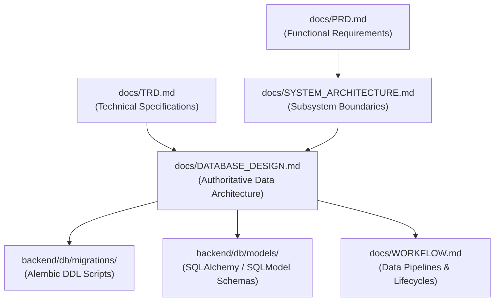

---

## 6. Data Architecture Goals

- **Integrity Over Convenience:** Strict foreign-key relationships and domain check constraints over unbounded JSONB blobs.
- **Immutable Provenance:** Analysis runs and capture records are append-only; historical runs are never overwritten during re-analysis.
- **Strict Evidence Labeling:** Explicit representation of forensic certainty (`VERIFIED`, `INFERRED`, `UNKNOWN`, `MISCONFIGURATION_OBSERVED`).
- **High-Throughput Ingestion:** Efficient batch insertion of protocol observations and flow metrics to handle large capture traces without locking tables.
- **Future-Proof Multi-Tenancy:** Schema structures ready for Workspace/Organization tenancy without premature operational overhead during SIH evaluation.

---

## 7. Data Architecture Principles

1. **Relational Core, Bounded JSONB:** Core entities, relationships, foreign keys, and query indexes reside in strongly typed relational columns. JSONB is restricted to extensible metadata and probability distributions.
2. **Binary Blobs Stay in Object Storage:** Raw PCAPs, generated PDFs, and model weights are stored in object/file storage; the database stores only metadata, SHA-256 hashes, and storage paths.
3. **Never Store Cleartext Secrets:** The database never stores private keys, DH private exponents, IKE SKEYSEED, or ESP encryption keys.
4. **Session-Level Dataset Integrity:** Machine learning training, validation, and test splits are strictly partitioned at the `session_id` level to eliminate data leakage.
5. **No Hallucinated LLM Facts in DB:** LLM-generated advisory narratives are stored in ephemeral conversation tables; they never alter authoritative security findings or scores.
6. **Timezone Uniformity:** All temporal data is persisted in UTC using native PostgreSQL `TIMESTAMPTZ`.

---

## 8. Assumptions

- Primary local deployment utilizes PostgreSQL 15.x running in an isolated Linux container with the `pgvector` extension enabled.
- Uploaded PCAP/PCAPNG files are stored on a persistent POSIX filesystem volume mounted at `/var/lib/tunneltrace/storage/` or an S3-compatible object store.
- Redis 7 is available for task queue buffering and live WebSocket counters, but is acknowledged as transient memory.

---

## 9. Constraints

- **Storage Budget:** Operational database must run efficiently within standard workstation constraints (16 GB total system RAM).
- **Network Privacy:** Raw packet bytes must never leave the local environment unless explicitly configured by an enterprise administrator.
- **Regulatory Rigor:** Schemas must natively record standard clauses (NIST SP 800-77 Rev. 1, RFC 8221) for regulatory reporting.

---

## 10. Technology Baseline

| Subsystem | Selected Technology | Architectural Role | Portability Guarantee |
| :--- | :--- | :--- | :--- |
| **Relational Database** | PostgreSQL 15.6+ | Master authoritative relational store | Native Linux & Supabase Compatible |
| **Vector Engine** | `pgvector 0.6+` extension | Nearest-neighbor embedding search for RAG | Supported in standard Postgres & Supabase |
| **ORM / Migration** | SQLAlchemy 2.0 (async) / Alembic | Programmatic query layer & versioned DDL | Platform-agnostic Python stack |
| **Binary Storage** | POSIX Local Volume / S3 API | Immutable PCAP and report storage | Abstracted via storage driver |
| **Cache & In-Memory** | Redis 7 Alpine | Transient task queues & packet counters | Disposable worker infrastructure |

---

## 11. Data Domains

The data model is partitioned into **22 Logical Data Domains**:

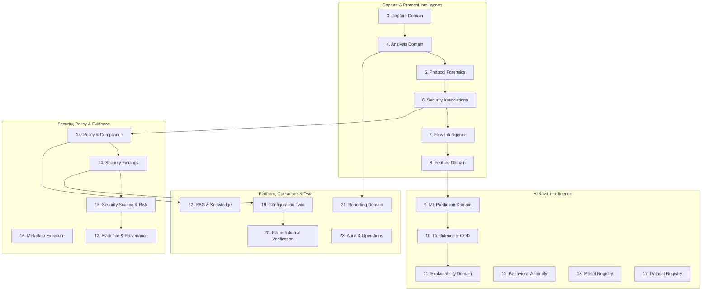

---

## 12. Data Classification

Data within [PROJECT NAME] is classified into five strict sensitivity tiers:

| Classification Level | Definition | Examples | Storage Location | Access Policy |
| :--- | :--- | :--- | :--- | :--- |
| **PUBLIC / REFERENCE** | Open industry standards and RFC definitions | NIST SP 800-77 text, RFC 8221 tables, IANA transform IDs | PostgreSQL (`standards_chunks`) | Read-only to all roles |
| **INTERNAL** | System operational metadata and model configs | Feature schemas, model manifests, job queue statuses | PostgreSQL / Redis | Application services |
| **SENSITIVE NETWORK METADATA**| Observed operational topology and flow headers | Outer IP addresses, SPI numbers, packet sizes, flow rates | PostgreSQL (`esp_flows`, `security_associations`) | Authenticated Analysts |
| **SECURITY-SENSITIVE** | Vulnerability findings, posture scores, remediation configs | Deprecated cipher findings, weak DH warnings, `swanctl.conf` diffs | PostgreSQL (`security_findings`, `twin_scenarios`) | Authorized SOC Engineers / Auditors |
| **SECRET** | Cryptographic private keys and credentials | Private keys, shared secrets, database passwords | **NEVER STORED IN DATABASE** | Host environment secrets / Key Vault |

---

## 13. Data Ownership

| Logical Entity Group | Authoritative Component | Producer | Primary Consumers |
| :--- | :--- | :--- | :--- |
| **Captures & Storage Refs** | Capture & Ingestion Engine | Web Upload / Privileged Agent | Analysis Workers, Archival Tasks |
| **Protocol Observations** | Protocol Forensics Engine | TShark Dissector Worker | SA Reconstruction, Policy Engine |
| **Security Associations** | SA Reconstruction Engine | Python Correlation Worker | UI SA Explorer, Compliance Engine |
| **Flows & Feature Sets** | Flow Reconstruction Engine | NumPy / Pandas Feature Worker | XGBoost & 1D-CNN ML Workers |
| **ML Inferences & OOD** | Encrypted-Traffic ML Engine | Calibrated ML Ensemble Worker | Dashboard UI, Metadata Engine |
| **Findings & Violations** | Security Policy Engine | YAML Policy-as-Code Engine | Scoring Engine, Configuration Twin |
| **Audit Ledger** | Audit Engine | Core API Gateway Middleware | Security Auditors, SOC Supervisors |

---

## 14. Source of Truth Model

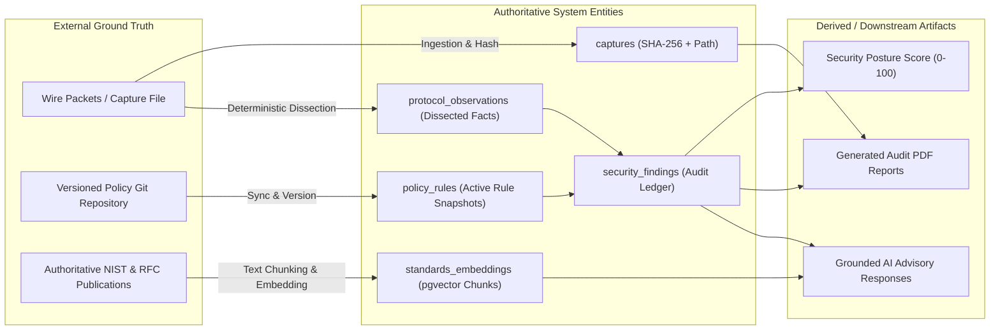

---

## 15. Structured vs Unstructured Storage

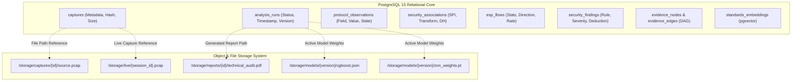

---

## 16. PostgreSQL Architecture

The operational database uses standard relational schemas optimized for high write concurrency during dissection, followed by low-latency analytical queries:
- **Connection Management:** Connection pooling configured via SQLAlchemy `asyncpg` pool (`min_size=5`, `max_size=20`, `max_overflow=10`).
- **Transaction Isolation:** Read Committed (default) for standard operations; Serializable reserved for policy and model version activation transitions.
- **Extensions:**
  - `uuid-ossp` or `pgcrypto` for UUIDv4 generation.
  - `pgvector` for 384-dimensional dense semantic vector similarity indexing.

---

## 17. Object / File Storage Architecture

Storage paths follow a strict deterministic hierarchy preventing name collisions and directory traversal:
```
/var/lib/tunneltrace/storage/
├── captures/
│   └── {capture_uuid}/
│       └── raw.pcap
├── live/
│   └── {session_uuid}/
│       └── live_capture.pcap
├── reports/
│   └── {analysis_uuid}/
│       ├── executive_summary.pdf
│       └── technical_audit.pdf
├── models/
│   └── {model_bundle_version}/
│       ├── manifest.json
│       ├── xgboost_tabular.json
│       └── cnn_spatial.pt
└── datasets/
    └── {dataset_version}/
        ├── train_sessions.parquet
        └── test_sessions.parquet
```

---

## 18. Redis Data Boundary

> [!WARNING]
> Redis is strictly an ephemeral broker and real-time cache. It is never treated as a persistent source of truth.

- **Keyspace Allocation:**
  - `queue:celery`: Default broker queue for background task distribution.
  - `live:counters:{session_id}`: Real-time packet and byte accumulators pushed by the packet sniffer (TTL: 3600s).
  - `cache:analysis_summary:{analysis_id}`: Short-lived cached JSON response of completed analysis runs (TTL: 300s).
  - `lock:testbed`: Distributed mutual-exclusion lock preventing overlapping strongSwan lab operations.

---

## 19. Multi-Tenancy / Identity Considerations

- **Current Prototype Baseline:** Local-first single-tenant model with default administrative access.
- **Future-Ready Schema Provisions:** Core operational tables (`captures`, `analysis_runs`, `audit_events`) include optional `workspace_id UUID` and `organization_id UUID` columns (nullable in `v0.1.0-alpha`).
- **Auth Separation:** No user passwords or tokens are stored in the application schema. Future Supabase integration will bind application profiles to `auth.users.id` via standard UUID foreign keys.

---

## 20. Core Entity Model

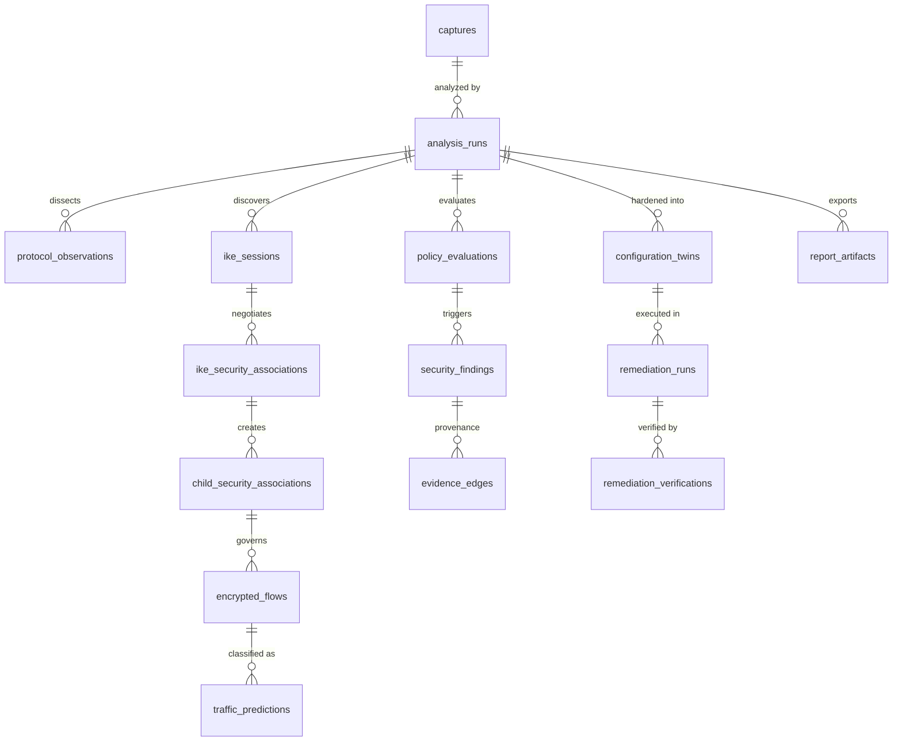

---

## 21. Capture Domain

### `captures` (PROPOSED)
Represents a physical packet trace file uploaded by an analyst or captured live from a testbed interface.

- **Primary Key:** `id UUID`
- **Ownership:** Ingestion Engine
- **Immutability:** Immutable once hashed and written.

| Column | PostgreSQL Type | Nullable | Default | Constraints / Validation | Description |
| :--- | :--- | :--- | :--- | :--- | :--- |
| `id` | `UUID` | No | `gen_random_uuid()` | PRIMARY KEY | Unique capture identifier |
| `original_filename`| `TEXT` | No | None | None | Sanitized original filename |
| `storage_path` | `TEXT` | No | None | UNIQUE | Absolute POSIX or S3 key |
| `file_size_bytes` | `BIGINT` | No | None | `CHECK (file_size_bytes > 0)` | Byte size of raw file |
| `sha256_hash` | `VARCHAR(64)` | No | None | `CHECK (length(sha256_hash) = 64)`| SHA-256 cryptographic digest |
| `capture_source` | `VARCHAR(32)` | No | `'OFFLINE_UPLOAD'` | `CHECK (capture_source IN ('OFFLINE_UPLOAD', 'LIVE_CAPTURE', 'TESTBED_GENERATED'))` | Source environment |
| `packet_count` | `BIGINT` | Yes | `NULL` | `CHECK (packet_count >= 0)` | Dissected packet total |
| `captured_at` | `TIMESTAMPTZ` | Yes | `NULL` | None | Original sniff timestamp |
| `created_at` | `TIMESTAMPTZ` | No | `NOW()` | None | Record ingestion timestamp |

---

## 22. Analysis Domain

### `analysis_runs` (PROPOSED)
Represents an analytical execution against a specific capture file. Multiple analyses with differing versions can target the same capture.

- **Primary Key:** `id UUID`
- **Foreign Keys:** `capture_id -> captures(id) ON DELETE CASCADE`

| Column | PostgreSQL Type | Nullable | Default | Constraints / Validation | Description |
| :--- | :--- | :--- | :--- | :--- | :--- |
| `id` | `UUID` | No | `gen_random_uuid()` | PRIMARY KEY | Unique analysis execution ID |
| `capture_id` | `UUID` | No | None | FOREIGN KEY | Target capture file |
| `status` | `VARCHAR(32)` | No | `'CREATED'` | `CHECK (status IN ('CREATED', 'QUEUED', 'INGESTING', 'PROTOCOL_ANALYSIS', 'FLOW_RECONSTRUCTION', 'ML_ANALYSIS', 'SECURITY_ASSESSMENT', 'FINALIZING', 'COMPLETED', 'PARTIAL', 'FAILED', 'CANCELLED'))` | Current lifecycle state |
| `security_score` | `NUMERIC(5, 2)`| Yes | `NULL` | `CHECK (security_score >= 0.0 AND security_score <= 100.0)` | Overall posture score (0–100) |
| `posture_grade` | `VARCHAR(4)` | Yes | `NULL` | `CHECK (posture_grade IN ('A+', 'A', 'B', 'C', 'D', 'F'))` | Qualitative posture letter grade |
| `parser_version` | `VARCHAR(32)` | No | `'tshark-4.x'` | None | Protocol parser release tag |
| `model_bundle_ver`| `VARCHAR(32)` | No | `'model-v0.1.0'` | None | Deployed ML model bundle version |
| `policy_profile` | `VARCHAR(64)` | No | `'NIST-SP-800-77-R1'` | None | Selected policy rule profile |
| `error_message` | `TEXT` | Yes | `NULL` | None | Diagnostic detail if FAILED |
| `started_at` | `TIMESTAMPTZ` | Yes | `NULL` | None | Processing start timestamp |
| `completed_at` | `TIMESTAMPTZ` | Yes | `NULL` | None | Processing completion timestamp |
| `created_at` | `TIMESTAMPTZ` | No | `NOW()` | None | Record creation timestamp |

---

## 23. Protocol Observation Domain

### `protocol_observations` (PROPOSED)
Stores normalized protocol facts extracted deterministically from packet headers by TShark.

- **Primary Key:** `id UUID`
- **Foreign Keys:** `analysis_id -> analysis_runs(id) ON DELETE CASCADE`

| Column | PostgreSQL Type | Nullable | Default | Constraints / Validation | Description |
| :--- | :--- | :--- | :--- | :--- | :--- |
| `id` | `UUID` | No | `gen_random_uuid()` | PRIMARY KEY | Unique observation record ID |
| `analysis_id` | `UUID` | No | None | FOREIGN KEY | Owning analysis execution |
| `frame_number` | `BIGINT` | No | None | `CHECK (frame_number > 0)` | 1-based packet frame index |
| `frame_offset` | `BIGINT` | Yes | `NULL` | `CHECK (frame_offset >= 0)` | Physical byte offset in capture |
| `packet_time` | `TIMESTAMPTZ` | No | None | None | Wire arrival timestamp |
| `protocol_layer` | `VARCHAR(16)` | No | None | `CHECK (protocol_layer IN ('IKEv1', 'IKEv2', 'ESP', 'AH', 'UDP', 'IPv4', 'IPv6'))` | Dissected protocol |
| `field_name` | `VARCHAR(128)`| No | None | None | Normalized field identifier |
| `field_value_text`| `TEXT` | Yes | `NULL` | None | Human-readable string value |
| `field_value_num` | `NUMERIC` | Yes | `NULL` | None | Parsed numeric value if scalar |
| `evidence_state` | `VARCHAR(32)` | No | `'VERIFIED'` | `CHECK (evidence_state IN ('VERIFIED', 'INFERRED', 'UNKNOWN', 'MISCONFIGURATION_OBSERVED'))` | Analytical certainty state |

---

## 24. IKE Session / IKE SA Domain

### `ike_sessions` (PROPOSED)
Tracks logical end-to-end IKE negotiations identified by initiator and responder SPI pairs.

- **Primary Key:** `id UUID`
- **Foreign Keys:** `analysis_id -> analysis_runs(id) ON DELETE CASCADE`

| Column | PostgreSQL Type | Nullable | Default | Constraints / Validation | Description |
| :--- | :--- | :--- | :--- | :--- | :--- |
| `id` | `UUID` | No | `gen_random_uuid()` | PRIMARY KEY | Unique IKE session ID |
| `analysis_id` | `UUID` | No | None | FOREIGN KEY | Parent analysis ID |
| `initiator_spi` | `VARCHAR(16)` | No | None | `CHECK (length(initiator_spi) = 16)` | 8-byte hex initiator SPI |
| `responder_spi` | `VARCHAR(16)` | Yes | `NULL` | None | 8-byte hex responder SPI |
| `ike_version` | `VARCHAR(8)` | No | None | `CHECK (ike_version IN ('1.0', '2.0'))` | Protocol version |
| `initiator_ip` | `INET` | Yes | `NULL` | None | Discovered initiator IP |
| `responder_ip` | `INET` | Yes | `NULL` | None | Discovered responder IP |
| `exchange_type` | `VARCHAR(32)` | No | None | None | Negotiation phase name |
| `is_nat_detected`| `BOOLEAN` | No | `FALSE` | None | NAT-Traversal detected (port 4500) |
| `evidence_state` | `VARCHAR(32)` | No | `'VERIFIED'` | None | Evidence certainty flag |

### `ike_security_associations` (PROPOSED)
Stores the negotiated cryptographic parameters governing the parent IKE SA.

- **Primary Key:** `id UUID`
- **Foreign Keys:** `session_id -> ike_sessions(id) ON DELETE CASCADE`

| Column | PostgreSQL Type | Nullable | Default | Description |
| :--- | :--- | :--- | :--- | :--- |
| `id` | `UUID` | No | `gen_random_uuid()` | Unique IKE SA record ID |
| `session_id` | `UUID` | No | None | Associated IKE session |
| `encryption_algorithm`| `VARCHAR(64)`| No | None | Negotiated cipher (e.g., `AES-GCM-256`) |
| `integrity_algorithm` | `VARCHAR(64)`| Yes | `NULL` | Negotiated integrity (e.g., `HMAC-SHA256`) |
| `prf_algorithm` | `VARCHAR(64)`| Yes | `NULL` | Pseudo-random function algorithm |
| `dh_group` | `INTEGER` | Yes | `NULL` | Diffie-Hellman Group ID (e.g., 14, 19) |
| `key_length_bits` | `INTEGER` | Yes | `NULL` | Derived cipher key length |
| `established_at` | `TIMESTAMPTZ` | Yes | `NULL` | SA creation wire timestamp |

---

## 25. Child SA Domain

### `child_security_associations` (PROPOSED)
Stores unidirectional or paired Security Associations created to protect ESP/AH data traffic.

- **Primary Key:** `id UUID`
- **Foreign Keys:** `ike_sa_id -> ike_security_associations(id) ON DELETE CASCADE`

| Column | PostgreSQL Type | Nullable | Default | Description |
| :--- | :--- | :--- | :--- | :--- |
| `id` | `UUID` | No | `gen_random_uuid()` | Unique Child SA identifier |
| `ike_sa_id` | `UUID` | Yes | `NULL` | Parent IKE SA (NULL if unobserved) |
| `protocol` | `VARCHAR(8)` | No | `'ESP'` | `CHECK (protocol IN ('ESP', 'AH'))` |
| `inbound_spi` | `VARCHAR(8)` | No | None | 4-byte hex inbound SPI |
| `outbound_spi` | `VARCHAR(8)` | Yes | `NULL` | 4-byte hex outbound SPI |
| `mode` | `VARCHAR(16)` | No | `'TUNNEL'` | `CHECK (mode IN ('TUNNEL', 'TRANSPORT', 'UNKNOWN'))` |
| `encryption_algorithm`| `VARCHAR(64)`| Yes | `NULL` | Child cipher transform |
| `integrity_algorithm` | `VARCHAR(64)`| Yes | `NULL` | Child integrity transform |
| `pfs_dh_group` | `INTEGER` | Yes | `NULL` | Perfect Forward Secrecy group (NULL if OFF) |
| `lifetime_seconds` | `BIGINT` | Yes | `NULL` | Negotiated time lifetime |
| `lifetime_kilobytes` | `BIGINT` | Yes | `NULL` | Negotiated byte volume limit |
| `evidence_state` | `VARCHAR(32)` | No | `'VERIFIED'` | Evidence state |

---

## 26. Traffic Selector Domain

### `traffic_selectors` (PROPOSED)
Stores negotiated subnets and IP ranges permitted across a Child SA.

- **Primary Key:** `id UUID`
- **Foreign Keys:** `child_sa_id -> child_security_associations(id) ON DELETE CASCADE`

| Column | PostgreSQL Type | Nullable | Default | Description |
| :--- | :--- | :--- | :--- | :--- |
| `id` | `UUID` | No | `gen_random_uuid()` | Unique selector ID |
| `child_sa_id` | `UUID` | No | None | Target Child SA |
| `direction` | `VARCHAR(8)` | No | None | `CHECK (direction IN ('INITIATOR', 'RESPONDER'))` |
| `ip_subnet` | `CIDR` | No | None | Allowed IP CIDR block |
| `ip_protocol` | `INTEGER` | No | `0` | Protocol filter (0 = Any) |
| `start_port` | `INTEGER` | No | `0` | Port range start |
| `end_port` | `INTEGER` | No | `65535` | Port range end |

---

## 27. Flow Domain

### `esp_flows` (PROPOSED)
Aggregates individual encrypted ESP packets sharing an SPI and IP pair into a bidirectional statistical stream.

- **Primary Key:** `id UUID`
- **Foreign Keys:**  
  - `analysis_id -> analysis_runs(id) ON DELETE CASCADE`  
  - `child_sa_id -> child_security_associations(id) ON DELETE SET NULL`

| Column | PostgreSQL Type | Nullable | Default | Description |
| :--- | :--- | :--- | :--- | :--- |
| `id` | `UUID` | No | `gen_random_uuid()` | Unique flow identifier |
| `analysis_id` | `UUID` | No | None | Parent analysis ID |
| `child_sa_id` | `UUID` | Yes | `NULL` | Associated Child SA |
| `source_ip` | `INET` | No | None | Flow origin outer IP |
| `destination_ip`| `INET` | No | None | Flow target outer IP |
| `spi` | `VARCHAR(8)` | No | None | Outer ESP SPI (4-byte hex) |
| `start_time` | `TIMESTAMPTZ` | No | None | Timestamp of first observed packet |
| `end_time` | `TIMESTAMPTZ` | No | None | Timestamp of final observed packet |
| `packet_count` | `BIGINT` | No | None | Total packets aggregated |
| `byte_count` | `BIGINT` | No | None | Total wire bytes aggregated |
| `forward_packets`| `BIGINT` | No | `0` | Initiator-to-responder packet count |
| `reverse_packets`| `BIGINT` | No | `0` | Responder-to-initiator packet count |
| `is_nat_t` | `BOOLEAN` | No | `FALSE` | Encapsulated in UDP 4500 |

---

## 28. Feature Domain

### `flow_feature_sets` (PROPOSED)
Stores the 24 extracted tabular statistical metrics and compact spatial sequence references for machine learning inference.

- **Primary Key:** `id UUID`
- **Foreign Keys:** `flow_id -> esp_flows(id) ON DELETE CASCADE`

| Column | PostgreSQL Type | Nullable | Default | Description |
| :--- | :--- | :--- | :--- | :--- |
| `id` | `UUID` | No | `gen_random_uuid()` | Unique feature vector ID |
| `flow_id` | `UUID` | No | None | Target ESP flow (UNIQUE) |
| `feature_schema_ver`| `VARCHAR(32)`| No | `'feat-v1.0'` | Feature layout schema version |
| `duration_ms` | `NUMERIC(12, 3)`| No | None | Flow lifespan in milliseconds |
| `bytes_per_second` | `NUMERIC(14, 2)`| No | None | Average throughput |
| `pkt_length_mean` | `NUMERIC(8, 2)` | No | None | Packet size mean |
| `pkt_length_std` | `NUMERIC(8, 2)` | No | None | Packet size standard deviation |
| `pkt_length_skew` | `NUMERIC(8, 4)` | Yes | `NULL` | Packet size distribution skewness |
| `iat_mean_ms` | `NUMERIC(10, 3)`| No | None | Inter-arrival time mean |
| `burst_count` | `INTEGER` | No | `0` | Number of identified packet bursts |
| `sequence_tensor_ref`| `TEXT` | Yes | `NULL` | Optional path to `(3, 64)` `.npy` tensor |
| `raw_features_json` | `JSONB` | No | `'{}'` | Complete 24-dimensional feature vector |

---

## 29. ML Prediction Domain

### `traffic_predictions` (PROPOSED)
Stores the inferential classification outputs for each ESP flow without performing payload decryption.

- **Primary Key:** `id UUID`
- **Foreign Keys:** `flow_id -> esp_flows(id) ON DELETE CASCADE`

| Column | PostgreSQL Type | Nullable | Default | Description |
| :--- | :--- | :--- | :--- | :--- |
| `id` | `UUID` | No | `gen_random_uuid()` | Unique prediction record ID |
| `flow_id` | `UUID` | No | None | Analyzed ESP flow |
| `predicted_class` | `VARCHAR(32)` | No | None | Inferred class (`Web`, `Video`, `VoIP`, `Chat`, `Email`, `ICMP`, `File_Transfer`, `UNKNOWN`) |
| `calibrated_prob` | `NUMERIC(5, 4)`| No | None | Post-calibration confidence ($0.0000 - 1.0000$) |
| `raw_xgb_prob` | `NUMERIC(5, 4)`| Yes | `NULL` | Uncalibrated XGBoost softmax score |
| `raw_cnn_prob` | `NUMERIC(5, 4)`| Yes | `NULL` | Uncalibrated 1D-CNN softmax score |
| `is_out_of_distribution`| `BOOLEAN` | No | `FALSE` | True if rejected by OOD entropy gate |
| `predictive_entropy` | `NUMERIC(6, 4)`| Yes | `NULL` | Shannon entropy across class distribution |
| `class_probabilities` | `JSONB` | No | `'{}'` | Full probability vector across all classes |

---

## 30. Confidence / OOD Domain

The platform models uncertainty explicitly:
- **Platt Temperature Calibration:** Raw model logits are scaled via parameter $T$ stored in `model_bundles.calibration_params`.
- **OOD Formulation:** If predictive Shannon entropy exceeds `ood_configurations.entropy_threshold`, `traffic_predictions.is_out_of_distribution` is asserted `TRUE` and `predicted_class` is set to `'UNKNOWN'`.

---

## 31. Explainability Domain

### `prediction_explanations` (PROPOSED)
Stores the top-K local feature contributions computed via TreeSHAP for each tabular inference.

- **Primary Key:** `id UUID`
- **Foreign Keys:** `prediction_id -> traffic_predictions(id) ON DELETE CASCADE`

| Column | PostgreSQL Type | Nullable | Default | Description |
| :--- | :--- | :--- | :--- | :--- |
| `id` | `UUID` | No | `gen_random_uuid()` | Unique explanation ID |
| `prediction_id` | `UUID` | No | None | Target prediction record |
| `base_value` | `NUMERIC(8, 4)` | No | None | Model expected bias output |
| `top_features_shap`| `JSONB` | No | `'[]'` | Array of `[{feature, value, shap_value}]` |
| `created_at` | `TIMESTAMPTZ` | No | `NOW()` | Computation timestamp |

---

## 32. Anomaly Domain

### `flow_anomaly_results` (PROPOSED)
Stores behavioral anomaly scores generated by an Isolation Forest evaluating flow dispersion against historical baselines.

- **Primary Key:** `id UUID`
- **Foreign Keys:** `flow_id -> esp_flows(id) ON DELETE CASCADE`

| Column | PostgreSQL Type | Nullable | Default | Description |
| :--- | :--- | :--- | :--- | :--- |
| `id` | `UUID` | No | `gen_random_uuid()` | Unique anomaly result ID |
| `flow_id` | `UUID` | No | None | Analyzed flow |
| `anomaly_score` | `NUMERIC(6, 4)` | No | None | Isolation Forest decision score ($-1.0$ to $+1.0$) |
| `is_anomalous` | `BOOLEAN` | No | `FALSE` | True if score falls below anomaly threshold |
| `anomaly_category`| `VARCHAR(64)` | Yes | `NULL` | Suspected driver (e.g., `'PACKET_SIZE_SURGE'`) |

---

## 33. Policy Profile / Version Domain

### `policy_profiles` (PROPOSED)
Defines high-level regulatory or organizational compliance rule sets.

- **Primary Key:** `id UUID`

| Column | PostgreSQL Type | Nullable | Default | Description |
| :--- | :--- | :--- | :--- | :--- |
| `id` | `UUID` | No | `gen_random_uuid()` | Unique profile identifier |
| `profile_key` | `VARCHAR(64)` | No | None | Programmatic key (e.g., `'NIST-SP-800-77-R1'`) |
| `title` | `TEXT` | No | None | Human-readable title |
| `version_tag` | `VARCHAR(32)` | No | `'1.0.0'` | Semantic version of policy bundle |
| `is_active` | `BOOLEAN` | No | `TRUE` | Whether available for new runs |
| `created_at` | `TIMESTAMPTZ` | No | `NOW()` | Registration timestamp |

---

## 34. Policy Rule / Evaluation Domain

### `policy_rules` (PROPOSED)
Represents atomic security checks compiled from version-controlled YAML policy bundles.

- **Primary Key:** `id UUID`
- **Foreign Keys:** `profile_id -> policy_profiles(id) ON DELETE CASCADE`

| Column | PostgreSQL Type | Nullable | Default | Description |
| :--- | :--- | :--- | :--- | :--- |
| `id` | `UUID` | No | `gen_random_uuid()` | Unique rule ID |
| `profile_id` | `UUID` | No | None | Parent policy profile |
| `rule_code` | `VARCHAR(64)` | No | None | Unique stable code (e.g., `'SEC-CRYPTO-001'`) |
| `title` | `TEXT` | No | None | Short descriptive name |
| `severity` | `VARCHAR(16)` | No | None | `CHECK (severity IN ('CRITICAL', 'HIGH', 'MEDIUM', 'LOW', 'INFORMATIONAL'))` |
| `deduction_points`| `NUMERIC(5, 2)`| No | `0.0` | Points subtracted from score on violation |
| `standard_ref` | `TEXT` | No | None | Exact citation (e.g., `'NIST SP 800-77 Section 4.1.2'`) |
| `rule_logic_yaml` | `TEXT` | No | None | Canonical rule definition syntax |

### `policy_evaluations` (PROPOSED)
Records the outcome of evaluating a specific policy rule against an analysis run.

- **Primary Key:** `id UUID`
- **Foreign Keys:**  
  - `analysis_id -> analysis_runs(id) ON DELETE CASCADE`  
  - `rule_id -> policy_rules(id) ON DELETE RESTRICT`

| Column | PostgreSQL Type | Nullable | Default | Description |
| :--- | :--- | :--- | :--- | :--- |
| `id` | `UUID` | No | `gen_random_uuid()` | Unique evaluation ID |
| `analysis_id` | `UUID` | No | None | Evaluated analysis run |
| `rule_id` | `UUID` | No | None | Evaluated rule |
| `result` | `VARCHAR(16)` | No | None | `CHECK (result IN ('PASS', 'FAIL', 'UNKNOWN', 'NOT_APPLICABLE'))` |
| `observed_value` | `TEXT` | Yes | `NULL` | Extracted wire value that triggered outcome |
| `justification` | `TEXT` | Yes | `NULL` | Deterministic compliance rationale |
| `evaluated_at` | `TIMESTAMPTZ` | No | `NOW()` | Timestamp of rule evaluation |

---

## 35. Security Finding Domain

### `security_findings` (PROPOSED)
Represents a concrete vulnerability, misconfiguration, or compliance violation discovered in the network trace.

- **Primary Key:** `id UUID`
- **Foreign Keys:**  
  - `analysis_id -> analysis_runs(id) ON DELETE CASCADE`  
  - `evaluation_id -> policy_evaluations(id) ON DELETE SET NULL`

| Column | PostgreSQL Type | Nullable | Default | Description |
| :--- | :--- | :--- | :--- | :--- |
| `id` | `UUID` | No | `gen_random_uuid()` | Unique finding record ID |
| `analysis_id` | `UUID` | No | None | Associated analysis execution |
| `evaluation_id` | `UUID` | Yes | `NULL` | Triggering policy evaluation |
| `finding_code` | `VARCHAR(64)` | No | None | Finding category code |
| `title` | `TEXT` | No | None | Human-readable finding summary |
| `severity` | `VARCHAR(16)` | No | None | `CHECK (severity IN ('CRITICAL', 'HIGH', 'MEDIUM', 'LOW', 'INFORMATIONAL'))` |
| `affected_entity_type`| `VARCHAR(32)`| No | None | `CHECK (affected_entity_type IN ('IKE_SA', 'CHILD_SA', 'FLOW', 'CAPTURE'))` |
| `affected_entity_id` | `UUID` | Yes | `NULL` | ID of violating SA or flow record |
| `deduction_applied` | `NUMERIC(5, 2)`| No | `0.0` | Points deducted from security score |
| `evidence_state` | `VARCHAR(32)` | No | `'VERIFIED'` | Evidence verification certainty |
| `remediation_recommendation`| `TEXT`| No | None | Authoritative hardening action |
| `lifecycle_status` | `VARCHAR(32)` | No | `'OPEN'` | `CHECK (lifecycle_status IN ('OPEN', 'ACKNOWLEDGED', 'REMEDIATION_PLANNED', 'VERIFIED_RESOLVED', 'ACCEPTED_RISK', 'CLOSED'))` |
| `created_at` | `TIMESTAMPTZ` | No | `NOW()` | Record creation timestamp |

---

## 36. Compliance Domain

### `compliance_scorecards` (PROPOSED)
Aggregates policy evaluations into authoritative regulatory scorecards.

- **Primary Key:** `id UUID`
- **Foreign Keys:** `analysis_id -> analysis_runs(id) ON DELETE CASCADE`

| Column | PostgreSQL Type | Nullable | Default | Description |
| :--- | :--- | :--- | :--- | :--- |
| `id` | `UUID` | No | `gen_random_uuid()` | Unique scorecard ID |
| `analysis_id` | `UUID` | No | None | Associated analysis ID |
| `standard_name` | `VARCHAR(64)` | No | None | e.g., `'NIST SP 800-77 Rev. 1'` |
| `total_rules_evaluated`| `INTEGER` | No | `0` | Count of rules evaluated |
| `passed_rules` | `INTEGER` | No | `0` | Count of `PASS` results |
| `failed_rules` | `INTEGER` | No | `0` | Count of `FAIL` results |
| `unknown_rules` | `INTEGER` | No | `0` | Count of `UNKNOWN` results |
| `compliance_percentage`| `NUMERIC(5, 2)`| No | `0.0` | Passed / (Passed + Failed) * 100 |

---

## 37. Security Score Domain

### `security_score_breakdowns` (PROPOSED)
Stores the dimension-level deductions and weights used to synthesize the aggregate 0–100 Security Posture Score.

- **Primary Key:** `id UUID`
- **Foreign Keys:** `analysis_id -> analysis_runs(id) ON DELETE CASCADE`

| Column | PostgreSQL Type | Nullable | Default | Description |
| :--- | :--- | :--- | :--- | :--- |
| `id` | `UUID` | No | `gen_random_uuid()` | Unique breakdown ID |
| `analysis_id` | `UUID` | No | None | Target analysis run (UNIQUE) |
| `crypto_score` | `NUMERIC(5, 2)`| No | `100.0` | Cryptographic algorithm strength sub-score |
| `key_exchange_score`| `NUMERIC(5, 2)`| No | `100.0` | DH groups and PFS posture sub-score |
| `integrity_replay_score`| `NUMERIC(5, 2)`| No | `100.0` | Replay protection & anti-tamper sub-score |
| `sa_lifecycle_score`| `NUMERIC(5, 2)`| No | `100.0` | Rekeying and lifetime enforcement sub-score |
| `total_deductions` | `NUMERIC(5, 2)`| No | `0.0` | Sum of all applied deductions |
| `scoring_formula_ver`| `VARCHAR(32)`| No | `'score-v1.0'` | Versioned scoring methodology |

---

## 38. Risk Domain

### `risk_assessments` (PROPOSED)
Translates technical findings into enterprise risk levels.

- **Primary Key:** `id UUID`
- **Foreign Keys:** `finding_id -> security_findings(id) ON DELETE CASCADE`

| Column | PostgreSQL Type | Nullable | Default | Description |
| :--- | :--- | :--- | :--- | :--- |
| `id` | `UUID` | No | `gen_random_uuid()` | Unique risk record ID |
| `finding_id` | `UUID` | No | None | Associated finding (UNIQUE) |
| `likelihood_tier` | `VARCHAR(16)` | No | None | `CHECK (likelihood_tier IN ('VERY_HIGH', 'HIGH', 'MEDIUM', 'LOW'))` |
| `impact_tier` | `VARCHAR(16)` | No | None | `CHECK (impact_tier IN ('CRITICAL', 'MAJOR', 'MODERATE', 'MINOR'))` |
| `composite_risk` | `VARCHAR(16)` | No | None | Calculated risk tier |
| `exploit_vector` | `TEXT` | No | None | Potential attack mechanism (e.g., Sweet32) |

---

## 39. Threat Matrix Domain

### `threat_matrix_entries` (PROPOSED)
Maps security findings to the STRIDE threat taxonomy and MITRE ATT&CK for Enterprise framework.

- **Primary Key:** `id UUID`
- **Foreign Keys:** `finding_id -> security_findings(id) ON DELETE CASCADE`

| Column | PostgreSQL Type | Nullable | Default | Description |
| :--- | :--- | :--- | :--- | :--- |
| `id` | `UUID` | No | `gen_random_uuid()` | Unique threat entry ID |
| `finding_id` | `UUID` | No | None | Target finding |
| `stride_category` | `VARCHAR(32)` | No | None | `CHECK (stride_category IN ('SPOOFING', 'TAMPERING', 'REPUDIATION', 'INFORMATION_DISCLOSURE', 'DENIAL_OF_SERVICE', 'ELEVATION_OF_PRIVILEGE'))` |
| `mitre_technique_id`| `VARCHAR(32)`| Yes | `NULL` | e.g., `'T1040: Network Sniffing'` |
| `threat_narrative` | `TEXT` | No | None | Formal explanation of operational threat |

---

## 40. Metadata Fingerprintability Domain

### `metadata_exposure_assessments` (PROPOSED)
Quantifies the side-channel distinguishability of encrypted traffic based on packet lengths, timing, and burst patterns.

- **Primary Key:** `id UUID`
- **Foreign Keys:** `analysis_id -> analysis_runs(id) ON DELETE CASCADE`

| Column | PostgreSQL Type | Nullable | Default | Description |
| :--- | :--- | :--- | :--- | :--- |
| `id` | `UUID` | No | `gen_random_uuid()` | Unique assessment ID |
| `analysis_id` | `UUID` | No | None | Associated analysis ID (UNIQUE) |
| `fingerprintability_index`| `NUMERIC(5, 2)`| No | None | 0–100 Exposure index (Higher = More Exposed) |
| `length_entropy` | `NUMERIC(6, 4)`| No | None | Shannon entropy of packet size histogram |
| `burst_autocorrelation`| `NUMERIC(6, 4)`| No | None | Temporal burst correlation measure |
| `directional_asymmetry`| `NUMERIC(5, 4)`| No | None | Ratio of forward to reverse volume |
| `exposure_level` | `VARCHAR(16)` | No | None | `CHECK (exposure_level IN ('CRITICAL', 'HIGH', 'MODERATE', 'LOW', 'MINIMAL'))` |

---

## 41. Evidence / Provenance Domain

The platform maintains a formal directed acyclic graph (DAG) linking high-level security conclusions back to raw physical wire packets:

### `evidence_nodes` (PROPOSED)
- **Primary Key:** `id UUID`
- **Foreign Keys:** `analysis_id -> analysis_runs(id) ON DELETE CASCADE`

| Column | PostgreSQL Type | Nullable | Default | Description |
| :--- | :--- | :--- | :--- | :--- |
| `id` | `UUID` | No | `gen_random_uuid()` | Unique node ID |
| `analysis_id` | `UUID` | No | None | Associated analysis ID |
| `node_type` | `VARCHAR(32)` | No | None | `CHECK (node_type IN ('CAPTURE', 'FRAME', 'PROTOCOL_FACT', 'SA', 'FLOW', 'POLICY_RULE', 'FINDING', 'THREAT'))` |
| `entity_id` | `UUID` | Yes | `NULL` | Pointer to physical entity table |
| `label` | `TEXT` | No | None | Human-readable node label |
| `metadata_json` | `JSONB` | No | `'{}'` | Contextual properties and byte offsets |

### `evidence_edges` (PROPOSED)
- **Primary Key:** `id UUID`
- **Foreign Keys:**  
  - `source_node_id -> evidence_nodes(id) ON DELETE CASCADE`  
  - `target_node_id -> evidence_nodes(id) ON DELETE CASCADE`

| Column | PostgreSQL Type | Nullable | Default | Description |
| :--- | :--- | :--- | :--- | :--- |
| `id` | `UUID` | No | `gen_random_uuid()` | Unique edge ID |
| `source_node_id` | `UUID` | No | None | Originating evidence node |
| `target_node_id` | `UUID` | No | None | Terminating evidence node |
| `relationship_type`| `VARCHAR(32)`| No | None | `CHECK (relationship_type IN ('DISSECTED_FROM', 'MEMBER_OF', 'EVALUATED_BY', 'VIOLATES', 'JUSTIFIES', 'DERIVED_FROM'))` |

---

## 42. Configuration Snapshot Domain

### `configuration_snapshots` (PROPOSED)
Stores immutable representations of VPN daemon configuration states.

- **Primary Key:** `id UUID`

| Column | PostgreSQL Type | Nullable | Default | Description |
| :--- | :--- | :--- | :--- | :--- |
| `id` | `UUID` | No | `gen_random_uuid()` | Unique snapshot ID |
| `snapshot_type` | `VARCHAR(32)` | No | None | `CHECK (snapshot_type IN ('OBSERVED_WIRE', 'TWIN_PROJECTED', 'LAB_ACTIVE', 'LAB_BACKUP'))` |
| `config_format` | `VARCHAR(16)` | No | `'SWANCTL'` | `CHECK (config_format IN ('SWANCTL', 'IPSEC_CONF', 'JSON'))` |
| `config_content` | `TEXT` | No | None | Full configuration file content |
| `config_hash` | `VARCHAR(64)` | No | None | SHA-256 hash of configuration text |
| `created_at` | `TIMESTAMPTZ` | No | `NOW()` | Snapshot timestamp |

---

## 43. Configuration Twin Domain

### `configuration_twins` (PROPOSED)
Maintains digital twin scenarios used to model security hardening transformations and project score improvements prior to lab deployment.

- **Primary Key:** `id UUID`
- **Foreign Keys:**  
  - `analysis_id -> analysis_runs(id) ON DELETE CASCADE`  
  - `observed_snapshot_id -> configuration_snapshots(id) ON DELETE RESTRICT`  
  - `hardened_snapshot_id -> configuration_snapshots(id) ON DELETE RESTRICT`

| Column | PostgreSQL Type | Nullable | Default | Description |
| :--- | :--- | :--- | :--- | :--- |
| `id` | `UUID` | No | `gen_random_uuid()` | Unique twin scenario ID |
| `analysis_id` | `UUID` | No | None | Associated analysis ID |
| `observed_snapshot_id`| `UUID` | No | None | Baseline configuration snapshot |
| `hardened_snapshot_id`| `UUID` | No | None | Hardened configuration snapshot |
| `projected_score` | `NUMERIC(5, 2)`| No | None | Score predicted after applying remediations |
| `projected_score_delta`| `NUMERIC(5, 2)`| No | None | Expected point gain (e.g., $+52.00$) |
| `diff_text` | `TEXT` | No | None | Unified diff showing configuration edits |
| `created_at` | `TIMESTAMPTZ` | No | `NOW()` | Creation timestamp |

---

## 44. Remediation Domain

### `remediation_runs` (PROPOSED)
Tracks the closed-loop execution of configuration fixes applied to the isolated strongSwan testbed.

- **Primary Key:** `id UUID`
- **Foreign Keys:**  
  - `twin_id -> configuration_twins(id) ON DELETE RESTRICT`  
  - `backup_snapshot_id -> configuration_snapshots(id) ON DELETE RESTRICT`

| Column | PostgreSQL Type | Nullable | Default | Description |
| :--- | :--- | :--- | :--- | :--- |
| `id` | `UUID` | No | `gen_random_uuid()` | Unique remediation run ID |
| `twin_id` | `UUID` | No | None | Applied configuration twin |
| `backup_snapshot_id`| `UUID` | No | None | Safe pre-remediation rollback config |
| `status` | `VARCHAR(32)` | No | `'INITIATED'` | `CHECK (status IN ('INITIATED', 'CONFIG_APPLIED', 'TUNNEL_RELOADED', 'VERIFICATION_PROBING', 'COMPLETED', 'ROLLED_BACK', 'FAILED'))` |
| `operator_id` | `VARCHAR(64)` | No | `'analyst-local'`| Identifier of authorizing operator |
| `executed_at` | `TIMESTAMPTZ` | No | `NOW()` | Execution start timestamp |

### `remediation_verifications` (PROPOSED)
Stores the outcome of automated post-remediation traffic sniffing and re-analysis.

- **Primary Key:** `id UUID`
- **Foreign Keys:**  
  - `remediation_run_id -> remediation_runs(id) ON DELETE CASCADE`  
  - `post_analysis_id -> analysis_runs(id) ON DELETE RESTRICT`

| Column | PostgreSQL Type | Nullable | Default | Description |
| :--- | :--- | :--- | :--- | :--- |
| `id` | `UUID` | No | `gen_random_uuid()` | Unique verification ID |
| `remediation_run_id`| `UUID` | No | None | Associated remediation run |
| `post_analysis_id` | `UUID` | No | None | Analysis run executed on post-fix capture |
| `verification_result`| `VARCHAR(32)`| No | None | `CHECK (verification_result IN ('VERIFIED_RESOLVED', 'VERIFIED_NOT_RESOLVED', 'PARTIALLY_VERIFIED', 'VERIFICATION_FAILED', 'UNKNOWN'))` |
| `baseline_score` | `NUMERIC(5, 2)`| No | None | Score prior to remediation |
| `verified_score` | `NUMERIC(5, 2)`| No | None | Score achieved after remediation |
| `verified_at` | `TIMESTAMPTZ` | No | `NOW()` | Verification timestamp |

---

## 45. Report Domain

### `report_artifacts` (PROPOSED)
Catalogs generated publication-grade PDF and HTML reports.

- **Primary Key:** `id UUID`
- **Foreign Keys:** `analysis_id -> analysis_runs(id) ON DELETE CASCADE`

| Column | PostgreSQL Type | Nullable | Default | Description |
| :--- | :--- | :--- | :--- | :--- |
| `id` | `UUID` | No | `gen_random_uuid()` | Unique report record ID |
| `analysis_id` | `UUID` | No | None | Analyzed run |
| `report_type` | `VARCHAR(32)` | No | None | `CHECK (report_type IN ('EXECUTIVE_SUMMARY', 'TECHNICAL_AUDIT'))` |
| `file_format` | `VARCHAR(8)` | No | `'PDF'` | `CHECK (file_format IN ('PDF', 'HTML', 'JSON'))` |
| `storage_path` | `TEXT` | No | None | Storage volume location |
| `file_size_bytes` | `BIGINT` | No | None | File size |
| `sha256_hash` | `VARCHAR(64)` | No | None | Cryptographic digest of report document |
| `generated_at` | `TIMESTAMPTZ` | No | `NOW()` | Generation timestamp |

---

## 46. Testbed Domain

### `testbed_scenarios` (PROPOSED)
Reusable configuration templates defining testbed network topology and cryptographic transforms.

- **Primary Key:** `id UUID`

| Column | PostgreSQL Type | Nullable | Default | Description |
| :--- | :--- | :--- | :--- | :--- |
| `id` | `UUID` | No | `gen_random_uuid()` | Unique scenario ID |
| `scenario_name` | `VARCHAR(64)` | No | None | e.g., `'WEAK_LEGACY_3DES_MD5'` |
| `ipsec_mode` | `VARCHAR(16)` | No | `'TUNNEL'` | `CHECK (ipsec_mode IN ('TUNNEL', 'TRANSPORT'))` |
| `ike_version` | `VARCHAR(8)` | No | `'2.0'` | `CHECK (ike_version IN ('1.0', '2.0'))` |
| `encryption_suite`| `TEXT` | No | None | e.g., `'3des-sha1-modp1024'` |
| `pfs_enabled` | `BOOLEAN` | No | `FALSE` | DH rekey enabled |
| `ip_version` | `VARCHAR(8)` | No | `'IPv4'` | `CHECK (ip_version IN ('IPv4', 'IPv6'))` |
| `netem_latency_ms`| `INTEGER` | No | `0` | Injected transit delay |
| `netem_loss_pct` | `NUMERIC(4, 2)`| No | `0.0` | Injected packet loss percentage |

### `testbed_runs` (PROPOSED)
Physical executions of testbed scenarios generating real wire packets.

- **Primary Key:** `id UUID`
- **Foreign Keys:**  
  - `scenario_id -> testbed_scenarios(id) ON DELETE RESTRICT`  
  - `capture_id -> captures(id) ON DELETE SET NULL`

| Column | PostgreSQL Type | Nullable | Default | Description |
| :--- | :--- | :--- | :--- | :--- |
| `id` | `UUID` | No | `gen_random_uuid()` | Unique run ID |
| `scenario_id` | `UUID` | No | None | Executed scenario |
| `capture_id` | `UUID` | Yes | `NULL` | Resulting raw capture |
| `execution_status`| `VARCHAR(32)`| No | `'SUCCESS'` | `CHECK (execution_status IN ('SUCCESS', 'FAILED', 'TIMED_OUT'))` |
| `workload_type` | `VARCHAR(32)` | No | None | Application simulated (`VoIP`, `Video`, etc.) |
| `started_at` | `TIMESTAMPTZ` | No | `NOW()` | Start timestamp |
| `duration_seconds`| `INTEGER` | No | `30` | Duration of active traffic generation |

---

## 47. Dataset Registry

### `datasets` (PROPOSED)
Master catalog of machine learning datasets utilized for model training and evaluation.

- **Primary Key:** `id UUID`

| Column | PostgreSQL Type | Nullable | Default | Description |
| :--- | :--- | :--- | :--- | :--- |
| `id` | `UUID` | No | `gen_random_uuid()` | Unique dataset ID |
| `dataset_name` | `VARCHAR(64)` | No | None | e.g., `'TUNNELTRACE_NATIVE_IPSEC'` |
| `vpn_technology` | `VARCHAR(32)` | No | None | `CHECK (vpn_technology IN ('IPSEC_NATIVE', 'OPENVPN', 'WIREGUARD'))` |
| `is_primary` | `BOOLEAN` | No | `TRUE` | True for native IPsec; False for external benchmarks |
| `description` | `TEXT` | No | None | Scope and generation methodology |

---

## 48. Dataset Version / Session Domain

### `dataset_versions` (PROPOSED)
Immutable snapshot releases of curated dataset sessions.

- **Primary Key:** `id UUID`
- **Foreign Keys:** `dataset_id -> datasets(id) ON DELETE CASCADE`

| Column | PostgreSQL Type | Nullable | Default | Description |
| :--- | :--- | :--- | :--- | :--- |
| `id` | `UUID` | No | `gen_random_uuid()` | Unique version ID |
| `dataset_id` | `UUID` | No | None | Parent dataset |
| `version_tag` | `VARCHAR(32)` | No | `'v1.0.0'` | Semantic release version |
| `session_count` | `INTEGER` | No | `0` | Number of encapsulated sessions |
| `manifest_hash` | `VARCHAR(64)` | No | None | SHA-256 hash of dataset manifest |
| `created_at` | `TIMESTAMPTZ` | No | `NOW()` | Release timestamp |

### `dataset_sessions` (PROPOSED)
Represents a single controlled traffic generation session with verified ground-truth labels.

- **Primary Key:** `id UUID`
- **Foreign Keys:**  
  - `dataset_version_id -> dataset_versions(id) ON DELETE CASCADE`  
  - `testbed_run_id -> testbed_runs(id) ON DELETE RESTRICT`

| Column | PostgreSQL Type | Nullable | Default | Description |
| :--- | :--- | :--- | :--- | :--- |
| `id` | `UUID` | No | `gen_random_uuid()` | Unique session ID |
| `dataset_version_id`| `UUID` | No | None | Parent dataset version |
| `testbed_run_id` | `UUID` | No | None | Originating testbed execution |
| `ground_truth_label`| `VARCHAR(32)`| No | None | Verified class (`Web`, `Video`, `VoIP`, etc.) |
| `ipsec_mode` | `VARCHAR(16)` | No | None | Configured mode (`TUNNEL` or `TRANSPORT`) |
| `cipher_suite` | `VARCHAR(64)` | No | None | Configured cipher |
| `is_valid` | `BOOLEAN` | No | `TRUE` | False if session suffered packet loss or corruption |

---

## 49. Dataset Split Domain

### `dataset_splits` (PROPOSED)
Partitions sessions strictly at the session level to prevent intra-session packet leakage between training and evaluation folds.

- **Primary Key:** `id UUID`
- **Foreign Keys:**  
  - `dataset_version_id -> dataset_versions(id) ON DELETE CASCADE`  
  - `session_id -> dataset_sessions(id) ON DELETE CASCADE`

| Column | PostgreSQL Type | Nullable | Default | Constraints / Description |
| :--- | :--- | :--- | :--- | :--- |
| `id` | `UUID` | No | `gen_random_uuid()` | Unique split record ID |
| `dataset_version_id`| `UUID` | No | None | Target dataset version |
| `session_id` | `UUID` | No | None | Assigned session (UNIQUE within version) |
| `split_assignment` | `VARCHAR(16)` | No | None | `CHECK (split_assignment IN ('TRAIN', 'VALIDATION', 'TEST', 'OOD_HOLDOUT'))` |

---

## 50. Model Registry

### `model_bundles` (PROPOSED)
Tracks approved machine learning model releases deployed for encrypted traffic classification.

- **Primary Key:** `id UUID`

| Column | PostgreSQL Type | Nullable | Default | Description |
| :--- | :--- | :--- | :--- | :--- |
| `id` | `UUID` | No | `gen_random_uuid()` | Unique bundle ID |
| `bundle_version` | `VARCHAR(32)` | No | None | Semantic version (UNIQUE, e.g., `'model-v1.0.0'`) |
| `ensemble_alpha` | `NUMERIC(4, 3)`| No | `0.600` | XGBoost weight ($0.0 - 1.0$) vs CNN |
| `temperature` | `NUMERIC(5, 3)`| No | `1.250` | Platt scaling temperature parameter |
| `entropy_threshold`| `NUMERIC(5, 3)`| No | `1.800` | OOD rejection cutoff |
| `is_active` | `BOOLEAN` | No | `FALSE` | Currently active for production analysis |
| `created_at` | `TIMESTAMPTZ` | No | `NOW()` | Release timestamp |

---

## 51. Feature Schema Registry

### `feature_schemas` (PROPOSED)
Formally registers the feature layout and normalization parameters to ensure feature extractors match model expectations.

- **Primary Key:** `id UUID`

| Column | PostgreSQL Type | Nullable | Default | Description |
| :--- | :--- | :--- | :--- | :--- |
| `id` | `UUID` | No | `gen_random_uuid()` | Unique schema ID |
| `schema_version` | `VARCHAR(32)` | No | None | Version tag (e.g., `'feat-v1.0'`) |
| `feature_count` | `INTEGER` | No | `24` | Expected number of tabular features |
| `feature_names_json`| `JSONB` | No | None | Ordered array of feature string identifiers |
| `created_at` | `TIMESTAMPTZ` | No | `NOW()` | Registration timestamp |

---

## 52. Model Evaluation Domain

### `model_evaluations` (PROPOSED)
Persists measured performance metrics of model bundles against verified test datasets. **No fabricated metrics are pre-populated.**

- **Primary Key:** `id UUID`
- **Foreign Keys:**  
  - `model_bundle_id -> model_bundles(id) ON DELETE CASCADE`  
  - `dataset_version_id -> dataset_versions(id) ON DELETE RESTRICT`

| Column | PostgreSQL Type | Nullable | Default | Description |
| :--- | :--- | :--- | :--- | :--- |
| `id` | `UUID` | No | `gen_random_uuid()` | Unique evaluation ID |
| `model_bundle_id` | `UUID` | No | None | Evaluated model |
| `dataset_version_id`| `UUID` | No | None | Evaluation dataset version |
| `macro_f1_score` | `NUMERIC(5, 4)`| Yes | `NULL` | Measured Macro-F1 across known classes |
| `ece_score` | `NUMERIC(5, 4)`| Yes | `NULL` | Expected Calibration Error |
| `ood_rejection_rate`| `NUMERIC(5, 4)`| Yes | `NULL` | Rejection rate on holdout OOD sessions |
| `metrics_json` | `JSONB` | No | `'{}'` | Full confusion matrix and per-class metrics |
| `evaluated_at` | `TIMESTAMPTZ` | No | `NOW()` | Evaluation execution timestamp |

---

## 53. RAG / Knowledge Domain

### `knowledge_documents` (PROPOSED)
Tracks approved regulatory documents ingested into the vector search catalog.

- **Primary Key:** `id UUID`

| Column | PostgreSQL Type | Nullable | Default | Description |
| :--- | :--- | :--- | :--- | :--- |
| `id` | `UUID` | No | `gen_random_uuid()` | Unique document ID |
| `document_code` | `VARCHAR(64)` | No | None | e.g., `'NIST-SP-800-77-R1'` |
| `title` | `TEXT` | No | None | Document full title |
| `authoritative_source`| `VARCHAR(64)`| No | None | e.g., `'NIST'`, `'IETF'`, `'IANA'` |
| `publication_date` | `DATE` | Yes | `NULL` | Official release date |
| `ingested_at` | `TIMESTAMPTZ` | No | `NOW()` | Parsing timestamp |

### `standards_embeddings` (PROPOSED)
Stores chunked passages and dense vector embeddings using `pgvector` for semantic search by the AI Analyst.

- **Primary Key:** `id UUID`
- **Foreign Keys:** `document_id -> knowledge_documents(id) ON DELETE CASCADE`

| Column | PostgreSQL Type | Nullable | Default | Description |
| :--- | :--- | :--- | :--- | :--- |
| `id` | `UUID` | No | `gen_random_uuid()` | Unique chunk ID |
| `document_id` | `UUID` | No | None | Source document |
| `section_reference`| `VARCHAR(64)` | No | None | e.g., `'Section 4.1.2'` |
| `chunk_text` | `TEXT` | No | None | Unstructured passage content |
| `embedding_model` | `VARCHAR(64)` | No | `'all-MiniLM-L6-v2'`| Embedder model tag |
| `embedding` | `vector(384)` | No | None | 384-dimensional dense semantic vector |

---

## 54. Audit Domain

### `audit_events` (PROPOSED)
Maintains an immutable ledger of sensitive operational actions.

- **Primary Key:** `id UUID`

| Column | PostgreSQL Type | Nullable | Default | Description |
| :--- | :--- | :--- | :--- | :--- |
| `id` | `UUID` | No | `gen_random_uuid()` | Unique audit event ID |
| `actor_id` | `VARCHAR(64)` | No | None | Operator username or service account |
| `action_name` | `VARCHAR(64)` | No | None | e.g., `'APPLY_REMEDIATION'`, `'DELETE_CAPTURE'` |
| `target_entity_type`| `VARCHAR(32)`| No | None | Target domain entity name |
| `target_entity_id` | `UUID` | Yes | `NULL` | ID of modified resource |
| `execution_result` | `VARCHAR(16)` | No | None | `CHECK (execution_result IN ('SUCCESS', 'FAILURE', 'DENIED'))` |
| `details_json` | `JSONB` | No | `'{}'` | Event metadata and parameters |
| `created_at` | `TIMESTAMPTZ` | No | `NOW()` | Event timestamp |

---

## 55. Durable Job Metadata

### `analysis_jobs` (PROPOSED)
Persists durable background worker task progress so long-running dissection jobs survive transient Redis restarts.

- **Primary Key:** `id UUID`
- **Foreign Keys:** `analysis_id -> analysis_runs(id) ON DELETE CASCADE`

| Column | PostgreSQL Type | Nullable | Default | Description |
| :--- | :--- | :--- | :--- | :--- |
| `id` | `UUID` | No | `gen_random_uuid()` | Task tracking ID |
| `analysis_id` | `UUID` | No | None | Target analysis execution (UNIQUE) |
| `celery_task_id` | `VARCHAR(64)` | Yes | `NULL` | Celery broker task UUID |
| `current_stage` | `VARCHAR(32)` | No | `'QUEUED'` | Processing pipeline milestone |
| `progress_pct` | `INTEGER` | No | `0` | Estimated completion (0–100%) |
| `last_heartbeat` | `TIMESTAMPTZ` | No | `NOW()` | Worker liveness timestamp |

---

## 56. Object Artifact Metadata

All binary assets (PCAPs, PDFs, model files) conform to an immutable metadata registration protocol:
1. Physical binary written to local storage volume with restricted file permissions (`chmod 0640`).
2. Cryptographic SHA-256 hash computed directly from disk.
3. Metadata registered in PostgreSQL within an atomic transaction.
4. If database registration fails, an asynchronous orphan cleaner purges the unreferenced binary.

---

## 57. Entity Relationship Diagrams

### 57.1 Capture $\rightarrow$ Analysis $\rightarrow$ Finding ER View

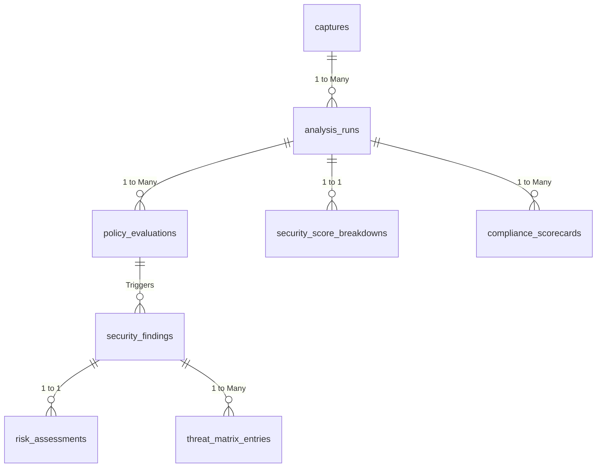

### 57.2 Protocol / IKE / SA ER View

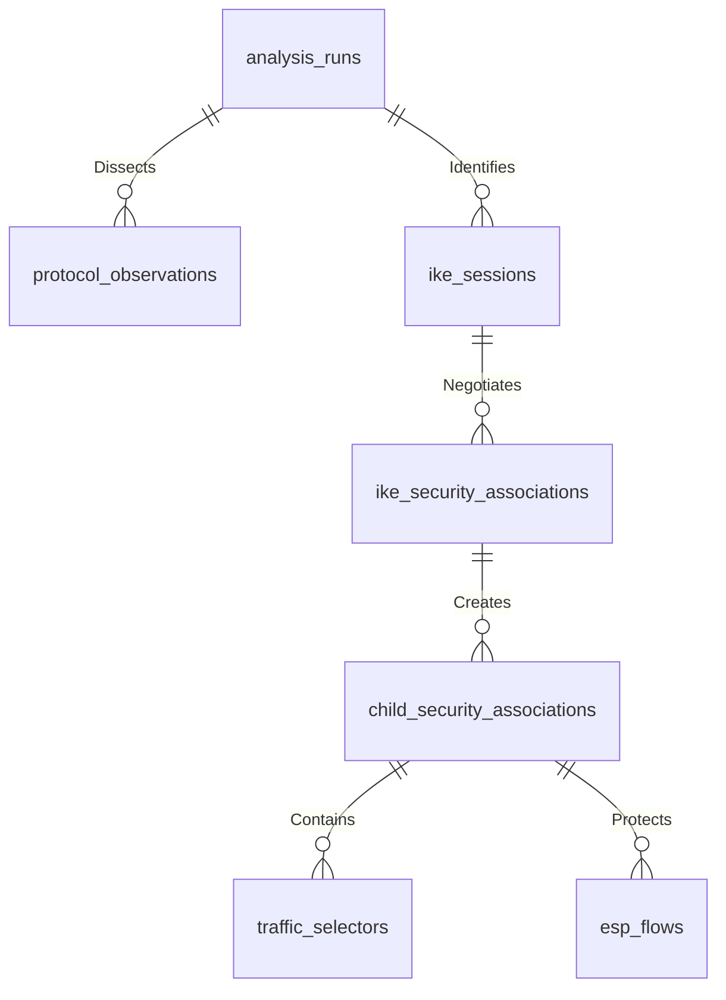

### 57.3 Flow / ML ER View

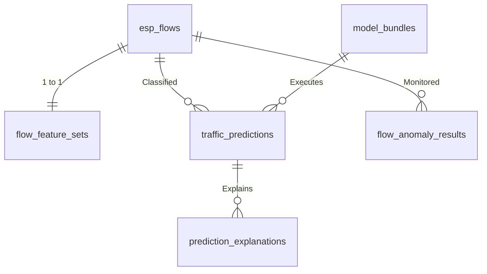

### 57.4 Twin & Remediation ER View

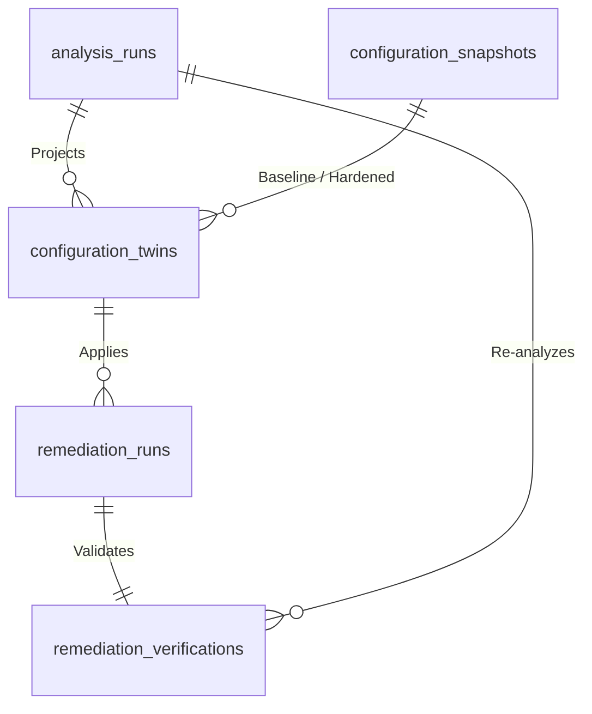

---

## 58. Data Lineage

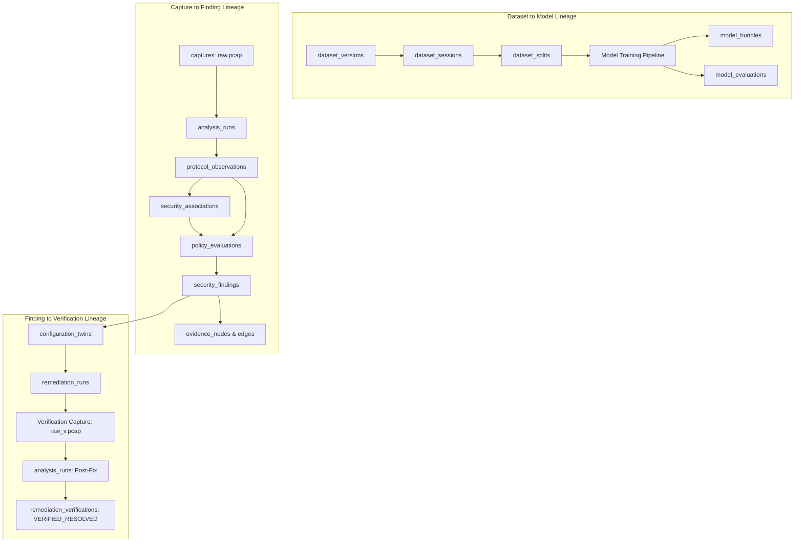

---

## 59. Data Dictionary

The data dictionary for all 38 production entities is cataloged in the authoritative platform metadata repository:

| Table Identifier | Logical Domain | Primary Key Type | Primary Foreign Keys | Expected Cardinality / Run |
| :--- | :--- | :--- | :--- | :--- |
| `captures` | Capture | `UUID` | None | 1 per upload |
| `analysis_runs` | Analysis | `UUID` | `capture_id` | 1 to $N$ per capture |
| `protocol_observations`| Protocol | `UUID` | `analysis_id` | $10^2 - 10^5$ rows |
| `ike_sessions` | Protocol | `UUID` | `analysis_id` | $1 - 10$ rows |
| `ike_security_associations`| Protocol| `UUID`| `session_id` | $1 - 20$ rows |
| `child_security_associations`| Protocol| `UUID`| `ike_sa_id` | $1 - 50$ rows |
| `traffic_selectors` | Protocol | `UUID` | `child_sa_id` | $2 - 100$ rows |
| `esp_flows` | Flow | `UUID` | `analysis_id`, `child_sa_id` | $10 - 10^3$ rows |
| `flow_feature_sets` | Feature | `UUID` | `flow_id` | 1 per flow |
| `traffic_predictions` | ML | `UUID` | `flow_id` | 1 per flow |
| `prediction_explanations`| XAI | `UUID` | `prediction_id` | 1 per prediction |
| `flow_anomaly_results` | Anomaly | `UUID` | `flow_id` | 1 per flow |
| `policy_profiles` | Policy | `UUID` | None | $1 - 10$ static rows |
| `policy_rules` | Policy | `UUID` | `profile_id` | $50 - 500$ static rows |
| `policy_evaluations` | Policy | `UUID` | `analysis_id`, `rule_id` | 1 per rule evaluated |
| `security_findings` | Security | `UUID` | `analysis_id`, `evaluation_id` | $5 - 50$ rows |
| `compliance_scorecards`| Compliance| `UUID`| `analysis_id` | $1 - 5$ rows |
| `security_score_breakdowns`| Scoring | `UUID`| `analysis_id` | 1 per analysis |
| `risk_assessments` | Risk | `UUID` | `finding_id` | 1 per finding |
| `threat_matrix_entries`| Threat | `UUID` | `finding_id` | 1 to 3 per finding |
| `metadata_exposure_assessments`| Metadata| `UUID`| `analysis_id` | 1 per analysis |
| `evidence_nodes` | Evidence | `UUID` | `analysis_id` | $10^2 - 10^4$ rows |
| `evidence_edges` | Evidence | `UUID` | `source_node_id`, `target_node_id`| $10^2 - 10^4$ rows |
| `configuration_snapshots`| Twin | `UUID` | None | $2 - 10$ rows |
| `configuration_twins` | Twin | `UUID` | `analysis_id`, snapshots | 1 to 3 per analysis |
| `remediation_runs` | Remediation | `UUID`| `twin_id` | 1 per action |
| `remediation_verifications`| Remediation| `UUID`| `remediation_run_id`, `post_analysis_id`| 1 per run |
| `report_artifacts` | Reporting | `UUID` | `analysis_id` | $2 - 5$ per analysis |
| `testbed_scenarios` | Testbed | `UUID` | None | $10 - 50$ static rows |
| `testbed_runs` | Testbed | `UUID` | `scenario_id`, `capture_id` | 1 per execution |
| `datasets` | Dataset | `UUID` | None | $1 - 5$ rows |
| `dataset_versions` | Dataset | `UUID` | `dataset_id` | $1 - 10$ rows |
| `dataset_sessions` | Dataset | `UUID` | `dataset_version_id`, `testbed_run_id` | $10^2 - 10^4$ rows |
| `dataset_splits` | Dataset | `UUID` | `dataset_version_id`, `session_id` | 1 per session |
| `model_bundles` | Registry | `UUID` | None | $1 - 10$ rows |
| `feature_schemas` | Registry | `UUID` | None | $1 - 5$ rows |
| `model_evaluations` | Registry | `UUID` | `model_bundle_id`, `dataset_version_id`| 1 per test run |
| `knowledge_documents` | RAG | `UUID` | None | $10 - 50$ rows |
| `standards_embeddings`| RAG | `UUID` | `document_id` | $10^3 - 10^4$ chunks |
| `audit_events` | Audit | `UUID` | None | Append-only ledger |
| `analysis_jobs` | Operations | `UUID` | `analysis_id` | 1 per analysis run |

---

## 60. Key / Relationship Strategy

- **Primary Keys:** Standardized across all tables as native PostgreSQL `UUID` (`v4` generated via `gen_random_uuid()`). Provides collision-free distributed generation and prevents integer enumeration attacks.
- **Foreign Keys:** Strongly typed foreign keys with explicit referential integrity actions:
  - Parent container deletions cascade downward: `captures -> analysis_runs ON DELETE CASCADE`.
  - Auditable resources protect against accidental loss: `remediation_runs -> configuration_twins ON DELETE RESTRICT`.
  - Non-critical link breaks set null: `esp_flows -> child_security_associations ON DELETE SET NULL`.

---

## 61. Constraint Strategy

- **Domain Integrity:** Enforced via strict PostgreSQL `CHECK` constraints on all enumerated states (e.g., `CHECK (status IN (...))`).
- **Cryptographic Consistency:** SHA-256 digests validated via length checks (`CHECK (length(sha256_hash) = 64)`).
- **Physical Bounding:** Byte counts, frame offsets, packet totals, and port ranges strictly bounded ($0 \le \text{port} \le 65535$).
- **Score Ranges:** Security scores constrained strictly between $0.00$ and $100.00$.

---

## 62. JSONB Strategy

JSONB is deployed strictly where schema flexibility is mathematically required, never as a substitute for relational entities:
- **Permitted JSONB Use Cases:**
  - `class_probabilities`: Sparse floating-point vectors across classification classes (`{"Web": 0.85, "VoIP": 0.02}`).
  - `top_features_shap`: Local TreeSHAP attributions with arbitrary feature names.
  - `raw_features_json`: Extracted 24-dimensional statistical feature vectors.
  - `details_json`: Arbitrary contextual parameters for audit events.
- **Prohibited JSONB Use Cases:**
  - Foreign keys or parent-child entity links.
  - Finding severities, timestamps, or compliance outcomes.
  - User authentication identities or permissions.

---

## 63. PostgreSQL Native Data Types

- **IP Addresses:** Stored using native `INET` supporting IPv4, IPv6, and CIDR subnet math (`<<=`, `&&`).
- **Subnets:** Traffic selectors stored using native `CIDR`.
- **High-Volume Numerics:** Packet counters and byte totals stored as `BIGINT` (64-bit integer) to prevent overflow during multi-gigabyte captures.
- **High-Precision Decimals:** Posture scores, probabilities, and timing statistics stored as `NUMERIC(p, s)` to eliminate floating-point rounding errors.
- **Dense Vectors:** Semantic text embeddings stored using native `vector(384)`.

---

## 64. Index Strategy

```sql
-- Core Analysis & Flow Indexes
CREATE INDEX idx_analysis_runs_capture ON analysis_runs(capture_id);
CREATE INDEX idx_analysis_runs_status ON analysis_runs(status);
CREATE INDEX idx_protocol_obs_analysis_frame ON protocol_observations(analysis_id, frame_number);
CREATE INDEX idx_esp_flows_analysis ON esp_flows(analysis_id);
CREATE INDEX idx_esp_flows_spi ON esp_flows(spi);

-- Security Findings & Evaluations
CREATE INDEX idx_policy_evaluations_analysis ON policy_evaluations(analysis_id);
CREATE INDEX idx_security_findings_analysis_severity ON security_findings(analysis_id, severity);
CREATE INDEX idx_security_findings_status ON security_findings(lifecycle_status);

-- Evidence DAG Indexes
CREATE INDEX idx_evidence_nodes_analysis ON evidence_nodes(analysis_id);
CREATE INDEX idx_evidence_edges_source ON evidence_edges(source_node_id);
CREATE INDEX idx_evidence_edges_target ON evidence_edges(target_node_id);

-- Dataset & Machine Learning Indexes
CREATE INDEX idx_dataset_splits_version_assignment ON dataset_splits(dataset_version_id, split_assignment);
CREATE INDEX idx_dataset_sessions_ground_truth ON dataset_sessions(dataset_version_id, ground_truth_label);

-- RAG Vector Search (HNSW index on pgvector)
CREATE INDEX idx_standards_embeddings_hnsw ON standards_embeddings USING hnsw (embedding vector_cosine_ops);
```

---

## 65. Query Patterns

### 65.1 Analysis Overview & Security Posture Retrieval
```sql
SELECT 
    a.id, a.status, a.security_score, a.posture_grade, a.started_at, a.completed_at,
    b.crypto_score, b.key_exchange_score, b.integrity_replay_score, b.sa_lifecycle_score,
    c.sha256_hash, c.original_filename, c.file_size_bytes
FROM analysis_runs a
JOIN security_score_breakdowns b ON a.id = b.analysis_id
JOIN captures c ON a.capture_id = c.id
WHERE a.id = :analysis_id;
```

### 65.2 Stateful SA Graph Reconstruction
```sql
SELECT 
    s.id AS session_id, s.initiator_spi, s.responder_spi, s.ike_version,
    isa.id AS ike_sa_id, isa.encryption_algorithm AS ike_encr, isa.dh_group,
    csa.id AS child_sa_id, csa.inbound_spi, csa.outbound_spi, csa.mode,
    csa.encryption_algorithm AS child_encr, csa.pfs_dh_group
FROM ike_sessions s
LEFT JOIN ike_security_associations isa ON s.id = isa.session_id
LEFT JOIN child_security_associations csa ON isa.id = csa.ike_sa_id
WHERE s.analysis_id = :analysis_id;
```

### 65.3 Semantic RAG Standards Retrieval (Cosine Similarity)
```sql
SELECT 
    d.document_code, d.title, e.section_reference, e.chunk_text,
    1 - (e.embedding <=> :query_embedding) AS similarity_score
FROM standards_embeddings e
JOIN knowledge_documents d ON e.document_id = d.id
WHERE 1 - (e.embedding <=> :query_embedding) > 0.65
ORDER BY e.embedding <=> :query_embedding
LIMIT 5;
```

---

## 66. Transaction Boundaries

1. **Capture Ingestion Boundary:** Single atomic transaction writing the `captures` row and initializing `analysis_runs` in state `QUEUED`.
2. **Analysis Finalization Boundary:** Atomic transaction persisting all `policy_evaluations`, `security_findings`, `security_score_breakdowns`, and updating `analysis_runs.status = 'COMPLETED'`.
3. **Remediation Application Boundary:** Atomic transaction creating `remediation_runs`, saving `backup_snapshot_id`, and recording the authorizing audit event.

---

## 67. Idempotency

- Analysis worker jobs verify current `analysis_runs.status` prior to execution.
- If a failed stage is restarted, existing partial observations and flows for that `analysis_id` are purged within a single transaction prior to re-insertion.
- Feature extraction jobs use PostgreSQL `ON CONFLICT (flow_id) DO UPDATE` to ensure idempotent pipeline re-runs.

---

## 68. Reanalysis / Versioning

- Re-processing an existing capture **never modifies** prior analysis executions.
- A new `analysis_runs` record is instantiated referencing the same `capture_id` with updated `model_bundle_version`, `policy_profile`, or `parser_version`.
- Provides full historical comparative auditing (e.g., comparing scores computed with 2024 vs 2026 NIST profiles).

---

## 69. Data Lifecycle

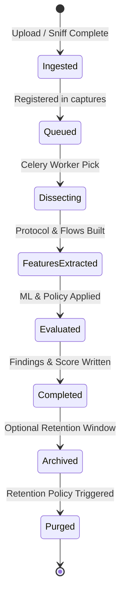

---

## 70. Retention / Deletion

- **Prototype Baseline:** All records and captures retained indefinitely for SIH demonstration.
- **Production Retention Architecture (Configurable Policy):**
  - Raw PCAP Files: Retained 90 days, then purged from storage volume.
  - Relational Metadata & Findings: Retained 365 days in active tables.
  - Audit Ledger: Retained 7 years in immutable archival partitions.
- **De-registration Consistency:** Deleting a capture removes database metadata and executes an un-link on the physical storage file within an asynchronous cleanup task.

---

## 71. Backup / Restore Considerations

- Relational backups (`pg_dump` or Supabase WAL-G) must execute concurrently with object-storage snapshotting to prevent orphaned database references.
- Disaster recovery procedure verifies capture file accessibility using stored `sha256_hash` values upon restoration.

---

## 72. Privacy / Security

- **Network Metadata Protection:** Outer IP addresses and SPIs are accessible only to authenticated operators.
- **No Packet Payload Extraction:** Parsers extract strictly protocol headers (UDP 500/4500, IP 50). Application-layer data is neither extracted nor persisted.
- **Non-Root Database Execution:** The PostgreSQL daemon executes under unprivileged `postgres:postgres` system accounts with local socket restrictions.

---

## 73. Supabase Compatibility

The database schema is 100% compatible with Supabase PostgreSQL:
- Uses standard PostgreSQL DDL, native data types, and ANSI SQL.
- Leverages the native Supabase `pgvector` extension.
- Prepared for Supabase Auth migration via `user_id UUID REFERENCES auth.users(id)` compatibility.
- Compatible with Supabase Storage S3-compliant REST interfaces.

---

## 74. Future RLS Strategy

Row Level Security (RLS) policies are designed for seamless activation when transitioning to multi-tenant cloud environments:

```sql
-- Future Supabase Row Level Security Architecture (PROPOSED)
ALTER TABLE captures ENABLE ROW LEVEL SECURITY;
ALTER TABLE analysis_runs ENABLE ROW LEVEL SECURITY;
ALTER TABLE security_findings ENABLE ROW LEVEL SECURITY;

-- Workspace Isolation Policy Template
-- CREATE POLICY workspace_isolation_captures ON captures
--     FOR ALL USING (workspace_id = (current_setting('app.current_workspace_id')::UUID));
```

---

## 75. Migration Strategy

- Schema migrations are managed strictly through **Alembic** (versioned Python scripts).
- Direct manual DDL edits against operational environments are strictly prohibited.
- Migration scripts maintain reversible `upgrade()` and `downgrade()` routines.
- Migration execution is integrated into backend service startup scripts.

---

## 76. Schema Compatibility

- Schema changes follow the expand-contract pattern: new columns are introduced as nullable or with defaults before application code is updated.
- Deprecated columns are dropped only after all running worker containers transition to the updated codebase.

---

## 77. Performance / Scaling

- **Read Scalability:** Analytical dashboard views query lightweight summary tables (`security_score_breakdowns`, `compliance_scorecards`) rather than recalculating findings from raw packets on every page load.
- **Write Optimization:** Packet dissector workers batch insert observations in chunks of 500 rows using `asyncpg.copy_records_to_table`.
- **Query Caching:** Redis caches completed analysis summary objects for 5 minutes, mitigating redundant database roundtrips.

---

## 78. Partitioning / Archival Future Strategy

- Tables designed for future declarative range partitioning by date:
  - `protocol_observations`: Partitioned by month on `packet_time`.
  - `audit_events`: Partitioned by year on `created_at`.
- Partitioning is flagged for implementation when database size exceeds 50 GB (`Requires benchmarking against representative workloads`).

---

## 79. Database Testing Strategy

- **Automated Migration Testing:** CI executes `alembic upgrade head` followed by `alembic downgrade base` on fresh PostgreSQL instances.
- **Constraint Verification:** Pytest suite verifies that invalid foreign keys, malformed SHA-256 strings, and out-of-range security scores trigger immediate database exceptions.
- **Idempotency Testing:** Re-running an analysis pipeline against the same capture verifies that duplicate finding records are not created.

---

## 80. PS Requirement $\rightarrow$ Data Model Matrix

| PS 26160 Requirement Clause | Target Data Entity | Persisted Columns / Representation | Responsible Subsystem |
| :--- | :--- | :--- | :--- |
| **Tunnel / Transport Mode Lab** | `testbed_scenarios`, `child_sa` | `mode VARCHAR(16) CHECK (mode IN ('TUNNEL', 'TRANSPORT'))` | Testbed Orchestrator |
| **Crypto Variation (AES, GCM, CBC)**| `ike_sa`, `child_sa` | `encryption_algorithm VARCHAR(64)` | Protocol Forensics Engine |
| **Key Exchange & DH Groups** | `ike_sa`, `child_sa` | `dh_group INTEGER`, `pfs_dh_group INTEGER` | Protocol Forensics Engine |
| **PFS Rekey Verification** | `child_security_associations`| `pfs_dh_group INTEGER (NULL if OFF)` | Protocol Forensics Engine |
| **Application Traffic Ingestion** | `captures`, `esp_flows` | `capture_source`, `packet_count`, `byte_count` | Capture & Ingestion Engine |
| **Encrypted Traffic ML Inference** | `traffic_predictions` | `predicted_class`, `calibrated_prob`, `predictive_entropy` | Encrypted-Traffic ML Engine |
| **NIST SP 800-77 Compliance** | `policy_evaluations`, `findings`| `rule_id`, `result`, `deduction_applied`, `standard_ref` | Security Policy Engine |
| **0-100 Security Posture Score** | `analysis_runs`, `score_breakdown`| `security_score NUMERIC(5,2)`, dimension sub-scores | Security Scoring Engine |
| **Metadata Distinguishability** | `metadata_exposure_assessments`| `fingerprintability_index NUMERIC(5,2)`, `length_entropy`| Metadata Engine |
| **Forensic Evidence DAG** | `evidence_nodes`, `evidence_edges`| `node_type`, `frame_offset`, `relationship_type` | Evidence Graph Engine |
| **Configuration Twin Hardening** | `configuration_twins` | `diff_text`, `projected_score`, `projected_score_delta` | Configuration Twin Engine |
| **Closed-Loop Lab Verification** | `remediation_verifications` | `verification_result`, `baseline_score`, `verified_score` | Remediation Lab Agent |
| **Executive & Technical PDF Reports**| `report_artifacts` | `storage_path`, `sha256_hash`, `report_type` | Report Synthesizer |

---

## 81. Data Architecture Decision Log

| Decision ID | Architectural Choice | Justification | Alternatives Considered |
| :--- | :--- | :--- | :--- |
| `DAD-01` | PostgreSQL 15 as Primary Store | Robust relational integrity, JSONB support, and native `pgvector`. | MySQL, MongoDB, DynamoDB |
| `DAD-02` | `pgvector` for Standards RAG | Co-locates vector embeddings within primary database; eliminates vector DB sprawl. | Qdrant, Pinecone, FAISS |
| `DAD-03` | Separate Object Storage for PCAPs| Storing multi-megabyte PCAPs in relational tables bloats DB backups and degrades I/O. | Postgres `BYTEA` columns |
| `DAD-04` | UUIDv4 Primary Keys | Enables distributed ID generation and seamless migration to Supabase. | Sequential Auto-increment BigInt |
| `DAD-05` | Native `INET` for IP Addresses | Native subnet searching, address validation, and compact 7-to-19 byte storage. | Plain `VARCHAR(45)` text |
| `DAD-06` | Session-Level Dataset Splitting | Eliminates data leakage between train/test folds in temporal network traffic. | Random packet-level splits |
| `DAD-07` | Relational DAG over Graph DB | Relational node/edge tables in PostgreSQL avoid unnecessary Neo4j operational overhead. | Neo4j, Amazon Neptune |

---

## 82. Risks & Mitigations

| Risk ID | Architectural Risk | Severity | Likelihood | Technical Mitigation |
| :--- | :--- | :--- | :--- | :--- |
| **DR-01** | High packet volumes flood `protocol_observations` table | High | High | Extract only outer headers and IKE transforms; batch insert with `copy_records`. |
| **DR-02** | Database becomes desynchronized from object storage files | Medium | Medium | Automated orphan cleaner script; atomic DB registration upon upload. |
| **DR-03** | Incompatible feature schemas between pipeline and ML models | High | Low | Formally versioned `feature_schemas` referenced by foreign keys. |
| **DR-04** | Accidental persistence of cryptographic private keys | Critical | Low | Strict code review and Pydantic input sanitization; no key columns in schemas. |
| **DR-05** | Complex recursive queries stall evidence DAG traversal | Medium | Medium | Bidirectional indexes on `evidence_edges(source_node_id, target_node_id)`. |

---

## 83. Open Decisions / TBD Register

The following architectural parameters are reserved for empirical validation during core implementation:

1. `TBD-DATA-01`: Final numerical weights assigned to the 4 security score dimensions (`Requires operational validation`).
2. `TBD-DATA-02`: Quantitative predictive entropy threshold $\tau_{\text{entropy}}$ for OOD uncertainty rejection (`Requires empirical validation`).
3. `TBD-DATA-03`: Precise maximum sequence length $N \in \{32, 64, 128\}$ for flow sequence tensors.
4. `TBD-DATA-04`: Exact table partitioning volume threshold (candidate: 50 GB) (`Requires benchmarking against representative workloads`).
5. `TBD-DATA-05`: Production data retention schedule for non-evaluator deployments.

---

## 84. Glossary

- **Child SA:** Security Association established to protect ESP/AH data traffic.
- **DAG:** Directed Acyclic Graph (acyclic network used to map forensic provenance).
- **ESP:** Encapsulating Security Payload (IP protocol 50).
- **HNSW:** Hierarchical Navigable Small World (graph-based vector index).
- **IKEv2:** Internet Key Exchange Protocol Version 2 (UDP 500 / 4500).
- **NAT-T:** Network Address Translation Traversal (encapsulating ESP inside UDP 4500).
- **OOD:** Out-of-Distribution (traffic patterns differing from training distributions).
- **PFS:** Perfect Forward Secrecy (Diffie-Hellman exchange during Child SA rekey).
- **pgvector:** Open-source PostgreSQL extension for dense vector similarity search.
- **SA:** Security Association (agreed set of cryptographic keys and algorithms).
- **SPI:** Security Parameter Index (32-bit identifier in outer ESP/AH headers).
- **TreeSHAP:** Algorithm computing exact Shapley feature attributions for tree models.

---

## 85. References

1. **NIST Special Publication 800-77 Revision 1:** *Guide to IPsec VPNs*, National Institute of Standards and Technology.
2. **NIST Special Publication 800-57 Part 1 Rev. 5:** *Recommendation for Key Management*, NIST.
3. **RFC 7296:** *Internet Key Exchange Protocol Version 2 (IKEv2)*, Internet Engineering Task Force.
4. **RFC 8221:** *Cryptographic Algorithm Implementation Requirements for ESP and AH*, IETF.
5. **RFC 4301:** *Security Architecture for the Internet Protocol*, IETF.
6. **RFC 4303:** *IP Encapsulating Security Payload (ESP)*, IETF.
7. **PostgreSQL 15 Documentation:** *PostgreSQL Global Development Group*, postgresql.org.
8. **pgvector Documentation:** *Open-Source Vector Similarity Search for Postgres*, github.com/pgvector/pgvector.
9. **Smart India Hackathon 2026 Problem Statement 160:** *AI-Powered IPsec VPN Protocol Analyzer and Security Assessment Framework*, National Technical Research Organisation (NTRO).
