# TunnelTrace AI — Deployment, DevOps & Operations Specification

**Official Problem Statement ID:** 26160 (PS 160)  
**Official Problem Statement Title:** AI-Powered IPsec VPN Protocol Analyzer and Security Assessment Framework  
**Sponsoring Organization:** National Technical Research Organisation (NTRO)  
**Theme:** Blockchain & Cybersecurity  
**Document Type:** Industry-Grade Deployment, DevOps & Operations Architecture Document  
**System Name:** TunnelTrace AI   
**Current Release Version:** `v0.1.0-alpha` (SIH 2026 Engineering Prototype)  
**Document Status:** Approved Technical Baseline  

---

## 1. Document Control

| Property | Value |
| :--- | :--- |
| **System Title** | TunnelTrace AI (AI-Powered IPsec VPN Protocol Analyzer and Security Assessment Framework) |
| **Problem Statement Reference** | SIH 2026 / PS 160 / NTRO |
| **Document Classification** | Engineering Specification / Technical Operations Manual |
| **Security Caveat** | Contains infrastructure design, capability boundaries, and operational runbooks. Distribution restricted to authorized development, operations, and evaluation personnel. |
| **Document Owner** | Infrastructure Architecture & Platform Engineering Lead |
| **Technical Reviewers** | Systems Architect, Network Protocol Lead, MLOps Engineer, Security Operations Lead |
| **Current Target Baseline** | Local-First Docker Compose (`v2.x`), Linux Network Namespaces (`iproute2`), strongSwan (`5.9+`), PostgreSQL (`15+` with `pgvector`) |
| **Target SIH Environment** | Air-gapped / Local-First Multi-Container Demo Testbed with Optional Hosted Staging Mirror |

---

## 2. Revision History

| Revision | Date | Author / Engineering Role | Description of Changes |
| :--- | :--- | :--- | :--- |
| `0.1.0-draft` | 2026-09-22 | Platform Engineering Lead | Initial draft defining dual execution classes, local-first Docker topology, and privilege boundaries. |
| `0.2.0-review` | 2026-09-22 | DevOps & Security Architect | Added zero-hallucination constraints, non-root container specs, and separated privileged lab operations. |
| `1.0.0-final` | 2026-09-22 | Chief Infrastructure Architect | Finalized complete 97-section specification covering local-first deployment, CI/CD, ML lifecycle, runbooks, and cloud roadmap. |

---

## 3. Purpose

This document provides the definitive operational blueprint for packaging, deploying, configuring, monitoring, releasing, securing, and maintaining **TunnelTrace AI**. It bridges the gap between software design ([`PRD.md`](file:///c:/SHARAN%20PROJECTS/TunnelTrace%20AI/docs/PRD.md)), technical implementation ([`TRD.md`](file:///c:/SHARAN%20PROJECTS/TunnelTrace%20AI/docs/TRD.md)), system workflow ([`WORKFLOW.md`](file:///c:/SHARAN%20PROJECTS/TunnelTrace%20AI/docs/WORKFLOW.md)), and user experience ([`UI_UX_DESIGN_SYSTEM.md`](file:///c:/SHARAN%20PROJECTS/TunnelTrace%20AI/docs/UI_UX_DESIGN_SYSTEM.md)).

Its primary objectives are:
1. Define a 100% reproducible **Local-First Development & SIH Demo Environment** requiring zero external cloud dependencies.
2. Establish strict architectural and privilege separation between standard web application micro-services and privileged Linux networking/kernel operations.
3. Formulate rigorous MLOps and PolicyOps pipelines to prevent unverified model or rule drift.
4. Provide structured incident response and operational runbooks to ensure total resilience during live evaluation and future production operations.

---

## 4. Scope

The operational controls, infrastructure patterns, and deployment topologies in this document govern:
- **Application Services:** Next.js frontend, FastAPI REST/WebSocket backend, Celery asynchronous workers, PostgreSQL with `pgvector`, and Redis.
- **Protocol & ML Runtimes:** TShark/PyShark dissection pipelines, scikit-learn/XGBoost/PyTorch inference runners, and SHAP explainability engines.
- **Privileged Testbed & Capture Agents:** Dedicated Linux network namespaces, `veth` pairs, strongSwan 5.9+ VPN daemons, `tc/netem` traffic shapers, and `tcpdump`/`libpcap` packet interceptors.
- **Target Deployment Environments:** Local Engineering Workstations, Dedicated Linux Integration Testbeds, Air-Gapped SIH Presentation Environments, and Future Staging/Production Hybrid Cloud Deployments.

Out of scope for the current prototype:
- Bare-metal enterprise hardware appliance flashing.
- Carrier-grade multi-tenant Kubernetes cluster orchestration (marked as `FUTURE / PRODUCT HARDENING`).

---

## 5. Relationship to PRD / TRD / Architecture

TunnelTrace AI operational architecture directly implements the system requirements established across the engineering baseline:
- **Traceability to PRD:** Implements execution requirements for `LAB-` (Controlled Testbed), `CAP-` (Packet Ingestion), `PROTO-` (Protocol Forensics), `ML-` (Traffic Classification), `SEC-` (Policy Engine), and `REM-` (Remediation Execution).
- **Traceability to TRD:** Implements the Subsystem 1 through Subsystem 12 physical runtime requirements, specifically respecting the non-decrypting ESP boundary, deterministic score calculation, and temperature-calibrated inference.
- **Traceability to WORKFLOW:** Implements the exact state machine triggers, background task queues, and failure propagation paths defined in Level 1 and Level 2 data flow specifications.

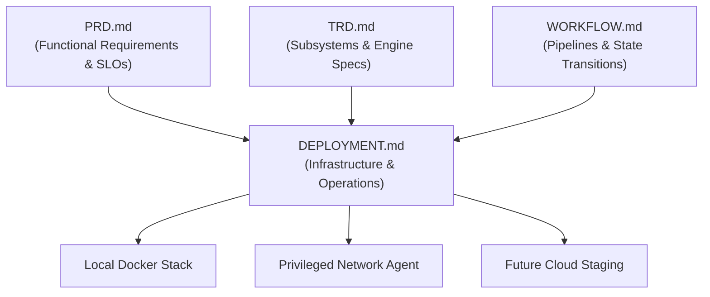

---

## 6. Deployment Principles

The deployment philosophy of TunnelTrace AI is anchored upon six uncompromising core tenets:

1. **Local-First Supremacy:** The entire core analysis pipeline—ingestion, parsing, feature extraction, ML inference, deterministic policy audit, scoring, evidence generation, and report synthesis—must execute locally without requiring an active internet connection.
2. **Absolute Privilege Separation:** No standard web application component (frontend, API, database, worker) shall execute with administrative (`root`) or elevated network (`CAP_NET_ADMIN`/`CAP_NET_RAW`) privileges. Elevated privileges are strictly isolated to a dedicated, bounded Privileged Network Agent.
3. **Immutability & Artifact Versioning:** Machine learning models, security policy bundles, database schemas, and report templates are immutable, versioned artifacts with cryptographic checksums recorded in analysis output provenance.
4. **Zero Training Data in Production:** Bulky training datasets (including the 28 GB ISCXVPN2016 reference corpus and multi-gigabyte synthetic lab captures) are strictly segregated to offline training infrastructure and must never be baked into production container images.
5. **Deterministic Policy Priority:** The cryptographic and architectural assessment engine relies entirely on deterministic, versioned YAML Policy-as-Code. Machine learning is bounded to encrypted traffic flow classification. LLM/RAG capabilities are strictly advisory and downstream.
6. **Defense-in-Depth for Untrusted PCAP:** All ingested PCAP/PCAPNG files are treated as potentially adversarial inputs, subjected to strict file validation, sandboxed parsing, process timeouts, and memory-capped execution boundaries.

---

## 7. Current vs Future Deployment Scope

| Dimension | Current Prototype Scope (SIH 2026) | Future / Product Hardening Scope |
| :--- | :--- | :--- |
| **Primary Topology** | Single-Node Docker Compose + Privileged Linux Host/VM | Hybrid Cloud or Multi-Node Private Enterprise Cluster |
| **Frontend Serving** | Containerized Next.js Node.js Server / Local PWA | Vercel Edge CDN or High-Availability Ingress Proxy |
| **Backend API** | FastAPI ASGI container (Uvicorn single/multi-worker) | Auto-scaling FastAPI on Render / Enterprise Bare-Metal |
| **Database & Vector** | Local PostgreSQL 15 container with `pgvector` extension | Managed Supabase PostgreSQL / High-Availability Patroni |
| **Object Storage** | Local filesystem volume abstraction (POSIX directory) | Supabase Storage / S3-compatible Ceph / MinIO Cluster |
| **Task Queue** | Local Redis 7 container + Celery concurrency workers | Managed Redis Cluster / Multi-broker Celery / RabbitMQ |
| **Packet Capture** | Host-bound `tcpdump` / `libpcap` managed by local script | Distributed remote capture probe daemons (`eBPF`/`AF_PACKET`) |
| **IPsec Testbed** | Local Linux network namespaces + strongSwan 5.9+ | Dynamic virtualized multi-site SDN testbed or HW appliances |
| **Secrets Engine** | Local `.env` files (git-ignored, strictly typed) | HashiCorp Vault / AWS Secrets Manager / Cloud KMS |
| **AI Analyst** | Local Ollama/vLLM or External LLM API (conditional fallback) | Fully air-gapped dedicated GPU LLM serving node |

---

## 8. Technical Stack

```
[FRONTEND TIER]
├── Runtime: Node.js 20 LTS (Alpine base)
├── Framework: Next.js 14 (App Router, TypeScript, Strict Mode)
├── Styling: Vanilla CSS + Tailwind CSS (Custom Design System, 0px radius)
├── Visualization: Apache ECharts 5.x, React Flow 11.x
└── Client Shell: Progressive Web Application (PWA), Service Worker, Web App Manifest

[APPLICATION & API TIER]
├── Runtime: Python 3.11 (Debian Slim base)
├── Framework: FastAPI 0.110+ (ASGI / Starlette, Uvicorn)
├── Asynchronous Engine: asyncio, WebSockets
├── Validation: Pydantic v2 (Strict Schema Enforcement)
└── Subprocess Wrappers: subprocess32, psutil (Resource-bounded execution)

[DATA & CACHING TIER]
├── Relational Database: PostgreSQL 15
├── Vector Database: pgvector extension (0.6+)
├── Task Broker & Cache: Redis 7 (In-Memory, Append-Only Persistence)
└── Storage Abstraction: Standard POSIX Local File Volume / S3 Adapter Interface

[ANALYTICAL & ML RUNTIME]
├── Protocol Dissection: TShark (Wireshark 4.x), PyShark 0.6+, Scapy (Packet crafting only)
├── Tabular Classification: XGBoost 2.0+ (Calibrated Probabilities)
├── Spatial Classification: PyTorch 2.2+ (1D-CNN, CPU-optimized inference)
├── Tabular Baseline: scikit-learn 1.4+ (Random Forest, Isolation Forest)
└── Explainability: SHAP 0.44+ (TreeExplainer & KernelExplainer)

[PRIVILEGED TESTBED & NETWORK TIER]
├── OS Platform: Dedicated Linux Kernel 5.15+ / 6.x (Ubuntu 22.04 LTS / Debian 12)
├── VPN Daemon: strongSwan 5.9.8+ (charon, vici interface, swanctl)
├── Kernel Subsystems: XFRM (IPsec State & Policy), Linux Network Namespaces (netns)
├── Traffic Conditioning: Linux tc (Traffic Control), netem (Network Emulator)
└── Interception: tcpdump 4.99+, libpcap 1.10+
```

---

## 9. Runtime Component Inventory

1. **`tunneltrace-frontend`**: Next.js 14 web application rendering the SOC Dashboard, SA Graph, Evidence Visualizer, and Configuration Twin.
2. **`tunneltrace-api`**: FastAPI core application serving REST endpoints, orchestrating WebSocket streams, verifying JWT tokens, and handling synchronous requests.
3. **`tunneltrace-worker`**: Celery worker instance processing compute-heavy asynchronous tasks (TShark dissection, feature engineering, ML ensemble inference, and report compilation).
4. **`tunneltrace-redis`**: Key-value in-memory broker handling Celery task queues, state caches, and WebSocket pub/sub fanouts.
5. **`tunneltrace-postgres`**: PostgreSQL 15 relational instance storing captures, SA tables, security findings, audit trails, and vector embeddings (`pgvector`).
6. **`tunneltrace-storage`**: Mounted volume representing persistent artifact storage (`/var/lib/tunneltrace/storage`) for raw PCAPs, interim flow tables, and generated PDF/HTML reports.
7. **`tunneltrace-netagent`** *(Execution Class B)*: Privileged daemon/script executing on the Linux host with raw socket and namespace capabilities to control strongSwan and `tcpdump`.

---

## 10. Execution-Class Separation

To guarantee operational security and platform portability, TunnelTrace AI enforces a binary execution classification:

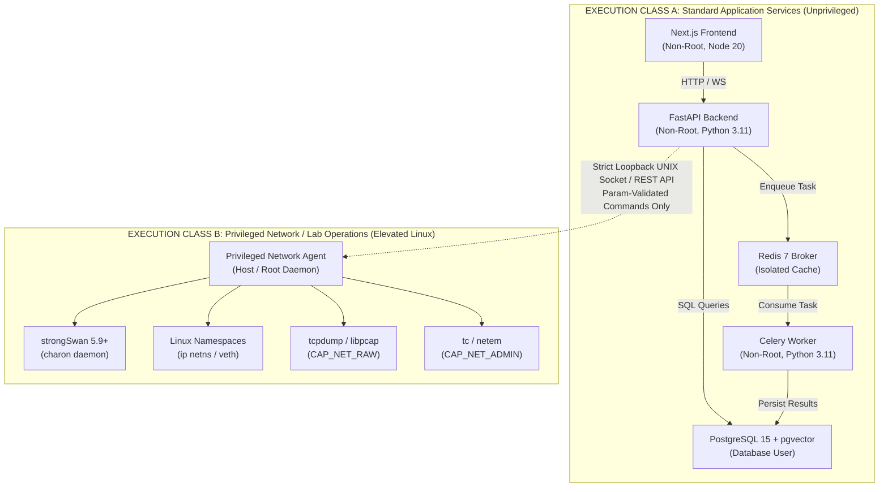

### Execution Class A — Standard Application Services
- **Environment:** Docker containers running under unprivileged service accounts (`UID 10001:10001`).
- **Characteristics:** Completely isolated from host kernel network stacks; no access to raw host sockets; horizontal scalability; compatible with standard container runtimes and ordinary cloud platforms.

### Execution Class B — Privileged Network / Lab Operations
- **Environment:** Direct Linux host execution, or specifically privileged system containers (`--cap-add=NET_ADMIN`, `--cap-add=NET_RAW`, `--net=host`).
- **Characteristics:** Creates and deletes network namespaces (`ip netns`), manipulates XFRM kernel states, binds promiscuous packet capture interfaces, controls VPN daemons, and injects network impairments.
- **Strict Limitation:** MUST NOT be exposed directly to public ingress or web clients. Only controllable via bounded, parameterized internal IPC/APIs.

---

## 11. Trust / Privilege Boundaries

```
[UNTRUSTED ZONE]
  │  External Users / Web Browsers / Untrusted Uploaded PCAP Files
  ▼
[BOUNDARY 1: Application Ingress Filter]
  │  Reverse Proxy / Input Sanitizer / File Magic Byte Verification / Size Cap
  ▼
[ZONE 1: Application Domain (Unprivileged Class A)]
  │  Next.js Frontend (UID 10001)
  │  FastAPI Application (UID 10001)
  │  Celery Worker (UID 10001)
  │  PostgreSQL Database (UID 999)
  │  Redis Cache (UID 999)
  ▼
[BOUNDARY 2: IPC Parameterized Gateway (Strict Loopback / mTLS)]
  │  JSON Schema Validation / Allowed Action Whitelist / No Raw Shell Execution
  ▼
[ZONE 2: Privileged System Domain (Class B)]
  │  Privileged Network Agent (Root / CAP_NET_ADMIN, CAP_NET_RAW)
  │  strongSwan VPN Engine (charon)
  │  Linux Kernel XFRM / Netfilter Subsystems
```

---

## 12. Logical Runtime Topology

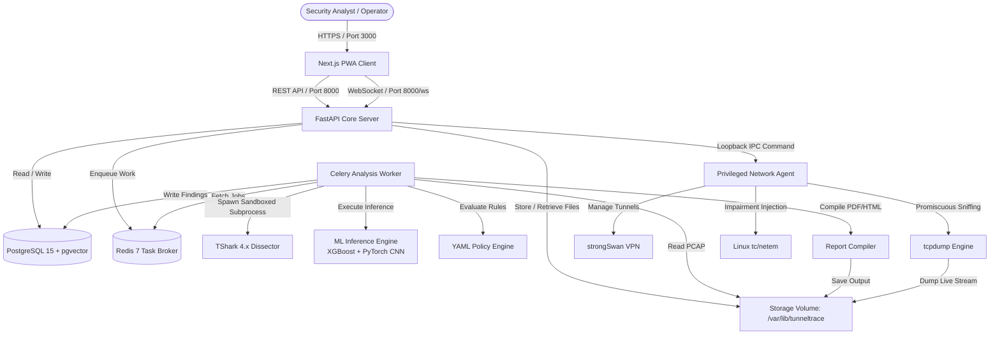

---

## 13. Local Development Environment

For local software engineering (features, UI, protocol parser logic, ML training), developers operate a Docker Compose stack for Class A services.

### Hardware & Software Prerequisites
- **Operating System:** Linux (Ubuntu 22.04 LTS recommended), macOS (Apple Silicon / Intel), or Windows 11 with WSL2 (Ubuntu).
- **Core Tooling:** Docker Engine `24.0+`, Docker Compose `v2.20+`, Node.js `20 LTS`, Python `3.11.x`, Git `2.40+`.
- **System Resources:**
  - Minimum: 4 CPU Cores, 8 GB RAM, 20 GB free disk space.
  - Recommended: 8 CPU Cores, 16 GB RAM, 50 GB SSD disk space.

### Environment Setup Instructions
```bash
# 1. Clone repository
git clone https://github.com/tunneltrace/tunneltrace-ai.git
cd tunneltrace-ai

# 2. Copy and configure local environment variables
cp .env.example .env

# 3. Pull base images and build local containers
docker compose -f docker-compose.yml build

# 4. Initialize Database Schema and apply initial migrations
docker compose -f docker-compose.yml up -d postgres redis
docker compose -f docker-compose.yml run --rm api alembic upgrade head

# 5. Boot complete Class A stack
docker compose -f docker-compose.yml up -d

# 6. Verify health endpoints
curl -f http://localhost:8000/health
```

---

## 14. Docker / Compose Strategy

The Docker Compose configuration orchestrates the unprivileged services while provisioning isolated internal bridge networking.

### Reference Local `docker-compose.yml`
```yaml
version: '3.8'

networks:
  tunneltrace-internal:
    driver: bridge
    internal: false

volumes:
  postgres-data:
  redis-data:
  storage-data:

services:
  postgres:
    image: pgvector/pgvector:pg15
    container_name: tunneltrace-postgres
    restart: unless-stopped
    environment:
      POSTGRES_DB: ${POSTGRES_DB:-tunneltrace_db}
      POSTGRES_USER: ${POSTGRES_USER:-tt_admin}
      POSTGRES_PASSWORD: ${POSTGRES_PASSWORD:-tt_dev_secret_change_me}
    volumes:
      - postgres-data:/var/lib/postgresql/data
    networks:
      - tunneltrace-internal
    ports:
      - "127.0.0.1:5432:5432"
    healthcheck:
      test: ["CMD-SHELL", "pg_isready -U ${POSTGRES_USER:-tt_admin} -d ${POSTGRES_DB:-tunneltrace_db}"]
      interval: 10s
      timeout: 5s
      retries: 5

  redis:
    image: redis:7-alpine
    container_name: tunneltrace-redis
    restart: unless-stopped
    command: ["redis-server", "--appendonly", "yes", "--requirepass", "${REDIS_PASSWORD:-tt_redis_secret}"]
    volumes:
      - redis-data:/data
    networks:
      - tunneltrace-internal
    ports:
      - "127.0.0.1:6379:6379"
    healthcheck:
      test: ["CMD", "redis-cli", "-a", "${REDIS_PASSWORD:-tt_redis_secret}", "ping"]
      interval: 10s
      timeout: 5s
      retries: 5

  api:
    build:
      context: ./backend
      dockerfile: Dockerfile.api
    container_name: tunneltrace-api
    restart: unless-stopped
    depends_on:
      postgres:
        condition: service_healthy
      redis:
        condition: service_healthy
    environment:
      ENVIRONMENT: development
      DATABASE_URL: postgresql+asyncpg://${POSTGRES_USER:-tt_admin}:${POSTGRES_PASSWORD:-tt_dev_secret_change_me}@postgres:5432/${POSTGRES_DB:-tunneltrace_db}
      REDIS_URL: redis://:${REDIS_PASSWORD:-tt_redis_secret}@redis:6379/0
      STORAGE_PATH: /var/lib/tunneltrace/storage
      MODEL_DIR: /app/models/active
      POLICY_DIR: /app/policies/active
    volumes:
      - storage-data:/var/lib/tunneltrace/storage
      - ./models/active:/app/models/active:ro
      - ./policies/active:/app/policies/active:ro
    networks:
      - tunneltrace-internal
    ports:
      - "127.0.0.1:8000:8000"
    healthcheck:
      test: ["CMD", "curl", "-f", "http://localhost:8000/health/readiness"]
      interval: 15s
      timeout: 5s
      retries: 3

  worker:
    build:
      context: ./backend
      dockerfile: Dockerfile.worker
    container_name: tunneltrace-worker
    restart: unless-stopped
    depends_on:
      api:
        condition: service_healthy
    environment:
      ENVIRONMENT: development
      DATABASE_URL: postgresql+asyncpg://${POSTGRES_USER:-tt_admin}:${POSTGRES_PASSWORD:-tt_dev_secret_change_me}@postgres:5432/${POSTGRES_DB:-tunneltrace_db}
      REDIS_URL: redis://:${REDIS_PASSWORD:-tt_redis_secret}@redis:6379/0
      STORAGE_PATH: /var/lib/tunneltrace/storage
      MODEL_DIR: /app/models/active
      POLICY_DIR: /app/policies/active
    volumes:
      - storage-data:/var/lib/tunneltrace/storage
      - ./models/active:/app/models/active:ro
      - ./policies/active:/app/policies/active:ro
    networks:
      - tunneltrace-internal

  frontend:
    build:
      context: ./frontend
      dockerfile: Dockerfile.frontend
    container_name: tunneltrace-frontend
    restart: unless-stopped
    depends_on:
      - api
    environment:
      NEXT_PUBLIC_API_URL: http://localhost:8000
      NEXT_PUBLIC_WS_URL: ws://localhost:8000/ws
    networks:
      - tunneltrace-internal
    ports:
      - "127.0.0.1:3000:3000"
```

---

## 15. Privileged Linux/Testbed Runtime

The IPsec live testbed (Execution Class B) requires direct Linux kernel interactions and must run directly on the host or inside an isolated Linux VM.

### Testbed Architecture (Linux Namespaces)
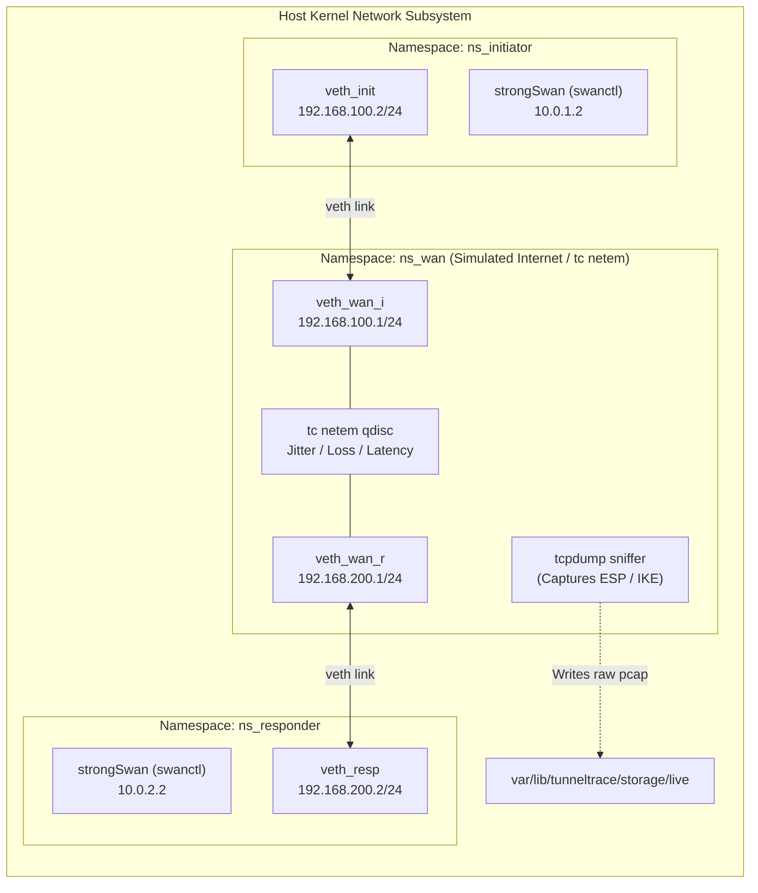

### Windows/macOS Developer Notice
Windows developers using WSL2 or macOS developers using Docker Desktop cannot reliably execute raw XFRM IPsec kernel module operations inside default WSL2 lightweight containers.
- **Rule:** Windows/macOS engineers must execute Class A services locally and either:
  1. Mount pre-captured testbed PCAP files into `/var/lib/tunneltrace/storage/captures/`, or
  2. Point the API to an accessible Linux VM or dedicated secondary test machine running the Privileged Network Agent.
- **Validation State:** `Requires environment validation.`

---

## 16. SIH Demo Environment

To ensure zero risk of internet failure or latency during live judging at Smart India Hackathon 2026, the demo environment is architected as an autonomous, self-contained, air-gapped system.

### Configuration Characteristics
- Hosted entirely on an Ubuntu 22.04 LTS workstation or high-performance laptop.
- All Docker container images pre-built, tagged, and loaded into local Docker daemon cache.
- Local PostgreSQL instance populated with pre-loaded standards knowledge base (NIST SP 800-77, RFC 8221, RFC 7296 embeddings).
- Active models (`v1.0.0-baseline` XGBoost and 1D-CNN) pre-compiled and verified.
- Privileged testbed scripts verified and calibrated with 5 pre-staged misconfigured test profiles.

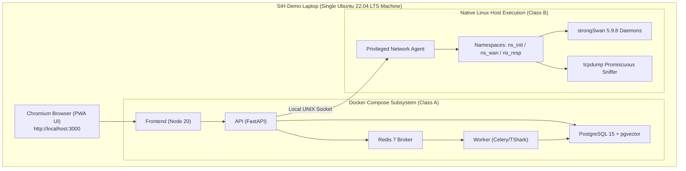

---

## 17. Public Prototype Deployment

For remote jury evaluation, mentors, or public evaluation links, an optional public read-only demonstration instance may be deployed.
- **Architectural Boundary:** The public instance hosts **Execution Class A only**.
- **Security Constraint:** Public web users **cannot** initiate live promiscuous packet captures or execute strongSwan lab remediation against arbitrary hosts.
- **Interactive Capabilities:** Public users can upload offline PCAP files (capped at 50 MB), run full analysis pipelines, explore SA graphs, view ML flow classification, review compliance findings, and download audit reports.

---

## 18. Future Hosted Deployment

*(Label: FUTURE / PRODUCT HARDENING — OPTIONAL / NOT FROZEN)*

For post-hackathon commercialization and staging operations, the platform maps to modern managed cloud providers:
- **Frontend:** Next.js deployed on Vercel Edge Network.
- **Backend API & Workers:** FastAPI and Celery worker instances hosted on Render (Persistent Linux Compute instances with attached SSD storage).
- **Database & Auth:** Managed Supabase PostgreSQL with `pgvector` extension and Supabase Auth JWT tokens.
- **Artifact Storage:** Supabase Storage (S3-compatible bucket) with pre-signed upload URLs.
- **Important Note:** As detailed in Section 10, Execution Class B cannot run on Vercel or standard unprivileged serverless containers.

---

## 19. Future Hybrid Deployment

*(Label: FUTURE / PRODUCT HARDENING)*

The Hybrid Architecture accommodates enterprises requiring central management with on-premise packet sniffing:

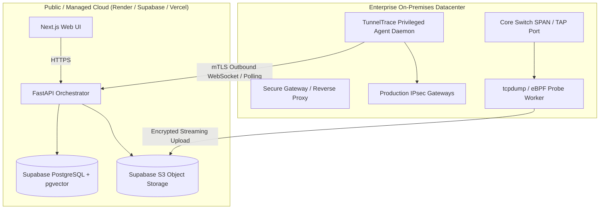

---

## 20. Future On-Prem Deployment

*(Label: FUTURE / PRODUCT HARDENING)*

For government, intelligence, defense, and military security operations centers (such as NTRO):
- Entire stack deployed within the organization's private datacenter.
- Packaged as a unified multi-container appliance or enterprise virtualization template (OVA).
- Zero external calls; no public DNS resolution; fully internal user directory integration (LDAP / Active Directory).

---

## 21. Future Air-Gapped-Compatible Deployment

*(Label: FUTURE / PRODUCT HARDENING)*

To operate in strict SCIF / air-gapped environments:
- **Image Transfer:** Packaged as encrypted container tarballs (`docker save`) transferred via secure physical media.
- **Knowledge Base:** Pre-embedded regulatory standards, CVE databases, and NIST SP 800-77 rules loaded directly into PostgreSQL during provisioning.
- **Inference Engine:** Fully localized CPU-optimized ML models (XGBoost, PyTorch) with optional on-premise local LLM (Ollama running quantized Llama-3/Mistral models).
- **Zero Internet Requirement:** System runs with network gateway completely disabled.

---

## 22. Environment Matrix

| Parameter | Local Development | Shared CI / Test | SIH Demo Environment | Future Hosted (Optional) | Future On-Premises |
| :--- | :--- | :--- | :--- | :--- | :--- |
| **Host System** | Dev Workstation (Linux/WSL2) | GitHub Actions Runner | Demo Laptop (Ubuntu 22.04) | Vercel + Render + Supabase | Enterprise Linux Server |
| **Execution Class A** | Docker Compose | Containerized Test Runners | Local Docker Compose | Managed Platform as a Service | Internal Container Engine |
| **Execution Class B** | Host / Dedicated Linux VM | Mocked / Dedicated VM | Native Host Linux Namespaces | Isolated Remote Agent Node | Dedicated Enterprise Appliance |
| **Database** | Local Postgres 15 Docker | Ephemeral Postgres Service | Local Postgres 15 Docker | Managed Supabase Postgres | Enterprise Postgres Cluster |
| **Redis Broker** | Local Redis 7 Docker | Ephemeral Redis Service | Local Redis 7 Docker | Managed Redis Instance | Internal Redis Cluster |
| **Object Storage** | Local File Directory | Ephemeral Temp Dir | Local Mounted Volume | Supabase S3 Object Bucket | Internal MinIO / SAN |
| **AI Analyst Mode** | Local / Mock / API Key | Mock Deterministic Stubs | Pre-cached / Local Fallback | Secure API Gateway | Air-Gapped Local LLM |
| **Network Access** | Local Loopback (`127.0.0.1`) | Isolated Virtual Network | Complete Air-Gap Capable | Public TLS + VPC Isolation | Air-Gapped / Zero Outbound |

---

## 23. Configuration Management

Configuration is strictly decoupled from code following Twelve-Factor App principles. Settings are supplied via environment variables parsed and validated at application boot by Pydantic settings models.

### Environment Variable Groups
1. `APP_*`: Core server operational settings (name, environment, debug mode, log level).
2. `DATABASE_*`: Relational and vector connection URIs, pool limits, and timeout parameters.
3. `REDIS_*`: Broker connection strings, password credentials, and queue names.
4. `STORAGE_*`: Local root path or S3 bucket credentials, presigned URL expiry settings.
5. `MODEL_*`: Active model directory, version strings, checksum manifest locations.
6. `POLICY_*`: Active policy directory, rule set version identifiers.
7. `LLM_*`: Provider selector (`ollama`, `openai`, `mock`), endpoint URL, API keys, temperature.
8. `NETAGENT_*`: IPC socket path, allowed interfaces, execution timeout limits.

---

## 24. Secrets Management

### Strict Rules for Secrets
1. **Never Commit Secrets:** `.env`, `.env.local`, PEM keys, and API tokens are enforced in `.gitignore`.
2. **Never Expose to Frontend:** Only variables prefixed with `NEXT_PUBLIC_` are bundled into the client build. No database passwords, Redis tokens, or LLM keys may carry this prefix.
3. **Never Log Secrets:** Logging filters sanitize connection strings, Authorization headers, and cryptographic passwords before emission.
4. **Environment Secret Providers:** In hosted staging, Render and Vercel Encrypted Environment Variables are utilized; in enterprise deployments, integration with HashiCorp Vault is supported (`FUTURE`).

---

## 25. Source Control

TunnelTrace AI maintains its version-controlled codebase on GitHub:
- **Repository Structure:** Monorepo containing `/frontend`, `/backend`, `/lab`, `/policies`, and `/models`.
- **Default Branch:** `main` (Protected; requires pull request review and green CI checks).
- **Development Branch:** `develop` (Integration branch for staging validation).
- **Tagging Format:** Semantic Versioning (`vMAJOR.MINOR.PATCH`, e.g., `v1.0.0-sih`).

---

## 26. Branch / Release Strategy

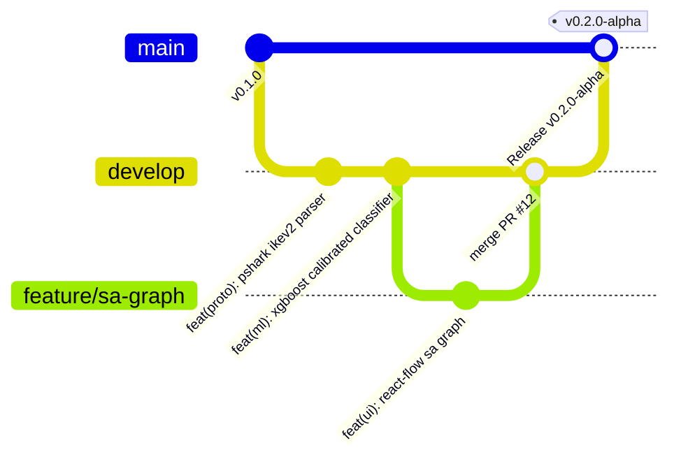

1. **Feature Branches (`feature/*`):** Created from `develop` for specific subsystem features.
2. **Bugfix Branches (`fix/*`):** Short-lived branches addressing validated defects.
3. **Release Branches (`release/*`):** Stabilization branches created prior to milestone demos.
4. **Main Branch (`main`):** Production-ready, tagged releases only.

---

## 27. CI Pipeline

The continuous integration pipeline is executed via GitHub Actions on every Pull Request and merge to `develop` and `main`.

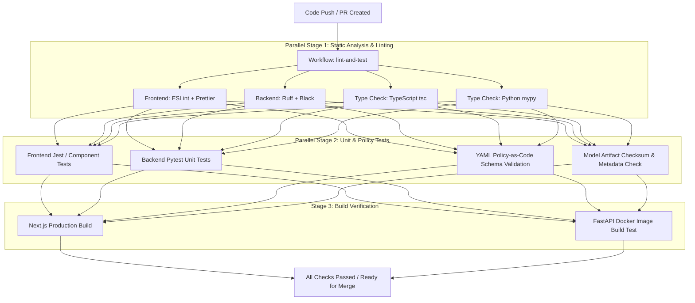

---

## 28. Networking Integration Tests

Ordinary GitHub Actions runners lack raw socket privileges and kernel network namespace access.
- **Integration Test Strategy:** Privileged networking tests (verifying strongSwan tunnel negotiation, `tc/netem` packet loss injection, and `tcpdump` capture) are executed on a dedicated self-hosted Linux runner or a separate local validation harness (`make test-network`).
- **Isolation Guarantee:** Standard PR merges do not block on physical network interfaces. Mock PCAP fixtures are used for protocol dissector testing in standard CI.

---

## 29. CD Pipeline

*(Label: FUTURE / PRODUCT HARDENING for Production; Controlled Manual Release for SIH)*

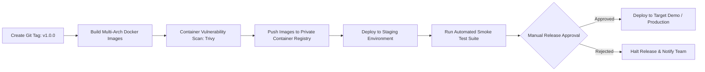

---

## 30. Artifact Build Strategy

1. **Frontend Artifacts:** Output of `next build` compiled to standalone Node.js distribution in `.next/standalone`.
2. **Backend Artifacts:** Python wheels pre-built with pinned dependencies via `pip-compile` / `pyproject.toml`.
3. **ML Bundles:** Model weight binaries (`.json` for XGBoost, `.pt` for PyTorch) paired with `metadata.json` and `features.json`.
4. **Policy Bundles:** Version-tagged directory containing `rules.yaml` and `profiles.yaml`.
5. **Report Templates:** Versioned Jinja2 HTML/CSS templates for WeasyPrint PDF compilation.

---

## 31. Container Build Strategy

Dockerfiles follow multi-stage build patterns to minimize final attack surface and image size.
- **Base OS:** Debian 12 Slim (`python:3.11-slim-bookworm`) for Backend/Worker; Alpine Linux (`node:20-alpine`) for Frontend.
- **Security Hardening:** No development tools (`gcc`, `make`) retained in final stage; root user eliminated; non-root user `tunneltrace` (`UID 10001`) created and enforced.
- **No In-Image Secrets:** Environment variables and secrets are injected strictly at container runtime.

---

## 32. Application Versioning

The platform enforces Semantic Versioning across all individual subsystem artifacts:

$$\text{Format: } \text{MAJOR}.\text{MINOR}.\text{PATCH} \quad (\text{e.g., } 1.0.0)$$

Every analysis execution stores an audit record capturing the precise version matrix:
```json
{
  "system_version": "1.0.0",
  "api_version": "1.0.0",
  "dissector_version": "tshark-4.0.6",
  "model_version": "xgb-esp-v1.0.0",
  "policy_bundle_version": "nist-rfc-2026.1",
  "score_engine_version": "v1.0"
}
```

---

## 33. Model Artifact Deployment

Bulky training datasets (such as the 28 GB ISCXVPN2016 dataset) are **never** deployed with the application. Only compressed, finalized inference artifacts are packaged.

### Inference Artifact Bundle Structure
```
models/active/
├── model_manifest.json          # Checksums, schemas, version metadata
├── xgboost_flow_classifier.json # Serialized XGBoost tabular model
├── cnn_spatial_classifier.pt    # Serialized PyTorch 1D-CNN weights
├── scaler.joblib                # Feature normalization parameters
├── label_encoder.json           # Categorical class mapping
├── temperature_params.json      # Platt scaling calibration parameters
└── ood_thresholds.json          # Isolation Forest & entropy boundaries
```

---

## 34. Model Promotion

Models cannot be deployed automatically merely because a training script completed. Promotion requires passing a strict evaluation gate:
1. **Zero Session Leakage:** Validation achieved using `GroupKFold` split on unique `session_id`.
2. **Calibration Check:** Expected Calibration Error (ECE) verified within operational bounds (`Requires benchmarking before production hardening`).
3. **OOD Verification:** Out-of-Distribution rejection verified against synthetic unknown non-IPsec packet streams.
4. **Sign-off:** Model manifest signed with cryptographic SHA-256 hash and approved by ML Engineering Lead.

---

## 35. Model Rollback

If a newly deployed model exhibits inference latency spikes or anomalous OOD rejection rates in staging:
1. The operator updates the `MODEL_DIR` pointer in `.env` to the previous known-good directory (`models/v0.9.0-baseline`).
2. The Celery worker containers are restarted (`docker compose restart worker`).
3. The worker validates the older model checksum and resumes inference without code refactoring.

---

## 36. Policy Deployment

Security policies are maintained as human-readable, auditable YAML files adhering to NIST SP 800-77 Rev. 1, RFC 8221, and RFC 7296.
- Policies are stored in `/policies/active/`.
- Policy updates do **not** require Python backend code modifications.
- Hot-reloading is supported: the policy engine watches file modification timestamps or accepts a reload trigger via `POST /api/v1/admin/policy/reload`.

---

## 37. Policy Rollback

If a newly deployed security rule produces widespread false-positive misconfiguration findings:
1. The active policy pointer is reverted to the preceding verified git tag (`git checkout tags/policy-v1.0.0 -- policies/active`).
2. Reload endpoint triggered.
3. System logs record the rollback event in the administrative audit ledger.
4. Historical analysis reports retain their original policy version string for immutable audit integrity.

---

## 38. Database Migration Strategy

Database schema evolution is managed through versioned **Alembic** migration scripts.
- **Forward Migrations:** Applied automatically during deployment initialization via entrypoint script: `alembic upgrade head`.
- **Pre-Migration Backups:** Mandatory automated snapshot taken prior to applying migrations containing column drops or table renames.
- **Rollback Safety:** Every migration script must include a fully tested `downgrade()` function.

---

## 39. Storage Strategy

TunnelTrace AI strictly separates structured relational records from large binary blobs:
- **PostgreSQL 15:** Stores parsed packet headers, SA state tables, security findings, compliance scorecards, audit events, and document vector embeddings.
- **Object / File Storage:** Stores raw input PCAPs, reconstructed flow artifacts, and generated PDF/HTML reports.

---

## 40. PCAP Storage

- **Path Hierarchy:** `/var/lib/tunneltrace/storage/captures/{capture_id}/source.pcap`
- **Access Control:** File permissions restricted to `chmod 600`, owned exclusively by the `tunneltrace` service account (`UID 10001`).
- **Checksum Verification:** Every uploaded or captured PCAP is hashed (SHA-256) at rest; hash verified before passing to dissection workers.

---

## 41. Temporary Data Handling

1. TShark dissection processes stream packet metadata directly to worker memory or bounded temporary FIFO pipes.
2. Temporary flow extraction artifacts stored in `/tmp/tunneltrace_scratch/{job_id}/`.
3. Worker execution wrappers guarantee deletion of scratch directories upon task completion (`finally` block execution).

---

## 42. Data Retention

*(Values marked: `TBD — Requires operational validation.`)*
- **Raw PCAP Files:** Retained for 30 days in local storage, configurable per deployment.
- **Parsed SA & Flow Tables:** Retained for 90 days.
- **Security Assessment Findings:** Retained indefinitely for historical compliance auditing.
- **Audit Logs:** Immutable; retained for 365 days.

---

## 43. Data Deletion

When an authorized user requests capture deletion via UI/API:
1. The API marks the capture record as `DELETED` in PostgreSQL.
2. The physical PCAP file and intermediate flow artifacts are securely removed from the disk (`shred` or OS unlinking).
3. Celery background jobs associated with the `capture_id` are cancelled.
4. Audit ledger logs the deletion event: `{ "actor": "analyst@org", "action": "CAPTURE_PURGE", "capture_id": "cap-9921" }`.

---

## 44. Backup Strategy

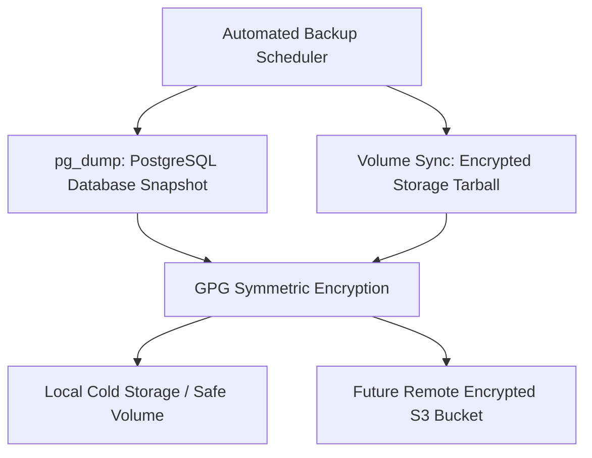

---

## 45. Restore Strategy

1. **Service Handoff:** Halt API and Worker containers (`docker compose stop api worker`).
2. **Database Restoration:** Stream decrypted SQL snapshot into PostgreSQL:
   ```bash
   cat backup_20260922.sql | docker exec -i tunneltrace-postgres psql -U tt_admin -d tunneltrace_db
   ```
3. **Storage Restoration:** Extract storage archive to `/var/lib/tunneltrace/storage`.
4. **Validation:** Run application smoke test (`/health/readiness`) and restart services.

---

## 46. Disaster Recovery

- **Recovery Objective:** RTO and RPO are currently unvalidated (`TBD — Requires operational validation`).
- **Failover Sequence:**
  1. Stand up clean host environment using infrastructure-as-code / Docker Compose.
  2. Pull verified application image tags from container registry.
  3. Restore latest database dump and object volume.
  4. Verify policy and model artifact checksums.
  5. Route traffic to revived endpoint.

---

## 47. Health Checks

Every service exposes standard health check endpoints partitioned by intent:

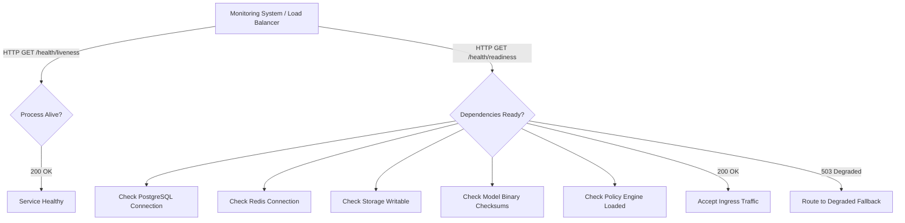

---

## 48. Readiness / Liveness

- **Liveness Endpoint (`/health/liveness`):** Returns `200 OK` if the Python ASGI / Node.js HTTP event loop is responding. Used by container orchestrators to detect process lockups and trigger restarts.
- **Readiness Endpoint (`/health/readiness`):** Verifies active database connection pool, Redis ping, storage mount write capability, and model artifact availability. If any core dependency fails, returns `503 Service Unavailable` to prevent traffic ingestion.

---

## 49. Background Job Operations

Long-running and resource-intensive analytical operations are dispatched asynchronously to Celery workers via Redis.

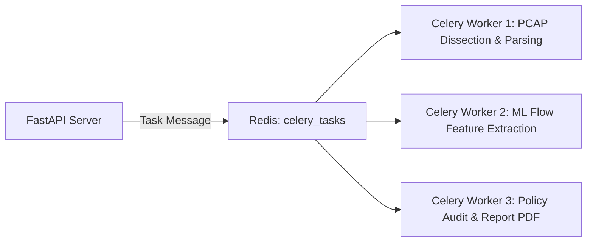

---

## 50. Queue Management

- **Default Queue (`celery`):** Standard asynchronous background jobs.
- **Priority Analysis Queue (`pcap_analysis`):** Dedicated worker threads for deep packet dissection to prevent queue starvation.
- **Report Queue (`reports`):** Low-priority batch worker handling CPU-heavy WeasyPrint PDF compilation.

---

## 51. Job Retry / Timeout / Cancellation

- **Retry Policy:** Ephemeral database disconnects retry with exponential backoff (up to 3 attempts). Corrupted PCAPs or packet dissection parse errors **never** retry.
- **Timeouts:** Hard timeout enforced per analysis job (`TBD after benchmarking`; default 300s).
- **Cancellation:** If an operator cancels an analysis via UI, the API issues a Celery revoke signal (`celery.control.revoke(task_id, terminate=True, signal='SIGTERM')`).

---

## 52. WebSocket Runtime

Real-time telemetry (packet processing counters, SA graph discovery animations, live capture packet rates) is pushed to clients over WebSockets.
- **Path:** `ws://<host>:8000/ws/analysis/{session_id}`
- **Pub/Sub Mechanism:** Redis Pub/Sub fans out Celery progress events to FastAPI WebSocket connection managers.
- **Heartbeat:** 15-second ping/pong frames detect dead client connections and prevent socket leaks.

---

## 53. Privileged Network Agent

The Privileged Network Agent is a specialized Linux-native daemon providing a secure, strictly controlled API to Execution Class B capabilities.

### Security Guarantees
- Binds exclusively to a local UNIX domain socket (`/run/tunneltrace/agent.sock`) with permissions `0600` (root only).
- Exposes no arbitrary shell command execution. All operations are strictly parameterized functions with whitelisted arguments.
- Validates all input against strict regex patterns (e.g., interface names must match `^[a-zA-Z0-9_-]{1,16}$`).

---

## 54. Live Capture Operations

1. Analyst selects an authorized interface and initiates live capture from UI.
2. API validates analyst permissions and transmits `START_CAPTURE(interface, pcap_filter, session_id)` to the Privileged Network Agent.
3. Agent spawns an isolated `tcpdump` process:
   ```bash
   tcpdump -i eth1 -w /var/lib/tunneltrace/storage/live/{session_id}.pcap -s 0 -U "esp or udp port 500 or udp port 4500"
   ```
4. Agent monitors file size and process execution time against strict caps.
5. On stop command or timeout, agent issues `SIGINT`, flushes capture buffers, and hands over file path to Class A worker.

---

## 55. strongSwan/Testbed Operations

The Privileged Agent automates testbed orchestration inside isolated network namespaces:
- Executes `ip netns add ns_initiator`, `ip link add veth_init type veth ...`.
- Launches independent `charon` instances using `swanctl`.
- Loads configured test profiles (`ikev2-aes256gcm`, `ikev1-aggressive-des-sha1`, etc.).
- Verifies tunnel establishment by querying XFRM SA state: `ip -n ns_initiator xfrm state`.

---

## 56. Remediation Operations

When an operator reviews an identified misconfiguration and approves remediation:
1. System displays side-by-side diff between current `swanctl.conf` and hardened configuration.
2. Operator triggers `APPLY_REMEDIATION(run_id)`.
3. Privileged Agent takes a pre-remediation backup of active configuration.
4. Agent writes updated configuration to strongSwan configuration directory.
5. Agent issues non-disruptive reload command: `swanctl --load-all`.
6. Agent initiates automated connection verification probe. If the tunnel fails to re-establish within 15 seconds, it automatically triggers rollback.

---

## 57. Privilege Separation

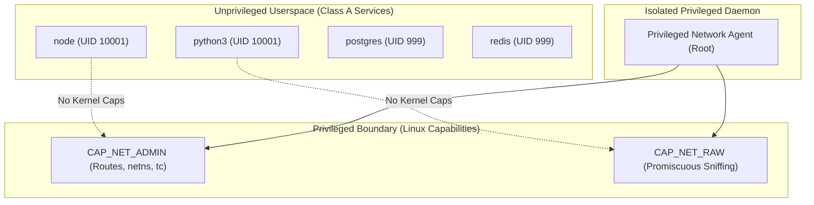

---

## 58. Network Security

- **Container Ingress:** Frontend (port 3000) and API (port 8000) exposed to host loopback interface (`127.0.0.1`) only.
- **Internal Database Protection:** PostgreSQL (5432) and Redis (6379) are bound exclusively to the internal Docker bridge network and are never exposed to public interfaces.
- **CORS Configuration:** API strictly restricts `Access-Control-Allow-Origin` to configured frontend hostnames.

---

## 59. TLS

- **Local / SIH Demo:** HTTP/WS utilized over loopback (`localhost`).
- **Staging / Production:** TLS 1.3 enforced at the ingress layer (Vercel Edge, Cloudflare, or Reverse Proxy).
- **Cipher Suite Policy:** Modern forward-secrecy cipher suites only (`TLS_AES_256_GCM_SHA384`, `TLS_CHACHA20_POLY1305_SHA256`).

---

## 60. Authentication / Authorization

- **Current Prototype:** Local single-tenant role or token-based authentication.
- **Future Hosted Staging:** Supabase Auth providing JWT bearer token authentication.
- **Role-Based Access Control (RBAC):**
  - `Viewer`: Read-only access to completed analyses and compliance scorecards.
  - `Analyst`: Upload PCAPs, trigger analysis, generate reports, query AI Analyst.
  - `Administrator`: Initiate live capture, launch strongSwan testbed, execute remediation.

---

## 61. Application Security

- **Pydantic Validation:** All incoming REST payloads strictly validated against typed schemas.
- **No Direct Shell Interpolation:** All external CLI executions (TShark, swanctl) utilize tokenized argument arrays: `subprocess.Popen(["tshark", "-r", safe_path, ...])`.
- **Content Security Policy (CSP):** Strict HTTP headers prevent cross-site scripting and unauthorized iframe embedding.

---

## 62. Container Security

- Non-root users enforced in Dockerfiles (`USER 10001:10001`).
- Root filesystems mounted read-only (`read_only: true`) where practical, using explicit `tmpfs` for transient scratch directories.
- Linux capabilities dropped by default (`cap_drop: - ALL`).
- Docker socket (`/var/run/docker.sock`) is **never** mounted inside web-facing containers.

---

## 63. Supply Chain Security

- Pinned dependency versions in `package-lock.json` and `requirements.txt`.
- GitHub Actions automated dependency scanning using Dependabot.
- Docker base images pinned to explicit SHA-256 digests in production builds.

---

## 64. Dependency Management

- Python packages audited periodically via `pip-audit`.
- Node.js packages audited via `npm audit --omit=dev`.
- Outdated or vulnerable dependencies blocked from merging into `main`.

---

## 65. PCAP Safety

Untrusted packet captures represent potential exploit vectors targeting dissector vulnerabilities:
- **TShark Sandboxing:** Dissector child processes run under strict execution limits:
  ```python
  # Worker subprocess isolation
  proc = subprocess.Popen(
      ["tshark", "-r", sanitized_pcap_path, "-T", "ek"],
      stdout=subprocess.PIPE,
      stderr=subprocess.PIPE,
      preexec_fn=limit_resources  # Enforces RLIMIT_AS (Memory) and RLIMIT_CPU
  )
  ```
- Memory capped at 1 GB per dissection process; hard timeout of 120 seconds.

---

## 66. Resource Protection

- Upload file size capped at 100 MB for prototype web ingress.
- Rate limiting on API upload endpoints: max 5 concurrent uploads per client IP (`Requires benchmarking before production hardening`).
- Maximum flow extraction table capped at 50,000 flows per PCAP to prevent RAM exhaustion.

---

## 67. Logging

TunnelTrace AI utilizes structured JSON logging across all backend and worker services.

```json
{
  "timestamp": "2026-09-22T15:30:45.123Z",
  "level": "INFO",
  "service": "tunneltrace-worker",
  "job_id": "job-8831",
  "analysis_id": "an-4019",
  "event": "DISSECTION_COMPLETE",
  "packets_processed": 1420,
  "ike_sas_extracted": 2,
  "child_sas_extracted": 4,
  "duration_ms": 412
}
```

---

## 68. Audit Logging

Security-critical actions generate immutable audit log entries persisted to the database:
- User login / authentication failure.
- PCAP upload or deletion.
- Live packet capture initiation / termination.
- Policy bundle reload or modification.
- strongSwan testbed scenario execution.
- Remediation application and rollback.

---

## 69. Metrics

Operational metrics collected by application services include:
- `http_requests_total`: API request counts partitioned by endpoint and status code.
- `pcap_processing_duration_seconds`: Histogram of total packet analysis latency.
- `celery_queue_depth`: Current count of pending background analysis tasks.
- `ml_inference_duration_ms`: Execution time for XGBoost and 1D-CNN inference.
- `active_websocket_connections`: Count of concurrent streaming dashboard clients.

---

## 70. Alerting

*(Threshold values marked: `TBD — Requires operational validation.`)*
- **Critical Alert:** PostgreSQL or Redis connection pool exhausted.
- **Warning Alert:** Celery queue backlog exceeding operational threshold.
- **Warning Alert:** TShark dissection worker crash or timeout rate exceeding 2%.
- **Notification:** Scheduled database backup completion.

---

## 71. Operational Observability

- **Local Prototype:** Monitored directly via `docker compose logs -f` and structured terminal streams.
- **Hosted Staging:** Render / Vercel built-in metrics and log analytics.
- **Future Enterprise:** OpenTelemetry exporter feeding into enterprise Prometheus / Grafana / Loki pipelines (`FUTURE / PRODUCT HARDENING`).

---

## 72. Failure / Graceful Degradation

TunnelTrace AI is engineered to degrade gracefully when secondary components fail:

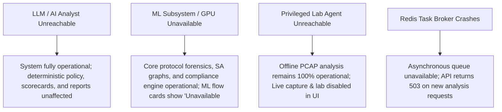

---

## 73. Incident Response

| Incident Category | Detection Vector | Immediate Containment Action | Recovery Procedure |
| :--- | :--- | :--- | :--- |
| **Worker Outage** | Health check failure / queue stagnation | Restart worker container (`docker restart tunneltrace-worker`) | Inspect scratch disk space; clear poisoned queue task if corrupted |
| **Database Pool Exhaustion** | API logs `asyncpg.PoolTimeoutError` | Scale connection pool limit; recycle idle connections | Identify long-running unindexed query and tune connection limits |
| **Poisoned / Malicious PCAP** | Worker SIGSEGV / memory limit breached | Isolate PCAP; mark job `FAILED_UNSUPPORTED_MALFORMED` | Log packet offset; update dissector sanitization filters |
| **Compromised Secret** | Secret detected in git history / breach alert | Immediately revoke token in provider console; rotate `.env` | Redeploy application containers with updated credentials |

---

## 74. Release Process

1. **Feature Freeze:** Code frozen on `develop` branch 48 hours prior to milestone.
2. **Automated Validation:** Execute full test suite (`pytest`, `npm test`, policy validation).
3. **Artifact Compilation:** Verify model binary checksums and build container images.
4. **Staging Smoke Test:** Execute the 31-step Golden Workflow against reference PCAPs.
5. **Tag & Release:** Create release tag `v1.0.0` and deploy to demonstration targets.

---

## 75. Rollback Process

In the event of a critical defect discovered post-deployment:
1. Revert container image tags to the previous stable release (`docker compose pull`).
2. Rollback database schema if migrations were applied (`alembic downgrade -1`).
3. Restore previous model/policy bundle if new versions introduced regressions.
4. Execute smoke tests and confirm service health.

---

## 76. Change Management

All changes affecting database schemas, protocol dissection logic, ML model weights, or security policy definitions must be submitted via standard GitHub Pull Requests referencing a specific issue or problem statement requirement. Unreviewed direct pushes to `main` are strictly blocked.

---

## 77. PWA Deployment

The Next.js frontend is deployed as an installable Progressive Web Application:
- **Web App Manifest:** Configured at `/manifest.json` defining application icons, theme colors (`#F7F7F4` light, `#0A0A0A` dark), and standalone display mode.
- **Service Worker:** Caches application shell, static styling, and fonts for instant load.
- **Data Safety:** Sensitive PCAP captures and security findings are **never** persisted in client-side service worker caches or unencrypted IndexedDB.

---

## 78. AI Analyst Deployment

The RAG-powered AI Analyst subsystem connects to an abstracted LLM gateway:
- **Local Fallback Mode:** Direct integration with a local Ollama instance running quantized models (`ollama/mistral:7b`) on the host.
- **Cloud API Mode:** Direct integration with OpenAI or Anthropic API using backend environment keys.
- **Strict Isolation:** The AI Analyst **never** executes packet parsing or security scoring directly. It only receives verified JSON findings from the database and answers natural-language analyst queries based on grounded document contexts.

---

## 79. RAG Knowledge Deployment

1. Authoritative standards (NIST SP 800-77 Rev. 1, RFC 8221, RFC 7296) are converted into Markdown chunks.
2. Chunks are embedded using an open embedding model (e.g., `sentence-transformers/all-MiniLM-L6-v2`).
3. Vectors and metadata are seeded into PostgreSQL `pgvector` tables during initial database migration.
4. Knowledge updates occur via versioned migration scripts, guaranteeing reproducible retrieval behavior.

---

## 80. Performance Benchmarking

*(Label: Requires benchmarking before production hardening)*
Operational benchmarks to be established during staging trials:
- Throughput: Packets dissected per second across capture sizes (1 MB, 10 MB, 50 MB, 100 MB).
- Inference Latency: Batch execution time for XGBoost tabular and PyTorch 1D-CNN inference.
- Report Synthesis: Time required to render complete WeasyPrint PDF audit reports.
- Concurrency: Maximum concurrent active analysis jobs supported per worker core.

---

## 81. Scalability Strategy

*(Label: FUTURE / PRODUCT HARDENING)*
- **Horizontal Worker Scaling:** Additional Celery worker containers can be spun up across multiple compute nodes, all consuming from the central Redis broker.
- **Database Read Replicas:** PostgreSQL read replicas can serve historical dashboard queries while the primary instance handles ingestion writes.
- **Edge UI Caching:** Static frontend assets cached globally via Vercel Edge / CDN.

---

## 82. Capacity Planning

*(Values marked: `TBD — Requires operational validation.`)*
- Storage growth estimates based on daily ingested PCAP volume.
- Recommended worker-to-core allocation ratio: 1 worker thread per available physical CPU core.
- Database storage requirements: ~50 KB per analyzed IPsec tunnel session.

---

## 83. Operational Runbooks

### Runbook 1: Start Local Environment
```bash
cd "c:\SHARAN PROJECTS\TunnelTrace AI"
docker compose up -d
docker compose ps
```

### Runbook 2: Stop Local Environment
```bash
docker compose down
```

### Runbook 3: Restart API Service
```bash
docker compose restart api
docker compose logs -f --tail=50 api
```

### Runbook 4: Restart Background Worker
```bash
docker compose restart worker
docker compose logs -f --tail=50 worker
```

### Runbook 5: Database Connection Failure Troubleshooting
```bash
# Check if PostgreSQL container is running
docker compose ps postgres
# Test direct connection
docker compose exec postgres pg_isready -U tt_admin -d tunneltrace_db
# Inspect database logs for authentication or resource errors
docker compose logs --tail=100 postgres
```

### Runbook 6: Redis Broker Failure Troubleshooting
```bash
docker compose exec redis redis-cli -a tt_redis_secret ping
# Inspect queue memory consumption
docker compose exec redis redis-cli -a tt_redis_secret info memory
```

### Runbook 7: Model Failed to Load on Startup
```bash
# Inspect worker logs for checksum mismatch
docker compose logs worker | grep -i "model"
# Verify model file presence and SHA-256 integrity
sha256sum models/active/xgboost_flow_classifier.json
# Fallback to baseline model
cp models/backup/* models/active/
docker compose restart worker
```

### Runbook 8: Policy Engine Schema Error
```bash
# Validate active YAML files against schema
python backend/scripts/validate_policies.py policies/active/
# Check for duplicate rule IDs
grep -h "id:" policies/active/*.yaml | sort | uniq -d
```

### Runbook 9: TShark Dissection Binary Failure
```bash
# Verify TShark version inside worker container
docker compose exec worker tshark -v
# Test dissection against a reference fixture
docker compose exec worker tshark -r /app/fixtures/sample_ikev2.pcap -c 5
```

### Runbook 10: Live Capture Permission Failure
```bash
# Check raw socket capabilities on host
getcap $(which tcpdump)
# Verify Privileged Agent socket permissions
ls -la /run/tunneltrace/agent.sock
```

### Runbook 11: strongSwan Testbed Tunnel Establishment Failure
```bash
# Inspect strongSwan daemon status in namespace
ip netns exec ns_initiator swanctl --list-sas
# Check XFRM kernel state
ip netns exec ns_initiator ip xfrm state
# Inspect daemon log stream
ip netns exec ns_initiator journalctl -u strongswan -n 50
```

### Runbook 12: Storage Disk Full Emergency Response
```bash
# Check storage volume utilization
df -h /var/lib/tunneltrace/storage
# Purge temporary scratch directories older than 24 hours
find /tmp/tunneltrace_scratch/ -type d -mtime +1 -exec rm -rf {} +
```

### Runbook 13: Failed Deployment Recovery
```bash
# Identify previous stable git commit
git log -n 5 --oneline
# Checkout previous release tag and redeploy
git checkout tags/v0.1.0-alpha
docker compose up -d --build
```

### Runbook 14: Rollback Application Release
```bash
docker compose pull api:v0.1.0-stable worker:v0.1.0-stable
docker compose up -d api worker
```

### Runbook 15: Restore PostgreSQL Database from Backup
```bash
docker compose exec -T postgres dropdb -U tt_admin tunneltrace_db
docker compose exec -T postgres createdb -U tt_admin tunneltrace_db
cat backups/latest.sql | docker compose exec -T postgres psql -U tt_admin tunneltrace_db
```

### Runbook 16: Rotate Compromised API Secret
```bash
# Update .env with newly generated cryptographically random string
openssl rand -hex 32
# Restart dependent services
docker compose up -d api worker
```

### Runbook 17: AI Analyst Fallback to Offline Mode
```bash
# Set LLM provider to mock/disabled in .env
sed -i 's/LLM_PROVIDER=.*/LLM_PROVIDER=mock/' .env
docker compose restart api
```

---

## 84. SIH Demo Runbook

### Pre-Demo Verification Checklist (T-30 Minutes)
1. Boot demo laptop; ensure machine is running on stable AC power.
2. Confirm Docker daemon running: `docker info`.
3. Launch complete stack: `docker compose up -d`.
4. Open browser to `http://localhost:3000` and verify PWA shell renders cleanly.
5. Check backend readiness: `curl http://localhost:8000/health/readiness` (must return `200 OK`).
6. Verify active ML model weights and YAML policy bundles are loaded.
7. Verify all 5 reference test PCAPs are pre-staged in `/var/lib/tunneltrace/storage/demo/`.

### Live Demonstration Execution (T-0 Minutes)
- **Level 1 (Preferred Live Mode):** Execute live strongSwan negotiation in network namespaces, trigger `tcpdump` sniffing, stream real-time packet counters, and transition seamlessly into automated security assessment.
- **Level 2 (Controlled Fast Fallback):** If live network interface binds are restricted by venue Wi-Fi/networking, instantly load the freshly pre-generated capture from `/var/lib/tunneltrace/storage/demo/controlled_live_run.pcap`.
- **Level 3 (Hard Reference Fallback):** Load the verified golden reference capture (`golden_reference_ikev2.pcap`).

### Post-Demo Cleanup (T+15 Minutes)
- Stop testbed namespaces: `sudo bash lab/scripts/teardown_testbed.sh`.
- Flush scratch captures: `docker compose exec api python scripts/cleanup_scratch.py`.

---

## 85. Deployment Acceptance Tests

| Test ID | Environment | Description | Acceptance Criteria |
| :--- | :--- | :--- | :--- |
| `DAT-01` | Local | Cold stack startup via Docker Compose | All containers reach `healthy` state within 45s |
| `DAT-02` | Local | Database schema & migration execution | `alembic upgrade head` exits with return code 0 |
| `DAT-03` | Local | Offline PCAP upload and parsing | 10 MB PCAP dissected, SA graph generated without errors |
| `DAT-04` | Local | ML inference execution | Calibrated classification probabilities generated |
| `DAT-05` | Local | Policy engine assessment | NIST / RFC violation findings correctly populated |
| `DAT-06` | Local | PDF report generation | Complete dual-tier PDF generated via WeasyPrint |
| `DAT-07` | Lab / Testbed | strongSwan namespace tunnel creation | `ip xfrm state` shows established ESP SAs |
| `DAT-08` | Lab / Testbed | Live packet capture termination | `tcpdump` writes valid PCAP file with non-zero byte size |

---

## 86. Security Hardening Checklist

- [x] Application containers run with non-root user (`UID 10001:10001`).
- [x] Linux capabilities dropped (`cap_drop: ALL`) on all Class A containers.
- [x] Sensitive environment credentials excluded from git repositories (`.gitignore`).
- [x] Database and Redis instances isolated on internal bridge network (no public port bindings).
- [x] TShark dissection processes bounded by memory (`RLIMIT_AS`) and execution timeouts.
- [x] All database queries parameterized through SQLAlchemy ORM (SQL injection prevention).
- [x] Pydantic strict schemas enforce type validation on all REST inputs.
- [x] CORS origins restricted to approved local and staging domain names.
- [x] Privileged Network Agent restricted to local loopback UNIX socket with root-only file permissions.
- [x] No arbitrary shell command injection paths exist; argument arrays enforced.

---

## 87. Component Deployment Matrix

| Component | Runtime | Privilege | Stateful? | Storage Type | Network Access | Can Run Serverless? | Current / Future |
| :--- | :--- | :--- | :--- | :--- | :--- | :--- | :--- |
| **Next.js Frontend** | Node 20 LTS | Unprivileged (10001) | No | None | Ingress (3000) | **Yes** (Vercel) | Current |
| **FastAPI Backend** | Python 3.11 | Unprivileged (10001) | No | Temp Volume | Ingress (8000), Internal DB/Redis | **No** (WebSockets/Workers) | Current |
| **Celery Worker** | Python 3.11 | Unprivileged (10001) | No | Scratch Disk | Internal DB/Redis | **No** (Long processing/TShark) | Current |
| **Redis Broker** | Redis 7 | Unprivileged (999) | Yes | Append-only File | Internal Network Only | **No** (Managed Cache needed) | Current |
| **PostgreSQL** | Postgres 15 | Unprivileged (999) | Yes | Persistent Block Volume | Internal Network Only | **No** (Managed DB needed) | Current |
| **TShark Dissector** | C / Binary | Unprivileged (10001) | No | Bounded Pipe | None (Offline Dissection) | **No** (Binary system dependency) | Current |
| **ML Inference** | Python 3.11 | Unprivileged (10001) | No | Model Weight Vol | None | **No** (Bound to Celery worker) | Current |
| **Policy Engine** | Python 3.11 | Unprivileged (10001) | No | Policy File Vol | None | **Yes** (Stateless compute) | Current |
| **Report Compiler** | WeasyPrint | Unprivileged (10001) | No | Storage Volume | None | **No** (Heavy binary libraries) | Current |
| **pgvector / RAG** | PostgreSQL | Unprivileged (999) | Yes | Database Tables | Internal Network Only | **No** (Colocated in DB) | Current |
| **Privileged Agent** | Python / Bash | **Root / CAP_NET_ADMIN** | No | Socket Path | Host Interfaces / Loopback Socket | **STRICTLY NO** | Current (Class B) |
| **strongSwan** | C (charon) | **Root / Kernel Caps** | Yes | Config / XFRM | Raw Network Interfaces / Namespaces | **STRICTLY NO** | Current (Class B) |
| **tcpdump Engine** | C / libpcap | **CAP_NET_RAW** | Yes | Raw PCAP Stream | Raw Host/Promiscuous Interface | **STRICTLY NO** | Current (Class B) |

---

## 88. Environment Matrix

| Parameter | Development | Test / CI | SIH Demo | Staging (Cloud Optional) | Enterprise On-Prem |
| :--- | :--- | :--- | :--- | :--- | :--- |
| **Host System** | Ubuntu/Debian/WSL2 | GitHub Actions Runner | Ubuntu 22.04 LTS Laptop | Render + Supabase + Vercel | Enterprise RHEL / Ubuntu |
| **Container Engine** | Docker Compose | Docker in Docker / Mock | Docker Compose v2 | Platform Managed Containers | Docker / Podman / OpenShift |
| **Class A Hosting** | Local Docker Containers | CI Ephemeral Containers | Local Docker Containers | Cloud PaaS (Render / Vercel) | On-Premise Docker Compose |
| **Class B Hosting** | Host / Linux VM | Mock Dissection Stubs | Native Host Linux Namespaces | Dedicated Remote Worker VM | Dedicated Security Appliance |
| **Secrets Engine** | `.env` file | GitHub Secrets | `.env` file | Cloud Encrypted Env Vars | HashiCorp Vault / KMS |
| **Model Serving** | Local CPU | Local CPU Mock | Local CPU (Optimized) | Cloud Compute CPU | On-Prem GPU / High-Core CPU |
| **Report Engine** | Local WeasyPrint | Disabled / Mock | Local WeasyPrint | Render Worker WeasyPrint | On-Premise Container |

---

## 89. Failure/Degradation Matrix

| Failed Subsystem | Direct Impact | System Degradation State | User Notification / UI Behavior | Recovery Action |
| :--- | :--- | :--- | :--- | :--- |
| **LLM / AI Analyst** | RAG query unavailable | **Core 100% Operational**; Policy audit and ML functional | Banner: "AI Analyst Offline — Running in Deterministic Mode" | Automatic fallback to deterministic rules |
| **ML Inference Engine** | Flow classification unavailable | **Protocol & Security Operational**; Encrypted flow labels empty | Flow cards show status: `ML INFERENCE UNAVAILABLE` | Worker restarts with fallback model |
| **Privileged Agent** | Live capture & testbed blocked | **Offline Analysis 100% Operational**; Uploads still work | Lab tab disabled; Tooltip: `Network Agent Unreachable` | Restart agent daemon on host |
| **Celery Worker** | Asynchronous jobs stall | **API responds, jobs queue**; Progress stops | Job status displays `QUEUED (Worker Busy/Offline)` | Restart worker container |
| **Redis Broker** | Queue and WebSockets drop | **System Degraded**; Cannot accept new asynchronous jobs | Error Modal: `Task Queue Unavailable` | Restart Redis container |
| **PostgreSQL DB** | Data persistence lost | **System Offline**; API rejects state modifications | Error 503: `Database Service Unavailable` | Restore database service / runbook |

---

## 90. Backup/Recovery Matrix

| Asset Type | Storage Location | Backup Method | Backup Frequency | Encryption | Retention Period |
| :--- | :--- | :--- | :--- | :--- | :--- |
| **PostgreSQL Relational** | Postgres Data Volume | `pg_dump` Logical Snapshot | Daily / Pre-migration | GPG (AES-256) | 30 Days |
| **Vector Embeddings** | Postgres `pgvector` Tables | Included in `pg_dump` | Daily / Pre-migration | GPG (AES-256) | 30 Days |
| **Raw PCAP Uploads** | File Volume (`/storage/`) | Volume Snapshot / Tarball | Daily | At-rest OS Volume | 30 Days (`TBD`) |
| **Generated Reports** | File Volume (`/storage/`) | None (Fully Reproducible) | On-Demand | At-rest OS Volume | Ephemeral / 90 Days |
| **Model Weights** | Git LFS / Models Volume | Git Version Control | On Release | Checksum Verified | Indefinite |
| **Policy YAML Bundles** | Git Repository | Git Version Control | On Commit | Git Signed Tags | Indefinite |

---

## 91. Release Compatibility Matrix

| Release Version | Compatible DB Schema | Compatible Model Version | Compatible Policy Bundle | TShark Dissector Target |
| :--- | :--- | :--- | :--- | :--- |
| `v0.1.0-alpha` | `alembic_v1` | `xgb-v1.0.0`, `cnn-v1.0.0` | `nist-rfc-2026.1` | Wireshark 4.0.0+ |
| `v0.2.0-beta` | `alembic_v2` | `xgb-v1.1.0`, `cnn-v1.1.0` | `nist-rfc-2026.2` | Wireshark 4.0.6+ |
| `v1.0.0-sih` | `alembic_v3` | `xgb-v2.0.0`, `cnn-v2.0.0` | `nist-rfc-2026.3` | Wireshark 4.2.0+ |

---

## 92. Rollback Matrix

| Layer | Rollback Mechanism | Pre-Requisite | Verification Step |
| :--- | :--- | :--- | :--- |
| **Frontend UI** | Pull previous Docker image tag / Vercel instant rollback | Previous container cached | Refresh browser; check footer build hash |
| **Backend API** | Revert container image tag; restart container | Previous container cached | `curl -f http://localhost:8000/health/liveness` |
| **Database Schema** | Execute `alembic downgrade -1` | Non-destructive schema delta | Inspect `alembic_version` table |
| **ML Model Bundle** | Point `MODEL_DIR` to previous version folder | Archived model weights present | Worker logs show successful checksum validation |
| **Policy Bundle** | Git checkout previous policy tag; invoke reload API | Tagged commit exists in repo | API `/health/readiness` reports valid policy count |
| **Privileged Agent** | Restore previous strongSwan config backup | Backup file in `/etc/swanctl/backup/` | `swanctl --list-sas` verifies tunnel stability |

---

## 93. Future Cloud Mapping

*(Label: OPTIONAL / NOT FROZEN — Architectural Blueprint Only)*

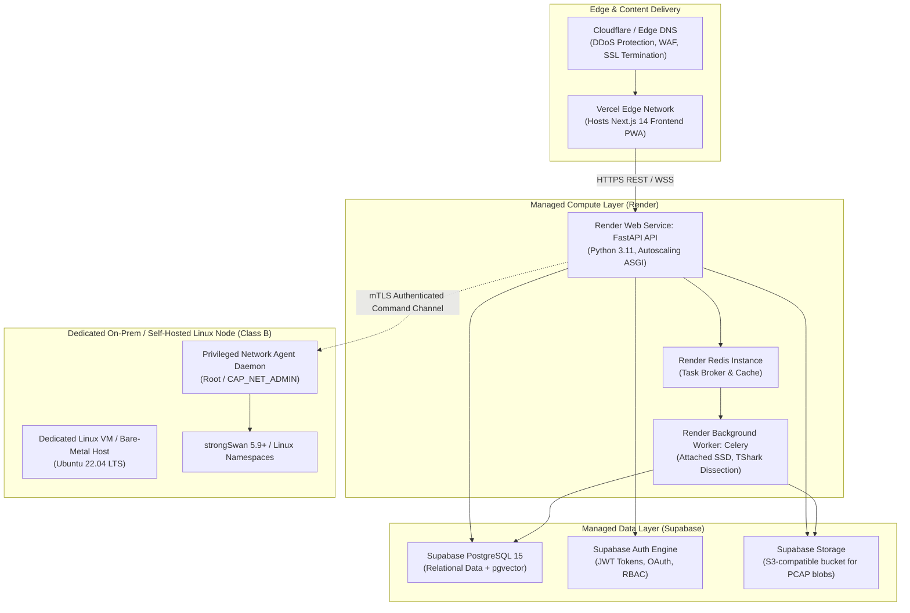

---

## 94. Risks & Mitigations

| Risk Description | Severity | Likelihood | Impact | Mitigation Strategy | Detection Vector | Recovery Action |
| :--- | :--- | :--- | :--- | :--- | :--- | :--- |
| **Serverless Incompatibility with Live Sniffing** | High | Certain | Critical | Enforce strict Execution Class separation; never deploy packet capture to Vercel/serverless. | Architecture Review | Maintain isolated Privileged Linux Agent. |
| **Privileged Subsystem Compromise** | Critical | Low | Severe | Agent exposes no arbitrary shell execution; loopback UNIX socket with root-only permissions. | Audit Log Analysis | Terminate agent daemon; rotate host credentials. |
| **Resource Exhaustion via Huge PCAP** | High | Medium | High | Hard upload size cap (100 MB); TShark memory limits (`RLIMIT_AS`); Celery job timeouts. | Worker Memory Metric | Terminate worker subprocess; purge scratch data. |
| **Model Artifact Incompatibility** | Medium | Low | Medium | Startup checksum and schema validation; fail closed if feature mismatch detected. | Health Check Readiness | Fallback to verified baseline model bundle. |
| **Security Policy Syntax Error** | High | Low | High | YAML schema validation in CI pipeline; hot-reload rejects malformed rule bundles. | Policy Reload Endpoint | Revert to previous git-tagged policy version. |
| **Demo Venue Internet Failure** | Critical | High | Severe | 100% local-first air-gapped architecture; pre-cached models, policies, and demo PCAPs. | Network Ping Check | Switch to offline demo execution immediately. |
| **Stale PWA Service Worker Cache** | Low | Medium | Low | Versioned service worker script with skip-waiting prompt on new release. | Client Console Telemetry | Force service worker cache clear on update. |
| **strongSwan Namespace Deadlock** | Medium | Low | Medium | Automated script timeout on tunnel creation; teardown script purges orphan netns. | Testbed Script Exit Code | Run `lab/scripts/teardown_testbed.sh`. |

---

## 95. Open Decisions / TBD Register

The following operational and infrastructure parameters are strictly unfinalized and flagged for empirical testing:

1. `TBD-OPS-01`: Final cloud hosting provider for staging (Render vs. dedicated AWS/GCP VM).
2. `TBD-OPS-02`: Production worker CPU and RAM allocations (`Requires benchmarking before production hardening`).
3. `TBD-OPS-03`: Precise maximum PCAP upload size limit for public demo (Default: 100 MB; final cap TBD).
4. `TBD-OPS-04`: Production database backup frequency and cold storage retention periods.
5. `TBD-OPS-05`: Formal Recovery Time Objective (RTO) and Recovery Point Objective (RPO) SLAs.
6. `TBD-OPS-06`: Production Celery queue concurrency limit and maximum task backlog depth.
7. `TBD-OPS-07`: Quantitative anomaly detection threshold for Isolation Forest OOD rejection.
8. `TBD-OPS-08`: Protocol and authentication standard for remote Privileged Agent communication in Hybrid Mode (mTLS REST vs. gRPC).
9. `TBD-OPS-09`: Production TLS certificate termination layer (Cloudflare WAF vs. Ingress Nginx).
10. `TBD-OPS-10`: GPU acceleration requirement for PyTorch 1D-CNN inference under high concurrent load (`Requires benchmarking`).

---

## 96. Glossary

- **Class A Services:** Standard unprivileged application microservices (Next.js, FastAPI, Celery, PostgreSQL, Redis) capable of running in standard container runtimes.
- **Class B Services:** Privileged Linux networking operations (strongSwan, `tcpdump`, `tc/netem`, network namespaces) requiring elevated kernel capabilities (`CAP_NET_ADMIN`, `CAP_NET_RAW`).
- **ESP (Encapsulating Security Payload):** IPsec protocol providing confidentiality and integrity for encapsulated IP packets (IP protocol 50).
- **IKEv2 (Internet Key Exchange v2):** Protocol used to negotiate security associations and cryptographic keys (UDP port 500 / 4500).
- **Network Namespace (`netns`):** Linux kernel feature providing complete isolation of network system resources (interfaces, routing tables, firewall rules).
- **pgvector:** Open-source vector similarity search extension for PostgreSQL.
- **SA (Security Association):** Set of shared security parameters and keys established between two IPsec endpoints.
- **XFRM:** Linux kernel IPsec implementation framework managing security policies and security associations.

---

## 97. References

1. **NIST Special Publication 800-77 Revision 1:** *Guide to IPsec VPNs*, National Institute of Standards and Technology.
2. **RFC 7296:** *Internet Key Exchange Protocol Version 2 (IKEv2)*, Internet Engineering Task Force (IETF).
3. **RFC 8221:** *Cryptographic Algorithm Implementation Requirements and Key Size Limits for Encapsulating Security Payload (ESP) and Authentication Header (AH)*.
4. **RFC 4303:** *IP Encapsulating Security Payload (ESP)*.
5. **strongSwan Documentation:** *Architecture, swanctl Configuration & VICI Control Interface*, strongswan.org.
6. **The Twelve-Factor App:** *Methodology for building modern, scalable, maintainable software-as-a-service applications*, 12factor.net.
7. **Smart India Hackathon 2026 Problem Statement 160:** *AI-Powered IPsec VPN Protocol Analyzer and Security Assessment Framework*, National Technical Research Organisation (NTRO).
