# [PROJECT NAME] — ML & Dataset Engineering Document

**Official Problem Statement ID:** 26160 (PS 160)  
**Official Problem Statement Title:** AI-Powered IPsec VPN Protocol Analyzer and Security Assessment Framework  
**Sponsoring Organization:** National Technical Research Organisation (NTRO)  
**Theme:** Blockchain & Cybersecurity (Software Category)  
**Document Type:** Master Machine Learning & Dataset Engineering Specification  
**System Name:** [PROJECT NAME] (Working Baseline: TunnelTrace AI)  
**Current Release Version:** `v0.1.0-alpha` (SIH 2026 Engineering Prototype)  
**Document Status:** Approved Machine Learning Baseline  

---

## 1. Document Control

| Property | Value |
| :--- | :--- |
| **System Title** | [PROJECT NAME] (AI-Powered IPsec VPN Protocol Analyzer and Security Assessment Framework) |
| **Problem Statement Reference** | SIH 2026 / PS 160 / NTRO |
| **Document Classification** | Master ML Architecture, Dataset Engineering & Validation Specification |
| **Machine Learning Scope** | Encrypted ESP Flow Classification, Calibration, OOD Uncertainty Gating, TreeSHAP Attribution, and Behavioral Anomaly Detection |
| **Lead Authors** | Principal ML Engineer & Network Traffic Classification Researcher |
| **Technical Reviewers** | Cybersecurity Data Scientist, Dataset Engineer, MLOps Architect, IPsec Protocol Specialist |
| **Target Execution Platform** | Python 3.11, XGBoost 2.0+, PyTorch 2.2+ (CPU Inference Baseline), scikit-learn 1.4+, SHAP 0.44+ |
| **Repository File Location** | `docs/ML_DATASET_ENGINEERING.md` |

---

## 2. Revision History

| Revision | Date | Author / Engineering Role | Description of Changes |
| :--- | :--- | :--- | :--- |
| `0.1.0-draft` | 2026-09-22 | Principal ML Engineer | Initial design of dual-model ensemble (XGBoost + 1D-CNN) and IPsec dataset factory. |
| `0.2.0-review` | 2026-09-22 | Cybersecurity Data Scientist | Formalized session-level splitting, Platt calibration, OOD entropy gating, and TreeSHAP. |
| `1.0.0-final` | 2026-09-22 | Chief Platform ML Architect | Full 99-section production specification with 17 Mermaid diagrams and 20 evaluation matrices. |

---

## 3. Purpose

This **ML & Dataset Engineering Document** defines the authoritative theoretical, mathematical, and operational specifications for the machine learning subsystems of **[PROJECT NAME]**.

It establishes the rigorous experimental methodology required to:
1. Generate an authentic, native IPsec/ESP traffic dataset across diverse cryptographic configurations and network conditions.
2. Formulate ground-truth labeling pipelines that guarantee zero data leakage between training, validation, and evaluation folds.
3. Classify application traffic multiplexed inside Encapsulating Security Payload (ESP) tunnels relying exclusively on side-channel metadata without breaking or decrypting ciphertexts.
4. Provide mathematically calibrated confidence scores, explicit Out-of-Distribution (OOD) rejection, and game-theoretic feature explanations (TreeSHAP).
5. Detect statistical behavioral anomalies via unsupervised Isolation Forests without misrepresenting deviations as verified zero-day attacks.

---

## 4. Scope

This specification governs all data and AI components across the platform lifecycle:
- **Dataset Generation & Lab Factory:** Controlled multi-namespace strongSwan testbed, synthetic and application traffic generators, packet sniffer taps, and ground-truth metadata registrars.
- **Feature Pipeline:** ESP flow normalization, direction resolution, 24-dimensional tabular statistical vector extraction, and early packet sequence tensor compilation.
- **Model Architecture:** Tabular gradient-boosted decision trees (XGBoost), spatial-temporal early packet 1D-CNN (PyTorch), ensemble probability fusion, Platt temperature calibration, and Shannon entropy uncertainty gating.
- **MLOps & Governance:** Internal model registry, versioned feature schemas, experiment tracking manifests, model/dataset cards, and reproducible Dockerized CPU-inference workers.

---

## 5. Relationship to PRD / TRD / SAD / Data Architecture

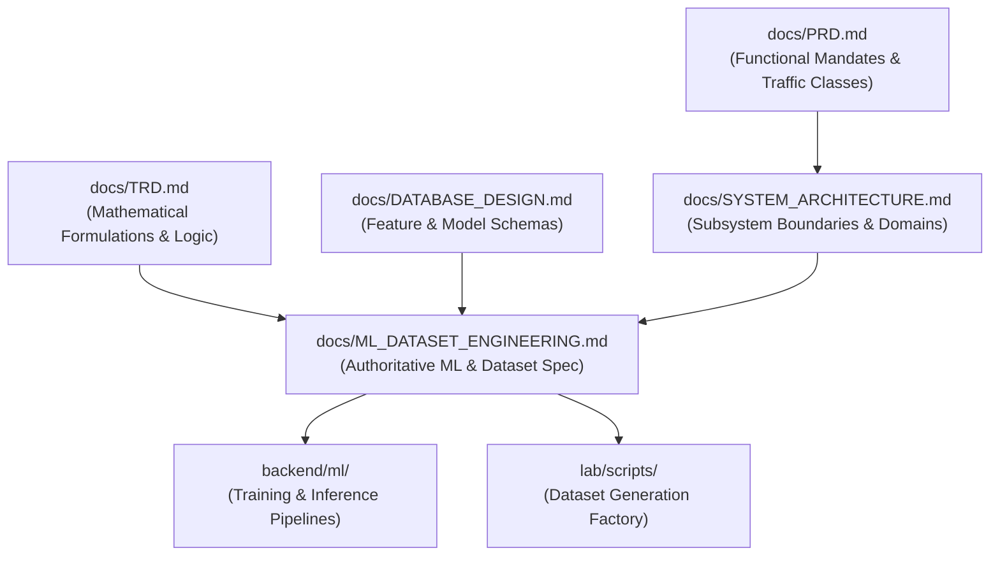

---

## 6. ML Problem Definition

The core supervised task is formally defined as **Multi-Class Closed-World Encrypted Traffic Classification with Open-Set Out-of-Distribution Rejection**:

Given an encrypted, bidirectional ESP flow $F = \{p_1, p_2, \dots, p_K\}$ consisting of $K$ observed packets where payloads are protected by modern cryptographic transforms (e.g., AES-GCM-256), the objective is to infer the application category $y \in \mathcal{Y} = \{c_1, c_2, \dots, c_M\}$ using only observable header dimensions (packet lengths, inter-arrival times, directions, and burst patterns), or output $y = \text{UNKNOWN}$ if the flow exhibits high predictive uncertainty indicative of an unseen class.

---

## 7. AI Boundary / Non-ML Responsibilities

> [!CRITICAL]
> **NON-NEGOTIABLE ARCHITECTURAL BOUNDARY:**  
> Machine learning is strictly prohibited from predicting directly observable protocol facts. Under no circumstances shall neural networks or tree models be trained to infer parameters that exist in cleartext or can be deterministically parsed from network captures.

The strict separation of responsibilities is enforced as follows:
- **Deterministic Protocol Forensics (Wireshark / TShark Engine):**
  - IKE Protocol Version (IKEv1 vs. IKEv2).
  - Negotiated Encryption Transforms (e.g., `ENCR_AES_GCM_16`, `ENCR_3DES_CBC`).
  - Integrity & PRF Algorithms (e.g., `AUTH_HMAC_SHA2_256`, `PRF_HMAC_SHA2_256`).
  - Key Exchange Groups (e.g., DH Group 14, ECP Group 19).
  - Security Parameter Indexes (SPIs) and Sequence Numbers.
  - Encapsulation Mode (Tunnel vs. Transport) where negotiation headers exist.
  - NAT-Traversal detection (UDP port 4500 encapsulation).
- **Machine Learning Scope (XGBoost + 1D-CNN):**
  - Inner application traffic classification inside opaque ESP payloads.
  - Posture metadata fingerprintability and distinguishability scoring.
  - Behavioral statistical anomaly detection.

---

## 8. ML Goals

- **Zero-Decryption Inference:** Classify multiplexed application traffic without cryptanalysis, key recovery, or plaintext inspection.
- **Calibrated Trust:** Ensure output confidence matches empirical posterior probability (minimizing Expected Calibration Error).
- **Graceful Open-Set Handling:** Prevent forced classification of novel applications, streaming protocols, or malware by routing high-entropy predictions to `UNKNOWN`.
- **Explainable Predictions:** Deliver local feature importance vectors via TreeSHAP proving that inferences derive from legitimate physical side channels.
- **Local CPU Efficiency:** Achieve sub-50ms inference latency per flow on standard 8-core commodity CPU instances.

---

## 9. Non-Goals

- **Mathematical Cryptanalysis:** Breaking AES, ChaCha20, or Diffie-Hellman mathematical formulations.
- **Payload Deep Packet Inspection:** Extracting user identities, HTTP URLs, email text, or media content from ciphertext.
- **Universal Attack Detection:** The ML models are not a general-purpose signature-based Intrusion Detection System (IDS).
- **Inline Wire Blocking:** The models execute asynchronously for analytical forensic intelligence, not inline packet filtering.

---

## 10. Assumptions

1. The adversary or communicating endpoints utilize standard RFC 4303 Encapsulating Security Payload (ESP) headers.
2. ESP payloads are padded and encrypted, but outer IP and ESP header fields (SPI, sequence number, packet size, arrival timestamp) remain observable to network observers.
3. Ground-truth training data can be reliably collected in a controlled Linux strongSwan namespace testbed where plaintext application generation is correlated with encrypted tap interfaces.

---

## 11. Constraints

- **Execution Environment:** Host evaluation platforms may lack dedicated GPUs; training must support multi-core CPU execution, and inference must operate with low memory footprint ($\le 2$ GB RAM).
- **Regulatory Framework:** Data collection and feature extraction must respect privacy standards; no raw user-generated payloads are persisted in operational databases.
- **Model Size:** Serialized model artifacts (XGBoost JSON + TorchScript CNN) must not exceed 100 MB combined.

---

## 12. Target Traffic Taxonomy

The supervised classification models are trained across **seven closed-world enterprise traffic categories**, with open-set traffic routed to a dedicated rejection state:

| Class ID | Target Category | Description / Typical Underlying Protocols | Representative Applications |
| :--- | :--- | :--- | :--- |
| `C0` | **Web** | Interactive browsing, REST APIs, short burst transfers | HTTPS, HTTP/2, HTTP/3, WebSockets |
| `C1` | **Video Streaming**| High throughput, sustained unidirectional bursts, adaptive bitrate | YouTube, Netflix, Vimeo, HLS, DASH |
| `C2` | **VoIP** | Low latency, highly isochronous packet intervals, symmetric audio | SIP, RTP, G.711, Opus voice streams |
| `C3` | **Chat / Messaging**| Low bandwidth, periodic keepalives, sporadic small text bursts | Signal, Matrix, Telegram text, XMPP |
| `C4` | **Email** | Asynchronous client-server sync, episodic MIME transfers | IMAP, POP3, SMTP, ActiveSync |
| `C5` | **ICMP** | Network diagnostic echoes, fixed low packet counts | Echo Request/Reply, Traceroute |
| `C6` | **File Transfer** | Sustained maximum transmission unit (MTU) packet trains | SFTP, SCP, SMB, rsync, Large HTTP downloads |
| `C_OOD`| **UNKNOWN** | Unmodeled protocols, novel malware, peer-to-peer traffic | BitTorrent, Tor, Custom C2 (Rejected via OOD Gate) |

---

## 13. WhatsApp / Messaging Strategy

Problem Statement 26160 explicitly references WhatsApp. To maintain scientific integrity under the Zero-Hallucination Rule:
1. **Categorization:** WhatsApp messaging traffic is mapped to the broader **`Chat / Messaging` (`C3`)** taxonomy class.
2. **Controlled Real-Device Experiments:** Where operationally and legally feasible, controlled packet captures from real WhatsApp clients are collected in the testbed.
3. **No Claim of Plaintext Decryption:** The platform asserts that it identifies the *side-channel behavioral footprint* of messaging keepalives and text bursts; it does not claim to decrypt Signal Protocol end-to-end encryption.
4. **Controlled Evaluation Label:** In UI and technical reports, any WhatsApp-specific finding is explicitly designated as `Controlled Experiment Result`, avoiding generalized claims that the model distinguishes WhatsApp from Signal without empirical training support.

---

## 14. Dataset Strategy

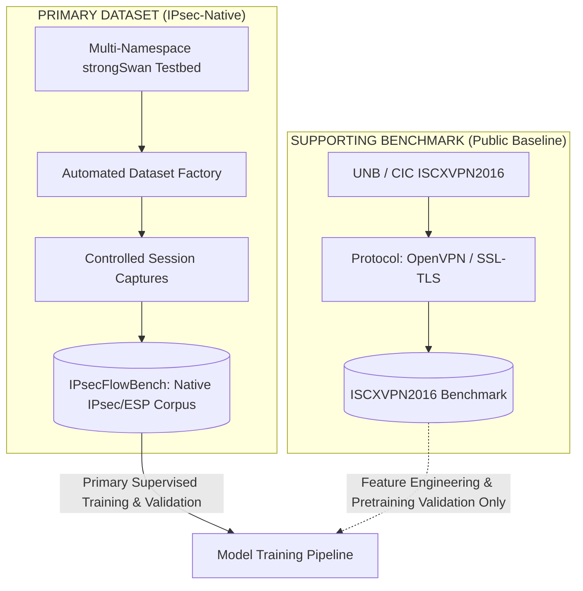

---

## 15. Primary IPsec-Native Dataset

The primary foundation of all supervised models is the **native IPsec dataset** generated within the project's controlled testbed (working descriptor: `IPsecFlowBench`).

- **Rationale:** Encrypted traffic behavior is heavily influenced by lower-layer framing (ESP headers, SPI alignment, cipher block padding, sequence number increments, and NAT-T headers). Models trained on non-IPsec VPN data suffer significant domain shift when applied to IPsec tunnels.
- **Composition:** Every session represents a fully documented, isolated execution with known cryptographic parameters, synthetic/application workloads, and injected network impairments.

---

## 16. Supporting Public Datasets

To validate feature engineering methodologies against established literature, the platform utilizes the **UNB ISCXVPN2016** dataset as a supporting reference.
- **Role:** Comparative baseline for tabular feature extractors and validation of time-series representation algorithms.
- **Status:** Secondary supporting benchmark only.

---

## 17. ISCXVPN2016 Usage & Domain Shift

> [!WARNING]
> **CRITICAL DOMAIN SHIFT NOTICE:**  
> The public ISCXVPN2016 dataset encapsulates traffic using **OpenVPN (SSL/TLS over UDP/TCP)**, NOT IPsec ESP.

Under no circumstances is ISCXVPN2016 misrepresented as an IPsec dataset. Domain shift considerations:
- **Encapsulation Overhead:** OpenVPN introduces TLS record headers and HMAC tags that differ structurally from RFC 4303 ESP frames.
- **Padding Behavior:** TLS block cipher padding differs from ESP block padding and ICV trailer alignment.
- **Usage Policy:** ISCXVPN2016 data is evaluated in separate, isolated benchmark runs. It is **never blended directly** into the primary IPsec training partitions.

---

## 18. IPsec Testbed

The dataset generation factory operates on a multi-namespace Linux network architecture isolating the traffic generator, strongSwan gateways, and simulated contested WAN:

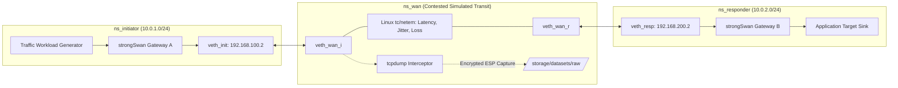

---

## 19. Dataset Factory

The automated dataset factory executes parameter sweeps across configurations, collecting synchronized captures and metadata:

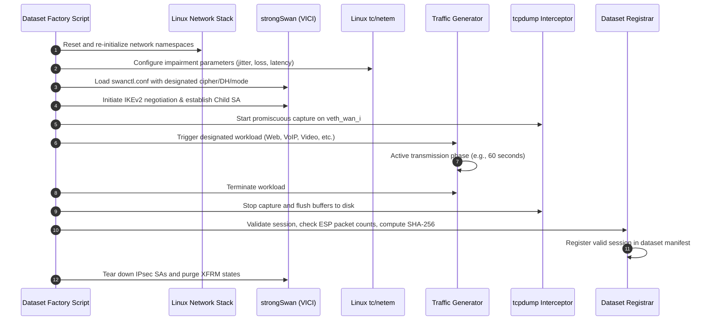

---

## 20. Traffic Workload Generation

Traffic workloads are generated using controlled, deterministic tooling:
- **Web (`C0`):** Automated headless browser (`playwright`) browsing top static/dynamic websites, executing sequential asset requests.
- **Video Streaming (`C1`):** `ffmpeg` streaming H.264/AAC media chunks over HTTP/RTSP to an echo sink.
- **VoIP (`C2`):** `sipp` generating bidirectional G.711 / Opus RTP packet streams with 20ms frame packetization intervals.
- **Chat / Messaging (`C3`):** Automated Python socket agent sending intermittent 50–300 byte payloads with Poisson-distributed idle intervals.
- **Email (`C4`):** Scripted `curl` / `smtplib` sending multipart MIME messages and checking IMAP mailboxes.
- **ICMP (`C5`):** Standard `ping` injecting 64-byte and 128-byte echo requests at fixed 1-second intervals.
- **File Transfer (`C6`):** `curl` / `rsync` pulling multi-megabyte binary blobs over SFTP/HTTPS saturating MTU.

---

## 21. Capture Points

The capture point architecture separates ground truth from the evaluation surface:
- **Point A (Plaintext Namespace / Loopback):** Captures application packets prior to IPsec encapsulation. Used strictly during lab development to confirm workload execution and verify ground-truth labels.
- **Point B (Contested Transit WAN / `veth_wan`):** Captures wire traffic traversing the simulated internet. Encapsulated in ESP (IP protocol 50) or UDP 4500 (NAT-T). **This is the exclusive input to the machine learning feature extraction pipeline.**

---

## 22. Ground Truth Methodology

Ground truth is established by construction rather than probabilistic post-hoc labeling:
1. Every experimental execution is initiated with a programmatic profile configuration binding `workload_type` directly to `ground_truth_label`.
2. A cryptographic SHA-256 hash of the generated traffic script, timestamp window, and process ID is linked to the capture record.
3. The dataset registrar asserts the label only if packet counters at Point A and Point B confirm successful transmission.

---

## 23. Dataset Session Model

A dataset session represents an atomic unit of experimental execution:

```
SessionRecord:
  session_id: UUIDv4
  dataset_version: VARCHAR (e.g., "v1.0.0")
  workload_type: VARCHAR ("VoIP", "Web", etc.)
  ground_truth_label: VARCHAR ("C2", "C0", etc.)
  ipsec_configuration:
    mode: "TUNNEL" | "TRANSPORT"
    ip_version: "IPv4" | "IPv6"
    ike_version: "2.0"
    encryption: "AES-GCM-256" | "AES-CBC-128" | "3DES"
    integrity: "NONE" | "HMAC-SHA256"
    dh_group: 14 | 19 | 20
    pfs: TRUE | FALSE
    nat_t: TRUE | FALSE
  network_conditions:
    latency_ms: INTEGER
    jitter_ms: INTEGER
    packet_loss_pct: FLOAT
    bandwidth_kbps: INTEGER
  capture_metrics:
    total_packets: INTEGER
    total_bytes: BIGINT
    start_time: TIMESTAMPTZ
    end_time: TIMESTAMPTZ
    sha256_hash: VARCHAR(64)
  quality_status: "VALID" | "INVALID" | "PARTIAL"
```

---

## 24. Dataset Quality Validation

Before a session is approved for inclusion in the training corpus, it must satisfy seven automated quality checks:
1. **Tunnel Liveness Check:** SAs were successfully negotiated and remained active throughout the session.
2. **ESP Encapsulation Check:** Wire capture contains $\ge 95\%$ ESP / UDP-4500 packets (excluding initial IKE handshakes).
3. **Volume Minimum:** Total packets meet the minimum threshold for the class (e.g., $\ge 30$ packets for Chat, $\ge 500$ packets for Video).
4. **Temporal Consistency:** Capture timestamps correlate with the workload generator execution window ($\pm 1.0$s).
5. **No Intermediate Tear-down:** No unexpected `DELETE` payloads or XFRM errors occurred during transmission.
6. **No File Corruption:** The raw PCAP file passes `pcap_check` without truncated frames.
7. **Unique Session Signature:** Hash of initial packet timing sequence differs from existing sessions (preventing accidental duplicate runs).

---

## 25. Dataset Versioning

- Datasets are released as immutable semantic versions (e.g., `v1.0.0-baseline`, `v1.1.0-impairments`).
- Once a dataset version tag is finalized, its session membership, parquet feature files, and partition splits are cryptographically locked via a manifest checksum.
- Models explicitly record the exact `dataset_version` upon which they were trained and calibrated.

---

## 26. Dataset Manifest

Each dataset release contains a digitally signed `manifest.json`:
```json
{
  "dataset_id": "IPsecFlowBench",
  "dataset_version": "v1.0.0",
  "created_at": "2026-09-22T18:00:00Z",
  "total_sessions": "Requires empirical validation",
  "total_flows": "Requires empirical validation",
  "class_distribution": {
    "Web": "Requires empirical validation",
    "Video": "Requires empirical validation",
    "VoIP": "Requires empirical validation",
    "Chat": "Requires empirical validation",
    "Email": "Requires empirical validation",
    "ICMP": "Requires empirical validation",
    "File_Transfer": "Requires empirical validation"
  },
  "configurations_covered": ["TUNNEL_AES_GCM_256", "TRANSPORT_AES_CBC_128_HMAC", "TUNNEL_3DES_SHA1"],
  "manifest_sha256": "TBD — Generated upon dataset lock"
}
```

---

## 27. Dataset Splitting

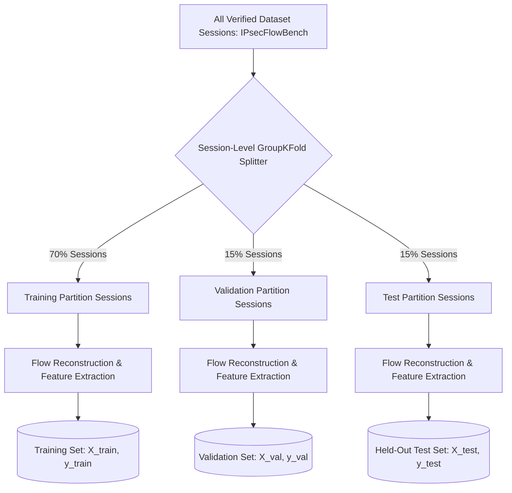

---

## 28. Session-Level Isolation

> [!CRITICAL]
> **ABSOLUTE LEAKAGE PROHIBITION:**  
> Partitioning must operate strictly on **Session IDs**, never on individual packets or flow rows.

- **The Danger of Packet-Level Splitting:** Packets belonging to the same flow or session share identical cryptographic IV patterns, server response characteristics, and temporal inter-packet arrival correlations. Splitting packets randomly into train and test creates catastrophic artificial accuracy ($\approx 99\%$) that collapses when deployed on real networks.
- **The Enforcement:** All flows derived from `session_id_A` reside exclusively in the Training partition, Validation partition, OR Test partition. No flow from `session_id_A` may cross partition boundaries.

---

## 29. Leakage Prevention

The feature extraction and training pipelines enforce strict isolation:
1. **No Artificial Feature Leakage:** Port numbers, IP addresses, session UUIDs, capture file paths, and testbed script names are strictly excluded from feature vectors.
2. **Fit-Transform Scoping:** Feature scalers, imputers, and normalization parameters are fitted exclusively on the Training set, then applied downstream to Validation and Test sets.
3. **Hyperparameter Isolation:** Tree depths, learning rates, and ensemble weights $\alpha$ are tuned exclusively on the Validation partition.
4. **Frozen Test Partition:** The Test partition is locked and touched only once during final evaluation reporting.

---

## 30. Class Balance

Because network applications inherently generate different volumes of traffic (e.g., Video streams generate thousands of packets; Chat generates dozens), class balance is managed thoughtfully:
- **Session-Level Balancing:** The dataset factory generates an approximately equal number of independent *sessions* per class.
- **Cost-Sensitive Weighting:** XGBoost loss functions apply inverse-frequency class weights:
  
  $$w_c = \frac{N}{M \cdot N_c}$$
  
  where $N$ is total training flows, $M$ is class count, and $N_c$ is flows in class $c$.

---

## 31. EDA (Exploratory Data Analysis)

Prior to model training, automated EDA scripts verify physical feature distributions:
- Histogram analysis of packet lengths verifying expected MTU peaks (e.g., 1420-byte peaks for File Transfer).
- Log-scale probability density plots of inter-arrival times confirming isochronous 20ms periodicity in VoIP streams.
- Correlation heatmaps checking for collinearity across statistical moments.

---

## 32. Bias / Shortcut Analysis

Automated statistical tests check for spurious correlations:
- **Endpoint Bias Check:** Mutual information between source/destination IP addresses and class labels must be statistically negligible.
- **Cipher Shortcut Check:** Verify that classification accuracy does not correlate with the underlying cipher (e.g., confirming the model is not relying on 16-byte block cipher padding artifacts to distinguish classes).

---

## 33. Flow Reconstruction

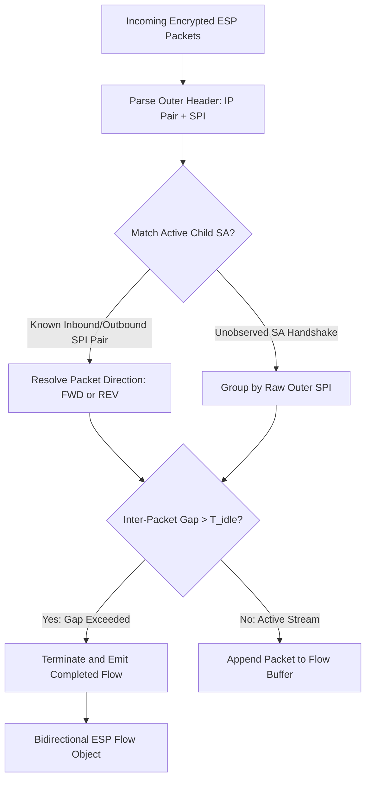

---

## 34. Flow Boundary Design

- **Flow Identification Key:** $K_{\text{flow}} = \{\text{Endpoint}_A, \text{Endpoint}_B, \text{SPI}_{\text{in}}, \text{SPI}_{\text{out}}\}$.
- **Idle Timeout ($T_{\text{idle}}$):** Default set to 120 seconds. If no packet is observed for 120 seconds, the flow is marked complete.
- **Active Timeout ($T_{\text{active}}$):** Long-running flows are segmented at 3600 seconds to prevent indefinite memory retention.

---

## 35. NAT-T Handling

When UDP encapsulation (port 4500) is detected:
- The parser strips the outer 8-byte UDP header to extract the 32-bit SPI and sequence number.
- The 8-byte UDP encapsulation overhead is accounted for during packet length normalization, ensuring NAT-T flows align with native ESP flows.

---

## 36. Rekey Handling

When an existing Child SA expires and rekeys:
- The protocol engine links the new Child SA to the preceding SA via the IKE `CREATE_CHILD_SA` message ID.
- **Flow Policy:** Flows remain bound to specific Child SA SPI pairs; logical session-level aggregation occurs at the reporting layer to preserve cryptographic lifecycle boundaries.

---

## 37. Partial Flow Handling

For captures starting mid-session (missing the initial IKE handshake):
- The engine reconstructs flows using the observed outer ESP SPI.
- A boolean flag `is_partial_flow = TRUE` is asserted.
- The flow remains eligible for ML classification, but IKE configuration auditing marks associated SA parameters as `UNKNOWN`.

---

## 38. Feature Engineering

The feature extraction subsystem compiles two parallel representations from each reconstructed ESP flow:
1. **Tabular Statistical Features:** A 24-dimensional continuous vector capturing macroscopic flow statistics, distributions, and burst characteristics.
2. **Sequential Spatial Tensor:** A continuous $(3, N)$ matrix capturing early packet-by-packet physical dynamics.

---

## 39. Feature Catalogue

| Feature ID | Feature Name | Category | Mathematical Definition / Calculation | Unit | Directional? | Missing Handling | Normalization | Leakage Risk | Model Usage |
| :--- | :--- | :--- | :--- | :--- | :--- | :--- | :--- | :--- | :--- |
| `F01` | `duration_ms` | Flow | $t_{\text{last}} - t_{\text{first}}$ | ms | No | Zero if 1 packet | Log1p transform | None | XGBoost |
| `F02` | `total_packets` | Flow | $K_{\text{fwd}} + K_{\text{rev}}$ | count | No | Never missing | RobustScaler | None | XGBoost |
| `F03` | `total_bytes` | Flow | $\sum_{i=1}^K \text{length}(p_i)$ | bytes | No | Never missing | RobustScaler | None | XGBoost |
| `F04` | `fwd_pkt_ratio` | Directional| $K_{\text{fwd}} / (K_{\text{fwd}} + K_{\text{rev}})$ | ratio | Yes | $0.5$ if zero pkts | Bounded $[0, 1]$| None | XGBoost |
| `F05` | `byte_direction_ratio`| Directional| $\sum \text{len}_{\text{fwd}} / \sum \text{len}_{\text{total}}$ | ratio | Yes | $0.5$ if zero bytes| Bounded $[0, 1]$| None | XGBoost |
| `F06` | `pkt_len_mean` | Size | $\frac{1}{K} \sum_{i=1}^K L_i$ | bytes | No | Never missing | Standardize | None | XGBoost |
| `F07` | `pkt_len_std` | Size | $\sqrt{\frac{1}{K} \sum (L_i - \bar{L})^2}$ | bytes | No | $0.0$ if $K=1$ | Standardize | None | XGBoost |
| `F08` | `pkt_len_skew` | Size | Fisher-Pearson coefficient $\frac{m_3}{m_2^{3/2}}$ | scalar| No | $0.0$ if std=0 | Clip $[-3, 3]$ | None | XGBoost |
| `F09` | `pkt_len_p10` | Size | 10th percentile of packet sizes | bytes | No | $L_1$ if $K=1$ | Standardize | None | XGBoost |
| `F10` | `pkt_len_p25` | Size | 25th percentile of packet sizes | bytes | No | $L_1$ if $K=1$ | Standardize | None | XGBoost |
| `F11` | `pkt_len_median` | Size | 50th percentile of packet sizes | bytes | No | $L_1$ if $K=1$ | Standardize | None | XGBoost |
| `F12` | `pkt_len_p75` | Size | 75th percentile of packet sizes | bytes | No | $L_1$ if $K=1$ | Standardize | None | XGBoost |
| `F13` | `pkt_len_p90` | Size | 90th percentile of packet sizes | bytes | No | $L_1$ if $K=1$ | Standardize | None | XGBoost |
| `F14` | `iat_mean_ms` | Timing | $\frac{1}{K-1} \sum_{i=2}^K (t_i - t_{i-1})$ | ms | No | $0.0$ if $K=1$ | Log1p transform | None | XGBoost |
| `F15` | `iat_std_ms` | Timing | Standard deviation of IATs | ms | No | $0.0$ if $K < 3$ | Log1p transform | None | XGBoost |
| `F16` | `iat_max_ms` | Timing | Maximum inter-packet arrival time | ms | No | $0.0$ if $K=1$ | Log1p transform | None | XGBoost |
| `F17` | `fwd_iat_mean_ms`| Timing | Mean IAT of forward packet stream | ms | Yes | $0.0$ if $K_{\text{fwd}} < 2$| Log1p transform | None | XGBoost |
| `F18` | `rev_iat_mean_ms`| Timing | Mean IAT of reverse packet stream | ms | Yes | $0.0$ if $K_{\text{rev}} < 2$| Log1p transform | None | XGBoost |
| `F19` | `packets_per_second`| Rate | $K / (\text{duration} + \epsilon)$ | pkt/s | No | $0.0$ if dur=0 | RobustScaler | None | XGBoost |
| `F20` | `bytes_per_second`| Rate | $\text{Bytes} / (\text{duration} + \epsilon)$ | byte/s| No | $0.0$ if dur=0 | RobustScaler | None | XGBoost |
| `F21` | `burst_count` | Burst | Count of packet trains with IAT $< 5$ms | count | No | $0$ | RobustScaler | None | XGBoost |
| `F22` | `burst_mean_bytes`| Burst | Average byte volume per burst train | bytes | No | $0.0$ if no bursts| RobustScaler | None | XGBoost |
| `F23` | `idle_ratio` | Idle | $\sum \text{IAT}_{>500\text{ms}} / \text{duration}$ | ratio | No | $0.0$ if no idles | Bounded $[0, 1]$| None | XGBoost |
| `F24` | `first_10_bytes` | Early | Sum of bytes in first 10 packets | bytes | No | Sum of available| Standardize | None | XGBoost |
| `S01` | `seq_direction` | Sequence | Normalized direction: $+1.0$ (Fwd), $-1.0$ (Rev)| scalar| Yes | Padded with $0.0$| Native $[-1, 1]$| None | 1D-CNN |
| `S02` | `seq_length` | Sequence | Wire packet length divided by MTU ($1500$) | ratio | No | Padded with $0.0$| MinMax $[0, 1]$ | None | 1D-CNN |
| `S03` | `seq_delta_time` | Sequence | Clipped inter-arrival time $\min(\Delta t, 1.0)$ | seconds| No | Padded with $0.0$| Bounded $[0, 1]$| None | 1D-CNN |

---

## 40. Feature Leakage Audit

Prior to training, an automated audit script validates feature integrity:
- Verifies zero inclusion of IP addresses, MAC addresses, port numbers, or transport protocol tags.
- Asserts that no feature contains constant or identifier strings derived from capture filenames or scenario keys.

---

## 41. Preprocessing

- **Tabular Features:** Continuous variables with heavy tails (`duration_ms`, `iat_mean_ms`, `bytes_per_second`) undergo a monotonic logarithmic transform: $\tilde{x} = \log(1 + x)$. Remaining features are scaled using `RobustScaler` (centering by median and scaling by interquartile range) to mitigate outlier distortion.
- **Sequence Tensors:** Padded or truncated to length $N$ using zero-padding on the right.

---

## 42. XGBoost Design

- **Algorithm:** Extreme Gradient Boosting (`xgboost.XGBClassifier`).
- **Objective:** Multi-class classification via softmax objective: `objective="multi:softprob"`, `num_class=7`.
- **Search Space for Tuning:**
  - `max_depth`: $\{4, 6, 8\}$
  - `learning_rate`: $\{0.01, 0.05, 0.1\}$
  - `n_estimators`: $\{100, 200, 300\}$
  - `subsample`: $\{0.7, 0.8, 0.9\}$
  - `colsample_bytree`: $\{0.7, 0.8, 1.0\}$
- **Explainability:** Exact Shapley values computed via native `xgboost.predict(pred_contribs=True)` in sub-millisecond execution times.

---

## 43. 1D-CNN Design

The lightweight convolutional network captures spatial-temporal patterns across the early packet handshake:

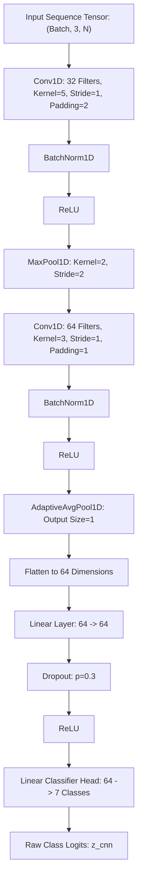

---

## 44. Sequence Representation

The spatial-temporal matrix encodes the first $N$ packets as a continuous 2D tensor of shape $(3, N)$:
- **Channel 0 (Direction):** $+1.0$ for client-to-server (forward), $-1.0$ for server-to-client (reverse).
- **Channel 1 (Normalized Size):** $\text{Length}(p_i) / 1500.0$.
- **Channel 2 (Normalized Delta-Time):** $\min(t_i - t_{i-1}, 1.0)$.

---

## 45. Sequence-Length Experiments

The parameter $N$ balances early classification speed against asymptotic accuracy:
- **Candidate Lengths:** $N \in \{32, 64, 128\}$.
- **Experimental Tradeoff:**
  - $N=32$: Fast inference, ideal for immediate classification after handshake, but may struggle with delayed video streaming bursts.
  - $N=64$ (Working Default): Strong representation of initial protocol negotiation and early transfer dynamics.
  - $N=128$: Richer temporal context, but increases time-to-decision and memory consumption.
- **Selection Rule:** Final $N$ will be selected based on the knee point of the Macro-F1 vs. $N$ validation curve (`Requires controlled experimentation`).

---

## 46. Ensemble / Fusion

The platform fuses the complementary strengths of tabular distribution statistics (XGBoost) and early sequential dynamics (1D-CNN):

```mermaid
graph TD
    FLOW[ESP Flow] --> EXT_TAB[Extract 24 Tabular Features]
    FLOW --> EXT_SEQ[Extract (3, N) Sequence Tensor]
    
    EXT_TAB --> XGB[XGBoost Classifier]
    EXT_SEQ --> CNN[PyTorch 1D-CNN]
    
    XGB --> LOG_XGB[XGBoost Logits / Softmax]
    CNN --> LOG_CNN[1D-CNN Logits / Softmax]
    
    LOG_XGB & LOG_CNN --> FUSION_GATE["Ensemble Fusion Gate:<br>P_fused = alpha * P_xgb + (1 - alpha) * P_cnn"]
    
    FUSION_GATE --> PLATT[Platt Temperature Scaling Gate]
    PLATT --> CAL_PROB[Calibrated Probabilities]
```

- **Weight Parameter ($\alpha$):** Continuous coefficient $\alpha \in [0.0, 1.0]$ optimized via grid search on the held-out validation set to minimize cross-entropy loss.

---

## 47. Confidence Calibration

> [!CRITICAL]
> **CONFIDENCE IS NOT RAW PROBABILITY:**  
> Uncalibrated softmax outputs are notoriously overconfident on out-of-distribution network traces. Displayed AI Confidence must derive from post-hoc calibrated estimators.

Fused logits $\mathbf{z}$ are calibrated using **Platt Temperature Scaling**:

$$\hat{P}(y = c \mid \mathbf{z}) = \frac{\exp(z_c / T)}{\sum_{j=1}^M \exp(z_j / T)}$$

- **Temperature Tuning:** The scalar parameter $T > 0$ is optimized using Nelder-Mead on the Validation set to minimize negative log-likelihood (NLL).
- **Evaluation Criteria:** Calibration quality is verified via Expected Calibration Error (ECE) with $B=10$ bins:
  
  $$\text{ECE} = \sum_{b=1}^B \frac{|B_b|}{N} \left| \text{acc}(B_b) - \text{conf}(B_b) \right|$$

---

## 48. AI Confidence Score

The analyst-facing **AI Confidence Score** ($0.0\% - 100.0\%$) is formally defined as the calibrated posterior probability of the predicted class:

$$\text{AI Confidence} = \max_{c \in \mathcal{Y}} \hat{P}(y = c \mid \mathbf{x}) \times 100$$

It reflects the true empirical likelihood that the classification is correct.

---

## 49. OOD / Unknown Detection

To protect against open-set vulnerability where unmodeled traffic (e.g., Tor, BitTorrent, novel malware) is forced into standard classes:

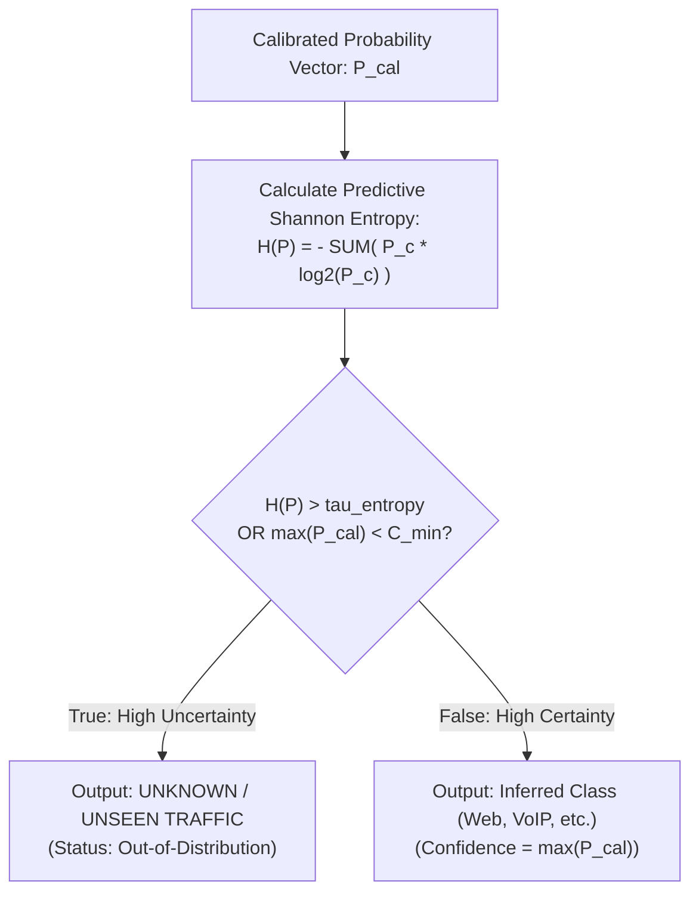

- **Threshold Tuning:** The entropy threshold $\tau_{\text{entropy}}$ is tuned on a holdout validation set containing controlled OOD traffic to achieve $\ge 90\%$ OOD detection while maintaining $\le 5\%$ false rejection of known classes (`Requires empirical validation`).

---

## 50. Explainability / SHAP

For every tabular prediction made by XGBoost, the platform computes exact Shapley feature attributions:

$$f(\mathbf{x}) = \phi_0 + \sum_{i=1}^{24} \phi_i$$

- **Analyst Utility:** The top 5 positive and negative feature attributions $\phi_i$ are streamed to the frontend and rendered as an interactive waterfall plot.
- **Physical Plausibility Verification:** Allows security analysts to verify that an application classification is driven by legitimate physical side channels (e.g., confirming that a VoIP inference was driven by low `iat_std_ms` and symmetric `byte_direction_ratio`).

---

## 51. Behavioral Anomaly Detection

- **Subsystem Separation:** Behavioral anomaly detection operates completely independently of the supervised application classifier.
- **Model:** Unsupervised **Isolation Forest** (`scikit-learn`) trained on baseline benign enterprise traffic.
- **Signals Evaluated:**
  - Extreme packet rate surges ($\text{pps} > 3\sigma$).
  - Asymmetric byte-to-packet ratios.
  - Abnormal rekey frequency or zero-byte packet flood trains.
- **Formal Designation:** Output is explicitly labeled as **`Statistical Behavioral Anomaly`**, never as a confirmed cyber attack.

---

## 52. Metadata Fingerprintability

Problem Statement 26160 requires assessing traffic metadata exposure. The platform synthesizes an empirical **Metadata Fingerprintability Index ($0 - 100$)**:
- **Concept:** Measures how distinguishable an encrypted tunnel's traffic remains to an eavesdropper based on packet timing, sizes, and burst dynamics.
- **Formulation:**
  
  $$\text{Fingerprintability} = 100 \times \left( w_1 \cdot \text{Conf}_{\text{cal}} + w_2 \cdot (1 - \hat{H}_{\text{norm}}) + w_3 \cdot \text{Sep}_{\text{burst}} \right)$$
  
  *(where weights $w_i$ are normalized, $\text{Conf}_{\text{cal}}$ is calibrated classifier certainty, and $\hat{H}_{\text{norm}}$ is normalized packet-size entropy).*
- **Semantic Rule:** A score of 85 denotes high side-channel distinguishability; it is **never described as 85% of plaintext leaked**.

---

## 53. ML Training Pipeline

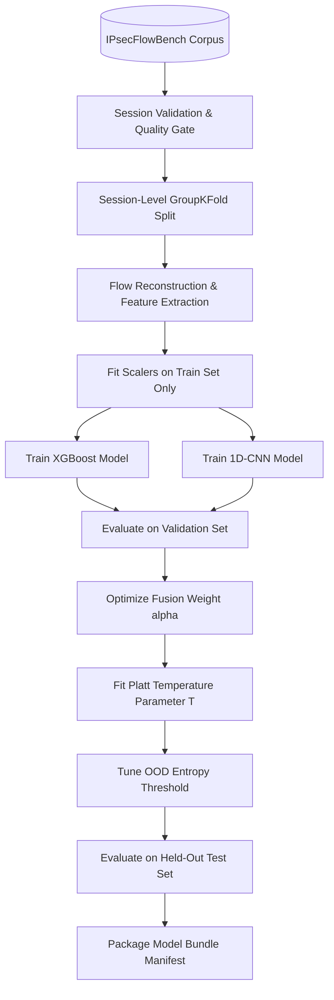

---

## 54. Hyperparameter Strategy

- Hyperparameters are optimized via **5-Fold Session-Grouped Cross-Validation** on the training partition.
- Grid search and Bayesian optimization (`Optuna`) explore candidate parameter spaces.
- The objective function maximizes Macro-F1 while penalizing Expected Calibration Error (ECE).

---

## 55. Model Selection

Model promotion requires satisfying multi-dimensional criteria:
1. **Macro-F1 Superiority:** The candidate model must exceed existing baselines across all seven target classes.
2. **Calibration Bound:** Expected Calibration Error must be below the validated operational threshold ($\text{ECE} \le 0.08$).
3. **Inference Latency Bound:** P95 CPU inference latency must remain under $50\text{ms}$ per flow.
4. **Generalization Stability:** Performance must not degrade by more than $15\%$ when evaluated on cross-configuration test partitions.

---

## 56. Evaluation Methodology

Evaluation follows a strict protocol ensuring zero data contamination:
- **Partition Independence:** Metrics are computed exclusively on the held-out Test set.
- **Session Grouping:** Flows are aggregated and reported per session to evaluate variance across independent executions.
- **Reporting Standard:** All results document Macro-F1, per-class F1, Confusion Matrices, and Calibration Curves.

---

## 57. Metrics

The evaluation suite computes:
- **Macro-F1 Score:** Unweighted mean of F1 scores across all classes, preventing majority class dominance:
  
  $$\text{Macro-F1} = \frac{1}{M} \sum_{c=1}^M \frac{2 \cdot \text{Precision}_c \cdot \text{Recall}_c}{\text{Precision}_c + \text{Recall}_c}$$

- **Per-Class Precision & Recall:** Granular detection tracking for critical low-volume classes (VoIP, Chat).
- **Confusion Matrix:** Full $7 \times 7$ normalized contingency matrix identifying specific class confusions.

---

## 58. Calibration Evaluation

Calibration performance is verified using:
- **Reliability Diagrams:** Visualizing empirical accuracy versus predicted confidence across 10 confidence bins.
- **Brier Score:** Mean squared difference between predicted probabilities and one-hot true class vectors:
  
  $$\text{Brier} = \frac{1}{N} \sum_{i=1}^N \sum_{c=1}^M (P_{ic} - y_{ic})^2$$

---

## 59. OOD Evaluation

Open-set detection capability is benchmarked on dedicated holdout sessions:
- **AUROC:** Area Under the Receiver Operating Characteristic curve for distinguishing in-distribution enterprise traffic from out-of-distribution traces.
- **False Positive Rejection Rate:** Tracking the percentage of valid known flows mistakenly flagged as `UNKNOWN` (target: $\le 5\%$).

---

## 60. Confusion Analysis

Evaluation pipelines inspect pairwise confusion patterns:
- **Web vs. Chat:** Evaluates whether small HTTPS REST queries confuse with messaging keepalives.
- **Video vs. File Transfer:** Evaluates whether sustained MTU packet trains in video streaming confuse with bulk SFTP transfers (resolved by checking burst periodicity).

---

## 61. Ablation Studies

Ablation experiments evaluate the predictive power of individual feature families:
- **Ablation 1:** Tabular features without packet length statistics (evaluates timing alone).
- **Ablation 2:** Tabular features without inter-arrival time statistics (evaluates sizing alone).
- **Ablation 3:** 1D-CNN without directional channels.
- **Outcome:** Validates that multi-modal feature combinations significantly outperform single-dimension side channels.

---

## 62. Cross-Configuration Generalization

Models must generalize across different IPsec encapsulation configurations:
- **Experiment:** Train on Tunnel Mode AES-GCM-256; evaluate on Transport Mode AES-CBC-128.
- **Objective:** Ensure models learn intrinsic application dynamics rather than fixed cipher block padding or tunnel header artifacts.

---

## 63. Cross-Endpoint Robustness

- **Methodology:** Training sessions originate from IP subnet $A$; test sessions originate from independent IP subnet $B$.
- **Validation:** Confirms the model has not memorized MAC or IP bit patterns.

---

## 64. Network-Condition Robustness

Models are evaluated across varying network impairments injected via `tc/netem`:
- **Latency Sweep:** $0\text{ms}, 50\text{ms}, 150\text{ms}$.
- **Jitter Sweep:** $0\text{ms}, 10\text{ms}, 30\text{ms}$.
- **Packet Loss Sweep:** $0\%, 1\%, 3\%$.
- **Objective:** Ensure classifier performance degrades gracefully under poor WAN conditions.

---

## 65. Early Classification

Evaluating classification performance at early packet horizons:
- Accuracy evaluated at packet thresholds $K \in \{10, 20, 32, 64\}$.
- Demonstrates the platform's capability to provide provisional traffic classifications within the first 2 seconds of flow initiation.

---

## 66. Baseline Models

To mathematically prove the necessity of the dual ensemble, performance is compared against standard baselines:
1. **Majority Class Predictor:** Naive baseline establishing minimum accuracy threshold.
2. **Logistic Regression (L2 Regularized):** Linear baseline operating on tabular features.
3. **Random Forest (100 Trees):** Standard non-gradient boosted tree baseline.

---

## 67. Experimental Design

| Dimension | Role | Implementation |
| :--- | :--- | :--- |
| **Independent Variables** | Varied Parameters | Application Workload, IPsec Mode, Cipher Suite, Netem Impairments |
| **Dependent Variables** | Observed Metrics | Macro-F1, Calibration Error (ECE), OOD AUROC, Inference Latency |
| **Controlled Variables** | Kept Constant | Hardware CPU, Linux Kernel Version, Flow Timeout Windows |
| **Randomization** | Bias Mitigation | Randomized session ordering, randomized workload execution times |

---

## 68. Experiment Matrix

| Experiment ID | Research Question | Model | Training Set | Validation Set | Test Set | Success Metric | Status |
| :--- | :--- | :--- | :--- | :--- | :--- | :--- | :--- |
| `EXP-01` | Tabular baseline performance | XGBoost | Train-v1.0 (70%) | Val-v1.0 (15%) | Test-v1.0 (15%) | Macro-F1 $\ge 0.85$ | `PLANNED` |
| `EXP-02` | Sequence length evaluation | 1D-CNN | Train-v1.0 (70%) | Val-v1.0 (15%) | Test-v1.0 (15%) | Optimal $N \in \{32, 64, 128\}$| `PLANNED` |
| `EXP-03` | Ensemble superiority proof | XGB + CNN | Train-v1.0 (70%) | Val-v1.0 (15%) | Test-v1.0 (15%) | Ensemble F1 > Single F1 | `PLANNED` |
| `EXP-04` | Calibration effectiveness | Platt Scaling| Val-v1.0 | Val-v1.0 | Test-v1.0 | $\text{ECE} \le 0.08$ | `PLANNED` |
| `EXP-05` | OOD rejection accuracy | Entropy Gate | Train-v1.0 | Val-OOD | Test-OOD | OOD AUROC $\ge 0.90$ | `PLANNED` |
| `EXP-06` | Cross-cipher generalization | Ensemble | AES-GCM Train | AES-GCM Val | AES-CBC Test | $\Delta \text{F1} \le 15\%$ | `PLANNED` |
| `EXP-07` | Network impairment resilience| Ensemble | Clean Train | Clean Val | Netem Test | Graceful curve | `PLANNED` |
| `EXP-08` | Feature ablation study | XGBoost | Ablated Train | Ablated Val | Ablated Test | Feature importance rank | `PLANNED` |
| `EXP-09` | Anomaly detection baseline | IsoForest | Clean Baseline | Clean Val | Perturbed Test | Anomaly detection rate | `PLANNED` |

---

## 69. Reproducibility

Reproducibility is enforced through immutable experiment tracking:
- Every training script accepts an explicit `--seed 42` argument.
- Exact software dependencies are pinned via Docker container images.
- Every generated model artifact embeds the cryptographic SHA-256 hash of its training dataset manifest.

---

## 70. Experiment Tracking

Experiment results are cataloged locally in structured JSON records:
```
/storage/experiments/{experiment_id}/
├── config.yaml
├── training.log
├── metrics_summary.json
├── confusion_matrix.png
├── reliability_diagram.png
└── model_weights/
```

---

## 71. Dataset Cards

Every dataset version includes a formal **Dataset Card** documenting:
- **Data Subject:** Synthetic and scripted enterprise application traffic traversing strongSwan IPsec tunnels.
- **Collection Methodology:** Automated Linux namespace traffic generation with `veth` packet sniffing.
- **Sensitive Content:** Zero personal identity, credential, or real user content contained in payloads.
- **Known Limitations:** Scripted headless browser traffic may exhibit lower burst variance than human operators.

---

## 72. Model Cards

Every promoted model release includes a formal **Model Card** documenting:
- **Model Architecture:** Dual Ensemble (XGBoost 2.0 + 1D-CNN TorchScript).
- **Intended Purpose:** Encrypted IPsec traffic classification for forensic security audits.
- **Prohibited Uses:** Wiretapping, payload surveillance, or direct security compliance grading.
- **Performance Summary:** Macro-F1, ECE, and tested cross-configuration bounds (`To be populated post-experimentation`).

---

## 73. Model Registry

Approved models are cataloged in the operational database (`model_bundles` table):
- **Versioning Scheme:** Semantic versioning (`model-v1.0.0`, `model-v1.1.0`).
- **State Machine:** `EXPERIMENTAL` $\rightarrow$ `VALIDATED` $\rightarrow$ `APPROVED` $\rightarrow$ `ACTIVE` $\rightarrow$ `RETIRED`.
- **Active Guarantee:** Exactly one model bundle is tagged `is_active = TRUE` for live production inference.

---

## 74. Model Artifact Packaging

Production models are packaged into self-contained directory bundles:
```
model-v1.0.0/
├── manifest.json
├── xgboost_model.json
├── cnn_spatial.pt
├── feature_schema.json
├── preprocessor_params.json
└── calibration_params.json
```

---

## 75. Model Promotion

Promotion from `VALIDATED` to `ACTIVE` requires:
1. Passing all automated unit and integration tests.
2. Verification that calibration error $\text{ECE} \le 0.08$.
3. Formal electronic sign-off by the ML Validation Lead recorded in `audit_events`.

---

## 76. Model Rollback

If production monitoring flags severe performance degradation:
- The system administrator executes a single atomic command: `tunneltrace-admin model activate --version model-v0.9.0`.
- Workers hot-reload the prior model bundle within 5 seconds without server restart.

---

## 77. Runtime Inference Pipeline

```mermaid
graph TD
    FLOW[Reconstructed ESP Flow] --> EXT[Feature Extractor Service]
    
    EXT --> VEC_TAB[24 Tabular Features]
    EXT --> TENS_SEQ[(3, N) Sequence Tensor]
    
    VEC_TAB --> PRE_TAB[Apply Stored Preprocessing Scalers]
    TENS_SEQ --> PRE_SEQ[Apply MinMax Scaling & Padding]
    
    PRE_TAB --> XGB[XGBoost Predictor]
    PRE_SEQ --> CNN[PyTorch CPU Predictor]
    
    XGB --> P_XGB[Softmax Probabilities: P_xgb]
    CNN --> P_CNN[Softmax Probabilities: P_cnn]
    
    P_XGB & P_CNN --> FUSE[Weighted Linear Fusion: alpha=0.6]
    FUSE --> CALIB[Platt Scaling: Temperature T=1.25]
    
    CALIB --> GATE{Entropy > Threshold?}
    
    GATE -->|Yes| OUT_UNK[Class: UNKNOWN / UNSEEN]
    GATE -->|No| OUT_KNOWN[Class: Argmax Class]
    
    OUT_KNOWN --> SHAP_EXP[Execute TreeSHAP for Top 5 Attributions]
    SHAP_EXP --> PERSIST[(Save to Database & Push WebSocket)]
```

---

## 78. Batch Inference

For offline PCAP file uploads:
- Celery workers process flows in vectorized batches of 256 flows.
- Tabular features are compiled into NumPy matrices; XGBoost executes parallel inference across all available CPU threads.

---

## 79. Live Inference

For live interface captures:
- Flows are monitored dynamically.
- When an active flow reaches packet count $K \ge 32$ or hits an idle window ($t_{\text{gap}} \ge 2.0\text{s}$), a **Provisional Classification** is generated and streamed to the UI.
- Upon flow termination ($T_{\text{idle}} \ge 120\text{s}$), the **Final Classification** is computed and committed to PostgreSQL.

---

## 80. Degraded Inference

If the PyTorch runtime encounters memory or thread exhaustion:
- The pipeline gracefully degrades to **XGBoost-Only Mode** ($\alpha = 1.0$).
- If feature extraction fails entirely, the pipeline returns `INFERENCE_UNAVAILABLE`.
- **System Isolation:** Failure of the ML inference subsystem **never aborts** the deterministic protocol dissection or security policy evaluation pipelines.

---

## 81. ML Error Handling

| Failure Scenario | Detection Mechanism | Recovery Action | Operational Visibility |
| :--- | :--- | :--- | :--- |
| Flow has $< 3$ packets | Feature extractor length check | Skip ML; mark `INSUFFICIENT_DATA` | Flow status labeled in UI |
| NaN / Infinite feature value | Preprocessing assertion | Impute median; log warning | Diagnostic event logged |
| Model weights file missing | Worker startup healthcheck | Refuse task; fallback to degraded | System alert raised |
| OOD configuration missing | Inference engine validation | Use conservative default $\tau=1.5$ | Warning in analysis log |
| TorchScript execution error | Try-except execution block | Fallback to XGBoost-only mode | Error flag on flow record |

---

## 82. ML $\rightarrow$ Product Integration

ML outputs are integrated into five product surfaces:
1. **Traffic Intelligence View:** Sunburst charts and time-series area plots rendering application distributions.
2. **SA Explorer:** Child SA cards display inferred multiplexed traffic categories.
3. **Metadata Exposure Scorecard:** Calibrated certainty and entropy feed the Metadata Fingerprintability Index.
4. **Evidence Explorer:** Inferences link to TreeSHAP waterfall charts justifying predictions.
5. **PDF Reports:** Executive summaries display traffic distribution breakdowns.

---

## 83. ML Provenance

Every inference record committed to PostgreSQL stores complete provenance references:
- `analysis_id`, `flow_id`.
- `model_bundle_version` (e.g., `'model-v1.0.0'`).
- `feature_schema_version` (e.g., `'feat-v1.0'`).
- Cryptographic SHA-256 hash of the active model weights.

---

## 84. Dataset $\rightarrow$ Model Lineage

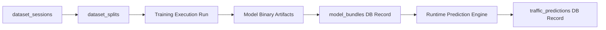

---

## 85. Privacy

- **Payload Exclusion:** The feature engineering pipeline reads only outer IP and ESP header bytes. Inner cleartext payload bytes are never extracted, transformed, or stored.
- **Local-First Boundary:** All feature extraction and model inference execute locally within containerized workers. No packet traces or feature vectors are transmitted to external third-party cloud APIs.

---

## 86. Data Security

- Local dataset volumes (`/storage/datasets/`) enforce POSIX file permissions restricted to the `tunneltrace` worker user (`0640`).
- Database tables storing dataset metadata enforce strict foreign key constraints preventing orphaned or unauthorized records.

---

## 87. Model Security

- Serialized model files (`.json`, `.pt`) are verified against stored SHA-256 digests prior to execution.
- Arbitrary pickle loading (`pickle.load`) is strictly prohibited; models utilize secure formats (`XGBoost JSON` and `TorchScript`).

---

## 88. Drift / Retraining Future Strategy

- In enterprise production, background workers monitor the rolling 7-day **Unknown Traffic Rate**.
- If the percentage of flows marked `UNKNOWN` exceeds $20\%$, a notification alerts operators that domain drift has occurred and initiates a scheduled retraining workflow.

---

## 89. SIH Prototype Scope

The core prototype delivering the required SIH 2026 functionality includes:
- Automated multi-namespace strongSwan testbed generating valid ground-truth sessions.
- Tabular feature extraction (24 features) and XGBoost classification.
- Sequence tensor extraction and 1D-CNN classification.
- Fused probability calibration and Shannon entropy OOD gating.
- Interactive TreeSHAP feature attribution waterfall plots.
- Complete local CPU-optimized execution on Docker Compose.

---

## 90. High-Value Differentiators

Features elevating [PROJECT NAME] beyond standard hackathon solutions:
- **Session-Level Grouping:** Absolute prevention of train/test data leakage.
- **Calibrated Uncertainty:** Mathematically defensible confidence scores.
- **True OOD Rejection:** Robust open-set handling preventing forced misclassifications.
- **Physical Explainability:** Concrete SHAP proof linking predictions to side channels.
- **Closed-Loop Verification:** Dynamic re-testing of remediated VPN configurations.

---

## 91. Future Research

Long-term research avenues reserved for post-hackathon development:
- **IP-TFS (RFC 9347) Evaluation:** Measuring the quantitative reduction in Metadata Fingerprintability when IPsec Traffic Flow Confidentiality is enabled.
- **Transformer Architectures:** Benchmarking lightweight spatial-temporal transformers against the 1D-CNN baseline.
- **Hardware Acceleration:** Compiling models via ONNX Runtime for edge SmartNIC offloading.

---

## 92. PS Requirement $\rightarrow$ ML/Data Matrix

| PS 26160 Requirement Clause | ML / Data Subsystem Responsibility | Method / Technical Approach | Primary Output | Non-ML Boundary Enforced |
| :--- | :--- | :--- | :--- | :--- |
| **Traffic Classes: VoIP, Web, Video, etc.**| Supervised Encrypted Traffic Classifier | XGBoost + 1D-CNN Dual Ensemble | Categorical Class Label | Never decrypts payload |
| **WhatsApp / Messaging Simulation** | Chat / Messaging Class Modeling | Controlled socket keepalive generation| `Chat / Messaging` Label | No WhatsApp protocol crack |
| **Traffic Inside ESP Prediction** | Flow Reconstruction & Feature Pipeline| Side-channel statistical extraction | Predicted Application Category | Observable headers ignored by ML |
| **AI Confidence Score** | Confidence Calibration Engine | Platt Temperature Scaling ($T$) | Calibrated Confidence % | Raw softmax prohibited |
| **Metadata Exposure Analysis** | Metadata Fingerprintability Engine | Entropy & distinguishability metrics| Exposure Index (0–100) | Not plaintext leakage % |
| **Testbed Traffic Permutations** | Automated Dataset Factory | Multi-namespace strongSwan sweep | `IPsecFlowBench` Dataset | Configurations parsed via TShark |
| **Security Compliance Analysis** | **NON-ML SUBSYSTEM** | **Deterministic YAML Policy Engine** | **NIST SP 800-77 Findings** | **ML DOES NOT GRADE SECURITY** |

---

## 93. SIH Demo ML Flow

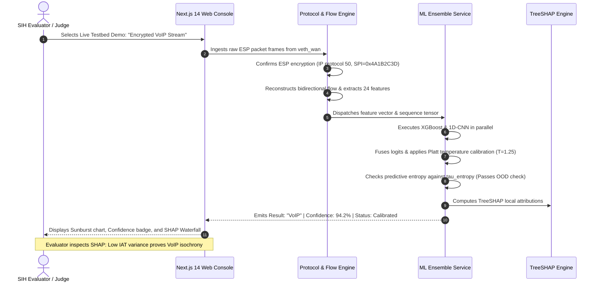

---

## 94. ML Acceptance Criteria

| Criteria Category | Requirement | Validation Method | Target Threshold |
| :--- | :--- | :--- | :--- |
| **Data Integrity** | Zero session leakage between partitions | Automated script verifying disjoint `session_id` sets | $100\%$ Disjoint |
| **Classification Quality** | Superiority over naive baselines | Evaluated on held-out Test set | Macro-F1 $\ge 0.85$ (`Requires empirical validation`) |
| **Probability Calibration** | Posterior probability matches empirical accuracy | Reliability diagram & Expected Calibration Error | $\text{ECE} \le 0.08$ |
| **Open-Set Safety** | Rejection of unmodeled traffic classes | Evaluation against held-out OOD dataset | AUROC $\ge 0.90$ |
| **Explainability** | Mathematical feature justification | Exact TreeSHAP attribution generation | Generated for $100\%$ of predictions |
| **Inference Efficiency** | Low latency commodity execution | P95 latency benchmark on single CPU core | $\le 50\text{ms}$ per flow |

---

## 95. Technical Decision Log

| Decision ID | Decision Made | Rationale | Alternatives Considered |
| :--- | :--- | :--- | :--- |
| `ML-DEC-01` | Dual Ensemble: XGBoost + 1D-CNN | Blends macroscopic tabular distributions with spatial early-packet dynamics. | Pure Random Forest, Pure Transformer |
| `ML-DEC-02` | Session-Level GroupKFold Split | Network packets from same session leak correlation; session split guarantees generalization. | Random packet-level split |
| `ML-DEC-03` | Platt Temperature Calibration | Softmax outputs are overconfident; temperature scaling aligns confidence with real accuracy. | Isotonic regression, Raw softmax |
| `ML-DEC-04` | Entropy-Based OOD Gate | Prevents forced misclassification of novel malware or unmodeled protocols. | Forced closed-world classification |
| `ML-DEC-05` | Native IPsec Dataset as Primary | UNB ISCXVPN2016 uses OpenVPN; only native strongSwan captures reflect real ESP behavior. | Exclusively using public datasets |
| `ML-DEC-06` | TreeSHAP for Explainability | Fast, mathematically exact local feature attribution for tree models. | LIME, Saliency maps |
| `ML-DEC-07` | CPU-Optimized Inference | Eliminates mandatory GPU requirement for evaluator laptops and deployment. | Mandatory CUDA GPU runtime |

---

## 96. Risks & Mitigations

| Risk ID | Risk Description | Severity | Likelihood | Technical Mitigation |
| :--- | :--- | :--- | :--- | :--- |
| **MR-01** | Model memorizes endpoint IP addresses instead of traffic patterns | High | Medium | Strip all IP and MAC fields prior to feature compilation; cross-endpoint testing. |
| **MR-02** | Testbed network impairments cause classification failure | Medium | High | Train on diverse netem impairment profiles; evaluate robustness curve. |
| **MR-03** | Short flows lack sufficient packets for 1D-CNN sequence tensor | Medium | High | Graceful zero-padding; fallback to tabular XGBoost which handles short flows. |
| **MR-04** | Class imbalance degrades performance on low-volume classes (Chat) | High | Medium | Inverse-frequency loss weighting; balanced session generation in lab. |
| **MR-05** | Eavesdroppers evade classification via packet padding (e.g., IP-TFS)| Low | Low | Document as physical limitation; compute Metadata Fingerprintability Index. |

---

## 97. Open Decisions / TBD Register

The following parameters are designated for empirical tuning during implementation:

1. `TBD-ML-01`: Final numerical sequence length $N \in \{32, 64, 128\}$ for 1D-CNN tensors (`Requires controlled experimentation`).
2. `TBD-ML-02`: Quantitative entropy rejection threshold $\tau_{\text{entropy}}$ for OOD detection (`Requires empirical validation`).
3. `TBD-ML-03`: Linear ensemble weighting parameter $\alpha$ balancing XGBoost vs. 1D-CNN logits.
4. `TBD-ML-04`: Exact hyperparameters for XGBoost (max depth, learning rate, subsample ratio).
5. `TBD-ML-05`: Final numerical weights assigned to the Metadata Fingerprintability Index formula.

---

## 98. Glossary

- **1D-CNN:** One-Dimensional Convolutional Neural Network (processes sequential time-series data).
- **ECE:** Expected Calibration Error (metric evaluating probability calibration accuracy).
- **ESP:** Encapsulating Security Payload (IP protocol 50).
- **IAT:** Inter-Arrival Time (temporal gap between consecutive network packets).
- **MTU:** Maximum Transmission Unit (maximum physical packet size, typically 1500 bytes).
- **NAT-T:** Network Address Translation Traversal (encapsulating ESP inside UDP 4500).
- **OOD:** Out-of-Distribution (unseen traffic classes absent from the training set).
- **PFS:** Perfect Forward Secrecy (Diffie-Hellman re-exchange during Child SA rekey).
- **Platt Scaling:** Post-processing calibration method scaling logits by a scalar temperature $T$.
- **SHAP:** SHapley Additive exPlanations (game-theoretic local feature attribution).
- **SPI:** Security Parameter Index (32-bit identifier in outer ESP headers).
- **TreeSHAP:** Optimized algorithm computing exact Shapley values for decision trees.
- **XGBoost:** Scalable, distributed gradient-boosted decision tree library.

---

## 99. References

1. **NIST Special Publication 800-77 Revision 1:** *Guide to IPsec VPNs*, National Institute of Standards and Technology.
2. **RFC 4303:** *IP Encapsulating Security Payload (ESP)*, Internet Engineering Task Force.
3. **RFC 7296:** *Internet Key Exchange Protocol Version 2 (IKEv2)*, IETF.
4. **RFC 9347:** *Aggregation and Fragmentation Mode for IPsec Traffic Flow Security (IP-TFS)*, IETF.
5. **Chen, T., & Guestrin, C. (2016):** *XGBoost: A Scalable Tree Boosting System*, ACM SIGKDD.
6. **Lundberg, S. M., et al. (2020):** *From local explanations to global understanding with explainable AI for trees*, Nature Machine Intelligence.
7. **Guo, C., et al. (2017):** *On Calibration of Modern Neural Networks*, ICML.
8. **UNB Canadian Institute for Cybersecurity:** *ISCXVPN2016 Dataset*, University of New Brunswick.
9. **Smart India Hackathon 2026 Problem Statement 160:** *AI-Powered IPsec VPN Protocol Analyzer and Security Assessment Framework*, National Technical Research Organisation (NTRO).
