# TunnelTrace AI — System Architecture & Design Document (SAD)

**Official Problem Statement ID:** 26160 (PS 160)  
**Official Problem Statement Title:** AI-Powered IPsec VPN Protocol Analyzer and Security Assessment Framework  
**Sponsoring Organization:** National Technical Research Organisation (NTRO)  
**Theme:** Blockchain & Cybersecurity  
**Document Type:** Master System Architecture & Design Specification  
**System Name:** TunnelTrace AI  
**Current Release Version:** `v0.1.0-alpha` (SIH 2026 Engineering Prototype)  
**Document Status:** Approved Architectural Baseline  

---

## 1. Document Control

| Property | Value |
| :--- | :--- |
| **System Title** | TunnelTrace AI (AI-Powered IPsec VPN Protocol Analyzer and Security Assessment Framework) |
| **Problem Statement Reference** | SIH 2026 / PS 160 / NTRO |
| **Document Classification** | Master System Architecture & Design Specification (SAD) |
| **Architecture Scope** | End-to-End System Context, Component Responsibilities, Domain Boundaries, and Runtime Topology |
| **Lead Systems Architect** | Principal Cybersecurity Systems Architect & Platform Technical Lead |
| **Technical Reviewers** | Network Protocol Architect, Applied ML Lead, Data Architect, Security & SRE Leads |
| **Baseline Target** | Smart India Hackathon 2026 Grand Finale Evaluation Baseline |
| **Repository File Location** | `docs/SYSTEM_ARCHITECTURE.md` |

---

## 2. Revision History

| Revision | Date | Author / Engineering Role | Description of Changes |
| :--- | :--- | :--- | :--- |
| `0.1.0-draft` | 2026-09-22 | Principal Systems Architect | Initial draft establishing Three-Domain grouping and core logical components. |
| `0.2.0-review` | 2026-09-22 | Cybersecurity & Network Architect | Incorporated privilege separation, non-decrypting ESP boundary, and sequence flows. |
| `1.0.0-final` | 2026-09-22 | Chief Platform Architect | Full 77-section industry-grade SAD with 19 Mermaid diagrams and complete component matrix. |

---

## 3. Purpose

This **System Architecture & Design Document (SAD)** provides the authoritative technical blueprint for **TunnelTrace AI**. It defines:
1. The overarching system structure, subsystem boundaries, and inter-component interfaces.
2. The rigorous separation between deterministic protocol forensics, probabilistic encrypted-traffic machine learning, versioned policy-as-code auditing, and grounded AI explanation.
3. The concrete control and data flows that govern offline PCAP dissection, live interface capture, automated strongSwan lab orchestration, and closed-loop remediation verification.
4. The operational, trust, and privilege boundaries required to execute high-assurance cybersecurity assessments in air-gapped and local-first environments.

---

## 4. Scope

This document governs the architectural design of:
- **Domain 1 (Data Acquisition & Network Intelligence):** Multi-namespace strongSwan testbed, capture ingestion pipeline, TShark/PyShark protocol dissectors, SA state graph builder, and bidirectional flow reconstruction.
- **Domain 2 (AI, Security & Evidence Intelligence):** Calibrated dual-model ensemble (XGBoost + 1D-CNN), out-of-distribution (OOD) uncertainty gate, TreeSHAP explainability, deterministic YAML policy engine, scoring algorithms, and the forensic evidence graph.
- **Domain 3 (Product, Remediation & Platform):** Next.js 14 responsive PWA, FastAPI orchestration backend, PostgreSQL 15 (`pgvector`) persistence, Redis/Celery job queues, Configuration Security Twin, WeasyPrint report synthesizer, and the Privileged Network Agent.

---

## 5. Relationship to Other Documents

The SAD serves as the architectural core connecting all specialized engineering documents:

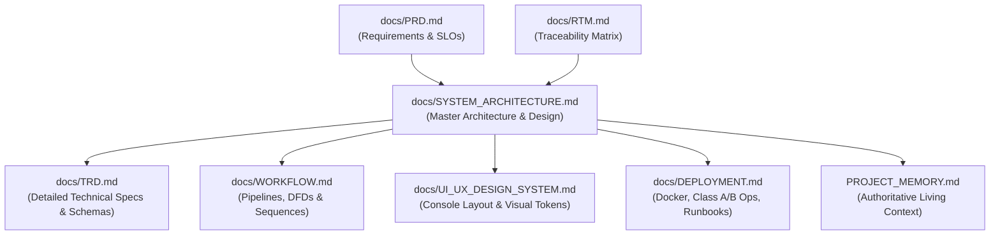

---

## 6. Project Context

Modern national defense organizations, intelligence entities, and critical infrastructure operators rely heavily on IPsec VPNs to establish secure enclaves over public or contested networks. However, improper cryptographic configuration (e.g., deprecated 3DES/DES ciphers, weak Diffie-Hellman groups, disabled Perfect Forward Secrecy) and traffic metadata exposure (side-channel packet sizing, burst patterns, timing dynamics) expose organizations to passive eavesdropping, traffic correlation, and state-sponsored cyber exploitation.

TunnelTrace AI addresses Problem Statement 26160 by delivering an autonomous, evidence-first platform that audits IPsec VPN configurations, maps protocol states, infers inner application traffic without payload decryption, evaluates regulatory compliance against NIST SP 800-77 Rev. 1, and verifies remediations in a controlled network testbed.

---

## 7. Problem Statement Architectural Drivers

The architectural design is directly driven by six core technical mandates:
1. **Multi-Mode IPsec Lab Generation:** Architectural support for on-demand generation and live packet capture across Tunnel/Transport modes, IPv4/IPv6, diverse ciphers (AES-GCM, AES-CBC+HMAC), DH groups, and application traffic classes.
2. **Deterministic Protocol Extraction:** Observability facts (IKE versions, negotiated transforms, SPIs, SAs) must be derived deterministically with 100% precision from packet headers.
3. **Non-Decrypting Encrypted Traffic Inference:** Application classification inside ESP tunnels must rely exclusively on behavioral metadata (sizes, directions, timing, bursts) using calibrated deep learning and tree ensembles.
4. **Standards-Based Security Auditing:** Cryptographic evaluations and score deductions must link directly to authoritative standards (NIST SP 800-77, RFC 8221, RFC 7296).
5. **Traceable Forensic Provenance:** Every displayed finding, score deduction, and threat entry must maintain an unalterable proof chain linking to raw packet bytes.
6. **Closed-Loop Remediation:** The platform must not only detect flaws but synthesize hardened configurations, apply them to an isolated testbed, and verify security improvement via automated re-testing.

---

## 8. Architecture Goals

- **Integrity & Precision:** Complete elimination of AI hallucination in protocol parsing and security scoring.
- **Local-First Autonomy:** Full end-to-end execution capability on air-gapped developer workstations and evaluation laptops without external internet dependencies.
- **Modular Cohesion:** Low coupling across ingestion, machine learning, policy evaluation, and presentation layers.
- **Explainability:** Transparent mathematical justification for ML predictions via TreeSHAP and Platt probability calibration.
- **Resilience:** Graceful partial degradation when secondary components (e.g., external LLMs, GPU runtimes) fail.

---

## 9. Architecture Principles

1. **Evidence First:** Every analytical conclusion must terminate in an immutable chain of custody referencing physical packet offsets or RFC clauses.
2. **Deterministic Before Probabilistic:** Always use deterministic protocol dissectors where wire evidence exists. Bounded ML is reserved strictly for hidden inner flow behaviors.
3. **Unknown Before Guessing:** If passive captures lack required negotiation handshakes (e.g., missing IKE), explicitly assert `UNKNOWN` rather than speculating.
4. **LLM is Never the Source of Security Truth:** Generative language models are strictly downstream consumers of verified structured findings used exclusively for conversational explanation and narrative drafting.
5. **Privacy First:** Raw PCAP files and proprietary traffic data never leave the local security perimeter.
6. **Modular Monolith First:** Avoid premature microservice fragmentation; organize logical engines into high-cohesion, low-coupling modules within a unified service boundary.
7. **Privilege Separation:** Ordinary web application microservices run unprivileged; elevated raw socket capabilities are quarantined to an isolated daemon.
8. **Immutable Versioning:** Formally version models, policy rule sets, database schemas, and report templates.

---

## 10. Architecture Constraints

- **Execution Environment:** Host workstations run Linux (Ubuntu 22.04 LTS native recommended) or containerized Linux environments.
- **Hardware Footprint:** Target prototype must execute efficiently on standard 8-core CPU hardware with 16 GB RAM without mandatory GPU requirements.
- **Networking Stack:** Linux kernel network namespaces (`ip netns`), `veth` virtual Ethernet pairs, Linux `tc/netem` (Traffic Control / Network Emulator), and strongSwan 5.9+ VPN daemons.
- **Dissection Core:** TShark 4.x / PyShark utilizing Wireshark's native protocol dissector libraries.
- **Regulatory Framework:** Compliance rules must strictly align with NIST SP 800-77 Rev. 1, NIST SP 800-57, RFC 7296, RFC 8221, and RFC 8247.

---

## 11. Assumptions

1. The evaluation laptop or server grants root / `sudo` access strictly for setting up the local Linux network namespace testbed and executing `tcpdump`.
2. Captured PCAP/PCAPNG files adhere to standard libpcap formats.
3. ESP payloads utilize standard encapsulation (IP protocol 50) with or without UDP encapsulation (port 4500 NAT-Traversal).

---

## 12. Non-Goals

- **Real-Time Carrier-Scale Deep Packet Inspection:** The platform is an analytical security assessment and protocol forensics platform, not an inline multi-gigabit hardware firewall.
- **Cryptanalytic ESP Decryption:** The platform does not attempt cryptanalysis, brute-force key recovery, or mathematical cracking of AES/ChaCha ciphers.
- **Multi-Tenant Public SaaS:** The prototype is optimized for on-premises, local-first, and air-gapped SOC deployments.
- **Arbitrary Proprietary Hardware Flashing:** Automatic remediation is validated strictly against strongSwan Linux VPN gateways; enterprise appliances (Cisco, Fortinet) are supported via projected configuration templates only.

---

## 13. Technology Baseline

| Architecture Tier | Technology & Runtime | Specifications & Frameworks | Capabilities & Implementations |
| :--- | :--- | :--- | :--- |
| **Frontend Tier** | Node.js 20 LTS (Alpine base) | Next.js 14 (App Router, Strict TypeScript) | Vanilla CSS + Custom Brutalist Tailwind Tokens (0px radius, Light Theme Default), Apache ECharts 5.x, React Flow 11.x, PWA / Service Worker |
| **Application & API Tier** | Python 3.11 (Debian Slim base) | FastAPI 0.110+ (ASGI / Starlette, Uvicorn) | Asyncio, WebSockets, Pydantic v2 validation & serialization, Redis 7-alpine, Celery 5.3+ |
| **Persistence & Storage Tier** | PostgreSQL 15 & Redis 7 | pgvector 0.6+, SQLAlchemy 2.0 (async), Alembic | Relational schemas, semantic vector embeddings, POSIX local file volume (`/storage`) / S3-compatible interface |
| **Analytical & ML Runtime** | TShark 4.x, PyTorch 2.2+, XGBoost 2.0+ | Scikit-learn 1.4+, PyShark 0.6+, SHAP 0.44+ | Protocol dissection, calibrated probabilities, 1D-CNN spatial classification, TreeExplainer, WeasyPrint 61+, Jinja2 |
| **Privileged Testbed Tier** | Dedicated Linux Kernel 5.15+/6.x | strongSwan 5.9.8+ (charon, vici, swanctl) | Linux `netns`, `tc/netem` traffic shaping, XFRM state/policy engine, `tcpdump` 4.99+, `libpcap` 1.10+ |

---

## 14. System Context

The following diagram illustrates how TunnelTrace AI interfaces with human operators, network inputs, authoritative regulatory knowledge bases, and local/external AI services:

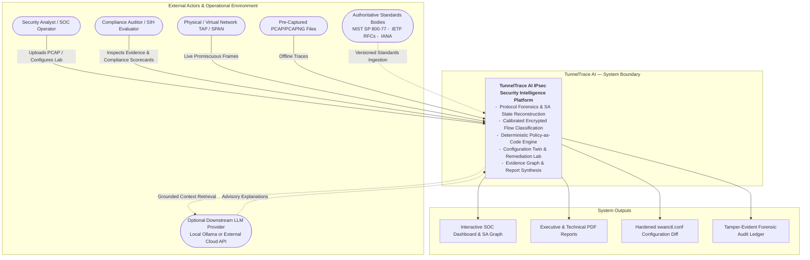

---

## 15. External Actors / Systems

- **Security Analyst / SOC Operator:** Initiates live captures, reviews classified flows, inspects security findings, and triggers configuration remediations.
- **Compliance Auditor / SIH Evaluator:** Audits cryptographic compliance against NIST/RFC standards, verifies score deductions, and inspects evidence chains.
- **Physical/Virtual Network TAP:** Live mirror port providing raw packet frames to the privileged interception agent.
- **Offline PCAP Source:** Local filesystem or remote archive supplying standard packet traces.
- **Authoritative Standards Repositories:** NIST, IETF, and IANA specifications converted into structured YAML policy bundles and text vector embeddings.
- **External/Local LLM Service:** Optional language model (Ollama running `mistral:7b` locally or cloud API) providing advisory answers to analyst queries based strictly on retrieved facts.

---

## 16. Three Major Architecture Domains

To avoid architectural fragmentation, the 45 physical subsystems of TunnelTrace AI are organized into **Three Major Cohesive Domains**:

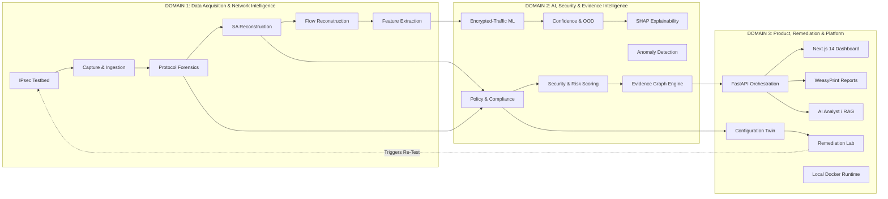

---

## 17. High-Level System Architecture

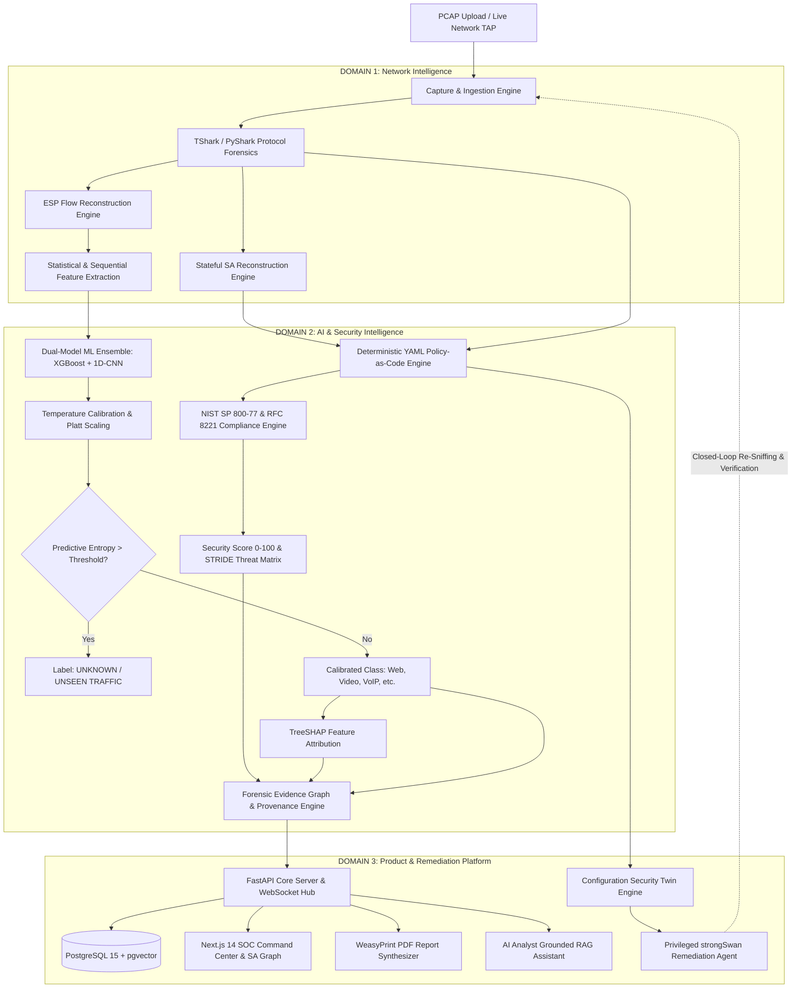

---

## 18. Logical Architecture

The logical tiering of TunnelTrace AI maintains strict unidirectional dependency:
- **Presentation Tier:** Stateless Next.js 14 web client communicating over REST and WebSockets.
- **Orchestration Tier:** FastAPI asynchronous server managing job lifecycles and client sessions.
- **Analytical & Execution Tier:** Celery asynchronous workers hosting TShark dissectors, ML models, and policy rules.
- **Persistence Tier:** PostgreSQL storing relational records and document embeddings; local volume storing PCAPs.
- **Privileged System Tier:** Isolated host-bound daemon managing Linux namespaces and raw sockets.

---

## 19. Component Responsibility Model

| Component Name | Architectural Domain | Primary Responsibility | Inputs | Outputs | Owns State? | Dependencies |
| :--- | :--- | :--- | :--- | :--- | :--- | :--- |
| **Testbed Orchestrator** | Domain 1 | Manage Linux namespaces, strongSwan daemons, and `tc/netem` | Lab Profile Config | Running Tunnels, veth Links | Yes (Kernel netns) | Linux Kernel, iproute2, strongSwan |
| **Ingestion Engine** | Domain 1 | Validate, register, hash, and store incoming PCAP files | Uploaded File / Raw Stream | Sanitized Capture Record | Yes (Metadata in DB) | POSIX Storage, hashlib |
| **Protocol Forensics Engine**| Domain 1 | Execute deterministic TShark parsing on UDP 500/4500 and IP 50 | Raw PCAP File | Normalized Packet Records | No (Stateless Worker)| TShark 4.x, PyShark |
| **SA Reconstruction Engine** | Domain 1 | Build parent-child SA graph linking IKE SPIs to ESP SPIs | Normalized Packet Records | Stateful SA Graph Object | Yes (Per Analysis) | Protocol Forensics Engine |
| **Flow Reconstruction Engine**| Domain 1 | Aggregate individual ESP packets into bidirectional flows | ESP Packet Records | Bidirectional Flow Records | Yes (Flow Tables) | SA Reconstruction Engine |
| **Feature Extraction Engine** | Domain 1 | Compute 24 tabular features and sequence tensors from flows | Bidirectional Flows | Feature Vectors & Tensors | No (Pure Function) | NumPy, Pandas |
| **XGBoost Inference Engine** | Domain 2 | Classify flows based on tabular statistical distributions | 24-Dimensional Vector | Class Logits (Softmax) | No (Stateless Model) | XGBoost 2.0+ Runtime |
| **1D-CNN Inference Engine** | Domain 2 | Classify flows based on early packet spatial sequences | `(3, N)` Sequence Tensor | Spatial Class Logits | No (Stateless Model) | PyTorch 2.2+ CPU |
| **Ensemble & Calibration** | Domain 2 | Fuse model logits and apply Platt temperature scaling | Logits from XGBoost & CNN | Calibrated Probabilities | No (Stateless Math) | SciPy, Calibration Params |
| **OOD & Uncertainty Gate** | Domain 2 | Reject unmodeled traffic classes based on predictive entropy | Calibrated Probabilities | Final Label or `UNKNOWN` | No (Pure Function) | Entropy Threshold Config |
| **SHAP Explainability Engine**| Domain 2 | Compute local feature importances for tabular predictions | Feature Vector + XGBoost | Per-Feature SHAP Values | No (Stateless Math) | SHAP 0.44+ TreeExplainer |
| **Behavioral Anomaly Engine**| Domain 2 | Flag anomalous flow characteristics and session drift | Flow Statistics | Anomaly Score (-1 to 1) | No (Stateless Model) | scikit-learn Isolation Forest |
| **Security Policy Engine** | Domain 2 | Evaluate observed configuration against versioned YAML rules | Extracted SA Transforms | Concrete Security Findings | No (Policy-as-Code) | PyYAML, Rule Bundles |
| **Compliance Engine** | Domain 2 | Map findings to NIST SP 800-77 and RFC 8221 clauses | Security Findings | Compliance Scorecards | No (Deterministic) | Policy Engine Output |
| **Security Scoring Engine** | Domain 2 | Calculate deterministic 0–100 score across 4 dimensions | Structured Findings | Security Score & Grade | No (Deterministic) | Finding Deduction Values |
| **Metadata Engine** | Domain 2 | Compute Metadata Fingerprintability Index (0–100) | Flow Metrics & Sizing | Fingerprintability Index | No (Pure Function) | Statistical Dispersion Models |
| **Evidence Graph Engine** | Domain 2 | Construct directed acyclic graph linking findings to bytes | Findings, SAs, Packets | Evidence DAG JSON | Yes (Persisted in DB)| PostgreSQL Database |
| **Backend API Gateway** | Domain 3 | Expose REST endpoints and WebSocket channels to clients | HTTP Requests, WS Frames | JSON Responses, WS Events| No (Stateless ASGI) | FastAPI, Uvicorn, Pydantic |
| **Task Queue & Broker** | Domain 3 | Buffer and distribute long-running analytical jobs | Task Messages | Dispatched Task Execution| Yes (Queue State) | Redis 7, Celery Worker |
| **Configuration Twin** | Domain 3 | Synthesize hardened `swanctl.conf` and compute score delta| Current Vulnerable State | Projected Conf & Score Delta| No (Deterministic) | Policy Engine Recommendations |
| **Remediation Lab Agent** | Domain 3 | Apply hardened configs in testbed and run verification | Hardened Config String | Re-established Tunnel Status| Yes (strongSwan State)| Privileged Network Agent |
| **Report Synthesizer** | Domain 3 | Compile high-fidelity Executive & Technical PDF reports | Analysis DB Records | PDF & HTML Report Files | No (Stateless Job) | WeasyPrint 61+, Jinja2 |
| **AI Analyst / RAG Engine** | Domain 3 | Deliver grounded regulatory advice citing verified findings | User Prompt, Findings | Conversational Answer | No (Stateless Query)| PostgreSQL pgvector, LLM API |
| **Privileged Network Agent** | Domain 3 | Provide secure IPC interface to Class B Linux capabilities | Parameterized IPC Calls | OS Command Result Status | Yes (Process Handles) | Linux Kernel, raw sockets |

---

## 20. Communication Matrix

| Source Component | Destination Component | Purpose | Communication Style | Payload Type | Synchronous? | Security Boundary Cross? |
| :--- | :--- | :--- | :--- | :--- | :--- | :--- |
| **Next.js Frontend** | **FastAPI Backend** | User actions, configuration, queries | HTTP / 1.1 REST | JSON Payloads | Yes | Boundary 1 (Web Ingress) |
| **Next.js Frontend** | **FastAPI Backend** | Real-time packet telemetry & job progress | WebSocket (WSS) | JSON Event Frames | Asynchronous | Boundary 1 (Web Ingress) |
| **FastAPI Backend** | **Redis Broker** | Enqueue analysis & report jobs | Redis Protocol (RESP) | Serialized Task Messages | Asynchronous | No (Internal Network) |
| **Celery Worker** | **TShark Dissector** | Extract packet headers and transforms | OS Subprocess Pipe | Streaming JSON (ek format) | Synchronous | Boundary 2 (Subprocess Sandbox) |
| **Celery Worker** | **PostgreSQL** | Store analysis runs, findings, SAs, flows | asyncpg / TCP 5432 | Parameterized SQL / Vectors | Synchronous | No (Internal Network) |
| **FastAPI Backend** | **Privileged Agent** | Start/stop sniffing, launch testbed | UNIX Domain Socket | Parameterized JSON Command | Synchronous | Boundary 3 (Privilege Escalation)|
| **Privileged Agent** | **strongSwan charon** | Load connections, initiate tunnels | UNIX Domain Socket (VICI) | swanctl VICI Protocol | Synchronous | Boundary 3 (Kernel Control) |
| **AI Analyst / RAG** | **PostgreSQL pgvector**| Retrieve relevant standards embeddings | pgvector SQL Query | Cosine Similarity Vectors | Synchronous | No (Internal Network) |
| **AI Analyst / RAG** | **External/Local LLM** | Synthesize grounded response | HTTP REST API | Grounded Text Prompt / JSON | Synchronous | Boundary 4 (External AI Gateway) |

---

## 21. Data Ownership / Source of Truth

To ensure absolute forensic integrity, data ownership is partitioned strictly across the platform:

| Data Entity | Authoritative Source of Truth Component | Storage Subsystem | Mutability Policy |
| :--- | :--- | :--- | :--- |
| **Raw PCAP Capture** | Ingestion Engine (Verified via SHA-256) | POSIX Storage Volume | **Immutable** |
| **Protocol Observations** | TShark Protocol Forensics Engine | PostgreSQL (`protocol_observations`) | **Immutable** |
| **Security Associations** | SA Reconstruction Engine | PostgreSQL (`security_associations`) | **Immutable** |
| **Bidirectional ESP Flows**| Flow Reconstruction Engine | PostgreSQL (`esp_flows`) | **Immutable** |
| **Encrypted Traffic Class**| Encrypted-Traffic ML Engine | PostgreSQL (`esp_flows.predicted_class`) | **Immutable** |
| **Security Findings** | YAML Policy-as-Code Engine | PostgreSQL (`security_findings`) | **Immutable** |
| **Compliance Scorecard** | Compliance Engine | PostgreSQL (`compliance_records`) | **Immutable** |
| **Overall Security Score** | Security Scoring Engine | PostgreSQL (`analysis_runs.security_score`)| **Immutable** |
| **Forensic Evidence DAG** | Evidence Graph Engine | PostgreSQL (`evidence_nodes`, `edges`) | **Immutable** |
| **Configuration Twin** | Configuration Twin Engine | PostgreSQL (`configuration_twins`) | Mutable during draft |
| **Remediation Status** | Remediation Lab Agent | PostgreSQL (`remediation_runs`) | State-machine transitions |
| **Advisory Q&A Narrative**| AI Analyst / RAG Engine | Ephemeral / Chat History Table | Informational only |

---

## 22. Domain 1 — Data Acquisition & Network Intelligence

Domain 1 is responsible for acquiring raw network packets (from either live physical interfaces or uploaded capture files) and converting them into structured, verified, and state-reconstructed protocol and flow objects.

---

## 23. IPsec Testbed Architecture

The IPsec Testbed provides a fully automated, multi-namespace network environment capable of generating verified ground-truth IPsec traffic across all required permutations:

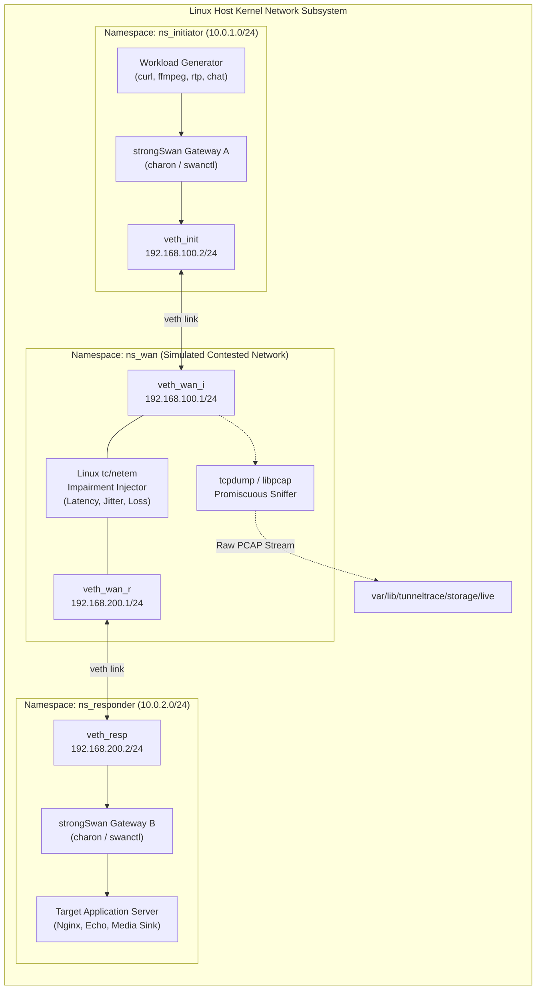

### Supported Configuration Matrix
- **Encapsulation Modes:** Tunnel Mode (`PS-LAB-001`), Transport Mode (`PS-LAB-002`).
- **Cryptographic Algorithms:** AES-128-CBC, AES-128-GCM (`PS-LAB-003`), AES-256-CBC, AES-256-GCM (`PS-LAB-004`), AEAD authenticated encryption (`PS-LAB-005`), Legacy AES-CBC + HMAC-SHA1/SHA256 (`PS-LAB-006`).
- **Key Exchange Groups:** Diffie-Hellman Groups 14 (MODP 2048), 19 (ECP 256), 20 (ECP 384), 21 (ECP 521) (`PS-LAB-007`).
- **PFS Enforcement:** Child SA rekeying with Diffie-Hellman exchange (`PFS On`, `PS-LAB-008`), Child SA rekeying without DH (`PFS Off`, `PS-LAB-009`).
- **Network Layers:** IPv4 Transport (`PS-LAB-010`), IPv6 Transport (`PS-LAB-011`).
- **Simulated Workloads:** VoIP (`PS-LAB-012`), Chat/Messaging (`PS-LAB-013`), Email (`PS-LAB-014`), Web (`PS-LAB-015`), ICMP (`PS-LAB-016`), Video Streaming (`PS-LAB-017`).

---

## 24. Capture & Ingestion Architecture

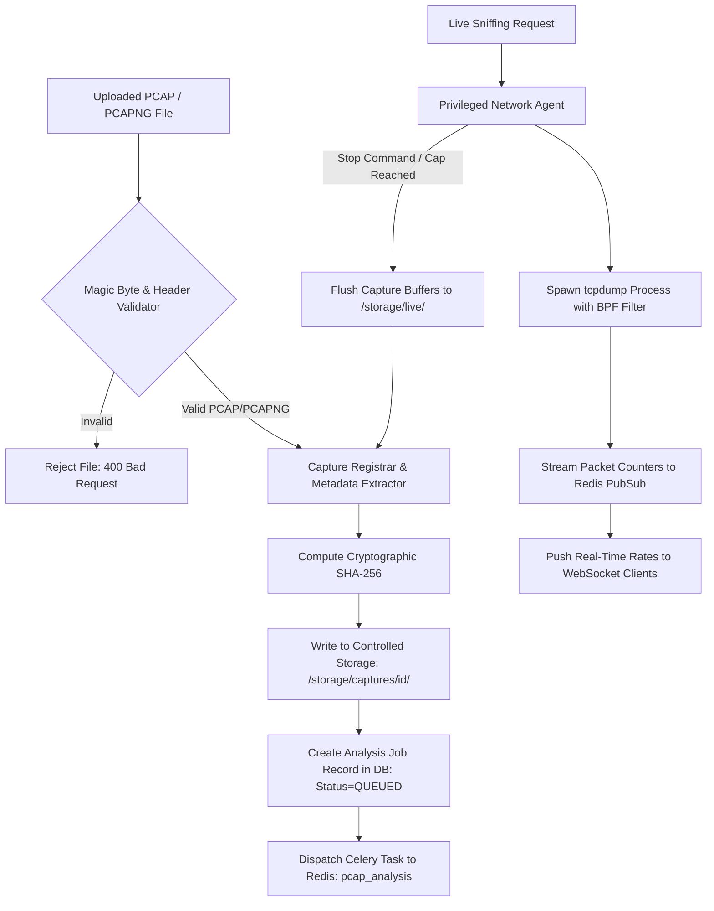

---

## 25. Protocol Forensics Architecture

The Protocol Forensics engine enforces strict deterministic extraction:

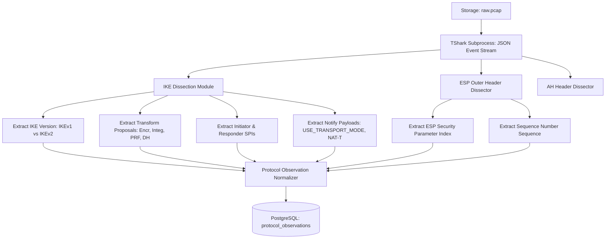

---

## 26. IKE/ESP/AH Architecture

The protocol normalizer maps dissected attributes to formal schemas:
- **IKE Session:** Bound by `initiator_spi` (8 bytes) and `responder_spi` (8 bytes), tracking major/minor version octets, message IDs, and negotiation timestamps.
- **Transform Matching:** Maps numeric IANA transform IDs to standardized cryptographic identifiers (e.g., Transform Type 1, ID 20 $\rightarrow$ `ENCR_AES_GCM_16`, key length 256 bits).
- **ESP Dissection Boundary:** The engine extracts only unencrypted outer header fields: SPI (4 bytes) and Sequence Number (4 bytes). **Payloads remain strictly encrypted.**
- **AH Processing:** Extracts AH SPI and sequence numbers, verifying integrity algorithm references where present.

---

## 27. SA Reconstruction Architecture

The Security Association Reconstruction Engine links asynchronous IKE negotiation exchanges to active data-plane ESP child SAs:

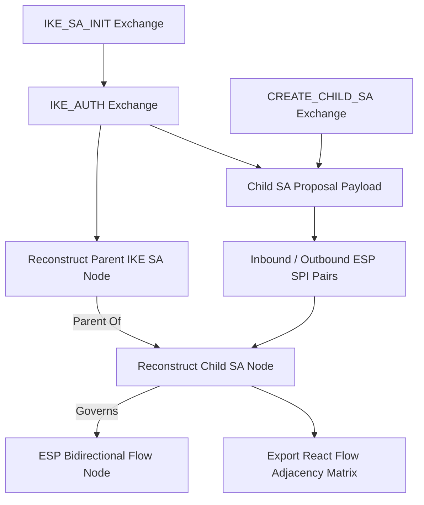

---

## 28. Flow Reconstruction Architecture

The Flow Reconstruction Engine maps individual ESP packets to bidirectional communication streams:
1. **Packet Indexing:** Every ESP frame is indexed by outer IP pair `(src_ip, dst_ip)` and SPI.
2. **Direction Resolution:** Child SAs operate simplex (unidirectional). The engine pairs inbound SPI ($SPI_A$) and outbound SPI ($SPI_B$) negotiated within the same Child SA exchange to construct a unified bidirectional flow.
3. **Temporal Bounding:** Flows terminate when an SA rekey event occurs, an IKE delete payload is parsed, or inter-packet arrival time exceeds the flow idle timeout ($T_{\text{idle}}$, default 120s).

---

## 29. Feature Extraction Architecture

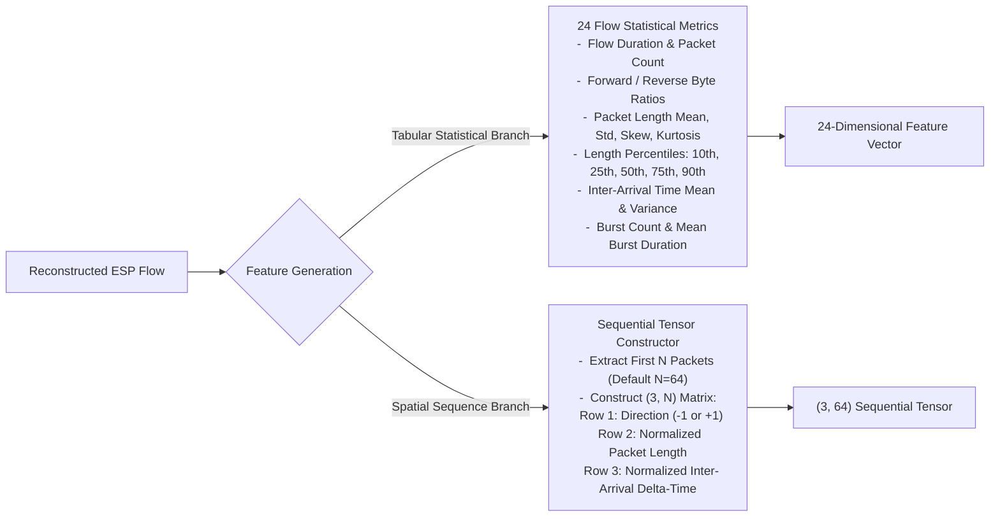

---

## 30. Domain 2 — AI, Security & Evidence Intelligence

Domain 2 ingests structured protocol states and extracted flow features to produce probabilistic encrypted-traffic classifications, deterministic standards-based compliance audits, forensic evidence graphs, and security posture scores.

---

## 31. ML Training Architecture

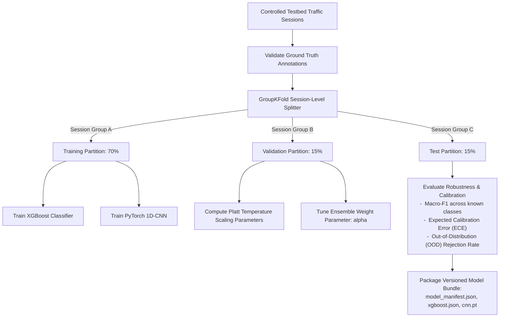

---

## 32. ML Inference Architecture

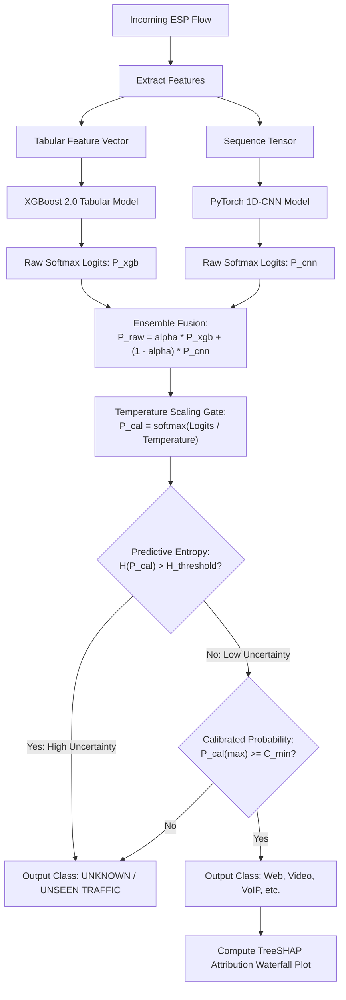

---

## 33. XGBoost Architecture
- **Role:** Primary tabular classifier operating on 24 statistical flow features.
- **Characteristics:** Gradient-boosted decision trees configured with maximum depth 6, learning rate 0.05, and subsampling ratio 0.8.
- **Explainability:** Fully compatible with exact TreeSHAP algorithms for sub-millisecond local feature attribution.

---

## 34. 1D-CNN Architecture
- **Role:** Sequential spatial classifier capturing the temporal and packet-size dynamics of early session handshakes.
- **Layering:** Input `(3, 64)` $\rightarrow$ Conv1D(32 filters, kernel 5) $\rightarrow$ BatchNorm $\rightarrow$ ReLU $\rightarrow$ MaxPool1D(2) $\rightarrow$ Conv1D(64 filters, kernel 3) $\rightarrow$ AdaptiveAvgPool1D $\rightarrow$ Fully Connected(128) $\rightarrow$ Dropout(0.3) $\rightarrow$ Linear(Output Classes).
- **Execution:** CPU-optimized TorchScript serialized artifact running natively inside Celery worker threads.

---

## 35. Ensemble / Fusion Architecture
- Combines the structural distribution strengths of XGBoost with the early-sequence burst pattern sensitivity of the 1D-CNN.
- **Fusion Formulation:**
  
  $$P(y = c \mid \mathbf{x}) = \alpha \cdot P_{\text{XGB}}(y = c \mid \mathbf{x}_{\text{tab}}) + (1 - \alpha) \cdot P_{\text{CNN}}(y = c \mid \mathbf{x}_{\text{seq}})$$
  
  *(where $\alpha \in [0, 1]$ is optimized via grid search on the held-out validation set).*

---

## 36. Confidence / Calibration Architecture
Raw neural and tree model probabilities are inherently overconfident. TunnelTrace AI passes fused logits through a post-hoc **Platt Temperature Scaling** layer:

$$\hat{P}_c = \frac{\exp(z_c / T)}{\sum_{j=1}^K \exp(z_j / T)}$$

*(where $T > 0$ represents the temperature parameter tuned on validation data).*  
- **Validation Metrics:** Monitored via Expected Calibration Error (ECE) and Brier Score to ensure displayed confidence reflects true empirical accuracy.

---

## 37. OOD Architecture
- **Uncertainty Rejection:** If the predictive Shannon entropy of the calibrated distribution exceeds a validated threshold:
  
  $$H(P) = - \sum_{c=1}^K P_c \log_2 P_c > \tau_{\text{entropy}}$$
  
  the classifier suppresses forced categorization and outputs `UNKNOWN / UNSEEN TRAFFIC`.
- Guarantees that unmodeled protocols (e.g., BitTorrent, Tor, novel malware) are not falsely labeled as standard enterprise traffic.

---

## 38. Explainability Architecture
- TreeSHAP computes the additive contribution $\phi_i$ of each statistical feature to the final prediction:
  
  $$f(\mathbf{x}) = \phi_0 + \sum_{i=1}^M \phi_i$$
  
- Attributions are pushed to the UI as interactive waterfall plots, proving that inferences derive from legitimate physical side channels (e.g., isochronous packet timing for VoIP, high burst length for Video).

---

## 39. Behavioral Anomaly Architecture
- Operates independently from the supervised application classifier using an **Isolation Forest** trained on normal baseline traffic flows.
- Flags anomalous IPsec behaviors: massive packet volume surges, abnormal rekeying frequencies, and asymmetric packet-size distributions.
- **Boundary:** Formally designated as *behavioral anomaly detection*; never marketed as generic "zero-day attack detection."

---

## 40. Security Policy Architecture

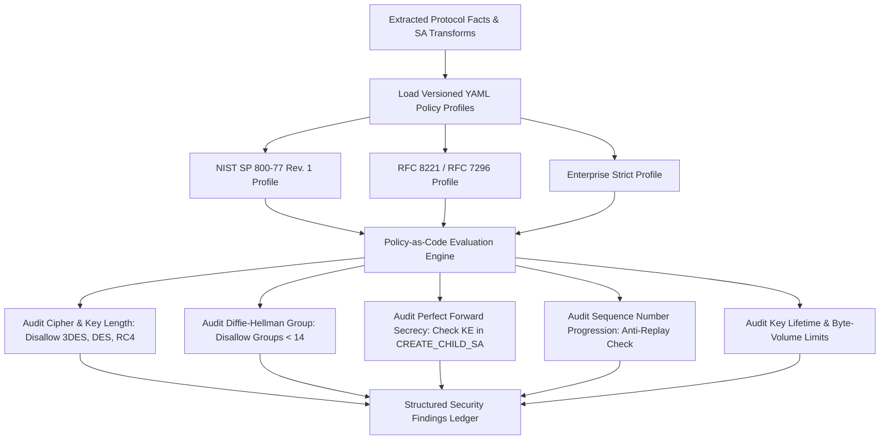

---

## 41. Compliance Architecture
- Rules evaluate to explicit four-state compliance values: `PASS`, `FAIL`, `UNKNOWN` (insufficient evidence in capture), or `NOT_APPLICABLE`.
- Each failure records exact regulatory citations:
  - Standard Name (e.g., `NIST SP 800-77 Rev. 1`).
  - Clause Number (e.g., `Section 4.1.2: Algorithm Selection`).
  - Mandate Text and Specific Deduction Penalty.

---

## 42. Security Score Architecture
- Computes an aggregate **0–100 Security Posture Score** based on transparent, deterministic deductions:

$$\text{Security Score} = 100 - \sum_{i=1}^N \text{Deduction}_i$$

- **Deduction Dimensions:** Cryptographic Strength, Key Exchange / PFS, SA Management & Lifetimes, Anti-Replay & Integrity.
- **Traceability Guarantee:** Zero arbitrary point drops. Every deduction is linked via foreign key to a concrete finding in the audit ledger.

---

## 43. Risk Architecture
- Groups findings into standardized severity tiers: `CRITICAL`, `HIGH`, `MEDIUM`, and `LOW`.
- Calculates composite risk based on finding severity, exploitability of the detected flaw (e.g., Sweet32 vulnerability on 64-bit block ciphers), and operational exposure.

---

## 44. Threat Matrix Architecture
- Mapped dynamically to the **STRIDE** threat model and **MITRE ATT&CK for Enterprise** matrices:
  - Deprecated ciphers $\rightarrow$ *Information Disclosure* / *Cryptanalysis*.
  - Missing PFS $\rightarrow$ *Information Disclosure* (Retrospective decryption).
  - Sequence number anomalies $\rightarrow$ *Tampering* / *Replay Attacks*.
- The LLM is strictly prohibited from generating threat entries.

---

## 45. Metadata Fingerprintability Architecture
- Evaluates side-channel exposure by analyzing the statistical distinguishability of encrypted flows.
- Outputs the **Metadata Fingerprintability Index (0–100)**: higher scores denote that application types are easily identified due to distinctive packet sizes, directional ratios, and burst autocorrelation.
- **Strict Distinction:** Quantifies *traffic distinguishability*; never described as *percentage of plaintext data leaked*.

---

## 46. Evidence / Provenance Architecture

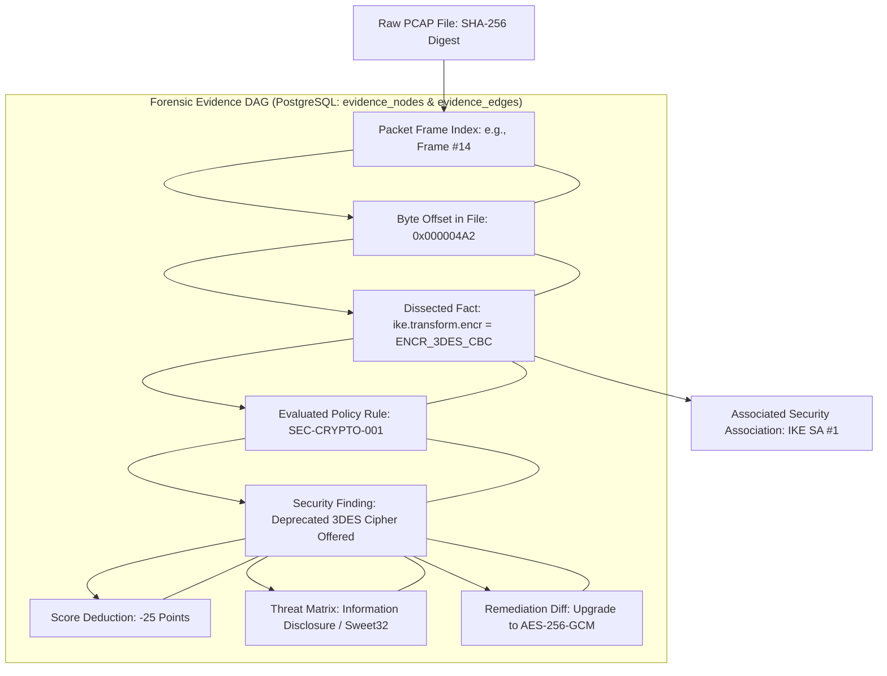

---

## 47. Domain 3 — Product, Remediation & Platform

Domain 3 encapsulates the presentation console, reporting engines, configuration remediation workflows, local runtime boundaries, and background job orchestration.

---

## 48. Backend / Application Architecture

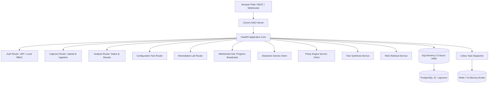

---

## 49. Frontend / PWA Architecture
- **Single-Page Application Shell:** Next.js 14 App Router, TypeScript, React 18.
- **Design Tokens:** Sharp 0px borders, high-density cybersecurity brutalist layout, default Light Theme (`#F7F7F4`), secondary Dark Theme (`#0A0A0A`).
- **Interactive Visualization:**
  - Apache ECharts for Sunburst traffic distribution and packet length histograms.
  - React Flow for stateful IKE/Child SA graph traversal.
- **PWA Service Worker:** Caches application shell and styling assets for instant offline load. **Sensitive packet data is strictly excluded from browser caches.**

---

## 50. Report Architecture
- Generates publication-grade **Executive Summary** (2 pages) and **Technical Audit** (multi-page comprehensive) reports.
- **Compilation Engine:** WeasyPrint 61+ rendering HTML5 and CSS Paged Media directly into encrypted, signed PDF documents.
- Reports embed exact SHA-256 capture digests, active model version hashes, policy tags, and full finding ledgers.

---

## 51. AI Analyst / RAG Architecture

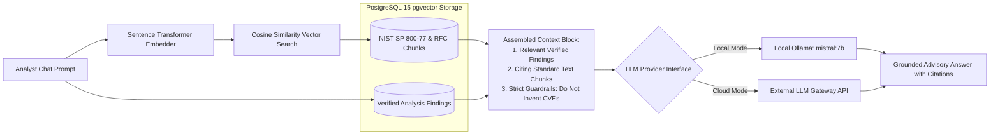

---

## 52. Configuration Twin Architecture
- Serves as a digital configuration sandbox for security hardening.
- Ingests currently observed weak parameters, applies recommended policy transformations, and compiles an updated, syntactically verified `swanctl.conf`.
- Renders an interactive side-by-side configuration diff and computes projected security score gains before physical lab deployment.

---

## 53. Remediation Architecture
- **Scope Restriction:** Validated automatic remediation is strictly limited to the **controlled strongSwan lab**.
- Operators review the proposed configuration delta and trigger remediation via authenticated REST endpoint.
- The Privileged Network Agent backs up the active configuration, writes the updated `swanctl.conf`, and executes `swanctl --load-all`.

---

## 54. Remediation Verification Architecture

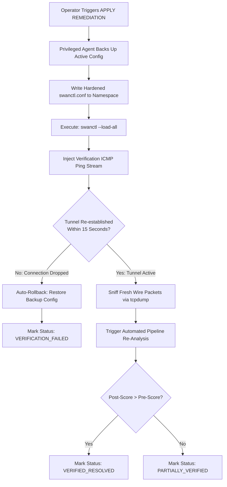

---

## 55. Background Job Architecture
- Manages heavy compute tasks asynchronously via Celery workers:
  - `pcap_analysis`: Packet dissection, SA graph construction, feature extraction.
  - `ml_inference`: XGBoost and 1D-CNN execution, SHAP attribution.
  - `report_compilation`: WeasyPrint PDF synthesis.
- Worker processes enforce hard memory limits (`RLIMIT_AS`) and execution timeouts to prevent denial-of-service from malformed captures.

---

## 56. Data / Persistence Architecture

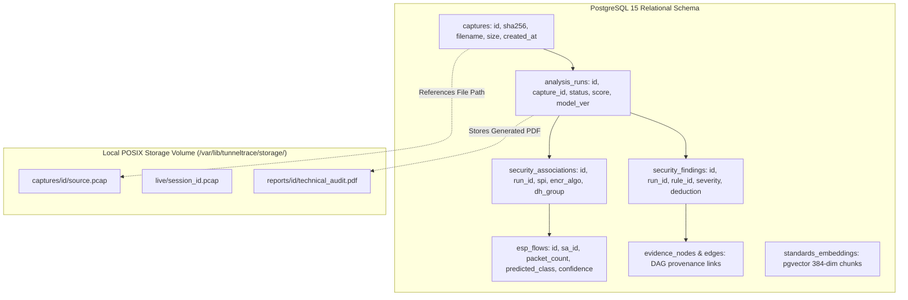

---

## 57. Runtime Architecture

The platform partitions execution into two strictly segregated operating planes:

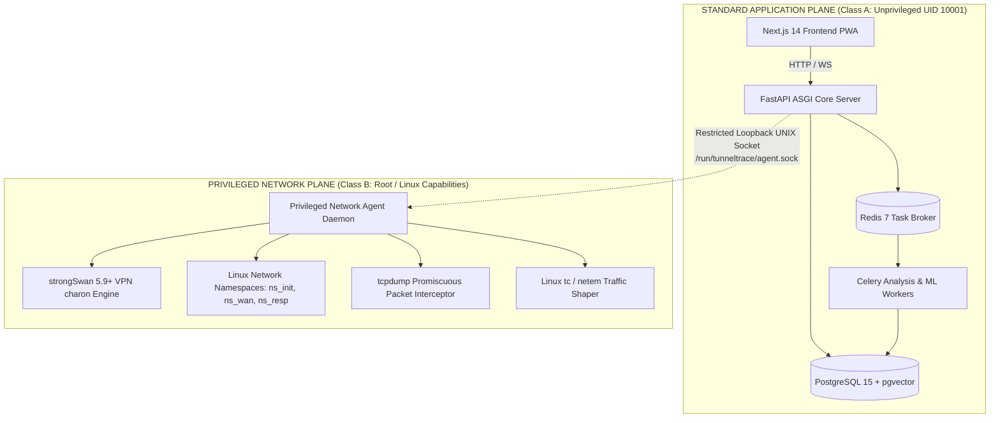

---

## 58. Privilege Separation Architecture
- **Execution Class A (Application Plane):** Runs inside isolated Docker containers with non-root accounts (`UID 10001:10001`), dropping all Linux kernel capabilities (`cap_drop: ALL`).
- **Execution Class B (Network Plane):** Operates on the Linux host with specific network administration capabilities (`CAP_NET_RAW`, `CAP_NET_ADMIN`).
- **Control Interface:** Class A communicates with Class B exclusively through a restricted, parameterized local UNIX domain socket. **No arbitrary shell interpolation or pass-through commands are permitted.**

---

## 59. Deployment Architecture
- **Primary Target (Local-First):** Single-node Docker Compose orchestrating all Class A services, with Class B operating natively on the Ubuntu 22.04 LTS host.
- **Future Staging (Optional Cloud Mapping):**
  - Frontend hosted on Vercel Edge.
  - API & Workers hosted on Render persistent Linux instances.
  - Database & Auth managed via Supabase.
  - Privileged Network Agent deployed to an on-premises enterprise Linux edge node.

---

## 60. Trust Boundaries

| Trust Boundary | Boundary Path / Transition | Enforced Security Controls & Mitigations |
| :--- | :--- | :--- |
| **Boundary 1: Web Ingress** | Users / Web Browsers $\to$ Reverse Proxy / FastAPI API Gateway | JWT authentication, CORS restrictions, rate-limiting, strict Pydantic payload validation |
| **Boundary 2: Untrusted Packet Dissection** | Uploaded PCAP Files $\to$ TShark / PyShark Child Process | Memory limits (`RLIMIT_AS 1GB`), execution timeout (120s), unprivileged execution, non-root parser |
| **Boundary 3: Privileged Command Escalation** | FastAPI Backend $\to$ Privileged Network Agent (UNIX Domain Socket) | Strict JSON schema, command whitelisting, regex interface validation, root-only socket file permissions |
| **Boundary 4: External AI Gateway** | RAG Engine $\to$ External / Cloud LLM APIs | Context sanitization, raw PCAP exclusion, strict system prompts prohibiting speculative security claims |

---

## 61. Security Architecture Principles
- **Least Privilege:** Web-facing containers maintain zero administrative rights.
- **Defense in Depth:** Even if a malicious PCAP exploits a TShark dissector flaw, container isolation and dropped kernel capabilities prevent host compromise.
- **No Direct Shell Interpolation:** All subprocess calls utilize tokenized argument lists: `subprocess.Popen(["tshark", "-r", safe_path])`.

---

## 62. Privacy Architecture
- Evaluated network traces often contain proprietary enterprise communication.
- TunnelTrace AI ensures raw packet payloads are never transmitted across the network.
- Dissection extracts only outer header dimensions and metadata transforms.
- Local RAG models (Ollama) allow 100% offline, air-gapped natural language advisory capabilities.

---

## 63. Graceful Degradation

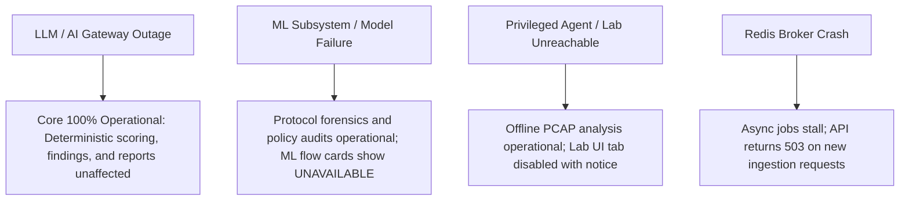

---

## 64. Partial Analysis Architecture
- If a capture file starts mid-session and lacks IKE negotiation packets:
  - The protocol forensics engine flags IKE properties as `UNKNOWN`.
  - The flow reconstruction engine continues to index ESP packets and execute ML application classification.
  - The policy engine audits visible ESP properties (e.g., replay protection) while suppressing IKE-specific rules without failing the entire analysis run.

---

## 65. Availability / Failure Isolation
- Subsystem failures are isolated via process and container boundaries.
- Celery worker crashes due to memory limits do not bring down the FastAPI web server.
- Database disconnects trigger automated exponential backoff reconnection attempts without process termination.

---

## 66. Scalability Path
- **Vertical:** Multiple worker threads bound to available physical CPU cores for parallel packet dissection.
- **Horizontal:** Celery workers scaled horizontally across compute nodes, consuming from a shared Redis task queue.
- **Data Scaling:** Read replicas configured for historical analysis queries while the primary PostgreSQL instance processes active ingestion writes.

---

## 67. Extensibility
- **Custom Policy Bundles:** New organizational or government security profiles added simply by placing valid YAML rule files in `policies/active/`.
- **Model Upgrades:** New serialized model binaries deployed via model manifest registration without modifying backend code.
- **Protocol Extensions:** Support for additional VPN protocols (e.g., WireGuard) architected via modular parser adapters.

---

## 68. Versioning / Reproducibility
- Every completed analysis run stores a permanent metadata manifest:
  - Capture SHA-256 Digest.
  - TShark Dissector Version.
  - Active ML Model Weights Hash.
  - Policy Bundle Semantic Version.
  - Security Scoring Algorithm Version.

---

## 69. Architecture Decision Record Summary

| ADR ID | Decision Title | Chosen Architectural Approach | Rationale | Revisit Trigger |
| :--- | :--- | :--- | :--- | :--- |
| `ADR-01` | Protocol Extraction Method | Deterministic TShark over ML | Directly observable protocol fields must never be predicted or hallucinated | Dissector engine retirement |
| `ADR-02` | ML Model Architecture | Dual Ensemble: XGBoost + 1D-CNN | Blends tabular flow statistical features with spatial early-packet sequences | Extreme throughput requirements |
| `ADR-03` | Training Dataset Baseline | Own Native strongSwan Dataset | UNB ISCXVPN2016 uses OpenVPN; only native IPsec lab provides valid ground truth | Release of official IPsec corpus |
| `ADR-04` | Security Policy Implementation | Versioned YAML Policy-as-Code | Enables transparent auditing and hot-reloading without modifying backend code | Dynamic rule complexity breach |
| `ADR-05` | Vector Database Selection | PostgreSQL `pgvector` Extension | Eliminates external vector microservices (FAISS/Qdrant) by co-locating embeddings | Vector corpus > 1M documents |
| `ADR-06` | Network Privilege Boundary | Isolated Privileged Network Agent | Quarantines raw socket and namespace capabilities away from web containers | Platform-wide root requirement |
| `ADR-07` | UI Design Tokens | Default Light Theme, 0px Sharp Brutalist| Delivers high-density SOC console aesthetic optimized for daytime analyst usability| User accessibility review |

---

## 70. PS Requirement → Architecture Matrix

| PS Requirement ID | Official Requirement Clause | Architecture Domain | Responsible Architecture Component | Processing Method | Primary Output | Relevant Architecture View |
| :--- | :--- | :--- | :--- | :--- | :--- | :--- |
| `PS-LAB-001` | Tunnel Mode Testbed | Domain 1 | Testbed Orchestrator | Linux netns + strongSwan | Encapsulated Tunnel ESP | View 2 (Sec 23) |
| `PS-LAB-002` | Transport Mode Testbed | Domain 1 | Testbed Orchestrator | Linux netns + strongSwan | Host-to-Host Transport ESP | View 2 (Sec 23) |
| `PS-LAB-003` to `007`| Ciphers & DH Groups | Domain 1 | Testbed Orchestrator | strongSwan swanctl plugins | Verified Transform Captures | View 2 (Sec 23) |
| `PS-LAB-008` / `009` | PFS On / Off Testbed | Domain 1 | Testbed Orchestrator | strongSwan Child SA Rekey | Rekey Packets with/without KE | View 2 (Sec 23) |
| `PS-LAB-012` to `017`| Traffic Simulations | Domain 1 | Workload Traffic Generator | Synthetic traffic generators | Encrypted Application Flows | View 2 (Sec 23) |
| `PS-CAP-001` to `004`| Traffic Ingestion | Domain 1 | Ingestion & Dissection Engine | TShark JSON parsing | Parsed Protocol Records | View 3 (Sec 24) |
| `PS-CAP-005` / `006` | Offline & Live Sniffing| Domain 1 / 3 | Ingestion & Privileged Agent | File Upload & tcpdump | Structured Captures in DB | View 3 (Sec 24) |
| `PS-PROTO-001` to `008`| Protocol & SA Discovery| Domain 1 | Forensics & SA Graph Engine | Deterministic TShark Extraction| Stateful SA Topology Graph | View 4 (Sec 25–27) |
| `PS-PROTO-009` | Encrypted Traffic ML | Domain 2 | ML Ensemble (XGBoost + CNN) | Calibrated ML Inference | Inferred Application Class | View 6 (Sec 31–36) |
| `PS-SEC-001` to `007` | Security & Compliance | Domain 2 | YAML Policy & Compliance Engine| Deterministic Rule Matching | NIST Violations & Scorecards| View 7 (Sec 40–44) |
| `PS-SEC-008` | Metadata Exposure | Domain 2 | Metadata Fingerprintability Engine| Statistical Dispersion Models | Fingerprintability Index | View 7 (Sec 45) |
| `PS-OUT-001` to `008` | Standardized Outputs | Domain 2 / 3 | Scoring, Reporting, Threat Engines| Algorithmic Synthesis | Score, PDF Reports, Threat Matrix| View 7 & 9 (Sec 42, 50)|
| `PS-DEL-001` to `007` | Expected Deliverables | Domain 1, 2, 3 | Full Integrated Platform Stack | Dockerized Architecture | Deployable Prototype & Docs | View 9 & 12 (Sec 48, 57)|

---

## 71. Golden SIH Architecture Flow

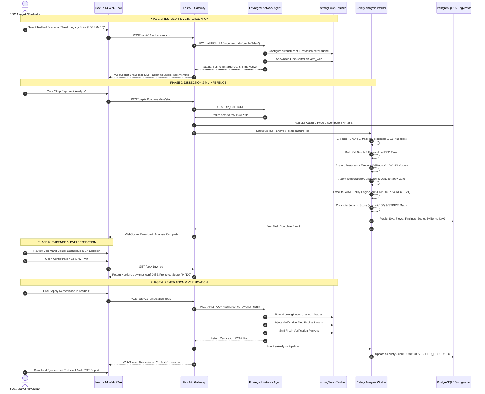

---

## 72. Architecture Risks

| Risk ID | Architecture Risk Description | Severity | Likelihood | Architectural Mitigation | Residual Risk |
| :--- | :--- | :--- | :--- | :--- | :--- |
| **AR-01** | Passive capture lacks IKE negotiation packets (mid-session sniff) | High | High | Graceful partial analysis; analyze ESP flows and mark IKE properties `UNKNOWN`. | Reduced security audit depth |
| **AR-02** | Huge PCAP file exhausts container memory during TShark parse | High | Medium | Process sandboxing, streaming JSON `ek` format, hard memory caps (`RLIMIT_AS`). | Task timeout on massive files |
| **AR-03** | Privileged Agent UNIX socket compromised via local process injection | Critical | Low | File permissions restricted to root (`0600`); strict regex validation on commands. | Host OS-level compromise |
| **AR-04** | ML model misclassifies unseen application traffic | Medium | High | Out-of-Distribution (OOD) uncertainty gate outputs explicit `UNKNOWN` label. | Slight increase in UNKNOWN rate |
| **AR-05** | External LLM API latency degrades analyst response time | Medium | Medium | Decoupled asynchronous architecture; local Ollama fallback support; streaming text. | Degraded Q&A experience |

---

## 73. Architecture Anti-Patterns (Explicitly Rejected)

1. **PCAP $\rightarrow$ LLM Direct Parsing:** Passing raw packet bytes to an LLM produces hallucinations, fabricates CVEs, and exceeds context windows. Rejected in favor of deterministic TShark dissection.
2. **ML Prediction of Cleartext Headers:** Using neural networks to predict IKE versions or cipher names is unscientific. Directly observable headers must be parsed deterministically.
3. **Monolithic Container Execution as Root:** Running web applications, workers, and databases as root violates defense-in-depth. Rejected in favor of Class A/B privilege separation.
4. **Premature Microservice Fragmentation:** Splitting into 15 independent network services introduces network latency and operational fragility. Rejected in favor of a modular monolith.
5. **Client-Side Packet Processing:** Running packet parsers in web browsers violates performance limits and exposes raw network traces. All parsing remains server-side.

---

## 74. Current vs Future Architecture Scope

| Architectural Dimension | Current SIH Prototype Scope | Future Enterprise Hardening Scope |
| :--- | :--- | :--- |
| **Primary Deployment** | Local-First Docker Compose + Ubuntu 22.04 Host | Hybrid Cloud / Multi-Node Kubernetes Cluster |
| **IPsec Testbed** | Local Linux Network Namespaces + strongSwan | Distributed Multi-Cloud Gateway SDN Fabric |
| **Packet Capture** | Host-bound `tcpdump` managed by Privileged Agent | Distributed eBPF / AF_PACKET SmartNIC Probes |
| **Remediation Target** | Controlled strongSwan Linux Lab | Multi-Vendor Network Appliances (Cisco, Fortinet) |
| **AI Analyst LLM** | Local Ollama (`mistral:7b`) / API Gateway | Air-Gapped Dedicated On-Prem GPU LLM Node |
| **Vector Storage** | Local PostgreSQL 15 (`pgvector`) | High-Availability Distributed pgvector Cluster |

---

## 75. Open Decisions / TBD Register

The following architectural parameters are currently unfinalized and flagged for empirical testing:

1. `TBD-ARCH-01`: Final numerical weights across the 4 Security Score dimensions (`Requires operational validation`).
2. `TBD-ARCH-02`: Quantitative predictive entropy threshold $\tau_{\text{entropy}}$ for OOD uncertainty rejection.
3. `TBD-ARCH-03`: Precise maximum sequence length $N \in \{32, 64, 128\}$ for 1D-CNN spatial tensor inputs.
4. `TBD-ARCH-04`: Ensemble weighting coefficient $\alpha$ balancing XGBoost vs. 1D-CNN logits.
5. `TBD-ARCH-05`: IPC protocol for remote Privileged Network Agents in future hybrid deployments (mTLS REST vs. gRPC).

---

## 76. Glossary

- **AEAD:** Authenticated Encryption with Associated Data (e.g., AES-GCM).
- **AH:** Authentication Header (IP protocol 51).
- **BPF:** Berkeley Packet Filter (packet capture filtering syntax).
- **Child SA:** Security Association established to protect data-plane ESP traffic.
- **ECE:** Expected Calibration Error (metric evaluating probability calibration).
- **ESP:** Encapsulating Security Payload (IP protocol 50).
- **IKEv2:** Internet Key Exchange Protocol Version 2 (UDP port 500 / 4500).
- **OOD:** Out-of-Distribution (unseen traffic patterns outside training data).
- **PFS:** Perfect Forward Secrecy (Diffie-Hellman re-exchange during Child SA rekey).
- **pgvector:** Open-source vector similarity search extension for PostgreSQL.
- **SA:** Security Association (simplex cryptographic parameters agreement).
- **SHAP:** SHapley Additive exPlanations (game-theoretic feature attribution).
- **SPI:** Security Parameter Index (32-bit header identifier).
- **VICI:** Versatile IKE Control Interface (strongSwan IPC interface).
- **XFRM:** Linux kernel IPsec transform and policy management framework.

---

## 77. References

1. **NIST Special Publication 800-77 Revision 1:** *Guide to IPsec VPNs*, National Institute of Standards and Technology.
2. **NIST Special Publication 800-57 Part 1 Rev. 5:** *Recommendation for Key Management*, NIST.
3. **RFC 7296:** *Internet Key Exchange Protocol Version 2 (IKEv2)*, IETF.
4. **RFC 8221:** *Cryptographic Algorithm Implementation Requirements for ESP and AH*, IETF.
5. **RFC 8247:** *Algorithm Implementation Requirements for IKEv2*, IETF.
6. **RFC 4301:** *Security Architecture for the Internet Protocol*, IETF.
7. **RFC 4303:** *IP Encapsulating Security Payload (ESP)*, IETF.
8. **strongSwan Architecture & Documentation:** *swanctl and VICI Control Protocol*, strongswan.org.
9. **Smart India Hackathon 2026 Problem Statement 160:** *AI-Powered IPsec VPN Protocol Analyzer and Security Assessment Framework*, National Technical Research Organisation (NTRO).
