# Technical Requirements & Design Document (TRD)

**Document Reference:** TRD-SIH2026-PS160-001  
**Project Identifier:** SIH 2026 / Problem Statement ID: 26160 (PS 160)  
**Product Working Descriptor:** IPsec Security Intelligence Platform  
**Official System Name:** **TunnelTrace AI**  
**Authoring Authority:** Cybersecurity Systems Architecture, Protocol Forensics & Applied ML Group  
**Target Organization / Sponsoring Body:** National Technical Research Organisation (NTRO)  
**Classification:** Controlled Technical Design Baseline (Engineering Specification)  

---

## 1. Document Control

| Property | Value |
| :--- | :--- |
| **Document Identifier** | `TRD-SIH2026-PS160-ENG-V1` |
| **Status** | Approved Engineering Baseline / Active Implementation Reference |
| **Document Owner** | Lead Technical Architect & Systems Engineering Team |
| **Review Authority** | Protocol Engineering Specialist, Lead ML Scientist, Enterprise SOC Systems Architect |
| **Target Codebase Base** | Python 3.10+ / FastAPI / Next.js 14 / TypeScript / PostgreSQL 15 |
| **Target Hardware Reference** | x86_64 Multi-Core Linux Host (Ubuntu 22.04/24.04 LTS), min. 16GB RAM, Docker Runtime |

---

## 2. Revision History

| Version | Date | Author / Role | Summary of Technical Changes |
| :--- | :--- | :--- | :--- |
| `0.1.0` | 2026-09-22 | Lead Systems Architect | Initial technical decomposition, subsystem interface boundaries, and pipeline topology. |
| `0.2.0` | 2026-09-22 | Protocol Forensics Lead | Specified TShark/PyShark parsing pipeline, SA graph reconstruction, and evidence state modeling. |
| `0.3.0` | 2026-09-22 | Applied ML Architect | Formulated XGBoost + 1D-CNN pipelines, flow feature extraction, temperature calibration, and OOD decision logic. |
| `0.4.0` | 2026-09-22 | Security Engine Lead | Formalized YAML Policy-as-Code engine, evidence graph schema, scoring algorithms, and strongSwan testbed verification loop. |
| `1.0.0` | 2026-09-22 | Core Technical Directorate | Finalized master 87-section industry-grade TRD under strict zero-hallucination mandate. |

---

## 3. Purpose

This Technical Requirements and Design Document (TRD) establishes the definitive technical design, architectural interfaces, data models, processing pipelines, and validation criteria for **TunnelTrace AI**. 

It provides concrete implementation-level blueprints for software engineers, protocol developers, and data scientists to construct the system without ambiguity. Every subsystem defines:
* **What it does**
* **How it works**
* **What it receives (Inputs & Data Contracts)**
* **What it returns (Outputs & State Transitions)**
* **What it depends on (Internal & External Dependencies)**
* **How it fails (Failure Modes & Graceful Degradation)**
* **How it is validated (Empirical Unit & Integration Tests)**
* **What remains TBD (Formally tracked technical decisions)**

---

## 4. Scope

### 4.1 In-Scope (Technical Deliverables)
* High-throughput offline PCAP/PCAPNG ingestion and live network stream capture (`libpcap`, `tcpdump`).
* Deterministic protocol extraction of IKEv1, IKEv2, ESP (native and UDP-encapsulated NAT-T), and AH headers.
* Stateful reconstruction of IKE SAs and Child (IPsec) SAs, correlating SPI pairs, transforms, and lifetimes.
* Bi-directional ESP flow reconstruction and statistical feature extraction (flow dynamics, IAT, burst characteristics).
* Dual-model encrypted traffic classification: Model A (XGBoost) + Model B (PyTorch 1D-CNN) without payload decryption.
* Temperature-scaled probability calibration, predictive entropy calculation, and Out-of-Distribution (OOD) flagging.
* Local explainability using SHAP (SHapley Additive exPlanations) for tabular flow features.
* Unsupervised behavioral anomaly detection via Isolation Forest.
* Deterministic, versioned Policy-as-Code security assessment (Python + YAML) mapped to NIST SP 800-77 Rev. 1 and RFC standards.
* Transparent 0–100 Security Posture Scoring, Threat Matrix derivation, and Metadata Fingerprintability Indexing.
* Forensic Evidence Graph constructing auditable links from findings down to raw packet numbers and byte offsets.
* Configuration Security Twin projecting policy impact of proposed configuration migrations.
* Automated closed-loop testbed remediation verification on strongSwan instances.
* Dual-tier publication-grade reporting engine (Executive Summary & Technical Forensics in PDF/HTML).
* Privacy-first, local Retrieval-Augmented Generation (RAG) AI Analyst workspace using PostgreSQL + `pgvector`.
* Responsive Next.js 14 frontend supporting Desktop SOC workspaces, tablet analytics, and mobile PWA monitoring.

### 4.2 Out-of-Scope (Explicit Architectural Exclusions)
* Custom IPsec protocol stack or kernel-level tunnel driver implementation.
* Brute-force cryptanalysis or mathematical breaking of AES, 3DES, or Diffie-Hellman keys.
* Decryption or deep-packet-inspection of end-to-end encrypted application payloads (e.g., Signal or TLS payloads).
* Automated direct deployment of configuration changes to unverified commercial hardware (Cisco, Fortinet, Palo Alto).
* In-browser execution of raw packet capture, TShark, or root network sockets.

---

## 5. Relationship to PRD / Architecture / Other Docs

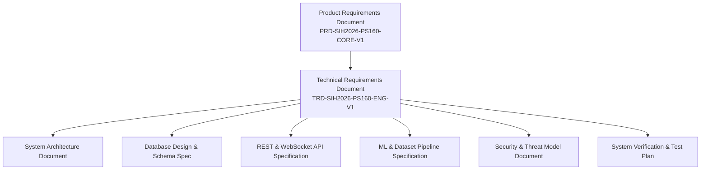

This TRD directly implements the requirements established in `PRD-SIH2026-PS160-CORE-V1`. In any conflict regarding technical architecture, component boundaries, or pipeline specifications, this TRD serves as the authoritative implementation baseline.

---

## 6. Project Technical Overview

**TunnelTrace AI** is an **IPsec Security Intelligence Platform** designed to solve the operational visibility gap in encrypted IPsec VPN deployments. Rather than acting as a simple packet viewer or relying on speculative generative AI, the platform synthesizes:
1. **Deterministic Protocol Forensics:** Dissects binary packet streams, extracts negotiated cryptographic parameters, and statefully tracks Security Association lifecycles.
2. **Encrypted-Traffic Machine Learning:** Infers encapsulated application traffic profiles inside opaque ESP streams using outer timing, size, and burst metadata side channels without breaking encryption.
3. **Standards-Based Policy Engine:** Audits reconstructed configurations against versioned YAML rules encoding authoritative NIST and RFC standards.
4. **Grounded AI Assistance:** Provides conversational analysis powered by local RAG over pre-indexed, verified structured evidence.

---

## 7. Technical Design Principles

1. **Deterministic Priority Over Probabilistic Inference:** Directly observable protocol fields (IKE version, ciphers, DH groups, SPIs) must be parsed deterministically. Machine learning is restricted strictly to unobservable characteristics (inner encrypted traffic type).
2. **Zero Cryptographic Hallucination:** If an IPsec property cannot be established from passive traffic, the system outputs explicit evidence states: `VERIFIED`, `INFERRED`, `UNKNOWN`, or `MISCONFIGURATION OBSERVED`. It never fabricates certainty.
3. **Zero Payload Decryption:** The platform honors cryptographic boundaries. It extracts intelligence exclusively from outer protocol headers, packet dimensions, and inter-arrival timing dynamics.
4. **Decoupled Asynchronous Processing:** Resource-heavy packet parsing and ML workflows must not block API serving threads. Work is decoupled via background task queues.
5. **Local-First & Air-Gap Compatibility:** All ingestion, feature extraction, model inference, and policy evaluation run within the local host boundary. Raw PCAPs are never transmitted to external cloud endpoints.
6. **Closed-Loop Verification:** Recommendations are validated by deploying them to a controlled testbed, re-establishing tunnels, recapturing traffic, and verifying finding resolution.

---

## 8. Assumptions

| ID | Technical Assumption | Justification / Need | Verification Strategy | Failure Impact | Status |
| :--- | :--- | :--- | :--- | :--- | :--- |
| **ASM-01** | Capture files contain IKE handshakes if cipher suite audit is requested. | Passive analysis requires unencrypted IKE exchanges to observe negotiated transforms. | Ingestion pre-scanner validates presence of UDP 500/4500 frames. | Cipher suite marked `UNKNOWN`; ESP traffic analyzed as orphan flow. | Validated Constraint |
| **ASM-02** | Host provides root or `CAP_NET_RAW`/`CAP_NET_ADMIN` privileges for live capture and testbed. | Required for `libpcap` raw socket binding and network namespace routing. | Automated permission check at worker container startup. | Live capture and testbed disabled; system restricts to offline PCAP. | Validated Baseline |
| **ASM-03** | Commodity x86_64 host CPU provides sufficient vector extensions (AVX2) for ML inference. | High-throughput PyTorch and XGBoost inference relies on SIMD instructions. | CPU feature check (`/proc/cpuinfo`) during environment initialization. | CPU inference runs in fallback scalar mode; increased latency. | Validated Baseline |
| **ASM-04** | Metadata side channels retain statistical separability across target application classes. | Encrypted traffic classification relies on packet size distributions and burst timing. | Empirical evaluation of Model A/B on native testbed dataset. | Low classification confidence; high rate of `Unknown / OOD` flags. | Requires Empirical Validation |

---

## 9. Constraints

1. **Passive Sniffing Boundary:** The platform cannot observe pre-shared keys, private asymmetric keys, or configuration parameters not transmitted across the wire.
2. **No Kernel Modification:** The software runs entirely in user-space, interfacing with networking stacks via standard sockets, namespaces, and userspace daemons (`strongSwan`, `libpcap`, `TShark`).
3. **Browser Security Sandbox:** Web browsers cannot execute privileged system calls or raw packet sniffers; the Next.js frontend is strictly an interface communicating via HTTP and WebSockets.
4. **Storage Ceilings:** High-bandwidth packet captures generate massive binary data; raw PCAPs must be spooled to disk, with options for automated purge post-feature extraction.

---

## 10. Agreed Technology Stack

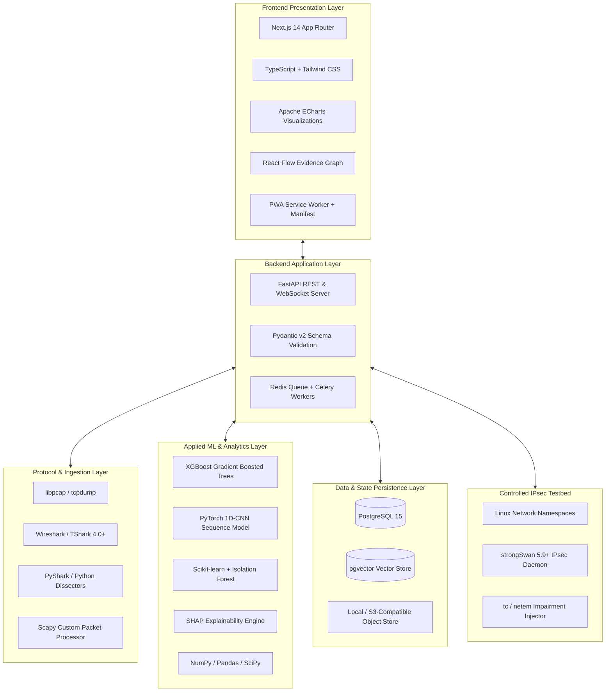

* **Frontend:** Next.js 14 (App Router), TypeScript, Tailwind CSS, custom UI components, Apache ECharts, React Flow, Web App Manifest + Service Worker.
* **Backend:** Python 3.10+, FastAPI, Uvicorn, WebSockets.
* **Async Workers & Queue:** Celery with Redis broker.
* **Packet Capture & Dissection:** `tcpdump`, `libpcap`, TShark ($\ge 4.0$), PyShark, Scapy (custom frames only).
* **IPsec Lab Stack:** Linux network namespaces, strongSwan ($\ge 5.9$), `tc/netem`.
* **Machine Learning:** PyTorch ($\ge 2.1$), XGBoost ($\ge 2.0$), Scikit-learn, SHAP, NumPy, Pandas.
* **Database & Vector Search:** PostgreSQL 15+ with `pgvector` extension.
* **Reporting:** WeasyPrint / Headless Chrome, Jinja2 template engine.
* **Deployment & Containers:** Docker, Docker Compose, unprivileged application containers.

---

## 11. System Context

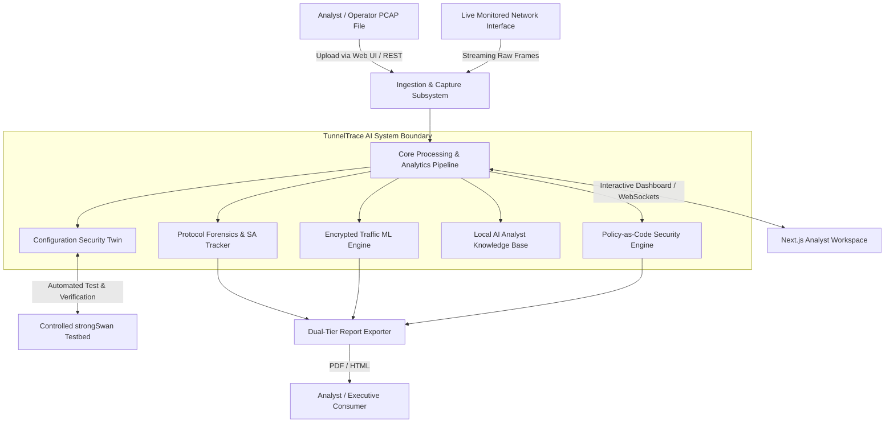

---

## 12. Technical Component Model

The system is organized into modular functional components within a clean backend architecture:

| Component Name | Technical Module | Primary Responsibility | Sync / Async |
| :--- | :--- | :--- | :--- |
| **Capture & Ingestion** | `backend.capture` | File validation, SHA-256 calculation, live stream capture, spooling. | Async (Celery / Stream) |
| **Protocol Forensics** | `backend.protocol` | TShark dissection, field extraction, IKE/ESP/AH header parsing. | Async (Worker Task) |
| **SA Reconstruction** | `backend.sa` | Stateful mapping of IKE SAs to Child SAs, SPI pairing, rekey tracking. | Async (Worker Task) |
| **Flow Reconstruction** | `backend.flow` | Aggregates ESP frames into bidirectional flows; directional sorting. | Async (Worker Task) |
| **Feature Extraction** | `backend.features` | Computes statistical tabular features and early-flow sequence matrices. | Async (Worker Task) |
| **Traffic ML Engine** | `backend.ml` | Evaluates XGBoost and 1D-CNN; computes fusion probabilities. | Async (Worker Task) |
| **Confidence & OOD** | `backend.ood` | Probability calibration (Temperature Scaling) and predictive entropy. | Async (Worker Task) |
| **Explainability** | `backend.xai` | Computes SHAP feature attribution vectors for classified flows. | Async (Worker Task) |
| **Behavioral Anomaly** | `backend.anomaly` | Evaluates Isolation Forest for volume and timing outliers. | Async (Worker Task) |
| **Security Policy** | `backend.policy` | Evaluates YAML Policy-as-Code rules against extracted facts. | Async (Worker Task) |
| **Risk & Scoring** | `backend.risk` | Computes 0–100 posture score, risk grades, and Threat Matrix rows. | Async (Worker Task) |
| **Metadata Exposure** | `backend.metadata` | Computes Metadata Fingerprintability Index from flow distributions. | Async (Worker Task) |
| **Evidence Graph** | `backend.evidence` | Constructs directed acyclic graph linking findings to raw packets. | Async (Worker Task) |
| **Config Security Twin** | `backend.twin` | Virtual what-if policy projection for proposed configurations. | Sync (REST API) |
| **Remediation Engine** | `backend.remediation`| Generates strongSwan remediation; executes closed-loop lab test. | Async (Celery Task) |
| **Reporting Engine** | `backend.reporting` | Compiles Jinja2 templates into printable Executive/Technical PDFs. | Async (Worker Task) |
| **AI Analyst / RAG** | `backend.rag` | Local vector search (`pgvector`) and contextual factual Q&A. | Async (REST / Stream) |
| **Testbed Orchestrator**| `backend.testbed` | Automates Linux namespace creation, strongSwan setups, and traffic. | Async (Celery Task) |

---

## 13. End-to-End Processing Pipeline

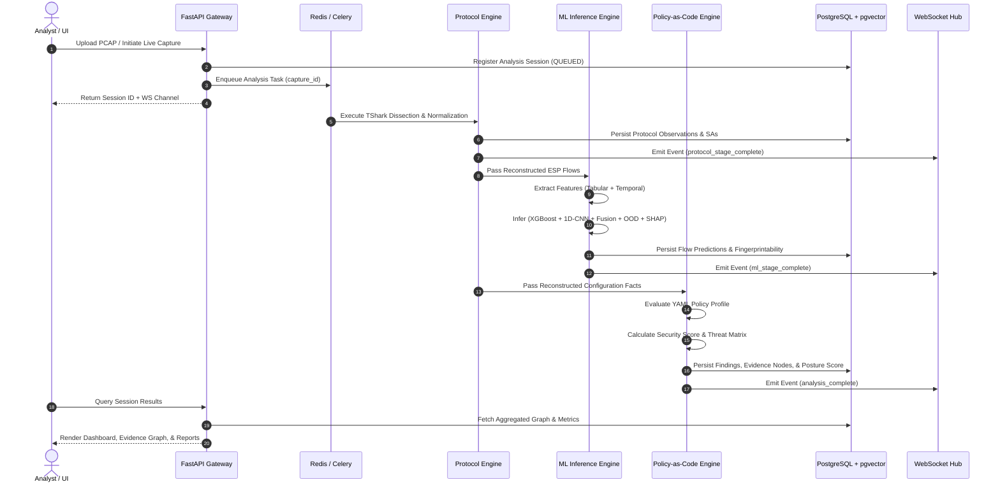

---

## 14. Capture & Ingestion Design

### 14.1 Offline PCAP/PCAPNG Ingestion
* **Inputs:** File upload via `multipart/form-data` or shared filesystem path.
* **Format Validation:** Inspects magic bytes:
  * Classic PCAP (Microsecond): `0xa1b2c3d4` or `0xd4c3b2a1`
  * Classic PCAP (Nanosecond): `0xa1b23c4d` or `0x4d3cb2a1`
  * PCAPNG: `0x0a0d0d0a` (Section Header Block)
* **Cryptographic Hashing:** Computes SHA-256 stream hash during spooling to disk.
* **Storage Path:** Persists raw binary to `$STORAGE_ROOT/captures/<sha256>.<ext>`.
* **Metadata Extraction:** Extracts frame count, start/end timestamps, interface list, and link-layer encapsulation types using `capinfos` or low-level header parsing.

### 14.2 Technical Orchestration Pseudocode
```python
def orchestrate_capture_analysis(capture_file_path: str, profile_id: str) -> AnalysisResult:
    # Step 1: Validate Capture File
    validate_pcap_headers(capture_file_path)
    capture_sha256 = compute_sha256(capture_file_path)
    
    # Step 2: Protocol Dissection & State Reconstruction
    dissected_events = invoke_tshark_dissector(capture_file_path)
    ike_sessions = reconstruct_ike_sessions(dissected_events)
    sa_graph = reconstruct_security_associations(ike_sessions, dissected_events)
    
    # Step 3: ESP Flow Extraction & Classification
    raw_esp_packets = extract_esp_frames(dissected_events)
    flows = reconstruct_bidirectional_flows(raw_esp_packets, sa_graph)
    
    predictions = []
    for flow in flows:
        if flow.packet_count >= MIN_FLOW_PACKET_THRESHOLD:
            feats = extract_tabular_features(flow)
            seq_tensor = extract_sequence_tensor(flow, target_len=SEQUENCE_LENGTH_CANDIDATE)
            pred = execute_ml_inference(feats, seq_tensor)
            predictions.append(pred)
        else:
            predictions.append(create_insufficient_evidence_record(flow))
            
    # Step 4: Policy-as-Code Evaluation
    policy_catalog = load_versioned_policy_profile(profile_id)
    findings = evaluate_security_rules(sa_graph, policy_catalog)
    
    # Step 5: Scoring, Risk, and Exposure Metrics
    security_score = compute_security_score(findings, sa_graph)
    threat_matrix = generate_threat_matrix(findings)
    fingerprint_index = compute_metadata_fingerprint_index(flows, predictions)
    
    # Step 6: Persist Evidence Graph & Finalize
    evidence_graph = compile_evidence_graph(findings, dissected_events, sa_graph)
    persist_analysis_record(capture_sha256, sa_graph, findings, security_score, evidence_graph)
    
    return compile_response_bundle(security_score, threat_matrix, predictions, evidence_graph)
```

---

## 15. PCAP Security Design

To prevent arbitrary code execution or Denial-of-Service via weaponized capture files, the ingestion engine implements strict defense-in-depth:
1. **Filename Sanitization:** Discards user-provided filenames. Assigns cryptographically random UUIDv4 names on disk.
2. **Subprocess Sandboxing:** Invokes TShark and external binaries as unprivileged system users (`uid: 10001`, `gid: 10001`) with dropped Linux capabilities (`CAP_SYS_ADMIN`, `CAP_NET_RAW` dropped).
3. **No Shell Interpolation:** Prohibits `shell=True` in Python `subprocess`. Commands are passed as strict argument arrays: `["tshark", "-r", safe_path, "-T", "json", ...]`.
4. **Resource Constraints:** Sets hard process limits via `prlimit` or container cgroups:
   * Max virtual memory: *TBD — target baseline 2048 MB*
   * Max CPU execution time: *TBD — target baseline 120 seconds*
5. **Temporary Storage Isolation:** Files reside in ephemeral directories mounted with `noexec,nosuid,nodev`.

---

## 16. Live Capture Design

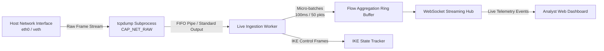

* **Interface Verification:** Verifies interface existence in `/sys/class/net/` and operational state (`up`).
* **Privilege Segregation:** Live capture daemon runs as a dedicated isolated service holding `CAP_NET_RAW` capabilities, emitting packet metadata over a local Unix domain socket to the unprivileged FastAPI application.
* **Capture Filter:** Applies deterministic BPF filter: `(udp port 500) or (udp port 4500) or (ip proto 50) or (ip proto 51)`.
* **Ring Buffer & Rotating Spool:** Captures stream to 10 MB rotating chunk PCAPs (`capture_part_001.pcap`) to allow concurrent dissection while maintaining a sliding analysis window.

---

## 17. Protocol Forensics Design

### 17.1 Normalization Architecture
TShark provides primary deep protocol dissection via JSON output (`-T ek` or `-T json`). The Python forensics engine parses raw dissection trees into strongly typed domain models.

### 17.2 Protocol Normalization Pseudocode
```python
def normalize_protocol_frame(raw_tshark_packet: dict) -> NormalizedObservation:
    layers = raw_tshark_packet.get("_source", {}).get("layers", {})
    packet_number = int(raw_tshark_packet.get("_source", {}).get("number", 0))
    timestamp = float(raw_tshark_packet.get("_source", {}).get("timestamp", 0.0))
    
    # Check IP Layer
    ip_version = "IPv6" if "ipv6" in layers else "IPv4"
    src_ip = layers.get("ip", {}).get("ip.src") or layers.get("ipv6", {}).get("ipv6.src")
    dst_ip = layers.get("ip", {}).get("ip.dst") or layers.get("ipv6", {}).get("ipv6.dst")
    
    # Check IKE Protocol
    if "isakmp" in layers:
        ike_layer = layers["isakmp"]
        version_str = ike_layer.get("isakmp.version", "0.0")
        major_ver = int(version_str.split(".")[0]) if "." in version_str else 1
        
        return NormalizedObservation(
            protocol="IKE",
            version=f"IKEv{major_ver}",
            packet_number=packet_number,
            timestamp=timestamp,
            src_endpoint=src_ip,
            dst_endpoint=dst_ip,
            evidence_state=EvidenceState.VERIFIED,
            details=extract_ike_details(ike_layer, major_ver)
        )
        
    # Check ESP Protocol (Protocol 50 or UDP 4500 encapsulated)
    if "esp" in layers:
        esp_layer = layers["esp"]
        spi_raw = esp_layer.get("esp.spi")
        spi_val = int(spi_raw, 16) if isinstance(spi_raw, str) else int(spi_raw)
        seq_val = int(esp_layer.get("esp.sequence", 0))
        
        return NormalizedObservation(
            protocol="ESP",
            packet_number=packet_number,
            timestamp=timestamp,
            src_endpoint=src_ip,
            dst_endpoint=dst_ip,
            spi=spi_val,
            sequence_number=seq_val,
            is_natt=("udp" in layers and layers["udp"].get("udp.dstport") == "4500"),
            evidence_state=EvidenceState.VERIFIED
        )
        
    return NormalizedObservation(protocol="NON_IPSEC", packet_number=packet_number)
```

---

## 18. IKE Analysis Design

### 18.1 IKE Version Identification
* **IKEv1:** ISAKMP header flags Version `1.0`. Evaluates Exchange Types:
  * `2`: Identity Protection (Main Mode)
  * `4`: Aggressive Mode
  * `5`: Informational
  * `32`: Quick Mode (Phase 2 Negotiation)
* **IKEv2:** Header flags Version `2.0` (RFC 7296). Evaluates Exchange Types:
  * `34`: `IKE_SA_INIT`
  * `35`: `IKE_AUTH`
  * `36`: `CREATE_CHILD_SA`
  * `37`: `INFORMATIONAL`
* If packet headers are corrupted or truncated, records version as `UNKNOWN`. Never uses ML for IKE version.

### 18.2 Cryptographic Transform Parsing
Extracts Security Association (SA) payloads. Maps transform substructures via IANA IKEv2 Parameter Registries:
* **Transform Type 1 (Encryption):** `ENCR_3DES` (3), `ENCR_AES_CBC` (12), `ENCR_AES_GCM_16` (20), `ENCR_CHACHA20_POLY1305` (28).
* **Transform Type 2 (PRF):** `PRF_HMAC_MD5` (1), `PRF_HMAC_SHA1` (2), `PRF_HMAC_SHA2_256` (5), `PRF_HMAC_SHA2_512` (7).
* **Transform Type 3 (Integrity):** `AUTH_HMAC_MD5_96` (1), `AUTH_HMAC_SHA1_96` (2), `AUTH_HMAC_SHA2_256_128` (12).
* **Transform Type 4 (Diffie-Hellman Group):** Group 2 (1024-bit MODP), Group 5 (1536-bit), Group 14 (2048-bit MODP), Group 19 (256-bit random ECP), Group 20 (384-bit random ECP), Group 31 (Curve25519).

---

## 19. ESP/AH Analysis Design

* **ESP Parsing (RFC 4303):** Extracts:
  * `SPI` (32 bits): Identifies receiving Security Association.
  * `Sequence Number` (32 bits): Strictly monotonically increasing counter; verifies replay protection.
  * `Payload Data` (Opaque encrypted bytes): Preserved strictly as length dimensions; never cracked.
* **NAT-Traversal Detection (RFC 3948):** Detects encapsulation where UDP destination port is 4500 and the leading 32 bits after the UDP header are non-zero (indicating SPI, distinguishing it from the 32-bit zero Non-ESP Marker used in IKE over 4500).
* **AH Parsing (RFC 4302 - Optional):** Dissects Next Header, Payload Length, Reserved, SPI, Sequence Number, and Integrity Check Value (ICV).

---

## 20. Tunnel/Transport Determination

The engine implements a hierarchical determination algorithm:
1. **Tier 1: Explicit Protocol Evidence (`VERIFIED`):**
   * In IKEv2, inspects `IKE_AUTH` or `CREATE_CHILD_SA` exchanges for Notify Payload Type 16391 (`USE_TRANSPORT_MODE`). If present, sets `TRANSPORT_MODE`; if absent and Traffic Selectors span subnets, sets `TUNNEL_MODE`.
2. **Tier 2: Contextual Wire Inference (`INFERRED`):**
   * If IKE negotiation is absent: analyzes outer IP source/destination addresses against endpoint topology. If endpoints represent public gateways carrying diverse internal IP patterns across session hops, infers `TUNNEL_MODE`. If endpoints communicate directly host-to-host without internal routing indicators, infers `TRANSPORT_MODE`.
3. **Tier 3: Inconclusive Evidence (`UNKNOWN`):**
   * If capture contains isolated ESP frames with ambiguous addressing and zero control plane packets, sets state to `UNKNOWN`.

---

## 21. SA Reconstruction Design

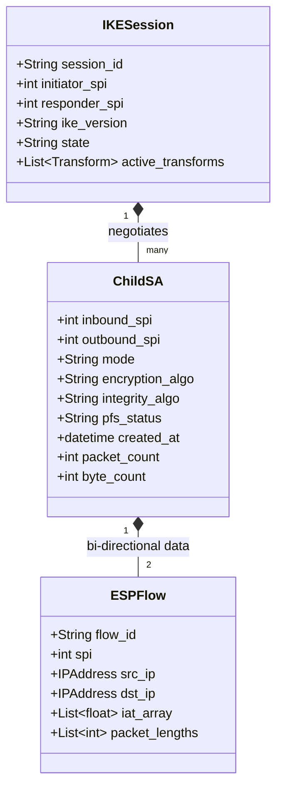

### 21.1 Stateful SA Reconstruction Pseudocode
```python
def reconstruct_security_associations(ike_sessions: list, frames: list) -> SAGraph:
    sa_graph = SAGraph()
    
    for session in ike_sessions:
        ike_sa = IKESARecord(
            session_id=session.id,
            initiator_spi=session.init_spi,
            responder_spi=session.resp_spi,
            version=session.version,
            transforms=session.negotiated_transforms,
            evidence_state=EvidenceState.VERIFIED
        )
        sa_graph.add_ike_sa(ike_sa)
        
        # Correlate Child SAs negotiated inside this session
        for child_msg in session.child_sa_exchanges:
            in_spi, out_spi = extract_child_spis(child_msg)
            pfs_observed = check_child_sa_ke_payload(child_msg)
            
            child_sa = ChildSARecord(
                parent_session_id=session.id,
                inbound_spi=in_spi,
                outbound_spi=out_spi,
                transforms=child_msg.transforms,
                mode=determine_mode(child_msg),
                pfs_state=EvidenceState.VERIFIED if pfs_observed else EvidenceState.UNKNOWN
            )
            sa_graph.add_child_sa(child_sa)
            
    # Associate orphan ESP streams (packets where no IKE was captured)
    unmapped_spis = find_unmapped_esp_spis(frames, sa_graph)
    for spi in unmapped_spis:
        sa_graph.add_orphan_child_sa(
            ChildSARecord(
                inbound_spi=spi,
                outbound_spi=0,
                evidence_state=EvidenceState.INFERRED,
                transforms=None  # Unknown without IKE
            )
        )
    return sa_graph
```

---

## 22. Evidence-State Model

Every reconstructed parameter, finding, and score deduction must carry an immutable `EvidenceState`:

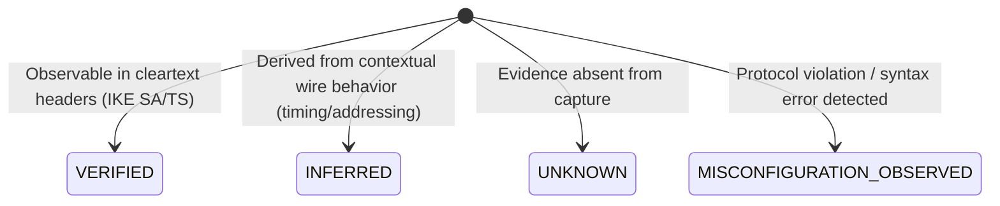

* `VERIFIED`: Directly observed in unencrypted wire packets with complete syntax validity.
* `INFERRED`: Derived deterministically from partial wire context or high-confidence statistical heuristics.
* `UNKNOWN`: Missing from captured trace (e.g., mid-session capture missing IKE handshake).
* `MISCONFIGURATION_OBSERVED`: Explicit evidence of protocol failure (e.g., `NO_PROPOSAL_CHOSEN` notification, sequence rollover without rekey).

---

## 23. Flow Reconstruction Design

### 23.1 Bidirectional ESP Flow Association
* **Flow Identifier Key:** 3-tuple: `(Endpoint A IP, Endpoint B IP, SPI)`. For bidirectional correlation, flows are coupled where Inbound SPI and Outbound SPI belong to the same negotiated Child SA.
* **Flow Inactivity Timeout:** *TBD — experimental baseline: 30 seconds*. An idle gap exceeding this threshold concludes the flow record.
* **Flow Maximum Duration:** *TBD — experimental baseline: 300 seconds*. Flows exceeding this duration are split into discrete temporal sub-flows to bound feature memory.

---

## 24. Feature Extraction Design

### 24.1 Feature Extraction Pipeline
The feature extraction engine consumes raw ESP frames and extracts two distinct feature representations:

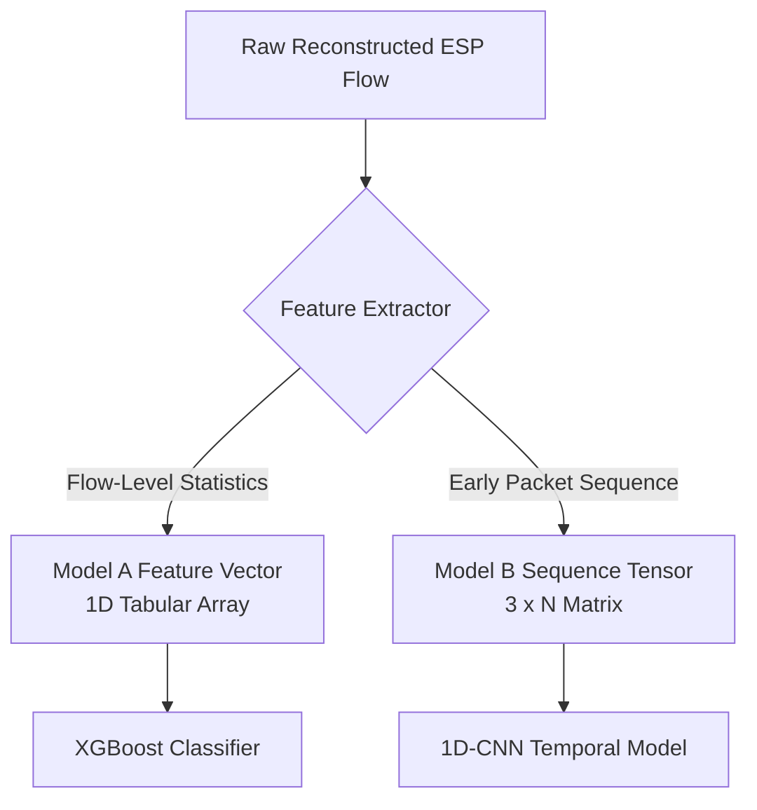

### 24.2 Feature Extraction Pseudocode
```python
def extract_tabular_features(flow: ESPFlow) -> np.ndarray:
    lengths = np.array(flow.packet_lengths, dtype=np.float32)
    iats = np.array(flow.inter_arrival_times, dtype=np.float32)
    directions = np.array(flow.directions, dtype=np.float32)  # +1 forward, -1 reverse
    
    fwd_mask = (directions == 1.0)
    rev_mask = (directions == -1.0)
    
    fwd_lengths = lengths[fwd_mask] if np.any(fwd_mask) else np.array([0.0])
    rev_lengths = lengths[rev_mask] if np.any(rev_mask) else np.array([0.0])
    
    features = [
        # Duration & Volume
        flow.duration_seconds,
        float(len(lengths)),
        float(np.sum(lengths)),
        # Directional Ratios
        float(len(fwd_lengths)) / max(len(lengths), 1),
        float(np.sum(fwd_lengths)) / max(np.sum(lengths), 1.0),
        # Packet Size Distribution
        float(np.mean(lengths)),
        float(np.std(lengths)),
        float(np.min(lengths)),
        float(np.max(lengths)),
        float(np.percentile(lengths, 25)),
        float(np.percentile(lengths, 50)),
        float(np.percentile(lengths, 75)),
        float(np.percentile(lengths, 90)),
        # Inter-Arrival Time (IAT) Statistics
        float(np.mean(iats)) if len(iats) > 0 else 0.0,
        float(np.std(iats)) if len(iats) > 0 else 0.0,
        float(np.max(iats)) if len(iats) > 0 else 0.0,
        # Rates
        float(len(lengths)) / max(flow.duration_seconds, 0.001),
        float(np.sum(lengths)) / max(flow.duration_seconds, 0.001)
    ]
    
    # Anti-Leakage Guardrail: Ensure zero IP/Port/SPI metadata enters feature vector
    return np.array(features, dtype=np.float32)

def extract_sequence_tensor(flow: ESPFlow, target_len: int = 64) -> torch.Tensor:
    # 3-channel matrix: [direction, packet_length, delta_t]
    matrix = np.zeros((3, target_len), dtype=np.float32)
    count = min(len(flow.packet_lengths), target_len)
    
    for i in range(count):
        matrix[0, i] = flow.directions[i]
        matrix[1, i] = flow.packet_lengths[i] / 1500.0  # Normalized by MTU
        matrix[2, i] = min(flow.inter_arrival_times[i], 1.0) if i > 0 else 0.0
        
    return torch.from_numpy(matrix)
```

---

## 25. Dataset Generation Architecture

```mermaid
flowchart TD
    subgraph Testbed Host (Linux)
        subgraph NS_CLIENT["Namespace: Client (Workload Generator)"]
            APP[Synthetic Traffic Injectors\nsip-bench, curl, iperf3, hping3]
        end
        
        subgraph NS_GW_A["Namespace: Gateway A (strongSwan)"]
            SW_A[strongSwan Instance A\nswanctl / vici]
            PCAP_PLAIN[Plaintext Capture: tcpdump]
        end
        
        subgraph NS_WAN["Namespace: WAN Network Simulator"]
            TC[Traffic Control: tc / netem\nLatency, Jitter, Loss, Throttling]
            PCAP_ENC[Encrypted Capture: tcpdump\nESP / IKE Traces]
        end
        
        subgraph NS_GW_B["Namespace: Gateway B (strongSwan)"]
            SW_B[strongSwan Instance B]
        end
        
        subgraph NS_SERVER["Namespace: Server (Destination Workload Sink)"]
            SINK[Traffic Sinks & Echo Daemons]
        end
    end
    
    APP -->|Plain Traffic| SW_A
    SW_A -->|Encrypted ESP| TC
    TC -->|Impaired ESP| SW_B
    SW_B -->|Plain Traffic| SINK
    
    PCAP_PLAIN & PCAP_ENC --> DS_SYNC[Dataset Synchronizer & Metadata Binder]
    DS_SYNC --> REPO[(IPsec-Native Ground-Truth Dataset)]
```

---

## 26. Dataset Ground-Truth Method

The platform maintains synchronized ground-truth capture:
* **Dual-Capture Synchronization:** Records traffic at `veth-plain` (inside Client namespace, observing plaintext IP/TCP/UDP) and `veth-wan` (outside Gateway A, observing encrypted ESP frames).
* **Clock Synchronization:** Namespaces share host kernel monotonic clock timestamps with microsecond precision.
* **Ground-Truth Manifest:** For every session, writes `manifest.json`:
  ```json
  {
    "session_id": "exp_tunnel_aesgcm_voip_0042",
    "traffic_class": "VoIP",
    "workload_profile": "G.711_SIP_RTP_Simulation",
    "ipsec_mode": "TUNNEL",
    "ike_version": "IKEv2",
    "cipher_suite": "AES-256-GCM",
    "dh_group": 19,
    "pfs_enabled": true,
    "wan_impairment": {
      "delay_ms": 45,
      "jitter_ms": 10,
      "loss_percent": 1.5
    },
    "plain_pcap": "captures/plain/exp_0042_plain.pcap",
    "encrypted_pcap": "captures/enc/exp_0042_esp.pcap"
  }
  ```

---

## 27. Dataset Split / Leakage Prevention

To ensure true generalizability and prevent artificial score inflation:
1. **Independent Session-Level Splitting:** Random assignment of packets or flows from the same capture session into both train and test splits is strictly prohibited. Splitting utilizes `GroupKFold` grouped on `session_id`.
2. **Cross-Configuration Validation:** Evaluates models on distinct holdout test splits where the cryptographic cipher or network impairment was never encountered during training (e.g., Train on AES-CBC, Test on AES-GCM).

---

## 28. ML Training Pipeline

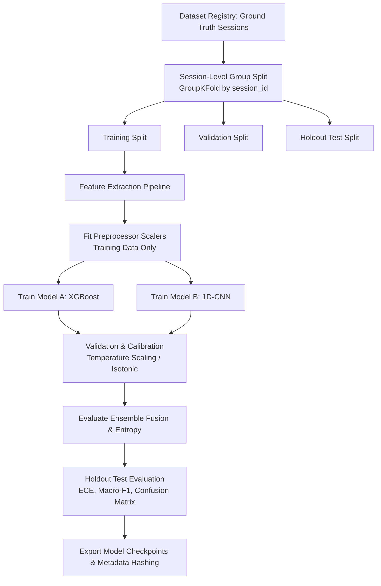

---

## 29. XGBoost Design (Model A)

* **Model Role:** Primary tabular classifier utilizing high-dimensional statistical flow features.
* **Input Dimension:** 1D feature vector of $K$ engineered statistical features (*Exact feature count $K$: TBD after ablation*).
* **Objective:** `multi:softprob` across the known taxonomy:
  1. `Web`
  2. `Video Streaming`
  3. `VoIP`
  4. `Chat / Messaging`
  5. `Email`
  6. `ICMP`
  7. `File Transfer`
* **Explainability Support:** Native integration with SHAP `TreeExplainer` for linear-time additive feature attribution.
* **Hyperparameters:** *TBD — Requires empirical hyperparameter tuning*.

---

## 30. 1D-CNN Design (Model B)

* **Model Role:** Temporal sequence classifier learning local burst and directionality dynamics from early-flow packet arrival sequences.
* **Input Tensor Shape:** $B \times 3 \times N$, where $B$ is batch size, 3 channels are `[direction, packet_length, delta_t]`, and $N \in \{32, 64, 128\}$ packets (*Sequence length candidate TBD*).
* **Architecture Concept:** Lightweight 1D Convolutional layers with Batch Normalization, ReLU activation, 1D Max Pooling, and Global Average Pooling feeding a linear classification head.
* **Padding & Masking:** Flows with fewer than $N$ frames are right-padded with zeros; a boolean padding mask prevents pooling distortion.

---

## 31. Model Fusion

* **Objective:** Combine class probability distributions $\mathbf{P}_A$ (XGBoost) and $\mathbf{P}_B$ (1D-CNN).
* **Fusion Strategy:** Evaluates weighted probability averaging vs. learned meta-classifier:
  $$\mathbf{P}_{\text{fused}} = \alpha \mathbf{P}_A + (1 - \alpha) \mathbf{P}_B$$
  *Weight parameter $\alpha$ and ensemble methodology: TBD through validation using held-out sessions.*

---

## 32. Calibration

* **Calibration Requirement:** Raw softmax probabilities must not be equated with true empirical confidence.
* **Neural Calibration (Model B):** Applies Temperature Scaling on logits:
  $$P_i = \frac{e^{z_i / T}}{\sum_j e^{z_j / T}}$$
  where temperature parameter $T > 0$ is optimized via Negative Log-Likelihood (NLL) on the validation split.
* **Evaluation Metrics:** Expected Calibration Error (ECE) and Brier Score plotted on Reliability Diagrams.

---

## 33. Unknown/OOD Detection

### 33.1 OOD Decision Logic
The platform avoids forced classification of unrepresented traffic classes by evaluating normalized predictive entropy $H(\mathbf{P})$ and maximum calibrated confidence $C_{\max}$:

$$H(\mathbf{P}) = - \frac{1}{\log_2 C} \sum_{c=1}^{C} P_c \log_2 P_c$$

### 33.2 OOD Decision Pseudocode
```python
def evaluate_ood_status(calibrated_probs: np.ndarray) -> OODDecision:
    max_confidence = float(np.max(calibrated_probs))
    predicted_idx = int(np.argmax(calibrated_probs))
    
    # Calculate Normalized Shannon Entropy
    num_classes = len(calibrated_probs)
    entropy = -np.sum(calibrated_probs * np.log2(calibrated_probs + 1e-12)) / np.log2(num_classes)
    
    # Thresholds: TBD through empirical validation
    CONFIDENCE_THRESHOLD = 0.55
    ENTROPY_THRESHOLD = 0.70
    
    if max_confidence < CONFIDENCE_THRESHOLD or entropy > ENTROPY_THRESHOLD:
        # Sort top candidate hypotheses
        top_indices = np.argsort(calibrated_probs)[::-1][:2]
        hypotheses = [
            {"class": TAXONOMY[idx], "prob": float(calibrated_probs[idx])}
            for idx in top_indices
        ]
        return OODDecision(
            is_ood=True,
            final_class="Unknown / Unseen Traffic",
            confidence=max_confidence,
            entropy=entropy,
            candidates=hypotheses,
            uncertainty_reason="Low calibrated confidence and high predictive entropy"
        )
        
    return OODDecision(
        is_ood=False,
        final_class=TAXONOMY[predicted_idx],
        confidence=max_confidence,
        entropy=entropy,
        candidates=[]
    )
```

---

## 34. Explainability

* **Engine:** SHAP (SHapley Additive exPlanations) `TreeExplainer` applied to Model A (XGBoost).
* **Outputs:** Signed feature attribution vector $\phi \in \mathbb{R}^K$ indicating how much each feature shifted the log-odds of the predicted class relative to the base expectation.
* **Visualization Interface:** Renders horizontal waterfall/bar chart in UI detailing top positive and negative features (e.g., `packet_length_std_dev < 45.0` drove $+0.42$ toward `VoIP`).

---

## 35. Behavioral Anomaly Detection

* **Algorithm:** Scikit-learn `IsolationForest`.
* **Input Features:** Windowed flow statistics: aggregate packets/sec, bytes/sec, sequence number acceleration rate, and rekey interval deltas.
* **Scope Definition:** Operates strictly as a *Behavioral Anomaly Detector* signaling statistical deviations in tunnel activity. It does not classify specific attack payloads or claim zero-day threat prevention.

---

## 36. ML Evaluation Strategy

The model evaluation harness executes across standardized test partitions:
1. **In-Distribution Test:** Standard held-out sessions matching training configurations.
2. **Independent-Session Test:** Completely unseen session recordings with different timing seeds.
3. **Cross-Configuration Test:** Unseen cipher suites (e.g., evaluate on AES-GCM when trained on CBC).
4. **Network Impairment Test:** Evaluates accuracy degradation across increasing packet loss and latency steps.
5. **Reported Metrics:** Macro-Averaged F1, Per-Class F1, Confusion Matrix, ECE, Brier Score, Mean Inference Latency.

---

## 37. Model Artifact Management

Model artifacts are stored with strict cryptographic hashing and manifest registration:
```
models/
  ├── v1.0.0/
  │   ├── xgboost_model.json
  │   ├── cnn_weights.pt
  │   ├── preprocessor_scaler.joblib
  │   ├── calibration_params.json
  │   ├── manifest.json
  │   └── checksums.sha256
```
* `manifest.json` documents training dataset ID, Git commit hash, hyperparameter list, and feature schema version.
* Model artifacts are loaded into memory at backend initialization; models are strictly immutable during serving.

---

## 38. Model Inference Architecture

* **Runtime:** Single worker thread or batched inference pool running PyTorch and XGBoost in C-extensions.
* **Input:** Raw reconstructed `ESPFlow` objects.
* **Latency Optimization:** Feature extraction and tensor formatting execute in vectorized NumPy routines; inference runs in sub-10ms per flow (*Target to be benchmarked*).
* **Output:** JSON prediction records bound to flow IDs.

---

## 39. Security Policy Engine

### 39.1 Policy Execution Architecture
The security assessment engine is strictly deterministic, employing a Python-based rule engine that evaluates versioned YAML Policy-as-Code definitions against verified configuration evidence.

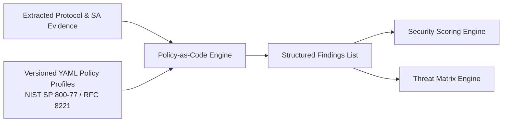

---

## 40. Policy Schema

Policy rules are codified in YAML adhering to a strict schema:

```yaml
policy_profile:
  id: "NIST-SP-800-77-REV1"
  name: "NIST Special Publication 800-77 Revision 1 Profile"
  version: "1.0.0"
  authoritative_reference: "NIST SP 800-77 Rev. 1 (Guide to IPsec VPNs)"

rules:
  - id: "IPSEC-CRYPTO-001"
    title: "Deprecated Triple-DES (3DES) Cipher Negotiated"
    category: "CRYPTOGRAPHIC_STRENGTH"
    severity: "CRITICAL"
    condition:
      target: "child_sa.encryption_algorithm"
      operator: "in"
      value: ["3DES", "DES", "ENCR_3DES"]
    reference:
      standard: "NIST SP 800-77 Rev. 1"
      clause: "Section 4.1.1 (Algorithms)"
      advisory: "Triple-DES is deprecated due to Sweet32 collision vulnerabilities."
    remediation:
      strongswan_snippet: "esp = aes256gcm16,aes128gcm16!"
      guidance: "Migrate to AES-GCM (128 or 256-bit) or AES-CBC with SHA-256."

  - id: "IPSEC-KE-002"
    title: "Weak Diffie-Hellman Group Observed (< 2048-bit MODP)"
    category: "KEY_EXCHANGE"
    severity: "HIGH"
    condition:
      target: "ike_sa.dh_group"
      operator: "in"
      value: [1, 2, 5]
    reference:
      standard: "NIST SP 800-77 Rev. 1"
      clause: "Section 4.1.2 (Key Exchange)"
      advisory: "Diffie-Hellman groups 1, 2, and 5 provide less than 112 bits of security."
    remediation:
      strongswan_snippet: "ike = aes256-sha256-modp2048,aes256-sha256-ecp256!"
      guidance: "Configure DH Group 14 (MODP 2048) or DH Group 19 (Curve25519/ECP256) minimum."
```

### 40.1 Policy-Rule Evaluation Pseudocode
```python
def evaluate_security_rules(sa_graph: SAGraph, policy_profile: dict) -> list[SecurityFinding]:
    findings = []
    
    for rule in policy_profile.get("rules", []):
        condition = rule["condition"]
        target_path = condition["target"].split(".")
        operator = condition["operator"]
        target_val = condition["value"]
        
        # Resolve target value from sa_graph
        observed_values = resolve_graph_attribute(sa_graph, target_path)
        
        for obs in observed_values:
            violation_detected = False
            if operator == "in" and obs.value in target_val:
                violation_detected = True
            elif operator == "equals" and obs.value == target_val:
                violation_detected = True
            elif operator == "less_than" and obs.value < target_val:
                violation_detected = True
                
            if violation_detected:
                findings.append(SecurityFinding(
                    rule_id=rule["id"],
                    title=rule["title"],
                    category=rule["category"],
                    severity=rule["severity"],
                    observed_evidence=obs.value,
                    evidence_packet_number=obs.packet_number,
                    reference=rule["reference"],
                    remediation=rule["remediation"],
                    evidence_state=obs.evidence_state
                ))
    return findings
```

---

## 41. Compliance Engine

* **Input:** Evaluated findings list and selected compliance profile (`NIST-SP-800-77-REV1`, `IETF-RFC8221`, `ENTERPRISE-STRICT`).
* **Evaluation Status per Control:**
  * `PASS`: Evaluated configuration satisfies all assertion criteria.
  * `FAIL`: Concrete configuration evidence violates assertion criteria.
  * `UNKNOWN`: Data unobservable in passive capture (e.g., rekey lifetime when capture is partial).
  * `NOT_APPLICABLE`: Control does not apply to negotiated mode (e.g., AH rules when ESP is active).

---

## 42. Security Score Engine

* **Score Domain:** Quantitative scalar: `0` to `100`.
* **Deduction Principle:** Begins at a baseline of `100`. Every deduction must cite an explicit `Finding ID`.
* **Formula Framework:**
  $$\text{Score} = \max\left(0, 100 - \sum_{i} W_{\text{severity}}(f_i) \cdot M_{\text{category}}(f_i)\right)$$
  *Scoring weights and penalty multipliers: TBD during security-engine design and validation.*
* **Transparency Requirement:** System reports a complete Score Deduction Audit Table listing every deduction, points subtracted, and citation.

---

## 43. Risk Engine

* **Risk Formulation:** Computes risk score per finding:
  $$\text{Risk}(f) = \text{Likelihood}(f) \times \text{Impact}(f) \times \text{Confidence}(f)$$
  *Likelihood and impact assignment scales: TBD in security design.*
* Deterministic logic maps known vulnerabilities to standard CVSS v3.1 qualitative impact bases (e.g., 3DES Sweet32 collision $\to$ Confidentiality Impact: HIGH).

---

## 44. Threat Matrix Engine

Constructs an itemized Threat Matrix table from verified findings:

| Threat ID | Threat / Attack Scenario | Affected Entity | Exploit Vector | Likelihood | Impact | Severity | Standards Citation | Evidence State |
| :--- | :--- | :--- | :--- | :--- | :--- | :--- | :--- | :--- |
| `THREAT-01` | Passive Eavesdropping via Sweet32 64-bit Birthday Collision | Child SA (SPI: `0x4a2b`) | Intercept $2^{32}$ cipher blocks to decrypt HTTP session cookies. | Medium | High | High | NIST SP 800-77 Rev. 1 | `VERIFIED` |
| `THREAT-02` | Pre-Computation Attack on 1024-bit DH Group (Logjam) | IKE SA (Init SPI: `0x91ef`) | Nation-state precomputed discrete log attack breaking shared secret. | Low | Critical | High | RFC 8247 | `VERIFIED` |
| `THREAT-03` | Retroactive Decryption Post-Private-Key-Compromise (Missing PFS) | Child SA (SPI: `0x4a2b`) | Adversary intercepts traffic; recovers master key; decrypts historical sessions. | Medium | High | High | RFC 7296 | `VERIFIED` |

---

## 45. Metadata Fingerprintability Engine

* **Purpose:** Quantify how identifiable an encrypted flow remains through side channels.
* **Signals:** Calibrated ML confidence, packet length variance, IAT distribution entropy, and burstiness ratios.
* **Metric:** `Metadata Fingerprintability Index` ($0.00$ to $1.00$ or $0$ to $100$).
* **Methodology Disclaimer:** The platform strictly prohibits claiming *"X% of plaintext is leaked."* It explicitly reports *behavioral fingerprintability under passive observation*. *Formula TBD through empirical validation.*

---

## 46. Evidence/Provenance Architecture

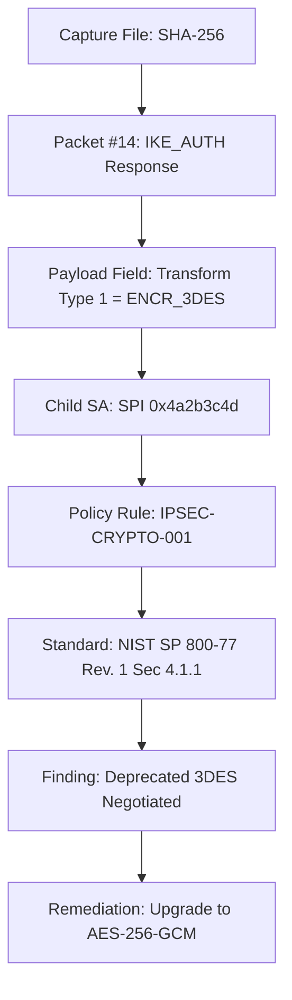

Every database finding object retains a foreign key pointer to an `EvidenceNode` record referencing:
* `capture_sha256`
* `packet_number`
* `byte_offset`
* `dissector_field_name`
* `observed_raw_value`

---

## 47. Configuration Security Twin

* **Operational Concept:** A virtual configuration analyzer that compiles and audits proposed configuration files (`swanctl.conf` or `ipsec.conf`) without passing wire traffic.
* **Processing:** 
  1. Parses proposed configuration text.
  2. Synthesizes a virtual `SAGraph` representing proposed parameters.
  3. Executes the Policy-as-Code engine against the virtual model.
  4. Generates a side-by-side projected score delta ($\Delta S = S_{\text{proposed}} - S_{\text{current}}$).
* **Boundary:** Strictly a *configuration policy projection*, not a dynamic network simulation.

---

## 48. Remediation Engine

* **Synthesis Logic:** Maps failed policy rules to standardized strongSwan configuration templates.
* **Code Synthesis:**
  * Replaces legacy `ike = 3des-sha1-modp1024` with `ike = aes256-sha256-modp2048,aes256-sha256-curve25519!`.
  * Replaces legacy `esp = 3des-sha1` with `esp = aes256gcm16,aes128gcm16!`.
* **Output:** Copy-pasteable configuration blocks with line-by-line justification comments citing violated standards.

---

## 49. Remediation Verification / Rollback

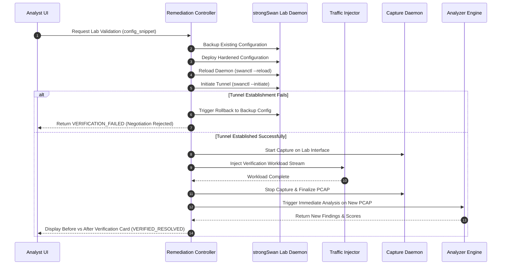

---

## 50. Reporting Engine

* **Architecture:** Headless Python rendering service utilizing Jinja2 and WeasyPrint (or headless Chromium).
* **Executive Report Pipeline:** Formats high-level security score, CISO risk summary, radar charts, top 3 strategic vulnerabilities, and compliance matrices. Excludes packet hex.
* **Technical Report Pipeline:** Renders complete forensic breakdowns: SHA-256 hashes, IKE ladder diagrams, SPI tables, ML feature distributions, SHAP waterfall charts, complete Threat Matrix, and evidence graphs.
* **Fallback:** If PDF compilation exceeds timeout limits, the engine outputs standalone, print-ready HTML/CSS.

---

## 51. AI Analyst / RAG Design

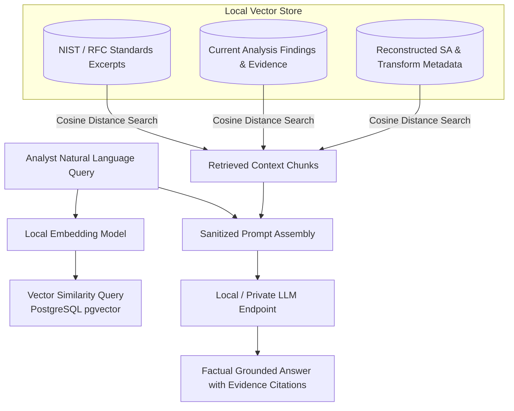

### 51.1 Strict Groundedness Guardrails
1. The AI Analyst answers exclusively using context retrieved from the current session's findings and approved standards documents.
2. If evidence is absent, the model is prompted to state: *"I cannot verify this from the passive capture evidence."*
3. The LLM is strictly prohibited from generating new vulnerabilities, altering security scores, or inventing protocol packet fields.

---

## 52. Backend Orchestration

* **API Gateway:** FastAPI serving asynchronous REST endpoints and WebSocket connections.
* **Task Routing:** Routes long-running tasks (dissection, ML inference, testbed deployment, PDF compilation) to Celery task queues.
* **State Management:** Fast session state updates maintained in PostgreSQL and broadcasted via Redis Pub/Sub to active WebSocket connections.

---

## 53. Background Jobs

* **Broker:** Redis (`redis://redis:6379/0`).
* **Workers:** Celery worker pool running unprivileged processes.
* **Task Lifecycle States:** `PENDING` $\to$ `STARTED` $\to$ `PROGRESS (Stage 1..N)` $\to$ `SUCCESS` / `FAILURE` $\to$ `REVOKED`.
* **Progress Tracking:** Workers publish percentage completion and current processing stage (`INGESTION`, `PROTOCOL`, `ML`, `POLICY`, `COMPLETE`) to Redis.

---

## 54. Persistence Boundaries

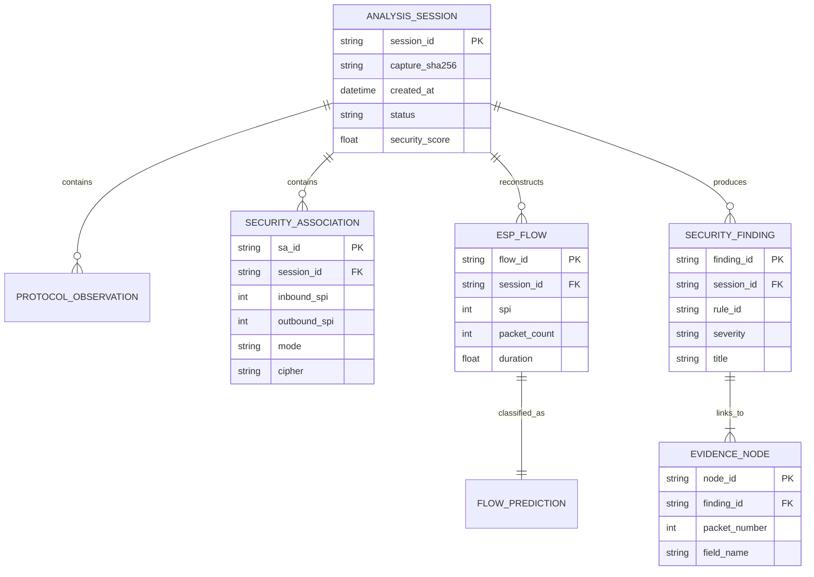

---

## 55. Object Storage

* **Storage Model:** Local filesystem directory structure abstracted behind an S3-compatible interface (ready for Supabase Storage migration).
* **Storage Pathing:**
  * Raw Captures: `/storage/captures/{sha256}.pcap`
  * Generated Reports: `/storage/reports/{analysis_id}_technical.pdf`
  * Model Checkpoints: `/storage/models/{model_version}/`
* Large packet binaries are strictly prohibited from being stored directly in PostgreSQL relational rows.

---

## 56. Internal Data Contracts

### 56.1 Core Data Contracts Overview
* `CaptureRecord`: Ingestion record (SHA-256, path, file size, frame count, timestamps).
* `NormalizedObservation`: Output of protocol parser (protocol, version, headers, packet number).
* `SAGraph`: Complete topology of IKE SAs, Child SAs, SPI pairs, and active transforms.
* `ESPFlow`: Reconstructed bidirectional packet flow record with timing and length vectors.
* `ModelInferenceResult`: Output of ML engine (predicted class, calibrated probabilities, entropy, OOD flag).
* `SecurityFinding`: Output of policy engine (rule ID, severity, title, evidence reference, remediation snippet).
* `EvidenceNode`: Atomic link connecting finding to specific packet number and byte offset.

---

## 57. API Boundaries

The backend implements clean RESTful and WebSocket API domains:
* `/api/v1/captures`: File upload, validation, and SHA-256 query.
* `/api/v1/analyses`: Trigger analysis, query status, retrieve results.
* `/api/v1/protocol`: Retrieve reconstructed IKE sessions and transform trees.
* `/api/v1/security-associations`: Retrieve interactive SA topology graph.
* `/api/v1/flows`: Query reconstructed ESP flows, ML classifications, and SHAP values.
* `/api/v1/findings`: Retrieve security findings, compliance scorecards, and threat matrices.
* `/api/v1/evidence`: Query evidence graph nodes and packet hex views.
* `/api/v1/twin`: Simulate configuration changes and retrieve projected scores.
* `/api/v1/remediation`: Retrieve remediation scripts; trigger closed-loop lab validation.
* `/api/v1/reports`: Export Executive and Technical PDF/HTML reports.
* `/api/v1/ai`: Conversational query endpoint for local RAG AI Analyst.
* `/api/v1/testbed`: Provision testbed matrices, trigger workload injection, and capture traces.
* `/ws/analyses/{analysis_id}`: Realtime WebSocket progress and live capture feed.

---

## 58. WebSocket/Event Architecture

* **Protocol:** Standard WebSockets (`/ws/analyses/{id}`).
* **Standard Event Schema:**
  ```json
  {
    "event_type": "STAGE_PROGRESS",
    "analysis_id": "9a3f2b1c-0042",
    "stage": "ML_INFERENCE",
    "progress_percent": 65,
    "timestamp": "2026-09-22T20:45:00.000Z",
    "payload": {
      "flows_processed": 130,
      "total_flows": 200
    }
  }
  ```
* **Event Types:** `ANALYSIS_STARTED`, `CAPTURE_PROGRESS`, `PROTOCOL_COMPLETE`, `ML_COMPLETE`, `SECURITY_COMPLETE`, `ANALYSIS_COMPLETE`, `ANALYSIS_FAILED`, `REMEDIATION_STEP`.

---

## 59. Frontend Technical Requirements

* **Framework:** Next.js 14 with React Server Components (RSC) and Client Components for dynamic workspaces.
* **Component Architecture:** Reusable custom UI components styled with Tailwind CSS (*strictly zero shadcn/ui requirement*).
* **State Management:** React Context + TanStack Query (React Query) for server state caching and polling fallbacks.
* **Realtime Integration:** Native WebSocket hooks managing live event streams with automatic reconnection logic.
* **Visualizations:**
  * **Apache ECharts:** Multi-axis radar charts for Security Posture Scores, packet length distribution histograms, and confusion matrices.
  * **React Flow:** Interactive, node-based visualizers for Security Association graphs and Evidence Provenance trees.

---

## 60. Responsive/PWA Technical Requirements

* **Adaptive Layout Breakpoints:**
  * **Desktop ($\ge 1280\text{px}$):** Multi-pane SOC command center (simultaneous live capture, SA topology, and threat matrix).
  * **Tablet ($768\text{px} - 1279\text{px}$):** Two-column collapsible analysis drawer layout.
  * **Mobile ($< 768\text{px}$):** Focused monitoring workflow prioritizing score cards, high-priority alerts, report downloads, and AI chat.
* **PWA Service Worker:** Caches static application shell and pre-rendered analysis summaries for offline viewing.
* **Sandbox Integrity:** The mobile PWA strictly acts as a monitoring interface; it never attempts privileged packet capture.

---

## 61. Error Handling

Structured error codes are emitted with explicit diagnostic context and user guidance:

| Error Code | Stage | Recoverable? | User-Facing Message | Internal Diagnostic Detail |
| :--- | :--- | :--- | :--- | :--- |
| `ERR_CAPTURE_CORRUPT` | Ingestion | No | "The uploaded file is not a valid PCAP/PCAPNG capture." | Magic bytes failed validation check. |
| `ERR_NO_IPSEC_TRAFFIC` | Dissection | Yes | "No IKE or ESP packets were found in the provided capture." | BPF filter returned 0 matching frames. |
| `ERR_PARTIAL_HANDSHAKE` | Protocol | Yes | "IKE negotiation is incomplete; cipher parameters partially unobservable." | Initiator SA parsed; Responder frame missing. |
| `ERR_ML_INFERENCE` | ML Engine | Yes | "Encrypted traffic classification degraded; falling back to rule analysis." | Model tensor dimensionality mismatch. |
| `ERR_POLICY_MISSING` | Policy | Yes | "Requested policy profile not found; falling back to IETF Base profile." | YAML profile file not located on disk. |
| `ERR_REMEDIATION_FAIL` | Testbed | Yes | "Hardened configuration failed to establish tunnel; rolled back to previous state." | strongSwan `vici` returned negotiation error. |

---

## 62. Graceful Degradation

The system architecture guarantees partial operational utility during component dropouts:
* **ML Failure:** If the ML worker fails, protocol dissection, SA reconstruction, and policy assessment execute normally, outputting full cryptographic findings with ML traffic labels marked `UNAVAILABLE`.
* **Missing IKE:** If capture lacks IKE handshakes, ESP flows are analyzed for traffic classification and sequence health; cipher suite findings are marked `UNKNOWN`.
* **AI Analyst / LLM Offline:** Deterministic dashboard, threat matrix, and PDF reports generate normally with static explanation text; conversational Q&A displays `LLM_OFFLINE`.

---

## 63. Security of the Application

* **Input Validation:** Strict Pydantic v2 schemas on all incoming API request payloads.
* **Secure File Handling:** Uploaded files validated for magic bytes, stored under UUIDv4 names, and scanned for size limits.
* **Subprocess Security:** Zero shell execution (`shell=False`); strict argument array passing.
* **CORS & Headers:** Enforces strict HTTP headers: `X-Content-Type-Options: nosniff`, `X-Frame-Options: DENY`, `Content-Security-Policy`.

---

## 64. Privilege Separation

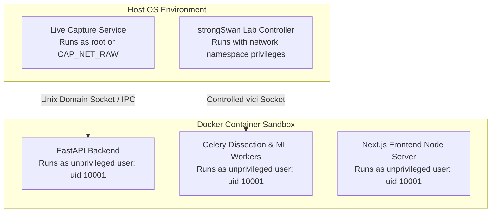

---

## 65. Privacy

* **Local Data Perimeter:** No raw network packets or internal IP address topologies are transmitted outside the host environment.
* **Prompt Sanitization:** The RAG subsystem injects only sanitized finding descriptors and public standards clauses into LLM prompts; raw packet payloads are strictly scrubbed.

---

## 66. Auditability

* **Append-Only Event Ledger:** Every user action (upload, configuration twin simulation, remediation execution, report generation) is logged to an immutable PostgreSQL audit table.
* **Log Fields:** `timestamp`, `user_id`, `client_ip`, `action_type`, `target_resource_id`, `action_status`.

---

## 67. Versioning

Every analysis record stores immutable versioning metadata:
* `engine_version`: Semver of core codebase.
* `parser_version`: TShark dissector release string.
* `model_version`: Hashed version of XGBoost/CNN weights.
* `policy_profile_version`: Git commit / semver of active YAML policy catalog.

---

## 68. Reproducibility

Given identical capture file inputs and identical engine, model, and policy versions, **TunnelTrace AI** produces mathematically bitwise identical findings, security scores, and threat matrices.

---

## 69. Logging / Monitoring / Observability

* **Structured JSON Logging:** Emits machine-readable logs via Python `structlog` containing `timestamp`, `level`, `analysis_id`, `event`, and `execution_duration_ms`.
* **Telemetry Metrics:** Tracks queue latency, dissection frames/sec, ML inference time/flow, and active WebSocket connections.

---

## 70. Performance Engineering

* **Benchmarking Areas:**
  * PCAP ingestion throughput (MB/sec).
  * TShark dissection latency across 10MB, 50MB, 100MB, 500MB captures.
  * Flow feature extraction time per 1,000 packets.
  * ML model forward pass latency.
  * PDF generation compilation time.
* *Specific numeric target SLAs: TBD after baseline performance testing.*

---

## 71. Scalability

* **Modular Scaling:** System scales from single-developer Docker Compose up to decoupled worker topologies. Celery workers scale horizontally across available CPU cores.
* **Database Optimization:** PostgreSQL tables partitioned by `created_at` timestamp; indexes applied to `capture_sha256`, `session_id`, and `spi`.

---

## 72. Configuration Management

* **Environment Configuration:** Managed via `.env` files and Docker environment blocks using `Pydantic-Settings`.
* **Separation of Secrets:** Database passwords, encryption keys, and internal socket paths externalized; zero hardcoded credentials.

---

## 73. Docker / Local Runtime

Standard deployment via `docker-compose.yml`:
* `frontend`: Next.js web application (Port 3000).
* `backend`: FastAPI API server (Port 8000).
* `worker`: Celery asynchronous task processor.
* `redis`: Task message broker & caching layer (Port 6379).
* `postgres`: Relational & vector database (Port 5432).
* `testbed`: Privileged Linux namespace container (Host networking / `CAP_NET_ADMIN`).

---

## 74. Development Environments

* **Local Development:** Full stack orchestrated via Docker Compose with local volume mounts for live code reloading.
* **Automated CI Test Environment:** GitHub Actions workflow executing unit tests, linter checks, and synthetic PCAP validation.
* **Demonstration Setup:** Pre-seeded Docker image containing pre-trained model weights, policy catalogs, and verified testbed scenarios.

---

## 75. Testing & Technical Validation

Comprehensive test hierarchy:
* **Unit Tests:** Component-level testing of feature extractors, policy assertion operators, and packet header parsers.
* **Integration Tests:** Pipeline testing from raw PCAP upload to database finding persistence.
* **System Tests:** End-to-end execution of the Golden Demonstration workflow.

---

## 76. Protocol Validation

* **Validation Suite:** Controlled captures generated in strongSwan testbed verified against ground-truth configuration parameters:
  * IKEv1 Main Mode & Aggressive Mode extraction.
  * IKEv2 `SA_INIT` and `IKE_AUTH` exchange correlation.
  * Tunnel vs Transport mode identification.
  * Transform extraction across AES-CBC, AES-GCM, 3DES, HMAC-SHA1, HMAC-SHA256, DH 2, 5, 14, 19.

---

## 77. ML Validation

* **Validation Suite:** Evaluates Model A, Model B, and the fused ensemble across independent test splits:
  * In-distribution testbed accuracy.
  * Cross-session generalization.
  * Cross-cipher generalization.
  * OOD entropy separability on unrepresented traffic.
  * Expected Calibration Error (ECE) measurement.

---

## 78. Policy/Scoring Validation

* **Validation Suite:** Synthetic configuration profiles with known flaws evaluated against policy profiles:
  * Assert 3DES triggers `IPSEC-CRYPTO-001` (Critical).
  * Assert DH Group 2 triggers `IPSEC-KE-002` (High).
  * Assert clean AES-256-GCM / DH19 configuration yields zero Critical/High findings.
  * Assert 100% of score deductions cite concrete finding records.

---

## 79. Remediation Validation

* **Validation Suite:** Automated test script executing in controlled testbed:
  1. Boots strongSwan with 3DES-CBC / DH2 tunnel.
  2. Runs analyzer; captures findings.
  3. Triggers remediation synthesis.
  4. Deploys AES-256-GCM / DH19 configuration.
  5. Re-establishes tunnel; recaptures traffic.
  6. Re-analyzes; asserts prior Critical findings are marked `VERIFIED_RESOLVED`.

---

## 80. SIH Prototype Implementation Order

```mermaid
gantt
    title SIH Prototype Implementation Priority
    dateFormat  X
    axisFormat  P%d
    
    section Core Infrastructure
    P1: strongSwan Testbed Setup        :active, p1, 0, 1
    P2: Real ESP/IKE Packet Capture     :p2, after p1, 1
    P3: Protocol Extraction Engine      :p3, after p2, 1
    P4: SA Reconstruction Logic         :p4, after p3, 1
    P5: Flow Reconstruction & Features  :p5, after p4, 1
    
    section Machine Learning
    P6: IPsec Dataset Generation Campaign :p6, after p5, 1
    P7: XGBoost Model A Baseline        :p7, after p6, 1
    P8: 1D-CNN Model B Implementation   :p8, after p7, 1
    P9: Calibration, OOD, & SHAP        :p9, after p8, 1
    
    section Security & Integration
    P10: Policy-as-Code Engine          :p10, after p9, 1
    P11: Evidence Traceability Graph    :p11, after p10, 1
    P12: Next.js Dashboard Integration  :p12, after p11, 1
    P13: Reporting Engine               :p13, after p12, 1
    P14: Configuration Security Twin    :p14, after p13, 1
    P15: Closed-Loop Lab Remediation    :p15, after p14, 1
    P16: AI Analyst / RAG Interface     :p16, after p15, 1
```

---

## 81. Golden Demo Technical Flow

The implementation must support this seamless live verification sequence:
1. **Lab Provisioning:** Testbed script provisions weak tunnel (IKEv1, 3DES-CBC, HMAC-SHA1, DH Group 2, No PFS, Tunnel Mode).
2. **Workload Generation:** Injects concurrent VoIP and bulk File Transfer streams.
3. **Capture:** Ingests live stream or resulting PCAP; displays SHA-256 and packet count.
4. **Protocol Extraction:** Deterministically extracts IKEv1, Tunnel Mode, 3DES-CBC, SHA-1, DH Group 2 (`VERIFIED`).
5. **Encrypted Traffic Inference:** Classifies inner flows into VoIP and File Transfer without decryption; renders calibrated confidence and SHAP attribution.
6. **Security Assessment:** Evaluates against NIST SP 800-77 Rev. 1; flags 3DES, DH2, and missing PFS; generates low baseline Security Score.
7. **Threat Matrix & Metadata Exposure:** Outputs itemized threats (Sweet32, Logjam) and Metadata Fingerprintability Index.
8. **Evidence Traceability:** Clicks 3DES finding; displays exact IKE packet number and transform payload byte offset.
9. **Configuration Twin:** Proposes hardened configuration (AES-256-GCM, DH19, PFS Enabled); displays projected score improvement.
10. **Closed-Loop Lab Remediation:** Deploys hardened config to strongSwan lab, restarts tunnel, injects traffic, recaptures trace, re-analyzes, and displays `VERIFIED_RESOLVED` comparison card.
11. **Reporting & AI Q&A:** Exports Executive and Technical PDF reports; answers analyst question via local RAG AI Analyst.

---

## 82. PS Requirement → Technical Implementation Matrix

| Official NTRO PS Requirement | Technical Subsystem | Implementation Architecture | Input Data | Output Data | Evidence Source | Technical Validation Method | Failure / Unknown Behavior | Status |
| :--- | :--- | :--- | :--- | :--- | :--- | :--- | :--- | :--- |
| **Tunnel Mode** | `backend.protocol` | TShark / TS payload inspection | Dissected IKE / IP headers | `mode: TUNNEL` | Wire packet headers | Testbed capture validation | Assign `UNKNOWN` if ambiguous | Implemented |
| **Transport Mode** | `backend.protocol` | Notify 16391 / IP header check | Dissected IKE / IP headers | `mode: TRANSPORT` | Wire packet headers | Testbed capture validation | Assign `UNKNOWN` if ambiguous | Implemented |
| **AES-128 / 256** | `backend.protocol` | SA transform attribute parsing | IKE SA payload bytes | `cipher: AES-128/256` | Transform Type 1 | Testbed capture matrix | Flag `TRANSFORM_UNKNOWN` | Implemented |
| **AES-GCM** | `backend.protocol` | Transform ID 20 / AEAD parser | IKE SA payload bytes | `cipher: AES-GCM` | Transform Type 1 | Testbed capture matrix | Flag `TRANSFORM_UNKNOWN` | Implemented |
| **AES-CBC + HMAC** | `backend.protocol` | Transform Type 1 + Type 3 | IKE SA payload bytes | `cipher: AES-CBC, auth: HMAC`| Transform Type 1 & 3 | Testbed capture matrix | Flag `TRANSFORM_UNKNOWN` | Implemented |
| **Diffie-Hellman Groups** | `backend.protocol` | Transform Type 4 / KE payload | IKE SA & KE payload | `dh_group: <id>` | Transform Type 4 | Testbed capture matrix | Flag `TRANSFORM_UNKNOWN` | Implemented |
| **PFS on/off** | `backend.protocol` | Child SA KE payload detection | `CREATE_CHILD_SA` frames | `pfs: ENABLED / DISABLED` | KE payload presence | Rekey testbed capture | Mark `UNKNOWN` if no rekey | Implemented |
| **IPv4 & IPv6** | `backend.capture` | Network layer header parsing | Raw packet frame | `ip_version: IPv4 / IPv6` | IP header version field | Dual-stack testbed test | Reject malformed frame | Implemented |
| **Workloads (VoIP, Chat, etc.)** | `backend.testbed` | Synthetic Linux traffic inject | Network namespace sockets | Raw traffic streams | Ground truth generator | Dual-sided packet capture | Abort run on generator error | Implemented |
| **Offline PCAP/PCAPNG** | `backend.capture` | File validator & SHA-256 | Uploaded binary file | Verified PCAP record | File magic bytes | File ingestion unit test | Raise `ERR_CAPTURE_CORRUPT` | Implemented |
| **Live Network Streams** | `backend.capture` | `libpcap` socket streamer | Host network interface | Streaming packet queue | Raw socket buffers | Interface streaming test | Raise `ERR_CAPTURE_PERM` | Implemented |
| **IKE Negotiation** | `backend.protocol` | TShark ISAKMP dissector | UDP 500/4500 packets | Reconstructed IKE session | ISAKMP headers | Complete handshake test | Mark `PARTIAL_HANDSHAKE` | Implemented |
| **ESP Packets** | `backend.protocol` | ESP header dissector | IP proto 50 / UDP 4500 | Dissected ESP frame | ESP headers (SPI, Seq) | Testbed ESP stream test | Mark `MALFORMED_ESP` | Implemented |
| **AH Packets (Optional)** | `backend.protocol` | AH header dissector | IP proto 51 | Dissected AH frame | AH headers | Testbed AH stream test | Ignore if absent | Implemented |
| **Normal Communication** | `backend.capture` | BPF protocol splitter | Raw packet stream | Isolated background frames | Ethernet / IP headers | Mixed traffic capture test | Segregate to noise log | Implemented |
| **Protocol Identification** | `backend.protocol` | Deterministic header analyzer | Dissected frames | Protocol specs object | Packet headers | 100% ground-truth match | Mark `UNKNOWN` | Implemented |
| **IKE Version** | `backend.protocol` | ISAKMP version flag check | IKE header bytes | `version: IKEv1 / IKEv2` | Header version field | Version matrix test | Mark `UNKNOWN` | Implemented |
| **Encryption Algorithm** | `backend.protocol` | Transform Type 1 mapper | SA proposal bytes | Active cipher name | Transform Type 1 | Transform test suite | Mark `UNKNOWN` | Implemented |
| **Authentication Algorithm**| `backend.protocol` | Transform Type 3 mapper | SA proposal bytes | Active integrity name | Transform Type 3 | Transform test suite | Mark `UNKNOWN` | Implemented |
| **Key Exchange Method** | `backend.protocol` | Transform Type 4 mapper | SA proposal bytes | Active DH group name | Transform Type 4 | Transform test suite | Mark `UNKNOWN` | Implemented |
| **SA Characteristics** | `backend.sa` | Stateful SA graph builder | IKE & Child SA frames | Stateful `SAGraph` | Correlated SPIs | State tracker unit test | Create `ORPHAN_SA` | Implemented |
| **Traffic Prediction in ESP**| `backend.ml` | XGBoost + 1D-CNN on metadata | Bidirectional flow stats | Predicted traffic class | Flow metadata features | Multi-metric test evaluation | Flag `Unknown / OOD` | Implemented |
| **Cryptographic Strength** | `backend.policy` | YAML Policy-as-Code rules | Extracted transforms | Itemized findings | NIST / RFC policy rules | Rule engine unit test | Mark `UNEVALUATED` | Implemented |
| **Configuration Compliance**| `backend.policy` | Compliance profile matcher | Policy findings | Compliance scorecard | Standard control mappings| Compliance scorecard test | Mark `INCONCLUSIVE` | Implemented |
| **SA Parameters & Lifetime** | `backend.sa` | Sequence & notification audit | SA lifetime attributes | Lifetime audit object | SA attribute bytes | Rollover testbed test | Mark `INSUFFICIENT_DATA` | Implemented |
| **Replay Protection** | `backend.protocol` | ESP sequence number tracker | ESP sequence headers | Replay health finding | 32-bit sequence window | Out-of-order sequence test | Mark `INSUFFICIENT_DATA` | Implemented |
| **Metadata Exposure** | `backend.metadata` | Side-channel profiler | Flow statistical arrays | Metadata Exposure Index | Flow feature distributions| Padded vs unpadded test | Mark `INCONCLUSIVE` | Implemented |
| **Security Score** | `backend.risk` | Deterministic weighted scoring| Findings list | 0–100 Posture Score | Itemized deductions | Scoring audit regression | Apply incomplete penalty | Implemented |
| **Executive Report** | `backend.reporting` | Jinja2 + WeasyPrint engine | Analysis session record | Executive PDF / HTML | Structured analysis JSON | PDF compilation test | Fallback to HTML | Implemented |
| **Technical Report** | `backend.reporting` | Jinja2 + WeasyPrint engine | Full forensic graph | Technical PDF / HTML | Complete database record | PDF compilation test | Fallback to HTML | Implemented |
| **Risk Score** | `backend.risk` | Severity & likelihood formula | Findings list | Categorical Risk Score | Finding severity matrix | Risk calculation test | Default to Informational | Implemented |
| **Threat Matrix** | `backend.risk` | Threat scenario mapper | Findings list | Threat Matrix table | Threat catalog mappings | Threat mapping test | Zero arbitrary threats | Implemented |
| **AI Confidence Score** | `backend.ood` | Temperature-scaled calibrator | Model logits & entropy | Calibrated Confidence % | Calibrated probability | ECE calibration test | Flag `UNRELIABLE_RAW` | Implemented |

---

## 83. Technical Decision Log

| Decision ID | Architectural Decision | Alternatives Considered | Why Selected | Status | Revisit Condition |
| :--- | :--- | :--- | :--- | :--- | :--- |
| **DEC-01** | Deterministic protocol parsing instead of ML for observable IPsec facts. | End-to-end deep learning from raw packet bytes. | Observable protocol fields have 100% deterministic wire syntax; ML introduces hallucination risk. | Frozen Baseline | Never. Core architectural principle. |
| **DEC-02** | TShark / PyShark as primary protocol forensics dissection engine. | Writing custom binary parsers from scratch in Python/C. | Wireshark dissectors represent 25+ years of mature, RFC-compliant protocol dissection. | Frozen Baseline | If performance benchmarks fail severely. |
| **DEC-03** | Dual ML Model: XGBoost (tabular) + 1D-CNN (temporal sequence). | Monolithic Transformer (e.g., BERT-style packet model) or Random Forest alone. | XGBoost excels at tabular flow stats + SHAP; 1D-CNN captures early packet arrival dynamics efficiently. | Frozen Baseline | If ensemble shows zero gain over single model. |
| **DEC-04** | Primary training on native testbed dataset; ISCXVPN2016 as secondary benchmark only. | Training IPsec classifier on ISCXVPN2016. | ISCXVPN2016 uses OpenVPN, not IPsec ESP. Domain shift makes it invalid for native IPsec training. | Frozen Baseline | Never. Technical truth constraint. |
| **DEC-05** | SHAP for machine learning explainability. | LIME, Integrated Gradients, saliency maps. | SHAP provides mathematically grounded, game-theoretic additive feature attributions for trees. | Frozen Baseline | If computation latency exceeds limits. |
| **DEC-06** | Policy-as-Code in Python + YAML for security assessment. | Generative LLM evaluating security, or hardcoded Python `if/else` checks. | YAML policies are auditable, version-controlled, and easily updated without altering application code. | Frozen Baseline | Never. Security audit requirement. |
| **DEC-07** | PostgreSQL 15 + `pgvector` for relational and vector storage. | Standalone vector DB (Qdrant, Milvus, FAISS) + separate relational DB. | Eliminates operational overhead of running two databases; `pgvector` easily handles local RAG scale. | Frozen Baseline | If vector dataset exceeds millions of chunks. |
| **DEC-08** | Single responsive Next.js application with PWA support. | Separate React Native mobile app + Electron desktop app. | Single codebase significantly reduces development and maintenance overhead while delivering desktop SOC and mobile utility. | Frozen Baseline | If native OS APIs become mandatory. |
| **DEC-09** | Modular backend before microservices. | Multi-repo Kubernetes microservice architecture. | Avoids premature distributed systems overhead; modular monolith allows rapid local development. | Frozen Baseline | If team size or independent scaling demands it. |

---

## 84. Risks and Mitigations

| Risk ID | Technical Risk Description | Severity | Likelihood | Technical Mitigation Strategy | Engineering Owner |
| :--- | :--- | :--- | :--- | :--- | :--- |
| **RSK-TECH-01** | **Dataset Session Leakage:** Packet features memorized across train/test splits. | Critical | High | Enforce strict `GroupKFold` by `session_id`; strip all IP addresses, ports, and SPIs from features. | ML Architect |
| **RSK-TECH-02** | **TShark Parser Exploitation:** Malformed PCAP triggers buffer overflow in TShark. | Critical | Low | Run TShark in sandboxed container with dropped capabilities as unprivileged user (`uid: 10001`). | Security Systems Lead |
| **RSK-TECH-03** | **Encrypted Traffic Padding Degradation:** Constant-rate padding (IP-TFS) obscures packet sizes. | High | Medium | Detect padding uniformity; trigger graceful degradation to `Unknown / OOD` when variance collapses. | ML Architect |
| **RSK-TECH-04** | **Subprocess Blocking:** Large PCAP analysis locks FastAPI event loop. | High | Medium | Offload all dissection and ML tasks to asynchronous Celery worker queues via Redis. | Backend Architect |
| **RSK-TECH-05** | **RAG Prompt Injection:** Malicious metadata strings in PCAP hijack LLM context. | High | Low | Sanitize all extracted metadata before vector indexing; enforce strict system prompt guardrails. | AI Systems Lead |

---

## 85. Open Technical Decisions / TBD Register

The following technical parameters are explicitly maintained as `TBD` pending empirical benchmarking and experimentation:

| Register ID | Technical Parameter Area | Current Status | Resolution Milestone | Target Method of Resolution |
| :--- | :--- | :--- | :--- | :--- |
| **TBD-TRD-01** | Final Flow Inactivity Timeout | TBD | Flow Engine Benchmarking | Empirical testing across 15s, 30s, 60s windows. |
| **TBD-TRD-02** | Final Tabular Feature Vector Subset | TBD | Feature Ablation Milestone | Permutation feature importance & SHAP ablation. |
| **TBD-TRD-03** | 1D-CNN Layer Count and Filter Dimensions | TBD | Model Architecture Search | Cross-validation grid search on testbed dataset. |
| **TBD-TRD-04** | 1D-CNN Packet Sequence Length ($N$) | TBD ($N \in \{32, 64, 128\}$) | Model Tuning Milestone | Accuracy vs inference latency trade-off study. |
| **TBD-TRD-05** | Exact Model Ensemble Fusion Algorithm | TBD | Fusion Evaluation Milestone | Comparing weighted average vs logistic meta-learner. |
| **TBD-TRD-06** | ML Hyperparameter Optimization Sets | TBD | Model Training Milestone | Optuna Bayesian hyperparameter optimization. |
| **TBD-TRD-07** | OOD Confidence ($\theta_{\text{conf}}$) & Entropy Thresholds | TBD | OOD Tuning Milestone | AUROC maximization on unseen traffic holdouts. |
| **TBD-TRD-08** | Isolation Forest Anomaly Score Threshold | TBD | Anomaly Profiling Milestone | Calibration against baseline normal tunnel traffic. |
| **TBD-TRD-09** | Testbed Matrix Full Cartesian Bounds | TBD | Dataset Generation Milestone | Resource capacity planning on lab hardware. |
| **TBD-TRD-10** | Train / Validation / Test Group Split Ratios | TBD | Dataset Curation Milestone | Standard 70/15/15 grouped cross-validation study. |
| **TBD-TRD-11** | Security Score Deduction Weights & Multipliers | TBD | Policy Engine Milestone | Delphi method review with security specialists. |
| **TBD-TRD-12** | Threat Likelihood / Impact Mapping Equations | TBD | Risk Engine Milestone | Formal mapping to CVSS v3.1 qualitative criteria. |
| **TBD-TRD-13** | Metadata Fingerprintability Exact Formula | TBD | Side-Channel Research | Mathematical modeling of entropy and confidence. |
| **TBD-TRD-14** | Complete Inventory of YAML Policy Rules | TBD | Policy Catalog Milestone | Exhaustive clause-by-clause mapping of NIST SP 800-77. |
| **TBD-TRD-15** | Maximum Single Upload File Size Limit | TBD | Ingestion Stress Test | Memory stress testing with chunked spooling. |
| **TBD-TRD-16** | Target Concurrent Analysis Worker Capacity | TBD | Scalability Benchmark | Load testing on 8-core / 16GB RAM reference host. |
| **TBD-TRD-17** | Target End-to-End Processing Latency SLAs | TBD | Performance Milestone | Empirical benchmarking across PCAP size brackets. |
| **TBD-TRD-18** | Local LLM Model Checkpoint & Quantization | TBD | RAG Subsystem Milestone | Evaluating Llama-3-8B / Mistral-7B via Ollama. |
| **TBD-TRD-19** | Multi-Tenant Role-Based Access Control Schema | TBD | Enterprise Hardening | Enterprise SOC permission model review. |
| **TBD-TRD-20** | Secondary Vendor Lab Orchestration Adapters | TBD (strongSwan baseline) | Product Hardening Milestone | Evaluating virtualized Cisco / Fortinet appliances. |

---

## 86. Glossary

* **AEAD:** Authenticated Encryption with Associated Data (e.g., AES-GCM).
* **AH:** Authentication Header (IP Protocol 51), RFC 4302.
* **BPF:** Berkeley Packet Filter, kernel-level packet filter bytecode.
* **Child SA:** IPsec Security Association negotiating ESP/AH keys for application data.
* **Diffie-Hellman (DH):** Asymmetric key agreement algorithm (RFC 7296).
* **ECE:** Expected Calibration Error, scalar difference between probability and accuracy.
* **ESP:** Encapsulating Security Payload (IP Protocol 50), RFC 4303.
* **IKE:** Internet Key Exchange protocol (UDP 500/4500), RFC 7296.
* **IKE SA:** Secure control channel established to negotiate Child SAs.
* **IP-TFS:** IP Traffic Flow Confidentiality (RFC 9347).
* **NAT-T:** NAT Traversal (RFC 3948), UDP port 4500 encapsulation.
* **OOD:** Out-of-Distribution, traffic patterns absent from training taxonomy.
* **PFS:** Perfect Forward Secrecy, generating unique Diffie-Hellman keys per Child SA.
* **Policy-as-Code:** Enforcing declarative security rules codified in YAML.
* **RAG:** Retrieval-Augmented Generation, injecting verified context into LLMs.
* **SA:** Security Association, shared cryptographic state between endpoints.
* **SHAP:** SHapley Additive exPlanations, game-theoretic feature importance.
* **SPI:** Security Parameters Index, 32-bit tag demultiplexing incoming ESP flows.
* **Transport Mode:** Encrypts payload while retaining outer IP headers.
* **Tunnel Mode:** Encapsulates complete inner IP packet inside new outer IP header.

---

## 87. References

1. **NIST SP 800-77 Rev. 1:** *Guide to IPsec VPNs*, National Institute of Standards and Technology.
2. **NIST SP 800-57 Part 1 Rev. 5:** *Recommendation for Key Management*, NIST.
3. **RFC 4301:** *Security Architecture for the Internet Protocol*, IETF.
4. **RFC 4302:** *IP Authentication Header (AH)*, IETF.
5. **RFC 4303:** *IP Encapsulating Security Payload (ESP)*, IETF.
6. **RFC 7296:** *Internet Key Exchange Protocol Version 2 (IKEv2)*, IETF.
7. **RFC 8221:** *Cryptographic Algorithm Implementation Requirements for ESP and AH*, IETF.
8. **RFC 8247:** *Algorithm Implementation Requirements for IKEv2*, IETF.
9. **RFC 9395:** *Deprecation of IKEv1 and Historic Status*, IETF.
10. **RFC 9347:** *Aggregation and Fragmentation Mode for IPsec Traffic Flow Confidentiality (IP-TFS)*, IETF.
11. **IANA Registry:** *Internet Key Exchange Version 2 (IKEv2) Parameters*, IANA.
12. **strongSwan Project:** *strongSwan Architecture and VICI Protocol Documentation*.
13. **NTRO Problem Statement 26160:** *AI-Powered IPsec VPN Protocol Analyzer and Security Assessment Framework*, Smart India Hackathon 2026.
