# UI/UX Architecture & Design System Specification

**Document Reference:** UIUX-SIH2026-PS160-001  
**Project Identifier:** Smart India Hackathon 2026 / Problem Statement ID: 26160 (PS 160)  
**Product Working Descriptor:** IPsec Security Intelligence Platform  
**Official Project Name:** TunnelTrace AI  
**Authoring Authority:** Enterprise Cybersecurity UX & Frontend Architecture Group  
**Target Organization / Sponsoring Body:** National Technical Research Organisation (NTRO)  
**Classification:** Controlled Engineering Specification (Frontend & UI/UX Baseline)  

---

## 1. Document Control

| Property | Value |
| :--- | :--- |
| **Document Identifier** | `UIUX-SIH2026-PS160-CORE-V1` |
| **Status** | Approved Engineering Baseline / Implementation Source of Truth |
| **Document Owner** | Lead Design Systems Architect & Senior Frontend Lead |
| **Review Authority** | SOC Dashboard Lead, Accessibility Specialist, Applied ML Engineer |
| **Target Implementation** | Next.js 14 / TypeScript / Tailwind CSS / Apache ECharts / React Flow |
| **Primary Platforms** | Desktop SOC Workspace, Tablet Analytical View, Mobile PWA |

---

## 2. Revision History

| Version | Date | Author / Role | Summary of Changes |
| :--- | :--- | :--- | :--- |
| `0.1.0` | 2026-09-22 | UI/UX Architect | Initial information architecture, navigation models, and design token drafts. |
| `0.2.0` | 2026-09-22 | Design Systems Lead | Formalized Bold Typography scale, sharp 0px radius geometry, and dual light/dark themes. |
| `0.3.0` | 2026-09-22 | Information Visualization Lead | Designed SA Explorer (React Flow), Evidence Graph, and ECharts radar/distribution specs. |
| `0.4.0` | 2026-09-22 | Frontend Architect | Defined component state matrices, responsive viewport matrices, and PWA boundaries. |
| `1.0.0` | 2026-09-22 | Core Directorate | Finalized master 73-section industry-grade UI/UX & Design System specification. |

---

## 3. Purpose

This document establishes the definitive design system, visual identity, component architecture, layout blueprints, and interaction specifications for **TunnelTrace AI**. 

It provides an unambiguous, implementation-ready reference for frontend engineers, UI developers, and product testers to construct the complete responsive application without guessing visual hierarchies, component behaviors, accessibility requirements, or responsive reflows.

---

## 4. Scope

### 4.1 In-Scope (Frontend Deliverables)
* Complete visual identity guidelines: Bold Typography hierarchy, sharp geometric tokens, and dual-theme palettes (Default Light, Secondary Dark).
* Information architecture and responsive navigation across all 14 core product modules.
* Detailed design and interaction patterns for data-dense tables, technical value blocks, and evidence drawers.
* Interactive visualization specifications: React Flow graphs for Security Associations and Evidence Provenance; Apache ECharts for radar posture scores and traffic distributions.
* Dedicated analytical UI patterns for ML classification, calibrated confidence, Out-of-Distribution (OOD) states, and SHAP explainability.
* Configuration Security Twin side-by-side diff workflows and closed-loop lab remediation verification interfaces.
* Multi-device responsive behavior: Desktop multi-column SOC workspaces, Tablet two-column drawers, and Mobile PWA triage views.
* Comprehensive accessibility specifications adhering to WCAG 2.2 Level AA.

### 4.2 Out-of-Scope (Explicit Non-Goals)
* Native compiled mobile apps (iOS/Android) or desktop wrappers (Electron); the frontend is strictly a responsive web application with PWA capabilities.
* In-browser execution of privileged raw socket packet capture, TShark binaries, or strongSwan daemons.
* Decorative cyberpunk, neon-hacker, or generic marketing visual tropes.

---

## 5. Product UX Context

**TunnelTrace AI** is an intelligence-grade **IPsec Security Intelligence Platform** deployed in high-consequence enterprise Security Operations Centers (SOCs), defense network perimeters, and regulatory compliance audit environments. 

It is designed to solve an acute operational bottleneck: encrypted IPsec tunnels appear as opaque black boxes, and manual protocol analysis requires hours of tedious hex dissection in Wireshark. The user interface must enable analysts to triage massive captures in seconds, inspect verified protocol facts, observe encapsulated traffic profiles without payload decryption, trace findings to raw packet evidence, and validate remediation within a controlled testbed.

The interface visually embodies the core operational loop:
$$\text{DETECT} \longrightarrow \text{RECONSTRUCT} \longrightarrow \text{INFER} \longrightarrow \text{ASSESS} \longrightarrow \text{EXPLAIN} \longrightarrow \text{REMEDIATE} \longrightarrow \text{RE-TEST} \longrightarrow \text{VERIFY}$$

---

## 6. Design Principles

1. **Analyst-First Efficiency:** Maximize analytical signal while eliminating visual clutter. High-priority posture indicators, critical findings, and traffic classifications must be accessible in seconds without navigating multi-level menus.
2. **Evidence-First Traceability:** Never display an isolated conclusion or score deduction as a decorative metric card. Every finding must provide an unbroken click-path: $\text{Finding} \to \text{Evidence} \to \text{Packet/Byte Offset} \to \text{Authoritative Standard} \to \text{Remediation}$.
3. **Explicit Uncertainty Modeling:** Deterministic protocol facts must never be visually conflated with probabilistic machine learning predictions. Observable protocol properties are tagged `VERIFIED`; statistical classifications are labeled `ML INFERENCE` with calibrated confidence percentages; unobservable fields are explicitly marked `UNKNOWN`.
4. **Information Density Without Chaos:** Desktop views support dense technical data arrays using sharp tabular grids, compact vertical spacing, and monospace typography, avoiding the bloated, empty card grids typical of consumer SaaS.
5. **Responsive Reorganization, Not Mere Shrinking:** Small-screen views must not scale down complex desktop tables into illegible horizontal scrollers. Mobile and tablet viewports restructure data into focused summary-triage cards with expandable drill-down views.
6. **Restrained Editorial Visual Authority:** The aesthetic is clean, technical, and authoritative—utilizing high-contrast typography, sharp geometry (0px border radius), subtle warm backgrounds, and a single vermillion accent line.

---

## 7. User Personas Relevant to UX

### 7.1 Primary Persona: SOC Analyst (Tier 2 / Tier 3)
* **Goal:** Rapidly audit live and uploaded IPsec streams, identify deprecated cryptographic suites, and verify encapsulated traffic profiles.
* **UX Priority:** Information density, rapid search/filtering, instantaneous evidence inspection, and visual SA correlation.
* **Key Modules:** Command Center, Protocol Intelligence, Encrypted Traffic Intelligence, Threat Matrix, Evidence Explorer.

### 7.2 Secondary Persona: Network & VPN Security Engineer
* **Goal:** Hardening gateway configurations, testing cipher migrations, and verifying that configuration updates do not cause downtime.
* **UX Priority:** Side-by-side configuration diffs, simulated policy projections, and clear before/after verification states.
* **Key Modules:** Configuration Security Twin, Remediation Verification, SA Explorer.

### 7.3 Secondary Persona: Security Auditor / Compliance Officer
* **Goal:** Assessing deployments against regulatory standards (NIST SP 800-77 Rev. 1, RFC 8221) and exporting executive documentation.
* **UX Priority:** Pass/Fail/Unknown compliance scorecards, audit deduction tables, and one-click PDF report generation.
* **Key Modules:** Compliance, Reports, Security Assessment.

### 7.4 Internal Lab Role: Testbed Operator / ML Researcher
* **Goal:** Orchestrating multi-configuration strongSwan sweeps, injecting synthetic workloads, and curating training datasets.
* **UX Priority:** Step-by-step matrix configuration forms, live stream telemetry, and ground-truth validation manifests.
* **Key Module:** Testbed.

---

## 8. Information Architecture

```mermaid
graph TD
    ROOT[TunnelTrace AI Application Shell] --> OVERVIEW[1. OVERVIEW]
    ROOT --> ANALYSIS[2. ANALYSIS]
    ROOT --> SECURITY[3. SECURITY]
    ROOT --> REMEDIATION[4. REMEDIATION]
    ROOT --> OUTPUT[5. OUTPUT]
    ROOT --> LAB[6. LAB]

    OVERVIEW --> MOD_CC[Command Center]
    OVERVIEW --> MOD_ANA[Analyze / Ingest]

    ANALYSIS --> MOD_PROTO[Protocol Intelligence]
    ANALYSIS --> MOD_SA[Security Association Explorer]
    ANALYSIS --> MOD_TRAF[Traffic Intelligence]

    SECURITY --> MOD_SEC[Security Assessment]
    SECURITY --> MOD_COMP[Compliance Scorecard]
    SECURITY --> MOD_THREAT[Threat Matrix]
    SECURITY --> MOD_EVID[Evidence Explorer]

    REMEDIATION --> MOD_TWIN[Configuration Security Twin]
    REMEDIATION --> MOD_VERIF[Remediation Verification]

    OUTPUT --> MOD_RPT[Executive & Technical Reports]
    OUTPUT --> MOD_AI[AI Analyst Console]

    LAB --> MOD_LAB[Testbed Orchestrator]
```



---

## 9. Navigation Architecture

### 9.1 Desktop Navigation (Persistent Left Sidebar)
* **Width:** Fixed `260px` collapsed to `64px` icon-only rail on toggle.
* **Grouping:** 6 logical section headers (`OVERVIEW`, `ANALYSIS`, `SECURITY`, `REMEDIATION`, `OUTPUT`, `LAB`).
* **Active Indicator:** Left border vermillion accent line (`4px solid #FF3D00`) with subtle surface highlight.
* **Analysis Context Header:** Displays currently loaded capture name, status badge, and quick-switch dropdown at top of sidebar.

### 9.2 Tablet Navigation (Off-Canvas Drawer)
* Hidden by default; toggled via standard hamburger button in top utility bar.
* Slides in from left as a `280px` drawer with backdrop scrim (`rgba(0,0,0,0.5)`).

### 9.3 Mobile Navigation (Compact Top Bar + Bottom Sheet)
* Top app bar (`56px` height) displays branding, active session badge, and menu button.
* Navigation opens as an off-canvas drawer or bottom modal sheet; primary triage actions remain one thumb-tap away.

---

## 10. Primary User Journeys

### 10.1 Journey 1: Rapid Triage & Forensic Traceability (SOC Analyst)
1. User logs in $\to$ Lands on **Command Center** $\to$ Observes overall Security Posture Score `[Score: 42/100]` and `3 Critical Findings`.
2. Clicks on Critical Finding `IPSEC-CRYPTO-001 (Deprecated 3DES)` $\to$ Contextual Right Inspector slides open.
3. Reviews finding description, violated standard (`NIST SP 800-77 Rev. 1`), and affected SPI.
4. Clicks `View Evidence` $\to$ System transitions to **Evidence Explorer** $\to$ Graph focuses on Packet `#14`, highlighting byte offset `0x004c` (Transform Type 1 = `ENCR_3DES`).
5. Clicks `Review Remediation` $\to$ Context switches to **Configuration Security Twin**.

### 10.2 Journey 2: Pre-Deployment Hardening Simulation & Validation (Network Engineer)
1. Engineer opens **Configuration Security Twin** $\to$ Current tunnel configuration displayed in left panel.
2. Pastes proposed `swanctl.conf` block into right editor (enforcing AES-256-GCM, DH Group 19, PFS Enabled).
3. Clicks `Simulate Impact` $\to$ Twin calculates projected score increase from `42` to `94` with zero regressions.
4. Clicks `Validate in Controlled Lab` $\to$ Confirmation modal appears $\to$ Authorizes apply.
5. System deploys configuration, re-establishes tunnel, injects traffic, recaptures trace, and displays **Remediation Verification** before/after comparison card (`Status: VERIFIED_RESOLVED`).

---

## 11. Visual Direction

The visual direction of **TunnelTrace AI** is rooted in **Bold Typography, Extreme Hierarchy, and Sharp Geometric Precision**. 

It eliminates consumer SaaS tropes (floating pill badges, bouncy physics, pastel gradients, oversized bubbly cards) in favor of an authoritative, print-editorial technical layout. It treats typography as the primary architectural element, using strict grid rules, sharp 0px corners, high-contrast monochrome tones, and surgical vermillion accents.

---

## 12. Bold Typography Philosophy

1. **Type as Hero:** Hierarchy is communicated through scale, weight, and tracking rather than decorative containers.
2. **Sharp Geometry:** `border-radius: 0px` across cards, tables, inputs, buttons, and inspectors.
3. **Restrained Color Palette:** Strict monochrome base; vermillion reserved for intentional focal points.
4. **Structural Rules:** Heavy horizontal rules (`1px` and `2px` solid dividers) separate sections instead of drop shadows.
5. **Technical Rigor in Monospace:** All packet numbers, timestamps, hashes, SPIs, IP addresses, and cipher codes are rendered in `JetBrains Mono`.

---

## 13. Theme Strategy

* **Default Theme:** **Light Theme** (Warm editorial off-white `#F7F7F4`). Opens in Light Theme by default on first visit.
* **Secondary Theme:** **Dark Theme** (Controlled deep charcoal `#0A0A0A`).
* **Implementation:** CSS custom properties mapped via Tailwind CSS using `data-theme="light"` and `data-theme="dark"` on the `<html>` root.
* **Theme Toggle:** Compact icon button located in top utility bar (persisted to `localStorage`).

---

## 14. Light Theme Tokens (Default)

```css
:root, [data-theme="light"] {
  /* Surface Tokens */
  --bg-app: #F7F7F4;           /* Warm off-white page background */
  --bg-surface: #FFFFFF;       /* Clean white container surface */
  --bg-surface-muted: #F0F0EC; /* Subtle muted secondary surface */
  --bg-code: #ECECE7;          /* Technical block background */
  
  /* Text & Foreground */
  --text-primary: #111111;     /* High-contrast deep black */
  --text-secondary: #444444;   /* Balanced body secondary */
  --text-muted: #777777;       /* Captions and unselected labels */
  --text-inverse: #FFFFFF;     /* Text on dark/accent surfaces */

  /* Structural Borders */
  --border-subtle: #E2E2DC;    /* Light table & container dividers */
  --border-default: #D8D8D2;   /* Standard card & input border */
  --border-strong: #111111;    /* Emphasized structural rules */

  /* Brand Accent */
  --accent-vermillion: #FF3D00;/* Primary brand accent */
  --accent-hover: #E03500;     /* Interactive hover state */
  --accent-subtle: #FFF0EB;    /* Light tinted background */
}
```

---

## 15. Dark Theme Tokens

```css
[data-theme="dark"] {
  /* Surface Tokens */
  --bg-app: #0A0A0A;           /* Controlled deep charcoal */
  --bg-surface: #121212;       /* Elevated dark panel surface */
  --bg-surface-muted: #1A1A1A; /* Muted secondary surface */
  --bg-code: #161616;          /* Monospace container surface */
  
  /* Text & Foreground */
  --text-primary: #FAFAFA;     /* High-contrast crisp white */
  --text-secondary: #CCCCCC;   /* Secondary technical text */
  --text-muted: #888888;       /* Muted technical captions */
  --text-inverse: #0A0A0A;     /* Text on light surfaces */

  /* Structural Borders */
  --border-subtle: #222222;    /* Dark divider lines */
  --border-default: #333333;   /* Default input & card borders */
  --border-strong: #FAFAFA;    /* High-contrast rules */

  /* Brand Accent */
  --accent-vermillion: #FF3D00;/* Unchanged brand accent */
  --accent-hover: #FF5722;     /* Brightened hover state */
  --accent-subtle: #2A1208;    /* Dark tinted background */
}
```

---

## 16. Semantic Security Tokens

Semantic status indicators must remain accessible across both themes, satisfying WCAG AA contrast against their respective surfaces.

| Semantic Token | Light Mode Hex | Dark Mode Hex | Text / Contrast Color | Visual Symbol | Semantic Usage |
| :--- | :--- | :--- | :--- | :--- | :--- |
| `--status-critical` | `#D32F2F` | `#EF5350` | `#FFFFFF` / `#0A0A0A` | `●` Circle Solid | Critical vulnerability (3DES, sweet32, broken crypto). |
| `--status-high` | `#E65100` | `#FF9800` | `#FFFFFF` / `#0A0A0A` | `▲` Triangle Up | High risk (DH Group < 2048-bit, MD5, SHA-1). |
| `--status-medium` | `#F57F17` | `#FDD835` | `#111111` / `#0A0A0A` | `◆` Diamond | Medium risk (PFS disabled, lifetime anomalies). |
| `--status-low` | `#1976D2` | `#42A5F5` | `#FFFFFF` / `#0A0A0A` | `▼` Triangle Down | Low risk (minor transform sub-optimality). |
| `--status-info` | `#0288D1` | `#29B6F6` | `#FFFFFF` / `#0A0A0A` | `ℹ` Info Glyph | Informational notices and metadata logs. |
| `--status-verified` | `#2E7D32` | `#66BB6A` | `#FFFFFF` / `#0A0A0A` | `✓` Checkmark | Directly parsed wire facts (IKE headers, SPIs). |
| `--status-inferred` | `#6A1B9A` | `#AB47BC` | `#FFFFFF` / `#0A0A0A` | `≈` Approx Tilde | Contextually derived facts or ML classifications. |
| `--status-unknown` | `#616161` | `#9E9E9E` | `#FFFFFF` / `#0A0A0A` | `?` Question Mark | Unobservable or truncated capture data. |

---

## 17. Typography System

### 17.1 Font Families
* **Display / Major Headings:** `"Inter Tight"`, `sans-serif` (Weights: `700`, `800`, `900`).
* **UI Body / Data Labels:** `"Inter"`, `system-ui`, `sans-serif` (Weights: `400`, `500`, `600`).
* **Technical / Protocol / Monospace:** `"JetBrains Mono"`, `"Fira Code"`, `monospace` (Weights: `400`, `500`, `700`).

### 17.2 Type Scale & Hierarchy

| Token | Size | Line Height | Letter Spacing | Font Family | Standard Application |
| :--- | :--- | :--- | :--- | :--- | :--- |
| `text-display` | `56px (3.5rem)` | `1.0` | `-0.06em` | Inter Tight | Landing hero, Major Security Score value. |
| `text-h1` | `36px (2.25rem)` | `1.1` | `-0.04em` | Inter Tight | Page title, Master module header. |
| `text-h2` | `24px (1.5rem)` | `1.2` | `-0.03em` | Inter Tight | Section header, Card category title. |
| `text-h3` | `18px (1.125rem)`| `1.3` | `-0.02em` | Inter | Component titles, Table grouping headers. |
| `text-body` | `14px (0.875rem)`| `1.5` | `-0.01em` | Inter | General interface body copy, finding descriptions. |
| `text-caption`| `12px (0.75rem)` | `1.4` | `0.02em` | Inter | Microcopy, helper notes, timestamps. |
| `text-label-caps`| `11px (0.6875rem)`| `1.2`| `0.12em` | Inter | Uppercase category markers (`SECURITY / FINDINGS`). |
| `text-mono-base`| `13px (0.8125rem)`| `1.4`| `0.00em` | JetBrains Mono | SPI values, hashes, IP addresses, packet indices. |
| `text-mono-sm` | `11px (0.6875rem)`| `1.3`| `0.00em` | JetBrains Mono | Transform tags, raw frame offsets, inline code. |

---

## 18. Spacing System

Tailwind-compatible 4px baseline scale:
* `p-1 / m-1`: `4px` — Micro element spacing (badges, inline icons).
* `p-2 / m-2`: `8px` — Compact cell padding, control gaps.
* `p-3 / m-3`: `12px` — Standard technical table cell padding.
* `p-4 / m-4`: `16px` — Standard card interior padding, input spacing.
* `p-6 / m-6`: `24px` — Workspace panel gutter, modal interiors.
* `p-8 / m-8`: `32px` — Section vertical dividers, major block separation.
* `p-12 / m-12`: `48px` — Page-level margins, hero separation.

---

## 19. Grid/Layout System

* **Application Shell:** Asymmetric 12-column responsive grid.
* **Command Center Layout:** `8 / 4` Asymmetric Grid (8 columns for Posture & Primary Analysis; 4 columns for Critical Alerts & Quick Actions).
* **Protocol & Evidence Layout:** `7 / 5` Grid (7 columns for main state table/graph; 5 columns for Contextual Right Inspector).
* **Workspace Width:** Fluid width up to `1920px` with `24px` horizontal edge padding; zero fixed restrictive center containers in operational views.

---

## 20. Borders/Radius/Depth

* **Border Radius:** Strictly `0px` (`rounded-none`). No curved card corners.
* **Standard Dividers:** `1px solid var(--border-default)`.
* **Structural Accents:** `2px solid var(--border-strong)`.
* **Focal Accent Lines:** `4px solid var(--accent-vermillion)` (used on active tabs and severity callouts).
* **Drop Shadows:** Strictly `none`. Elevation and depth are achieved entirely via surface tone contrast (`#F7F7F4` vs `#FFFFFF`) and crisp 1px borders.

---

## 21. Iconography

* **Library:** `lucide-react` (Stroke width: `1.5px`).
* **Sizing Rules:**
  * Inline text icons: `14px`.
  * Form controls / Button icons: `16px`.
  * Navigation / Toolbar icons: `18px`.
  * Empty state graphic icons: `32px` (restrained monochrome).
* **Color Inheritance:** Always inherit `currentColor`. No multi-colored cartoon icons.

---

## 22. Motion

* **Philosophy:** Decisive, functional, instantaneous. Zero playful bounce or spring physics.
* **Micro-interactions (Hover, Focus):** `150ms cubic-bezier(0.25, 0, 0, 1)`.
* **Drawers & Inspectors:** `250ms ease-out` sliding transform.
* **Progress Telemetry:** Smooth linear width transitions on live capture bars.
* **Reduced Motion:** Fully adheres to `prefers-reduced-motion: reduce`; disables all sliding and fading transitions.

---

## 23. Accessibility

* **Target Compliance:** WCAG 2.2 Level AA.
* **Contrast Ratios:** Minimum `4.5:1` for standard text; minimum `3:1` for large display text and UI boundary controls.
* **Keyboard Navigation:** 100% of interactive elements accessible via `Tab` / `Shift+Tab`.
* **Focus Ring:** `2px solid var(--accent-vermillion)` with `2px` offset (`outline: 2px solid #FF3D00; outline-offset: 2px;`).
* **Non-Color Reliance:** Every severity level, status badge, and evidence tag pairs color with explicit text labels and geometric icons (e.g., `● Critical`, `✓ Verified`, `? Unknown`).

---

## 24. Application Shell

```
┌────────────────────────────────────────────────────────────────────────┐
│ TOP UTILITY BAR (Height: 56px)                                         │
│ [Logo: TunnelTrace AI] | Active Analysis: [Session #0042] [● Live]     │ [Theme Toggle] [User]
├───────────────┬────────────────────────────────────────┬───────────────┤
│ LEFT NAV      │ MAIN WORKSPACE                         │ CONTEXTUAL    │
│ (Width: 240px)│ (Fluid Width)                          │ INSPECTOR     │
│               │                                        │ (Width: 380px)│
│ OVERVIEW      │ [Page Title & Breadcrumb]              │               │
│ - Cmd Center  │ ────────────────────────────────────── │ [Evidence     │
│ - Analyze     │                                        │  Graph Path]  │
│               │ [Primary Analytical Grid]              │               │
│ ANALYSIS      │                                        │ [Raw Packet   │
│ - Protocol    │                                        │  Hex View]    │
│ - SA Explorer │                                        │               │
│ - Traffic ML  │                                        │ [Remediation  │
│               │                                        │  Snippet]     │
│ SECURITY      │                                        │               │
│ - Assessment  │                                        │ [Close (X)]   │
└───────────────┴────────────────────────────────────────┴───────────────┘
```

---

## 25. Desktop Strategy ($\ge 1280\text{px}$)

* Fixed left navigation (`240px`).
* Persistent top bar with active analysis session context.
* Multi-column analytical workspaces utilizing asymmetric 8/4 or 7/5 column distributions.
* Contextual Right Inspector (`380px` or `440px`) slides in when an analyst clicks an SA node, finding row, or packet entry, without unmounting the primary workspace.

---

## 26. Tablet Strategy ($768\text{px} - 1279\text{px}$)

* Left navigation collapses into an off-canvas drawer toggled via hamburger icon.
* Contextual Right Inspector replaces right-side persistence; it opens as a full-height overlay modal drawer (`400px` width) with dark backdrop scrim.
* Data tables retain critical columns; secondary columns are accessible via expandable sub-rows.

---

## 27. Mobile/PWA Strategy ($< 768\text{px}$)

* Single-column vertical stream.
* Navigation accessible via compact slide-out drawer.
* Dashboard prioritizes high-level triage: Posture Score card, Critical Alert stream, and Traffic Class badges.
* Complex tables convert into priority summary cards with a "Details" tap target that opens an inspection sheet.
* React Flow network graphs provide a "View Table" toggle for touch accessibility.

---

## 28. Component Architecture

The frontend follows a strict 5-layer atomic component hierarchy:
1. **Primitives:** `Button`, `Input`, `Select`, `Divider`, `Badge`, `IconButton`.
2. **Data Components:** `DataTable`, `TechnicalValue`, `MetricCard`, `SeverityTag`, `EvidenceBadge`.
3. **Analysis Components:** `ProtocolFieldRow`, `FindingCard`, `SAInspectorDrawer`, `FlowPredictionCard`.
4. **Visualization Components:** `EChartsRadar`, `EChartsDistribution`, `ReactFlowSAGraph`, `ReactFlowEvidenceGraph`.
5. **Workflow Templates:** `CommandCenterView`, `AnalyzeUploadView`, `TwinComparisonView`, `TestbedStepperView`.

---

## 29. Buttons

### 29.1 Button Variants

```
[SOLID PRIMARY]       --> Background: #FF3D00 | Text: #FFFFFF | Sharp 0px corners
[OUTLINE SECONDARY]   --> Background: Transparent | Border: 1px solid #111111 | Text: #111111
[EDITORIAL TEXT ACTION]--> Background: None | Border: None | Vermillion Underline on Hover
[DESTRUCTIVE ACTION]  --> Background: #D32F2F | Text: #FFFFFF | Confirmation Required
```

* **Solid Primary:** Reserved for high-value workflow completions (`Start Analysis`, `Simulate Twin`, `Validate in Lab`).
* **Outline Secondary:** Standard table actions, filters, and modal dismissals (`Export Report`, `Cancel`, `Configure Matrix`).
* **Editorial Text Action:** High-level navigation and breadcrumbs (`← Return to Command Center`, `View Complete Evidence Chain →`).

---

## 30. Inputs/Form Controls

* **Height:** `44px` desktop / `48px` mobile minimum touch height.
* **Borders:** `1px solid var(--border-default)`.
* **Focus State:** `2px solid var(--accent-vermillion)` with sharp corners.
* **Typography:** `14px` standard; technical parameters formatted in `JetBrains Mono`.

---

## 31. Status/Evidence Components

```
[VERIFIED]                --> Border: 1px solid #2E7D32 | Text: #2E7D32 | Icon: ✓
[INFERRED]                --> Border: 1px solid #6A1B9A | Text: #6A1B9A | Icon: ≈
[UNKNOWN]                 --> Border: 1px solid #616161 | Text: #616161 | Icon: ?
[MISCONFIGURATION OBSERVED]--> Border: 1px solid #D32F2F | Text: #D32F2F | Icon: ⚠
```

---

## 32. Severity Components

```
[CRITICAL]  --> Text: #D32F2F | Border: 1px solid #D32F2F | Indicator: ● CRITICAL
[HIGH]      --> Text: #E65100 | Border: 1px solid #E65100 | Indicator: ▲ HIGH
[MEDIUM]    --> Text: #F57F17 | Border: 1px solid #F57F17 | Indicator: ◆ MEDIUM
[LOW]       --> Text: #1976D2 | Border: 1px solid #1976D2 | Indicator: ▼ LOW
[INFO]      --> Text: #0288D1 | Border: 1px solid #0288D1 | Indicator: ℹ INFORMATIONAL
```

---

## 33. Data Tables

* **Anatomy:** Sticky header with `1px` bottom border; no vertical lines; no zebra striping.
* **Row Height:** Compact mode: `36px`; Standard mode: `44px`.
* **Row Hover:** Background shifts to `var(--bg-surface-muted)`.
* **Cell Types:**
  * Primary text: Inter `14px`.
  * Technical identifiers: JetBrains Mono `13px` with click-to-copy icon.
  * Status cells: Compact rectangular status badge.

---

## 34. Technical Value Components

Reusable pattern for rendering extracted wire facts:

```
┌────────────────────────────────────────────────────────┐
│ IKE VERSION                                            │
│ IKEv2                                      ✓ VERIFIED │
│ Source: Packet #1 (ISAKMP Header Flags: 0x20)          │
└────────────────────────────────────────────────────────┘
```
* Label: Inter `11px` uppercase tracking `0.1em`.
* Value: JetBrains Mono `16px` semibold.
* State Badge: Top-right aligned evidence badge.

---

## 35. Charts

* **Engine:** Apache ECharts (`echarts-for-react`).
* **Palettes:**
  * Light Theme: Neutral axis lines (`#D8D8D2`), dark grid markers (`#EAEAEA`), vermillion primary series (`#FF3D00`), secondary teal/slate accents.
  * Dark Theme: Deep neutral lines (`#333333`), charcoal grids (`#1A1A1A`), vermillion series.
* **Accessibility:** Zero standalone color charts; every series includes interactive tooltips, legends, and a hidden accessible HTML `<table>` fallback.

---

## 36. Timelines

Used for IKE exchange ladders and session rekey lifecycles:
* Vertical line: `2px solid var(--border-default)`.
* Event nodes: Sharp square nodes (`8x8px`).
* Content: Microsecond timestamp in monospace, event type, and byte volume.

---

## 37. Graph Visualization (React Flow)

Used for **Security Association Explorer** and **Evidence Explorer**:
* **Node Styles:** Sharp rectangular boxes (`0px` radius) with `1px` border; title bar separated by `1px` horizontal rule.
* **Edge Styles:** Thin orthographic lines (`1.5px solid var(--border-strong)`); active/selected edges turn vermillion (`2px solid #FF3D00`).
* **Controls:** Top-right floating controls (`Zoom In`, `Zoom Out`, `Fit View`, `Reset`).

---

## 38. Loading/Progress

```
[ANALYSIS PROGRESS INDICATOR]
┌────────────────────────────────────────────────────────────────────────┐
│ PROCESSING CAPTURE: capture_20260922_0042.pcap                         │
│ [████████████████████████████░░░░░░░░░░░░░░░░░] 65%                    │
│ Active Stage: ML_ENCRYPTED_FLOW_INFERENCE (130 / 200 Flows Classified)  │
└────────────────────────────────────────────────────────────────────────┘
```
* Reflects real backend Celery progress emitted over WebSockets; zero fake timer animations.

---

## 39. Empty States

* Clean, border-separated empty state containers.
* Icon: Restrained monochrome Lucide icon (`32px`).
* Text: Bold title (e.g., *"No IPsec Traffic Detected"*) with informative technical guidance (e.g., *"The capture file contains 1,240 frames, but 0 matched UDP 500/4500 or IP Protocols 50/51. Please verify your capture interface."*).
* Action: Primary button offering next logical action (`Upload Another File`, `Adjust Capture Filter`).

---

## 40. Error States

* Non-obtrusive inline alerts for recoverable errors.
* Error format:
  * Error Code: JetBrains Mono (e.g., `ERR_CORRUPT_CAPTURE`).
  * Plain-Language Explanation.
  * Preserved State Details: What data remains safe.
  * Actionable Remedy: Clear button to retry or proceed in partial mode.

---

## 41. Partial/Unknown States

* When a capture has ESP packets but misses IKE handshakes, the UI clearly displays:
  * **Protocol Analysis:** `PARTIAL (Mid-Session Capture)`
  * **Traffic Intelligence:** `ACTIVE (Classifying Inner ESP Streams)`
  * **Cryptographic Findings:** `INCONCLUSIVE (IKE Transforms Unobserved)`

---

## 42. Notifications

* **Transient Toasts:** Bottom-right fixed notifications (`300px` width) for background task events (`Report Compiled`, `Lab Configuration Backed Up`). Auto-dismiss in `5000ms`.
* **Persistent Security Banners:** Top-of-page fixed alert banners for critical system states (`Capture Permission Denied`, `Rollback Triggered`). Require manual dismissal.

---

## 43. Modals/Inspectors

* **Action Modals:** Centered dialogs (`480px` max-width) for destructive or sensitive operations (`Confirm Lab Remediation Apply`, `Purge Capture`).
* **Contextual Right Inspectors:** Slide-out drawer (`400px` desktop / full-screen mobile) for deep-dive inspections (Evidence Chains, Packet Hex Dumps, Finding Details).

---

## 44. Command Center (Page Specification)

* **Purpose:** High-level executive and analytical overview answering: *What is our posture? What is critical? What traffic is moving?*
* **Primary User:** SOC Analyst, CISO, Security Engineer.
* **Desktop Layout:** 8/4 Grid:
  * **Left (8 Cols):** Major Security Posture Score callout (56px type), Score Deduction Breakdown Table, Active SA Summary.
  * **Right (4 Cols):** Critical Findings Stream, Encrypted Traffic Distribution Breakdown, Quick Action Buttons (`Upload PCAP`, `Start Live Sniffer`).

---

## 45. Analyze (Page Specification)

* **Purpose:** Primary ingestion portal for offline captures and live interfaces.
* **Layout:** Dual-tab workspace:
  * **Tab 1: Offline Ingestion:** Drag-and-drop file target with SHA-256 calculation display, capture metadata inspector, and analysis profile selector (`NIST-SP-800-77-REV1`, `IETF-Base`, `Enterprise-Strict`).
  * **Tab 2: Live Network Analysis:** Interface selector dropdown (`eth0`, `veth-wan`), BPF filter input, live frame counter, and Start/Stop controls.

---

## 46. Protocol Intelligence (Page Specification)

* **Purpose:** Comprehensive deterministic inspection of IKE, ESP, and AH headers.
* **Layout:** Tabbed analytical view:
  * **Header Overview:** Active IKE Version, Tunnel/Transport Mode badge, Active Cipher Transform Table.
  * **IKE Exchange Ladder:** Sequential message tree detailing Initiator/Responder frames, Exchange Types, and SPIs.
  * **ESP / AH Parameters:** Monospace table of SPIs, Sequence numbers, and NAT-T encapsulation indicators.

---

## 47. SA Explorer (Page Specification)

* **Purpose:** Interactive graphical topology mapping of IKE SAs to Child SAs and bidirectional flows.
* **Layout:** Full-viewport React Flow canvas:
  * Nodes represent IKE SAs (yellow border) and Child SAs (cyan border).
  * Edges represent bidirectional SPI couplings.
  * Clicking any node opens Contextual Right Inspector detailing active transforms, lifetimes, and byte volumes.

---

## 48. Traffic Intelligence (Page Specification)

* **Purpose:** Metadata-only classification of encrypted ESP streams without payload decryption.
* **Layout:**
  * **Top Summary:** Classified Traffic Class breakdown chart (Web, Video, VoIP, Chat, Email, ICMP, File Transfer).
  * **Active Flows Table:** Monospace table listing Flow IDs, SPIs, Packet counts, Predicted Class, and Calibrated AI Confidence Score.
  * **OOD Alert Panel:** Highlights flows categorized as `Unknown / Unseen Traffic` with entropy scores.
  * **SHAP Explainability Drawer:** Visualizes top-5 feature attributions for any selected flow prediction.

---

## 49. Security Assessment (Page Specification)

* **Purpose:** Central vulnerability triage workspace displaying all Policy-as-Code findings.
* **Layout:** 7/5 Split Grid:
  * **Left (7 Cols):** Filterable Findings Table (Severity, Finding Title, Affected Entity, Standards Reference, Evidence State).
  * **Right (5 Cols):** Selected Finding Inspector showing finding description, exact policy assertion, raw packet evidence, and synthesized strongSwan remediation code block.

---

## 50. Compliance (Page Specification)

* **Purpose:** Regulatory audit scorecard against NIST and RFC frameworks.
* **Layout:**
  * Framework selector dropdown.
  * High-level Pass / Fail / Unknown compliance ratio bar.
  * Section-by-section audit checklist detailing every clause, observed wire state, and compliance status.

---

## 51. Threat Matrix (Page Specification)

* **Purpose:** Threat modeling workspace correlating configuration weaknesses with real-world attack vectors.
* **Layout:**
  * Analytical matrix table with columns: Threat ID, Scenario Name, Affected Scope, Exploit Vector, Likelihood, Impact, Severity, and Remediation Link.
  * Filters for Likelihood (High/Med/Low) and Impact (Critical/High/Med/Low).

---

## 52. Evidence Explorer (Page Specification)

* **Purpose:** Forensic auditability workspace allowing analysts to trace any finding down to wire bytes.
* **Layout:** React Flow DAG displaying the complete traceability chain:
  $$\text{Capture File} \longrightarrow \text{Packet Index} \longrightarrow \text{Protocol Field} \longrightarrow \text{Policy Rule} \longrightarrow \text{Finding} \longrightarrow \text{Remediation}$$
  Selecting any node displays the raw hex/ASCII frame view in the bottom drawer.

---

## 53. Configuration Security Twin (Page Specification)

* **Purpose:** What-if simulation comparing current configuration against proposed hardening.
* **Layout:** Dual-editor comparison:
  * **Left Panel:** Current Observed Configuration (read-only AST).
  * **Right Panel:** Proposed Hardened Configuration (editable code block).
  * **Bottom Summary:** Projected Score Delta ($\Delta S$), Resolved Findings Counter, and `Validate in Lab` action button.

---

## 54. Remediation Verification (Page Specification)

* **Purpose:** Demonstrating closed-loop testbed verification and before/after proof.
* **Layout:** Side-by-side comparison scorecard:
  * **Before Column:** Prior weak configuration (3DES, DH2, No PFS, Score: `42`).
  * **After Column:** Recaptured hardened configuration (AES-256-GCM, DH19, PFS Enabled, Score: `94`).
  * **Verification Badge:** Large `VERIFIED_RESOLVED` status banner.

---

## 55. Reports (Page Specification)

* **Purpose:** Generating and previewing executive and technical documentation.
* **Layout:**
  * Report Cards: **Executive Summary** (CISO-focused) and **Technical Forensics** (Engineer-focused).
  * One-click action buttons: `Download PDF`, `View HTML Preview`.
  * Audit provenance footer: SHA-256 hash, engine version, and model version.

---

## 56. AI Analyst (Page Specification)

* **Purpose:** Local, grounded conversational workspace for natural-language analysis queries.
* **Layout:**
  * **Left Area:** Conversational chat thread with typed responses.
  * **Message Cards:** Distinct formatting for Observed Facts, Policy Findings, and Remediation Guidance.
  * **Right Sources Panel:** Displays retrieved standards clauses (NIST/RFC) and analysis findings supporting each AI answer.

---

## 57. Testbed (Page Specification)

* **Purpose:** Multi-configuration laboratory orchestrator for dataset generation.
* **Layout:** Stepped configuration form:
  * Step 1: Tunnel Topology & Modes (Tunnel/Transport).
  * Step 2: Cryptographic Suites (AES variants, GCM/CBC, DH Groups, PFS ON/OFF).
  * Step 3: Network Impairments (Latency, Jitter, Packet Loss via `tc/netem`).
  * Step 4: Workload Injection Profiles (VoIP, Chat, Email, Web, Video, File Transfer).
  * Step 5: Execution Telemetry & Dataset Manifest Export.

---

## 58. Responsive Matrix

| Page / Module | Desktop ($\ge 1280\text{px}$) | Tablet ($768\text{px} - 1279\text{px}$) | Mobile PWA ($< 768\text{px}$) |
| :--- | :--- | :--- | :--- |
| **Command Center** | 8/4 Asymmetric Grid; persistent right inspector. | 2-column stacked layout; drawer inspector. | Single-column summary feed; tap to view findings. |
| **Analyze** | Side-by-side Upload & Live Capture panels. | Tabbed Upload / Live Capture toggle. | Stepped single-input flow with camera/file picker. |
| **Protocol Intelligence** | Multi-column tables with live exchange tree. | Tabbed sections; horizontally scrollable tables. | Card-based field list; exchange tree in bottom sheet. |
| **SA Explorer** | Full React Flow canvas + persistent sidebar. | React Flow canvas with full-screen toggle. | Table view by default; optional read-only graph modal. |
| **Traffic Intelligence** | 3-column layout (Chart, Flow Table, SHAP). | 2-column layout (Chart + Flow Table). | Summary distribution chart + expandable flow cards. |
| **Security Assessment** | 7/5 Split Grid (Table + Evidence Drawer). | Full-width table; drawer opens as overlay. | High-severity cards; tap opens full-screen finding view. |
| **Configuration Twin** | Side-by-side code editors with real-time diff. | Stacked editors (Current on top, Proposed below). | Diff summary list; editors accessible via modal. |
| **Evidence Explorer** | Full interactive DAG with packet hex viewer. | Canvas with bottom drawer hex viewer. | Stepped breadcrumb list: Packet $\to$ Field $\to$ Finding. |
| **Reports** | Dual cards with instant HTML split preview. | Dual cards; preview opens in new tab. | Simple download buttons for pre-generated PDFs. |
| **AI Analyst** | Split view (Chat thread on left, Sources on right). | Full-width chat; sources toggleable via tab. | Clean chat interface; source pills expand inline. |
| **Testbed** | Multi-panel simultaneous configuration form. | 2-column form layout. | Stepped multi-screen wizard (Steps 1 to 5). |

---

## 59. Accessibility Matrix

| Interactive Pattern | WCAG Criterion | Keyboard Interaction | Screen Reader (ARIA) Announcement | Visual Focus Indicator |
| :--- | :--- | :--- | :--- | :--- |
| **Navigation Sidebar** | 2.1.1 (Keyboard) | `Tab` cycles links; `Enter` activates. | `aria-current="page"` on active item. | `2px solid #FF3D00` outline, `2px` offset. |
| **Data Table Sort** | 1.3.1 (Info & Rel) | `Enter` / `Space` toggles sort direction. | `aria-sort="ascending"` / `"descending"`. | Border color shifts to vermillion. |
| **Contextual Inspector** | 2.4.3 (Focus Order)| `Esc` closes drawer; focus returns to trigger.| `role="dialog"`, `aria-modal="true"`. | Trapped focus within drawer until dismissed. |
| **React Flow Graph** | 4.1.2 (Name, Role) | Arrow keys navigate nodes; `Enter` selects. | `aria-label="Security Association Graph"`. | Selected node receives vermillion bounding box. |
| **Evidence Tag** | 1.4.1 (Use of Color) | Focusable if clickable; tooltip reveals on hover. | Reads text label: e.g., `"Status: Verified"`. | High-contrast outline matching theme text. |
| **Form Inputs** | 3.3.2 (Labels) | Standard tab flow; error states read inline. | `aria-invalid="true"`, `aria-describedby="err"`. | `2px solid #FF3D00` border on error and focus. |

---

## 60. Component State Matrix

| Component | Default | Hover | Focus | Active / Pressed | Selected | Disabled | Loading |
| :--- | :--- | :--- | :--- | :--- | :--- | :--- | :--- |
| **Button (Solid)** | Bg: `#FF3D00`, Text: `#FFF` | Bg: `#E03500` | `2px` Vermillion Ring | Bg: `#C42E00` | N/A | Bg: `#D8D8D2`, Text: `#777` | Spinner replaces icon |
| **Button (Outline)** | Border: `1px`, Text: Primary | Bg: Surface-Muted | `2px` Vermillion Ring | Inverted Colors | N/A | Border: Subtle, Text: Muted | Spinner replaces icon |
| **Table Row** | Bg: Surface, Border: Bottom | Bg: Surface-Muted | Row outline visible | Bg: Accent-Subtle | Bg: Accent-Subtle | Opacity: `0.5` | Skeleton placeholder |
| **Input Field** | Border: Default, Text: Primary | Border: Strong | Border: `#FF3D00` | Border: `#FF3D00` | N/A | Bg: Surface-Muted, Cursor: NA | Input disabled spinner |
| **Finding Card** | Border: Subtle, Left: Severity | Border: Default | `2px` Focus Outline | Bg: Surface-Muted | Left: `4px` Vermillion | Opacity: `0.5` | Pulsing skeleton |

---

## 61. Wireframes

### 61.1 Application Shell Wireframe

```
+----------------------------------------------------------------------------------------------------+
|  TUNNELTRACE AI  |  Session: capture_0042.pcap [● LIVE]  |  NIST SP 800-77  |  [Theme]  [User]    |
+------------------+---------------------------------------------------------------------------------+
|  OVERVIEW        |  COMMAND CENTER / OVERVIEW                                                      |
|  - Cmd Center    |  -----------------------------------------------------------------------------  |
|  - Analyze       |  POSTURE SCORE      | ACTIVE TUNNELS    | WORKLOADS DETECTED  | CRITICAL RISKS    |
|                  |  42 / 100           | 2 Active SAs      | VoIP, File Transfer | 3 Violations      |
|  ANALYSIS        |  [● CRITICAL RISK]  | (Tunnel Mode)     | (ESP Metadata ML)   | (Action Req.)     |
|  - Protocol      |  -------------------+-------------------+---------------------+-----------------  |
|  - SA Explorer   |  SECURITY FINDINGS (TOP PRIORITY)                         | TRAFFIC COMPOSITION |
|  - Traffic ML    |  ---------------------------------------------------------+-------------------- |
|                  |  ● [CRITICAL] Deprecated 3DES Cipher (Child SA 0x4a2b)    | [Web: 15%]          |
|  SECURITY        |  ▲ [HIGH]     Diffie-Hellman Group 2 < 2048-bit (IKE SA)  | [VoIP: 45%]         |
|  - Assessment    |  ▲ [HIGH]     Missing Perfect Forward Secrecy on Child SA | [File Trans: 40%]   |
|  - Compliance    |  ---------------------------------------------------------+-------------------- |
|  - Threat Matrix |  ACTIVE RECENT ANALYSES                                                         |
|  - Evidence      |  [ID: 0042 | capture_0042.pcap | Score: 42 | NIST: 35% | Ready]                     |
+------------------+---------------------------------------------------------------------------------+
```

### 61.2 Command Center Wireframe

```
+----------------------------------------------------------------------------------------------------+
|  COMMAND CENTER                                                         [Export PDF] [New Analysis]|
+--------------------------------------------------------------------+-------------------------------+
|  OVERALL POSTURE SCORE                                             | CRITICAL ALERT FEED           |
|                                                                    | ----------------------------- |
|       ###    #####                                                 | ● 3DES-CBC Negotiated         |
|      #   #       #                                                 |   Child SA SPI: 0x4a2b3c4d    |
|         #       #                                                  |   Standard: NIST SP 800-77    |
|        #       #                                                   |   [Inspect Evidence ->]       |
|       #       #                                                    |                               |
|      #####   #####  / 100                                          | ▲ Weak DH Group 2 (1024-bit)  |
|                                                                    |   IKE SA Init SPI: 0x91ef     |
|  STATUS: CRITICAL DEFICIENCIES DETECTED                            |   [View Remediation ->]       |
|  ----------------------------------------------------------------- |                               |
|  DEDUCTION BREAKDOWN:                                              | ▲ Missing Forward Secrecy     |
|  - Deprecated Cipher (3DES):               -30.0 pts (Finding #01) |   Child SA renegotiation      |
|  - Insecure DH Group (Group 2):            -18.0 pts (Finding #02) |   lacks fresh KE payload      |
|  - PFS Disabled on Child SA:               -10.0 pts (Finding #03) | ----------------------------- |
+--------------------------------------------------------------------+ QUICK ACTIONS                 |
|  ENCRYPTED TRAFFIC INFERENCE SUMMARY                               | [Open Configuration Twin]     |
|  VoIP: 45% (Calibrated Conf: 88%) | File Transfer: 40% (Conf: 92%) | [Validate in Controlled Lab]  |
+--------------------------------------------------------------------+-------------------------------+
```

### 61.3 Analyze / Ingestion Wireframe

```
+----------------------------------------------------------------------------------------------------+
|  ANALYZE & INGESTION PORTAL                                                                        |
+----------------------------------------------------------------------------------------------------+
|  [ OFFLINE CAPTURE UPLOAD ]              |  [ LIVE NETWORK STREAM ANALYSIS ]                       |
|  --------------------------------------- |  ------------------------------------------------------ |
|  +-------------------------------------+ |  Select Monitored Network Interface:                    |
|  |       [UPLOAD PCAP / PCAPNG]        | |  [ eth0 (192.168.1.100 - Active)                   |v]  |
|  |                                     | |                                                         |
|  |   Drag & Drop capture files here    | |  BPF Capture Filter:                                    |
|  |      or click to browse local disk  | |  [ udp port 500 or udp port 4500 or ip proto 50      ]  |
|  |                                     | |                                                         |
|  |   Supported: .pcap, .pcapng         | |  Buffer Sliding Window: [ 60 seconds                 |v] |
|  +-------------------------------------+ |                                                         |
|  Selected: capture_edge_gw.pcap (48.2 MB)|  Live Stream Controls:                                  |
|  SHA-256: e3b0c44298fc1c149afbf4c899... |  [ START LIVE SNIFFER ]   [ PAUSE ]   [ STOP & SAVE ]   |
|                                          |                                                         |
|  Target Security Policy Profile:         |  Active Stream Telemetry:                               |
|  [ NIST SP 800-77 Revision 1         |v] |  Packets Captured: 14,290 | IPsec Frames: 13,840        |
|                                          |  Active IKE SAs: 1        | Active ESP Flows: 4         |
|  [ START COMPREHENSIVE ANALYSIS -> ]     |                                                         |
+------------------------------------------+---------------------------------------------------------+
```

### 61.4 Analysis Progress Wireframe

```
+----------------------------------------------------------------------------------------------------+
|  ANALYSIS IN PROGRESS: capture_edge_gw.pcap                                         [Cancel Job]   |
+----------------------------------------------------------------------------------------------------+
|  OVERALL PROGRESS: [████████████████████████████████████░░░░░░░░░░░░] 68%                          |
|                                                                                                    |
|  PIPELINE STAGE BREAKDOWN:                                                                         |
|  [✓] 1. INGESTION & HASHING             Completed (SHA-256: e3b0c442...)                  (0.4s)  |
|  [✓] 2. PROTOCOL FORENSICS DISSECTION   Completed (14,290 frames parsed)                  (3.2s)  |
|  [✓] 3. SECURITY ASSOCIATION RECONSTR.  Completed (1 IKE SA, 2 Child SAs linked)          (0.8s)  |
|  [✓] 4. BIDIRECTIONAL FLOW AGGREGATION  Completed (4 active ESP flows assembled)           (1.1s)  |
|  [▶] 5. ENCRYPTED TRAFFIC ML INFERENCE  In Progress: Evaluating XGBoost + 1D-CNN (3/4)     (1.5s)  |
|  [ ] 6. POLICY-AS-CODE ASSESSMENT       Pending (NIST SP 800-77 Profile queued)                    |
|  [ ] 7. SCORING & THREAT COMPILATION    Pending                                                    |
|  [ ] 8. EVIDENCE GRAPH COMPILATION      Pending                                                    |
+----------------------------------------------------------------------------------------------------+
```

### 61.5 Protocol Intelligence Wireframe

```
+----------------------------------------------------------------------------------------------------+
|  PROTOCOL INTELLIGENCE                                                      Analysis: #0042 [✓ OK] |
+----------------------------------------------------------------------------------------------------+
|  IKE VERSION          | OPERATIONAL MODE     | ENCRYPTION TRANSFORM | DIFFIE-HELLMAN GROUP         |
|  IKEv1 (Main Mode)    | Tunnel Mode          | 3DES-CBC (168-bit)   | Group 2 (1024-bit MODP)      |
|  [✓ VERIFIED]         | [✓ VERIFIED]         | [● DEPRECATED]       | [▲ WEAK KEY EXCHANGE]        |
|  Src: Pkt #1 Flag 0x20| Src: TS Subnet Match | Src: Pkt #1 SA Payload| Src: Pkt #1 KE Payload      |
+----------------------------------------------------------------------------------------------------+
|  IKE NEGOTIATION LADDER DIAGRAM                                                                    |
|  ------------------------------------------------------------------------------------------------  |
|  #01 [10.0.0.1:500 -> 10.0.0.2:500]  ISAKMP SA_INIT (Initiator SPI: 0x91ef234a)    [Transforms]   |
|  #02 [10.0.0.2:500 -> 10.0.0.1:500]  ISAKMP SA_INIT (Responder SPI: 0x88bc112d)    [Selected]     |
|  #03 [10.0.0.1:500 -> 10.0.0.2:500]  ISAKMP KE + Nonce Exchange                    [DH Group 2]   |
|  #04 [10.0.0.2:500 -> 10.0.0.1:500]  ISAKMP KE + Nonce Exchange                    [Key Ready]    |
|  #05 [10.0.0.1:500 -> 10.0.0.2:500]  ISAKMP ID + Authentication (Encrypted)        [PSK Identity] |
|  ------------------------------------------------------------------------------------------------  |
|  ESP PARAMETERS SUMMARY                                                                            |
|  Child SA #1 (Inbound SPI: 0x4a2b3c4d | Outbound SPI: 0x110293aa) | Sequence Continuity: OK (0 Rollovers)|
+----------------------------------------------------------------------------------------------------+
```

### 61.6 SA Explorer Wireframe

```
+----------------------------------------------------------------------------------------------------+
|  SECURITY ASSOCIATION EXPLORER                                         [Fit View] [Reset] [Export] |
+--------------------------------------------------------------------+-------------------------------+
|  REACT FLOW TOPOLOGY CANVAS                                        | SA CONTEXTUAL INSPECTOR       |
|                                                                    | ----------------------------- |
|  [Peer: 198.51.100.1]                    [Peer: 203.0.113.1]       | Selected: Child SA #01        |
|          │                                       │                 | Inbound SPI:  0x4a2b3c4d      |
|          ▼                                       ▼                 | Outbound SPI: 0x110293aa      |
|  ┌───────────────────────────────────────────────────────┐         | Mode: Tunnel Mode             |
|  │ IKE SA: 0x91ef234a / 0x88bc112d (IKEv1 Main Mode)     │         | State: ESTABLISHED            |
|  │ Cipher: 3DES-CBC | Integrity: HMAC-SHA1 | DH: Group 2 │         |                               |
|  └───────────────────────────┬───────────────────────────┘         | Cryptography:                 |
|                              │                                     | - Cipher: 3DES-CBC            |
|              ┌───────────────┴───────────────┐                     | - Integrity: HMAC-SHA1-96     |
|              ▼                               ▼                     | - PFS: DISABLED (No KE)       |
|  ┌───────────────────────┐       ┌───────────────────────┐         |                               |
|  │ Child SA #01 (ESP)    │       │ Child SA #02 (ESP)    │         | Traffic Selectors:            |
|  │ In: 0x4a2b | Out: 0x11│       │ In: 0x9921 | Out: 0x33│         | - Local:  10.100.0.0/16       |
|  │ Mode: Tunnel | No PFS │       │ Mode: Tunnel | PFS ON │         | - Remote: 10.200.0.0/16       |
|  └───────────────────────┘       └───────────────────────┘         | ----------------------------- |
|                                                                    | Associated Security Findings: |
|                                                                    | ● Deprecated 3DES (Critical)  |
|                                                                    | ▲ Missing PFS (High)          |
+--------------------------------------------------------------------+-------------------------------+
```

### 61.7 Traffic Intelligence Wireframe

```
+----------------------------------------------------------------------------------------------------+
|  ENCRYPTED TRAFFIC INTELLIGENCE (Metadata-Only Inference)                   Analysis: #0042 [Live]  |
+----------------------------------------------------------------------------------------------------+
|  PREDICTED DOMINANT CLASS: VoIP (Voice over IP)  | AI CONFIDENCE: 88.4% (Calibrated Temperature Scaled)|
|  Status: KNOWN TAXONOMY CLASS                     | Payload Inspection: STRICTLY ENCRYPTED (Zero Decrypt)|
+----------------------------------------------------------------------------------------------------+
|  FLOW CLASSIFICATION TABLE                                         | SHAP EXPLANATION (FLOW #01)   |
|  ----------------------------------------------------------------- | ----------------------------- |
|  FLOW ID  | SPI        | PACKETS | PREDICTED CLASS | CONFIDENCE    | Top Feature Attributions:     |
|  #FL-001  | 0x4a2b3c4d | 4,210   | VoIP            | 88.4% [KNOWN] | [+] mean_iat < 0.02s   (+0.38)|
|  #FL-002  | 0x4a2b3c4d | 8,920   | File Transfer   | 92.1% [KNOWN] | [+] fwd_bytes_ratio    (+0.32)|
|  #FL-003  | 0x992144aa | 312     | Web Browsing    | 74.2% [KNOWN] | [-] pkt_len_std_dev    (-0.12)|
|  #FL-004  | 0x992144aa | 48      | Unknown/Unseen  | 41.0% [OOD]   |                               |
|  ----------------------------------------------------------------- | [Normalized Entropy: 0.82]    |
|  METADATA FINGERPRINTABILITY INDEX: 78 / 100 (HIGH DISTINGUISHABILITY)                             |
|  Side-channel vulnerability: Packet length variation reveals underlying G.711 codec frame rates.  |
+----------------------------------------------------------------------------------------------------+
```

### 61.8 Security Assessment + Evidence Inspector Wireframe

```
+----------------------------------------------------------------------------------------------------+
|  SECURITY ASSESSMENT & AUDIT FINDINGS                                      Profile: NIST SP 800-77 |
+--------------------------------------------------------------------+-------------------------------+
|  SEVERITY | FINDING TITLE & CITATION              | AFFECTED SCOPE | CONTEXTUAL EVIDENCE DRAWER    |
|  ---------+---------------------------------------+----------------| ----------------------------- |
|  ● CRIT   | Deprecated Triple-DES (3DES) Cipher   | Child SA 0x4a2b| Finding: Deprecated 3DES      |
|           | NIST SP 800-77 Rev. 1 Section 4.1.1   | [✓ VERIFIED]   | Rule: IPSEC-CRYPTO-001        |
|  ▲ HIGH   | Weak Diffie-Hellman Group 2 (1024-bit)| IKE SA 0x91ef  |                               |
|           | NIST SP 800-77 Rev. 1 Section 4.1.2   | [✓ VERIFIED]   | Evidence Trace:               |
|  ▲ HIGH   | Perfect Forward Secrecy (PFS) Disabled| Child SA 0x4a2b| - Capture: capture_0042.pcap  |
|           | RFC 7296 Section 1.3                  | [✓ VERIFIED]   | - Packet: #14 (IKE_AUTH Resp) |
|  ◆ MED    | Replay Window Size Verification Lim.  | Child SA 0x4a2b| - Offset: 0x004c - 0x004f     |
|           | RFC 4303 Section 3.4.3                | [≈ INFERRED]   | - Raw Value: 0x0003 (3DES)    |
|  ---------+---------------------------------------+----------------|                               |
|  FILTER: [All Severities |v] [Verified Only |v] [NIST Profile |v]  | Standards Guidance:           |
|                                                                    | "Triple-DES is vulnerable to  |
|                                                                    | birthday collision attacks    |
|                                                                    | (Sweet32) and is deprecated." |
|                                                                    | ----------------------------- |
|                                                                    | Synthesized strongSwan Fix:   |
|                                                                    | esp = aes256gcm16!            |
|                                                                    | [Open in Config Twin ->]      |
+--------------------------------------------------------------------+-------------------------------+
```

### 61.9 Compliance Scorecard Wireframe

```
+----------------------------------------------------------------------------------------------------+
|  REGULATORY COMPLIANCE SCORECARD                                          Framework: NIST SP 800-77|
+----------------------------------------------------------------------------------------------------+
|  OVERALL COMPLIANCE: 35.7% (5 PASS / 9 FAIL / 2 UNKNOWN)                  [Export Audit CSV]       |
|  [██████████░░░░░░░░░░░░░░░░░░░░░░░░░░░░░░░░░░░░░░░░░░░░░░░░░░░░░]                                  |
+----------------------------------------------------------------------------------------------------+
|  CONTROL ID   | REQUIREMENT DESCRIPTION          | OBSERVED STATE       | STATUS    | EVIDENCE     |
|  -------------+----------------------------------+----------------------+-----------+--------------|
|  NIST-4.1.1   | Mandatory Approved Encryption    | 3DES-CBC (Deprecated)| [FAIL]    | Pkt #14 SA   |
|  NIST-4.1.2   | Minimum Diffie-Hellman >= 2048   | DH Group 2 (1024-bit)| [FAIL]    | Pkt #01 KE   |
|  NIST-4.1.3   | Approved Integrity Algorithms    | HMAC-SHA1-96         | [FAIL]    | Pkt #14 SA   |
|  NIST-4.2.1   | Perfect Forward Secrecy Enforced | No Child KE Payload  | [FAIL]    | Pkt #22 SA   |
|  NIST-4.3.1   | Replay Protection Window Active  | Monotonic Sequences  | [PASS]    | ESP Stream   |
|  NIST-4.4.1   | Rekey Lifetime Constraints       | Capture < 30 minutes | [UNKNOWN] | Partial Trc  |
+----------------------------------------------------------------------------------------------------+
```

### 61.10 Threat Matrix Wireframe

```
+----------------------------------------------------------------------------------------------------+
|  ITEMIZED THREAT MATRIX                                                     Analysis: #0042        |
+----------------------------------------------------------------------------------------------------+
|  THREAT ID  | ATTACK SCENARIO & VECTOR         | SCOPE    | LIKELIHOOD | IMPACT | SEVERITY | STATE |
|  -----------+----------------------------------+----------+------------+--------+----------+-------|
|  THREAT-01  | Sweet32 64-bit Block Collision   | Child SA | Medium     | High   | [CRIT]   | [VER] |
|             | Passive capture of 32GB decrypts | 0x4a2b   |            |        |          |       |
|  THREAT-02  | Logjam Precomputation Attack     | IKE SA   | Low        | Crit   | [HIGH]   | [VER] |
|             | Discrete log recovery on DH Grp 2| 0x91ef   |            |        |          |       |
|  THREAT-03  | Retroactive Session Decryption   | Child SA | Medium     | High   | [HIGH]   | [VER] |
|             | Master key theft decrypts past   | 0x4a2b   |            |        |          |       |
+----------------------------------------------------------------------------------------------------+
```

### 61.11 Evidence Explorer Wireframe

```
+----------------------------------------------------------------------------------------------------+
|  FORENSIC EVIDENCE GRAPH EXPLORER                                        [Center Graph] [Fit View] |
+----------------------------------------------------------------------------------------------------+
|  TRACEABILITY GRAPH (React Flow)                                                                   |
|                                                                                                    |
|  [Capture: capture_0042.pcap] ──► [Frame #14: IKE_AUTH Response]                                   |
|                                              │                                                     |
|                                              ▼                                                     |
|                           [Field: isakmp.transform.id == 3]                                        |
|                                              │                                                     |
|                                              ▼                                                     |
|                           [Child SA: 0x4a2b3c4d Transforms]                                        |
|                                              │                                                     |
|                                              ▼                                                     |
|                           [Policy Rule: IPSEC-CRYPTO-001] ──► [Standard: NIST Sec 4.1.1]           |
|                                              │                                                     |
|                                              ▼                                                     |
|                           [Security Finding: Critical 3DES Negotiated]                             |
+----------------------------------------------------------------------------------------------------+
|  RAW PACKET DISSECTION VIEWER (Frame #14 - 158 Bytes)                                              |
|  0000  00 0c 29 4f 8e 31 00 50 56 c0 00 08 08 00 45 00   ..|O.1.PV.....E.                         |
|  0010  00 90 a1 22 40 00 40 11 f1 a2 0a 00 00 01 0a 00   ..."@.@.........                         |
|  0020  00 02 01 f4 01 f4 00 7c 1a 2b 91 ef 23 4a 88 bc   .......|.+..#J..                         |
|  0030  11 2d 01 10 02 00 00 00 00 00 00 00 00 74 00 00   .-...........t..                         |
|  0040  00 38 00 00 00 01 00 00 00 01 00 00 00 2c 01 01   .8...........,..                         |
|  0050  00 03 [03] 00 00 0c 01 00 00 0c 80 0e 00 80 ...   ..[3DES]........                         |
+----------------------------------------------------------------------------------------------------+
```

### 61.12 Configuration Security Twin Wireframe

```
+----------------------------------------------------------------------------------------------------+
|  CONFIGURATION SECURITY TWIN (What-If Policy Simulation)                                           |
+--------------------------------------------------------------------+-------------------------------+
|  CURRENT OBSERVED CONFIGURATION                                    | PROPOSED HARDENED CONFIG      |
|  ----------------------------------------------------------------- | ----------------------------- |
|  conn site-to-site                                                 | conn site-to-site             |
|      keyexchange = ikev1             # [!] Deprecated IKEv1        |     keyexchange = ikev2       |
|      ike = 3des-sha1-modp1024!       # [!] Weak Crypto & DH Grp 2  |     ike = aes256gcm16-modp2048|
|      esp = 3des-sha1!                # [!] 3DES Deprecated         |     esp = aes256gcm16!        |
|      type = tunnel                                                 |     type = tunnel             |
|                                                                    |                               |
+--------------------------------------------------------------------+-------------------------------+
|  SIMULATION RESULTS:                                                                               |
|  - Posture Score Delta:  +52.0 Points (Current: 42/100 -> Projected: 94/100)                     |
|  - Resolved Findings:    3 Critical/High Findings Cleared                                          |
|  - Remaining Risk:       Clean Modern Configuration (NIST Compliant)                               |
|  [ RESET EDITOR ]                           [ SIMULATE IMPACT ]    [ VALIDATE IN CONTROLLED LAB ->]|
+----------------------------------------------------------------------------------------------------+
```

### 61.13 Remediation Verification Wireframe

```
+----------------------------------------------------------------------------------------------------+
|  CLOSED-LOOP REMEDIATION VERIFICATION                                                              |
+----------------------------------------------------------------------------------------------------+
|  VERIFICATION STATUS: [ VERIFIED_RESOLVED ]                                                        |
|  The proposed configuration was deployed to strongSwan, traffic was recaptured, and verified clean.|
+--------------------------------------------------------------------+-------------------------------+
|  BEFORE REMEDIATION (capture_0042.pcap)                            | AFTER REMEDIATION (verify.pcap|
|  ----------------------------------------------------------------- | ----------------------------- |
|  Overall Score: 42 / 100 [CRITICAL]                                | Overall Score: 94 / 100 [SEC] |
|  - Cipher:      3DES-CBC                                           | - Cipher:      AES-256-GCM    |
|  - Key Exchange:DH Group 2 (1024-bit)                              | - Key Exchange:DH Group 19    |
|  - PFS Status:  DISABLED                                           | - PFS Status:  ENABLED        |
|  - Compliance:  35.7% (NIST SP 800-77)                             | - Compliance:  100.0% (NIST)  |
|                                                                    |                               |
|  Unresolved Findings: 3 Critical                                   | Unresolved Findings: 0 Clean  |
+--------------------------------------------------------------------+-------------------------------+
```

### 61.14 Reports Wireframe

```
+----------------------------------------------------------------------------------------------------+
|  EXECUTIVE & TECHNICAL REPORT EXPORTER                                     Analysis: #0042         |
+--------------------------------------------------------------------+-------------------------------+
|  EXECUTIVE SUMMARY REPORT                                          | TECHNICAL FORENSIC REPORT     |
|  ----------------------------------------------------------------- | ----------------------------- |
|  Format: Publication-Grade PDF (A4/Letter)                         | Format: Full Engineering PDF  |
|  Audience: CISO, Leadership, Audit Committees                      | Audience: SOC & VPN Engineers |
|  Contents:                                                         | Contents:                     |
|  - High-level Security Posture Score & Trend                       | - Capture SHA-256 Checksum    |
|  - Top-3 Strategic Cybersecurity Risks                             | - IKE Exchange Ladder Diagram |
|  - Regulatory Compliance Scorecard Summary                         | - Active Child SA & SPI Tables|
|  - Strategic Remediation Priorities                                | - ML Classified Traffic Flows |
|                                                                    | - Full Itemized Threat Matrix |
|  [ PREVIEW HTML ]        [ DOWNLOAD EXECUTIVE PDF ]                | [ PREVIEW HTML ] [DOWNLOAD TECH]|
+--------------------------------------------------------------------+-------------------------------+
```

### 61.15 AI Analyst Console Wireframe

```
+----------------------------------------------------------------------------------------------------+
|  AI ANALYST CONSOLE (Local RAG - Grounded in Capture Evidence)             Analysis: #0042         |
+--------------------------------------------------------------------+-------------------------------+
|  CONVERSATIONAL THREAD                                             | GROUNDED CITATIONS & EVIDENCE |
|  ----------------------------------------------------------------- | ----------------------------- |
|  Analyst: Why did Child SA 0x4a2b receive a Critical rating?       | Citation #01:                 |
|                                                                    | NIST SP 800-77 Rev. 1         |
|  AI Analyst:                                                       | Section 4.1.1 (Algorithms)    |
|  Child SA 0x4a2b received a [CRITICAL] severity rating due to two  | "Triple-DES is deprecated for |
|  verified configuration weaknesses observed in Packet #14:         | government IPsec VPNs."       |
|                                                                    |                               |
|  1. [OBSERVED FACT] It negotiated 3DES-CBC (Transform ID: 3).      | Evidence Node:                |
|     Triple-DES is deprecated by NIST SP 800-77 Rev. 1 due to       | Packet #14 (IKE_AUTH Resp)    |
|     Sweet32 birthday collision attacks on 64-bit block ciphers.    | Offset: 0x004c (Transform 3)  |
|                                                                    |                               |
|  2. [OBSERVED FACT] PFS is DISABLED on this Child SA. Compromise   | Rule ID: IPSEC-CRYPTO-001     |
|     of the parent IKE secret enables retroactive decryption.       | Finding ID: FIND-0042-01      |
|                                                                    |                               |
|  [RECOMMENDATION]: Migrate Child SA to AES-256-GCM with PFS.       | [Inspect Raw Packet #14 ->]   |
+--------------------------------------------------------------------+-------------------------------+
|  Ask a grounded question... (e.g. "What traffic is moving inside ESP?")                [ SEND -> ] |
+----------------------------------------------------------------------------------------------------+
```

### 61.16 Testbed Wireframe

```
+----------------------------------------------------------------------------------------------------+
|  AUTOMATED IPSEC TESTBED & DATASET GENERATOR                               [Provision Environment] |
+----------------------------------------------------------------------------------------------------+
|  STEP 1: TOPOLOGY & MODE       | STEP 2: CRYPTOGRAPHY MATRIX    | STEP 3: WORKLOAD INJECTION       |
|  (*) Tunnel Mode               | Cipher:      [ AES-256-GCM |v] | Workload Profile:                |
|  ( ) Transport Mode            | Key Length:  [ 256-bit     |v] | (*) VoIP (G.711 SIP/RTP Sim)     |
|                                | Integrity:   [ AEAD (GCM)  |v] | ( ) Chat / Messaging Simulation  |
|  IP Stack:                     | DH Group:    [ Group 19    |v] | ( ) Video Streaming (DASH/RTSP)  |
|  (*) IPv4                      | PFS:         [ Enabled     |v] | ( ) Bulk File Transfer (iperf3)  |
|  ( ) IPv6                      | NAT-T:       [ Enabled (4500)v]| ( ) Web Browsing (HTTP/2)        |
+--------------------------------+--------------------------------+----------------------------------+
|  STEP 4: WAN NETWORK IMPAIRMENTS                                                                   |
|  Delay: [ 45 ms ] | Jitter: [ 10 ms ] | Packet Loss: [ 1.5 % ] | Rate Limit: [ 100 Mbps ]         |
+----------------------------------------------------------------------------------------------------+
|  [ RESET MATRIX ]                                           [ START AUTOMATED TESTBED SWEEP -> ]   |
+----------------------------------------------------------------------------------------------------+
```

### 61.17 Mobile Analysis Overview Wireframe ($< 768\text{px}$)

```
+-----------------------------------------+
| [=]  TUNNELTRACE AI              [User] |
| Session: capture_0042.pcap    [● LIVE]  |
+-----------------------------------------+
| SECURITY POSTURE SCORE                  |
|                                         |
|    42 / 100      [● CRITICAL RISK]      |
|                                         |
| -30.0 pts: Deprecated 3DES Cipher       |
| -18.0 pts: Weak DH Group 2 (1024-bit)   |
| -10.0 pts: Missing Forward Secrecy      |
+-----------------------------------------+
| ENCRYPTED TRAFFIC INFERENCE             |
| Dominant: VoIP (88% Calibrated Conf)    |
| Volume:   4,210 packets (ESP proto 50)  |
+-----------------------------------------+
| CRITICAL FINDINGS (3 ACTION REQ.)       |
| --------------------------------------- |
| ● [CRIT] Deprecated 3DES Cipher         |
|   Child SA: 0x4a2b | NIST Sec 4.1.1     |
|   [Inspect Proof >]                     |
|                                         |
| ▲ [HIGH] Diffie-Hellman Group 2         |
|   IKE SA: 0x91ef   | NIST Sec 4.1.2     |
|   [Inspect Proof >]                     |
+-----------------------------------------+
| QUICK ACTIONS                           |
| [ Export Executive PDF ]                |
| [ Open AI Analyst Console ]             |
+-----------------------------------------+
```

### 61.18 Tablet Analysis View Wireframe ($768\text{px} - 1279\text{px}$)

```
+---------------------------------------------------------------------------------------+
| [=]  TUNNELTRACE AI     | Active Analysis: capture_0042.pcap          | [Theme] [User]|
+-------------------------+-------------------------------------------------------------+
| POSTURE SCORE           | CRITICAL FINDINGS TABLE                                     |
| 42 / 100 [CRITICAL]     | ----------------------------------------------------------- |
|                         | ● [CRIT] Deprecated 3DES Cipher (Child SA 0x4a2b)  [View >] |
| ACTIVE ENCRYPTED TRAF.  | ▲ [HIGH] Weak DH Group 2 (IKE SA 0x91ef)           [View >] |
| VoIP: 45% (Conf: 88%)   | ▲ [HIGH] Missing Forward Secrecy on Child SA       [View >] |
| File: 40% (Conf: 92%)   | ----------------------------------------------------------- |
|                         | COMPLIANCE SCORECARD: 35.7% (NIST SP 800-77)                |
+-------------------------+-------------------------------------------------------------+
| IKE / ESP DISSECTION SUMMARY                                                          |
| IKEv1 Main Mode | Tunnel Mode | 3DES-CBC | HMAC-SHA1 | DH Group 2 | SPI: 0x4a2b3c4d  |
+---------------------------------------------------------------------------------------+
| [ EXPORT REPORTS ]     [ OPEN CONFIG TWIN ]     [ OPEN AI ANALYST CONSOLE ]           |
+---------------------------------------------------------------------------------------+
```

---

## 62. Copywriting/Microcopy

Tone: **Precise, Technical, Neutral, Non-Alarmist, and Defensible**.

| Context | Avoid (Unprofessional / Alarmist) | Preferred (Technical & Grounded) |
| :--- | :--- | :--- |
| **Critical Finding** | "Your VPN is dangerously hacked and completely broken!" | "Critical cryptographic weakness: Deprecated Triple-DES (3DES) negotiated on Child SA." |
| **Traffic ML** | "AI magically cracked ESP and found WhatsApp inside." | "Encrypted traffic classification inferred VoIP pattern from packet size and timing metadata." |
| **OOD Traffic** | "Classification failed due to internal error." | "Traffic pattern unrepresented in known taxonomy. Classified as Unknown / Unseen Traffic." |
| **Remediation** | "Click here to fix all your security problems instantly." | "Review synthesized strongSwan configuration. Validate in controlled lab before deployment." |
| **Confidence** | "100% Guaranteed AI Accuracy" | "Calibrated Confidence: 88.4% (Temperature Scaled, Expected Calibration Error: 0.04)." |

---

## 63. Security UX

High-friction confirmation modals are mandated for high-consequence operations:
* **Lab Configuration Deployment:** Displays exact configuration diff, target container ID, and warning: *"Applying configuration will restart the strongSwan daemon and temporarily terminate active tunnels."* Requires typing `CONFIRM` or explicit dual-button confirmation.
* **Capture Deletion:** Modal lists all dependent findings, scores, and reports that will be permanently unlinked.

---

## 64. Privacy UX

* **Local Processing Badge:** Persistent indicator in footer: `[● Local-First On-Premises Runtime | Zero Data Egress]`.
* **RAG Prompt Transparency:** Clicking *"View Context"* on any AI response displays the exact sanitized text snippet passed to the local LLM, proving zero raw packet hex or private IPs were transmitted.

---

## 65. Provenance UX

The **Analysis Provenance Drawer** displays immutable forensic records:
* Ingested File SHA-256: `e3b0c44298fc1c149afbf4c8996fb92427ae41e4649b934ca495991b7852b855` (with one-click copy).
* Dissection Engine: TShark `4.2.0`.
* Active Policy Profile: `NIST-SP-800-77-REV1` (Git Commit: `a4f89c1`).
* ML Model Checkpoint: `ensemble_v1.0.0_sha256:4d82...`.

---

## 66. PWA Behavior

* **Manifest:** Registers `TunnelTrace AI` with standalone display mode and `#F7F7F4` theme color.
* **Service Worker:** Caches application shell, CSS/JS bundles, and pre-rendered analysis summaries.
* **Offline Notice:** If device loses connectivity during live capture, displays top banner: `[OFFLINE MODE] Live streaming paused. Cached reports remain accessible.`

---

## 67. Performance Considerations

* **Table Virtualization:** Tables containing $> 200$ rows (e.g., individual frame dissections or long flow lists) employ TanStack Virtual to limit DOM nodes to the visible viewport.
* **Graph Node Clamping:** React Flow graphs with $> 100$ nodes group non-critical flows into cluster nodes to maintain 60 FPS rendering.
* **ECharts WebGL:** High-density time-series plots switch to WebGL rendering mode automatically when processing $> 10,000$ points.

---

## 68. Design Token Implementation Guidance

CSS tokens are exported to Tailwind configuration (`tailwind.config.ts`):

```typescript
// tailwind.config.ts
export default {
  darkMode: ['class', '[data-theme="dark"]'],
  theme: {
    borderRadius: {
      none: '0px',
      DEFAULT: '0px', // Enforce sharp geometry across entire application
    },
    extend: {
      colors: {
        bg: {
          app: 'var(--bg-app)',
          surface: 'var(--bg-surface)',
          muted: 'var(--bg-surface-muted)',
          code: 'var(--bg-code)',
        },
        text: {
          primary: 'var(--text-primary)',
          secondary: 'var(--text-secondary)',
          muted: 'var(--text-muted)',
        },
        accent: {
          DEFAULT: 'var(--accent-vermillion)',
          hover: 'var(--accent-hover)',
          subtle: 'var(--accent-subtle)',
        },
        status: {
          critical: 'var(--status-critical)',
          high: 'var(--status-high)',
          medium: 'var(--status-medium)',
          low: 'var(--status-low)',
          verified: 'var(--status-verified)',
          inferred: 'var(--status-inferred)',
          unknown: 'var(--status-unknown)',
        },
      },
      fontFamily: {
        sans: ['Inter', 'system-ui', 'sans-serif'],
        display: ['Inter Tight', 'sans-serif'],
        mono: ['JetBrains Mono', 'monospace'],
      },
    },
  },
};
```

---

## 69. Frontend Component Organization

Recommended Next.js 14 App Router file tree:

```
frontend/
  ├── app/
  │   ├── layout.tsx                # Root layout with ThemeProvider and Shell
  │   ├── page.tsx                  # Redirect to /command-center
  │   ├── command-center/page.tsx   # Command Center module
  │   ├── analyze/page.tsx          # Upload & Live Ingestion module
  │   ├── protocol/page.tsx         # Protocol Intelligence module
  │   ├── sa-explorer/page.tsx      # Security Association graph module
  │   ├── traffic-ml/page.tsx       # Encrypted Traffic Intelligence module
  │   ├── security/page.tsx         # Security Assessment findings module
  │   ├── compliance/page.tsx       # Compliance Scorecard module
  │   ├── threat-matrix/page.tsx    # Threat Matrix module
  │   ├── evidence/page.tsx         # Forensic Evidence Explorer module
  │   ├── twin/page.tsx             # Configuration Security Twin module
  │   ├── reports/page.tsx          # Executive & Technical Report exporter
  │   ├── ai-analyst/page.tsx       # Grounded RAG conversational console
  │   └── testbed/page.tsx          # Testbed Orchestration module
  ├── components/
  │   ├── primitives/               # Button, Input, Select, Badge, Divider
  │   ├── data/                     # DataTable, TechnicalValue, MetricCard
  │   ├── visualizations/           # EChartsRadar, ReactFlowSAGraph, ReactFlowEvidence
  │   ├── shell/                    # TopUtilityBar, LeftSidebar, RightInspectorDrawer
  │   └── ai/                       # ChatThread, SourceCard, GroundedPromptInput
  ├── hooks/                        # useWebSocket, useAnalysisSession, useTheme
  └── styles/
      └── tokens.css                # CSS custom properties for Light & Dark themes
```

---

## 70. Design Handoff Guidance

* **Figma Styles:** Mapped 1:1 with token names (`bg/app`, `text/primary`, `accent/vermillion`).
* **Component Variants:** Every button, input, and card in Figma must expose properties matching the Component State Matrix (`Default`, `Hover`, `Focus`, `Active`, `Disabled`, `Loading`).
* **Zero Discretion Rule:** Developers must not introduce border radiuses, box shadows, or custom colors outside the design tokens defined in this document.

---

## 71. UX Acceptance Criteria

The frontend implementation is accepted if and only if an analyst can:
1. Start an analysis via PCAP upload or live stream with zero ambiguity.
2. Track live pipeline progress through real backend stages without simulated timer bars.
3. Immediately identify whether IPsec traffic was detected.
4. Distinguish verified wire protocol facts from probabilistic ML traffic inferences at a glance.
5. Inspect calibrated confidence percentages and entropy scores for encrypted traffic classifications.
6. Observe `Unknown / Unseen Traffic` (OOD) presented with neutral caution rather than an error badge.
7. Click any security finding to reveal its unbroken evidence chain to raw packet numbers and bytes.
8. Interact with the SA Explorer graph (zoom, pan, inspect node attributes).
9. Propose configuration changes in the Configuration Security Twin and observe projected score improvements.
10. Trigger controlled strongSwan lab validation, observing explicit before/after verification states.
11. Export publication-grade Executive Summary and Technical Forensics PDF reports.
12. Query the AI Analyst and inspect grounded citations pointing to verified findings and NIST standards.
13. Access all core triage features on mobile PWA without horizontal text overflow or broken grids.
14. Toggle between Light and Dark themes with zero contrast degradation or illegible text.

---

## 72. Open Decisions / TBD Register

| Register ID | UI/UX Decision Area | Current Status | Resolution Milestone | Target Method of Resolution |
| :--- | :--- | :--- | :--- | :--- |
| **TBD-UI-01** | Final Semantic Status Hex Values | Validated Baseline | Complete | Verified contrast against light/dark tokens. |
| **TBD-UI-02** | Exact Table Virtualization Threshold | TBD (Baseline: 200 rows)| Frontend Benchmarking | Profiling DOM memory on large PCAPs. |
| **TBD-UI-03** | Custom Keyboard Shortcut Map | TBD | Analyst Usability Testing | Gathering feedback from SOC users. |
| **TBD-UI-04** | Live Sniffer Refresh Interval | TBD (Baseline: 500ms) | Telemetry Profiling | Balancing WebSocket load vs visual fluidness. |
| **TBD-UI-05** | PWA Max Offline Cache Size | TBD | Storage Governance | Browser CacheStorage capacity review. |
| **TBD-UI-06** | Full Role-Based Permission UX | TBD | Enterprise SOC Review | Defining Analyst vs Admin view restrictions. |

---

## 73. Glossary

* **Bold Typography:** Design direction utilizing scale, contrast, and negative space rather than decorative UI elements.
* **Child SA:** Security Association negotiated to protect actual application data traffic via ESP or AH.
* **Evidence State:** Formal verification indicator (`VERIFIED`, `INFERRED`, `UNKNOWN`, `MISCONFIGURATION OBSERVED`).
* **OOD (Out-of-Distribution):** Traffic patterns not represented in the training taxonomy, labeled as Unknown.
* **PWA:** Progressive Web App, enabling web applications to function with app-like caching and installability.
* **React Flow:** Node-based interactive visualization library used for graph and DAG rendering.
* **SHAP:** SHapley Additive exPlanations, game-theoretic additive feature attribution charts.
* **SPI:** Security Parameters Index, 32-bit tag identifying the receiving Security Association.
* **Twin (Security Twin):** Virtual configuration analyzer projecting policy compliance improvements before deployment.
* **Vermillion:** The primary accent color (`#FF3D00`) used for intentional focal emphasis.
* **WCAG 2.2 AA:** Web Content Accessibility Guidelines Level AA standards for contrast, focus, and navigation.

---

## 74. References

1. **NIST SP 800-77 Rev. 1:** *Guide to IPsec VPNs*, National Institute of Standards and Technology.
2. **RFC 7296:** *Internet Key Exchange Protocol Version 2 (IKEv2)*, IETF.
3. **RFC 4303:** *IP Encapsulating Security Payload (ESP)*, IETF.
4. **W3C WCAG 2.2:** *Web Content Accessibility Guidelines*, World Wide Web Consortium.
5. **Next.js Documentation:** *App Router Architecture and React Server Components*.
6. **Tailwind CSS Specification:** *Design Tokens, Themes, and Utility Extensions*.
7. **Apache ECharts Documentation:** *Data Visualization Library and Canvas/WebGL Engines*.
8. **React Flow Documentation:** *Node-Based UI Libraries for Interactive Diagrams*.
9. **NTRO Problem Statement 26160:** *AI-Powered IPsec VPN Protocol Analyzer and Security Assessment Framework*, Smart India Hackathon 2026.
