# End-to-End Workflow & Data Flow Specification

**Document Reference:** WDF-SIH2026-PS160-001  
**Project Identifier:** Smart India Hackathon 2026 / Problem Statement ID: 26160 (PS 160)  
**Product Working Descriptor:** IPsec Security Intelligence Platform  
**Official Project Name:** TunnelTrace AI  
**Authoring Authority:** Cybersecurity Systems Architecture, Protocol Forensics & Data Engineering Group  
**Target Organization / Problem Owner:** National Technical Research Organisation (NTRO)  
**Classification:** Controlled Technical Design Baseline (Engineering Specification)  

---

## 1. Document Control

| Property | Value |
| :--- | :--- |
| **Document Identifier** | `WDF-SIH2026-PS160-CORE-V1` |
| **Current Status** | Approved Engineering Baseline / Active Implementation Reference |
| **Document Owner** | Lead Systems Architect & Data Flow Engineering Lead |
| **Review Authority** | Protocol Forensics Specialist, Applied ML Engineer, Enterprise SOC Lead |
| **Target Implementation** | TunnelTrace AI Runtime, Pipelines, and State Machines |
| **Base Architecture** | Python 3.10+ / FastAPI / Celery / Next.js 14 / PostgreSQL 15 |

---

## 2. Revision History

| Version | Date | Author / Role | Summary of Changes |
| :--- | :--- | :--- | :--- |
| `0.1.0` | 2026-09-22 | Lead Systems Architect | Initial workflow mapping, pipeline sequence models, and data state definitions. |
| `0.2.0` | 2026-09-22 | Protocol Forensics Lead | Formalized IKE/ESP data deconstruction, SA state propagation, and evidence graph nodes. |
| `0.3.0` | 2026-09-22 | Applied ML Engineer | Detailed flow aggregation, feature extraction data flows, calibration, and OOD decision steps. |
| `0.4.0` | 2026-09-22 | Security Engine Lead | Formalized Policy-as-Code data flow, score deduction tracking, and closed-loop testbed re-testing. |
| `1.0.0` | 2026-09-22 | Core Technical Directorate | Finalized master 80-section industry-grade End-to-End Workflow & Data Flow Document. |

---

## 3. Purpose

This document establishes the definitive, binding technical specifications for how information enters, transforms within, and exits **TunnelTrace AI**. 

It details:
* The progression of raw, unparsed packet streams into structured cryptographic and protocol evidence.
* The transformation of encrypted ESP streams into bidirectional flow features and sequence matrices.
* The dual-model ML inference, calibration, Out-of-Distribution (OOD), and SHAP explainability pipelines.
* The deterministic Policy-as-Code evaluation, 0–100 scoring, and Threat Matrix derivation algorithms.
* The end-to-end evidence graph linking executive conclusions to raw wire bytes.
* The closed-loop lab remediation, re-testing, and verification lifecycle.
* All system state machines, failure recovery flows, persistence mechanisms, and trust boundaries.

---

## 4. Scope

### 4.1 In-Scope Workflows
* **Offline Capture Ingestion:** PCAP and PCAPNG validation, SHA-256 calculation, and asynchronous job spooling.
* **Live Network Analysis:** Real-time interface sniffing, micro-batching, streaming dissection, and WebSocket telemetry.
* **Controlled Lab Testbed:** Multi-configuration strongSwan orchestration, synthetic workload injection, and dual-sided capture.
* **Stateful Reconstruction:** IKEv1/IKEv2 session correlation, SA graph tracking, SPI pairing, and mode determination.
* **Encrypted Payload Inference:** Flow statistics extraction, Model A (XGBoost) + Model B (1D-CNN) inference, temperature calibration, and OOD flagging.
* **Security & Compliance Auditing:** YAML Policy-as-Code evaluation, 0–100 scoring deductions, and Threat Matrix compilation.
* **Forensic Evidence Graph:** Bidirectional graph linking findings to raw packets, transforms, and standards.
* **Configuration Security Twin & Remediation:** Virtual what-if policy projection and closed-loop lab re-testing with rollback.
* **Reporting & Local RAG:** Dual-tier PDF/HTML report compilation and local vector-grounded conversational Q&A.

### 4.2 Out-of-Scope Workflows
* Arbitrary brute-force decryption or mathematical cracking of ESP ciphertext payloads.
* Direct live configuration deployment to unvalidated commercial hardware (e.g., Cisco ASA, Palo Alto, Fortinet).
* In-browser execution of root-privileged packet capture or strongSwan daemons.

---

## 5. Relationship to PRD / TRD / Architecture

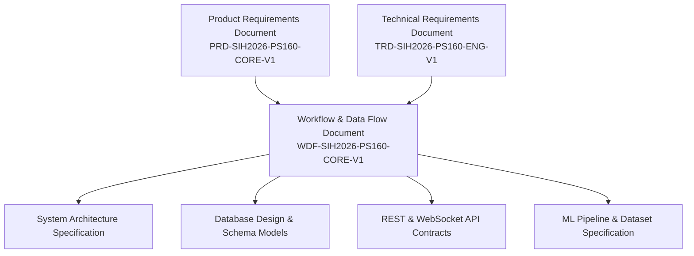

This document operationalizes the requirements of the PRD and TRD into concrete, step-by-step data transformations, component contracts, and state transitions.

---

## 6. System Workflow Principles

1. **Deterministic Forensics First, ML Second:** Protocol headers, transforms, SPIs, and exchange types are parsed deterministically. Machine learning is invoked solely for properties unobservable due to encryption (e.g., inner traffic classification).
2. **Evidence Before Conclusion:** Every reported finding, risk level, or score deduction must be backed by concrete, auditable evidence records pointing to packet numbers, byte offsets, or documented absence-of-event timelines.
3. **Explicit Uncertainty Modeling:** If evidence is absent, incomplete, or ambiguous, the workflow assigns formal evidence states: `VERIFIED`, `INFERRED`, `UNKNOWN`, or `MISCONFIGURATION OBSERVED`. It never fabricates certainty.
4. **Structured Evidence Before Generative AI:** The optional AI Analyst is strictly downstream from the deterministic policy engine and verified database records. LLMs are never permitted to generate findings or invent packet fields.
5. **Local-First Data Perimeter:** Raw packet captures and internal IP topologies remain strictly within the local host/worker boundaries; no raw PCAP data is transmitted to external cloud endpoints.
6. **Closed-Loop Verification:** Recommendations are not considered verified until the configuration is applied to the controlled testbed, traffic is recaptured, re-analyzed, and confirmed clean.

---

## 7. Actors

| Actor | Category | Description | Primary Workflows |
| :--- | :--- | :--- | :--- |
| **Cybersecurity / SOC Analyst** | Human User | Primary investigator auditing tunnels, triaging risks, and reviewing evidence. | Offline Analysis, Live Monitoring, Evidence Inspection, Report Export, AI Q&A. |
| **Network / VPN Security Engineer** | Human User | Gateway administrator testing hardening migrations and validating configurations. | Configuration Twin Simulation, Lab Remediation, Verification Re-testing. |
| **Security Auditor / Compliance Officer**| Human User | Assessor evaluating network compliance against NIST and RFC regulatory frameworks. | Compliance Auditing, Score Breakdown Inspection, Executive Report Export. |
| **Testbed Operator / ML Engineer** | Human User | Internal researcher executing testbed sweeps and building training datasets. | Testbed Orchestration, Workload Injection, Dataset Export, Model Training. |
| **FastAPI Gateway** | System Component| Asynchronous application server managing REST requests, sessions, and auth. | Request Routing, Session Dispatch, State Queries, WebSocket Broadcast. |
| **Celery Worker Pool** | System Component| Unprivileged background worker processes executing compute-heavy jobs. | Packet Dissection, Flow Aggregation, ML Inference, Policy Evaluation, PDF Rendering. |
| **Privileged Capture Service** | System Component| High-privilege daemon (`CAP_NET_RAW`) handling raw interface sniffing. | Live Packet Ingestion, FIFO Pipe Dispatch. |
| **strongSwan Lab Controller** | System Component| Privileged daemon managing isolated network namespaces and strongSwan. | Tunnel Provisioning, Traffic Injection, Config Deployment, Recapture. |

---

## 8. System Inputs

1. **Offline Packet Captures:** `.pcap` or `.pcapng` binary files (Ethernet, Linux Cooked, IPv4/IPv6 encapsulating UDP 500, UDP 4500, IP Protocol 50 ESP, IP Protocol 51 AH).
2. **Live Network Streams:** Promiscuous network frames streamed directly from a designated local interface (e.g., `eth0`, `veth-wan`).
3. **Controlled Testbed Scenarios:** Programmatic JSON/YAML matrix specifications defining IPsec modes, cipher suites, DH groups, PFS states, and synthetic workloads.
4. **Configuration Snippets:** Raw text configuration blocks (`ipsec.conf` or `swanctl.conf`) input into the Configuration Security Twin.
5. **Analyst Natural Language Queries:** Text queries submitted to the local AI Analyst workspace.

---

## 9. System Outputs

1. **Interactive SOC Dashboard Data:** Real-time telemetry, SA topology graphs, flow distribution charts, and timeline events.
2. **Structured Cryptographic Findings:** Itemized compliance and security violation objects linked to NIST SP 800-77 Rev. 1 and RFC standards.
3. **Quantitative Security Posture Score:** Deterministic 0–100 scalar score with dimension-by-dimension radar breakdowns.
4. **Itemized Threat Matrix:** Tabular risk assessments detailing threat scenarios, exploit vectors, likelihood, impact, and severity.
5. **Metadata Fingerprintability Index:** Quantitative measure of side-channel distinguishability across encrypted ESP streams.
6. **Dual-Tier Publication Reports:** Publication-grade Executive Summary (PDF/HTML) and Technical Forensics (PDF/HTML) reports.
7. **Remediation Configuration Snippets:** Hardened strongSwan configuration blocks with line-by-line justifications.
8. **Curated IPsec-Native Datasets:** Synchronized dual-sided packet captures and ground-truth metadata records for ML research.

---

## 10. Data Categories

| Category | Typical Formats | Sensitivity | Source / Producer | Persistence Target | Lifecycle |
| :--- | :--- | :--- | :--- | :--- | :--- |
| **1. Raw Network Data** | `.pcap`, `.pcapng`, raw sockets | High (Internal metadata) | User upload / Live sniffer | Local / S3-compatible Object Storage | Retained per retention policy; purgeable post-analysis. |
| **2. Protocol Data** | JSON records, header structs | Medium | TShark Dissection Worker | PostgreSQL (`protocol_observations`) | Permanent with analysis session. |
| **3. Reconstructed State** | Graph models, SA records | Medium | SA Reconstruction Worker | PostgreSQL (`security_associations`) | Permanent with analysis session. |
| **4. Flow Data** | Flow objects, IAT arrays | Low (Statistical) | Flow Reconstruction Worker | PostgreSQL (`esp_flows`) / Ephemeral RAM | Flow metadata kept; raw IAT arrays purgeable. |
| **5. ML Input Features** | 1D float vectors, 3xN tensors | Low | Feature Extraction Engine | Ephemeral RAM / ML Training CSVs | Discarded post-inference (cached during training). |
| **6. ML Output Data** | Prediction JSON, SHAP arrays | Low | Model Inference Workers | PostgreSQL (`flow_predictions`) | Permanent with analysis session. |
| **7. Security Data** | Finding models, Score tuples | Medium | Policy-as-Code Engine | PostgreSQL (`security_findings`, `scores`) | Permanent with analysis session. |
| **8. Forensic Data** | Evidence nodes, SHA-256 hashes | High (Audit integrity) | Evidence Graph Engine | PostgreSQL (`evidence_nodes`, `audit_ledger`) | Immutable permanent audit trail. |
| **9. Product Artifacts** | PDF, HTML, JSON manifests | Medium | Report Engine / Twin Engine | Object Storage / Redis Cache | Permanent until user deletion. |
| **10. Knowledge Data** | Markdown, YAML, Vector tensors| Public / Unclassified | Standards Docs / Policy Files | PostgreSQL (`pgvector` store) | Static versioned knowledge base. |

---

## 11. Master End-to-End Workflow

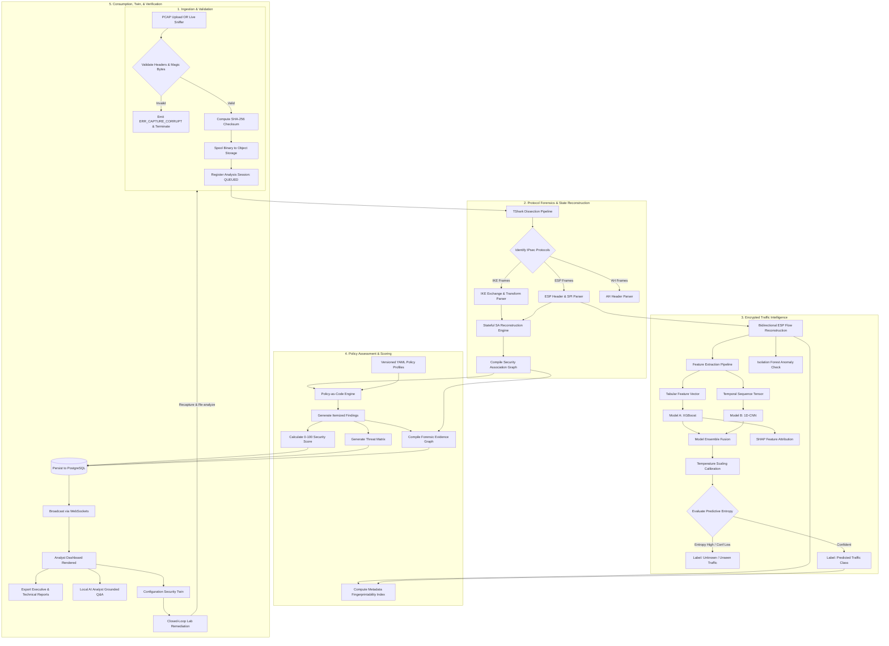

---

## 12. Master Data Transformation Pipeline

The data transformation pipeline formally traces data structures from binary packets to executive insights:

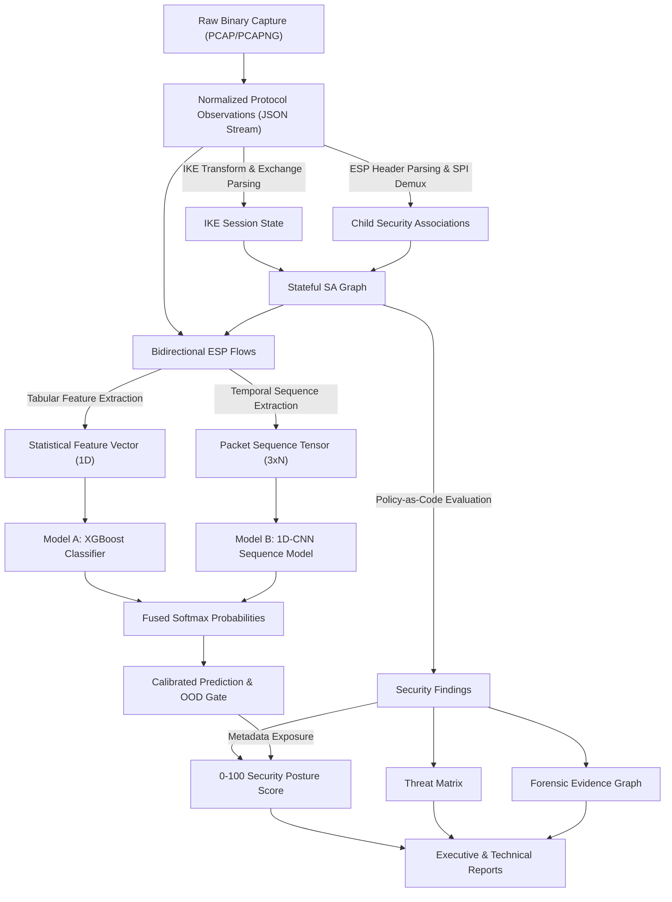

---

## 13. Level 0 DFD (Context Diagram)

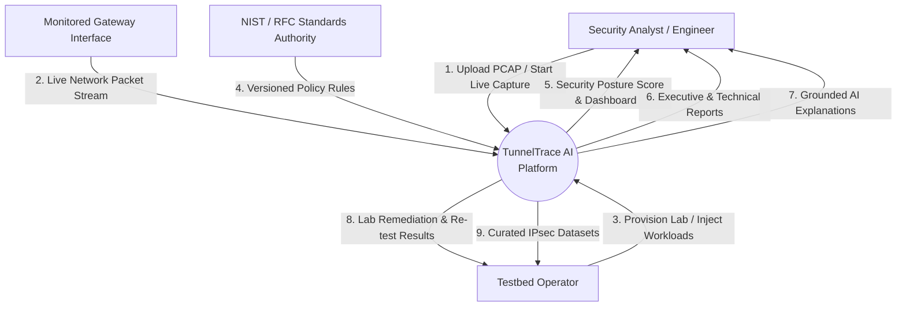

---

## 14. Level 1 DFD (Subsystem Breakdown)

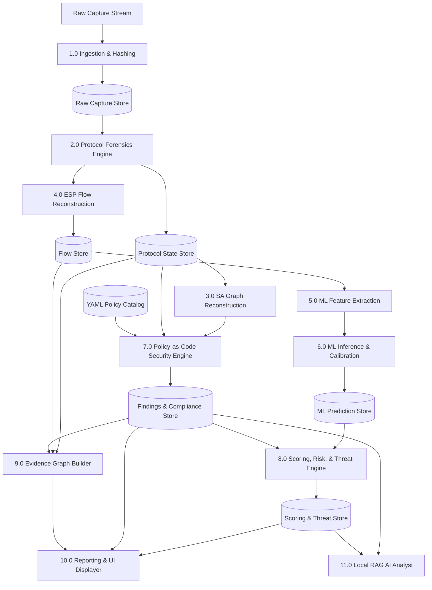

---

## 15. Level 2 DFDs

### 15.1 Level 2 DFD: Protocol & SA Reconstruction Pipeline

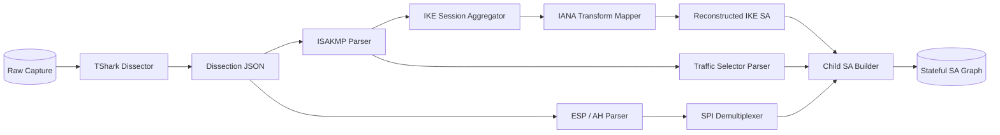

### 15.2 Level 2 DFD: Encrypted Traffic ML Pipeline

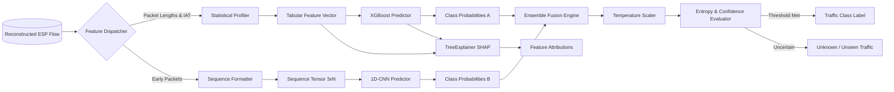

### 15.3 Level 2 DFD: Policy Assessment & Scoring Pipeline

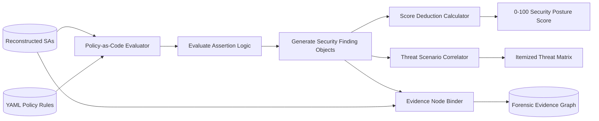

### 15.4 Level 2 DFD: Closed-Loop Remediation Pipeline

```mermaid

flowchart LR
    FIND[("Security Findings")] --> REM_SYNTH["Remediation Synthesizer"]
    REM_SYNTH --> SNIPPET["Hardened strongSwan Config"]
    
    SNIPPET --> TWIN_SIM["Configuration Twin Simulation"]
    TWIN_SIM --> PROJ_SCORE["Projected Score Delta"]
    
    PROJ_SCORE --> AUTH_APPLY{"Operator Authorizes Apply?"}
    AUTH_APPLY -->|"No"| CANCEL["Halt Remediation"]
    AUTH_APPLY -->|"Yes"| BACKUP["Backup Active Lab Config"]
    
    BACKUP --> DEPLOY["Deploy Config via swanctl / vici"]
    DEPLOY --> RESTART["Reload & Initiate Tunnel"]
    
    RESTART --> HEALTH{"Tunnel Established?"}
    HEALTH -->|"No"| ROLLBACK["Rollback to Backup Config"]
    HEALTH -->|"Yes"| INJECT["Inject Verification Traffic"]
    
    INJECT --> RECAP["Capture Verification PCAP"]
    RECAP --> REANA["Trigger Re-analysis Pipeline"]
    REANA --> COMP_RES["Compare Before / After Findings"]

```

---

## 16. Offline PCAP Workflow

| Step ID | Actor | Trigger | Input | Responsible Component | Processing | Output | Persistence | Sync / Async | Next Step | Failure State | Recovery | Evidence State | User-Visible Status |
| :--- | :--- | :--- | :--- | :--- | :--- | :--- | :--- | :--- | :--- | :--- | :--- | :--- | :--- |
| `OFF-01` | Analyst | Clicks "Upload Capture" | `.pcap` / `.pcapng` file | Web Frontend | Validates client file size, formats `multipart/form-data` | Upload request | Browser RAM | Async | `OFF-02` | Network Error | Retry upload | N/A | "Uploading capture..." |
| `OFF-02` | API Gateway | Receives upload stream | Multipart binary stream | `backend.capture` | Validates magic bytes, assigns UUIDv4, calculates SHA-256 | Temp file, metadata | Spool Disk | Async | `OFF-03` | Magic byte mismatch | Reject upload | N/A | "Validating file..." |
| `OFF-03` | API Gateway | File spooled | File path, SHA-256 | `backend.capture` | Moves binary to storage, registers analysis record in DB | Analysis Session (QUEUED) | PostgreSQL | Sync (DB) | `OFF-04` | DB write error | Return 500 error | N/A | "Capture registered" |
| `OFF-04` | Celery Broker | Session registered | Task message (`analysis_id`) | Redis Queue | Dispatches job to next available unprivileged worker | Worker dispatch | Redis RAM | Async | `OFF-05` | Broker down | Exponential retry | N/A | "Queued for processing" |
| `OFF-05` | Worker | Worker picks up task | `analysis_id`, file path | `backend.protocol` | Invokes TShark dissection subprocess (`shell=False`) | Dissected JSON events | Scratch Disk | Async | `OFF-06` | TShark crash | Mark FAILED | N/A | "Dissecting packets..." |
| `OFF-06` | Worker | Dissection complete | Dissection JSON | `backend.protocol` | Normalizes IKE/ESP headers, maps IANA transforms | Protocol observations | PostgreSQL | Async | `OFF-07` | Zero IPsec frames | Mark NO_IPSEC | N/A | "Reconstructing protocol..." |
| `OFF-07` | Worker | Protocol normalized | Observations | `backend.sa` | Builds stateful SA graph linking IKE and Child SAs | Reconstructed SA Graph | PostgreSQL | Async | `OFF-08` | Corrupted headers | Mark UNKNOWN | `VERIFIED` / `UNKNOWN` | "Mapping Security Associations..." |
| `OFF-08` | Worker | SAs reconstructed | Raw ESP frames, SA graph | `backend.flow` | Aggregates packets into bidirectional flows | Flow records | PostgreSQL | Async | `OFF-09` | Zero ESP frames | Skip ML stage | `VERIFIED` | "Aggregating flows..." |
| `OFF-09` | Worker | Flows aggregated | Flow records | `backend.features` | Computes statistical features & sequence tensors | Feature arrays | RAM | Async | `OFF-10` | Math overflow | Filter invalid flow | `INFERRED` | "Extracting features..." |
| `OFF-10` | Worker | Features ready | Feature arrays | `backend.ml` | Evaluates XGBoost + 1D-CNN, calibrates probabilities | Prediction objects | PostgreSQL | Async | `OFF-11` | Inference error | Fallback rule label | `INFERRED` | "Classifying encrypted traffic..." |
| `OFF-11` | Worker | Predictions ready | SA graph, observations | `backend.policy` | Evaluates YAML Policy-as-Code assertions | Security findings | PostgreSQL | Async | `OFF-12` | Policy missing | Load IETF fallback | `VERIFIED` | "Evaluating security policies..." |
| `OFF-12` | Worker | Findings generated | Findings, SAs, flows | `backend.risk` | Computes 0–100 score, Threat Matrix, Metadata Index | Scoring summary | PostgreSQL | Async | `OFF-13` | Calculation error | Set default score | `INFERRED` | "Calculating security posture..." |
| `OFF-13` | Worker | Scoring complete | Findings, packets | `backend.evidence` | Links finding IDs to packet numbers and byte offsets | Evidence Graph | PostgreSQL | Async | `OFF-14` | Missing packet ref | Mark ABSENCE_EVENT | `VERIFIED` | "Building evidence graph..." |
| `OFF-14` | Worker | Analysis complete | All analysis artifacts | `backend.orchestrator`| Updates session status to COMPLETED, emits WS event | Session COMPLETED | PostgreSQL | Async | Terminal | DB update error | Retry DB commit | `VERIFIED` | "Analysis complete" |

---

## 17. Live Capture Workflow

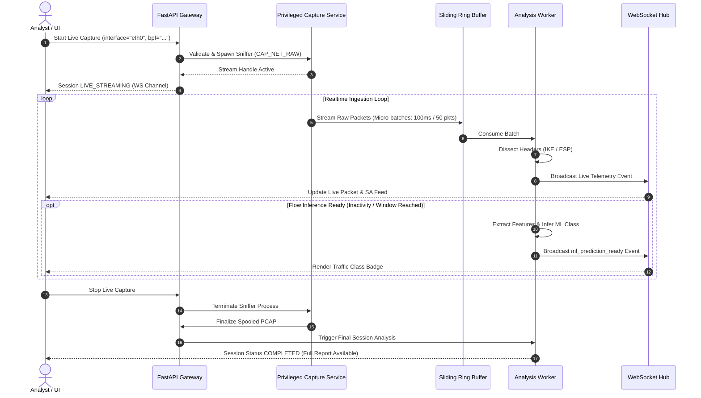

---

## 18. Capture Validation Workflow

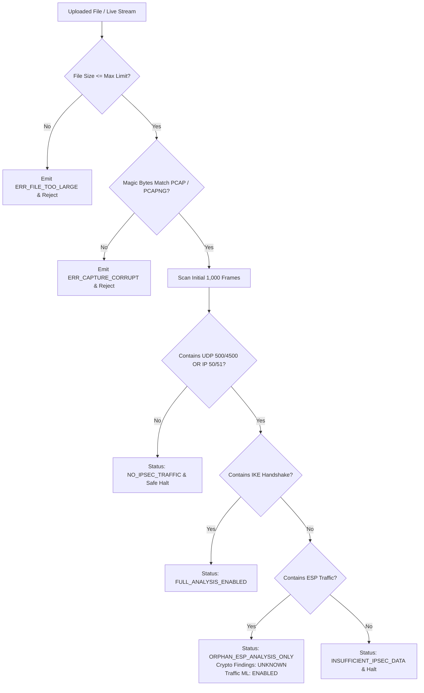

---

## 19. Protocol Analysis Workflow

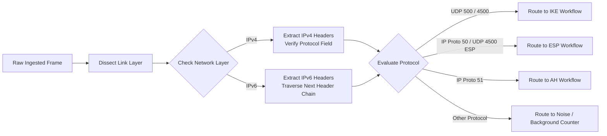

---

## 20. IKE Workflow

1. **Header Parsing:** Extracts Initiator SPI, Responder SPI, Major/Minor Version, Exchange Type, Flags, Message ID, and Length.
2. **Exchange Classification:**
   * **IKEv1:** Flags Main Mode (`2`), Aggressive Mode (`4`), Quick Mode (`32`), or Informational (`5`).
   * **IKEv2:** Flags `IKE_SA_INIT` (`34`), `IKE_AUTH` (`35`), `CREATE_CHILD_SA` (`36`), or `INFORMATIONAL` (`37`).
3. **Payload Traversal:** Recursively steps through IKE payload chains:
   * **Security Association (SA):** Parses Proposal and Transform substructures; extracts encryption, integrity, PRF, and DH transforms.
   * **Key Exchange (KE):** Extracts DH public value and group number.
   * **Nonce (Ni/Nr):** Extracts cryptographic nonces.
   * **Notify (N):** Inspects for operational notifications (`USE_TRANSPORT_MODE`, `NAT_DETECTION_SOURCE_IP`, `COOKIE`, `NO_PROPOSAL_CHOSEN`).
   * **Traffic Selectors (TSi/TSr):** Extracts proposed local and remote protected subnets/ports.
4. **State Linking:** Aggregates messages sharing Initiator/Responder SPIs into a coherent `IKESession` record.
5. **Uncertainty Fallback:** If exchange is truncated mid-handshake, extracts all visible headers, sets session state to `PARTIAL_HANDSHAKE`, and assigns evidence state `INFERRED`.

---

## 21. ESP Workflow

1. **Outer Header Extraction:** Extracts outer IPv4/IPv6 source and destination addresses, TTL/Hop Limit, and Total Length.
2. **NAT-T Demultiplexing:** If encapsulated in UDP port 4500, verifies that the first 32 bits after the UDP header are non-zero (distinguishing ESP SPI from IKE Non-ESP Marker).
3. **ESP Header Parsing:** Parses 32-bit Security Parameters Index (SPI) and 32-bit Sequence Number.
4. **Directionality Tagging:** Evaluates outer source/destination endpoints against established SA peer definitions to assign direction (`FORWARD` = +1, `REVERSE` = -1).
5. **Sequence Continuity Check:** Inspects sequence numbers for monotonicity, gaps, and window rollover.
6. **Payload Isolation:** Measures encrypted payload length; strips padding calculations based on cipher block boundaries.
7. **Flow Dispatch:** Appends frame metadata (timestamp, length, direction, SPI) to the active `ESPFlow` queue.

---

## 22. AH Workflow

1. **Header Parsing:** Dissects Next Header, Payload Length (8-bit units), Reserved (16 bits), SPI (32 bits), Sequence Number (32 bits), and Integrity Check Value (ICV).
2. **SA Correlation:** Queries active `SAGraph` for matching SPI; links AH parameters to active Child SA.
3. **Integrity Transform Identification:** Maps negotiated authentication algorithm (e.g., HMAC-SHA2-256-128).
4. **Limitation Tagging:** Since AH does not encrypt payloads, flags the flow in security reports as `AUTHENTICATION_ONLY (No Confidentiality)`.
5. **Absence Handling:** If AH is absent, sets AH status to `NOT_PRESENT_IN_CAPTURE` without failing analysis.

---

## 23. SA Reconstruction Workflow

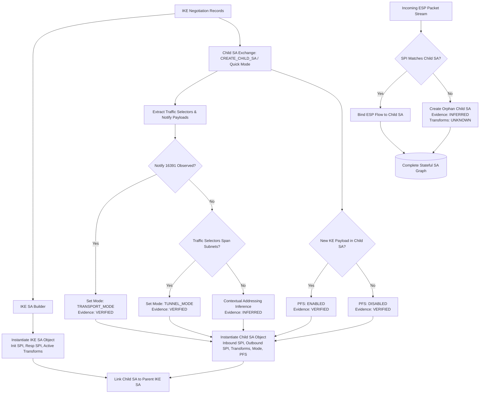

---

## 24. Evidence-State Propagation

The workflow enforces strict mathematical rules for propagating uncertainty through the system:

| Observation State | Policy Evaluation Semantics | System & Scoring Consequence |
| :--- | :--- | :--- |
| **VERIFIED** | Direct observable packet proof | Full score evaluation; definitive Pass / Fail emitted |
| **INFERRED** | Heuristic or statistical derivation | Score evaluation with lower confidence weight; explicit badge displayed |
| **UNKNOWN** | Unobserved or encrypted parameter | Zero score penalty; reported as INCONCLUSIVE / UNKNOWN |
| **MISCONFIGURATION OBSERVED** | Confirmed specification breach | Direct critical score penalty; high-severity finding emitted |

* **Propagation Rule 1:** If an SA transform is `UNKNOWN`, any policy rule asserting on that transform emits status `INCONCLUSIVE_PASSIVE_EVIDENCE`, not `FAIL`.
* **Propagation Rule 2:** If PFS status is `UNKNOWN` (no Child SA rekey captured), the Threat Matrix displays a warning: *"PFS cannot be verified from partial capture"*, rather than claiming PFS is disabled.

---

## 25. Flow Reconstruction Workflow

1. **Key Generation:** Unique flow key formulated as `(src_ip, dst_ip, spi)`.
2. **Bidirectional Coupling:** When Inbound SPI $SPI_{\text{in}}$ and Outbound SPI $SPI_{\text{out}}$ belong to the same reconstructed Child SA, their forward and reverse unidirectional streams are coupled into a single bidirectional `ESPFlow`.
3. **Arrival Sorting:** Re-orders arriving packets strictly by timestamp to mitigate out-of-order capture anomalies.
4. **Metric Accumulation:** Continuously updates:
   * Packet counters ($N_{\text{total}}, N_{\text{fwd}}, N_{\text{rev}}$).
   * Byte counters ($B_{\text{total}}, B_{\text{fwd}}, B_{\text{rev}}$).
   * Inter-arrival time series: $\Delta t_i = t_i - t_{i-1}$.
   * Packet length arrays: $L_i = \text{length}(\text{frame}_i)$.
5. **Lifecycle Termination:** Concludes flow upon:
   * Inactivity gap exceeding Flow Inactivity Timeout (*TBD — baseline: 30s*).
   * Flow duration reaching Maximum Flow Window (*TBD — baseline: 300s*).
   * Detection of IKE `DELETE` notification for associated SPI.

---

## 26. Feature Extraction Flow

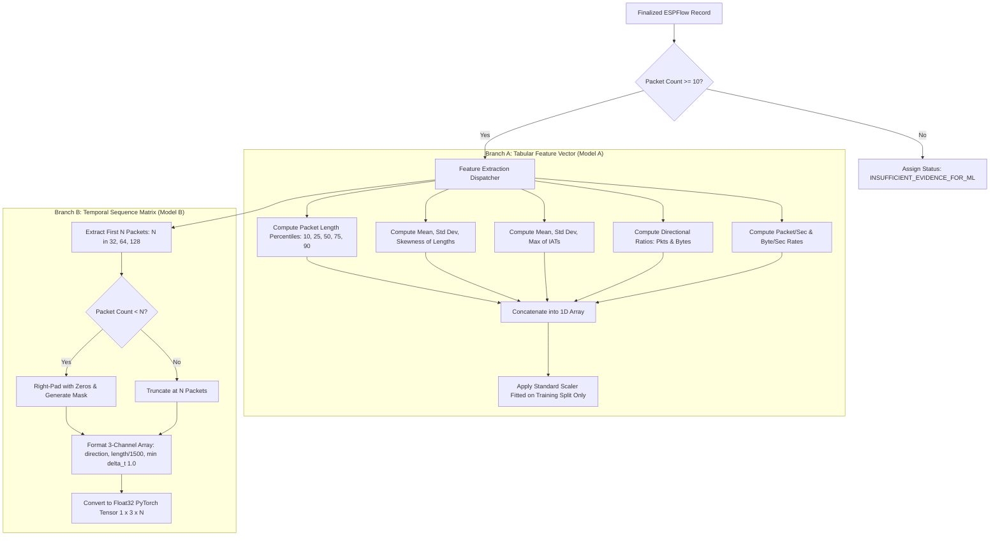

---

## 27. ML Inference Workflow

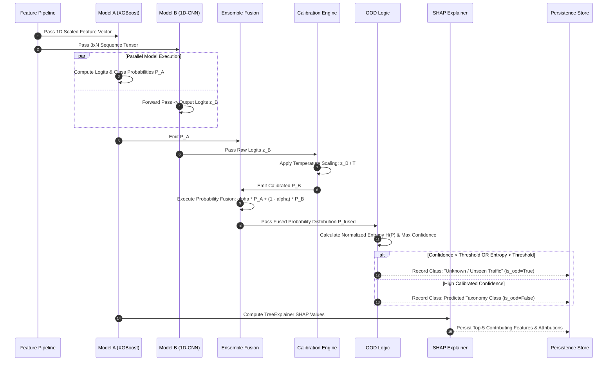

---

## 28. Confidence/Calibration Flow

1. **Raw Logits Extraction:** Extracts unnormalized logit vectors from neural layers.
2. **Temperature Application:** Scales logits by temperature parameter $T_{\text{opt}}$ derived during validation:
   $$z'_i = \frac{z_i}{T_{\text{opt}}}$$
3. **Softmax Transformation:** Converts scaled logits to calibrated probabilities $\hat{p}_i = \text{softmax}(z'_i)$.
4. **Isotonic Calibration for Trees:** Passes XGBoost margin outputs through fitted isotonic regression calibrators.
5. **Confidence Assignment:** Sets `AI Confidence Score` equal to $\max(\mathbf{P}_{\text{calibrated}})$.
6. **Separation from Evidence:** Stores `ml_confidence` as a distinct floating-point scalar, never merging it with deterministic protocol `evidence_state`.

---

## 29. OOD/Unknown Flow

1. **Input:** Calibrated probability distribution $\mathbf{P} \in \mathbb{R}^C$.
2. **Metric 1 (Max Confidence):** $C_{\max} = \max_c P_c$.
3. **Metric 2 (Normalized Entropy):**
   $$H(\mathbf{P}) = - \frac{1}{\log_2 C} \sum_{c=1}^{C} P_c \log_2 (P_c + \epsilon)$$
4. **Decision Boundary:**
   * If $C_{\max} < \theta_{\text{conf}}$ OR $H(\mathbf{P}) > \theta_{\text{entropy}}$:
     * Assign class: `Unknown / Unseen Traffic`.
     * Extract top-2 nearest classes as candidate hypotheses.
     * Flag: `is_ood = true`.
   * Else:
     * Assign class: $\arg\max_c P_c$.
     * Flag: `is_ood = false`.
5. *Thresholds $\theta_{\text{conf}}$ and $\theta_{\text{entropy}}$: TBD through empirical validation.*

---

## 30. Explainability Flow

1. **Trigger:** Successful classification by Model A (XGBoost).
2. **SHAP Execution:** Evaluates `shap.TreeExplainer` on the input flow feature vector.
3. **Attribution Extraction:** Extracts local Shapley values $\phi_k$ for the winning class.
4. **Ranking:** Sorts features by $|\phi_k|$; selects top-5 most impactful attributes.
5. **Contextual Translation:** Translates raw feature keys into plain-language analyst summaries:
   * `feat_iat_mean < 0.02s` $\longrightarrow$ *"Extremely rapid packet arrival intervals contributed +0.38 toward VoIP."*
   * `feat_bytes_fwd_ratio > 0.85` $\longrightarrow$ *"Heavy unidirectional forward byte dominance contributed +0.44 toward File Transfer."*
6. **UI Rendering:** Emits structured JSON for horizontal waterfall rendering in the dashboard.

---

## 31. Anomaly Detection Flow

1. **Input:** Aggregated temporal metrics over a sliding 60-second window (packet rate, byte rate, sequence rate of change, rekey frequency).
2. **Model Evaluation:** Passes feature vector to trained Scikit-learn `IsolationForest`.
3. **Score Derivation:** Computes anomaly score $s \in [-1, 1]$.
4. **Threshold Check:** If $s < \theta_{\text{anomaly}}$:
   * Emits alert: `BEHAVIORAL_ANOMALY_DETECTED`.
   * Flags contributing dimension (e.g., *"Unusual packet rate spike exceeding baseline by 400%"*).
   * Explicitly disclaims malicious intent: *"Statistical behavioral anomaly detected; does not confirm network attack."*

---

## 32. Security Policy Flow

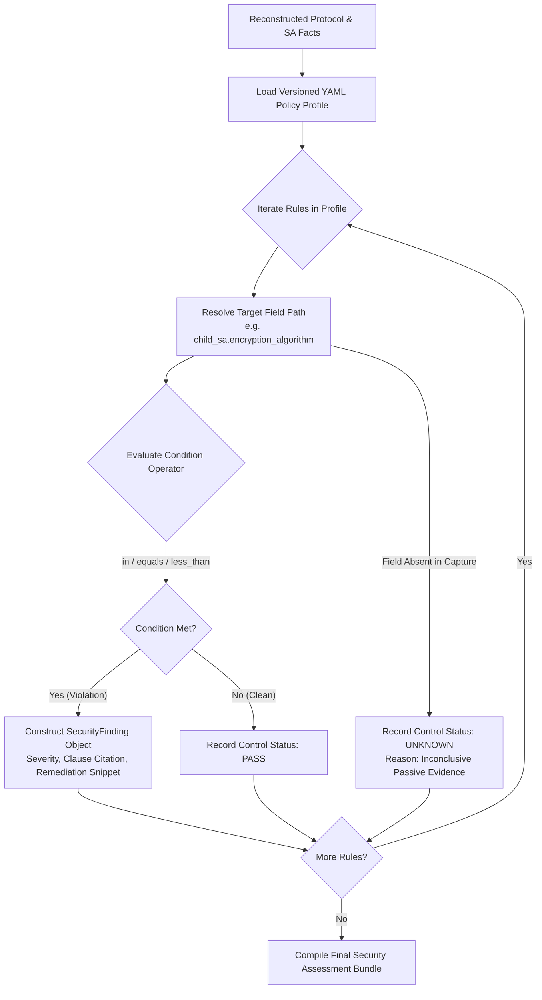

---

## 33. Compliance Flow

1. **Profile Selection:** User selects target compliance framework (`NIST-SP-800-77-REV1`, `IETF-RFC8221`, or `ENTERPRISE-STRICT`).
2. **Control Mapping:** Maps each policy assertion to specific section clauses in the authoritative standard.
3. **Scorecard Compilation:** For each control, outputs:
   * Control ID (e.g., `NIST-4.1.1`).
   * Requirement Name (e.g., *Mandatory Approved Encryption Algorithms*).
   * Status: `PASS`, `FAIL`, `UNKNOWN`, or `NOT_APPLICABLE`.
   * Observed Value (e.g., `3DES-CBC`).
   * Evidence Reference (e.g., `Packet #14, Transform Type 1`).
4. **Compliance Metric:** Computes compliance ratio:
   $$\text{Compliance \%} = \frac{N_{\text{PASS}}}{N_{\text{PASS}} + N_{\text{FAIL}}} \times 100$$
   *(Controls with `UNKNOWN` status are excluded from the denominator to avoid penalizing unobservable fields, but are explicitly reported in the scorecard).*

---

## 34. Security Score Flow

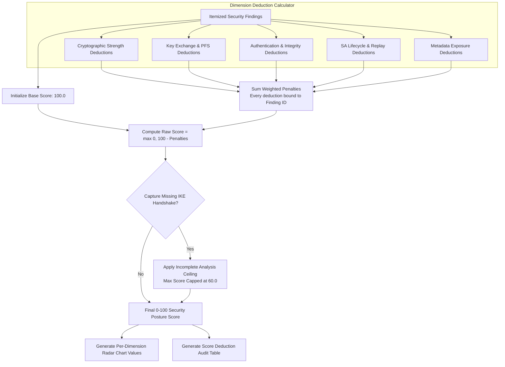

---

## 35. Risk Flow

1. **Input:** Itemized `SecurityFinding` list.
2. **Likelihood Assignment:** Evaluates exploit prerequisite difficulty (e.g., passive wire eavesdropping = `HIGH`; active MITM = `MEDIUM`; precomputation brute-force = `LOW`).
3. **Impact Assignment:** Evaluates confidentiality, integrity, and availability impact based on CVSS v3.1 qualitative standards (e.g., broken cipher = `CRITICAL Confidentiality Impact`).
4. **Risk Score Derivation:** Computes composite risk category: `CRITICAL`, `HIGH`, `MEDIUM`, `LOW`, or `INFORMATIONAL`.
5. **No Generative AI:** Risk levels are derived strictly through deterministic lookup tables; never generated by free-form LLM text.

---

## 36. Threat Matrix Flow

1. **Finding Ingestion:** Ingests verified findings from Policy Engine.
2. **Threat Mapping:** Maps each finding ID to a structured threat scenario from the versioned threat catalog:
   * `IPSEC-CRYPTO-001` (3DES) $\longrightarrow$ *Passive Wire Eavesdropping via Sweet32 Collision Attack*.
   * `IPSEC-KE-002` (DH Group 2) $\longrightarrow$ *Pre-Computation Shared Secret Recovery (Logjam Attack)*.
   * `IPSEC-PFS-003` (No PFS) $\longrightarrow$ *Retroactive Session Decryption via Long-Term Key Compromise*.
3. **Table Compilation:** Assembles itemized Threat Matrix table containing:
   * Threat ID & Name
   * Affected Entity (IKE SA / Child SA / SPI)
   * Exploit Vector Description
   * Likelihood, Impact, & Severity
   * Authoritative Standard Citation
   * Remediation Link & Evidence State

---

## 37. Metadata Fingerprintability Flow

1. **Input:** Reconstructed bidirectional `ESPFlow` records and ML prediction probability distributions.
2. **Signal Extraction:**
   * Classifier Separability: High calibrated confidence ($C_{\max} \ge 0.85$).
   * Packet Length Variance: $\sigma_L^2$ across forward and reverse frames.
   * Inter-Arrival Entropy: Shannon entropy of the $\Delta t$ distribution.
   * Directional Asymmetry: $|B_{\text{fwd}} - B_{\text{rev}}| / B_{\text{total}}$.
3. **Index Calculation:** Computes `Metadata Fingerprintability Index` ($0.00$ to $1.00$ or $0$ to $100$).
   * *Formula and weights: TBD through empirical validation.*
4. **Plaintext Disclaimer:** The output is explicitly documented as: *"Behavioral side-channel distinguishability score. Does not indicate payload decryption or cleartext data leakage."*

---

## 38. Evidence/Provenance Flow

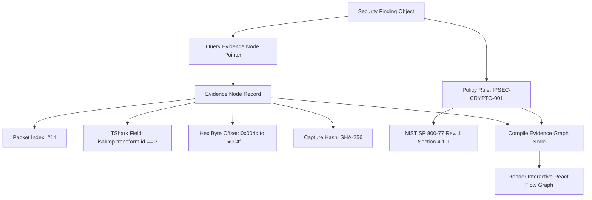

---

## 39. Dashboard Data Flow

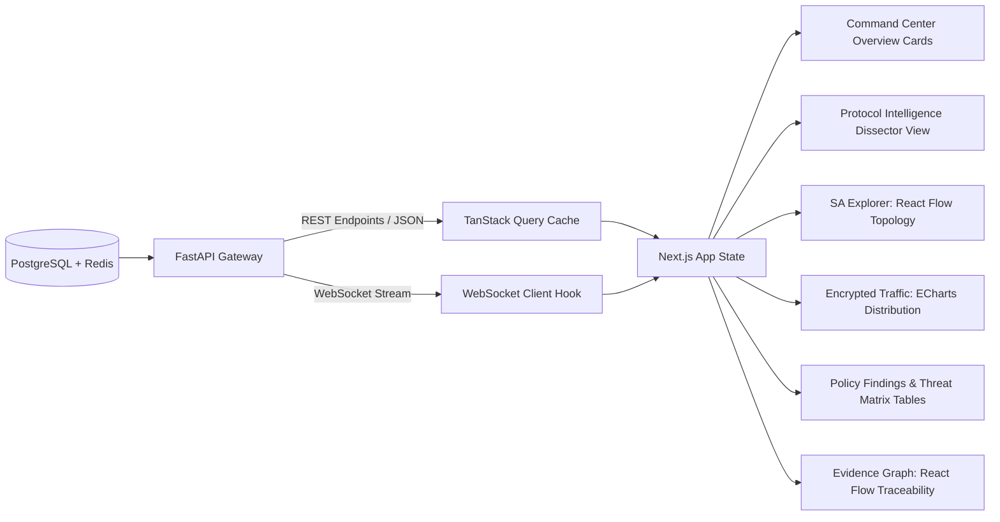

---

## 40. Report Generation Flow

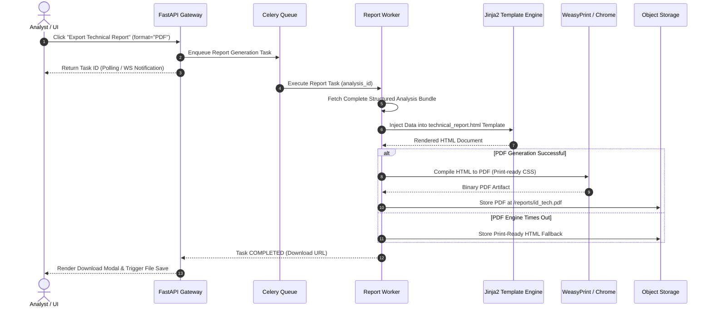

---

## 41. AI Analyst/RAG Flow

```mermaid

sequenceDiagram
    autonumber
    actor Analyst as Analyst / UI
    participant API as FastAPI Gateway
    participant RAG as RAG Pipeline
    participant VEC as PostgreSQL (pgvector)
    participant PROMPT as Prompt Sanitizer
    participant LLM as Local / Private LLM Endpoint

    Analyst->>API: Submit Query ("Why is DH Group 2 marked Critical?")
    API->>RAG: Forward Query + analysis_id
    
    RAG->>RAG: Compute Query Embedding
    RAG->>VEC: Cosine Similarity Search (Standards + Findings)
    VEC-->>RAG: Return Top-K Chunks (NIST SP 800-77 + Finding IPSEC-KE-002)
    
    RAG->>PROMPT: Assemble Context (Chunks + Sanitized Transform Data)
    PROMPT->>PROMPT: Assert Zero Raw Packets or Private IPs in Prompt
    PROMPT->>LLM: Submit Grounded Prompt
    
    LLM-->>RAG: Stream Factual Grounded Response
    RAG-->>API: Stream Tokens + Citations
    API-->>Analyst: Render Response with Clickable Evidence Links

```

---

## 42. Configuration Security Twin Flow

1. **Trigger:** User opens "Configuration Security Twin" and pastes proposed configuration text (`ipsec.conf` or `swanctl.conf`).
2. **Parsing:** Parses proposed syntax into a virtual configuration AST.
3. **Virtual SA Synthesis:** Generates a simulated `SAGraph` representing proposed tunnels, transforms, and lifetimes.
4. **Policy Re-Evaluation:** Executes the Policy-as-Code engine against the virtual graph using the active policy profile.
5. **Score & Risk Projection:** Computes projected Security Score $S_{\text{projected}}$ and identifies resolved vs. newly introduced findings.
6. **Diff Computation:** Compares baseline vs. proposed states:
   * Score Delta: $\Delta S = S_{\text{projected}} - S_{\text{current}}$.
   * Resolved Findings Count.
   * Line-by-line configuration diff view.
7. **Simulation Disclaimer:** Displays notice: *"Configuration policy projection only. Does not prove production network connectivity."*

---

## 43. Remediation Flow

1. **Finding Selection:** Analyst reviews an active finding (e.g., `IPSEC-CRYPTO-001: Deprecated 3DES`).
2. **Template Synthesis:** Remediation engine pulls the approved remediation template mapped to the failed rule ID.
3. **Target Adapter:** Formats snippet for target configuration syntax (default: strongSwan `swanctl.conf` / `ipsec.conf`).
4. **Parameter Injection:** Generates concrete cipher strings:
   ```ini
   # Remediated by TunnelTrace AI (Resolves IPSEC-CRYPTO-001)
   # Compliance: NIST SP 800-77 Rev. 1 Section 4.1.1
   esp = aes256gcm16,aes128gcm16!
   ```
5. **Analyst Review:** Displays copy-pasteable snippet alongside manual implementation instructions.

---

## 44. Closed-Loop Verification Flow

```mermaid

sequenceDiagram
    autonumber
    actor Analyst as Security Engineer
    participant UI as Dashboard UI
    participant LAB as strongSwan Lab Controller
    participant SW as strongSwan Daemon
    participant TC as Traffic Control / Workload
    participant CAP as Capture Daemon
    participant ANA as Core Analysis Pipeline

    Analyst->>UI: Click "Validate in Controlled Lab"
    UI->>LAB: Post Remediation Job (snippet, target_instance)
    
    LAB->>LAB: Backup Current Configuration (backup.conf)
    LAB->>SW: Write Hardened Config & Reload (swanctl --reload)
    LAB->>SW: Initiate Tunnel (swanctl --initiate)
    
    alt Tunnel Negotiation Rejection
        LAB->>SW: Restore backup.conf & Reload
        LAB-->>UI: Status: REMEDIATION_ROLLBACK (Negotiation Failed)
    else Tunnel Established Cleanly
        LAB->>CAP: Start Capture on veth-wan
        LAB->>TC: Run Synthetic Verification Workload
        TC-->>LAB: Workload Complete
        LAB->>CAP: Stop Capture & Finalize verify.pcap
        
        LAB->>ANA: Trigger Full Analysis on verify.pcap
        ANA-->>LAB: New Analysis Results (New Findings, New Score)
        
        LAB->>LAB: Compare Baseline Findings vs New Findings
        LAB-->>UI: Render Verification Card (Status: VERIFIED_RESOLVED)
    end

```

---

## 45. Rollback Flow

1. **Trigger Condition:** Tunnel negotiation failure, network routing failure, or user cancellation during lab validation.
2. **State Restoration:** Copies `backup.conf` back to the active configuration path.
3. **Daemon Reload:** Executes `swanctl --reload` or `ipsec reload`.
4. **Connection Check:** Asserts that the original tunnel re-establishes successfully.
5. **Audit Logging:** Logs rollback event to `audit_ledger` with error code and timestamp.
6. **UI Notification:** Displays banner: `LAB_REMEDIATION_ROLLED_BACK (Reason: Handshake rejected by peer)`.

---

## 46. Testbed Workflow

1. **Scenario Selection:** Operator selects testbed configuration matrix row.
2. **Namespace Provisioning:** Creates isolated Linux network namespaces (`ns_client`, `ns_gw_a`, `ns_wan`, `ns_gw_b`, `ns_server`) and virtual ethernet (`veth`) pairs.
3. **Configuration Generation:** Generates strongSwan configuration files for Gateway A and Gateway B according to matrix row parameters.
4. **Network Impairment Injection:** Applies Linux `tc/netem` rules to the `ns_wan` bridge (delay, jitter, loss, rate limit).
5. **Tunnel Initiation:** Starts strongSwan daemons and triggers connection initiation.
6. **Capture Activation:** Starts synchronized `tcpdump` instances on plaintext and encrypted interfaces.
7. **Workload Injection:** Injects synthetic traffic stream (VoIP, Chat, Email, Web, ICMP, Video, File Transfer).
8. **Teardown & Cleanup:** Stops captures, flushes `tc` rules, terminates daemons, and removes network namespaces.

---

## 47. Dataset Generation Workflow

```mermaid

flowchart TD
    DEF["Matrix Sweep Definition"] --> LOOP_CFG{"Iterate Matrix Rows"}
    
    LOOP_CFG --> SETUP_NS["Provision Namespaces & Routing"]
    SETUP_NS --> CFG_SW["Deploy Gateway Configurations"]
    CFG_SW --> TC_RULES["Apply WAN Impairment Profile"]
    
    TC_RULES --> START_CAP["Start Dual tcpdump Captures\nPlain & Encrypted Interfaces"]
    START_CAP --> START_VPN["Establish strongSwan IPsec Tunnel"]
    
    START_VPN --> CHK_UP{"Tunnel Active?"}
    CHK_UP -->|"No"| LOG_FAIL["Record Matrix Cell: FAILED\nDiscard Capture"]
    
    CHK_UP -->|"Yes"| RUN_WORKLOAD["Inject Workload Stream\nRecord Ground Truth Logs"]
    RUN_WORKLOAD --> STOP_CAP["Stop tcpdump & Collect PCAPs"]
    
    STOP_CAP --> VALIDATE["Validate Packet Counts & Handshake Integrity"]
    VALIDATE --> BIND_META["Generate manifest.json\nSession ID, Labels, Transforms, Impairments"]
    
    BIND_META --> SAVE_DS[("Save to Curated Dataset Repository")]
    SAVE_DS --> TEARDOWN["Tear Down Namespaces & Clean Sockets"]
    
    TEARDOWN --> NEXT_ROW{"More Matrix Rows?"}
    NEXT_ROW -->|"Yes"| LOOP_CFG
    NEXT_ROW -->|"No"| EXPORT_DS["Publish Dataset Manifest & Split Partitions"]

```

---

## 48. Dataset Ground-Truth Flow

1. **Pre-IPsec Observation:** Plaintext traffic injected inside `ns_client` is captured at `veth-plain` prior to IPsec encapsulation.
2. **Workload Labeling:** Ground-truth label (e.g., `VoIP: G.711 SIP/RTP`) is recorded directly from the traffic generator command.
3. **Outer ESP Observation:** Encapsulated traffic passing through `ns_wan` is captured at `veth-wan`.
4. **Temporal Correlation:** Frames from both captures are aligned using microsecond kernel timestamps and byte length correspondences.
5. **Label Binding:** Outer ESP flows are bound to the ground-truth label without requiring payload decryption.

---

## 49. ML Training Workflow

1. **Dataset Ingestion:** Ingests raw PCAPs and manifests from the curated dataset repository.
2. **Session-Level Splitting:** Splits data into Train, Validation, and Test partitions grouped strictly on `session_id` (`GroupKFold`).
3. **Feature Extraction:** Extracts tabular feature arrays and sequence matrices for all training flows.
4. **Preprocessor Fitting:** Fits `StandardScaler` exclusively on the training split; saves scaler parameters.
5. **Model A Training:** Trains XGBoost using multi-class objective and early stopping on validation loss.
6. **Model B Training:** Trains 1D-CNN in PyTorch using AdamW optimizer and cross-entropy loss.
7. **Calibration Fitting:** Fits Temperature Scaling parameter $T$ on validation logits.
8. **Ensemble Optimization:** Evaluates fusion weights $\alpha$ on validation predictions.
9. **Evaluation & Artifact Export:** Evaluates final ensemble on the held-out test split; exports versioned model weights and manifest.

---

## 50. Train/Test Leakage Prevention

```mermaid

flowchart TD
    ALL_SESSIONS[("All Testbed Sessions")] --> GROUP_SPLIT{"GroupKFold by session_id"}
    
    GROUP_SPLIT --> TRAIN_SESS["Training Sessions"]
    GROUP_SPLIT --> VAL_SESS["Validation Sessions"]
    GROUP_SPLIT --> TEST_SESS["Holdout Test Sessions"]
    
    TRAIN_SESS --> FIT_SCALER["Fit Feature Scaler\nTraining Data ONLY"]
    
    FIT_SCALER --> APPLY_TRAIN["Transform Training Features"]
    FIT_SCALER -.->|"Transform Only\nNo Refitting"| APPLY_VAL["Transform Validation Features"]
    FIT_SCALER -.->|"Transform Only\nNo Refitting"| APPLY_TEST["Transform Test Features"]
    
    APPLY_TRAIN --> TRAIN_MODELS["Train XGBoost & 1D-CNN"]
    APPLY_VAL --> EVAL_VAL["Tune Calibration & Fusion"]
    APPLY_TEST --> EVAL_TEST["Final Model Evaluation"]

```

---

## 51. Cross-Configuration Evaluation Flow

1. **Configuration Split:** Defines distinct training configurations (e.g., AES-128-CBC + HMAC-SHA256, no packet loss) and unseen test configurations (e.g., AES-256-GCM, 3% packet loss, 50ms latency).
2. **Model Training:** Trains model exclusively on the training configuration set.
3. **Zero-Shot Testing:** Evaluates model on the unseen configuration set without retraining or fine-tuning.
4. **Generalization Analysis:** Measures F1-score drop across cipher mode transitions to assess sensitivity to cipher padding and network jitter.

---

## 52. Public Dataset Workflow (ISCXVPN2016)

```mermaid

flowchart LR
    ISCX[("UNB ISCXVPN2016 Archive")] --> FILTER["Feature Extraction Pipeline"]
    FILTER --> BENCH["Baseline Algorithm Benchmarking\nResearch Branch ONLY"]
    BENCH --> DOCS["Document Methodology Results"]
    
    NATIVE[("IPsec-Native Testbed Dataset")] --> TRAIN["Primary ML Training Pipeline"]
    TRAIN --> PROD_MODEL[("Production Model Artifacts")]
    
    style ISCX fill:#f9f,stroke:#333,stroke-width:2px
    style NATIVE fill:#bbf,stroke:#333,stroke-width:2px

```

* **Governance Rule:** ISCXVPN2016 traffic uses OpenVPN, not IPsec ESP. It is strictly segregated into research benchmarking and is never merged into the IPsec-native training dataset.

---

## 53. Background Jobs

| Job Name | Task Type | Queue | Timeout | Retry Policy | Trigger | Output | Failure Action |
| :--- | :--- | :--- | :--- | :--- | :--- | :--- | :--- |
| `task_dissect_pcap` | CPU-Intensive | `celery_dissection` | 180s | 1 retry | PCAP Ingestion | Normalized JSON | Mark Analysis FAILED |
| `task_extract_features` | Compute | `celery_ml` | 120s | 0 retries | Dissection Complete | Feature Arrays | Skip ML stage |
| `task_ml_inference` | Compute | `celery_ml` | 60s | 0 retries | Features Extracted | Prediction Records | Fallback Rule Label |
| `task_evaluate_policy` | Fast Logic | `celery_security` | 30s | 2 retries | SAs Reconstructed | Findings List | Fallback IETF Profile |
| `task_compile_report` | I/O & Render | `celery_reports` | 60s | 1 retry | User Export Request | PDF / HTML Artifact | Fallback to HTML |
| `task_validate_remediation`| Privileged Lab | `celery_lab` | 300s | 0 retries | User Lab Validate | Verification Card | Trigger Lab Rollback |

---

## 54. WebSocket/Event Flow

```mermaid

sequenceDiagram
    autonumber
    participant UI as Browser WebSocket Client
    participant HUB as Backend WebSocket Hub
    participant REDIS as Redis Pub/Sub
    participant WRK as Celery Worker

    UI->>HUB: Connect /ws/analyses/analysis_id
    HUB->>REDIS: Subscribe channel: analysis_analysis_id
    HUB-->>UI: Connection Established (ACK)
    
    WRK->>REDIS: Publish STAGE_STARTED (stage="PROTOCOL_DISSECTION")
    REDIS->>HUB: Forward Message
    HUB-->>UI: Push STAGE_STARTED
    
    WRK->>REDIS: Publish STAGE_PROGRESS (stage="ML_INFERENCE", percent=45)
    REDIS->>HUB: Forward Message
    HUB-->>UI: Push STAGE_PROGRESS (Update Progress Bar)
    
    WRK->>REDIS: Publish STAGE_COMPLETED (stage="ALL", score=82.5)
    REDIS->>HUB: Forward Message
    HUB-->>UI: Push STAGE_COMPLETED (Trigger React Query Invalidate)

```

---

## 55. Persistence Flow

| Data Artifact / Entity | Target Storage Destination | Storage Layer / Engine |
| :--- | :--- | :--- |
| **Raw PCAP File** | `/storage/captures/{sha256}.pcap` | Object Storage / Local POSIX Volume |
| **Analysis Session Record** | `analysis_sessions` table | PostgreSQL Relational Database |
| **Protocol Observations** | `protocol_observations` table | PostgreSQL Relational Database |
| **Security Associations & Graph** | `security_associations` table | PostgreSQL Relational Database |
| **ESP Flows & Feature Arrays** | `esp_flows` table | PostgreSQL Relational Database |
| **ML Predictions & SHAP Values** | `flow_predictions` table | PostgreSQL Relational Database |
| **Security Findings & Deductions** | `security_findings`, `score_deductions` tables | PostgreSQL Relational Database |
| **Evidence Nodes & Edges** | `evidence_nodes`, `evidence_edges` tables | PostgreSQL Relational Database |
| **Generated PDF/HTML Reports** | `/storage/reports/{id}.pdf` | Object Storage / Local POSIX Volume |
| **Standards Text & Embeddings** | `standards_knowledge` table | PostgreSQL with `pgvector` Extension |
| **Active Job Status & Telemetry** | Key-Value Store (`TTL: 24h`) | Redis In-Memory Cache |

---

## 56. Temporary Data Lifecycle

1. **Upload Spool:** Ephemeral buffer on scratch disk (`/tmp/spool/upload_*.tmp`). Purged immediately upon successful SHA-256 calculation and move to object storage.
2. **Dissector JSON:** Intermediate TShark JSON output (`/tmp/dissect/parsed_*.json`). Purged immediately upon database normalization.
3. **Report HTML:** Intermediate Jinja2 HTML rendering (`/tmp/reports/render_*.html`). Purged immediately post-PDF compilation.
4. **Live Ring Buffers:** Rotating capture chunks (`capture_part_*.pcap`). Overwritten automatically once processed by worker pipelines.

---

## 57. Privacy Data Flow

```mermaid

flowchart TD
    RAW_NET["Raw PCAP / Network Stream"] --> LOCAL_HOST["Local Host Boundary"]
    
    subgraph LOCAL_HOST["Local Host / Private Deployment Perimeter"]
        PARSER["TShark Dissector"]
        ML_ENG["ML Inference Workers"]
        POL_ENG["Policy Engine"]
        DB[("PostgreSQL Store")]
        SAN_FILTER["Prompt Sanitization Filter"]
        LOCAL_LLM["Local / Private LLM"]
    end
    
    RAW_NET --> PARSER
    PARSER --> ML_ENG & POL_ENG
    ML_ENG --> DB
    POL_ENG --> DB
    
    DB --> SAN_FILTER
    SAN_FILTER -->|"Sanitized Findings & Standards ONLY\nZero Packets / Zero IPs"| LOCAL_LLM
    
    LOCAL_LLM --> OUT_ANS["Analyst Answer"]
    
    CLOUD_EXT["Public Cloud / Third-Party APIs"]
    LOCAL_HOST x--x|STRICTLY BLOCKED: No Outbound Traffic| CLOUD_EXT

```

---

## 58. Privileged Operation Flow

1. **Boundary Rule:** The FastAPI backend runs under an unprivileged user (`uid: 10001`). It is prohibited from executing raw socket sniffers or network namespace commands directly.
2. **IPC Interface:** Privileged operations communicate via a restricted Unix domain socket (`/var/run/tunneltrace/privileged.sock`).
3. **Command Whitelist:** The privileged daemon accepts only validated, structured commands:
   * `START_CAPTURE(interface, bpf_filter)`
   * `STOP_CAPTURE(capture_id)`
   * `DEPLOY_TESTBED_CONFIG(instance_id, config_text)`
   * `APPLY_NETEM_RULES(interface, delay, loss)`
4. **Sanitization:** All parameters are strongly validated against regular expressions; shell interpolation is strictly prohibited.

---

## 59. User Workflow — Security Analyst

```mermaid

flowchart TD
    START["Analyst Opens Web UI"] --> VIEW_CMD["Command Center Dashboard"]
    VIEW_CMD --> ACTION{"Select Action"}
    
    ACTION -->|"New Audit"| UPLOAD["Upload Capture File / Select Interface"]
    UPLOAD --> WAIT["Monitor Progress Bar via WebSockets"]
    WAIT --> DASH["Review Analysis Overview & Security Score"]
    
    DASH --> DRILL1["Protocol Intelligence: Review Transforms & Mode"]
    DASH --> DRILL2["SA Explorer: Inspect Interactive Topology"]
    DASH --> DRILL3["Encrypted Traffic: Review Classified Workloads & SHAP"]
    DASH --> DRILL4["Threat Matrix: Inspect Attack Scenarios"]
    
    DRILL4 --> CLICK_FIND["Click Critical Finding"]
    CLICK_FIND --> EVID_EXP["Evidence Explorer: Trace to Packet & Standard"]
    
    EVID_EXP --> EXPORT["Export Publication-Grade Technical Report"]
    EVID_EXP --> ASK_AI["Ask AI Analyst for Remediation Advice"]

```

---

## 60. User Workflow — Network Engineer

1. **Review Findings:** Reviews high-severity configuration warnings in dashboard.
2. **Open Twin:** Opens "Configuration Security Twin".
3. **Edit Configuration:** Adjusts cipher definitions (e.g., replaces `3des-sha1` with `aes256gcm16`).
4. **Simulate Impact:** Clicks "Simulate"; inspects projected score increase and resolved warnings.
5. **Lab Validation:** Clicks "Validate in Lab"; system deploys config to strongSwan testbed, re-establishes tunnel, recaptures traffic, and confirms resolution.
6. **Deploy Clean:** Copies verified configuration snippet to production change management ticket.

---

## 61. User Workflow — Auditor

1. **Select Session:** Opens completed analysis record from audit log.
2. **Open Compliance:** Navigates to Compliance tab; selects `NIST-SP-800-77-REV1`.
3. **Inspect Scorecard:** Reviews itemized Pass/Fail status across each standard clause.
4. **Verify Evidence:** Clicks through to inspect packet-level proof for failed controls.
5. **Export Record:** Downloads signed Executive Summary PDF for regulatory submission.

---

## 62. User Workflow — Testbed Operator

1. **Define Matrix:** Configures combinatorial sweep parameters in testbed UI.
2. **Execute Sweep:** Initiates automated multi-configuration tunnel generation.
3. **Monitor Execution:** Observes strongSwan tunnel establishment and traffic injection across namespaces.
4. **Validate Dataset:** Inspects generated captures and manifest files.
5. **Export Dataset:** Exports curated IPsec-native dataset package for ML model training.

---

## 63. Responsive/PWA Workflow

* **Desktop Layout ($\ge 1280\text{px}$):** Multi-column SOC command workspace rendering live packet feeds, SA topology, threat matrix, and evidence trees simultaneously.
* **Tablet Layout ($768\text{px} - 1279\text{px}$):** Collapsible two-column drawer interface with tabbed analytic views.
* **Mobile PWA Layout ($< 768\text{px}$):** Streamlined triage interface prioritizing:
  1. High-level Security Posture Score & Trend Badge.
  2. Critical & High Security Finding alerts.
  3. Executive Summary and Threat Matrix summary cards.
  4. Conversational AI Analyst chat interface.
  5. Pre-rendered report PDF downloads.
* *Sandbox Guarantee: The mobile PWA operates strictly as an analytical view and never attempts privileged network packet sniffing.*

---

## 64. Partial Analysis / Graceful Degradation

```mermaid

flowchart TD
    IN["Capture File Ingested"] --> PROTO_P{"IKE Negotiation Present?"}
    
    PROTO_P -->|"Yes"| PROTO_OK["Extract Protocol Facts & Evaluate Policy"]
    PROTO_P -->|"No"| PROTO_FAIL["Mark Crypto Facts: UNKNOWN\nPolicy Evaluation: INCOMPLETE"]
    
    IN --> ESP_P{"ESP Traffic Present?"}
    
    ESP_P -->|"Yes"| ESP_OK["Reconstruct Flows & Execute ML Classification"]
    ESP_P -->|"No"| ESP_FAIL["Mark Encrypted Traffic ML: UNAVAILABLE"]
    
    PROTO_OK --> FULL["Output Full Analysis Result"]
    ESP_OK --> FULL["Output Full Analysis Result"]
    PROTO_OK --> PARTIAL_A["Output Cryptographic Audit ONLY"]
    ESP_FAIL --> PARTIAL_A["Output Cryptographic Audit ONLY"]
    PROTO_FAIL --> PARTIAL_B["Output Encrypted Traffic Intelligence ONLY"]
    ESP_OK --> PARTIAL_B["Output Encrypted Traffic Intelligence ONLY"]
    PROTO_FAIL --> HALT["Halt Analysis: ERR_NO_IPSEC_DETECTED"]
    ESP_FAIL --> HALT["Halt Analysis: ERR_NO_IPSEC_DETECTED"]

```

---

## 65. Error & Recovery Workflows

| Failure Event | Impacted Subsystem | System Response | User-Facing Indication | Recovery Action | Retry Allowed? |
| :--- | :--- | :--- | :--- | :--- | :--- |
| **Corrupted PCAP File** | Ingestion | Rejects file at magic byte check; discards binary. | Modal: `ERR_CAPTURE_CORRUPT` | Prompt user to upload valid capture. | Yes |
| **Zero IPsec Traffic** | Protocol Engine | Dissection finds 0 IKE/ESP frames; terminates job safely. | Banner: `NO_IPSEC_TRAFFIC_FOUND` | Verify capture interface / BPF filter. | Yes |
| **Partial IKE Handshake** | Protocol Engine | Reconstructs visible headers; marks responder fields `UNKNOWN`.| Warning: `PARTIAL_IKE_HANDSHAKE` | Continue analysis with partial state. | No |
| **ML Inference Failure** | ML Engine | Catches exception; assigns class `CLASSIFICATION_ERROR`. | Flow Card: `ML_DEGRADED` | Analysis continues; policy unaffected. | Yes (Manual) |
| **SHAP Timeout** | Explainability | Drops SHAP computation; returns classification label. | Card: `EXPLAINABILITY_UNAVAILABLE`| View global feature importances. | No |
| **Policy Missing** | Policy Engine | Falls back to default `IETF-Base` policy profile. | Alert: `POLICY_FALLBACK_APPLIED` | Verify policy catalog path. | Yes |
| **Lab Tunnel Rejection** | Testbed Engine | Detects failure; triggers automatic config rollback. | Banner: `REMEDIATION_ROLLED_BACK` | Inspect peer proposal mismatch logs. | Yes |
| **AI Analyst Offline** | Local RAG | Catches connection error; returns static finding summary. | Chat: `AI_ANALYST_OFFLINE` | Restart local LLM container. | Yes |

---

## 66. Analysis State Machine

```mermaid

stateDiagram-v2
    [*] --> CREATED
    CREATED --> VALIDATING : Upload stream received
    VALIDATING --> QUEUED : Magic bytes & size verified
    VALIDATING --> FAILED : Invalid file format
    
    QUEUED --> INGESTING : Worker dequeues task
    INGESTING --> PROTOCOL_ANALYSIS : Frames spooled
    
    PROTOCOL_ANALYSIS --> FLOW_RECONSTRUCTION : IKE/ESP dissected
    PROTOCOL_ANALYSIS --> PARTIAL : Zero IKE frames (ESP only)
    PROTOCOL_ANALYSIS --> FAILED : Zero IPsec frames
    
    FLOW_RECONSTRUCTION --> ML_ANALYSIS : Flows aggregated
    FLOW_RECONSTRUCTION --> SECURITY_ASSESSMENT : Zero ESP frames (IKE only)
    
    ML_ANALYSIS --> SECURITY_ASSESSMENT : Predictions generated
    ML_ANALYSIS --> SECURITY_ASSESSMENT : ML failed (Degraded)
    
    SECURITY_ASSESSMENT --> FINALIZING : Findings & Scores calculated
    FINALIZING --> COMPLETED : Evidence graph & WS emitted
    
    COMPLETED --> [*]
    FAILED --> [*]

```

---

## 67. Live Capture State Machine

```mermaid

stateDiagram-v2
    [*] --> IDLE
    IDLE --> STARTING : User clicks "Start Live Capture"
    STARTING --> CAPTURING : Sniffer bound & FIFO active
    STARTING --> FAILED : Permission denied / Interface down
    
    CAPTURING --> PAUSED : User pauses stream
    PAUSED --> CAPTURING : User resumes stream
    
    CAPTURING --> STOPPING : User clicks "Stop Live Capture"
    STOPPING --> FINALIZING : Finalize spooled PCAP chunk
    FINALIZING --> COMPLETED : Final analysis generated
    
    COMPLETED --> IDLE
    FAILED --> IDLE

```

---

## 68. Dataset Experiment State Machine

```mermaid

stateDiagram-v2
    [*] --> PENDING
    PENDING --> PROVISIONING : Matrix row dispatched
    PROVISIONING --> TUNNEL_ESTABLISHING : Namespaces & routing active
    
    TUNNEL_ESTABLISHING --> TRAFFIC_INJECTING : strongSwan SA established
    TUNNEL_ESTABLISHING --> FAILED : Negotiation failure
    
    TRAFFIC_INJECTING --> CAPTURING : Workload running
    CAPTURING --> VALIDATING : Workload complete
    
    VALIDATING --> REGISTERED : Packet counts & integrity verified
    VALIDATING --> DISCARDED : Missing frames / Handshake broken
    
    REGISTERED --> TEARDOWN : Session manifest written
    DISCARDED --> TEARDOWN : Error logged
    
    TEARDOWN --> [*]

```

---

## 69. Report State Machine

```mermaid

stateDiagram-v2
    [*] --> REQUESTED
    REQUESTED --> COMPILING_DATA : Worker dequeues report task
    COMPILING_DATA --> RENDERING_HTML : Data model assembled
    RENDERING_HTML --> COMPILING_PDF : Jinja2 template rendered
    
    COMPILING_PDF --> COMPLETED : PDF written to storage
    COMPILING_PDF --> FALLBACK_HTML : PDF engine timeout
    FALLBACK_HTML --> COMPLETED : HTML stored as fallback
    
    COMPILING_DATA --> FAILED : Missing analysis session
    
    COMPLETED --> [*]
    FAILED --> [*]

```

---

## 70. Remediation State Machine

```mermaid

stateDiagram-v2
    [*] --> PROPOSED
    PROPOSED --> SIMULATED : Tested in Configuration Twin
    SIMULATED --> AWAITING_APPROVAL : Operator reviews projected score
    
    AWAITING_APPROVAL --> BACKING_UP : Operator clicks "Validate in Lab"
    AWAITING_APPROVAL --> REJECTED : Operator cancels
    
    BACKING_UP --> APPLYING : Active config backed up
    APPLYING --> RESTARTING : swanctl --reload executed
    
    RESTARTING --> RECAPTURING : Tunnel established cleanly
    RESTARTING --> ROLLING_BACK : Handshake rejected
    
    ROLLING_BACK --> ROLLED_BACK : Original config restored
    
    RECAPTURING --> REANALYZING : Verification workload injected
    REANALYZING --> VERIFIED : Findings confirmed resolved
    REANALYZING --> REGRESSION : New findings detected
    
    VERIFIED --> [*]
    ROLLED_BACK --> [*]
    REGRESSION --> [*]

```

---

## 71. Audit Flow

1. **Event Capture:** System intercepts sensitive operations (Upload, Delete, Policy Change, Twin Simulation, Remediation Apply, Rollback).
2. **Record Generation:** Constructs immutable audit record:
   * `event_id`: UUIDv4
   * `timestamp`: UTC Monotonic Monitored Time
   * `user_id`: Authenticated user or `system_worker`
   * `action`: e.g., `REMEDIATION_APPLY_LAB`
   * `resource_id`: e.g., `session_0042`
   * `parameters`: JSON payload of applied changes
   * `result_status`: `SUCCESS`, `FAILURE`, `ROLLBACK`
3. **Persistence:** Appends record to PostgreSQL `audit_ledger` table configured with insert-only permissions.

---

## 72. Version/Re-analysis Flow

```mermaid

flowchart TD
    EXISTING["Existing Analysis Session"] --> RE_REQ["User Requests Re-analysis"]
    RE_REQ --> SELECT_VER["Select New Engine / Policy / Model Version"]
    
    SELECT_VER --> CLONE_JOB["Create Brand New Analysis Session\nUnique analysis_id"]
    CLONE_JOB --> REUSE_PCAP["Point to Original Stored PCAP via SHA-256"]
    
    REUSE_PCAP --> RUN_PIPE["Execute Full Analysis Pipeline"]
    RUN_PIPE --> PERSIST_NEW["Persist New Findings & Scores"]
    
    PERSIST_NEW --> COMPARE["Render Comparative Diff View\nOld Version vs New Version Findings"]

```

---

## 73. Data Ownership / Source of Truth

| Data Domain | Canonical Source of Truth | Secondary / Derived Stores | Policy on Discrepancy |
| :--- | :--- | :--- | :--- |
| **Raw Network Packets** | Object Storage (`/storage/captures/{sha256}.pcap`) | Worker scratch disks | Object storage file hash is authoritative. |
| **Reconstructed Protocol SAs**| PostgreSQL (`security_associations`) | Frontend cache / UI state | PostgreSQL relational records override UI cache. |
| **Security Policy Rules** | Versioned YAML files in Git repository | Database policy lookup cache | YAML file in Git repository is absolute authority. |
| **Security Findings & Scores**| Deterministic Policy Engine output | LLM Analyst context | Deterministic policy engine overrides all LLM claims. |
| **ML Model Weights** | Storage registry (`/storage/models/{ver}/`) | Worker memory | Hashed storage artifact is canonical. |
| **User Interface Display** | Reactive Frontend State | N/A | UI is strictly an observer; never a source of truth. |

---

## 74. Workflow Traceability Matrix

| Workflow ID | Workflow Name | Controlling Component | Trigger | Primary Output | Verification Method |
| :--- | :--- | :--- | :--- | :--- | :--- |
| `WF-INGEST` | Capture Ingestion | `backend.capture` | User file upload / Sniffer | Verified PCAP & SHA-256 | Magic byte & hash validation |
| `WF-PROTO` | Protocol Analysis | `backend.protocol` | Ingestion complete | Normalized Observations | 100% ground-truth testbed match |
| `WF-SA` | SA Reconstruction | `backend.sa` | Protocol observations ready | Stateful `SAGraph` | Correlated SPI pair verification |
| `WF-FLOW` | Flow Reconstruction | `backend.flow` | Raw ESP stream ready | Bidirectional `ESPFlow` | Flow duration & continuity tests |
| `WF-ML` | Encrypted Traffic ML | `backend.ml` | Flows aggregated | Predicted Class & Confidence | Holdout test split evaluation |
| `WF-XAI` | Feature Attribution | `backend.xai` | Prediction generated | SHAP Feature Vectors | Unit test on TreeExplainer |
| `WF-POL` | Policy-as-Code | `backend.policy` | SA graph compiled | Security Findings List | Rule assertion test suite |
| `WF-SCORE` | Posture Scoring | `backend.risk` | Findings compiled | 0–100 Security Score | Audit deduction regression test |
| `WF-THREAT`| Threat Matrix | `backend.risk` | Findings compiled | Threat Matrix Table | Threat mapping integrity test |
| `WF-TWIN` | Config Security Twin | `backend.twin` | User config edit | Projected Score Delta | Virtual policy evaluation test |
| `WF-REM` | Lab Remediation | `backend.remediation`| User validate command | Verified Remediation Card | Closed-loop testbed re-analysis |
| `WF-RPT` | Report Generation | `backend.reporting` | User export request | PDF / HTML Artifacts | Template compilation test |
| `WF-RAG` | Grounded AI Analyst | `backend.rag` | User natural language query | Grounded Answer + Citations | RAG context groundedness test |

---

## 75. PS Requirement → Workflow Matrix

| Official NTRO PS Requirement | Primary Workflow ID | Responsible Subsystem | Ingestion Data | Intermediate Representation | Final User-Facing Output | Failure / Fallback Behavior |
| :--- | :--- | :--- | :--- | :--- | :--- | :--- |
| **Tunnel / Transport Mode** | `WF-PROTO`, `WF-SA` | `backend.protocol` | IKE Notify / IP headers | `mode: TUNNEL/TRANSPORT` | Operating Mode Card | Mark `UNKNOWN` if ambiguous |
| **AES-128 / 256 / GCM / CBC**| `WF-PROTO`, `WF-POL` | `backend.protocol` | IKE SA payload bytes | IANA Transform Type 1 | Active Cipher Audit Badge | Flag `TRANSFORM_UNKNOWN` |
| **Different DH Groups** | `WF-PROTO`, `WF-POL` | `backend.protocol` | IKE KE payload bytes | IANA Transform Type 4 | DH Group Strength Badge | Flag `TRANSFORM_UNKNOWN` |
| **PFS Enabled / Disabled** | `WF-PROTO`, `WF-SA` | `backend.protocol` | Child SA KE payload | `pfs: ENABLED / DISABLED` | PFS Status Card | Mark `UNKNOWN` if no rekey |
| **IPv4 and IPv6** | `WF-INGEST`, `WF-PROTO`| `backend.capture` | Raw network frame | IP version header field | IP Stack Protocol Tag | Reject malformed frame |
| **VoIP, WhatsApp/Chat, etc.**| `WF-FLOW`, `WF-ML` | `backend.ml` | Bidirectional ESP flows | Feature vectors / tensors | Predicted Traffic Class | Flag `Unknown / OOD` |
| **Traffic Capture (IKE/ESP/AH)**| `WF-INGEST`, `WF-PROTO`| `backend.capture` | PCAP / Live stream | Dissected protocol records | Dissected Packet Table | Halt if zero IPsec detected |
| **Security Score & Risk** | `WF-SCORE`, `WF-POL` | `backend.risk` | Itemized findings | Weighted score deductions | 0–100 Security Score Card | Apply incomplete penalty |
| **Threat Matrix** | `WF-THREAT` | `backend.risk` | Itemized findings | Threat scenario catalog | Threat Matrix Table | Zero arbitrary threats |
| **Executive & Tech Reports** | `WF-RPT` | `backend.reporting` | Full analysis record | Jinja2 rendered HTML | PDF / HTML Downloads | Fallback to HTML on timeout |
| **AI Confidence Score** | `WF-ML` | `backend.ood` | Model logits & entropy | Calibrated probability scalar | Calibrated Confidence % | Flag `UNRELIABLE_RAW` |

---

## 76. Golden SIH Demo Workflow

```
[GOLDEN DEMONSTRATION STEP-BY-STEP SEQUENCE]
1. LAB INITIALIZATION:
   - Operator runs testbed script to provision an intentionally weak IPsec deployment:
     (IKEv1, 3DES-CBC, HMAC-SHA1, DH Group 2, No PFS, Tunnel Mode).
   - Injects simultaneous VoIP and bulk File Transfer traffic streams.

2. INGESTION & DISSECTION:
   - Ingests traffic via live sniffer or instant PCAP upload.
   - Dashboard renders immediate SHA-256 calculation and frame ingestion progress.

3. PROTOCOL & SA EXTRACTION:
   - Protocol engine displays verified parameters:
     * Protocol: IKEv1 (Main Mode) [VERIFIED]
     * Mode: Tunnel Mode [VERIFIED]
     * Cipher: 3DES-CBC (168-bit) [VERIFIED]
     * Integrity: HMAC-SHA1 [VERIFIED]
     * Diffie-Hellman: Group 2 (1024-bit MODP) [VERIFIED]
     * PFS: Disabled [VERIFIED]

4. ENCRYPTED TRAFFIC INFERENCE & EXPLAINABILITY:
   - ML engine classifies encapsulated ESP flows into VoIP and File Transfer without decryption.
   - Calibrated confidence displays 88% confidence.
   - Analyst clicks flow: SHAP chart proves small packet size/uniform IAT drove VoIP label;
     heavy directional byte dominance drove File Transfer label.

5. SECURITY ASSESSMENT & SCORING:
   - Policy engine evaluates against NIST SP 800-77 Rev. 1.
   - Generates Critical findings: Deprecated 3DES, Weak DH Group 2, Missing PFS.
   - Posture Score calculates at a low baseline (e.g., 42/100).
   - Threat Matrix details Sweet32 collision attacks and Logjam precomputation vectors.
   - Metadata Fingerprintability Index highlights high side-channel distinguisability.

6. FORENSIC TRACEABILITY:
   - Analyst clicks on the Critical 3DES finding.
   - Evidence Graph highlights Packet #14, Transform Type 1, byte offset 0x004c, citing NIST Sec 4.1.1.

7. CONFIGURATION SECURITY TWIN:
   - Analyst opens Configuration Security Twin.
   - Enters hardened proposal: (IKEv2, AES-256-GCM, DH Group 19 Curve25519, PFS Enabled).
   - Twin displays simulated score jump from 42 to 94 with all Critical findings resolved.

8. CLOSED-LOOP LAB REMEDIATION & VERIFICATION:
   - Analyst clicks "Validate in Lab".
   - System backs up lab config, deploys hardened config to strongSwan, re-establishes tunnel,
     injects traffic, recaptures trace, and executes automated re-analysis.
   - UI renders Before vs. After comparison card:
     * 3DES finding: RESOLVED
     * DH Group 2 finding: RESOLVED
     * New Posture Score: 94/100 (VERIFIED_RESOLVED)

9. REPORTING & AI ANALYST:
   - Exports publication-grade Executive Summary PDF and Technical Forensics PDF.
   - Analyst asks AI Analyst: "Why was our Diffie-Hellman group marked Critical?"
   - AI Analyst responds locally using grounded NIST SP 800-77 citations without hallucination.
```

---

## 77. Risks and Flow Failure Points

```mermaid

flowchart LR
    F1["Failure: Truncated Capture"] --> R1["Mitigation: Reconstruct partial state; flag UNKNOWN"]
    F2["Failure: Zero ESP Traffic"] --> R2["Mitigation: Skip ML flow; complete protocol audit"]
    F3["Failure: Zero IKE Traffic"] --> R3["Mitigation: Run ML flow; mark crypto UNKNOWN"]
    F4["Failure: Lab Tunnel Fails"] --> R4["Mitigation: Trigger automatic config rollback"]
    F5["Failure: Worker OOM"] --> R5["Mitigation: Memory limits & chunked packet spooling"]
    F6["Failure: LLM Crash"] --> R6["Mitigation: Graceful degradation; static summaries"]

```

---

## 78. Open Decisions / TBD Register

| Register ID | Workflow Decision Area | Current Status | Resolution Milestone | Method of Resolution |
| :--- | :--- | :--- | :--- | :--- |
| **TBD-WDF-01** | Exact Flow Inactivity Timeout | TBD | Flow Engine Benchmarking | Testing across 15s, 30s, 60s windows. |
| **TBD-WDF-02** | Live Analysis Micro-Batch Interval | TBD | Live Ingestion Profiling | Balancing UI latency vs CPU overhead. |
| **TBD-WDF-03** | 1D-CNN Input Sequence Length ($N$) | TBD ($N \in \{32, 64, 128\}$)| ML Tuning Milestone | Trade-off study: latency vs accuracy. |
| **TBD-WDF-04** | ML Model Fusion Algorithm | TBD | Ensemble Tuning Milestone | Evaluating weighted average vs meta-classifier. |
| **TBD-WDF-05** | OOD Confidence & Entropy Thresholds | TBD | OOD Tuning Milestone | AUROC maximization on unseen traffic. |
| **TBD-WDF-06** | Isolation Forest Decision Threshold | TBD | Anomaly Profiling Milestone | Calibration against baseline normal tunnel. |
| **TBD-WDF-07** | Security Score Deduction Multipliers | TBD | Policy Engine Milestone | Delphi method review with security specialists. |
| **TBD-WDF-08** | Threat Likelihood/Impact Formulas | TBD | Risk Engine Milestone | Formal mapping to CVSS v3.1 criteria. |
| **TBD-WDF-09** | Metadata Fingerprintability Formula | TBD | Side-Channel Research | Mathematical modeling of entropy and variance. |
| **TBD-WDF-10** | Complete YAML Policy Catalog Rules | TBD | Policy Catalog Milestone | Exhaustive mapping of NIST SP 800-77 clauses. |
| **TBD-WDF-11** | Raw PCAP Data Retention Window | TBD | Governance Milestone | Compliance and storage capacity review. |
| **TBD-WDF-12** | Single File Upload Size Limit | TBD | Infrastructure Sizing | Memory stress testing with chunked spooling. |
| **TBD-WDF-13** | Target Concurrent Worker Capacity | TBD | Scalability Benchmark | Load testing on 8-core / 16GB RAM host. |
| **TBD-WDF-14** | Local LLM Checkpoint Selection | TBD | AI Systems Milestone | Evaluating Llama-3-8B / Mistral-7B via Ollama. |
| **TBD-WDF-15** | Role-Based Access Control Schemas | TBD | Enterprise Architecture | Enterprise SOC permission model review. |

---

## 79. Glossary

* **AEAD:** Authenticated Encryption with Associated Data (e.g., AES-GCM), combining confidentiality and integrity.
* **AH:** Authentication Header (IP Protocol 51), providing integrity and authentication without confidentiality.
* **Child SA:** Security Association negotiated to protect actual data traffic via ESP or AH.
* **Diffie-Hellman (DH):** Asymmetric cryptographic key exchange protocol.
* **ECE:** Expected Calibration Error, scalar difference between predicted probability and true accuracy.
* **ESP:** Encapsulating Security Payload (IP Protocol 50), providing confidentiality and integrity.
* **IKE:** Internet Key Exchange protocol (UDP 500/4500), managing tunnel negotiation.
* **IKE SA:** Secure control channel established between endpoints to negotiate Child SAs.
* **NAT-T:** NAT Traversal (RFC 3948), encapsulating IKE and ESP inside UDP port 4500.
* **OOD:** Out-of-Distribution, traffic patterns absent from the model's training taxonomy.
* **PFS:** Perfect Forward Secrecy, generating fresh Diffie-Hellman keys for every Child SA.
* **Policy-as-Code:** Enforcing security and compliance rules through structured YAML definitions.
* **RAG:** Retrieval-Augmented Generation, injecting verified factual evidence into LLM prompts.
* **SA:** Security Association, agreed cryptographic keys, ciphers, and SPIs between peers.
* **SHAP:** SHapley Additive exPlanations, game-theoretic additive feature attribution.
* **SPI:** Security Parameters Index, 32-bit tag identifying the receiving Security Association.
* **Transport Mode:** Encrypts IP payload while retaining original outer IP headers.
* **Tunnel Mode:** Encapsulates complete inner IP packet inside a brand-new outer IP header.

---

## 80. References

1. **NIST SP 800-77 Rev. 1:** *Guide to IPsec VPNs*, National Institute of Standards and Technology.
2. **NIST SP 800-57 Part 1 Rev. 5:** *Recommendation for Key Management*, NIST.
3. **RFC 4301:** *Security Architecture for the Internet Protocol*, IETF.
4. **RFC 4302:** *IP Authentication Header (AH)*, IETF.
5. **RFC 4303:** *IP Encapsulating Security Payload (ESP)*, IETF.
6. **RFC 7296:** *Internet Key Exchange Protocol Version 2 (IKEv2)*, IETF.
7. **RFC 8221:** *Cryptographic Algorithm Implementation Requirements for ESP and AH*, IETF.
8. **RFC 8247:** *Algorithm Implementation Requirements for IKEv2*, IETF.
9. **RFC 9395:** *Deprecation of IKEv1 and Historic Status*, IETF.
10. **RFC 9347:** *Aggregation and Fragmentation Mode for IPsec Traffic Flow Confidentiality (IP-TFS)*, IETF.
11. **IANA Registry:** *Internet Key Exchange Version 2 (IKEv2) Parameters*, IANA.
12. **strongSwan Documentation:** *strongSwan Architecture and VICI Interface Specification*.
13. **NTRO Problem Statement 26160:** *AI-Powered IPsec VPN Protocol Analyzer and Security Assessment Framework*, Smart India Hackathon 2026.
