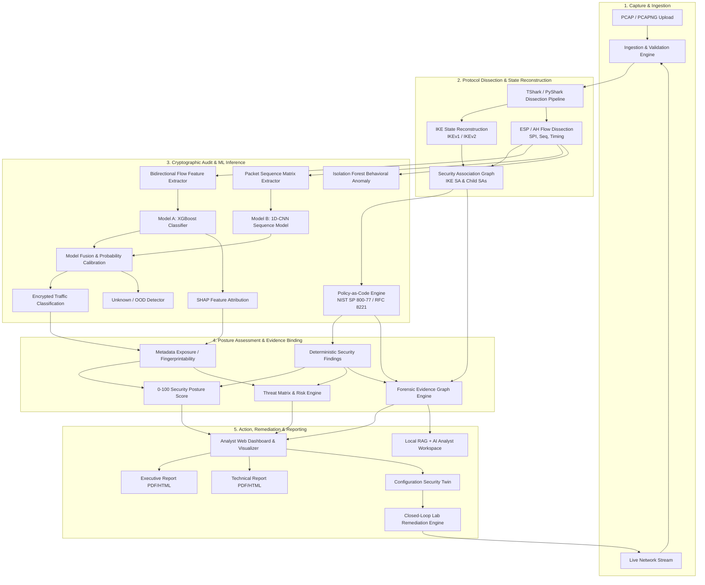
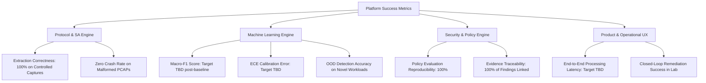
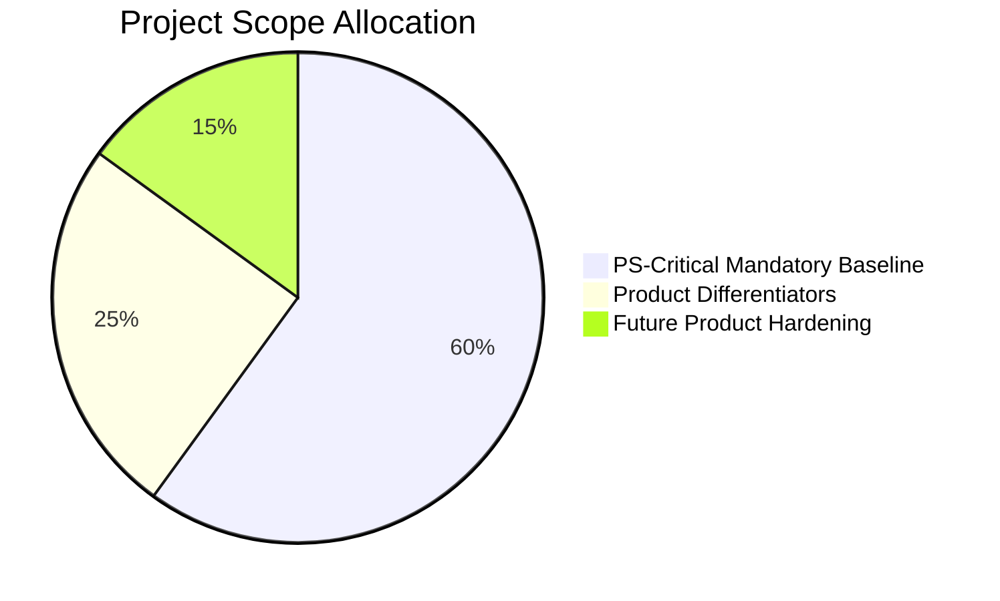

# Product Requirements Document (PRD)

**Document Reference:** PRD-SIH2026-PS160-001  
**Project Identifier:** SIH 2026 / Problem Statement ID: 26160 (PS 160)  
**Product Working Title:** TunnelTrace AI  
**Authoring Authority:** Product Architecture & Security Engineering Team  
**Target Organization / Problem Owner:** National Technical Research Organisation (NTRO)  
**Security Classification:** Controlled Technical Documentation (SIH Engineering Baseline)  

---

## 1. Document Control

| Property | Value |
| :--- | :--- |
| **Document Identifier** | `PRD-SIH2026-PS160-CORE-V1` |
| **Current Status** | Working Baseline / Under Review |
| **Document Owner** | Product Management & Cybersecurity Architecture Group |
| **Technical Reviewers** | IPsec Protocol Engineering Lead, Applied ML Lead, SOC Systems Architect |
| **Approval Authority** | SIH Technical Project Directorate |
| **Baseline Target Date** | Academic / Competition Cycle 2026 |
| **Target Implementation** | TunnelTrace AI Prototype & Security Intelligence Framework |

---

## 2. Revision History

| Version | Date | Author / Role | Summary of Changes |
| :--- | :--- | :--- | :--- |
| `0.1.0` | 2026-09-22 | Lead Product Architect | Initial structural outline and requirements decomposition from official NTRO PS 26160 text. |
| `0.2.0` | 2026-09-22 | IPsec Domain Specialist | Defined stateful IKE/ESP protocol parsing hierarchy, SA reconstruction, and evidence state models. |
| `0.3.0` | 2026-09-22 | Applied ML Engineer | Integrated XGBoost, 1D-CNN, calibrated confidence, OOD, and SHAP explainability boundaries. |
| `0.4.0` | 2026-09-22 | Security Engine Lead | Formalized Policy-as-Code engine, evidence graph, threat matrix, and closed-loop lab remediation workflow. |
| `1.0.0` | 2026-09-22 | Core Architecture Team | Consolidated master 60-section industry-grade PRD baseline under zero-hallucination mandate. |

---

## 3. Purpose of the PRD

This Product Requirements Document (PRD) establishes the definitive, binding technical and functional requirements for **TunnelTrace AI**, an **IPsec Security Intelligence Platform** developed for Problem Statement 26160 at Smart India Hackathon 2026. 

This document serves as the single source of truth across product management, network engineering, machine learning, application development, and security audit teams. It details the operational context, user personas, end-to-end user journeys, functional specifications, non-functional guardrails, algorithmic evaluation baselines, and traceability to the official problem statement issued by the National Technical Research Organisation (NTRO).

---

## 4. Project Identification

* **Competition Program:** Smart India Hackathon (SIH) 2026
* **Problem Statement ID:** `26160` (Internal shorthand: `PS 160`)
* **Official Problem Statement Title:** *AI-Powered IPsec VPN Protocol Analyzer and Security Assessment Framework*
* **Sponsoring / Proposing Organization:** National Technical Research Organisation (NTRO)
* **Domain / Theme:** Blockchain & Cybersecurity
* **Category:** Software
* **Official Product Name:** **TunnelTrace AI**

---

## 5. Official Problem Statement Summary

The official NTRO problem statement stipulates:
1. **Background:** IPsec is a cornerstone technology for securing enterprise, government, and defense communications across untrusted networks. However, security posture degrades rapidly due to protocol misconfigurations, weak or deprecated cipher suites, improper key lifetimes, deficient Diffie-Hellman groups, lack of forward secrecy, and implementation oversights. Manual packet-level inspection using conventional packet sniffers requires specialized cryptographic domain knowledge and does not scale.
2. **Mandate:** Design and build an intelligent, automated framework capable of:
   * Generating an automated, multi-configuration IPsec VPN testbed.
   * Ingesting offline packet captures (PCAP/PCAPNG) and live network streams.
   * Deterministically identifying IPsec protocol characteristics, IKE versions, operating modes, and cryptographic parameters.
   * Employing artificial intelligence to perform encrypted traffic inference (predicting encapsulated traffic classes inside ESP without decryption).
   * Evaluating cryptographic strength, configuration compliance, and metadata exposure.
   * Generating comprehensive security scores, threat matrices, risk assessments, executive reports, and technical reports.

---

## 6. Problem Definition

### 6.1 The Operational Bottleneck
Security Operations Centers (SOCs), technical intelligence analysts, and network administrators face severe challenges when auditing IPsec deployments:
* **The "Black Box" Illusion:** Encrypted IPsec tunnels (ESP) are treated as opaque pipes. Analysts cannot inspect whether the encapsulated traffic conforms to operational security policies without terminating or proxying the connection, which is frequently impermissible or unfeasible.
* **Passive Misconfiguration Risks:** Legacy or dangerous configurations (e.g., DES/3DES, single DES, MD5, SHA-1, small Diffie-Hellman groups, disabled Perfect Forward Secrecy) persist undetected in production gateways because traffic continues to pass uninterrupted.
* **Tooling Fragmentation:** General-purpose tools (e.g., standard Wireshark or tcpdump) provide raw byte-level visibility but lack stateful IKE exchange reconstruction, automated policy-based cryptographic strength grading, and intelligent metadata side-channel analysis.
* **Lack of Closed-Loop Remediation:** Existing diagnostic utilities highlight errors but fail to provide validated, configuration-level remediation scripts or mechanisms to prove that a proposed fix resolves the risk without breaking connectivity.

---

## 7. Product Vision

To establish **TunnelTrace AI** as the premier, zero-trust IPsec Security Intelligence Platform that empowers defense, enterprise, and intelligence analysts to automatically audit, classify, explain, and harden IPsec VPN infrastructure through an evidence-backed fusion of deterministic protocol intelligence and explainable machine learning.

---

## 8. Product Mission

Deliver a modular, privacy-conscious, local-first platform that ingests IPsec network streams or packet captures, reconstructs protocol and Security Association states, infers inner traffic patterns solely from outer metadata side channels, audits deployments against authoritative cryptographic standards via Policy-as-Code, and delivers end-to-end verified remediation workflows.

---

## 9. Product Positioning

**TunnelTrace AI** is **NOT** an "AI Wireshark" and does **NOT** attempt brute-force packet sniffing or arbitrary ESP decryption.

| Dimension | Conventional Packet Dissectors (Wireshark, tcpdump) | Traditional Network IDS/IPS (Suricata, Snort) | TunnelTrace AI IPsec Security Intelligence Platform |
| :--- | :--- | :--- | :--- |
| **Primary Scope** | Raw protocol dissection and packet display | Signature-based deep packet inspection / threat detection | Stateful IPsec configuration audit, cryptanalysis posture, and encrypted traffic inference |
| **Cryptographic Assessment** | Manual user interpretation of transform payloads | Flags known exploit signatures / cleartext indicators | Automated Policy-as-Code audit against NIST/RFC cryptographic standards |
| **Encrypted ESP Insight** | Zero insight into payload type without private keys | Ignores inner traffic or requires TLS/IPsec termination | Metadata-only side-channel ML inference (traffic classification without decryption) |
| **Evidence Traceability** | Packet hex dumps | Alert logs | Explicit evidence graph: Packet $\to$ Field $\to$ SA $\to$ Policy Rule $\to$ Finding |
| **Remediation** | None | Network block / drop rules | Configuration Security Twin & closed-loop testbed validation |

---

## 10. Product Principles

1. **Zero Hallucination & Evidence Fidelity:** Passive network traffic analysis cannot prove unobservable parameters. Observable protocol properties must be extracted deterministically. Inferences must be tagged with explicit evidence states (`VERIFIED`, `INFERRED`, `UNKNOWN`, `MISCONFIGURATION OBSERVED`).
2. **No Payload Decryption:** The platform strictly respects cryptographic boundaries. It extracts intelligence from outer protocol headers, IKE exchanges, and ESP metadata (timing, packet size, burstiness) without breaking encryption.
3. **Deterministic First, ML Second:** Protocol fields, transforms, SPIs, and exchange types are parsed deterministically. Machine learning is reserved strictly for tasks where deterministic logic is fundamentally insufficient (e.g., encrypted payload behavioral inference).
4. **Explainable AI (XAI):** Black-box predictions are unacceptable in SOC and defense contexts. Every ML inference must provide calibrated confidence and feature attribution (e.g., SHAP).
5. **Deterministic Security Policies:** Security posture and risk findings originate from versioned Policy-as-Code definitions mapped to authoritative standards, never from generative LLM speculation.
6. **Closed-Loop Verification:** Security identification must be actionable. The product follows the loop:  
   $$\text{DETECT} \to \text{RECONSTRUCT} \to \text{INFER} \to \text{ASSESS} \to \text{EXPLAIN} \to \text{REMEDIATE} \to \text{RE-TEST} \to \text{VERIFY}$$
7. **Privacy-First & Local-First:** All packet processing, feature extraction, and ML inference occur locally. Raw capture payloads are never transmitted to external APIs or cloud LLMs.

---

## 11. Goals

1. **Automated Testbed Orchestration:** Provide a programmatic, reproducible Linux/strongSwan testbed generating multi-configuration IPsec tunnels (Tunnel/Transport, AES variants, DH groups, PFS ON/OFF, IPv4/IPv6) with diverse synthetic application workloads.
2. **Dual-Mode Ingestion:** Support ingestion of offline PCAP/PCAPNG captures and live network streams on designated interfaces.
3. **Stateful Protocol & SA Reconstruction:** Deterministically reconstruct IKEv1/IKEv2 handshakes, extract cryptographic transforms, map SPI pairs, and track Security Association (IKE SA and Child SA) lifecycles.
4. **Encrypted Traffic Inference:** Deploy a hybrid ML pipeline (XGBoost flow statistics + 1D-CNN temporal sequence modeling) to categorize encrypted ESP traffic into primary application classes without decryption.
5. **Calibrated Confidence & OOD Awareness:** Ensure the ML engine distinguishes between high-confidence known workloads and Unknown/Out-of-Distribution (OOD) traffic patterns.
6. **Policy-as-Code Cryptographic Audit:** Audit reconstructed configurations against versioned security policies rooted in authoritative guidelines (NIST SP 800-77 Rev. 1, RFC 8221, RFC 8247, RFC 7296).
7. **Quantitative Security Scoring & Threat Matrix:** Produce an interpretable 0–100 Security Posture Score, an itemized Threat Matrix, and a Metadata Fingerprintability Index.
8. **Forensic Traceability:** Maintain an unbroken evidence chain linking every security finding back to specific packet numbers, byte offsets, and transform attributes.
9. **Configuration Security Twin & Remediation:** Simulate the security impact of proposed configuration changes and validate them automatically in a controlled testbed environment.
10. **Dual-Tier Reporting & Grounded AI Assistance:** Generate formal Executive (CISO/Management) and Technical (Analyst/Engineer) reports, complemented by a local, retrieval-grounded AI Analyst interface.

---

## 12. Non-Goals

1. **Building a New IPsec Daemon:** The project does not implement a custom IPsec/IKE protocol stack. It interfaces with and audits standard stacks (primarily strongSwan).
2. **Payload Decryption:** The platform does not break, crack, or decrypt ESP cryptographic payloads.
3. **Intrusive Cleartext Inspection:** The platform does not inspect plaintext application payloads of encrypted services (e.g., reading WhatsApp messages or HTTPS content).
4. **Fine-Grained Application Guessing Without Evidence:** The system does not claim to distinguish specific proprietary services (e.g., identifying "WhatsApp voice" vs generic VoIP) without controlled, empirically validated training traces.
5. **Full Enterprise IDS/IPS Replacement:** The platform does not replace general-purpose signature-based or deep-packet-inspection network intrusion systems (e.g., Snort/Suricata).
6. **Zero-Day Exploit Detection:** The behavioral anomaly module detects statistical deviations in VPN traffic; it does not claim to catch all arbitrary zero-day exploits.
7. **Automated Modification of Production Gateways:** The platform does not directly apply configuration changes to live, unvalidated third-party enterprise hardware (e.g., Cisco, Fortinet, Palo Alto) without explicit user oversight and manual staging.
8. **Native Mobile/Desktop Binary Compilation:** The platform does not deliver native compiled binaries for iOS, Android, or macOS desktop; it provides a unified, responsive Web Application with PWA capabilities.
9. **In-Browser Packet Capture:** Web browsers cannot execute root-level raw socket sniffing or packet capture utilities; all capture and dissection tasks remain strictly backend/worker services.

---

## 13. Target Users / Personas

### 13.1 Primary Persona: IPsec / Cybersecurity Analyst (SOC Tier 2 / Tier 3)
* **Role & Context:** Works in an enterprise SOC, MSSP, or government/defense cyber operations center monitoring perimeter and inter-site VPN gateways.
* **Responsibilities:** Investigates suspicious encrypted tunnels, audits gateway security compliance, triages configuration weaknesses, and assesses communication integrity.
* **Pain Points:** Overwhelmed by massive PCAP files; lacks time for manual packet-by-packet IKE dissection; cannot determine what type of traffic is flowing through an encrypted tunnel without intrusive endpoints.
* **Product Interaction:** Uses the Command Center, Protocol Intelligence, Encrypted Traffic Explorer, Threat Matrix, and Evidence Explorer for daily investigative workflows.

### 13.2 Secondary Persona: Network & VPN Security Engineer *(Product-Derived)*
* **Role & Context:** Responsible for designing, deploying, and maintaining enterprise site-to-site and remote-access IPsec VPN architectures.
* **Responsibilities:** Configures strongSwan, Cisco, or Fortinet endpoints; manages cipher suite migration; enforces PFS and key rekeying schedules.
* **Pain Points:** Unclear whether new configurations break legacy clients; lacks automated pre-deployment validation tools; fears misconfigurations causing tunnel downtime.
* **Product Interaction:** Utilizes the Configuration Security Twin, Remediation Engine, and Technical Report generator to test and harden VPN definitions.

### 13.3 Secondary Persona: Security Auditor / Compliance Officer *(Product-Derived)*
* **Role & Context:** Internal audit or third-party compliance assessor evaluating network defenses against regulatory frameworks (e.g., NIST SP 800-77, ISO 27001).
* **Responsibilities:** Verifies that deprecated ciphers (3DES, MD5) are purged from active infrastructure; documents security posture for executive leadership.
* **Pain Points:** Discrepancy between stated configuration documentation and actual wire traffic; lack of defensible, automated compliance scoring.
* **Product Interaction:** Relies on the Compliance Engine, Security Score breakdown, and Executive Report export.

### 13.4 Operational Role: Testbed Operator / Research Engineer *(Internal/Lab Role)*
* **Role & Context:** Research scientist or testbed operator validating ML models and cryptographic test matrices.
* **Responsibilities:** Orchestrates synthetic traffic generation, executes automated testbed matrix sweeps, labels ground-truth datasets, and trains ML models.
* **Pain Points:** Tedious manual generation of diverse IPsec configurations; difficulty synchronizing plaintext workload logs with corresponding ESP packet captures.
* **Product Interaction:** Operates the Testbed Orchestration module, Dataset Export tools, and Model Evaluation harnesses.

---

## 14. User Problems / Pain Points

| ID | User Group | Problem Statement | Operational Consequence |
| :--- | :--- | :--- | :--- |
| **UP-01** | Analyst / SOC | Passive packet captures provide zero visibility into the nature of ESP encrypted payloads. | Inability to detect unauthorized data exfiltration (e.g., bulk file transfers disguised over authorized VPN tunnels). |
| **UP-02** | Security Engineer | Identifying weak ciphers across dozens of active tunnels requires manual inspection of IKE proposals in Wireshark. | Deprecated algorithms (e.g., 3DES, DH Group 2) remain active for years undetected, exposing organizations to passive eavesdropping. |
| **UP-03** | Auditor | Static config files do not prove that negotiated wire traffic matches documented security baselines. | Compliance gaps discovered only post-breach or during high-penalty external regulatory audits. |
| **UP-04** | All Users | Black-box AI tools output probabilistic labels without explaining feature rationale or evidence sources. | Analysts reject AI findings due to lack of explainability, trust, and auditability in high-stakes defense environments. |
| **UP-05** | Network Engineer | Hardening recommendations lack an automated validation loop, creating fear of network outage. | Security patches and cipher upgrades are indefinitely postponed due to operational fragility. |

---

## 15. Product Value Proposition

**TunnelTrace AI** transforms raw, unmanageable network captures into structured, actionable cryptographic intelligence:
* **Radical Acceleration:** Reduces IPsec audit and analysis time from hours of expert manual dissection to seconds of automated processing.
* **Metadata-Only Foresight:** Provides high-fidelity behavioral classification of encrypted payloads without breaking encryption, preserving end-to-end privacy and confidentiality.
* **Cryptographic Rigor:** Replaces subjective human assessments with deterministic, versioned Policy-as-Code checks mapped directly to NIST and IETF RFC standards.
* **Unbroken Traceability:** Backs every finding with an auditable evidence chain linking the executive summary directly to packet-level bytes.
* **Risk-Free Hardening:** Closes the gap between diagnosis and remediation via the Configuration Security Twin and closed-loop testbed validation.

---

## 16. Solution Overview

**TunnelTrace AI** is architected as an integrated software suite comprising:
1. **Automated Testbed Engine:** Docker- and Linux namespace-based orchestration layer driving strongSwan to simulate diverse IPsec configurations, cryptographic suites, and network impairment profiles.
2. **Ingestion & Protocol Dissection Pipeline:** High-performance capture module (tcpdump, TShark/PyShark, Scapy) extracting structured IKE handshakes, ESP parameters, and metadata streams.
3. **Dual-Model ML Inference Engine:** XGBoost statistical flow classifier fused with a lightweight 1D-CNN temporal sequence model, complemented by temperature-scaled calibration, OOD detection, and SHAP feature attribution.
4. **Behavioral Anomaly Detector:** Unsupervised Isolation Forest tracking volumetric, temporal, and SA state anomalies across active tunnels.
5. **Policy-as-Code Security Assessment Engine:** Deterministic rule evaluation evaluating parsed evidence against customizable YAML-defined policy profiles.
6. **Remediation & Configuration Twin:** Automated synthesis of hardened configuration files and closed-loop lab validation.
7. **Local AI Analyst (RAG):** Privacy-preserving contextual assistant powered by PostgreSQL + pgvector to explain findings and standards.
8. **Modern Responsive Web Application:** Responsive Next.js frontend delivering desktop SOC workspaces, tablet analytics, and mobile PWA monitoring.

---

## 17. End-to-End Product Concept



---

## 18. Scope

### 18.1 In-Scope (SIH Baseline Prototype)
* Full support for IKEv1 and IKEv2 protocol dissection.
* Operational mode detection (Tunnel Mode vs. Transport Mode).
* Automated extraction of cryptographic algorithms (AES-128, AES-256, AES-GCM, AES-CBC + HMAC, 3DES, DES where present).
* Extraction and evaluation of Diffie-Hellman groups and Perfect Forward Secrecy (PFS) states.
* Verification of IPv4 and IPv6 encapsulation.
* Encrypted payload classification across core workload classes: Web, Video Streaming, VoIP, Chat / Messaging, Email, ICMP, File Transfer, and Unknown / OOD.
* Policy-as-Code security audits against NIST SP 800-77 Rev. 1, RFC 8221, RFC 8247, and RFC 7296.
* Interpretable Security Posture Score (0–100), Risk Score, and Threat Matrix.
* Metricized Metadata Fingerprintability Index.
* Closed-loop remediation validation against a controlled strongSwan testbed.
* Privacy-first, local RAG architecture for conversational analyst queries.
* Responsive desktop, tablet, and mobile PWA application interface.

### 18.2 Out-of-Scope (Non-Goals / Post-Prototype Roadmap)
* Automatic pushing of remediation configurations to unvalidated commercial hardware (e.g., Cisco ASA, Palo Alto PAN-OS, FortiOS).
* Cryptographic brute-forcing or cracking of intercepted ESP ciphertext.
* Decryption or deep-packet-inspection of end-to-end encrypted messaging content (e.g., WhatsApp TLS/Signal protocol payload).
* Full network-wide intrusion detection replacement (e.g., Snort/Suricata drop-in replacement).
* Proprietary hardware acceleration (e.g., FPGA, custom ASIC capture cards).
* Formal Common Criteria or FIPS 140-3 government security certifications.

---

## 19. PS Requirement Breakdown

| PS Pillar | Official NTRO PS 26160 Requirement | Architectural Realization in TunnelTrace AI | PRD Traceability |
| :--- | :--- | :--- | :--- |
| **Pillar A** | **VPN Testbed Generation:** Multi-configuration lab supporting Tunnel/Transport, AES variants, DH groups, PFS ON/OFF, IPv4/IPv6, and diverse traffic (VoIP, WhatsApp/chat, Email, Web, ICMP, Video). | Docker/Linux namespace testbed running strongSwan, `tc/netem` network simulation, and automated synthetic workload orchestrators. | Section 24 (`LAB-REQ`) |
| **Pillar B** | **Traffic Capture:** Ingestion of PCAP/PCAPNG and live network streams capturing IKE negotiation, ESP, optional AH, and baseline traffic. | Dual-mode ingestion pipeline utilizing `libpcap`, `tcpdump`, and PyShark/TShark dissectors with packet-level validation. | Section 25 (`CAP-REQ`) |
| **Pillar C** | **AI-Based Protocol Identification:** Identify IPsec protocol, IKE version, Tunnel/Transport mode, cipher suite, DH group, SA characteristics, and predict traffic inside ESP. | Hybrid engine: Deterministic stateful parsing for observable protocol/SA fields; ML classification solely for inner ESP payload inference. | Section 26 (`PROTO-REQ`), Section 27 (`SA-REQ`), Section 28 (`ML-REQ`) |
| **Pillar D** | **Security Assessment:** Evaluate cryptographic strength, configuration compliance, SA parameters, key lifetime, replay protection, PFS, and metadata exposure. | Python + YAML Policy-as-Code engine auditing parsed evidence against versioned NIST/RFC rules; Metadata Fingerprintability Index. | Section 32 (`SEC-REQ`), Section 33 (`COMP-REQ`), Section 36 (`META-REQ`) |
| **Pillar E** | **Outputs & Deliverables:** Comprehensive security score, traffic analysis, metadata inference, Executive & Technical Reports, Risk Score, Threat Matrix, AI Confidence Score. | Quantitative 0–100 scoring model, Threat Matrix table, dual-tier PDF/HTML report generators, calibrated confidence scoring, and interactive web dashboard. | Section 34 (`RISK-REQ`), Section 35 (`THREAT-REQ`), Section 40 (`RPT-REQ`), Section 44 (`UI-REQ`) |

---

## 20. Product Modules


---

## 21. Primary User Journeys

### 21.1 Journey 1: Post-Incident Forensic Capture Audit (SOC Analyst)
1. **Ingest:** Analyst uploads a 500 MB PCAPNG file captured from an edge VPN router via the web UI.
2. **Digest:** System extracts IKE negotiations and ESP flows, displaying a summary card within seconds.
3. **Inspect:** Protocol Intelligence identifies IKEv1 Main Mode utilizing 3DES-CBC, HMAC-SHA1, and Diffie-Hellman Group 2.
4. **Evaluate:** Security Assessment engine generates Critical findings mapped to NIST SP 800-77 Rev. 1 deprecations. Security Score calculates at a low baseline.
5. **Classify:** Encrypted Traffic Intelligence classifies heavy encapsulated ESP streams as File Transfer (high confidence) mixed with VoIP traffic.
6. **Trace:** Analyst clicks on the Critical 3DES finding; Evidence Explorer displays the exact IKE SA proposal packet, hex payload, and transform attribute.
7. **Report:** Analyst generates a signed Technical Report and an Executive Summary PDF for management briefing.

### 21.2 Journey 2: Pre-Deployment Gateway Hardening & What-If Simulation (Security Engineer)
1. **Configure:** Engineer selects an existing strongSwan configuration file representing a proposed data center tunnel.
2. **Simulate:** Engineer inputs the file into the Configuration Security Twin.
3. **Compare:** Twin models projected compliance against the *Enterprise Strict* policy profile, highlighting that disabling PFS will drop the posture score.
4. **Remediate:** Engineer adjusts configuration to enforce AES-256-GCM and DH Group 19 (Curve25519) with mandatory PFS.
5. **Test in Lab:** Engineer triggers closed-loop validation; the testbed spins up strongSwan instances, negotiates the tunnel, injects test traffic, and verifies zero security regressions.

---

## 22. Golden End-to-End Workflow

The flagship operational workflow of **TunnelTrace AI** embodies the complete continuous improvement lifecycle:

$$\begin{aligned}
\text{Step 1} &\longrightarrow \text{Ingest PCAP/PCAPNG or stream live traffic from edge gateway.} \\
\text{Step 2} &\longrightarrow \text{Validate capture integrity (compute SHA-256 checksum, check headers).} \\
\text{Step 3} &\longrightarrow \text{Filter and isolate IKE (UDP 500/4500) and IPsec (ESP proto 50 / AH proto 51) traffic.} \\
\text{Step 4} &\longrightarrow \text{Deterministically reconstruct IKE exchanges (IKEv1 Phase 1/2 or IKEv2 SA\_INIT/IKE\_AUTH).} \\
\text{Step 5} &\longrightarrow \text{Extract cryptographic transforms (cipher, key length, integrity, PRF, DH group).} \\
\text{Step 6} &\longrightarrow \text{Reconstruct Security Associations (IKE SA, Child SAs, inbound/outbound SPI pairs).} \\
\text{Step 7} &\longrightarrow \text{Correlate ESP flows with reconstructed SAs; track sequence numbers and byte volumes.} \\
\text{Step 8} &\longrightarrow \text{Extract bidirectional statistical flow features and packet-sequence matrices.} \\
\text{Step 9} &\longrightarrow \text{Execute ML inference: XGBoost (flow stats) + 1D-CNN (packet sequence temporal dynamics).} \\
\text{Step 10} &\longrightarrow \text{Fuse predictions, apply Temperature Scaling, and evaluate predictive entropy.} \\
\text{Step 11} &\longrightarrow \text{Assign traffic class or flag as UNKNOWN / OUT-OF-DISTRIBUTION.} \\
\text{Step 12} &\longrightarrow \text{Calculate SHAP feature attributions explaining the classified flow behavior.} \\
\text{Step 13} &\longrightarrow \text{Evaluate Isolation Forest for behavioral volumetric or timing anomalies.} \\
\text{Step 14} &\longrightarrow \text{Execute YAML Policy-as-Code rules against reconstructed protocol evidence.} \\
\text{Step 15} &\longrightarrow \text{Assign evidence states (VERIFIED, INFERRED, UNKNOWN, MISCONFIGURATION OBSERVED).} \\
\text{Step 16} &\longrightarrow \text{Generate quantitative 0–100 Security Posture Score, Risk Score, and Threat Matrix.} \\
\text{Step 17} &\longrightarrow \text{Compute Metadata Fingerprintability Index indicating side-channel leakage risk.} \\
\text{Step 18} &\longrightarrow \text{Build auditable Evidence Graph connecting findings to exact packets and standards.} \\
\text{Step 19} &\longrightarrow \text{Synthesize standards-compliant configuration remediation recipes.} \\
\text{Step 20} &\longrightarrow \text{Project impact in Configuration Security Twin (Current vs. Proposed Hardened).} \\
\text{Step 21} &\longrightarrow \text{Deploy proposed configuration into controlled strongSwan testbed.} \\
\text{Step 22} &\longrightarrow \text{Re-establish tunnel, inject synthetic workloads, and recapture live traffic.} \\
\text{Step 23} &\longrightarrow \text{Re-analyze newly captured traffic through the core engine.} \\
\text{Step 24} &\longrightarrow \text{Verify remediation success and confirm resolution of prior security findings.} \\
\text{Step 25} &\longrightarrow \text{Generate auditable Executive Report and Technical Report artifacts.} \\
\text{Step 26} &\longrightarrow \text{Enable analyst exploration via privacy-first local RAG AI Analyst interface.}
\end{aligned}$$

---

## 23. Functional Requirements Overview

Requirements are categorized using authoritative operational prefixes:
* `LAB-`: Automated Testbed Generation
* `CAP-`: Traffic Capture & Ingestion
* `PROTO-`: Protocol Intelligence & Dissection
* `SA-`: Security Association Management
* `FLOW-`: Flow Aggregation & Feature Extraction
* `ML-`: Encrypted Traffic Machine Learning
* `OOD-`: Out-of-Distribution & Confidence Calibration
* `XAI-`: Explainable AI & Feature Attribution
* `ANOM-`: Behavioral Anomaly Detection
* `SEC-`: Security Assessment & Policy Engine
* `COMP-`: Compliance Auditing
* `RISK-`: Security Scoring & Risk Modeling
* `THREAT-`: Threat Matrix Generation
* `META-`: Metadata Fingerprintability & Exposure
* `EVID-`: Evidence Graph & Audit Traceability
* `TWIN-`: Configuration Security Twin
* `REM-`: Closed-Loop Remediation & Verification
* `RPT-`: Executive & Technical Reporting
* `AI-`: Privacy-First AI Analyst (RAG)
* `UI-`: Responsive & PWA Experience
* `AUDIT-`: System Audit & Provenance

---

## 24. Testbed Requirements

| Field | Specification |
| :--- | :--- |
| **Requirement ID** | `LAB-REQ-001` |
| **Requirement Name** | Automated Multi-Configuration IPsec Testbed Orchestration |
| **Description** | The platform must provide an automated orchestration environment capable of provisioning isolated network topologies running strongSwan endpoints to generate ground-truth IPsec traffic across diverse cryptographic matrices. |
| **Primary Actor** | Testbed Operator / Research Engineer |
| **Trigger** | Execution of testbed build script or UI testbed sweep command. |
| **Preconditions** | Host Linux environment with Docker, root/sudo permissions, and Linux bridge capabilities. |
| **Inputs** | JSON/YAML test matrix definition specifying ciphers, modes, DH groups, IP versions, and traffic profiles. |
| **System Behavior** | 1. Provisions isolated network namespaces or lightweight containers.<br>2. Generates strongSwan configuration files (`ipsec.conf` or `swanctl.conf`).<br>3. Configures tunnel endpoints with specified parameters.<br>4. Establishes IKEv1 or IKEv2 tunnels.<br>5. Injects synthetic workloads via isolated traffic endpoints.<br>6. Captures dual-sided packet traces (plaintext workload and outer encrypted ESP). |
| **Outputs** | Dual-sided synchronized PCAP files, ground-truth session metadata JSON files. |
| **Failure / Unknown** | If strongSwan fails to negotiate (e.g., proposal mismatch), the system captures the failure log, marks the matrix cell as `NEGOTIATION_FAILED`, and halts capture. |
| **Acceptance Criteria** | Successfully establishes and captures tunnels for at least: Tunnel/Transport mode, AES-128/256-CBC, AES-128/256-GCM, DH Groups (14, 19, 20), PFS enabled/disabled, over both IPv4 and IPv6. |
| **Priority** | Critical (PS Core Requirement Pillar A) |
| **PS Traceability** | Pillar A: VPN Testbed Generation |
| **Dependencies** | Linux Kernel, strongSwan, Docker, `iproute2`. |

| Field | Specification |
| :--- | :--- |
| **Requirement ID** | `LAB-REQ-002` |
| **Requirement Name** | Multi-Workload Synthetic Traffic Injection |
| **Description** | The testbed must inject distinct application traffic workloads through established tunnels to generate realistic payload dynamics for ML training and evaluation. |
| **Primary Actor** | Testbed Operator |
| **Trigger** | Invocation of traffic generation cycle post-tunnel establishment. |
| **Preconditions** | Active IPsec tunnel passing bidirectional traffic. |
| **Inputs** | Selected workload profile: VoIP, Chat / Messaging, Email, Web, ICMP, Video Streaming, File Transfer. |
| **System Behavior** | Generates representative traffic using standard protocol generators: SIP/RTP simulation for VoIP, periodic burst messaging for Chat, SMTP/IMAP transactions for Email, HTTP/1.1 and HTTP/2 GET/POST flows for Web, echo requests for ICMP, DASH/RTSP streaming for Video, and bulk TCP transfers for File Transfer. |
| **Outputs** | Timestamped traffic generation log containing flow ground-truth labels. |
| **Failure / Unknown** | If an injection tool fails, the session is discarded, logged, and re-executed. |
| **Acceptance Criteria** | Generates verified packet streams across all 7 target workload classes through active IPsec tunnels. *Note: Chat is strictly labeled as "Chat / Messaging"; synthetic traffic must never be misrepresented as proprietary WhatsApp traffic.* |
| **Priority** | High |
| **PS Traceability** | Pillar A: Traffic Workloads (VoIP, WhatsApp/Chat, E-mail, Web, ICMP, Video) |
| **Dependencies** | `iperf3`, `curl`, `hping3`, standard Linux networking utilities. |

| Field | Specification |
| :--- | :--- |
| **Requirement ID** | `LAB-REQ-003` |
| **Requirement Name** | Network Impairment & Channel Simulation |
| **Description** | The testbed must simulate real-world WAN network conditions (latency, jitter, packet loss, bandwidth throttling, MTU constraints) during traffic generation to evaluate model robustness. |
| **Primary Actor** | Testbed Operator |
| **Trigger** | Inclusion of impairment profile in test matrix. |
| **Preconditions** | Active Linux bridge or virtual ethernet pair connecting tunnel endpoints. |
| **Inputs** | Impairment parameters: delay (ms), jitter (ms), loss rate (%), rate limit (Mbps), MTU size (bytes). |
| **System Behavior** | Applies Linux traffic control (`tc` / `netem`) rules to the intermediate network namespace interface prior to workload generation. |
| **Outputs** | Logged channel condition metadata associated with resulting capture session. |
| **Failure / Unknown** | Reverts `tc` rules automatically upon script termination or error. |
| **Acceptance Criteria** | Demonstrates measured latency variations (e.g., 20ms–200ms) and packet loss (e.g., 1%–5%) reflected in outer ESP capture timings. |
| **Priority** | Medium (Product Differentiator) |
| **PS Traceability** | Pillar A & Pillar C: Robustness across network variations. |
| **Dependencies** | Linux `iproute2` / `tc` netem module. |

---

## 25. Capture/Ingestion Requirements

| Field | Specification |
| :--- | :--- |
| **Requirement ID** | `CAP-REQ-001` |
| **Requirement Name** | Offline PCAP / PCAPNG Ingestion and Validation |
| **Description** | The platform must ingest offline packet captures in standard libpcap (`.pcap`) and PCAP Next Generation (`.pcapng`) formats, validating file integrity, magic bytes, and capture metadata. |
| **Primary Actor** | IPsec / Cybersecurity Analyst |
| **Trigger** | User uploads a capture file via Web UI or submits a path via CLI/API. |
| **Preconditions** | User authenticated; capture file accessible on storage. |
| **Inputs** | Raw capture binary file (max size: *TBD — target to be benchmarked*). |
| **System Behavior** | 1. Verifies file format and magic headers (`0xa1b2c3d4`, `0x0a0d0d0a`).<br>2. Computes and indexes SHA-256 cryptographic hash.<br>3. Inspects capture interfaces, link-layer types, and timestamp resolutions.<br>4. Spools file to secure local worker storage. |
| **Outputs** | Ingestion status object, file SHA-256, packet count, capture duration, session token. |
| **Failure / Unknown** | Rejects malformed or corrupted files with explicit error: `ERR_INVALID_PCAP_FORMAT`. |
| **Acceptance Criteria** | Correctly parses both standard PCAP and PCAPNG files without memory exhaustion; preserves original capture timestamps with microsecond precision. |
| **Priority** | Critical (PS Core Requirement Pillar B) |
| **PS Traceability** | Pillar B: Traffic Capture (Offline PCAP/PCAPNG) |
| **Dependencies** | FastAPI file handler, PyShark/TShark, Python `hashlib`. |

| Field | Specification |
| :--- | :--- |
| **Requirement ID** | `CAP-REQ-002` |
| **Requirement Name** | Live Network Stream Ingestion |
| **Description** | The platform must support live packet capture from designated host network interfaces, processing streaming IPsec packets with minimal buffer drop rates. |
| **Primary Actor** | IPsec / Cybersecurity Analyst |
| **Trigger** | Analyst selects an active network interface and initiates "Live Capture" in UI. |
| **Preconditions** | Backend worker process possesses necessary network capture capabilities (`CAP_NET_RAW`, `CAP_NET_ADMIN`). |
| **Inputs** | Interface name (e.g., `eth0`), optional BPF filter string (`udp port 500 or udp port 4500 or ip proto 50 or ip proto 51`). |
| **System Behavior** | Attaches a `libpcap` / `tcpdump` subprocess emitting packet streams to a FIFO pipe; streams packets into the parsing pipeline in micro-batches; transmits real-time telemetry over WebSockets. |
| **Outputs** | Live packet stream, sliding-window flow statistics, real-time UI event feed. |
| **Failure / Unknown** | If interface is down or permissions are insufficient, raises `ERR_CAPTURE_PERMISSION_DENIED` and terminates gracefully without crashing backend. |
| **Acceptance Criteria** | Successfully captures and processes live IKE handshakes and ESP streams on a local interface without unhandled queue overflows. |
| **Priority** | High (PS Core Requirement Pillar B) |
| **PS Traceability** | Pillar B: Traffic Capture (Live Network Streams) |
| **Dependencies** | `libpcap`, `tcpdump`, Python async pipes, WebSockets. |

| Field | Specification |
| :--- | :--- |
| **Requirement ID** | `CAP-REQ-003` |
| **Requirement Name** | IPsec Protocol Filtering and Segmentation |
| **Description** | The ingestion pipeline must isolate IPsec-relevant traffic from background noise (e.g., standard DNS, ARP, SSH) to optimize downstream parsing efficiency. |
| **Primary Actor** | Automated Parsing Pipeline |
| **Trigger** | Ingestion of raw packet buffer. |
| **Preconditions** | Valid packet stream established. |
| **Inputs** | Raw packet frame. |
| **System Behavior** | Evaluates link and network layer headers: identifies IKE traffic (UDP 500, UDP 4500 NAT-T), ESP traffic (IP Protocol 50), and AH traffic (IP Protocol 51). Segregates unrelated packets into a secondary non-IPsec counter. |
| **Outputs** | Filtered IPsec packet channel, background traffic summary statistics. |
| **Failure / Unknown** | If zero IPsec packets exist in the capture, emits status `NO_IPSEC_TRAFFIC_DETECTED` and halts analysis pipeline safely. |
| **Acceptance Criteria** | Zero false-negative drops of standard IKE or ESP packets; properly isolates NAT-T encapsulated ESP (UDP 4500). |
| **Priority** | Critical |
| **PS Traceability** | Pillar B: IKE negotiation, ESP packets, AH packets, normal communication. |
| **Dependencies** | BPF compiler, TShark dissector filters. |

---

## 26. Protocol Intelligence Requirements

| Field | Specification |
| :--- | :--- |
| **Requirement ID** | `PROTO-REQ-001` |
| **Requirement Name** | Deterministic IKE Version and Exchange Dissection |
| **Description** | The engine must parse IKE packets using deterministic protocol dissection to identify IKE version (IKEv1 vs. IKEv2), exchange types, flags, message IDs, and security parameters without using machine learning. |
| **Primary Actor** | Automated Protocol Engine |
| **Trigger** | Packet tagged as UDP port 500 or UDP port 4500 with non-zero SPI. |
| **Preconditions** | Ingestion pipeline active. |
| **Inputs** | Raw IKE packet payload. |
| **System Behavior** | Reads IKE header fields: Initiator SPI, Responder SPI, Major/Minor Version, Exchange Type (e.g., Main Mode, Aggressive Mode, Quick Mode for IKEv1; IKE_SA_INIT, IKE_AUTH, CREATE_CHILD_SA, INFORMATIONAL for IKEv2), Flags (Initiator, Response), Message ID, and Length. Reconstructs exchange ladder sequence. |
| **Outputs** | Reconstructed IKE exchange session object, message sequence list, evidence state: `VERIFIED`. |
| **Failure / Unknown** | If exchange is truncated or missing handshake packets, marks state as `INFERRED` (if partial headers match) or `UNKNOWN` (if payload is unparseable). |
| **Acceptance Criteria** | 100% extraction accuracy on uncorrupted IKEv1 Main/Aggressive and IKEv2 SA_INIT/AUTH handshakes; zero reliance on ML for header extraction. |
| **Priority** | Critical (PS Core Requirement Pillar C) |
| **PS Traceability** | Pillar C: Protocol identification, IKE version. |
| **Dependencies** | TShark / PyShark IKE dissectors. |

| Field | Specification |
| :--- | :--- |
| **Requirement ID** | `PROTO-REQ-002` |
| **Requirement Name** | Cryptographic Transform and Algorithm Extraction |
| **Description** | The engine must extract all proposed and negotiated cryptographic transforms from IKE Security Association (SA) payloads, including encryption algorithms, key lengths, integrity algorithms, pseudo-random functions (PRF), and Diffie-Hellman groups. |
| **Primary Actor** | Automated Protocol Engine |
| **Trigger** | Detection of SA payload (Payload Type 1 in IKEv1, Type 33 in IKEv2). |
| **Preconditions** | Valid IKE packet parsed. |
| **Inputs** | Serialized SA proposal and transform substructures. |
| **System Behavior** | Iterates through proposals and transform lists. Maps Transform Types (ENCR, INTEG, PRF, D-H) and Transform IDs to standard IANA registry values (e.g., ENCR_AES_CBC, ENCR_AES_GCM_16, AUTH_HMAC_SHA2_256_128, DH_GROUP_14, DH_GROUP_19). Correlates Initiator proposals with Responder selected transform. |
| **Outputs** | Structured transform specification object detailing active cipher suite and alternate offered proposals. |
| **Failure / Unknown** | If an unassigned or proprietary transform ID is observed, flags as `TRANSFORM_UNKNOWN (ID: <value>)` without crashing. |
| **Acceptance Criteria** | Correctly extracts AES-128, AES-256, AES-GCM, 3DES, HMAC-SHA1, HMAC-SHA2 variants, and DH Groups 2, 5, 14, 19, 20, 21. |
| **Priority** | Critical (PS Core Requirement Pillar C) |
| **PS Traceability** | Pillar C: Encryption algorithm, authentication algorithm, key exchange method. |
| **Dependencies** | IANA IKEv2 Transform Attribute Registry mapping table. |

| Field | Specification |
| :--- | :--- |
| **Requirement ID** | `PROTO-REQ-003` |
| **Requirement Name** | VPN Operational Mode Inference (Tunnel vs. Transport) |
| **Description** | The engine must identify whether an observed IPsec deployment operates in Tunnel Mode or Transport Mode using observable protocol evidence. |
| **Primary Actor** | Automated Protocol Engine |
| **Trigger** | Analysis of IKE Notify/SA payloads or outer ESP packet header structure. |
| **Preconditions** | Protocol parsing pipeline active. |
| **Inputs** | Reconstructed IKE exchange or ESP packet stream. |
| **System Behavior** | 1. **Primary Deterministic Check:** In IKE negotiations, inspects Traffic Selector (TS) payloads and Notify payloads for encapsulation mode indicators (e.g., `USE_TRANSPORT_MODE`). If explicit, sets state `VERIFIED`.<br>2. **Secondary Wire Check:** If IKE is absent, inspects outer IP header vs. ESP encapsulation characteristics, packet size distribution, and endpoint addressing topology. If gateway-to-gateway routing is observable, marks mode as `INFERRED`. |
| **Outputs** | Operating Mode: `TUNNEL_MODE`, `TRANSPORT_MODE`, or `UNKNOWN`. Evidence State: `VERIFIED` or `INFERRED`. |
| **Failure / Unknown** | If capture contains isolated ESP packets with ambiguous addressing and no handshake, assigns `UNKNOWN`. Never guesses. |
| **Acceptance Criteria** | Correctly identifies mode across all testbed-generated Tunnel and Transport mode captures. |
| **Priority** | Critical (PS Core Requirement Pillar C) |
| **PS Traceability** | Pillar C: Tunnel Mode vs. Transport Mode identification. |
| **Dependencies** | TShark dissector, IP header analyzer. |

| Field | Specification |
| :--- | :--- |
| **Requirement ID** | `PROTO-REQ-004` |
| **Requirement Name** | Encapsulating Security Payload (ESP) and Authentication Header (AH) Parsing |
| **Description** | The platform must dissect ESP (IP proto 50) and AH (IP proto 51) packets, extracting public header fields: Security Parameters Index (SPI), Sequence Number, and payload length. |
| **Primary Actor** | Automated Protocol Engine |
| **Trigger** | Ingestion of packet matching IP protocol 50 or 51, or UDP port 4500 (NAT-T ESP). |
| **Preconditions** | Network-layer dissection complete. |
| **Inputs** | Raw ESP/AH frame. |
| **System Behavior** | Parses 32-bit SPI, 32-bit Sequence Number, and payload length. For AH, parses Length and Integrity Check Value (ICV) field. Tracks sequence continuity and detects sequence number rollovers. |
| **Outputs** | Dissected ESP/AH frame metadata records. |
| **Failure / Unknown** | If packet length is shorter than minimal ESP header (8 bytes), increments `MALFORMED_ESP_COUNT` and discards packet. |
| **Acceptance Criteria** | Accurately extracts SPI and Sequence Numbers across both native ESP and UDP-encapsulated NAT-T ESP. |
| **Priority** | Critical (PS Core Requirement Pillar B & C) |
| **PS Traceability** | Pillar B: ESP packets, AH packets (optional). |
| **Dependencies** | TShark, PyShark. |

---

## 27. Security Association Requirements

| Field | Specification |
| :--- | :--- |
| **Requirement ID** | `SA-REQ-001` |
| **Requirement Name** | Stateful Security Association (SA) Reconstruction |
| **Description** | The platform must maintain a stateful graph correlating IKE SAs with associated Child (IPsec) SAs, linking Initiator/Responder SPI pairs, cryptographic parameters, and bidirectional traffic flows. |
| **Primary Actor** | Security Association Engine |
| **Trigger** | Successful extraction of IKE transforms and Child SA negotiation messages. |
| **Preconditions** | Protocol Intelligence pipeline active. |
| **Inputs** | Stream of dissected IKE and ESP protocol records. |
| **System Behavior** | Instantiates stateful SA objects: tracks IKE SA (Initiator SPI, Responder SPI, IKE version, PRF, DH group, state) and maps associated Child SAs (Inbound SPI, Outbound SPI, encryption transform, authentication transform, negotiated lifetime constraints). Links subsequent ESP packets to active Child SAs based on SPI matching. |
| **Outputs** | Stateful SA Registry, interactive SA topology graph data. |
| **Failure / Unknown** | If ESP packets appear with an SPI unobserved during IKE negotiation (e.g., mid-session capture), creates an `ORPHAN_CHILD_SA` object with evidence state `INFERRED` and transforms marked `UNKNOWN`. |
| **Acceptance Criteria** | Accurately associates bidirectional ESP flows with corresponding IKE negotiations in all complete testbed captures. |
| **Priority** | High |
| **PS Traceability** | Pillar C: Security Association characteristics, SPI information. |
| **Dependencies** | In-memory graph tracker, PostgreSQL state store. |

| Field | Specification |
| :--- | :--- |
| **Requirement ID** | `SA-REQ-002` |
| **Requirement Name** | SA Lifecycle and Rekeying Event Detection |
| **Description** | The platform must monitor and record SA lifecycle transitions, detecting rekey exchanges (CREATE_CHILD_SA in IKEv2 or Quick Mode rekey in IKEv1), sequence number exhaustion, and session termination (DELETE payloads). |
| **Primary Actor** | Security Association Engine |
| **Trigger** | Detection of rekey messages or sequence number discontinuity. |
| **Preconditions** | Active SA registered in state store. |
| **Inputs** | Dissected IKE control frames and ESP sequence streams. |
| **System Behavior** | Identifies new SPI pairs replacing existing Child SAs; calculates active SA duration (lifetime in seconds) and accumulated data volume (bytes transmitted); flags rekey frequency against configured policy thresholds. |
| **Outputs** | SA Lifecycle Event timeline records (CREATED, REKEYED, DELETED, EXPIRED). |
| **Failure / Unknown** | If rekey negotiation is missed due to packet loss, detects new active SPI and marks transition as `UNOBSERVED_REKEY_INFERRED`. |
| **Acceptance Criteria** | Successfully detects and logs rekey events in extended testbed capture sessions. |
| **Priority** | Medium |
| **PS Traceability** | Pillar C & D: SA parameters, key lifetime. |
| **Dependencies** | SA Tracker, Event Bus. |

---

## 28. Encrypted Traffic ML Requirements

| Field | Specification |
| :--- | :--- |
| **Requirement ID** | `FLOW-REQ-001` |
| **Requirement Name** | Bidirectional Encrypted Flow Aggregation |
| **Description** | The system must aggregate individual ESP packets into bidirectional network flows identified by outer 5-tuples (or 3-tuples: Source IP, Destination IP, SPI), maintaining flow duration, packet arrival timelines, and directional byte counters. |
| **Primary Actor** | Flow Processing Worker |
| **Trigger** | Ingestion of raw ESP packet stream. |
| **Preconditions** | Network-layer parsing active. |
| **Inputs** | Stream of parsed ESP packet headers with timestamps and lengths. |
| **System Behavior** | Aggregates packets into forward and reverse flow structures using a configurable flow inactivity timeout (*TBD — experimental baseline: 15–60 seconds*). Maintains packet size arrays and inter-arrival time (IAT) series. |
| **Outputs** | Structured bidirectional flow records. |
| **Failure / Unknown** | Handles unidirectional flows gracefully; flags as `UNIDIRECTIONAL_FLOW` if no reverse traffic is observed. |
| **Acceptance Criteria** | Correctly reconstructs multi-packet bidirectional flows without packet dropping or memory leaks during burst ingestion. |
| **Priority** | Critical |
| **PS Traceability** | Pillar C: Predict Type of traffic inside ESP-IPsec. |
| **Dependencies** | Python Flow Engine, NumPy. |

| Field | Specification |
| :--- | :--- |
| **Requirement ID** | `ML-REQ-001` |
| **Requirement Name** | Statistical Flow Feature Extraction (Model A: XGBoost Pipeline) |
| **Description** | The system must extract engineered statistical features from bidirectional ESP flows to serve as input to the gradient-boosted decision tree classifier (Model A). |
| **Primary Actor** | ML Feature Pipeline |
| **Trigger** | Completion or windowing of a bidirectional flow record. |
| **Preconditions** | Flow contains minimum packet threshold (*TBD — experimental baseline: $\ge 10$ packets*). |
| **Inputs** | Bidirectional flow record (packet sizes, timestamps, directions). |
| **System Behavior** | Extracts statistical feature families: total packets, total bytes, forward/reverse packet counts, packet length statistics (mean, std dev, min, max, skewness, 10th, 25th, 50th, 75th, 90th percentiles), inter-arrival time (IAT) statistics (mean, std dev, min, max), packets per second, bytes per second, forward-to-reverse byte ratios, burst length distributions, and idle time statistics. |
| **Outputs** | 1D numerical feature vector conforming to Model A schema. |
| **Failure / Unknown** | If flow has insufficient packets, skips ML classification and flags flow as `INSUFFICIENT_EVIDENCE_FOR_ML`. |
| **Acceptance Criteria** | Computes full feature vector within deterministic processing bounds; zero NaN or infinite values passed to inference engine. |
| **Priority** | Critical |
| **PS Traceability** | Pillar C: Traffic type prediction inside ESP. |
| **Dependencies** | NumPy, SciPy, Pandas. |

| Field | Specification |
| :--- | :--- |
| **Requirement ID** | `ML-REQ-002` |
| **Requirement Name** | Temporal Sequence Matrix Extraction (Model B: 1D-CNN Pipeline) |
| **Description** | The system must extract early-flow packet sequence matrices representing the initial temporal dynamics of encrypted flows to serve as input to the 1D-CNN model (Model B). |
| **Primary Actor** | ML Feature Pipeline |
| **Trigger** | Detection of active flow initiation. |
| **Preconditions** | Flow record available. |
| **Inputs** | Chronological sequence of the first $N$ packets of an ESP flow (*$N \in \{32, 64, 128\}$ — sequence length TBD based on empirical validation*). |
| **System Behavior** | Formats each packet into a 3-element tuple: `[direction (+1/-1), packet_length_bytes, delta_time_seconds]`. Pads flows with fewer than $N$ packets using zero-padding; truncates flows exceeding $N$ packets. |
| **Outputs** | Normalized $3 \times N$ tensor formatted for PyTorch inference. |
| **Failure / Unknown** | Returns zero-padded tensor with mask vector if flow terminates prematurely. |
| **Acceptance Criteria** | Consistent tensor dimensions generated across all incoming flows without runtime dimensionality errors. |
| **Priority** | High |
| **PS Traceability** | Pillar C: Traffic type prediction inside ESP. |
| **Dependencies** | PyTorch, NumPy. |

| Field | Specification |
| :--- | :--- |
| **Requirement ID** | `ML-REQ-003` |
| **Requirement Name** | Encrypted Traffic Classification & Model Fusion |
| **Description** | The platform must classify encrypted ESP flows into target application classes using an ensemble/fusion of Model A (XGBoost) and Model B (1D-CNN), operating strictly on outer metadata side channels without payload decryption. |
| **Primary Actor** | ML Inference Engine |
| **Trigger** | Feature vector and sequence tensor generated for a flow. |
| **Preconditions** | Trained model weights loaded; feature validation passed. |
| **Inputs** | Model A feature vector, Model B sequence tensor. |
| **System Behavior** | 1. Executes parallel inference through XGBoost and 1D-CNN.<br>2. Obtains class probability distributions.<br>3. Combines predictions using a fusion mechanism (*Exact fusion algorithm: TBD — requires experimentation*).<br>4. Evaluates confidence against OOD criteria.<br>5. Emits predicted traffic class label. |
| **Outputs** | Predicted Class (Web, Video Streaming, VoIP, Chat / Messaging, Email, ICMP, File Transfer, or Unknown/OOD), Raw Probability Distribution. |
| **Failure / Unknown** | If model execution errors, catches exception, logs failure, and assigns class `CLASSIFICATION_ERROR`. |
| **Acceptance Criteria** | Emits predictions strictly based on metadata; never inspects or decrypts inner ESP payload; accurately formats class probabilities across all target categories. |
| **Priority** | Critical (PS Core Requirement Pillar C) |
| **PS Traceability** | Pillar C: Predict Type of traffic inside ESP-IPsec. |
| **Dependencies** | XGBoost, PyTorch, Scikit-learn. |

---

## 29. Confidence/OOD Requirements

| Field | Specification |
| :--- | :--- |
| **Requirement ID** | `OOD-REQ-001` |
| **Requirement Name** | Unknown / Out-of-Distribution (OOD) Traffic Detection |
| **Description** | The ML engine must not force unrepresented or novel traffic patterns into closed-world classes; it must identify and label Unknown or Out-of-Distribution (OOD) encrypted flows. |
| **Primary Actor** | ML Inference Engine |
| **Trigger** | Post-inference probability evaluation. |
| **Preconditions** | Multi-class prediction output generated. |
| **Inputs** | Class probability vector, predictive entropy score, feature vector. |
| **System Behavior** | Evaluates prediction against confidence thresholding and entropy criteria (*Thresholds TBD through empirical validation*). If maximum softmax probability falls below threshold $\theta_{\text{conf}}$ or normalized predictive entropy exceeds $H_{\text{thresh}}$, assigns class label `Unknown / Unseen Traffic` and reports nearest candidate classes. |
| **Outputs** | Classification Label: `Unknown / Unseen Traffic`, OOD Flag: `true`, Candidate Nearest Hypotheses. |
| **Failure / Unknown** | N/A — this requirement explicitly handles the unknown state. |
| **Acceptance Criteria** | Correctly flags synthetic random noise or unrepresented network protocols as `Unknown / Unseen Traffic` rather than forcing high-confidence incorrect labels. |
| **Priority** | High (Product Differentiator) |
| **PS Traceability** | Pillar C: Prediction robustness; avoiding false certainty. |
| **Dependencies** | SciPy, NumPy. |

| Field | Specification |
| :--- | :--- |
| **Requirement ID** | `OOD-REQ-002` |
| **Requirement Name** | Probability Calibration & AI Confidence Scoring |
| **Description** | The platform must output a calibrated AI Confidence Score distinguishing between deterministic protocol verification and probabilistic ML inference, ensuring model probabilities reflect true empirical accuracy. |
| **Primary Actor** | Confidence Calibration Engine |
| **Trigger** | Generation of protocol findings and ML predictions. |
| **Preconditions** | Raw ML logits and deterministic evidence states available. |
| **Inputs** | Raw model probability distribution, deterministic evidence flags. |
| **System Behavior** | 1. **Deterministic Items:** Sets confidence to 100% (`VERIFIED`) for directly parsed protocol fields (e.g., IKE version from headers).<br>2. **ML Items:** Applies calibration (Temperature Scaling for 1D-CNN, isotonic regression/Platt scaling for XGBoost) to transform raw outputs into calibrated probabilities.<br>3. Computes unified confidence score metric. |
| **Outputs** | `AI Confidence Score` (0.00–1.00 or 0–100%), Calibration Reliability Indicator. |
| **Failure / Unknown** | If calibration models are uninitialized, reports raw probability with explicit warning: `UNRELIABLE_RAW_CONFIDENCE`. |
| **Acceptance Criteria** | Validated reduction in Expected Calibration Error (ECE) and Brier Score on validation split; clear UI distinction between deterministic certainty and probabilistic inference. |
| **Priority** | High (PS Core Requirement Pillar E) |
| **PS Traceability** | Pillar E: AI Confidence Score. |
| **Dependencies** | Scikit-learn calibration module. |

---

## 30. Explainability Requirements

| Field | Specification |
| :--- | :--- |
| **Requirement ID** | `XAI-REQ-001` |
| **Requirement Name** | SHAP-Based Feature Attribution for Encrypted Traffic |
| **Description** | The platform must provide analyst-facing explainability for Model A (XGBoost) predictions using SHAP (SHapley Additive exPlanations), identifying the specific metadata features that drove the classification. |
| **Primary Actor** | IPsec / Cybersecurity Analyst |
| **Trigger** | User inspects an individual encrypted flow prediction in the UI. |
| **Preconditions** | Flow classified by XGBoost engine; TreeExplainer initialized. |
| **Inputs** | Feature vector of the classified flow, trained TreeExplainer model. |
| **System Behavior** | Computes local SHAP values for the predicted class. Extracts the top positive and negative contributing features (e.g., burstiness, mean packet length, forward/reverse IAT ratio). Formats values into human-readable explanatory summaries. |
| **Outputs** | Array of top $K$ contributing features with directional SHAP impact values and plain-language descriptions. |
| **Failure / Unknown** | If SHAP computation times out or fails, falls back to reporting global feature importances with status `EXPLAINABILITY_DEGRADED`. |
| **Acceptance Criteria** | Generates feature attribution charts within the analyst UI; correctly highlights intuitive features (e.g., small, uniform packet lengths for VoIP; massive directional byte bursts for Video/File Transfer). |
| **Priority** | High (Product Differentiator) |
| **PS Traceability** | Pillar C & E: Transparent, explainable AI classification. |
| **Dependencies** | SHAP Python library, Apache ECharts UI component. |

---

## 31. Behavioral Anomaly Requirements

| Field | Specification |
| :--- | :--- |
| **Requirement ID** | `ANOM-REQ-001` |
| **Requirement Name** | Unsupervised Behavioral Anomaly Detection |
| **Description** | The platform must employ an unsupervised anomaly detection model (Isolation Forest baseline) to identify behavioral deviations in active IPsec tunnels without relying on fixed malicious signatures. |
| **Primary Actor** | Behavioral Anomaly Monitor |
| **Trigger** | Streaming flow records or aggregated windowed session metrics. |
| **Preconditions** | Baseline normal VPN traffic distribution profiled. |
| **Inputs** | Aggregated flow metrics: volumetric rate, packet size skewness, rekey frequency, peer activity timing. |
| **System Behavior** | Evaluates incoming flow vectors against trained Isolation Forest estimators. Computes anomaly score. If score crosses decision threshold (*TBD*), flags an anomalous behavioral event. |
| **Outputs** | Anomaly Score, Anomaly Alert Object, Deviant Dimension Identifiers. |
| **Failure / Unknown** | If baseline profile is uninitialized, operates in passive profiling mode with state `PROFILING_BASELINE`. |
| **Acceptance Criteria** | Detects sudden volumetric spikes, abnormal packet size distributions, or erratic rekey sequences; strictly framed as *Behavioral Anomaly Detection*, never claiming full IDS/IPS or zero-day detection. |
| **Priority** | Medium (Product Differentiator) |
| **PS Traceability** | Pillar D: Traffic analysis and metadata inference. |
| **Dependencies** | Scikit-learn Isolation Forest. |

---

## 32. Security Assessment Requirements

| Field | Specification |
| :--- | :--- |
| **Requirement ID** | `SEC-REQ-001` |
| **Requirement Name** | Versioned Policy-as-Code Cryptographic Evaluation |
| **Description** | The security assessment engine must evaluate reconstructed IPsec protocol and configuration evidence using deterministic, versioned Policy-as-Code rules written in Python and YAML, never relying on LLMs for finding generation. |
| **Primary Actor** | Policy Engine |
| **Trigger** | Protocol Intelligence and SA Reconstruction pipelines emit verified configuration objects. |
| **Preconditions** | Active policy profile loaded (e.g., `NIST-SP-800-77-Rev1`, `Enterprise-Strict`). |
| **Inputs** | Reconstructed IKE/IPsec configuration object (ciphers, keys, DH groups, modes, lifetimes). |
| **System Behavior** | 1. Loads versioned YAML policy definition.<br>2. Iterates through assertion rules (e.g., `assert cipher not in ['3DES', 'DES']`).<br>3. Evaluates evidence against rule logic.<br>4. Emits structured finding objects for violations.<br>5. Binds finding to authoritative standard reference. |
| **Outputs** | Itemized Security Findings list (Finding ID, Title, Severity, Standards Reference, Evidence Link, Recommended Remediation). |
| **Failure / Unknown** | If an observed parameter cannot be evaluated (e.g., unknown custom transform ID), emits finding with status `UNEVALUATED_TRANSFORM` and severity `INFORMATIONAL`. |
| **Acceptance Criteria** | 100% deterministic reproducibility across runs; zero hallucinated findings; every finding traces directly to a YAML rule definition and verified evidence field. |
| **Priority** | Critical (PS Core Requirement Pillar D) |
| **PS Traceability** | Pillar D: Cryptographic strength, configuration compliance. |
| **Dependencies** | PyYAML, Python Policy Engine. |

| Field | Specification |
| :--- | :--- |
| **Requirement ID** | `SEC-REQ-002` |
| **Requirement Name** | Cipher Suite & Cryptographic Strength Auditing |
| **Description** | The platform must audit negotiated and proposed encryption and integrity algorithms, identifying deprecated, insecure, or legacy ciphers. |
| **Primary Actor** | Policy Engine |
| **Trigger** | Parsing of IKE proposal/transform attributes. |
| **Preconditions** | Reconstructed cipher transforms available. |
| **Inputs** | Active encryption algorithm, key length, integrity algorithm, PRF. |
| **System Behavior** | Checks algorithms against active policy baseline. Flags obsolete ciphers: Single DES, 3DES (Sweet32 vulnerability, NIST deprecation), Blowfish, RC4, MD5, SHA-1. Evaluates AES key lengths (128 vs 256) and mode (GCM vs CBC). |
| **Outputs** | Cryptographic strength findings with assigned severity (Critical, High, Medium, Low, Informational). |
| **Failure / Unknown** | If key length cannot be observed in transform attributes (e.g., standard fixed-length ciphers), verifies against default standard specifications or flags `UNKNOWN`. |
| **Acceptance Criteria** | Flags 3DES/DES as `CRITICAL`, SHA-1/MD5 as `HIGH`/`CRITICAL`, and valid AES-GCM as `PASS`/`SECURE` under NIST baseline. |
| **Priority** | Critical (PS Core Requirement Pillar D) |
| **PS Traceability** | Pillar D: Cryptographic strength, cipher suite strength. |
| **Dependencies** | Versioned cryptographic policy catalog. |

| Field | Specification |
| :--- | :--- |
| **Requirement ID** | `SEC-REQ-003` |
| **Requirement Name** | Key Exchange & Perfect Forward Secrecy (PFS) Auditing |
| **Description** | The platform must audit Diffie-Hellman (DH) / Key Exchange groups and evaluate whether Perfect Forward Secrecy (PFS) is enforced on Child SA negotiations. |
| **Primary Actor** | Policy Engine |
| **Trigger** | Extraction of Key Exchange payloads (KE) in IKE SA and CREATE_CHILD_SA / Quick Mode. |
| **Preconditions** | Protocol dissection complete. |
| **Inputs** | DH Group numbers from IKE SA and subsequent Child SA exchanges. |
| **System Behavior** | 1. **DH Group Strength:** Flags deprecated groups (DH Group 1: 768-bit, Group 2: 1024-bit, Group 5: 1536-bit) as insecure. Validates modern groups (Group 14: 2048-bit MODP, Group 19: 256-bit ECP, Group 20: 384-bit ECP, Group 31: Curve25519).<br>2. **PFS Verification:** Checks whether CREATE_CHILD_SA exchanges include new KE payloads. If KE is present in Child SA, marks PFS as `VERIFIED_ENABLED`. If Child SA is negotiated without new KE, marks PFS as `VERIFIED_DISABLED`. If no Child SA renegotiation is captured, marks PFS as `UNKNOWN`. |
| **Outputs** | DH Strength Finding, PFS Status (`ENABLED`, `DISABLED`, or `UNKNOWN`). |
| **Failure / Unknown** | If handshake lacks rekeying traffic, explicitly outputs PFS state as `UNKNOWN (No Child SA rekey captured)`. Never assumes PFS status. |
| **Acceptance Criteria** | Correctly distinguishes between PFS enabled and disabled in all testbed captures; flags legacy DH groups $\le 1024$ bits as High/Critical risks. |
| **Priority** | Critical (PS Core Requirement Pillar D) |
| **PS Traceability** | Pillar D: Different DH Groups, Forward Secrecy configuration. |
| **Dependencies** | IANA DH Group mapping table, Policy Engine. |

| Field | Specification |
| :--- | :--- |
| **Requirement ID** | `SEC-REQ-004` |
| **Requirement Name** | Replay Protection and SA Parameter Auditing |
| **Description** | The platform must audit Security Association parameters, including key lifetime/byte counters and evidence of anti-replay protection. |
| **Primary Actor** | Policy Engine |
| **Trigger** | ESP sequence analysis and SA notification parsing. |
| **Preconditions** | Sequence stream dissected. |
| **Inputs** | ESP sequence numbers, lifetime attributes from SA negotiation. |
| **System Behavior** | 1. **Replay Window:** Inspects for out-of-order sequence arrivals within standard sliding window thresholds; checks for sequence number reuse or failure to increment.<br>2. **Lifetime Bounds:** Audits negotiated soft/hard lifetime bytes and seconds against policy limits (e.g., maximum 8 hours or $2^{32}$ packets for 32-bit sequence numbers to prevent rollover). |
| **Outputs** | Replay Protection Finding (`VERIFIED`, `POTENTIAL_RISK`, `UNKNOWN`), Key Lifetime Audit Object. |
| **Failure / Unknown** | If capture is too short to observe rekeying or reordering, records Replay Protection state as `INSUFFICIENT_DATA_FOR_VERIFICATION`. |
| **Acceptance Criteria** | Correctly flags 32-bit sequence numbers approaching $2^{32}$ without rekeying as a Critical sequence rollover hazard. |
| **Priority** | Medium (PS Core Requirement Pillar D) |
| **PS Traceability** | Pillar D: Key lifetime, replay protection, SA parameters. |
| **Dependencies** | Sequence Analyzer, Policy Engine. |

---

## 33. Compliance Requirements

| Field | Specification |
| :--- | :--- |
| **Requirement ID** | `COMP-REQ-001` |
| **Requirement Name** | Standards-Based Compliance Profiling |
| **Description** | The platform must audit observed configurations against configurable compliance profiles: IETF Base, NIST SP 800-77 Rev. 1, and Enterprise Strict, reporting clear Pass/Fail/Unknown status per control. |
| **Primary Actor** | Security Auditor / Compliance Analyst |
| **Trigger** | Selection of compliance profile prior to or post analysis. |
| **Preconditions** | Policy-as-Code evaluation complete. |
| **Inputs** | Target compliance profile identifier, itemized findings list. |
| **System Behavior** | Maps findings to specific control identifiers in the target standard (e.g., NIST SP 800-77 Rev. 1 Section 4.1.1). Calculates overall profile compliance percentage ($Pass / (Pass + Fail)$). Flags controls with unobservable wire data as `INCONCLUSIVE_PASSIVE_EVIDENCE`. |
| **Outputs** | Compliance Scorecard (Control ID, Description, Status: PASS, FAIL, INCONCLUSIVE, Evidence Reference). |
| **Failure / Unknown** | Marks unobservable administrative controls (e.g., physical gateway security) as `OUT_OF_SCOPE_PASSIVE_AUDIT`. |
| **Acceptance Criteria** | Provides defensible compliance matrices mapping 100% of cryptographic findings to authoritative standards. |
| **Priority** | High (PS Core Requirement Pillar D) |
| **PS Traceability** | Pillar D: Configuration compliance. |
| **Dependencies** | Compliance Profile Catalog (YAML). |

---

## 34. Security/Risk Score Requirements

| Field | Specification |
| :--- | :--- |
| **Requirement ID** | `RISK-REQ-001` |
| **Requirement Name** | Interpretable Quantitative Security Posture Score (0–100) |
| **Description** | The platform must compute a transparent, explainable 0–100 Security Posture Score derived deterministically from weighted security dimensions, where every deduction traces to an itemized finding. |
| **Primary Actor** | IPsec / Cybersecurity Analyst |
| **Trigger** | Completion of Security Assessment and Metadata Exposure modules. |
| **Preconditions** | All deterministic findings and metadata scores calculated. |
| **Inputs** | Findings severity counts, Metadata Fingerprintability score. |
| **System Behavior** | Computes dimension scores across core pillars: Cryptographic Strength, Key Exchange / PFS, Authentication / Integrity, SA Management, Replay Protection, Compliance, and Metadata Exposure.<br>*Scoring weights and penalty formulas: TBD during security-engine design and validation.*<br>Every point deduction is linked to specific finding IDs. The platform explicitly disclaims that this is an official NIST metric, defining it as a product-specific assessment methodology. |
| **Outputs** | Overall Security Score (0–100), Categorical Grade, Per-Dimension Radar Score Breakdown, Score Deduction Audit Table. |
| **Failure / Unknown** | If critical protocol evidence is missing (e.g., unobserved IKE negotiation), bounds the maximum achievable score and displays an `INCOMPLETE_ANALYSIS_PENALTY` badge. |
| **Acceptance Criteria** | 100% mathematical reproducibility; zero arbitrary or floating deductions without an explicit finding link. |
| **Priority** | Critical (PS Core Requirement Pillar E) |
| **PS Traceability** | Pillar E: Comprehensive security score, Risk Score. |
| **Dependencies** | Scoring Engine, UI Radar Chart. |

---

## 35. Threat Matrix Requirements

| Field | Specification |
| :--- | :--- |
| **Requirement ID** | `THREAT-REQ-001` |
| **Requirement Name** | Deterministic Threat Matrix Generation |
| **Description** | The platform must generate an itemized Threat Matrix correlating observed configuration weaknesses with real-world threat actors, attack vectors, likelihood, impact, and evidence confidence. |
| **Primary Actor** | IPsec / Cybersecurity Analyst |
| **Trigger** | Generation of Security Assessment findings. |
| **Preconditions** | Finding objects populated. |
| **Inputs** | Itemized findings list, observed network context. |
| **System Behavior** | Maps each finding to a structured threat scenario (e.g., 3DES $\to$ *Passive Wire Eavesdropping via Sweet32 Collision Attack*; DH Group 2 $\to$ *Pre-Computation Attack via Logjam Vector*; Missing PFS $\to$ *Retroactive Decryption Post-Private-Key-Compromise*). Calculates qualitative Likelihood and Impact (*Likelihood/impact methodology: TBD in security design*). |
| **Outputs** | Threat Matrix Table (Threat ID, Threat Name, Attack Vector, Affected SA/SPI, Likelihood, Impact, Severity, Standards Reference, Remediation Link, Evidence Confidence). |
| **Failure / Unknown** | The LLM is strictly prohibited from generating arbitrary threats; all threats must be produced deterministically from validated finding mappings. |
| **Acceptance Criteria** | Produces actionable threat scenarios for all observed critical and high findings with explicit evidence linkage. |
| **Priority** | Critical (PS Core Requirement Pillar E) |
| **PS Traceability** | Pillar E: Threat Matrix. |
| **Dependencies** | Threat Mapping Catalog, Risk Engine. |

---

## 36. Metadata Exposure Requirements

| Field | Specification |
| :--- | :--- |
| **Requirement ID** | `META-REQ-001` |
| **Requirement Name** | Metadata Fingerprintability / Exposure Index |
| **Description** | The platform must compute a metricized Metadata Fingerprintability Index indicating the degree to which an encrypted ESP stream leaks behavioral information regarding the underlying application through side channels (packet lengths, timing, burstiness). |
| **Primary Actor** | IPsec / Cybersecurity Analyst |
| **Trigger** | Completion of ML classification and flow feature analysis. |
| **Preconditions** | Flow classification probabilities and statistical distributions calculated. |
| **Inputs** | ML classification confidence, packet size variance, IAT entropy, directional burst ratios, padding uniformity. |
| **System Behavior** | Evaluates flow distinguishable characteristics. Computes normalized exposure index (*Formula and weights: TBD — requires empirical validation*). High scores indicate traffic is easily fingerprinted (e.g., variable packet lengths revealing video bitrates); low scores indicate traffic resembles uniform white noise (e.g., constant-rate padded streams). The platform explicitly forbids claiming "X% of plaintext leaked." |
| **Outputs** | Metadata Fingerprintability Index (0.00–1.00 or 0–100), Side-Channel Risk Summary, Leakage Vector Breakdown. |
| **Failure / Unknown** | If flow packet count is insufficient for distribution modeling, outputs `METADATA_EXPOSURE_INCONCLUSIVE`. |
| **Acceptance Criteria** | Demonstrates measurably higher fingerprintability for unpadded variable-bitrate streams compared to padded constant-rate streams. |
| **Priority** | High (PS Core Requirement Pillar D & Innovation) |
| **PS Traceability** | Pillar D: Metadata exposure; side-channel risk analysis. |
| **Dependencies** | Feature Extractor, Statistical Profiler. |

---

## 37. Evidence & Audit Requirements

| Field | Specification |
| :--- | :--- |
| **Requirement ID** | `EVID-REQ-001` |
| **Requirement Name** | End-to-End Forensic Evidence Traceability Graph |
| **Description** | The platform must provide an unbroken, auditable evidence chain linking every security finding, score deduction, and threat scenario directly to raw capture packets, byte offsets, and standards clauses. |
| **Primary Actor** | IPsec / Cybersecurity Analyst |
| **Trigger** | Analyst clicks on any finding or score deduction in the UI. |
| **Preconditions** | Analysis pipeline complete; evidence index constructed. |
| **Inputs** | Finding ID or Risk item identifier. |
| **System Behavior** | Traverses the evidence graph:  
$$\text{Capture File} \longrightarrow \text{Packet Index} \longrightarrow \text{Protocol Field / Byte Offset} \longrightarrow \text{Reconstructed SA Property} \longrightarrow \text{Policy Rule} \longrightarrow \text{Authoritative Standard} \longrightarrow \text{Finding} \longrightarrow \text{Remediation}$$  
Renders an interactive visual evidence tree and raw packet hex view. |
| **Outputs** | Evidence graph nodes and edges, packet dissection highlight, exact standard text citation. |
| **Failure / Unknown** | If a finding is derived from session absence (e.g., missing rekeying), links to the temporal timeline and marks evidence as `ABSENCE_OF_EVENT_EVIDENCE`. |
| **Acceptance Criteria** | 100% of reported security findings resolve to concrete packet numbers or documented absence-of-event timelines; zero "black-box" conclusions. |
| **Priority** | High (Product Differentiator) |
| **PS Traceability** | Pillar D & E: Auditable, defensible security reporting. |
| **Dependencies** | React Flow visualizer, Evidence Indexer, PostgreSQL. |

---

## 38. Configuration Twin Requirements

| Field | Specification |
| :--- | :--- |
| **Requirement ID** | `TWIN-REQ-001` |
| **Requirement Name** | Configuration Security Twin & What-If Simulation |
| **Description** | The platform must provide a Configuration Security Twin capability that compares the currently observed IPsec configuration against a proposed hardened configuration, projecting simulated improvements in security score, risk, and compliance. |
| **Primary Actor** | Network / VPN Security Engineer |
| **Trigger** | User uploads a proposed configuration file or edits configuration parameters in the UI. |
| **Preconditions** | Baseline analysis of current deployment complete. |
| **Inputs** | Baseline reconstructed configuration, proposed configuration text (`ipsec.conf` or `swanctl.conf`). |
| **System Behavior** | 1. Parses proposed configuration syntax.<br>2. Executes Policy-as-Code engine against the virtual configuration model.<br>3. Computes projected delta in Security Score ($\Delta S$), resolved findings, and remaining risks.<br>4. Generates side-by-side diff view. The system explicitly frames this as a *configuration policy projection*, not proof of entire network operational security. |
| **Outputs** | Projected Security Score, Projected Threat Matrix, Side-by-Side Configuration Diff, Risk Delta Summary. |
| **Failure / Unknown** | If proposed configuration contains syntax errors, returns `ERR_INVALID_CONFIG_SYNTAX` with line-level error markers. |
| **Acceptance Criteria** | Accurately projects score improvements resulting from upgrading deprecated ciphers to modern suites; displays clear comparative visual diffs. |
| **Priority** | High (Product Differentiator) |
| **PS Traceability** | Pillar D & E: Actionable recommendations and security assessment. |
| **Dependencies** | Configuration Parser, Policy Engine, Diff Visualizer. |

---

## 39. Remediation & Verification Requirements

| Field | Specification |
| :--- | :--- |
| **Requirement ID** | `REM-REQ-001` |
| **Requirement Name** | Automated Standards-Compliant Remediation Synthesis |
| **Description** | The platform must generate concrete, copy-pasteable configuration remediation blocks (for strongSwan) to resolve identified cryptographic weaknesses and policy violations. |
| **Primary Actor** | Network / VPN Security Engineer |
| **Trigger** | Generation of Security Assessment findings. |
| **Preconditions** | Itemized findings available. |
| **Inputs** | Active findings list, observed target configuration format. |
| **System Behavior** | Evaluates failed policy rules and synthesizes hardened configuration snippets (e.g., replacing `esp = 3des-sha1` with `esp = aes256gcm128-modp2048,aes256gcm128-curve25519`). Includes inline comments referencing violated NIST/RFC standards. |
| **Outputs** | Remediation code blocks, implementation advisory steps. |
| **Failure / Unknown** | For custom or unhandled gateway types, provides vendor-neutral generic parameter recommendations. |
| **Acceptance Criteria** | Generates syntactically valid strongSwan configuration snippets resolving 100% of reported cryptographic findings. |
| **Priority** | High (PS Core Requirement Pillar D) |
| **PS Traceability** | Pillar D: Actionable recommendations. |
| **Dependencies** | Remediation Template Engine. |

| Field | Specification |
| :--- | :--- |
| **Requirement ID** | `REM-REQ-002` |
| **Requirement Name** | Closed-Loop Lab Remediation Validation |
| **Description** | The platform must support an automated closed-loop validation workflow within the controlled testbed environment, executing: Detect $\to$ Remediate $\to$ Apply $\to$ Re-establish $\to$ Recapture $\to$ Re-analyze $\to$ Verify. |
| **Primary Actor** | Testbed Operator / Security Engineer |
| **Trigger** | User clicks "Validate in Lab" on a generated remediation plan. |
| **Preconditions** | Active connection to controlled strongSwan testbed container/namespace. |
| **Inputs** | Hardened configuration snippet, target testbed instance ID. |
| **System Behavior** | 1. Backs up current testbed configuration.<br>2. Deploys hardened configuration to testbed endpoint.<br>3. Restarts IPsec daemon (`swanctl --reload` or `ipsec restart`).<br>4. Re-establishes VPN tunnel.<br>5. Injects synthetic verification traffic.<br>6. Captures new network trace.<br>7. Executes full analysis pipeline on new trace.<br>8. Compares Before vs. After results.<br>9. Verifies finding resolution. |
| **Outputs** | Verification Status (`VERIFIED_RESOLVED`, `REGRESSION_DETECTED`, `NEGOTIATION_FAILED`), Before/After Comparison Card. |
| **Failure / Unknown** | If tunnel fails to re-establish, automatically rolls back to backup configuration and outputs `REMEDIATION_ROLLBACK_TRIGGERED (Negotiation Failed)`. *Strict limitation: Automatic deployment is strictly constrained to the controlled strongSwan lab; never applied to external vendor hardware.* |
| **Acceptance Criteria** | Successfully demonstrates automated closed-loop resolution of a legacy 3DES/DH2 configuration into an AES-GCM/DH19 configuration in the controlled lab. |
| **Priority** | High (Product Differentiator & Innovation) |
| **PS Traceability** | Pillar D & E: End-to-end verified actionable security framework. |
| **Dependencies** | Testbed Orchestrator, strongSwan control socket (`vici` / CLI). |

---

## 40. Report Requirements

| Field | Specification |
| :--- | :--- |
| **Requirement ID** | `RPT-REQ-001` |
| **Requirement Name** | Automated Executive Report Generation |
| **Description** | The platform must generate a high-level, printable Executive Report (in PDF and HTML formats) tailored for CISOs, leadership, and non-technical decision-makers. |
| **Primary Actor** | IPsec / Cybersecurity Analyst |
| **Trigger** | User clicks "Export Executive Report". |
| **Preconditions** | Analysis complete. |
| **Inputs** | Analysis summary object, Security Score, high-level findings, compliance status. |
| **System Behavior** | Compiles executive-focused summary: Analysis ID, Date, Target Endpoints, Overall Security Score & Posture Grade, Top 3 Strategic Risks, Regulatory Compliance Overview, Metadata Exposure Summary, and Strategic Action Plan. Omit raw packet hex and technical dissector details. |
| **Outputs** | Formatted, publication-grade PDF and standalone HTML Executive Report files. |
| **Failure / Unknown** | If PDF rendering engine errors, offers immediate HTML fallback with print-ready CSS. |
| **Acceptance Criteria** | Clean, professional visual layout adhering to executive reporting standards; renders on standard A4/Letter dimensions without clipping. |
| **Priority** | High (PS Core Requirement Pillar E) |
| **PS Traceability** | Pillar E: Executive Report. |
| **Dependencies** | WeasyPrint / headless browser rendering engine, Jinja2 templates. |

| Field | Specification |
| :--- | :--- |
| **Requirement ID** | `RPT-REQ-002` |
| **Requirement Name** | Automated Technical Report Generation |
| **Description** | The platform must generate an in-depth, forensic-grade Technical Report (in PDF and HTML formats) containing complete protocol dissections, SA parameters, ML predictions, and evidence graphs. |
| **Primary Actor** | IPsec / Cybersecurity Analyst |
| **Trigger** | User clicks "Export Technical Report". |
| **Preconditions** | Full analysis and evidence indexing complete. |
| **Inputs** | Complete analysis database record (packets, SAs, ciphers, ML features, SHAP values, findings, standards). |
| **System Behavior** | Compiles comprehensive technical documentation: Capture Metadata, SHA-256 Checksum, IKE Exchange Ladder Diagram, Active Transforms, Reconstructed SAs & SPI Tables, ESP Traffic Statistics, ML Classification & Calibrated Confidence, SHAP Explanations, Complete Threat Matrix, Traceability Evidence Chains, and Exact Configuration Remediation Scripts. Displays `UNKNOWN` explicitly for unobservable fields. |
| **Outputs** | Comprehensive Technical Report PDF and HTML artifacts. |
| **Failure / Unknown** | Preserves all `UNKNOWN` states; never fabricates missing technical values. |
| **Acceptance Criteria** | Provides complete forensic utility enabling a network engineer to replicate findings packet-by-packet. |
| **Priority** | High (PS Core Requirement Pillar E) |
| **PS Traceability** | Pillar E: Technical Report. |
| **Dependencies** | Jinja2, WeasyPrint / headless Chrome, ECharts server-side exporter. |

---

## 41. AI Analyst Requirements

| Field | Specification |
| :--- | :--- |
| **Requirement ID** | `AI-REQ-001` |
| **Requirement Name** | Privacy-First Local Grounded AI Analyst Workspace (RAG) |
| **Description** | The platform must provide an interactive, conversational AI Analyst workspace powered by local Retrieval-Augmented Generation (RAG) over structured analysis results and verified standards documents, without transmitting raw PCAP data to external cloud LLMs. |
| **Primary Actor** | IPsec / Cybersecurity Analyst |
| **Trigger** | User submits a natural-language query in the AI Analyst panel. |
| **Preconditions** | Analysis complete; PostgreSQL + `pgvector` store indexed with analysis findings and standards knowledge base. |
| **Inputs** | Natural language query (e.g., *"Why did our tunnel score poorly on NIST compliance?"* or *"What evidence indicates 3DES?"*). |
| **System Behavior** | 1. Retrieves structured evidence chunks from the local vector database.<br>2. Injects verified findings, standards citations, and SA parameters into a constrained prompt.<br>3. Queries local/private LLM (or sanitized local endpoint).<br>4. Emits grounded, factual response with explicit citations. The LLM is strictly prohibited from inventing vulnerabilities or guessing protocol fields. |
| **Outputs** | Contextually grounded conversational answer with clickable links to findings and evidence graph nodes. |
| **Failure / Unknown** | If queried information is not present in the evidence store, responds: *"I cannot verify this information from the available passive capture evidence."* |
| **Acceptance Criteria** | Answers complex investigative questions accurately based solely on indexed evidence; zero transmission of raw PCAPs to third-party endpoints. |
| **Priority** | High (Product Differentiator) |
| **PS Traceability** | Pillar E: Intelligent framework, actionable recommendations. |
| **Dependencies** | PostgreSQL + `pgvector`, Ollama / local LLM runtime or privacy-compliant API. |

---

## 42. Dataset Requirements

| Field | Specification |
| :--- | :--- |
| **Requirement ID** | `DATA-REQ-001` |
| **Requirement Name** | IPsec-Native Controlled Ground-Truth Dataset Creation |
| **Description** | The primary ML models must be trained, calibrated, and evaluated on an IPsec-native dataset generated directly from the controlled multi-configuration testbed, maintaining strict ground-truth metadata linkages. |
| **Primary Actor** | Testbed Operator / Applied ML Engineer |
| **Trigger** | Execution of dataset generation campaign. |
| **Preconditions** | Testbed orchestration engine active. |
| **Inputs** | Combinatorial matrix across: 7 traffic classes, Tunnel/Transport modes, IPv4/IPv6, cipher variants (AES-CBC, AES-GCM), DH groups, PFS states, and WAN network impairments. |
| **System Behavior** | Captures synchronized dual-sided traces. Maintains ground-truth metadata file per session: Session ID, Traffic Label, Workload Parameters, IPsec Mode, Cipher Suite, DH Group, PFS State, Packet Loss, Latency, and PCAP file path. Formats records into unified ML training partitions. |
| **Outputs** | Curated IPsec-Native Dataset repository containing raw PCAPs, extracted feature CSVs, and metadata JSON records. |
| **Failure / Unknown** | Discards capture runs with missing ground-truth logs or incomplete handshakes. |
| **Acceptance Criteria** | Produces thousands of diverse, independently captured IPsec sessions with verified ground-truth labels across all specified dimensions. |
| **Priority** | Critical (PS Core Requirement Deliverable) |
| **PS Traceability** | Deliverables: Dataset used for training/testing. |
| **Dependencies** | Testbed Orchestrator, Storage Subsystem. |

| Field | Specification |
| :--- | :--- |
| **Requirement ID** | `DATA-REQ-002` |
| **Requirement Name** | Independent Session-Level Partitioning |
| **Description** | ML dataset partitioning must strictly enforce independent session-level splits, strictly prohibiting the random assignment of packets or flows from the same capture session across both training and test sets. |
| **Primary Actor** | Applied ML Engineer |
| **Trigger** | Preparation of ML training, validation, and test sets. |
| **Preconditions** | Raw dataset indexed. |
| **Inputs** | Master dataset index of capture sessions. |
| **System Behavior** | Partitions data grouped by unique Session ID. Ensures all flows originating from a single VPN session reside exclusively in either the Train, Validation, or Test set (*Split ratios TBD during experimentation*). Additionally structures cross-configuration evaluation splits (e.g., train on Configuration A, test on unseen Configuration B). |
| **Outputs** | Partitioned training, validation, and test datasets. |
| **Failure / Unknown** | Validates zero session overlap; halts training script if session leakage is detected. |
| **Acceptance Criteria** | 0% session overlap between train and test sets, preventing artificial performance inflation due to session fingerprinting. |
| **Priority** | Critical |
| **PS Traceability** | Deliverables: Validated training/testing dataset methodology. |
| **Dependencies** | Python ML data loader, Scikit-learn `GroupKFold`. |

| Field | Specification |
| :--- | :--- |
| **Requirement ID** | `DATA-REQ-003` |
| **Requirement Name** | Supporting Benchmark Dataset Governance (ISCXVPN2016 Caveat) |
| **Description** | Public encrypted traffic datasets (specifically UNB ISCXVPN2016) must be governed strictly as secondary benchmarking and methodology baselines, with explicit documentation that they utilize OpenVPN, not IPsec ESP. |
| **Primary Actor** | Applied ML Engineer |
| **Trigger** | Benchmarking or methodology validation runs. |
| **Preconditions** | ISCXVPN2016 archive imported. |
| **Inputs** | External PCAP files from ISCXVPN2016. |
| **System Behavior** | Utilizes ISCXVPN2016 strictly for testing feature extraction pipelines and baseline algorithm comparisons. Prohibits marketing or representing ISCXVPN2016 as our IPsec-native training dataset. Forbids blind concatenation of external datasets with native testbed data. |
| **Outputs** | Benchmark comparison reports clearly labeled with dataset provenance. |
| **Failure / Unknown** | N/A |
| **Acceptance Criteria** | Clear technical documentation delineating OpenVPN benchmark performance from native IPsec ESP model performance. |
| **Priority** | High |
| **PS Traceability** | Deliverables: Scientific rigor in dataset curation. |
| **Dependencies** | Documentation subsystem, Dataset registry. |

---

## 43. ML Evaluation Requirements

| Field | Specification |
| :--- | :--- |
| **Requirement ID** | `EVAL-REQ-001` |
| **Requirement Name** | Multi-Metric Machine Learning Model Evaluation |
| **Description** | The ML classification engine must be evaluated across comprehensive, scientifically rigorous evaluation metrics on held-out test splits, rather than relying solely on raw accuracy. |
| **Primary Actor** | Applied ML Engineer |
| **Trigger** | Execution of model evaluation pipeline post-training. |
| **Preconditions** | Trained model artifacts and held-out test dataset available. |
| **Inputs** | Model inference predictions, ground-truth test labels. |
| **System Behavior** | Computes evaluation metrics: Multi-Class Accuracy, Macro-Averaged Precision, Recall, and F1-Score, Per-Class F1-Scores, Multi-Class Confusion Matrix, Expected Calibration Error (ECE), Brier Score, and Mean Inference Latency per flow. *Target numerical thresholds: TBD after baseline experimentation.* |
| **Outputs** | Evaluation Report Artifact, Confusion Matrix Visualization, Calibration Curve Plot. |
| **Failure / Unknown** | Flags any class exhibiting an F1 score below baseline threshold for targeted data re-collection. |
| **Acceptance Criteria** | Comprehensive metric reporting generated across both Model A, Model B, and the fused ensemble. |
| **Priority** | Critical |
| **PS Traceability** | Deliverables: AI classification engine validation. |
| **Dependencies** | Scikit-learn metrics, PyTorch, Matplotlib/Seaborn. |

| Field | Specification |
| :--- | :--- |
| **Requirement ID** | `EVAL-REQ-002` |
| **Requirement Name** | Cross-Configuration & Impairment Generalization Assessment |
| **Description** | The ML engine must be evaluated for generalization across unseen IPsec configurations (e.g., trained on AES-CBC, evaluated on AES-GCM) and varying network impairments (latency, loss) to quantify real-world robustness. |
| **Primary Actor** | Applied ML Engineer |
| **Trigger** | Model robustness evaluation milestone. |
| **Preconditions** | Multi-configuration testbed data available. |
| **Inputs** | Cross-configuration evaluation splits. |
| **System Behavior** | Measures performance degradation when testing against configurations not present in the training split. Documents the sensitivity of packet size and timing features to cipher mode padding and network latency variations. |
| **Outputs** | Robustness Matrix documenting performance across cross-cipher and cross-impairment tests. |
| **Failure / Unknown** | Records empirical degradation; identifies features sensitive to domain shift. |
| **Acceptance Criteria** | Generates clear documentation of cross-configuration model behavior under real-world domain shifts. |
| **Priority** | High |
| **PS Traceability** | Pillar C: Robustness across network variations. |
| **Dependencies** | Evaluation pipeline. |

---

## 44. Responsive/PWA Requirements

| Field | Specification |
| :--- | :--- |
| **Requirement ID** | `UI-REQ-001` |
| **Requirement Name** | Unified Responsive Multi-Device Web Architecture |
| **Description** | The user interface must be implemented as a single, unified responsive web application built with Next.js and Tailwind CSS, adapting its layout dynamically across desktop, tablet, and mobile viewport breakpoints without requiring separate native device builds. |
| **Primary Actor** | All User Personas |
| **Trigger** | User accesses the application URL on any device. |
| **Preconditions** | Web browser supporting modern HTML5/ES6 standards. |
| **Inputs** | Viewport dimensions, device capabilities. |
| **System Behavior** | Dynamically reorganizes information density based on screen dimensions:  
* **Desktop ($\ge 1280\text{px}$):** Multi-column SOC command workspace with simultaneous visibility of topology, live packet feed, threat matrix, and evidence graph.  
* **Tablet ($768\text{px} - 1279\text{px}$):** Adaptive two-column layout with tabbed analytical drawers.  
* **Mobile ($< 768\text{px}$):** Single-column monitoring and triage workflow prioritizing posture scores, active alerts, executive summaries, and AI Analyst chat. |
| **Outputs** | Responsive, fluid application interface. |
| **Failure / Unknown** | Gracefully adjusts components; avoids horizontal scrolling or truncated cards. |
| **Acceptance Criteria** | Zero UI layout breakages across standard screen widths (360px mobile up to 4K desktop); strictly one codebase. |
| **Priority** | High (PS Core Requirement Deliverable) |
| **PS Traceability** | Deliverables: Interactive dashboard. |
| **Dependencies** | Next.js, React, Tailwind CSS. |

| Field | Specification |
| :--- | :--- |
| **Requirement ID** | `UI-REQ-002` |
| **Requirement Name** | Progressive Web App (PWA) Offline Shell and Monitoring |
| **Description** | The web application must implement Progressive Web App (PWA) standards via a Web App Manifest and Service Worker, providing installability on mobile/tablet devices and offline caching of previously generated reports. |
| **Primary Actor** | Mobile SOC Analyst / Security Executive |
| **Trigger** | User accesses application on mobile device or selects "Install App". |
| **Preconditions** | HTTPS connection, modern browser with Service Worker support. |
| **Inputs** | Web App Manifest configuration, static assets. |
| **System Behavior** | Registers Service Worker; caches application shell and static assets; allows home-screen installation; caches previously loaded analysis summaries and reports for offline viewing. The browser environment strictly never attempts to execute packet capture or strongSwan locally. |
| **Outputs** | Installable PWA shell, offline-accessible cached report repository. |
| **Failure / Unknown** | If offline and accessing live analysis, displays explicit notification: `OFFLINE_MODE_ACTIVE (Live Analysis Unavailable)`. |
| **Acceptance Criteria** | Passes Google Lighthouse PWA criteria; installs cleanly on Android/iOS home screens; renders cached reports when network is disconnected. |
| **Priority** | Medium (Product Differentiator) |
| **PS Traceability** | Deliverables: Interactive dashboard accessibility. |
| **Dependencies** | Next.js PWA plugin, Service Worker API. |

---

## 45. Privacy Requirements

| Field | Specification |
| :--- | :--- |
| **Requirement ID** | `PRIV-REQ-001` |
| **Requirement Name** | Local-First On-Premises Processing Boundary |
| **Description** | All packet parsing, feature extraction, ML inference, and security policy evaluation must execute strictly within the local host/deployment perimeter, ensuring raw PCAPs and organizational network metadata are never transmitted to external cloud services. |
| **Primary Actor** | System Architecture / Security Administrator |
| **Trigger** | Execution of any analysis workflow. |
| **Preconditions** | System deployed in local or air-gapped environment. |
| **Inputs** | Ingested network captures. |
| **System Behavior** | Binds all processing workers, database endpoints, and ML runtimes to local loopback or private container networks. Prohibits external network calls for telemetry, third-party analytics, or cloud AI inference. |
| **Outputs** | Air-gap compatible local execution log. |
| **Failure / Unknown** | Halts operation and raises security alert if an unauthorized external network connection is attempted. |
| **Acceptance Criteria** | Complete analysis pipeline operates successfully with zero outbound WAN connectivity. |
| **Priority** | Critical |
| **PS Traceability** | Enterprise & Defense Security Architecture Baseline. |
| **Dependencies** | Docker container network isolation. |

| Field | Specification |
| :--- | :--- |
| **Requirement ID** | `PRIV-REQ-002` |
| **Requirement Name** | LLM Prompt Sanitization and Evidence Scoping |
| **Description** | The AI Analyst RAG subsystem must only receive structured, sanitized finding evidence and standard reference text; raw packet byte payloads, internal IP address blocks, and user data must never be injected into prompts. |
| **Primary Actor** | AI Analyst RAG Pipeline |
| **Trigger** | Formulation of LLM prompt context. |
| **Preconditions** | User submits conversational query. |
| **Inputs** | Structured findings, standards chunks. |
| **System Behavior** | Strips sensitive identifying headers; sanitizes or masks internal IPv4/IPv6 addresses where configured; passes only abstract transform descriptors and finding titles into the RAG context window. |
| **Outputs** | Sanitized LLM context payload. |
| **Failure / Unknown** | Rejects prompt generation if unparsed raw packet bytes are detected in context buffer. |
| **Acceptance Criteria** | Zero leakage of raw packet hex or user payload bytes into LLM context logs. |
| **Priority** | High |
| **PS Traceability** | Defense & Intelligence Data Privacy Mandate. |
| **Dependencies** | Sanitization filter, Prompt builder. |

---

## 46. Security Requirements

| Field | Specification |
| :--- | :--- |
| **Requirement ID** | `SEC-SYS-001` |
| **Requirement Name** | Least-Privilege Worker Execution & Container Sandboxing |
| **Description** | Packet dissection and ingestion workers handling untrusted user PCAPs must execute within isolated, sandboxed containers operating under least-privilege principles without root access, except for designated live-capture daemons. |
| **Primary Actor** | System Administrator / Docker Runtime |
| **Trigger** | Spawning of analysis worker processes. |
| **Preconditions** | Container runtime active. |
| **Inputs** | Ingestion job request. |
| **System Behavior** | Dissection workers run under dedicated unprivileged system users (`uid: 10001`). File system mounts are restricted to read-only access with temporary scratch directories mounted as `noexec`. Network capabilities are dropped. |
| **Outputs** | Sandboxed worker execution context. |
| **Failure / Unknown** | Worker terminates if illegal privilege escalation or file system write is attempted. |
| **Acceptance Criteria** | Vulnerability in TShark or dissection parser cannot compromise host system or breach container boundaries. |
| **Priority** | High |
| **PS Traceability** | Enterprise SOC Security Baseline. |
| **Dependencies** | Docker security profiles, Linux capabilities. |

| Field | Specification |
| :--- | :--- |
| **Requirement ID** | `SEC-SYS-002` |
| **Requirement Name** | Cryptographic Hash Verification & Analysis Provenance |
| **Description** | Every ingested capture file and resulting analysis record must be cryptographically hashed using SHA-256 and bound to engine, model, and policy versions to ensure forensic reproducibility and tamper resistance. |
| **Primary Actor** | Provenance Subsystem |
| **Trigger** | Ingestion of capture file and completion of analysis. |
| **Preconditions** | File uploaded. |
| **Inputs** | Raw capture binary, analysis output JSON. |
| **System Behavior** | Calculates SHA-256 hash of raw input file immediately upon upload. Appends provenance metadata: `engine_version`, `model_weights_sha256`, `policy_catalog_sha256`, and UTC timestamp. Signs record metadata with system HMAC. |
| **Outputs** | Immutable Provenance Record attached to analysis results. |
| **Failure / Unknown** | Rejects analysis if file hash changes between upload and worker consumption. |
| **Acceptance Criteria** | Enables independent third-party verification that a specific analysis report was generated from an exact byte-for-byte capture file. |
| **Priority** | High |
| **PS Traceability** | Forensic auditability and integrity. |
| **Dependencies** | Python `hashlib`, PostgreSQL. |

---

## 47. Non-Functional Requirements (NFRs)

*Note: In accordance with zero-hallucination standards, numeric performance SLAs are defined as baseline targets requiring empirical benchmark freezing.*

| NFR Category | Requirement Specification | Validation Method |
| :--- | :--- | :--- |
| **NFR-01: Reliability** | The platform must achieve clean, crash-free handling of malformed, truncated, or hostile PCAP files without dropping backend worker processes. | Fuzz testing with corrupted and truncated PCAP samples. |
| **NFR-02: Performance** | The ingestion and protocol dissection engine must process standard captures efficiently. *Target: Process 100 MB capture file in $< 60$ seconds on standard reference hardware — Target to be benchmarked and frozen after baseline performance testing.* | Benchmark test runs against 10MB, 50MB, 100MB, and 500MB PCAP files. |
| **NFR-03: Scalability** | The backend architecture must decouple capture ingestion, dissection, ML inference, and report generation via asynchronous task queues (Celery/Redis) to support concurrent analyst jobs. | Load testing with concurrent file upload requests. |
| **NFR-04: Availability** | The web application and API services must maintain high local availability during operational shifts. | Container health checks and automated restart policies. |
| **NFR-05: Auditability** | 100% of user actions (uploads, config twin edits, remediation executions, report exports) must be recorded in an immutable append-only audit log. | Inspection of database audit trail logs. |
| **NFR-06: Explainability** | Every ML encrypted traffic classification must provide top feature attributions (SHAP); zero black-box labels. | Automated verification of non-empty SHAP vectors on model outputs. |
| **NFR-07: Reproducibility** | Executing analysis on the same PCAP using the same model and policy versions must yield identical findings and scores. | Automated regression test verifying bitwise identical output JSONs. |
| **NFR-08: Maintainability** | Security rules and compliance profiles must be defined externally in YAML Policy-as-Code files, allowing security updates without modifying application code. | Adding a new test YAML rule and validating immediate engine execution. |
| **NFR-09: Extensibility** | The ML pipeline must support hot-swapping model weights via standard artifact versioning without refactoring data loaders. | Loading updated model checkpoint via configuration flag. |
| **NFR-10: Accessibility** | Web application must adhere to WCAG 2.1 Level AA standards for color contrast, keyboard navigation, and screen reader labels. | Automated accessibility audit via axe-core / Lighthouse. |
| **NFR-11: Responsive UX** | Interface elements must render fluidly across all standard viewports without horizontal overflow or overlapping cards. | Multi-device browser testing (Chrome, Firefox, Safari, Edge). |
| **NFR-12: Error Handling** | All backend exceptions must be captured and mapped to standardized user-facing error codes with actionable guidance; zero exposed stack traces. | Negative testing across invalid inputs and network dropouts. |
| **NFR-13: Observability** | The platform must emit structured JSON application logs with OpenTelemetry tracing headers for all asynchronous worker jobs. | Verification of structured logs in standard output. |
| **NFR-14: Model Versioning** | ML model artifacts must be stored with explicit semver tagging and SHA-256 weight checksums. | Verification of model registry metadata schema. |
| **NFR-15: Policy Versioning** | Every policy profile must declare a semver schema and maintain Git revision tracking. | Verification of policy version header parsing. |
| **NFR-16: Large File Handling** | Ingestion of files exceeding buffer memory must use chunked streaming and temporary spooling. *Target: Support files up to 1 GB — Target to be benchmarked.* | Memory profile analysis during large file ingestion. |
| **NFR-17: Graceful Degradation**| If the ML engine fails or is disabled, the platform must complete deterministic protocol, SA, and security policy analysis without interruption. | Disabling ML worker and verifying full protocol/security output. |
| **NFR-18: Browser Compatibility**| The web application must support modern evergreen web browsers (Chromium $\ge 110$, Firefox $\ge 110$, Safari $\ge 16$). | Cross-browser compatibility validation suite. |
| **NFR-19: API Reliability** | All REST API endpoints must conform to OpenAPI 3.0 schemas with strict Pydantic payload validation. | Automated OpenAPI schema validation and contract testing. |
| **NFR-20: Security Hardening** | Web application must enforce strict Content Security Policy (CSP), HTTP Strict Transport Security (HSTS), and CORS policies. | Automated security header scanner (Mozilla Observatory). |

---

## 48. Data Retention / Provenance Requirements

| Field | Specification |
| :--- | :--- |
| **Requirement ID** | `AUDIT-REQ-001` |
| **Requirement Name** | Analysis Session Provenance and Retention Management |
| **Description** | The platform must persist complete analysis sessions with immutable provenance metadata while providing configurable data retention policies for uploaded PCAPs and extracted features. |
| **Primary Actor** | Security Administrator |
| **Trigger** | Analysis completion or retention cleanup cron trigger. |
| **Preconditions** | Database storage accessible. |
| **Inputs** | Analysis session records, retention policy configuration. |
| **System Behavior** | 1. Stores analysis findings, SA graphs, and scores permanently in PostgreSQL.<br>2. Manages raw PCAP storage according to configured policy (*TBD — options: retain permanently, retain 30 days, or delete immediately post-extraction*).<br>3. Maintains tamper-evident audit log of all data purge operations. |
| **Outputs** | Persistent session record, storage purge audit logs. |
| **Failure / Unknown** | If storage limit is approached, alerts administrator; never deletes unarchived findings without authorization. |
| **Acceptance Criteria** | Successfully purges raw PCAP files while retaining 100% of structured findings, evidence graphs, and report artifacts. |
| **Priority** | Medium |
| **PS Traceability** | Forensic provenance and auditability. |
| **Dependencies** | PostgreSQL, Celery periodic tasks. |

---

## 49. Error / Unknown / Failure Handling

The platform enforces strict behavioral protocols when encountering incomplete data, malformed packets, or processing failures:

| Scenario / Condition | System Behavior | User-Facing Output / UI Indicator | Evidence State Assigned |
| :--- | :--- | :--- | :--- |
| **Invalid / Corrupted PCAP** | Rejects file at upload validation stage; terminates parsing pipeline immediately. | Modal alert: `ERR_CORRUPT_CAPTURE: Magic bytes or frame headers invalid.` | N/A |
| **Zero IPsec Traffic in PCAP** | Processes all frames; identifies zero IKE or ESP packets; halts analysis safely. | Status Banner: `NO_IPSEC_TRAFFIC: Capture contains 0 IKE/ESP packets.` | N/A |
| **Partial / Truncated IKE Handshake** | Parses available headers; reconstructs partial session up to point of loss. | Warning Badge: `PARTIAL_IKE_EXCHANGE: Initiator SA observed; Responder missing.` | `INFERRED` |
| **ESP Without Preceding IKE** | Reconstructs Child SAs from SPI matching; tracks sequence numbers and flow stats. | Informational Card: `ORPHAN_ESP_FLOW: No IKE handshake captured; transforms unobservable.` | Transforms: `UNKNOWN`<br>Flow: `VERIFIED` |
| **Ambiguous VPN Operating Mode** | Analyzes outer IP headers; if addressing is inconclusive and IKE TS is absent, halts mode guess. | Card Field: `OPERATING_MODE: UNKNOWN (Insufficient wire evidence)` | `UNKNOWN` |
| **Unassigned / Proprietary Transform** | Dissects raw byte values; logs unassigned transform ID without crashing. | Finding: `TRANSFORM_UNASSIGNED: Transform ID 0x3a not in IANA registry.` | `VERIFIED` (Raw ID) |
| **Fragmented Packets Preventing Dissection** | Attempts IPv4/IPv6 fragment reassembly; if incomplete, marks packet as fragmented. | Metric: `FRAGMENTED_PACKET_COUNT: 42 frames unreassembled.` | `INFERRED` |
| **Live Capture Permission Failure** | Catches OS permission error during socket creation; terminates stream thread. | Error Banner: `ERR_CAPTURE_PERM: Root/CAP_NET_RAW capability required.` | N/A |
| **ML Inference Failure** | Catches Python exception; logs error stack to secure log; isolates failed flow. | Flow Card: `ML_INFERENCE_UNAVAILABLE: Model evaluation failed.` | `UNKNOWN` |
| **Out-of-Distribution / Unknown Traffic** | Model confidence below threshold or high predictive entropy. | Flow Class: `Unknown / Unseen Traffic (Candidate: Web 24%)` | `INFERRED_OOD` |
| **Missing Compliance Policy Profile** | Falls back to default `IETF-Base` policy catalog. | Notification: `POLICY_FALLBACK: Profile not found; defaulted to IETF-Base.` | N/A |
| **PDF Generation Engine Timeout** | Catches rendering timeout; emits printable HTML format as immediate fallback. | Alert: `PDF_GENERATION_TIMEOUT: Download ready in HTML format.` | N/A |
| **Lab Remediation Tunnel Failure** | strongSwan fails to negotiate hardened configuration; triggers automatic rollback. | Modal Alert: `REMEDIATION_FAILED: Tunnel negotiation rejected; config rolled back.` | `MISCONFIGURATION_OBSERVED` |

---

## 50. Product Dependencies

| Dependency Category | Technology / Asset | Criticality | Justification / Role |
| :--- | :--- | :--- | :--- |
| **Host Environment** | Linux (Ubuntu 22.04 / 24.04 LTS recommended) | Critical | Required for native network namespaces, `tc/netem`, strongSwan, and raw socket captures. |
| **VPN Stack** | strongSwan ($\ge 5.9$) | Critical | Core IPsec daemon for automated testbed generation and closed-loop remediation validation. |
| **Capture & Dissection** | Wireshark / TShark ($\ge 4.0$), PyShark | Critical | Mature, authoritative protocol dissector library for deep IKE/ESP frame extraction. |
| **Packet Capture** | `libpcap`, `tcpdump` | Critical | Low-level raw packet capture utilities for live streams and testbed recording. |
| **ML Runtime** | Python 3.10+, PyTorch, XGBoost, Scikit-learn | Critical | Execution runtime for Model A, Model B, feature extraction, and calibration. |
| **Database & Vector** | PostgreSQL 15+ with `pgvector` extension | Critical | Relational storage for sessions, SAs, findings, and vector store for local AI Analyst RAG. |
| **Backend Framework** | Python FastAPI, Uvicorn, WebSockets | Critical | High-performance asynchronous REST and WebSocket API server. |
| **Frontend Framework**| Next.js 14+ (App Router), TypeScript, Tailwind CSS | Critical | Responsive web application, PWA shell, and UI component architecture. |
| **Visualization** | Apache ECharts, React Flow | High | Industrial-grade charting for radar scores, timelines, and interactive evidence graphs. |
| **Reporting Engine** | WeasyPrint or Headless Chromium, Jinja2 | High | Server-side rendering engine compiling HTML/CSS templates into printable PDF reports. |
| **Containerization** | Docker, Docker Compose | High | Standardized container packaging for backend, frontend, database, and testbed workers. |

---

## 51. Assumptions

| ID | Assumption Statement | Rationale / Why Required | Validation Method | Risk If False | Status |
| :--- | :--- | :--- | :--- | :--- | :--- |
| **ASM-01** | Capture files provided by users contain unencrypted IKE handshakes if cipher suite auditing is required. | Passive analysis cannot observe negotiated transforms if IKE was not captured or was established prior to capture start. | Verify whether IKE frames exist in PCAP during ingestion. | Transforms cannot be verified; must be marked `UNKNOWN`. | Validated Constraint |
| **ASM-02** | Modern IPsec deployments predominantly utilize strongSwan, Libreswan, or standard IETF-compliant IKE daemons. | Policy rules and testbed automation rely on standardized IANA transform values and standard configuration semantics. | Testbed validation across strongSwan matrix. | Proprietary vendor extensions may require custom dissector maps. | Validated Assumption |
| **ASM-03** | The host system provides sufficient CPU and memory for concurrent ML inference and TShark dissection. | Deep packet processing of multi-gigabyte captures is resource-intensive. | Resource profiling and benchmark testing on target hardware. | Ingestion latency increases; large files may fail without chunking. | Open Baseline |
| **ASM-04** | Metadata side-channel features (packet size, timing) retain distinguishable characteristics across distinct application classes inside ESP. | The ML encrypted traffic inference engine relies on statistical separability of traffic dynamics without payload access. | Empirical evaluation of Model A and Model B on testbed dataset. | Low classification accuracy; high OOD rates for padded traffic. | Requires Empirical Validation |
| **ASM-05** | Operating system allows creation of network namespaces or privileged capture containers in the lab environment. | Required for the automated testbed and live capture features. | Verify root/sudo access and container capability flags in testbed. | Testbed and live capture modules disabled; offline PCAP only. | Validated Baseline |

---

## 52. Constraints

1. **Passive Observation Limits:** The platform cannot decrypt ESP ciphertext, brute-force cryptographic keys, or observe pre-shared keys (PSKs) transmitted across secure channels.
2. **Local Processing Mandate:** The entire core analysis pipeline must function without internet connectivity to satisfy defense and intelligence operational security standards.
3. **Browser Execution Limitations:** Web browsers cannot execute root-level raw network sniffing, strongSwan daemons, or native TShark binaries; all packet capture and dissection must occur on backend services.
4. **Zero Proprietary Hardware Reliance:** The prototype must execute on commodity x86_64 server/workstation hardware without requiring specialized hardware capture cards (e.g., Napatech, Endace).
5. **No Production Direct Modification:** Automated remediation execution is strictly restricted to the controlled strongSwan testbed environment. Live production gateways must never be altered automatically without explicit human authorization and manual staging.

---

## 53. Product Risks & Mitigations

| Risk ID | Risk Description | Likelihood | Impact | Mitigation Strategy | Owner | Verification |
| :--- | :--- | :--- | :--- | :--- | :--- | :--- |
| **RSK-01** | **Dataset Bias & Session Overfitting:** Model memorizes specific IP addresses or port numbers rather than learning behavioral traffic dynamics. | High | High | Strip IP/port headers from ML feature vectors; enforce strict independent session-level data splitting (`DATA-REQ-002`). | Applied ML Lead | Cross-session validation checks. |
| **RSK-02** | **Encrypted Traffic Padding Degradation:** Deployments utilizing aggressive ESP padding (e.g., RFC 4303 / IP-TFS) obscure packet size distributions, degrading ML accuracy. | Medium | Medium | Include traffic padding variations in testbed; detect padding presence; lower confidence and assign `Unknown / OOD` when feature variance collapses. | Applied ML Lead | Evaluation against padded testbed traffic. |
| **RSK-03** | **TShark Parser Vulnerability:** Ingestion of malicious or weaponized PCAP files exploits buffer overflows in underlying packet dissectors. | Low | Critical | Execute dissection workers in unprivileged, sandboxed Docker containers with dropped Linux capabilities (`SEC-SYS-001`). | Security Architect | Container breakout security audits. |
| **RSK-04** | **LLM Hallucination in Security Advisory:** Generative AI invents non-existent CVEs or fabricates compliance failures during analyst Q&A. | High | High | Restrict LLM to local RAG over pre-indexed, verified finding objects and standards text; strictly forbid LLM from generating findings (`AI-REQ-001`). | AI Systems Lead | Groundedness evaluation tests. |
| **RSK-05** | **Large PCAP Resource Exhaustion:** Uploading multi-gigabyte capture files causes out-of-memory (OOM) crashes in worker processes. | Medium | High | Implement streaming packet dissection, chunked ingestion buffers, and hard file-size thresholds (`NFR-16`). | Backend Lead | Stress-testing with large PCAPs. |
| **RSK-06** | **Outdated Cryptographic Guidance:** Hardcoded security rules become obsolete as NIST or RFC deprecate additional algorithms over time. | Medium | Medium | Architect Policy-as-Code engine using external, versioned YAML rule definitions with documented standard references (`SEC-REQ-001`). | Security Engine Lead | Annual policy catalog review. |
| **RSK-07** | **Incomplete Passive Evidence:** Capture starts mid-session, missing IKE negotiation and leaving SA transforms unobservable. | High | Medium | Explicitly assign `UNKNOWN` state to unobservable fields; reconstruct orphan ESP flows without fabricating transforms; penalize posture score transparently. | Protocol Lead | Testing with truncated captures. |

---

## 54. Success Metrics / KPIs

*Note: Specific numeric targets will be frozen post-baseline testing.*



### Detailed Evaluation KPI Matrix
1. **Protocol & SA Dissection Engine:**
   * **Correctness against Ground Truth:** 100% match on observable IKE transforms, versions, modes, and SPIs across all controlled testbed captures.
   * **Extraction Coverage:** Ratio of successfully dissected frames to total valid frames in PCAP.
   * **Graceful Degradation Rate:** 100% assignment of `UNKNOWN` state to unobservable parameters without runtime exceptions.
2. **Encrypted Traffic ML Engine:**
   * **Classification Metrics:** Macro-F1, Precision, Recall, and Per-Class F1 across held-out independent testbed sessions (*Target to be benchmarked*).
   * **Calibration Quality:** Measured reduction in Expected Calibration Error (ECE) and Brier Score post-calibration.
   * **OOD Separability:** AUROC of predictive entropy / confidence thresholding when distinguishing known classes from out-of-distribution traffic.
   * **Inference Latency:** Mean wall-clock processing time per flow feature vector (*Target to be benchmarked*).
3. **Security Assessment & Policy Engine:**
   * **Rule Determinism:** 100% identical finding generation across repeated executions on identical capture inputs.
   * **Traceability Coverage:** 100% of generated findings must resolve to an exact packet number, byte offset, or documented timeline event in the Evidence Graph.
4. **Product Usability & System Performance:**
   * **End-to-End Analysis Time:** Wall-clock duration from PCAP upload completion to interactive dashboard population (*Target to be benchmarked*).
   * **Remediation Success Rate:** 100% successful compilation, deployment, and verification of generated remediation configs in the strongSwan lab.
   * **Report Generation Time:** Sub-5-second compilation for executive and technical reports.

---

## 55. PS Requirement Traceability Matrix

| Official NTRO PS 26160 Component | Product Feature / Module | PRD Requirement ID(s) | Processing Method | Expected Evidence State | User-Facing Output | Prototype Validation Method |
| :--- | :--- | :--- | :--- | :--- | :--- | :--- |
| **Testbed: Tunnel / Transport** | Automated Testbed Orchestrator | `LAB-REQ-001`, `PROTO-REQ-003` | Deterministic orchestration & dissection | `VERIFIED` | Operating Mode Card (`TUNNEL` / `TRANSPORT`) | Establish both modes in strongSwan; verify wire dissection. |
| **Testbed: Ciphers (AES, GCM, CBC, HMAC)** | Automated Testbed Orchestrator | `LAB-REQ-001`, `PROTO-REQ-002`, `SEC-REQ-002` | Transform attribute parsing & Policy check | `VERIFIED` | Active Transforms Table; Cipher Strength Audit Card | Generate testbed captures across cipher matrix; verify extraction. |
| **Testbed: DH Groups & PFS** | Automated Testbed Orchestrator | `LAB-REQ-001`, `PROTO-REQ-002`, `SEC-REQ-003` | IKE KE payload & Child SA inspection | `VERIFIED` / `UNKNOWN` | DH Group Badge; PFS Status (`ENABLED`/`DISABLED`/`UNKNOWN`) | Negotiate tunnels with/without PFS; verify correct detection. |
| **Testbed: IPv4 & IPv6** | Automated Testbed Orchestrator | `LAB-REQ-001`, `PROTO-REQ-001` | Network layer header parsing | `VERIFIED` | IP Version Tag (`IPv4` / `IPv6`) | Execute captures over IPv4 and IPv6; verify dual-stack dissection. |
| **Testbed: Workloads (VoIP, Chat, Email, etc.)** | Multi-Workload Traffic Injector | `LAB-REQ-002`, `FLOW-REQ-001` | Synthetic application generation | `VERIFIED` (Ground Truth) | Testbed Generation Log; Ground Truth Metadata JSON | Verify packet generation across all 7 workload classes in lab. |
| **Capture: Offline PCAP/PCAPNG** | Capture Ingestion Engine | `CAP-REQ-001` | Ingestion pipeline & hash verification | `VERIFIED` | Upload Card, File SHA-256, Packet Count | Ingest standard PCAP and PCAPNG files; verify checksums. |
| **Capture: Live Network Streams** | Live Capture Streamer | `CAP-REQ-002` | `libpcap` / `tcpdump` socket streaming | `VERIFIED` | Live Streaming Feed, Real-Time Flow Counter | Stream live traffic on testbed interface; verify zero drop. |
| **Capture: IKE, ESP, AH** | Protocol Dissection Pipeline | `CAP-REQ-003`, `PROTO-REQ-001`, `PROTO-REQ-004` | TShark / PyShark protocol dissection | `VERIFIED` | Protocol Distribution Chart; Dissected Frame Log | Process mixed captures; verify segregation of IKE, ESP, AH. |
| **AI Protocol Identification: Modes & Crypto** | Protocol Intelligence Engine | `PROTO-REQ-001`, `PROTO-REQ-002`, `PROTO-REQ-003` | Deterministic parsing (Deterministic first) | `VERIFIED` | Protocol Specs, Transform Tables, Mode Cards | Verify 100% extraction match against controlled ground truth. |
| **AI: Traffic Prediction Inside ESP** | Encrypted Traffic ML Engine | `ML-REQ-001`, `ML-REQ-002`, `ML-REQ-003`, `OOD-REQ-001` | XGBoost + 1D-CNN Model Fusion on metadata | `INFERRED` / `INFERRED_OOD` | Predicted Traffic Class, Probability Distribution, OOD Flag | Evaluate Macro-F1 on independent testbed evaluation sessions. |
| **Security Assessment: Crypto & Compliance**| Policy-as-Code Security Engine | `SEC-REQ-001`, `SEC-REQ-002`, `COMP-REQ-001` | Python + YAML Policy assertion rules | `VERIFIED` | Itemized Findings, Compliance Scorecard (NIST/RFC) | Audit weak (3DES) vs strong (AES-GCM) configs; verify findings. |
| **Security Assessment: SA, Lifetime, Replay**| SA & Sequence Analyzer | `SA-REQ-001`, `SA-REQ-002`, `SEC-REQ-004` | Stateful SA tracking & sequence checking | `VERIFIED` / `INFERRED` | SA Lifecycle Graph, Replay Protection Card | Test rollover and rekey scenarios; verify alerts. |
| **Security Assessment: Metadata Exposure** | Metadata Exposure Module | `META-REQ-001` | Side-channel distinguishability modeling | `INFERRED` | Metadata Fingerprintability Index (0–100) | Compare padded vs unpadded stream exposure metrics. |
| **Deliverable: Security Score & Risk Score** | Scoring & Risk Engine | `RISK-REQ-001` | Weighted dimension calculation | `INFERRED` (Methodology) | 0–100 Security Posture Score, Radar Breakdown | Verify score calculation traces 100% to itemized deductions. |
| **Deliverable: Threat Matrix** | Threat Matrix Module | `THREAT-REQ-001` | Deterministic threat scenario mapping | `INFERRED` | Threat Matrix Table (Likelihood, Impact, Severity) | Confirm threat generation for all Critical/High findings. |
| **Deliverable: AI Confidence Score** | Confidence Calibration Engine | `OOD-REQ-002` | Temperature scaling & calibration | `VERIFIED` / `INFERRED` | Calibrated Confidence Metric (0–100%) | Evaluate ECE and Brier score improvements on test split. |
| **Deliverable: Executive & Technical Reports** | Reporting Engine | `RPT-REQ-001`, `RPT-REQ-002` | Server-side PDF/HTML template rendering | `VERIFIED` | Downloadable Executive & Technical Reports | Export PDF/HTML reports; inspect layout and completeness. |
| **Deliverable: Interactive Dashboard** | Responsive Web App | `UI-REQ-001`, `UI-REQ-002` | Next.js, Tailwind CSS, ECharts, PWA | `VERIFIED` | Web Application (Desktop, Tablet, Mobile PWA) | Cross-device browser testing and Lighthouse audit. |
| **Deliverable: Working Software Prototype** | Unified System Build | All System Requirements | Docker Compose full-stack deployment | `VERIFIED` | Deployable platform prototype | End-to-end execution of Golden Workflow in lab. |
| **Deliverable: Curated Dataset** | Dataset Repository | `DATA-REQ-001`, `DATA-REQ-002` | Testbed generation & metadata logging | `VERIFIED` | Published IPsec-Native PCAP & Feature Dataset | Inspect session independence and ground-truth metadata completeness. |

---

## 56. Prototype Scope vs. Product Hardening Scope



### 56.1 Group A: PS-Critical / Mandatory Baseline (SIH Core)
* Automated strongSwan testbed generating required cipher, mode, and traffic variations.
* Ingestion of offline PCAP/PCAPNG and live network stream capture.
* Deterministic parsing of IKEv1/IKEv2, transforms, modes, and SPI parameters.
* Encrypted ESP traffic classification across primary workload classes.
* Policy-as-Code evaluation against NIST SP 800-77 Rev. 1 and RFC baselines.
* Quantitative 0–100 Security Posture Score, Threat Matrix, and Calibrated AI Confidence Score.
* Publication of Executive and Technical Reports.
* Interactive responsive web dashboard.

### 56.2 Group B: Product Differentiators (Hackathon Winners)
* Closed-loop lab remediation validation (Detect $\to$ Remediate $\to$ Re-test $\to$ Verify).
* Configuration Security Twin / What-If projection engine.
* SHAP-based feature attribution explainability for encrypted flows.
* Out-of-Distribution (OOD) / Unknown traffic awareness.
* Metricized Metadata Fingerprintability Index.
* Forensic Evidence Graph linking findings to raw packet bytes.
* Privacy-first local RAG AI Analyst workspace.
* Independent session-level dataset partitioning methodology.

### 56.3 Group C: Future Product Hardening (Post-Hackathon Roadmap)
* Validation and automated deployment adapters for commercial enterprise hardware (Cisco ASA, Palo Alto PAN-OS, Fortinet FortiOS).
* Hardware-accelerated packet capture integration (e.g., DPDK, PF_RING).
* Advanced traffic-flow-confidentiality research (e.g., formal IP-TFS RFC 9347 evaluation).
* Formal Common Criteria (NDcPP) and FIPS 140-3 compliance test harness integration.
* Multi-tenant SOC role-based access control (RBAC) and enterprise SIEM/SOAR connectors.

---

## 57. SIH Demonstration Acceptance Criteria

To achieve successful demonstration during Smart India Hackathon 2026 judging, **TunnelTrace AI** must execute the following unbroken live demonstration script:

```
[LIVE DEMO STEP-BY-STEP VERIFICATION SCRIPT]
1. TESTBED SETUP:
   - Execute testbed script to provision an intentionally weak IPsec tunnel:
     (IKEv1, 3DES-CBC, HMAC-SHA1, DH Group 2, No PFS, Tunnel Mode).
   - Inject a mixture of active VoIP and bulk File Transfer traffic.

2. CAPTURE & INGESTION:
   - Ingest the resulting traffic stream (via live capture or immediate PCAP upload).
   - Display instantaneous SHA-256 computation and frame ingestion counter.

3. PROTOCOL & SA DECONSTRUCTION:
   - Dashboard deterministically displays:
     * IKE Version: IKEv1 (Main Mode) [VERIFIED]
     * Mode: Tunnel Mode [VERIFIED]
     * Cipher: 3DES-CBC (168-bit) [VERIFIED]
     * Integrity: HMAC-SHA1 [VERIFIED]
     * Key Exchange: DH Group 2 (1024-bit) [VERIFIED]
     * PFS: Disabled [VERIFIED]

4. ENCRYPTED TRAFFIC INFERENCE & EXPLAINABILITY:
   - ML engine classifies encapsulated ESP flows into VoIP and File Transfer without decryption.
   - Display calibrated confidence scores (e.g., 88% calibrated confidence).
   - Open SHAP explanation panel: highlight high packet rate/small packet sizes driving VoIP label,
     and massive unidirectional byte bursts driving File Transfer label.

5. SECURITY ASSESSMENT & SCORING:
   - Policy-as-Code engine evaluates deployment against NIST SP 800-77 Rev. 1 profile.
   - Flags Critical findings: Deprecated 3DES cipher, Weak DH Group 2, Insecure SHA-1, Missing PFS.
   - Displays low baseline Security Posture Score.
   - Displays Threat Matrix mapping 3DES to Sweet32 collision attacks and DH2 to precomputation risks.
   - Displays Metadata Fingerprintability Index indicating high side-channel distinguishable patterns.

6. EVIDENCE TRACEABILITY:
   - Click on the Critical 3DES finding.
   - Evidence Graph highlights the exact IKE SA proposal packet, byte offset, and standard clause citation.

7. WHAT-IF CONFIGURATION TWIN:
   - Open Configuration Security Twin.
   - Propose hardened configuration: (IKEv2, AES-256-GCM, DH Group 19 Curve25519, PFS Enabled).
   - Twin displays simulated score improvement and projected resolution of all 4 Critical findings.

8. CLOSED-LOOP LAB REMEDIATION & VERIFICATION:
   - Click "Apply & Validate in Lab".
   - System deploys hardened config to strongSwan container, re-establishes tunnel, injects traffic,
     recaptures trace, and executes automatic re-analysis.
   - UI displays Before vs. After comparison card:
     * Previous Critical Findings: RESOLVED
     * New Cryptographic State: AES-256-GCM / DH19 / PFS Enabled [VERIFIED]
     * New Security Posture Score: Significantly improved, validated clean posture.

9. REPORTING & AI ANALYST:
   - Export publication-grade Executive Report PDF and Technical Report PDF.
   - In AI Analyst panel, ask: "Why was our initial Diffie-Hellman configuration marked Critical?"
   - AI Analyst provides local, grounded response citing NIST SP 800-77 Rev. 1 and Logjam attack vectors.
```

---

## 58. Open Decisions / TBD Register

The following items are deliberately maintained as `TBD` in accordance with the project's zero-hallucination mandate, pending empirical technical design, benchmarking, and experimental validation:

| Register ID | Decision / Parameter Area | Current Status | Resolution Milestone | Method of Resolution |
| :--- | :--- | :--- | :--- | :--- |
| **TBD-01** | Final Project Branding / Product Name | Resolved: **TunnelTrace AI** | Complete | Confirmed by project lead. |
| **TBD-02** | Security Score Weights & Penalty Formulas | TBD | TRD / Security Engine Milestone | Mathematical modeling & peer review. |
| **TBD-03** | Threat Likelihood & Impact Calculation Formula | TBD | Security Design Milestone | Mapping to CVSS/NIST risk matrix. |
| **TBD-04** | Metadata Fingerprintability Index Exact Formula | TBD | Applied ML / Security Milestone | Empirical side-channel research. |
| **TBD-05** | ML Model Fusion Algorithm (XGBoost + 1D-CNN)| TBD | ML Experimentation Milestone | Validation split accuracy/ECE comparison. |
| **TBD-06** | 1D-CNN Input Sequence Length ($N \in \{32, 64, 128\}$)| TBD | ML Experimentation Milestone | Empirical trade-off: accuracy vs latency. |
| **TBD-07** | OOD Confidence & Entropy Threshold Values | TBD | ML Validation Milestone | ROC-AUC optimization on unseen classes. |
| **TBD-08** | Dataset Split Ratios (Train/Val/Test) | TBD | Dataset Curation Milestone | Grouped K-fold cross-validation analysis. |
| **TBD-09** | Target Dataset Session Count & Size | TBD | Testbed Campaign Milestone | Saturation analysis of learning curves. |
| **TBD-10** | Numeric Performance SLAs & Processing Latency | TBD | System Benchmarking Milestone | Profiling on standard reference hardware. |
| **TBD-11** | File Size Limit for Single Uploads | TBD | Infrastructure Sizing Milestone | Memory profiling during stress tests. |
| **TBD-12** | Raw PCAP Data Retention Window Defaults | TBD | Governance Milestone | Compliance & storage capacity review. |
| **TBD-13** | Role-Based User Access Permission Matrix | TBD | Architecture Milestone | Enterprise security design review. |
| **TBD-14** | Vendor-Specific Remediation Syntax Scope | TBD (strongSwan baseline) | Product Hardening Milestone | Secondary vendor lab availability. |
| **TBD-15** | Cloud / Server Deployment Topology Specification| TBD | Infrastructure Milestone | Deployment environment provisioning. |
| **TBD-16** | Selected Local LLM Runtime / Model Checkpoint | TBD | AI Systems Milestone | Local VRAM and inference latency benchmarks. |
| **TBD-17** | Complete YAML Policy Rule Catalog Inventory | TBD | Security Engine Milestone | Exhaustive mapping of NIST/RFC clauses. |
| **TBD-18** | UI Design System Visual Token Specification | TBD | UI/UX Specification Milestone | Dedicated UI design phase. |

---

## 59. Glossary

* **AEAD:** Authenticated Encryption with Associated Data (e.g., AES-GCM), combining confidentiality and integrity in a single cryptographic operation.
* **AH:** Authentication Header (IP Protocol 51), an IPsec protocol providing connectionless integrity and data origin authentication without confidentiality.
* **BPF:** Berkeley Packet Filter, an efficient kernel-level packet filtering syntax used by `tcpdump` and `libpcap`.
* **Child SA:** In IKEv2, the Security Association negotiated to protect actual application data traffic via ESP or AH; equivalent to IKEv1 Phase 2 / Quick Mode SA.
* **Diffie-Hellman (DH):** A cryptographic key exchange protocol allowing two parties to establish a shared secret over an untrusted channel.
* **ECE:** Expected Calibration Error, a scalar metric measuring the discrepancy between predicted model probabilities and observed empirical accuracy.
* **ESP:** Encapsulating Security Payload (IP Protocol 50), the primary IPsec protocol providing confidentiality, authentication, integrity, and anti-replay protection.
* **IKE:** Internet Key Exchange (UDP port 500/4500), the control plane protocol used to authenticate peers and negotiate Security Associations (IKEv1 defined in RFC 2409, IKEv2 defined in RFC 7296).
* **IKE SA:** The secure control channel established between VPN endpoints used to negotiate data channels (Child SAs).
* **IP-TFS:** IP Traffic Flow Confidentiality (RFC 9347), an aggressive security mechanism that uses fixed-size padded packets and constant transmission rates to eliminate side-channel metadata leakage.
* **NAT-T:** NAT Traversal (RFC 3948), encapsulation of IKE and ESP packets inside UDP port 4500 headers to traverse network address translation devices.
* **OOD:** Out-of-Distribution, data samples originating from a distribution outside the model's training taxonomy.
* **PFS:** Perfect Forward Secrecy, a property ensuring that compromise of long-term private keys does not compromise past session keys, achieved by performing fresh Diffie-Hellman exchanges for every Child SA.
* **Policy-as-Code:** Managing and enforcing security, compliance, and operational rules through structured, machine-readable definition files (e.g., YAML) rather than manual processes.
* **RAG:** Retrieval-Augmented Generation, an AI architecture that enhances LLM generation by retrieving authoritative factual evidence from an external vector database.
* **SA:** Security Association, a cooperative relationship established between endpoints detailing active algorithms, keys, SPIs, and operational rules.
* **SHAP:** SHapley Additive exPlanations, a game-theoretic approach to explaining machine learning model outputs by measuring feature importance.
* **SPI:** Security Parameters Index, a 32-bit tag in the ESP/AH header that uniquely identifies the receiving Security Association at the destination host.
* **Traffic Selector (TS):** A proposal defining internal IP address ranges, subnets, and ports permitted to communicate across an established IPsec tunnel.
* **Transport Mode:** IPsec operating mode that encrypts only the IP payload while retaining original outer IP headers; primarily used for host-to-host communications.
* **Tunnel Mode:** IPsec operating mode that encapsulates the entire original IP packet inside a brand-new outer IP header; standard for site-to-site and gateway-to-gateway VPNs.

---

## 60. References

1. **NIST SP 800-77 Rev. 1:** *Guide to IPsec VPNs*, National Institute of Standards and Technology, Special Publication.
2. **NIST SP 800-57 Part 1 Rev. 5:** *Recommendation for Key Management*, National Institute of Standards and Technology.
3. **RFC 4301:** *Security Architecture for the Internet Protocol*, S. Kent, K. Seo, December 2005.
4. **RFC 4303:** *IP Encapsulating Security Payload (ESP)*, S. Kent, December 2005.
5. **RFC 7296:** *Internet Key Exchange Protocol Version 2 (IKEv2)*, C. Kaufman et al., October 2014.
6. **RFC 8221:** *Cryptographic Algorithm Implementation Requirements and Usage Guidance for ESP and AH*, D. McGrew et al., October 2017.
7. **RFC 8247:** *Algorithm Implementation Requirements and Usage Guidance for the Internet Key Exchange Protocol Version 2 (IKEv2)*, Y. Nir et al., September 2017.
8. **RFC 9395:** *Deprecation of IKEv1 and Historic Status*, P. Wouters, May 2023.
9. **RFC 9347:** *Aggregation and Fragmentation Mode for IPsec Traffic Flow Confidentiality (IP-TFS)*, C. Hopps, January 2023.
10. **IANA Registry:** *Internet Key Exchange Version 2 (IKEv2) Parameters*, Internet Assigned Numbers Authority.
11. **strongSwan Documentation:** *strongSwan Architecture, swanctl, and VICI interfaces*, strongSwan Project.
12. **Smart India Hackathon 2026 Problem Statement 26160:** *AI-Powered IPsec VPN Protocol Analyzer and Security Assessment Framework*, National Technical Research Organisation (NTRO).
