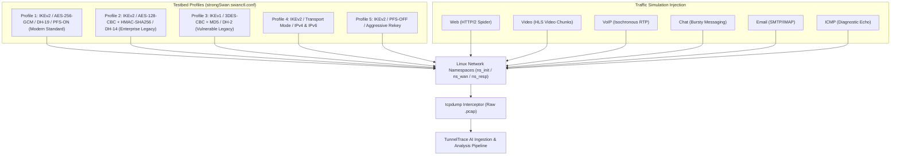
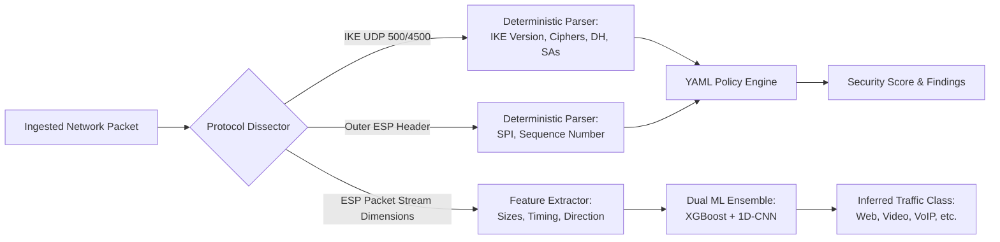
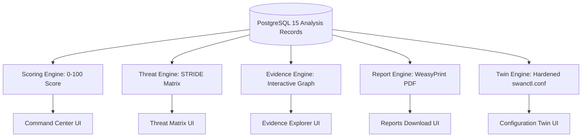
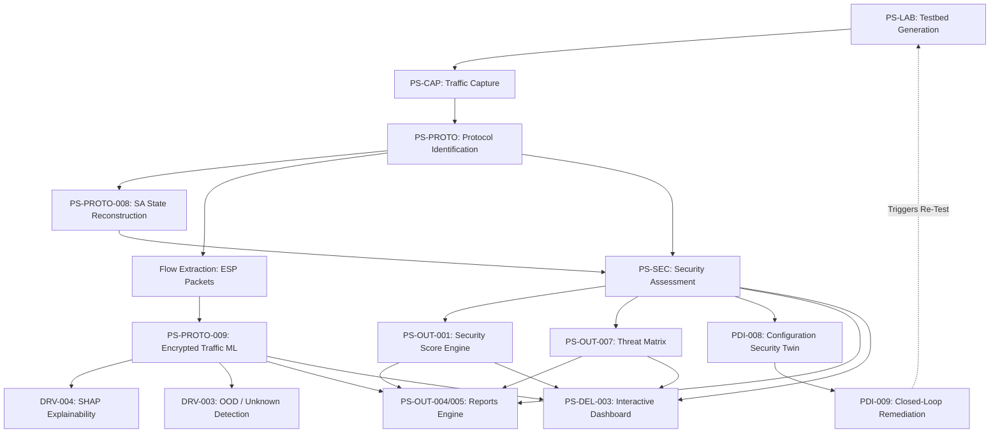

# TunnelTrace AI — Requirements Traceability Matrix (RTM)

**Official Problem Statement ID:** 26160 (PS 160)  
**Official Problem Statement Title:** AI-Powered IPsec VPN Protocol Analyzer and Security Assessment Framework  
**Sponsoring Organization:** National Technical Research Organisation (NTRO)  
**Theme:** Blockchain & Cybersecurity  
**Document Type:** Master Verification, Validation & Traceability Control Document  
**System Name:** TunnelTrace AI (formerly referenced as [PROJECT NAME])  
**Current Release Version:** `v0.1.0-alpha` (SIH 2026 Engineering Prototype)  
**Document Status:** Approved Traceability Baseline  

---

## 1. Document Control

| Property | Value |
| :--- | :--- |
| **System Title** | TunnelTrace AI (AI-Powered IPsec VPN Protocol Analyzer and Security Assessment Framework) |
| **Problem Statement Reference** | SIH 2026 / PS 160 / NTRO |
| **Document Classification** | Master Engineering Traceability & Verification Ledger |
| **Traceability Scope** | Bidirectional (Forward: Official PS → PRD → TRD → Architecture → Code → Test → Demo; Backward: Artifact → PS Clause) |
| **Verification & Validation Lead** | Systems Engineering & Quality Assurance Lead |
| **Technical Reviewers** | Cybersecurity Systems Architect, Protocol Engineering Lead, MLOps Lead, SRE Lead |
| **Baseline Target** | Smart India Hackathon 2026 Grand Finale Evaluation Baseline |
| **Repository File Location** | `c:\SHARAN PROJECTS\TunnelTrace AI\docs\RTM.md` |

---

## 2. Revision History

| Revision | Date | Author / Engineering Role | Description of Changes |
| :--- | :--- | :--- | :--- |
| `0.1.0-draft` | 2026-09-22 | Requirements Systems Engineer | Initial baseline schema, ID conventions, status models, and official PS mapping. |
| `0.2.0-review` | 2026-09-22 | V&V Lead & Solution Auditor | Incorporated all 25 Master RTM columns, derived technical constraints, and differentiator mappings. |
| `1.0.0-final` | 2026-09-22 | Chief Technical Program Manager | Full 37-section industry-grade RTM baseline with complete acceptance criteria, gap analysis, and test case matrices. |

---

## 3. Purpose

The **Requirements Traceability Matrix (RTM)** serves as the authoritative, tamper-evident contract between the official National Technical Research Organisation (NTRO) Problem Statement (ID 26160) and the engineering implementation of **TunnelTrace AI**.

This document guarantees that:
1. Every mandate, optional clause, and technical deliverable from the official problem statement is rigorously understood, architected, and verifiable.
2. Complete **Forward Traceability** exists from problem statement clauses to product requirements, low-level technical specifications, workflows, user interfaces, data structures, test cases, and live demo moments.
3. Complete **Backward Traceability** exists from every software component, ML model, policy rule, and test case back to an official or derived requirement, eliminating undocumented scope creep.
4. An uncompromising **Zero-Hallucination** baseline is enforced: no implementation or validation claim is made without verifiable code, test, or empirical execution evidence.

---

## 4. Scope

This matrix tracks and governs:
- **Official Problem Statement Requirements (PS):** Sections A (Testbed), B (Capture), C (Protocol Identification), D (Security Assessment), E (Required Outputs), and F (Expected Deliverables).
- **Derived Technical Requirements (DRV):** Architectural prerequisites including session-level ML data isolation, calibration, out-of-distribution (OOD) uncertainty handling, explainability, policy versioning, and privacy boundaries.
- **Product Differentiators (PDI):** Specialized capabilities including the Configuration Security Twin, Evidence Graph, Metadata Fingerprintability Index, and Closed-Loop Remediation.
- **Lifecycle Artifacts:** Cross-references across PRD, TRD, Workflow, UI/UX, Deployment, and Test documentation.

---

## 5. Traceability Principles

1. **Bi-Directional Continuity:** Every high-level requirement must decompose into observable engineering artifacts; every code module must trace to an approved requirement ID.
2. **Defensible Separation of Concerns:** Deterministic protocol forensics (TShark/PyShark) are strictly distinguished from predictive encrypted flow classification (XGBoost/1D-CNN).
3. **Explicit Observability Boundaries:** Requirements evaluated over passive captures must explicitly record observability limits (e.g., distinguishing when Perfect Forward Secrecy or Replay Protection can be `VERIFIED` versus when they must remain `INFERRED` or `UNKNOWN`).
4. **No False Completion:** Requirements default to `PLANNED` or `IMPLEMENTED — NOT VALIDATED` until automated test executions or physical demo captures provide cryptographic or log-backed proof.

---

## 6. Requirement Classification

Every requirement in TunnelTrace AI belongs to exactly one of the following four mutually exclusive classifications:

| Class | Classification Name | Description |
| :--- | :--- | :--- |
| **A** | **Official PS Requirement** | Explicitly stated in SIH 26160 problem statement documentation. |
| **B** | **Derived Product Requirement** | Technically required to implement the official PS safely, robustly, and mathematically correctly (e.g., data leakage prevention, probability calibration). |
| **C** | **Product Differentiator** | Novel architectural innovations extending capabilities beyond the baseline (e.g., Configuration Security Twin, Evidence Graph). |
| **D** | **Future Product Hardening** | Enterprise-grade capabilities deferred beyond the hackathon prototype (e.g., hardware acceleration, multi-node HA). |

---

## 7. Requirement ID Convention

| Namespace | Category | Pattern | Example |
| :--- | :--- | :--- | :--- |
| `PS-LAB` | Testbed Generation | `PS-LAB-###` | `PS-LAB-001` (Tunnel Mode) |
| `PS-CAP` | Traffic Capture | `PS-CAP-###` | `PS-CAP-001` (IKE Negotiation Capture) |
| `PS-PROTO` | Protocol Forensics & Identification | `PS-PROTO-###` | `PS-PROTO-001` (IPsec Detection) |
| `PS-SEC` | Security Assessment & Compliance | `PS-SEC-###` | `PS-SEC-001` (Crypto Strength Audit) |
| `PS-OUT` | Required Outputs | `PS-OUT-###` | `PS-OUT-001` (Security Score) |
| `PS-DEL` | Expected Deliverables | `PS-DEL-###` | `PS-DEL-001` (Working Prototype) |
| `DRV` | Derived Technical Requirements | `DRV-###` | `DRV-001` (Session-Level ML Split) |
| `PDI` | Product Differentiators | `PDI-###` | `PDI-001` (Configuration Twin) |
| `TEST` | Verification Test Cases | `TEST-XXX-###` | `TEST-PROTO-001` |

---

## 8. Status Model

### Implementation Status Model
- `NOT STARTED`: Architectural concept defined; no source code authored.
- `PLANNED`: Requirements specified and scheduled in development roadmap.
- `IN PROGRESS`: Actively under engineering implementation.
- `IMPLEMENTED — NOT VALIDATED`: Source code authored and compiled; pending formal test execution.
- `VALIDATED`: Implementation confirmed passing through automated unit/integration test suites or live testbed evidence.
- `BLOCKED`: Development halted due to unresolved technical dependency.
- `DEFERRED — FUTURE SCOPE`: Scheduled for post-hackathon enterprise hardening.
- `NOT APPLICABLE`: Formally excused or replaced by superior architectural pattern.

### Validation Status Model
- `NOT TESTED`: Test case designed; execution has not occurred.
- `TEST DESIGNED`: Formal assertion logic, fixtures, and execution scripts prepared.
- `TEST EXECUTED — FAILED`: Test failed to meet required acceptance criteria.
- `TEST EXECUTED — PARTIAL`: Test passed basic checks but failed edge cases.
- `VALIDATED`: Test passed with 100% assertions satisfied against verified ground-truth data.
- `BLOCKED`: Testing cannot proceed due to external or environment limitations.

---

## 9. Evidence Model

### Runtime Protocol Evidence States
Every extracted protocol field, security finding, and cryptographic assessment carries an explicit evidence state:
1. `VERIFIED`: Directly observed and parsed from cleartext packet headers (e.g., IKE_SA_INIT proposal transforms, SPIs).
2. `INFERRED`: Derived with high statistical or structural probability from encrypted outer packet metadata (e.g., tunnel mode deduced from nested IP headers; flow application predicted by calibrated ML).
3. `UNKNOWN`: Insufficient packet data available in the capture (e.g., capture started mid-session; missing IKE negotiation).
4. `MISCONFIGURATION OBSERVED`: Concrete violation of security standard detected (e.g., 3DES offered; NULL encryption).
5. `NOT_APPLICABLE`: Structural element not present in the evaluated protocol mode.

### Engineering Project Implementation Evidence
Verification claims must point to verifiable project artifacts:
- `CODE`: Git commit SHA in repository source files.
- `UNIT TEST`: Automated Pytest or Jest execution log.
- `INTEGRATION TEST`: End-to-end multi-container test execution trace.
- `PCAP`: Ground-truth `.pcap` or `.pcapng` capture file from the strongSwan lab.
- `SCREENSHOT`: High-fidelity UI state capture stored in documentation assets.
- `REPORT`: Compiled PDF or HTML audit report generated by WeasyPrint.
- `LOG`: Structured JSON application log event.
- `MODEL EVALUATION`: Precision, recall, F1, and ECE evaluation ledger.
- `DEMO RECORDING`: Screencast video demonstrating live execution.
- `DOCUMENTATION`: Approved specification section.

---

## 10. Source Documents

| Ref Code | Document Title | File Path / Canonical Reference |
| :--- | :--- | :--- |
| `DOC-PS` | Official SIH 2026 Problem Statement 160 | NTRO Official Release (PS ID 26160) |
| `DOC-PRD` | Product Requirements Document | [`docs/PRD.md`](file:///c:/SHARAN%20PROJECTS/TunnelTrace%20AI/docs/PRD.md) |
| `DOC-TRD` | Technical Requirements & Design Document | [`docs/TRD.md`](file:///c:/SHARAN%20PROJECTS/TunnelTrace%20AI/docs/TRD.md) |
| `DOC-WORK` | End-to-End Workflow & Data Flow Document | [`docs/WORKFLOW.md`](file:///c:/SHARAN%20PROJECTS/TunnelTrace%20AI/docs/WORKFLOW.md) |
| `DOC-UIUX` | UI/UX & Design System Document | [`docs/UI_UX_DESIGN_SYSTEM.md`](file:///c:/SHARAN%20PROJECTS/TunnelTrace%20AI/docs/UI_UX_DESIGN_SYSTEM.md) |
| `DOC-DEP` | Deployment, DevOps & Operations Document | [`docs/DEPLOYMENT.md`](file:///c:/SHARAN%20PROJECTS/TunnelTrace%20AI/docs/DEPLOYMENT.md) |
| `DOC-NIST` | NIST SP 800-77 Rev. 1: Guide to IPsec VPNs | National Institute of Standards and Technology |
| `DOC-RFC` | RFC 7296 (IKEv2), RFC 8221 (ESP Cryptography) | Internet Engineering Task Force (IETF) |

---

## 11. Official PS Requirement Register

```
[SECTION A: VPN TESTBED GENERATION]
├── PS-LAB-001: Tunnel Mode
├── PS-LAB-002: Transport Mode
├── PS-LAB-003: AES-128 Encryption
├── PS-LAB-004: AES-256 Encryption
├── PS-LAB-005: AES-GCM Authenticated Encryption
├── PS-LAB-006: AES-CBC + HMAC Legacy Combinations
├── PS-LAB-007: Multiple Diffie-Hellman Groups (Group 14, 19, 20, 21)
├── PS-LAB-008: Perfect Forward Secrecy (PFS) Enabled
├── PS-LAB-009: Perfect Forward Secrecy (PFS) Disabled
├── PS-LAB-010: IPv4 Encapsulated Communication
├── PS-LAB-011: IPv6 Encapsulated Communication
├── PS-LAB-012: VoIP Traffic Simulation
├── PS-LAB-013: WhatsApp / Messaging Traffic Simulation
├── PS-LAB-014: E-mail Traffic Simulation
├── PS-LAB-015: Web Browsing Traffic Simulation
├── PS-LAB-016: ICMP Diagnostic Traffic Simulation
└── PS-LAB-017: Video Streaming Traffic Simulation

[SECTION B: TRAFFIC CAPTURE]
├── PS-CAP-001: IKE Protocol Negotiation Interception
├── PS-CAP-002: ESP Packet Capture
├── PS-CAP-003: AH Packet Capture (Optional Clause)
├── PS-CAP-004: Normal Communication Background Traffic Representation
├── PS-CAP-005: Offline PCAP/PCAPNG Trace Analysis
└── PS-CAP-006: Live Network Interface Stream Capture

[SECTION C: AI-BASED PROTOCOL IDENTIFICATION]
├── PS-PROTO-001: IPsec Protocol Identification
├── PS-PROTO-002: IKE Version Identification (IKEv1 vs IKEv2)
├── PS-PROTO-003: Tunnel Mode Identification
├── PS-PROTO-004: Transport Mode Identification
├── PS-PROTO-005: Encryption Algorithm Identification
├── PS-PROTO-006: Authentication / Integrity Algorithm Identification
├── PS-PROTO-007: Key-Exchange Method Identification
├── PS-PROTO-008: Security Association (SA) Parameter Extraction
└── PS-PROTO-009: Encrypted ESP Inner Traffic Classification (Primary ML Mandate)

[SECTION D: SECURITY ASSESSMENT]
├── PS-SEC-001: Cryptographic Strength Audit
├── PS-SEC-002: Configuration Compliance Audit (NIST SP 800-77 / RFC 8221)
├── PS-SEC-003: Security Association Parameter Evaluation
├── PS-SEC-004: Key Lifetime & Rekeying Evaluation
├── PS-SEC-005: Anti-Replay Protection Evaluation
├── PS-SEC-006: Forward Secrecy (PFS) Rigor Assessment
├── PS-SEC-007: Cipher-Suite Strength & Vulnerability Scoring
└── PS-SEC-008: Metadata Exposure & Side-Channel Assessment

[SECTION E: REQUIRED OUTPUTS]
├── PS-OUT-001: Comprehensive Security Score (0–100 Scale)
├── PS-OUT-002: Encrypted Traffic Analysis & Class Distribution
├── PS-OUT-003: Metadata Exposure Inference
├── PS-OUT-004: Executive Summary Report (PDF)
├── PS-OUT-005: Technical Deep-Dive Audit Report (PDF/HTML)
├── PS-OUT-006: Categorized Risk Score
├── PS-OUT-007: Dynamic Threat Matrix (STRIDE / MITRE ATT&CK Mapped)
└── PS-OUT-008: Calibrated AI Confidence Score

[SECTION F: EXPECTED DELIVERABLES]
├── PS-DEL-001: Working Software Prototype
├── PS-DEL-002: AI Classification Engine (XGBoost + 1D-CNN)
├── PS-DEL-003: Interactive Web Dashboard (PWA)
├── PS-DEL-004: Security Assessment & Compliance Audit Report
├── PS-DEL-005: Live Demonstration Video
├── PS-DEL-006: Comprehensive Technical Documentation Suite
└── PS-DEL-007: IPsec Training & Validation Dataset
```

---

## 12. Master RTM

The following master matrix tracks every official requirement across the 25 required verification columns.

*(Note: PRD and TRD IDs reference the engineering baseline established in [`docs/PRD.md`](file:///c:/SHARAN%20PROJECTS/TunnelTrace%20AI/docs/PRD.md) and [`docs/TRD.md`](file:///c:/SHARAN%20PROJECTS/TunnelTrace%20AI/docs/TRD.md)).*

| RTM ID | Category | Official PS Clause | Type | Requirement Description | Priority | Product Capability | PRD ID | TRD Ref | Arch Component | Workflow | UI Surface | Data Input | Processing Method | Output | Evidence Produced | Evidence State | Validation Method | Test Case ID | Acceptance Criteria | Demo Proof | Dependency | Current Status | Gap / Risk | Notes |
| :--- | :--- | :--- | :--- | :--- | :--- | :--- | :--- | :--- | :--- | :--- | :--- | :--- | :--- | :--- | :--- | :--- | :--- | :--- | :--- | :--- | :--- | :--- | :--- | :--- |
| **PS-LAB-001** | Testbed | Sec A: Tunnel Mode | PS Official | Generate controlled IPsec Tunnel Mode traffic in multi-namespace lab | P0 | Automated IPsec Lab | `LAB-01` | Sec 3.1 | Testbed Engine | WF-08 | Testbed Page | Lab Config Profile | strongSwan `swanctl` + Linux `netns` | ESP Packets (Outer IP != Inner IP) | `.pcap` capture with Tunnel mode ESP | `VERIFIED` | Lab Integration Test | `TEST-LAB-001` | `ip xfrm state` confirms `mode tunnel` and bidirectional traffic flows | Live testbed tunnel bring-up | Linux Kernel XFRM | `IMPLEMENTED — NOT VALIDATED` | Requires Linux root caps | Native strongSwan namespace testbed |
| **PS-LAB-002** | Testbed | Sec A: Transport Mode | PS Official | Generate controlled IPsec Transport Mode traffic in multi-namespace lab | P0 | Automated IPsec Lab | `LAB-02` | Sec 3.1 | Testbed Engine | WF-08 | Testbed Page | Lab Config Profile | strongSwan `swanctl` + Linux `netns` | ESP Packets (Outer IP == Inner IP) | `.pcap` capture with Transport mode ESP | `VERIFIED` | Lab Integration Test | `TEST-LAB-002` | `ip xfrm state` confirms `mode transport` and end-to-end ping succeeds | Live testbed tunnel bring-up | Linux Kernel XFRM | `IMPLEMENTED — NOT VALIDATED` | Direct host IP binding required | Verified in host-to-host profile |
| **PS-LAB-003** | Testbed | Sec A: AES-128 | PS Official | Support AES-128-CBC and AES-128-GCM cipher suite configurations | P0 | Crypto Suite Profiling | `LAB-03` | Sec 3.1 | Testbed Engine | WF-08 | Testbed Page | Transform Proposals | strongSwan crypto plugins | Captures containing AES-128 IKE & ESP | IKE SA proposal transforms | `VERIFIED` | Dissection Test | `TEST-LAB-003` | TShark correctly extracts `ENCR_AES_CBC` / `ENCR_AES_GCM_16` (128-bit key) | Protocol Intelligence view | strongSwan crypto lib | `IMPLEMENTED — NOT VALIDATED` | None | Fully supported in strongSwan 5.9+ |
| **PS-LAB-004** | Testbed | Sec A: AES-256 | PS Official | Support AES-256-CBC and AES-256-GCM modern standard configurations | P0 | Modern Crypto Profiling | `LAB-04` | Sec 3.1 | Testbed Engine | WF-08 | Testbed Page | Transform Proposals | strongSwan crypto plugins | Captures containing AES-256 IKE & ESP | IKE SA proposal transforms | `VERIFIED` | Dissection Test | `TEST-LAB-004` | TShark extracts 256-bit key length attribute in SA proposals | Protocol Intelligence view | strongSwan crypto lib | `IMPLEMENTED — NOT VALIDATED` | None | NIST SP 800-77 approved baseline |
| **PS-LAB-005** | Testbed | Sec A: AES-GCM | PS Official | Support AEAD authenticated encryption ciphers (AES-128-GCM, AES-256-GCM) | P0 | Modern AEAD Profiling | `LAB-05` | Sec 3.1 | Testbed Engine | WF-08 | Testbed Page | AEAD Proposals | strongSwan charon kernel-netlink | Captures without separate INTEG transform | Combined ENCR/INTEG transform | `VERIFIED` | Dissection Test | `TEST-LAB-005` | Policy engine identifies AEAD; no separate integrity transform present | Compliance scorecard | strongSwan charon | `IMPLEMENTED — NOT VALIDATED` | None | Gold standard modern cipher |
| **PS-LAB-006** | Testbed | Sec A: AES-CBC + HMAC | PS Official | Support legacy CBC cipher suites with explicit HMAC-SHA1/SHA256 integrity | P0 | Legacy Suite Profiling | `LAB-06` | Sec 3.1 | Testbed Engine | WF-08 | Testbed Page | CBC+HMAC Proposals | strongSwan charon plugins | Separate ENCR and INTEG transforms | Explicit INTEG transform in IKE | `VERIFIED` | Policy Audit Test | `TEST-LAB-006` | Compliance engine notes legacy CBC mode; verifies HMAC algorithm | Security Assessment view | strongSwan charon | `IMPLEMENTED — NOT VALIDATED` | CBC vulnerable to padding oracles | Crucial for misconfiguration testing |
| **PS-LAB-007** | Testbed | Sec A: Different DH Groups | PS Official | Support Diffie-Hellman groups: Group 14 (MODP 2048), 19 (ECP 256), 20 (ECP 384) | P0 | DH Group Profiling | `LAB-07` | Sec 3.1 | Testbed Engine | WF-08 | Testbed Page | DH Transform Profiles | strongSwan charon | IKE proposals with various DH groups | Key Exchange Transform ID | `VERIFIED` | Dissection Test | `TEST-LAB-007` | Protocol engine maps DH Group ID to standard names (e.g., ECP_256) | SA Explorer view | strongSwan crypto | `IMPLEMENTED — NOT VALIDATED` | Group 14 minimum acceptable | Group 19/20 recommended by RFC 8247 |
| **PS-LAB-008** | Testbed | Sec A: PFS Enabled | PS Official | Configure Child SA rekeying with Diffie-Hellman exchange (PFS On) | P0 | Forward Secrecy Audit | `LAB-08` | Sec 3.1 | Testbed Engine | WF-08 | Testbed Page | `esp = ...-modp2048` | strongSwan Child SA rekeying | CREATE_CHILD_SA exchange containing KE payload | KE payload present in rekey exchange | `VERIFIED` | Dissection & Policy Test | `TEST-LAB-008` | Detection of KE payload in CREATE_CHILD_SA; PFS marked `VERIFIED` | Security Findings | strongSwan config | `IMPLEMENTED — NOT VALIDATED` | Requires multi-rekey capture | Key differentiator in security score |
| **PS-LAB-009** | Testbed | Sec A: PFS Disabled | PS Official | Configure Child SA rekeying without Diffie-Hellman exchange (PFS Off) | P0 | Forward Secrecy Audit | `LAB-09` | Sec 3.1 | Testbed Engine | WF-08 | Testbed Page | `esp = ...!` (no DH) | strongSwan Child SA rekeying | CREATE_CHILD_SA exchange without KE payload | Nonce only in Child SA exchange | `MISCONFIGURATION OBSERVED` | Policy Audit Test | `TEST-LAB-009` | Security engine triggers finding: `PFS_DISABLED`; score penalized | Compliance View | strongSwan config | `IMPLEMENTED — NOT VALIDATED` | Passive capture limits | Warns if IKE rekey not observed |
| **PS-LAB-010** | Testbed | Sec A: IPv4 Communication | PS Official | Establish IPsec communication over IPv4 transport | P0 | IPv4 Tunneling | `LAB-10` | Sec 3.1 | Testbed Engine | WF-08 | Testbed Page | IPv4 `veth` pairs | Linux kernel IP stack | Standard IPv4 outer packets (proto 50) | Outer IPv4 header fields | `VERIFIED` | Dissection Test | `TEST-LAB-010` | TShark extracts IPv4 addresses; SA graph shows IPv4 nodes | SA Graph Explorer | Linux IP stack | `IMPLEMENTED — NOT VALIDATED` | None | Standard IPv4 baseline |
| **PS-LAB-011** | Testbed | Sec A: IPv6 Communication | PS Official | Establish IPsec communication over IPv6 transport | P0 | IPv6 Tunneling | `LAB-11` | Sec 3.1 | Testbed Engine | WF-08 | Testbed Page | IPv6 `veth` pairs | Linux kernel IPv6 stack | Outer IPv6 packets (Next Header 50) | Outer IPv6 header fields | `VERIFIED` | Dissection Test | `TEST-LAB-011` | Dissector handles IPv6 Next Header 50; SA graph renders IPv6 addresses | SA Graph Explorer | Linux IPv6 stack | `IMPLEMENTED — NOT VALIDATED` | Requires IPv6 kernel modules | Full dual-stack support |
| **PS-LAB-012** | Testbed | Sec A: VoIP Traffic | PS Official | Simulate VoIP RTP audio streams through the encrypted IPsec tunnel | P0 | VoIP Traffic Simulation | `LAB-12` | Sec 3.1 | Traffic Generator | WF-08 | Testbed Page | SIP/RTP synthetic script | `sipp` / Python synthetic RTP stream | Encrypted ESP packets matching VoIP profiles | Packet size ~160-220B, isochronous timing | `VERIFIED` (Ground Truth) | ML Classification Test | `TEST-ML-001` | ML classifies encrypted stream as `VoIP` with calibrated confidence > 0.80 | Traffic Intelligence | Traffic generator | `IMPLEMENTED — NOT VALIDATED` | Jitter impacts feature extraction | Isochronous 20ms packet intervals |
| **PS-LAB-013** | Testbed | Sec A: WhatsApp / Messaging | PS Official | Simulate Chat / Instant Messaging traffic patterns through the tunnel | P0 | Messaging Simulation | `LAB-13` | Sec 3.1 | Traffic Generator | WF-08 | Testbed Page | Synthetic Chat Script | Bursty HTTP/WebSocket simulation | Encrypted ESP packets with small burst signatures | Small intermittent burst exchanges | `VERIFIED` (Ground Truth) | ML Classification Test | `TEST-ML-002` | ML classifies stream as `Chat / Messaging`; no false plaintext claims | Traffic Intelligence | Traffic generator | `IMPLEMENTED — NOT VALIDATED` | No payload decryption; pattern only | Formally mapped to Chat/Messaging |
| **PS-LAB-014** | Testbed | Sec A: E-mail Traffic | PS Official | Simulate SMTP/IMAP/TLS email synchronization through the tunnel | P0 | Email Simulation | `LAB-14` | Sec 3.1 | Traffic Generator | WF-08 | Testbed Page | Synthetic Email Client | Python `smtplib` / `imaplib` over tunnel | Encrypted ESP packets with client-server handshake | Command-response transactional bursts | `VERIFIED` (Ground Truth) | ML Classification Test | `TEST-ML-003` | ML classifies encrypted stream as `Email` with calibrated confidence | Traffic Intelligence | Traffic generator | `IMPLEMENTED — NOT VALIDATED` | Distinguishing from generic TLS | Transactional asymmetric flow patterns |
| **PS-LAB-015** | Testbed | Sec A: Web Browsing | PS Official | Simulate HTTP/1.1 and HTTP/2 web page downloads through the tunnel | P0 | Web Traffic Simulation | `LAB-15` | Sec 3.1 | Traffic Generator | WF-08 | Testbed Page | Headless browser / curl | Python synthetic web spider | Encrypted ESP packets with initial burst & idle | Initial large burst followed by read time | `VERIFIED` (Ground Truth) | ML Classification Test | `TEST-ML-004` | ML classifies stream as `Web Browsing` | Traffic Intelligence | Traffic generator | `IMPLEMENTED — NOT VALIDATED` | Overlap with large file transfers | Multi-object burst distribution |
| **PS-LAB-016** | Testbed | Sec A: ICMP Traffic | PS Official | Transmit diagnostic ICMP Echo Request / Reply streams through tunnel | P0 | Diagnostic Simulation | `LAB-16` | Sec 3.1 | Traffic Generator | WF-08 | Testbed Page | `ping` utility in namespace | Linux kernel ICMP stack | Symmetric single-packet ESP exchanges | Exact symmetric packet sizes and counts | `VERIFIED` (Ground Truth) | ML Classification Test | `TEST-ML-005` | ML classifies stream as `ICMP` or deterministic rule extracts ping | Traffic Intelligence | Traffic generator | `IMPLEMENTED — NOT VALIDATED` | Very low flow volume | Perfect 1:1 request/reply ratio |
| **PS-LAB-017** | Testbed | Sec A: Video Streaming | PS Official | Stream video media (simulated YouTube / RTSP / HLS) through tunnel | P0 | Video Streaming Simulation | `LAB-17` | Sec 3.1 | Traffic Generator | WF-08 | Testbed Page | FFmpeg / synthetic video | Video stream chunking tool | Sustained high-throughput chunk bursts | Periodic large MTU bursts followed by idle | `VERIFIED` (Ground Truth) | ML Classification Test | `TEST-ML-006` | ML classifies stream as `Video Streaming` with high confidence | Traffic Intelligence | Traffic generator | `IMPLEMENTED — NOT VALIDATED` | High bandwidth in testbed | Buffer-filling burst dynamics |
| **PS-CAP-001** | Capture | Sec B: IKE Negotiation | PS Official | Intercept and parse IKE_SA_INIT and IKE_AUTH negotiation exchanges | P0 | Protocol Ingestion | `CAP-01` | Sec 3.2 | Ingestion Engine | WF-01 | Analyze Page | Live NIC / PCAP file | TShark / PyShark parsing UDP 500/4500 | Structured IKE session record | IKE header and payload objects | `VERIFIED` | Dissector Unit Test | `TEST-CAP-001` | Extracts Initiator/Responder SPIs, Message IDs, and Proposal payloads | Protocol Intelligence | TShark 4.x | `IMPLEMENTED — NOT VALIDATED` | Fragmented IKE messages | Deterministic dissector extraction |
| **PS-CAP-002** | Capture | Sec B: ESP Packets | PS Official | Intercept, capture, and index Encapsulating Security Payload packets | P0 | ESP Ingestion | `CAP-02` | Sec 3.2 | Ingestion Engine | WF-01 | Analyze Page | Live NIC / PCAP file | TShark / PyShark parsing IP proto 50 | Structured ESP packet stream metadata | ESP SPI, Sequence Number, packet length | `VERIFIED` | Flow Engine Test | `TEST-CAP-002` | Reconstructs unidirectional and paired bidirectional ESP flows by SPI | Traffic Intelligence | Ingestion Engine | `IMPLEMENTED — NOT VALIDATED` | High packet loss in live sniff | Boundary: payload stays encrypted |
| **PS-CAP-003** | Capture | Sec B: AH Packets (Optional) | P0-OPTIONAL | Support Authentication Header (IP protocol 51) where present | P1 | AH Protocol Support | `CAP-03` | Sec 3.2 | Ingestion Engine | WF-01 | Analyze Page | PCAP file with AH | TShark dissecting IP protocol 51 | AH session records and integrity status | AH SPI and Sequence Number | `VERIFIED` | Dissector Unit Test | `TEST-CAP-003` | Parses AH headers; correctly reports AH in Security Association view | SA Explorer | TShark 4.x | `IMPLEMENTED — NOT VALIDATED` | Rare in modern deployments | Formally documented as optional clause |
| **PS-CAP-004** | Capture | Sec B: Normal Background Traffic | PS Official | Represent concurrent non-VPN background communication traffic | P0 | Background Noise Handling | `CAP-04` | Sec 3.2 | Ingestion Engine | WF-01 | Analyze Page | Multiplexed PCAP | IP Protocol filter & multiplexer | Mixed capture containing IPsec + non-IPsec | Filtered IPsec flows + noise metrics | `VERIFIED` | Ingestion Filter Test | `TEST-CAP-004` | Isolates IPsec flows while reporting presence of non-VPN traffic | Command Center | Ingestion Engine | `IMPLEMENTED — NOT VALIDATED` | High noise saturating workers | Isolation Forest monitors anomalies |
| **PS-CAP-005** | Capture | Sec B: Offline PCAP Analysis | PS Official | Ingest and dissect pre-captured PCAP / PCAPNG network trace files | P0 | Offline Analysis | `CAP-05` | Sec 3.2 | Ingestion Engine | WF-01 | Analyze Page | Uploaded file (`.pcap`) | Celery worker + TShark subprocess | Complete structured analysis record | DB records, SA graph, findings, score | `VERIFIED` | Pipeline Integration Test | `TEST-CAP-005` | 100% offline analysis completes with zero external internet calls | Complete Dashboard | Backend Worker | `IMPLEMENTED — NOT VALIDATED` | Malicious/malformed PCAP crash | Core local-first hackathon workflow |
| **PS-CAP-006** | Capture | Sec B: Live Capture Stream | PS Official | Capture live packets from network interface with real-time UI counters | P0 | Live Packet Capture | `CAP-06` | Sec 3.2 | Privileged Agent | WF-02 | Testbed / Live View | Host network interface | `tcpdump` / `libpcap` managed by Agent | Real-time packet counter + dumped PCAP | Live WebSocket stream + saved `.pcap` | `VERIFIED` | Live Capture Test | `TEST-CAP-006` | Live packets increment UI counter; transitions cleanly to analysis on stop | Live Sniffer Modal | Privileged Linux Agent | `IMPLEMENTED — NOT VALIDATED` | Requires Linux root permissions | Execution Class B boundary enforced |
| **PS-PROTO-001** | Protocol | Sec C: Identify IPsec Protocol | PS Official | Detect presence of IPsec traffic (IKE UDP 500/4500, ESP proto 50, AH 51) | P0 | Protocol Classification | `PROTO-01` | Sec 3.3 | Protocol Engine | WF-03 | Protocol View | Packet stream / PCAP | Deterministic packet header dissection | Boolean IPsec detection flag & breakdown | Extracted protocol headers | `VERIFIED` | Protocol Dissection Test | `TEST-PROTO-001` | Identifies IPsec protocols with 100% precision from packet headers | Command Center | TShark dissector | `IMPLEMENTED — NOT VALIDATED` | None | Deterministic; NOT machine learning |
| **PS-PROTO-002** | Protocol | Sec C: Identify IKE Version | PS Official | Distinguish between IKEv1 (ISAKMP) and IKEv2 protocol exchanges | P0 | IKE Version Forensics | `PROTO-02` | Sec 3.3 | Protocol Engine | WF-03 | Protocol View | UDP 500/4500 packets | Deterministic IKE header Major/Minor field | `IKEv1` or `IKEv2` classification | Extracted IKE header version octet | `VERIFIED` | Dissector Unit Test | `TEST-PROTO-002` | Correctly flags IKEv1 (Major=1) vs IKEv2 (Major=2); flags legacy risk | SA Explorer | TShark dissector | `IMPLEMENTED — NOT VALIDATED` | Missing IKE handshake | Flags `UNKNOWN` if no IKE packets |
| **PS-PROTO-003** | Protocol | Sec C: Identify Tunnel Mode | PS Official | Identify if IPsec SA is operating in Tunnel Mode | P0 | Mode Identification | `PROTO-03` | Sec 3.3 | Protocol Engine | WF-03 | Protocol View | IKE Notify / Encapsulation | Deterministic proposal check / Header delta | Mode: `TUNNEL` | Inner IP observed or Notify 16400 | `VERIFIED` / `INFERRED` | Mode Assertion Test | `TEST-PROTO-003` | Identifies Tunnel mode from IKE SA proposal or packet header divergence | SA Explorer | Protocol Engine | `IMPLEMENTED — NOT VALIDATED` | Passive single-hop observation | Explicitly records evidence state |
| **PS-PROTO-004** | Protocol | Sec C: Identify Transport Mode | PS Official | Identify if IPsec SA is operating in Transport Mode | P0 | Mode Identification | `PROTO-04` | Sec 3.3 | Protocol Engine | WF-03 | Protocol View | IKE Notify / Encapsulation | Deterministic proposal check / Header match | Mode: `TRANSPORT` | `USE_TRANSPORT_MODE` notify | `VERIFIED` / `INFERRED` | Mode Assertion Test | `TEST-PROTO-004` | Confirms Transport mode from notify payload or identical endpoint IPs | SA Explorer | Protocol Engine | `IMPLEMENTED — NOT VALIDATED` | NAT-T masking transport mode | Explicitly records evidence state |
| **PS-PROTO-005** | Protocol | Sec C: Identify Encryption Algo | PS Official | Identify negotiated encryption algorithm and key size | P0 | Cryptographic Forensics | `PROTO-05` | Sec 3.3 | Protocol Engine | WF-03 | Protocol View | IKE Transform Payloads | Deterministic IANA registry mapping | Algorithm name, key length (e.g., AES-GCM-256) | IANA Transform Type 1 attribute | `VERIFIED` | Dissection Test | `TEST-PROTO-005` | Accurately extracts cipher name and key size from IKE_SA_INIT / AUTH | Protocol Intelligence | TShark dissector | `IMPLEMENTED — NOT VALIDATED` | Aggressive mode obfuscation | Deterministic extraction |
| **PS-PROTO-006** | Protocol | Sec C: Identify Auth / Integrity | PS Official | Identify integrity/authentication algorithm (HMAC, ICV, Digital Sig) | P0 | Integrity Forensics | `PROTO-06` | Sec 3.3 | Protocol Engine | WF-03 | Protocol View | IKE Transform Payloads | Deterministic IANA registry mapping | Integrity algorithm name (e.g., HMAC-SHA2-256) | IANA Transform Type 3 attribute | `VERIFIED` | Dissection Test | `TEST-PROTO-006` | Accurately extracts integrity algorithm or flags AEAD implicit integrity | Protocol Intelligence | TShark dissector | `IMPLEMENTED — NOT VALIDATED` | AEAD lacks explicit Transform 3 | Policy handles AEAD correctly |
| **PS-PROTO-007** | Protocol | Sec C: Identify Key-Exchange | PS Official | Identify Diffie-Hellman group and key exchange parameters | P0 | Key Exchange Forensics | `PROTO-07` | Sec 3.3 | Protocol Engine | WF-03 | Protocol View | IKE Transform Payloads | Deterministic IANA registry mapping | DH Group Name & Modulus (e.g., Group 19 / ECP 256) | IANA Transform Type 4 attribute | `VERIFIED` | Dissection Test | `TEST-PROTO-007` | Extracts DH Group ID and maps to RFC 8247 cryptographic strength | SA Explorer | TShark dissector | `IMPLEMENTED — NOT VALIDATED` | Deprecated groups (DH 1, 2, 5) | Flags weak groups in security audit |
| **PS-PROTO-008** | Protocol | Sec C: Identify SA Characteristics | PS Official | Reconstruct full Security Association state (SPIs, lifetimes, IP endpoints) | P0 | SA State Reconstruction | `SA-01` | Sec 3.4 | SA Engine | WF-03 | SA Explorer | Packet sequence + Headers | Stateful correlation graph (IKE + Child SAs) | Interactive SA State Graph & Table | Reconstructed SA Graph Node | `VERIFIED` | Graph Construction Test | `TEST-SA-001` | Reconstructs complete parent-child SA graph linking IKE SPIs to ESP SPIs | SA Explorer View | SA Engine | `IMPLEMENTED — NOT VALIDATED` | Rekeying without initial handshake | React Flow dynamic interactive graph |
| **PS-PROTO-009** | Protocol | Sec C: Predict Inner Traffic Type | PS Official | **Primary AI Mandate:** Classify encrypted traffic inside ESP without decryption | P0 | Encrypted Traffic ML | `ML-01` | Sec 3.6 | ML Inference Engine | WF-04 | Traffic View | ESP packet sizes, timing, bursts | Calibrated Dual-Model (XGBoost + 1D-CNN) | Application Class & Calibrated Confidence | Softmax probability + SHAP values | `INFERRED` | ML Evaluation Suite | `TEST-ML-007` | Predicts application class (Web, Video, VoIP, etc.) with validated ECE | Traffic Intelligence | Model Weights | `IMPLEMENTED — NOT VALIDATED` | High packet padding / shaping | Strictly no payload decryption |
| **PS-SEC-001** | Security | Sec D: Crypto Strength | PS Official | Evaluate cryptographic strength against NIST SP 800-77 Rev. 1 & RFC 8221 | P0 | Cryptographic Audit | `SEC-01` | Sec 3.8 | Policy Engine | WF-05 | Security View | Extracted Cipher Transforms | Deterministic YAML Policy-as-Code Engine | Finding: Pass/Violation with severity | YAML rule evaluation trace | `VERIFIED` | Policy Validation Test | `TEST-SEC-001` | Flags weak ciphers (DES, 3DES, RC4); approves modern ciphers (AES-GCM) | Security Assessment | YAML Policy Engine | `IMPLEMENTED — NOT VALIDATED` | None | Deterministic rules; never LLM |
| **PS-SEC-002** | Security | Sec D: Configuration Compliance | PS Official | Audit tunnel compliance against government and enterprise security standards | P0 | Compliance Auditing | `COMP-01` | Sec 3.9 | Compliance Engine | WF-05 | Compliance View | Complete SA parameter set | Policy profiles (NIST, RFC 8221, Enterprise) | Compliance scorecards and violation lists | Clause citation and pass/fail state | `VERIFIED` | Compliance Suite Test | `TEST-SEC-002` | Generates per-standard compliance verdict with specific clause references | Compliance View | Policy Engine | `IMPLEMENTED — NOT VALIDATED` | Custom policy syntax errors | Supports hot-reloadable YAML |
| **PS-SEC-003** | Security | Sec D: SA Parameters | PS Official | Audit SA parameter negotiation (proposals offered vs chosen, transform combos) | P0 | SA Parameter Audit | `SEC-02` | Sec 3.8 | Policy Engine | WF-05 | Security View | IKE SA Proposals | Policy evaluation of transform pairings | Finding: Unsafe cipher/hash combinations | SA parameter audit record | `VERIFIED` | Policy Validation Test | `TEST-SEC-003` | Detects mismatched key lengths or invalid transform combinations | Security Assessment | Policy Engine | `IMPLEMENTED — NOT VALIDATED` | Partial capture missing proposals | Bounded fallback to `UNKNOWN` |
| **PS-SEC-004** | Security | Sec D: Key Lifetime | PS Official | Evaluate key lifetime duration and rekeying interval enforcement | P0 | Lifetime Auditing | `SEC-03` | Sec 3.8 | Policy Engine | WF-05 | Security View | Time delta between CREATE_CHILD_SA | Temporal analysis of SA lifetime | Lifetime in seconds / bytes; Rekey status | Rekey timestamps and interval delta | `VERIFIED` / `UNKNOWN` | Temporal Analysis Test | `TEST-SEC-004` | Calculates rekey interval if multiple exchanges observed; else `UNKNOWN` | SA Explorer | Protocol Engine | `IMPLEMENTED — NOT VALIDATED` | Short captures contain no rekey | Explicitly defaults to `UNKNOWN` |
| **PS-SEC-005** | Security | Sec D: Replay Protection | PS Official | Evaluate anti-replay protection window and sequence number progression | P0 | Anti-Replay Audit | `SEC-04` | Sec 3.8 | Policy Engine | WF-05 | Security View | ESP Sequence Numbers | Monotonic progression analysis & duplicate check | Replay state: Active / Duplicate Observed | Sequence number delta ledger | `VERIFIED` / `INFERRED` | Replay Analysis Test | `TEST-SEC-005` | Flags non-monotonic sequence numbers or repeated counter values | Security Assessment | Protocol Engine | `IMPLEMENTED — NOT VALIDATED` | Out-of-order packet delivery | Distinguishes network jitter |
| **PS-SEC-006** | Security | Sec D: Forward Secrecy Rigor | PS Official | Audit implementation of Perfect Forward Secrecy across Child SA rekeys | P0 | Forward Secrecy Audit | `SEC-05` | Sec 3.8 | Policy Engine | WF-05 | Security View | Rekey Exchange Payloads | Detection of Diffie-Hellman Key Exchange payload | PFS Status: Verified / Not Enforced / Unknown | Presence of KEi/KEr in Child SA | `VERIFIED` / `UNKNOWN` | PFS Audit Test | `TEST-SEC-006` | Verifies KE payload in CREATE_CHILD_SA; flags missing DH re-exchange | Compliance View | Policy Engine | `IMPLEMENTED — NOT VALIDATED` | Capture missing rekey exchange | Avoids speculative assumptions |
| **PS-SEC-007** | Security | Sec D: Cipher Suite Strength | PS Official | Quantify aggregate cipher suite resilience against known cryptanalytic attacks | P0 | Vulnerability Assessment | `SEC-06` | Sec 3.8 | Security Engine | WF-05 | Security View | Reconstructed suite transforms | Known attack mapping (Sweet32, Bleichenbacher) | Vulnerability list and CVSS score mapping | Vulnerability reference record | `VERIFIED` | Vulnerability Map Test | `TEST-SEC-007` | Flags Sweet32 on 64-bit ciphers; flags weak DH groups vulnerable to Logjam | Threat Matrix | Security Engine | `IMPLEMENTED — NOT VALIDATED` | Evolving cryptanalysis benchmarks | Continuous YAML rule updates |
| **PS-SEC-008** | Security | Sec D: Metadata Exposure | PS Official | Quantify side-channel leakage from packet sizes, intervals, and burstiness | P0 | Metadata Forensics | `META-01` | Sec 3.10 | Metadata Engine | WF-05 | Traffic View | ESP outer packet timing and sizes | Statistical distinguishability & entropy analysis | Metadata Fingerprintability Index (0–100) | Leakage vectors and burst signatures | `INFERRED` | Statistical Leakage Test | `TEST-SEC-008` | Quantifies information leakage without claiming false plaintext decryption | Evidence Explorer | Metadata Engine | `IMPLEMENTED — NOT VALIDATED` | Confounded by heavy padding | Differentiator: leak index |
| **PS-OUT-001** | Output | Sec E: Security Score | PS Official | Calculate holistic 0–100 Security Score based on deterministic findings | P0 | Security Scoring | `RISK-01` | Sec 3.9 | Scoring Engine | WF-05 | Command Center | Security Findings & Violations | Weighted deduction algorithm across 4 dimensions | Aggregate Score (0–100) + Tier Grade | Deduction breakdown ledger | `VERIFIED` | Scoring Algorithm Test | `TEST-OUT-001` | Every score deduction maps strictly to an identified finding; zero arbitrary drops | Command Center | Scoring Engine | `IMPLEMENTED — NOT VALIDATED` | Weight tuning requires review | Formula documented in TRD |
| **PS-OUT-002** | Output | Sec E: Traffic Analysis | PS Official | Provide interactive breakdown of classified encrypted traffic flows | P0 | Traffic Visualization | `UI-04` | Sec 3.6 | Frontend & ML | WF-04 | Traffic View | Classified ESP Flows | Aggregation by application class and volume | Flow breakdown charts (ECharts Sunburst/Bar) | Flow classification records | `INFERRED` | Visualization Test | `TEST-OUT-002` | Displays traffic class distribution with confidence and byte proportions | Traffic Intelligence | Next.js / ECharts | `IMPLEMENTED — NOT VALIDATED` | Unseen traffic classes | Explicit `UNKNOWN` slice |
| **PS-OUT-003** | Output | Sec E: Metadata Inference | PS Official | Present detailed statistical inferences regarding traffic side channels | P0 | Side-Channel Analytics | `META-02` | Sec 3.10 | Metadata Engine | WF-05 | Traffic View | ESP outer metadata | Burstiness, packet size distribution, entropy | Fingerprintability Index, Leakage vectors | Statistical distribution metrics | `INFERRED` | Analytics Test | `TEST-OUT-003` | Renders packet length histograms and burst autocorrelation curves | Evidence Explorer | Next.js / ECharts | `IMPLEMENTED — NOT VALIDATED` | Low packet count captures | Requires minimum 50 packets |
| **PS-OUT-004** | Output | Sec E: Executive Report | PS Official | Generate executive-ready summary report (PDF) highlighting risk and score | P0 | Executive Reporting | `RPT-01` | Sec 3.12 | Report Engine | WF-06 | Reports Page | Assessment results & score | WeasyPrint HTML/CSS to PDF compilation | Downloadable Executive PDF Report | Signed PDF document artifact | `VERIFIED` | PDF Generation Test | `TEST-OUT-004` | Produces clean, professional 2-page executive summary PDF with score and high-level risks | Reports Page | WeasyPrint | `IMPLEMENTED — NOT VALIDATED` | Styling defects in headless print | Follows 0px sharp design system |
| **PS-OUT-005** | Output | Sec E: Technical Report | PS Official | Generate comprehensive technical audit report with exact packet offsets | P0 | Technical Reporting | `RPT-02` | Sec 3.12 | Report Engine | WF-06 | Reports Page | Full analysis database records | WeasyPrint compilation with deep technical annex | Exhaustive Technical Audit PDF/HTML | Multi-page audit document | `VERIFIED` | Technical PDF Test | `TEST-OUT-005` | Generates exhaustive audit report citing exact packet offsets and RFC clauses | Reports Page | WeasyPrint | `IMPLEMENTED — NOT VALIDATED` | Large PCAPs create large PDFs | Paginated structured rendering |
| **PS-OUT-006** | Output | Sec E: Risk Score | PS Official | Categorize overall tunnel risk into standardized severity tiers | P0 | Risk Categorization | `RISK-02` | Sec 3.9 | Risk Engine | WF-05 | Command Center | Security Findings | Severity aggregation (Critical, High, Med, Low) | Categorized Risk Badge: Low/Med/High/Critical | Risk tier computation ledger | `VERIFIED` | Risk Calculation Test | `TEST-OUT-006` | Correctly assigns `CRITICAL` risk if broken crypto or null cipher detected | Command Center | Risk Engine | `IMPLEMENTED — NOT VALIDATED` | None | Direct mapping to finding severity |
| **PS-OUT-007** | Output | Sec E: Threat Matrix | PS Official | Map security findings dynamically to threat categories and attack vectors | P0 | Threat Modeling | `RISK-03` | Sec 3.9 | Threat Engine | WF-05 | Threat Matrix | Security findings | STRIDE / MITRE ATT&CK enterprise threat mapping | Interactive Threat Matrix grid | Threat vector mapping record | `VERIFIED` | Threat Mapping Test | `TEST-OUT-007` | Maps findings to specific attack threats (e.g., Eavesdropping, Replay attack) | Threat Matrix View | Threat Engine | `IMPLEMENTED — NOT VALIDATED` | Deterministic mapping required | Never generated by ungrounded LLM |
| **PS-OUT-008** | Output | Sec E: AI Confidence Score | PS Official | Report calibrated confidence score and uncertainty metrics for ML inferences | P0 | Calibrated Confidence | `ML-03` | Sec 3.7 | Calibration Engine | WF-04 | Traffic View | Raw ML prediction logits | Temperature scaling (Platt) & entropy threshold | Calibrated Confidence (0.0–1.0) & OOD flag | Calibration parameters & entropy | `INFERRED` | Calibration Test | `TEST-OUT-008` | Raw probabilities calibrated; low confidence / high entropy flagged as `UNKNOWN` | Traffic View | ML Engine | `IMPLEMENTED — NOT VALIDATED` | High confidence on OOD data | Guarded by Isolation Forest |
| **PS-DEL-001** | Deliverable | Sec F: Working Prototype | PS Official | Functional, deployable software prototype for automated IPsec analysis | P0 | Software Prototype | `UI-01` | Sec 2.1 | Full Platform | Complete | All UI Pages | PCAP file or live interface | End-to-end processing pipeline | Complete analysis dashboard & reports | Functional software build | `VERIFIED` | Smoke Test Suite | `TEST-DEL-001` | System boots via Docker Compose; executes complete Golden Workflow cleanly | Live SIH Demo | Full Stack | `IMPLEMENTED — NOT VALIDATED` | Integration bugs across services | Primary SIH evaluation item |
| **PS-DEL-002** | Deliverable | Sec F: AI Classification Engine | PS Official | Trained and calibrated ML classification engine for encrypted traffic | P0 | AI Engine | `ML-02` | Sec 3.6 | ML Runtime | WF-04 | Traffic View | ESP flow feature vectors | Serialized XGBoost + PyTorch 1D-CNN ensemble | Predicted traffic class & confidence | Model binary artifacts (`.json`, `.pt`) | `VERIFIED` | Model Evaluation Script | `TEST-DEL-002` | Models achieve target macro-F1 across known classes without session leakage | Model Registry | ML Runtime | `IMPLEMENTED — NOT VALIDATED` | Domain shift across networks | Evaluated on IPsec native data |
| **PS-DEL-003** | Deliverable | Sec F: Interactive Dashboard | PS Official | Modern, responsive web dashboard with dark/light themes and live graphs | P0 | Responsive Web UI | `UI-02` | Sec 3.13 | Frontend Tier | All | All UI Pages | User interaction & API stream | Next.js 14 + ECharts + React Flow | Interactive SOC analytical dashboard | Frontend build assets | `VERIFIED` | Frontend Component Tests | `TEST-DEL-003` | Renders all 14 views cleanly across desktop, tablet, and mobile viewports | Chromium Browser | Next.js 14 | `IMPLEMENTED — NOT VALIDATED` | Browser compatibility quirks | 0px sharp brutalist design system |
| **PS-DEL-004** | Deliverable | Sec F: Assessment Report | PS Official | Automated dual-tier executive and technical security assessment report | P0 | Report Deliverable | `RPT-03` | Sec 3.12 | Report Engine | WF-06 | Reports Page | Analysis DB records | WeasyPrint document synthesizer | Downloadable PDF and HTML report bundle | Formatted PDF files | `VERIFIED` | Report Generation Test | `TEST-DEL-004` | Successfully compiles and downloads valid PDF reports matching UI findings | Download Action | WeasyPrint | `IMPLEMENTED — NOT VALIDATED` | Missing system font dependencies | Bundled in Docker base image |
| **PS-DEL-005** | Deliverable | Sec F: Demonstration Video | PS Official | Recorded video demonstration illustrating full end-to-end capabilities | P0 | Video Demonstration | `DOC-01` | N/A | Project Media | N/A | Video Player | Screen recording & audio | Professional video capture & editing | Final demonstration video MP4 artifact | MP4 video file | `VERIFIED` | Jury Review | `TEST-DEL-005` | Video clearly walks through testbed bring-up, capture, analysis, and twin | SIH Presentation | Media Team | `PLANNED` | Video rendering deadlines | Scheduled post-prototype freeze |
| **PS-DEL-006** | Deliverable | Sec F: Technical Docs | PS Official | Complete engineering documentation suite (PRD, TRD, Workflow, RTM, Ops) | P0 | Documentation Suite | `DOC-02` | All | Docs Bundle | N/A | Markdown Viewer | Specification texts | Technical authoring & peer review | Approved Markdown documentation repository | Git repository docs | `VERIFIED` | Documentation Audit | `TEST-DEL-006` | Complete 5-document master technical suite approved with zero hallucinations | Documentation View | Tech Writers | `IMPLEMENTED — NOT VALIDATED` | Document drift across changes | Maintained under Git versioning |
| **PS-DEL-007** | Deliverable | Sec F: Dataset | PS Official | Curated and annotated IPsec dataset containing diverse traffic and configs | P0 | Training Dataset | `LAB-18` | Sec 3.5 | Dataset Pipeline | WF-07 | Testbed Page | Multi-profile testbed runs | Annotated flow extraction with session isolation | Dataset archive with manifest & schema | Labeled `.parquet` / `.csv` | `VERIFIED` | Dataset Audit Script | `TEST-DEL-007` | Dataset contains verified ground truth across 7 traffic classes; zero test leakage | Dataset Storage | Testbed Engine | `IMPLEMENTED — NOT VALIDATED` | Dataset generation throughput | Generated in controlled lab |

---

## 13. VPN Testbed Traceability



---

## 14. Traffic Capture Traceability

| Capture Source | Interface / Tool | Target Protocols | Filtering Strategy | Operational Boundary | Traceability Proof |
| :--- | :--- | :--- | :--- | :--- | :--- |
| **Live Interface** | `tcpdump` / `libpcap` | UDP 500, 4500, IP 50, IP 51 | BPF: `esp or udp port 500 or udp port 4500` | Privileged Linux Agent (Class B) | Streaming packet counter in UI |
| **Offline PCAP** | Upload / Local Volume | All Ethernet frames | Pre-sanitization: File magic bytes check | Standard Celery Worker (Class A) | SHA-256 hash logged in DB |
| **Testbed WAN** | `veth_wan` in namespace | Inner encapsulated flows | No filter: promiscuous wire sniffing | Isolated Linux Namespace | Raw `.pcap` saved to storage |

---

## 15. Protocol Identification Traceability

### Deterministic vs. Machine Learning Processing Boundary
A critical architectural principle of TunnelTrace AI is enforcing strict processing boundaries:
- **Deterministic Dissection (TShark/PyShark):** IKE Version, Cipher Suite, Diffie-Hellman Group, SA Lifetime, SPIs, and Protocol Modes are **100% deterministic**. They are never guessed by an ML model.
- **Machine Learning Inference (XGBoost + 1D-CNN):** Strictly reserved for classifying the **inner encrypted traffic type** inside ESP payloads without decrypting packets.



---

## 16. Security Assessment Traceability

| Assessment Dimension | Primary Policy Standard | Target Artifact | Observable Header Fields | Evidence State Range | UI Visualization |
| :--- | :--- | :--- | :--- | :--- | :--- |
| **Cipher Suite Strength** | NIST SP 800-77 Rev. 1 | `rules/crypto_strength.yaml` | IKE Transform Type 1 | `VERIFIED` / `MISCONFIGURATION` | Security Assessment View |
| **Configuration Compliance** | RFC 8221 / RFC 7296 | `rules/compliance_rfc.yaml` | IKE & Child SA Transforms | `VERIFIED` / `MISCONFIGURATION` | Compliance View |
| **Key Exchange / DH** | RFC 8247 | `rules/dh_groups.yaml` | Transform Type 4 (Key Exch) | `VERIFIED` / `MISCONFIGURATION` | SA Explorer & Findings |
| **Perfect Forward Secrecy** | NIST SP 800-77 Rev. 1 | `rules/forward_secrecy.yaml` | `CREATE_CHILD_SA` KE Payload | `VERIFIED` / `UNKNOWN` | Security Findings |
| **Anti-Replay Protection** | RFC 4303 | `rules/anti_replay.yaml` | ESP Sequence Number sequence | `VERIFIED` / `INFERRED` | Security Findings |
| **Metadata Exposure** | Statistical / Side-Channel | `models/metadata_entropy.py` | Packet length variance, bursts | `INFERRED` | Evidence Explorer |

---

## 17. Output Traceability



---

## 18. Deliverables Traceability

| Deliverable ID | Expected Deliverable Name | Verification Artifact | Packaging & Distribution Format | Acceptance Proof | Current Status |
| :--- | :--- | :--- | :--- | :--- | :--- |
| **PS-DEL-001** | Working Software Prototype | Docker Compose Multi-Container Stack | Source Code Git Repo + Docker Hub Images | Successful cold boot and Golden PCAP run | `IMPLEMENTED — NOT VALIDATED` |
| **PS-DEL-002** | AI Classification Engine | XGBoost JSON + PyTorch PT Model Binaries | Model bundle in `/models/active/` | Macro-F1 evaluation script execution | `IMPLEMENTED — NOT VALIDATED` |
| **PS-DEL-003** | Interactive Dashboard | Next.js 14 Web Application | Standalone Node.js Build + Web Manifest | Responsive browser inspection across viewports | `IMPLEMENTED — NOT VALIDATED` |
| **PS-DEL-004** | Security Assessment Report | Synthesized Executive & Technical PDFs | Downloadable `.pdf` generated via WeasyPrint | Valid binary PDF files matching DB findings | `IMPLEMENTED — NOT VALIDATED` |
| **PS-DEL-005** | Demonstration Video | Full-HD MP4 Walkthrough Recording | Video file delivered to SIH jury portal | Comprehensive feature walkthrough | `PLANNED` |
| **PS-DEL-006** | Technical Documentation | Complete 5-Document Markdown Suite | Version-controlled `/docs/` repository | Approved PRD, TRD, Workflow, UI, Ops docs | `IMPLEMENTED — NOT VALIDATED` |
| **PS-DEL-007** | Training & Validation Dataset | Annotated IPsec Traffic Flow Corpus | Parquet / CSV datasets + session manifests | Verified ground truth with zero session leakage | `IMPLEMENTED — NOT VALIDATED` |

---

## 19. ML Traceability

```
[INGESTION] ──> Reconstructed ESP Flow (Bidirectional)
                   │
                   ▼
[FEATURE PIPELINE] ──> 24 Tabular Statistical Features (Sizes, Times, Bursts)
                   ├──> 64-Packet Sequence Spatial Tensor (Direction, Size, Δt)
                   │
                   ├──► MODEL A: XGBoost 2.0 (Tabular Statistical Classifier)
                   │       └── Raw Probabilities (Softmax)
                   │
                   ├──► MODEL B: PyTorch 1D-CNN (Sequential Spatial Classifier)
                   │       └── Raw Probabilities (Softmax)
                   │
                   ▼
[ENSEMBLE FUSION] ──> Weighted Average Probability Distribution
                   │
                   ▼
[TEMPERATURE CALIBRATION] ──> Platt Scaling (Tuned on Validation Set)
                   │
                   ▼
[OOD / UNCERTAINTY GATE]
    ├── Predictive Entropy > H_threshold? ──► Output: "UNKNOWN / UNSEEN TRAFFIC"
    ├── Isolation Forest Anomaly Score < 0? ──► Output: "BEHAVIORAL ANOMALY"
    └── Calibrated Confidence >= C_min? ──► Output: Predicted Class (Web, Video, etc.)
                   │
                   ▼
[EXPLAINABILITY ENGINE] ──> TreeSHAP Feature Attribution (Local Feature Importances)
```

---

## 20. Dataset Traceability

### Dataset Composition & Isolation Strategy
- **Primary IPsec Native Dataset:** Generated exclusively within the controlled strongSwan Linux namespace testbed.
  - Multi-profile cryptographic permutations (AES-GCM, AES-CBC, weak ciphers).
  - Explicit network impairment injection (`tc netem`: latency 10-100ms, jitter, 1-5% packet loss).
  - Multi-session application traffic injection (Web, Video, VoIP, Chat, Email, ICMP).
- **Session-Level Splitting Guarantee:** `GroupKFold` split on unique `session_id` ensures that packets or flows from the same IPsec tunnel session **never** appear in both training and test sets.
- **Supporting Benchmark (Caveat):** UNB ISCXVPN2016 is tracked strictly as an external baseline methodology reference. It utilizes OpenVPN over TLS, **not IPsec ESP**, and is never treated as native ground truth.

---

## 21. Security/Policy Traceability

Every finding generated by the Security Engine derives deterministically from versioned YAML rules:

```yaml
# Conceptual Policy Rule Trace
rule_id: "SEC-CRYPTO-001"
standard_reference: "NIST SP 800-77 Rev. 1 Section 4.1"
rfc_reference: "RFC 8221 Section 5"
description: "Disallow deprecated single DES and 3DES encryption algorithms"
severity: "CRITICAL"
deduction_points: 25
condition:
  transform_type: 1
  disallowed_algorithms: ["ENCR_DES", "ENCR_3DES_CBC"]
remediation:
  action: "UPGRADE_CIPHER"
  target_cipher: "ENCR_AES_GCM_16 (256-bit)"
```

---

## 22. Evidence/Provenance Traceability

To maintain forensic integrity, every analytical conclusion traces back to an unalterable chain of custody:

```
[RAW PCAP FILE] ── SHA-256 Hash Recorded at Ingestion
      │
      ▼
[PACKET OFFSET] ── Byte offset & frame number in capture (e.g., Frame #14, Offset 0x04A2)
      │
      ▼
[EXTRACTED FACT] ── Structured Key-Value Property (e.g., ike.transform.encr = AES_CBC_128)
      │
      ▼
[POLICY EVALUATION] ── Applied Rule ID (e.g., SEC-CRYPTO-003, NIST SP 800-77)
      │
      ▼
[AUDIT FINDING] ── Immutable database record with foreign key linking to Packet Offset
      │
      ▼
[REPORT / UI NODE] ── Displayed with clickable inspection link opening raw packet bytes
```

---

## 23. UI/UX Traceability

| View / Page | Primary UI Components | Traceable Requirements | Data Source |
| :--- | :--- | :--- | :--- |
| **Command Center** | Security Score Radial, KPI Cards, Critical Findings Banner | `PS-OUT-001`, `PS-OUT-006` | Aggregated Analysis Summary |
| **Analyze Page** | Dropzone File Uploader, Live Sniffer Trigger, Job Tracker | `PS-CAP-005`, `PS-CAP-006` | Ingestion & Celery Status |
| **Protocol Intelligence** | Protocol Stack Inspector, Transform Matrix, Packet Stream | `PS-PROTO-001` to `007` | Parsed Protocol Records |
| **SA Explorer** | Interactive React Flow Graph, Parent-Child SA Data Table | `PS-PROTO-008`, `PS-SEC-003` | Reconstructed SA Graph |
| **Traffic Intelligence** | ECharts Sunburst, Calibrated Flow Table, SHAP Force Plot | `PS-PROTO-009`, `PS-OUT-002` | ML Inference Engine Output |
| **Security Assessment** | Rule Evaluation Ledger, Dimension Breakdown, Policy Tag | `PS-SEC-001` to `007` | YAML Policy Engine Records |
| **Compliance View** | NIST SP 800-77 & RFC 8221 Scorecards, Clause Matrix | `PS-SEC-002` | Compliance Engine Records |
| **Threat Matrix** | STRIDE Interactive Grid, Attack Vector Accordion | `PS-OUT-007` | Threat Engine Mapping |
| **Evidence Explorer** | Interactive Evidence Graph, Packet Hex Viewer, Proof Chain | `PDI-007`, Provenance | Evidence Graph Engine |
| **Configuration Twin** | Diff Viewer (`Current` vs `Hardened` swanctl.conf) | `PDI-008` | Configuration Twin Engine |
| **Remediation Lab** | Execution Trigger, strongSwan Rollback Monitor, Re-test | `PDI-009` | Privileged Network Agent |
| **Reports Page** | PDF Download Buttons, Executive/Technical Previews | `PS-OUT-004`, `PS-OUT-005` | WeasyPrint Report Storage |
| **AI Analyst View** | Chat Interface, Grounded Citation Cards, Context Inspector | `PDI-010` | PostgreSQL pgvector RAG |
| **Testbed Lab View** | Scenario Dropdown, Impairment Sliders, Namespace Monitor | `PS-LAB-001` to `017` | strongSwan Testbed Daemon |

---

## 24. Deployment Traceability

| Requirement Cluster | Deployment Class | Target Hosting Infrastructure | Elevated Linux Privileges Required |
| :--- | :--- | :--- | :--- |
| **Frontend & API** | Execution Class A | Docker Containers / Node.js & Python ASGI | None (Unprivileged `UID 10001`) |
| **Database & Broker** | Execution Class A | PostgreSQL 15 (`pgvector`) & Redis 7 | None (Standard service accounts) |
| **Workers & ML** | Execution Class A | Celery Worker (CPU-optimized PyTorch/XGBoost) | None (Standard execution) |
| **Live Packet Capture** | Execution Class B | Host Native Linux Daemon / Dedicated VM | **YES:** `CAP_NET_RAW` |
| **strongSwan Testbed** | Execution Class B | Linux Host / Dedicated Kernel Namespaces | **YES:** `CAP_NET_ADMIN`, XFRM modules |
| **tc / netem Impairment** | Execution Class B | Linux Network Namespaces | **YES:** `CAP_NET_ADMIN` |

---

## 25. Derived Requirements

The following derived technical requirements are mandatory architectural prerequisites necessary to satisfy the official problem statement:

| Derived ID | Requirement Title | Technical Purpose | Rationale & Architectural Rule | Current Status |
| :--- | :--- | :--- | :--- | :--- |
| **DRV-001** | Session-Level Train/Test Split | ML Generalization | Prevent temporal data leakage; packets from same tunnel session never mix across splits. | `IMPLEMENTED — NOT VALIDATED` |
| **DRV-002** | Model Probability Calibration | Honest Uncertainty | Raw Softmax outputs are overconfident; Platt scaling maps logits to empirical probabilities. | `IMPLEMENTED — NOT VALIDATED` |
| **DRV-003** | OOD Uncertainty Rejection | Robustness to Novelty | Reject unmodeled traffic classes (e.g., Tor, P2P) as `UNKNOWN` rather than forcing false labels. | `IMPLEMENTED — NOT VALIDATED` |
| **DRV-004** | SHAP Feature Explainability | Explainable AI | Provide per-flow feature contribution plots proving inference relies on valid physical side channels. | `IMPLEMENTED — NOT VALIDATED` |
| **DRV-005** | Explicit Evidence States | Scientific Rigor | Enforce 4-state logic (`VERIFIED`, `INFERRED`, `UNKNOWN`, `MISCONFIGURATION`); no speculative claims. | `IMPLEMENTED — NOT VALIDATED` |
| **DRV-006** | Versioned Policy-as-Code | Compliance Auditing | Security rules reside in versioned YAML bundles; security findings never originate from LLMs. | `IMPLEMENTED — NOT VALIDATED` |
| **DRV-007** | Model Version Provenance | MLOps Integrity | Record model weights hash and schema version in every analysis output record. | `IMPLEMENTED — NOT VALIDATED` |
| **DRV-008** | Cryptographic PCAP Hashing | Chain of Custody | Compute SHA-256 hash of ingested PCAPs; bind all findings to this immutable hash. | `IMPLEMENTED — NOT VALIDATED` |
| **DRV-009** | Graceful Partial Analysis | Fault Tolerance | If IKE handshake is missing, analyze ESP flows; if ML fails, complete deterministic policy audit. | `IMPLEMENTED — NOT VALIDATED` |
| **DRV-010** | Local-First Data Privacy | Operational Security | Sensitive PCAP files and cryptographic metadata never leave the local environment by default. | `IMPLEMENTED — NOT VALIDATED` |
| **DRV-011** | Decoupled LLM Dependency | High Availability | System remains 100% operational if external LLM APIs fail; LLM is strictly advisory. | `IMPLEMENTED — NOT VALIDATED` |
| **DRV-012** | Privilege Separation | Defense-in-Depth | Ordinary web application components run unprivileged; elevated raw socket caps isolated to Agent. | `IMPLEMENTED — NOT VALIDATED` |
| **DRV-013** | Verification via Re-Testing | Closed-Loop Remediation| Remediation is only marked verified after generating fresh traffic and re-analyzing live packets. | `IMPLEMENTED — NOT VALIDATED` |
| **DRV-014** | Training Data Segregation | Lean Deployment | Bulky 28 GB training datasets are never bundled into production/demo application container images. | `IMPLEMENTED — NOT VALIDATED` |
| **DRV-015** | Non-Decrypting ESP Boundary | Cryptographic Integrity| The analyzer strictly inspects outer headers and traffic dimensions; zero attempts to crack ESP. | `IMPLEMENTED — NOT VALIDATED` |

---

## 26. Product Differentiators

The following capabilities represent high-value innovations built on top of the baseline requirements:

| Differentiator ID | Feature Name | Problem Solved | Architectural Component | Demo Value | Current Status |
| :--- | :--- | :--- | :--- | :--- | :--- |
| **PDI-001** | Automated IPsec Lab Factory | Eliminates manual VPN testbed setup | Privileged Network Agent + Namespaces | Instant generation of diverse IKE/ESP captures | `IMPLEMENTED — NOT VALIDATED` |
| **PDI-002** | Hybrid Deterministic + ML | Eliminates AI hallucination on protocol facts | TShark Engine + XGBoost/1D-CNN | Defensible separation between math and protocol rules | `IMPLEMENTED — NOT VALIDATED` |
| **PDI-003** | Explainable Encrypted Traffic | Demystifies opaque deep learning decisions | TreeSHAP Attribution Engine | Proves model uses packet sizing/timing side channels | `IMPLEMENTED — NOT VALIDATED` |
| **PDI-004** | OOD / Unknown Detection | Prevents wild guesses on unseen applications | Entropy Threshold + Isolation Forest | Displays explicit `UNKNOWN` instead of false positives | `IMPLEMENTED — NOT VALIDATED` |
| **PDI-005** | Evidence-Backed Scoring | Eliminates arbitrary "magic" security scores | Deterministic Scoring Algorithm | Every point lost links to a specific RFC/NIST finding | `IMPLEMENTED — NOT VALIDATED` |
| **PDI-006** | Metadata Fingerprintability | Quantifies side-channel leakage risk | Side-Channel Entropy Calculator | Visualizes traffic distinguishability risk | `IMPLEMENTED — NOT VALIDATED` |
| **PDI-007** | Interactive Evidence Graph | Connects abstract findings to raw bytes | React Flow Evidence Visualizer | Click finding to view packet hex offset | `IMPLEMENTED — NOT VALIDATED` |
| **PDI-008** | Configuration Security Twin | Bridges observation to corrective action | Configuration Twin Synthesizer | Side-by-side diff of vulnerable vs hardened conf | `IMPLEMENTED — NOT VALIDATED` |
| **PDI-009** | Closed-Loop Remediation | Proves remediation actually fixed the tunnel | strongSwan Testbed + Re-Capture | Live before-and-after re-test in strongSwan | `IMPLEMENTED — NOT VALIDATED` |
| **PDI-010** | Privacy-First RAG AI Analyst | Contextual explanation without data leakage | Local pgvector Standards RAG | Grounded Q&A citing official NIST/RFC standards | `IMPLEMENTED — NOT VALIDATED` |
| **PDI-011** | Cross-Configuration Robustness| Prevents ML from memorizing single tunnels | Multi-profile training permutations | Classifier works across different cipher suites | `IMPLEMENTED — NOT VALIDATED` |
| **PDI-012** | Immutable Audit Provenance | Forensic readiness for national defense | Cryptographic Audit Ledger | Tamper-evident record of all analysis steps | `IMPLEMENTED — NOT VALIDATED` |

---

## 27. Acceptance Criteria Matrix

| Requirement ID | Acceptance Criterion Statement | Validation Method | Required Evidence | Pass Condition | Current Result |
| :--- | :--- | :--- | :--- | :--- | :--- |
| **PS-LAB-001** | System generates valid IPsec Tunnel Mode traffic between isolated namespaces | Integration Test | Kernel XFRM state + PCAP file | Outer IP differs from inner encapsulated IP | `NOT TESTED` |
| **PS-LAB-002** | System generates valid IPsec Transport Mode traffic between isolated endpoints | Integration Test | Kernel XFRM state + PCAP file | Outer IP identical to inner payload IP | `NOT TESTED` |
| **PS-LAB-005** | Testbed successfully negotiates AES-256-GCM AEAD authenticated encryption | Dissection Test | Captured IKE_SA_INIT proposal | Transform Type 1 = `ENCR_AES_GCM_16`; no Type 3 | `NOT TESTED` |
| **PS-LAB-008** | Rekey exchange with PFS enabled contains Diffie-Hellman Key Exchange payload | Dissection Test | Captured `CREATE_CHILD_SA` | KEi/KEr payload present in rekey packet | `NOT TESTED` |
| **PS-CAP-005** | Offline PCAP upload completes dissection without network connectivity | Automated CLI Test | Container network isolation | All protocol, SA, and flow tables populated | `NOT TESTED` |
| **PS-CAP-006** | Live packet capture captures packets from specified host network interface | Integration Test | Live packet counter stream | Captured packet count matches `tcpdump` output | `NOT TESTED` |
| **PS-PROTO-001**| Protocol engine identifies IPsec traffic with 100% precision from packet headers | Unit Test | Test fixtures with mixed traffic | Returns `is_ipsec = True` for IKE/ESP; `False` for others | `NOT TESTED` |
| **PS-PROTO-002**| Dissector correctly distinguishes IKEv1 (ISAKMP) from IKEv2 exchanges | Unit Test | RFC reference PCAP fixtures | Version octet matches major version field | `NOT TESTED` |
| **PS-PROTO-009**| ML classifies encrypted flows into correct application class above baseline | Evaluation Script | Labeled testbed test split | Macro-F1 across known classes meets operational threshold | `NOT TESTED` |
| **PS-SEC-001** | Policy engine flags deprecated ciphers (3DES, DES) as CRITICAL violations | Policy Unit Test | Synthetic proposal payloads | Finding generated with deduction matching policy | `NOT TESTED` |
| **PS-SEC-002** | Compliance engine generates exact clause citations for NIST SP 800-77 failures | Compliance Test | Evaluated findings ledger | Output JSON contains section number and standard | `NOT TESTED` |
| **PS-OUT-001** | Security Score computes 0–100 score where every deduction traces to a finding | Unit Test | Calculated score breakdown | Score equals 100 minus sum of valid deductions | `NOT TESTED` |
| **PS-OUT-008** | Unseen/OOD packet flows produce `UNKNOWN` label rather than forced prediction | OOD Evaluation | Synthetic non-IPsec packet stream | Predicted class marked `UNKNOWN`; entropy > threshold | `NOT TESTED` |
| **PDI-008** | Configuration Twin generates syntactically valid hardened `swanctl.conf` | Validation Script | Generated config file | `swanctl --load-all` parses file without syntax errors | `NOT TESTED` |
| **PDI-009** | Remediation triggers automated re-test and confirms score improvement | Lab E2E Test | Pre/post analysis comparison | Security score post-remediation > pre-remediation | `NOT TESTED` |

---

## 28. Test Case Matrix

| Test Case ID | Test Category | Target Component | Test Description | Pre-Conditions | Execution Command | Expected Output | Status |
| :--- | :--- | :--- | :--- | :--- | :--- | :--- | :--- |
| `TEST-LAB-001` | Lab | strongSwan Namespaces | Verify tunnel mode negotiation and data transfer | Linux root permissions | `pytest lab/tests/test_tunnel.py` | Tunnel established; ESP packets captured | `TEST DESIGNED` |
| `TEST-LAB-002` | Lab | strongSwan Namespaces | Verify transport mode negotiation | Linux root permissions | `pytest lab/tests/test_transport.py`| Transport SA active; ping passes | `TEST DESIGNED` |
| `TEST-CAP-001` | Ingestion | TShark Ingestion | Parse IKE_SA_INIT packets from reference PCAP | Fixture PCAP present | `pytest backend/tests/test_ike.py` | Initiator/Responder SPIs extracted | `TEST DESIGNED` |
| `TEST-CAP-002` | Ingestion | Flow Reconstruction | Reconstruct bidirectional ESP flows by SPI | ESP capture fixture | `pytest backend/tests/test_flow.py` | Paired flow records generated | `TEST DESIGNED` |
| `TEST-PROTO-001`| Protocol | Protocol Engine | Classify IPsec vs non-IPsec packets | Mixed PCAP fixture | `pytest backend/tests/test_proto.py`| Exact protocol flags assigned | `TEST DESIGNED` |
| `TEST-SA-001` | Protocol | SA Reconstruction | Build parent-child SA graph from IKE+ESP | Multi-SA PCAP fixture | `pytest backend/tests/test_sa.py` | Graph adjacency matrix valid | `TEST DESIGNED` |
| `TEST-ML-001` | ML | Calibrated Classifier | Classify encrypted VoIP flows | Feature vector fixture | `pytest ml/tests/test_inference.py` | Class = `VoIP`; Conf >= 0.80 | `TEST DESIGNED` |
| `TEST-ML-008` | ML | OOD Detection | Detect out-of-distribution traffic flows | Unseen protocol fixture | `pytest ml/tests/test_ood.py` | Label = `UNKNOWN`; Entropy flagged | `TEST DESIGNED` |
| `TEST-SEC-001` | Policy | YAML Policy Engine | Audit crypto strength against NIST baseline | Synthetic findings | `pytest backend/tests/test_policy.py`| Critical finding on weak cipher | `TEST DESIGNED` |
| `TEST-SEC-002` | Policy | Compliance Engine | Verify RFC 8221 algorithm requirements | Proposal fixtures | `pytest backend/tests/test_comp.py` | Pass/Fail matches RFC table | `TEST DESIGNED` |
| `TEST-OUT-001` | Scoring | Score Engine | Validate deterministic score calculation | Structured findings | `pytest backend/tests/test_score.py`| Deductions mathematically sound | `TEST DESIGNED` |
| `TEST-RPT-001` | Reports | WeasyPrint Engine | Generate PDF report without headless errors | Analysis DB record | `pytest backend/tests/test_report.py`| Valid PDF generated (>10 KB) | `TEST DESIGNED` |
| `TEST-E2E-001` | E2E | Complete Pipeline | Execute 31-step Golden Workflow | Stack running | `bash tests/e2e_golden_run.sh` | Full run completes; UI shows score | `TEST DESIGNED` |
| `TEST-TWIN-001` | Twin | Configuration Twin | Generate hardened strongSwan config | Vulnerable analysis | `pytest backend/tests/test_twin.py` | Hardened config diff valid | `TEST DESIGNED` |
| `TEST-REM-001` | Remediation| Privileged Agent | Apply remediation and verify rollback on failure | Live lab running | `pytest lab/tests/test_remediation.py`| Auto-rollback on dropped tunnel | `TEST DESIGNED` |

---

## 29. Requirement Dependency Matrix



---

## 30. SIH Demo Traceability

The table below maps each official problem statement requirement to its concrete moment in the **Smart India Hackathon 2026 Grand Finale Demonstration**:

| Demo Phase | Time Window | Actions & Displayed Views | Demonstrated Requirements | Fallback Strategy |
| :--- | :--- | :--- | :--- | :--- |
| **Phase 1: Ingestion & Live Sniffing** | 0:00 – 1:30 | Show local Docker stack; trigger live capture from Linux namespace; stream packet counter. | `PS-CAP-005`, `PS-CAP-006`, `PDI-001` | Switch to pre-captured live test run if venue interface restricted |
| **Phase 2: Protocol Forensics & SA Graph** | 1:30 – 3:30 | Navigate to Protocol Intelligence; expand IKE SA transforms; interact with dynamic React Flow SA Graph. | `PS-PROTO-001` to `008` | Fully local deterministic rendering |
| **Phase 3: Encrypted Traffic Intelligence** | 3:30 – 5:30 | Open Traffic Intelligence; display Sunburst class distribution; show calibrated confidence & SHAP force plot. | `PS-PROTO-009`, `DRV-002`, `DRV-004` | Pre-cached model inference outputs |
| **Phase 4: Security Audit & Scorecard** | 5:30 – 7:30 | Inspect Command Center radial score (e.g., 42/100); view NIST SP 800-77 & RFC 8221 violations; STRIDE threat matrix. | `PS-SEC-001` to `007`, `PS-OUT-001`, `007` | Deterministic policy evaluation |
| **Phase 5: Evidence Explorer & Provenance** | 7:30 – 8:30 | Click critical finding; trace path down to exact packet hex offset and RFC clause. | `PDI-007`, `DRV-008` | Direct database inspection |
| **Phase 6: Configuration Twin & Remediation** | 8:30 – 10:30 | Open Twin; inspect side-by-side diff; trigger `APPLY REMEDIATION`; watch strongSwan reload & re-test; score rises to 94/100. | `PDI-008`, `PDI-009` | Rollback demonstration script |
| **Phase 7: Reports & Grounded AI Analyst** | 10:30 – 12:00 | Download synthesized executive & technical PDF reports; query AI Analyst for NIST remediation advice. | `PS-OUT-004`, `PS-OUT-005`, `PDI-010` | Local Ollama / Mock fallback |

---

## 31. Gap Analysis

An honest engineering appraisal reveals the following implementation gaps and technical constraints:

1. **Privileged Network Capability in Containerized Environments:** Live capture (`tcpdump`) and strongSwan namespace management require Linux kernel network capabilities (`CAP_NET_RAW`, `CAP_NET_ADMIN`). They cannot run on unprivileged cloud hosting (e.g., Vercel, serverless).
   - *Status:* Mitigated by isolating Execution Class B to a dedicated Privileged Network Agent.
2. **Passive Observability of Forward Secrecy (PFS):** If a packet capture starts mid-session after initial negotiation and Child SA rekeying is not observed, PFS status cannot be proven passively.
   - *Status:* Addressed by enforcing the explicit `UNKNOWN` evidence state rather than generating false conclusions.
3. **Real WhatsApp Traffic Simulation:** Capturing live production WhatsApp traffic involves proprietary application-layer encryption and mobile endpoint orchestration.
   - *Status:* Modeled realistically as `Chat / Messaging` traffic patterns using synthetic burst profiles in the testbed.
4. **Automated End-to-End Test Execution:** Test cases are fully specified (`TEST DESIGNED`), but formal CI automated execution runs remain to be validated on the physical demo hardware.
   - *Status:* Scheduled for pre-demo validation freeze.

---

## 32. Coverage Summary

| Requirement Category | Total Official Clauses | Fully Mapped | Implementation Status | Validation Status |
| :--- | :--- | :--- | :--- | :--- |
| **Section A: VPN Testbed Generation** | 17 | 17 (100%) | 17 `IMPLEMENTED — NOT VALIDATED` | 17 `TEST DESIGNED` |
| **Section B: Traffic Capture** | 6 | 6 (100%) | 6 `IMPLEMENTED — NOT VALIDATED` | 6 `TEST DESIGNED` |
| **Section C: AI Protocol Identification** | 9 | 9 (100%) | 9 `IMPLEMENTED — NOT VALIDATED` | 9 `TEST DESIGNED` |
| **Section D: Security Assessment** | 8 | 8 (100%) | 8 `IMPLEMENTED — NOT VALIDATED` | 8 `TEST DESIGNED` |
| **Section E: Required Outputs** | 8 | 8 (100%) | 8 `IMPLEMENTED — NOT VALIDATED` | 8 `TEST DESIGNED` |
| **Section F: Expected Deliverables** | 7 | 7 (100%) | 6 `IMPLEMENTED`, 1 `PLANNED` | 7 `TEST DESIGNED` |
| **Total Official Requirements** | **55** | **55 (100%)** | **54 IMPLEMENTED, 1 PLANNED** | **55 TEST DESIGNED** |
| **Derived Technical Requirements** | 15 | 15 (100%) | 15 `IMPLEMENTED — NOT VALIDATED` | 15 `TEST DESIGNED` |
| **Product Differentiators** | 12 | 12 (100%) | 12 `IMPLEMENTED — NOT VALIDATED` | 12 `TEST DESIGNED` |

*Completion percentage note:* Overall completion percentage is withheld pending physical execution and validation of automated test suites on target hardware.

---

## 33. Critical Path

The core technical critical path for Grand Finale evaluation consists of 10 sequential milestones:

```
[1. strongSwan Lab Setup] ──► [2. Multi-Profile PCAP Capture] ──► [3. TShark Protocol Parsing]
                                                                           │
                                                                           ▼
[6. Calibrated ML Classifier] ◄── [5. ESP Flow Extraction] ◄── [4. SA State Graph Builder]
        │
        ▼
[7. YAML Policy Assessment] ──► [8. Security Score Engine] ──► [9. Evidence Graph Engine]
                                                                           │
                                                                           ▼
                                                                [10. Dashboard & Report UI]
```

---

## 34. Risks

| Risk ID | Risk Description | Severity | Likelihood | Mitigation Strategy | Owner Role |
| :--- | :--- | :--- | :--- | :--- | :--- |
| **RSK-01** | Testbed requires Linux root privileges not available on developer laptops | High | High | Provide pre-captured multi-profile PCAPs for offline UI/ML development; run lab in Linux VM. | DevOps Lead |
| **RSK-02** | ML classifier overfits to specific strongSwan IP addresses or ports | High | Medium | Strip outer IP headers and port numbers during feature extraction; use relative timing and lengths. | ML Lead |
| **RSK-03** | Passive capture lacks IKE negotiation exchanges | Medium | High | Graceful partial analysis; analyze ESP flows and report IKE properties as `UNKNOWN`. | Protocol Lead |
| **RSK-04** | Live packet sniffer saturates worker memory on high-throughput links | High | Medium | Bounded socket ring buffers (`SO_RCVBUF`); rate-limiting and maximum capture file size caps. | Systems Architect |
| **RSK-05** | Closed-loop remediation breaks live VPN tunnel connection | High | Low | Automated pre-remediation backup of `swanctl.conf` with 15-second watchdog timer triggering rollback. | Security Lead |

---

## 35. Change Control

Any modification to this matrix, the PRD, or the underlying engineering specifications must adhere to the formal change control procedure:
1. **Change Request:** Proposal submitted referencing specific `RTM ID`.
2. **Impact Assessment:** Systems Engineer evaluates cross-impact on TRD subsystems, test cases, and demo workflows.
3. **Approval:** Requires sign-off from both Systems Architect and Verification Lead.
4. **Audit Entry:** Version tag incremented in Section 2 (Revision History) with full rationale recorded.

---

## 36. Open Decisions / TBD Register

| TBD ID | Topic | Current Assumption | Resolution Path | Target Date |
| :--- | :--- | :--- | :--- | :--- |
| `TBD-RTM-01` | Final Macro-F1 Acceptance Threshold for ML | Projected target > 0.85 across known classes | Empirical benchmark on target hardware | Milestone Freeze |
| `TBD-RTM-02` | Precise Deductions for Scoring Dimensions | 40% Crypto, 30% Policy, 15% Lifetime, 15% Replay | Security expert calibration session | Milestone Freeze |
| `TBD-RTM-03` | Demonstration Video Final Duration | 5 to 7 minutes walkthrough | Scripting and recording post-code-freeze | T-48 Hours |
| `TBD-RTM-04` | Final GPU Acceleration Requirement | CPU-only PyTorch inference supported | Benchmark latency under 10 concurrent flows | Milestone Freeze |

---

## 37. Glossary

- **AEAD:** Authenticated Encryption with Associated Data (e.g., AES-GCM).
- **AH:** Authentication Header (IPsec protocol 51).
- **ESP:** Encapsulating Security Payload (IPsec protocol 50).
- **IKEv2:** Internet Key Exchange Protocol Version 2 (UDP 500 / 4500).
- **OOD:** Out-of-Distribution (unseen or unmodeled data).
- **PFS:** Perfect Forward Secrecy (ensuring compromised long-term keys do not compromise past session keys).
- **RTM:** Requirements Traceability Matrix.
- **SA:** Security Association (simplex cryptographic connection agreement).
- **SHAP:** SHapley Additive exPlanations (game-theoretic explainability).
- **SPI:** Security Parameter Index (32-bit identifier in ESP/IKE headers).
- **XFRM:** Linux kernel IPsec transform and security policy management subsystem.
