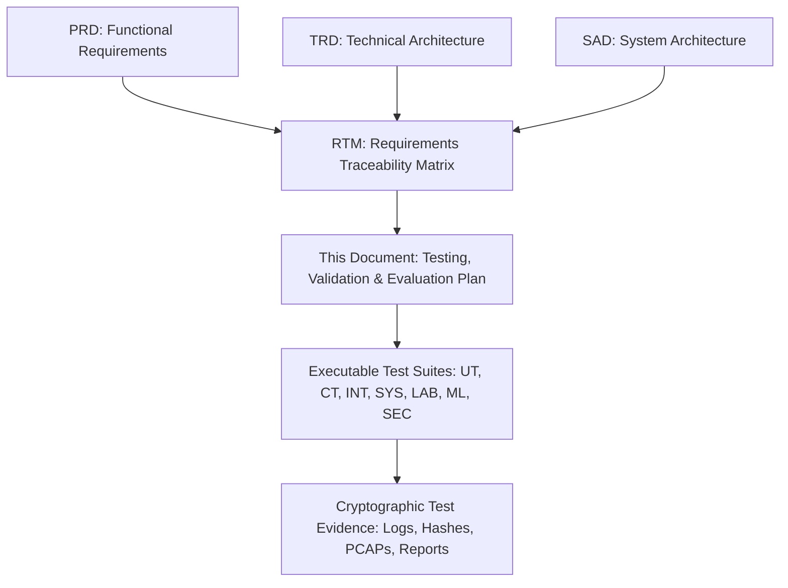
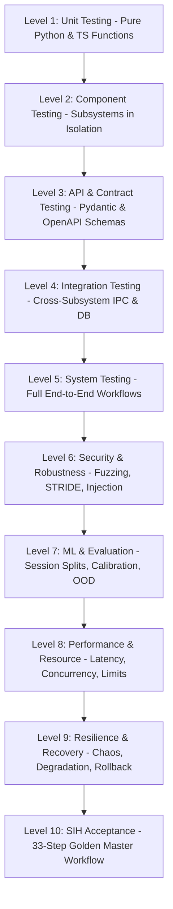
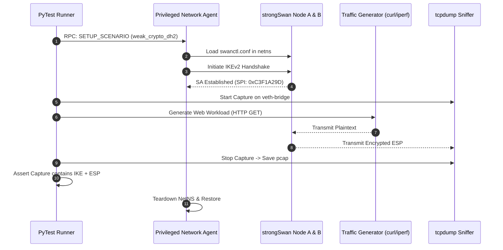
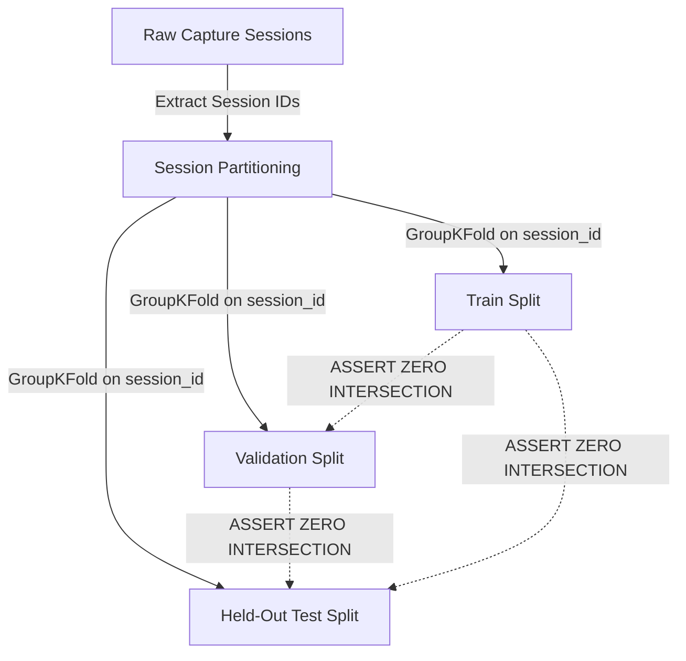
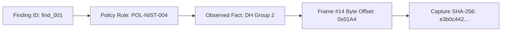

# TESTING, VALIDATION & EVALUATION PLAN
## [PROJECT NAME] — IPsec Security Intelligence Platform
### Smart India Hackathon 2026 — Problem Statement ID: 26160 (PS 160)
#### Sponsoring Organization: National Technical Research Organisation (NTRO) | Theme: Blockchain & Cybersecurity

---

## 1. Document Control

| Property | Value |
| :--- | :--- |
| **Document Title** | Testing, Validation & Evaluation Plan |
| **Document Identifier** | `TT-TEST-2026-V1.0` |
| **Product Working Descriptor** | IPsec Security Intelligence Platform |
| **Official Application Baseline** | [PROJECT NAME] (TunnelTrace AI) |
| **Problem Statement ID** | 26160 (PS 160) |
| **Sponsoring Agency** | National Technical Research Organisation (NTRO) |
| **Document Classification** | Technical Specification / Quality Assurance & Verification Baseline |
| **Document Status** | Approved Engineering Specification (TESTS DESIGNED / AWAITING EXECUTION) |
| **Author** | Principal QA Architect, V&V Lead, Protocol Test Lead & ML Evaluation Lead |
| **Current Document Version** | `1.0.0` |
| **Release Date** | September 2026 |
| **Applicable Target Environment** | Local-First Docker Compose / Privileged Linux Testbed / SIH Demo Environment |

---

## 2. Revision History

| Version | Release Date | Author / Role | Summary of Changes |
| :--- | :--- | :--- | :--- |
| `0.1.0` | 2026-09-17 | QA Lead & Backend Test Eng | Initial draft of test levels, environments, and unit test framework. |
| `0.5.0` | 2026-09-19 | Protocol Validation Specialist | Added strongSwan testbed scenarios, protocol ground truth, and SA graph tests. |
| `0.9.0` | 2026-09-21 | ML Evaluation & AppSec Lead | Added ML evaluation, session split leakage audit, calibration, and STRIDE tests. |
| `1.0.0` | 2026-09-22 | Principal V&V Architect | Finalized 99 sections, 13 Mermaid diagrams, 34 matrices, zero-hallucination compliance. |

---

## 3. Purpose

This document establishes the definitive **Testing, Validation & Evaluation Plan** for **[PROJECT NAME]**. It serves as the master contract proving that every capability required by the National Technical Research Organisation (NTRO) under Smart India Hackathon 2026 Problem Statement 26160 is:
1. **Verifiable:** Mapped to deterministic, repeatable test cases with unambiguous expected outcomes.
2. **Defensible:** Grounded in observable protocol evidence, controlled lab testbeds, and mathematically sound statistical methods.
3. **Auditable:** Backed by persistent cryptographic evidence artifacts (hashes, logs, PCAPs, manifests).
4. **Resilient:** Verified under severe network impairments, parser fuzzing, malformed inputs, and degraded platform states.

This document governs all verification and validation activities from initial unit development through the final SIH 2026 evaluation.

---

## 4. Scope

This plan governs testing across all functional, architectural, and operational domains:
- **Protocol Analysis:** IKEv1/IKEv2 handshakes, ESP/AH parsing, NAT-Traversal, transform extraction, and SA lifecycle tracking.
- **Controlled Lab Testbed:** strongSwan network namespace automation, traffic generators, and `tc/netem` network impairment injection.
- **Machine Learning Subsystem:** Encrypted flow reconstruction, tabular feature extraction, XGBoost classifier, 1D-CNN temporal sequence model, dual ensemble, Platt temperature calibration, predictive entropy OOD detection, TreeSHAP explainability, and Isolation Forest anomaly detection.
- **Security & Compliance:** Declarative YAML Policy-as-Code engine, NIST SP 800-77 Rev. 1 / RFC 8221 evaluation, 0–100 Security Score, Threat Matrix generation, Configuration Twin what-if projections, and verified lab remediation.
- **Platform Engineering:** Next.js 14 frontend, FastAPI backend, Celery/Redis task queue, PostgreSQL 15 `pgvector` persistence, MinIO storage, WebSockets, and PWA responsiveness.
- **Security & Privacy:** Parser fuzzing, privileged network agent isolation, prompt injection defense, and data exfiltration prevention.

---

## 5. Relationship to PRD / RTM / TRD / SAD



- **[PRD.md](file:///c:/SHARAN%20PROJECTS/TunnelTrace%20AI/docs/PRD.md):** Defines functional mandates (`LAB-`, `CAP-`, `PROTO-`, `ML-`, `SEC-`, etc.).
- **[RTM.md](file:///c:/SHARAN%20PROJECTS/TunnelTrace%20AI/docs/RTM.md):** Maps each requirement ID to specific test identifiers (`TEST-PROTO-001`, `TEST-ML-001`).
- **[TRD.md](file:///c:/SHARAN%20PROJECTS/TunnelTrace%20AI/docs/TRD.md):** Defines mathematical formulations, transform lookup tables, and subsystem schemas.
- **[SYSTEM_ARCHITECTURE.md](file:///c:/SHARAN%20PROJECTS/TunnelTrace%20AI/docs/SYSTEM_ARCHITECTURE.md):** Defines Execution Class A (unprivileged) vs. Class B (privileged) boundaries.

---

## 6. Quality Objectives

1. **Deterministic Accuracy:** 100% agreement between deterministic protocol extraction and ground-truth lab configurations.
2. **Zero Train/Test Leakage:** Absolute session-level isolation (`GroupKFold` on `session_id`) across all ML dataset splits.
3. **Evidence-Driven Posture:** Zero ungrounded security findings; 100% of findings link to byte-level packet offsets and versioned policy rules.
4. **Remediation Integrity:** Zero unverified remediations; mandatory post-remediation capture and re-analysis before declaring a finding resolved.
5. **Fail-Closed Stability:** System gracefully rejects malformed inputs, oversized captures, or hostile shell injection without host compromise.

---

## 7. V&V Principles

```
[ REQUIREMENT ] ──► [ TEST CASE ] ──► [ CONTROLLED EXECUTION ]
                                                │
                                                ▼
[ TRACEABILITY ] ◄── [ EVALUATION ] ◄── [ RETAINED EVIDENCE ]
```

1. **No Requirement Without a Test:** Every functional claim in the PRD must have at least one test case.
2. **No Test Without Evidence:** A test run is invalid unless its execution logs, PCAP hashes, or evaluation metrics are preserved.
3. **Execution Precedes Status:** A test status is strictly `NOT EXECUTED` or `TEST DESIGNED` until physical execution occurs. Zero fabricated `PASS` results.
4. **Preservation of Uncertainty:** The platform explicitly tests that missing evidence yields `UNKNOWN`, verifying the engine never guesses.
5. **Real Network Primacy:** Software mocks are permitted for unit tests, but core PS claims require real strongSwan network namespace validation.

---

## 8. Assumptions

1. **Linux Kernel Capabilities:** The privileged lab environment runs Linux kernel $\ge 5.15$ with native `xfrm`, `netns`, `tc`, and `BPF` support.
2. **Dissection Baseline:** TShark $\ge 4.0$ is available in the worker container and accurately dissects standard RFC 7296 and RFC 4303 headers.
3. **Capture Ground Truth:** Traffic generated inside the strongSwan testbed has 100% known ground-truth parameters based on active `swanctl.conf`.

---

## 9. Constraints

1. **Air-Gapped Execution:** Tests must run without internet access, verifying offline model inference and local standards RAG.
2. **No Payload Decryption:** Tests must verify that the ML classifier operates exclusively on observable packet metadata (size, timing, direction).
3. **Deterministic Score Verification:** Scoring tests must prove mathematical reproducibility ($S_{\text{run 1}} = S_{\text{run 2}}$ on identical findings).

---

## 10. Test Status Model

Every test case in this plan exists in one of the following official lifecycle states:

| Status Identifier | Strict Definition | Transition Rule |
| :--- | :--- | :--- |
| `TEST_DESIGNED` | Test case specification written, parameters defined, preconditions documented. | Initial state for all tests prior to testbed implementation. |
| `READY_TO_EXECUTE` | Test environment provisioned, fixtures loaded, test scripts validated. | Requires target build deployment. |
| `EXECUTING` | Test actively running in automated runner or controlled lab. | Active execution lock. |
| `PASSED` | Actual execution matched expected result 100%; evidence artifact captured. | Requires verified log/evidence hash. |
| `FAILED` | Actual result diverged from expected result; defect logged in tracker. | Generates linked Defect ID. |
| `BLOCKED` | Prerequisite environmental component or dependency failed. | Requires documented blocker defect. |
| `NOT_APPLICABLE` | Test skipped due to unsupported optional hardware/feature profile. | Documented architectural exclusion. |

---

## 11. Priority Model

- **P0 (Critical / Mandatory PS Requirement):** Mandatory for SIH demonstration. Core protocol dissection, ML classification, security compliance, reports, and testbed.
- **P1 (High / Core Product Correctness):** SA topology graph, TreeSHAP explanations, Configuration Twin, local RAG analyst, role authorization.
- **P2 (Medium / Platform Hardening):** High-volume stress testing, cross-browser compatibility, export formats, dark/light theme switching.
- **P3 (Low / Future Research):** IP-TFS evaluation, hardware token signing, multi-node clustering.

---

## 12. Defect Model

| Defect Severity | Operational Impact | Resolution SLA (SIH Prototype) | Example Defect |
| :--- | :--- | :--- | :--- |
| **SEV-1 (Blocker)** | System crash, incorrect cryptographic finding, unhandled parser panic, broken demo flow. | Immediate (< 4 hours) | TShark parser crash on fragmented IKE packets. |
| **SEV-2 (Critical)** | Core feature failure, incorrect ML traffic label on baseline flow, broken remediation rollback. | High (< 12 hours) | Remediation fails to restore previous `swanctl.conf`. |
| **SEV-3 (Major)** | UI display anomaly, WebSocket disconnect recovery failure, export formatting issue. | Medium (< 24 hours) | React Flow graph fails to render rekey edge. |
| **SEV-4 (Minor)** | Cosmetic defect, minor UI alignment issue, non-misleading typo in explanation. | Low (Deferred/Post-Demo) | Padding discrepancy in mobile drawer view. |

---

## 13. Test Levels



---

## 14. Test Environments

| Environment Identifier | Infrastructure & Tooling | Purpose / Capabilities | Privileges Required |
| :--- | :--- | :--- | :--- |
| **ENV-01: Developer Local** | macOS / Windows / Linux with Docker Compose | Unit tests, component tests, mock API integration | Unprivileged (`node`, `python`) |
| **ENV-02: Headless CI** | GitHub Actions / GitLab CI Linux Runner | Automated linting, SAST, unit tests, contract tests | Unprivileged Docker |
| **ENV-03: Linux Protocol Testbed** | Dedicated Ubuntu 22.04 Host / KVM Guest | strongSwan 5.9+, Linux `netns`, `tc/netem`, `tcpdump` | Privileged (`CAP_NET_ADMIN`, `CAP_NET_RAW`) |
| **ENV-04: ML Training & Eval** | Linux Workstation with NVIDIA GPU / CPU | Feature extraction, XGBoost/CNN training, calibration | Standard compute user |
| **ENV-05: SIH Demo Appliance** | Dedicated Air-Gapped Laptop / Edge Server | 100% local execution of full stack + strongSwan lab | Dual: Class A unprivileged + Class B agent |

---

## 15. Test Data Strategy

```
                          TEST DATA REPOSITORY
  ┌───────────────────────────────┬───────────────────────────────┐
  │     Controlled Lab Data       │    Adversarial / Malformed    │
  ├───────────────────────────────┼───────────────────────────────┤
  │ • IPsecFlowBench (Native)     │ • Fuzzed IKE Packets          │
  │ • Golden PCAP Fixtures (v1)   │ • Truncated / Zero-Byte PCAPs │
  │ • Network Impairment Traces   │ • Inverted Sequence Floods    │
  └───────────────────────────────┴───────────────────────────────┘
```

All test captures are versioned, cataloged with SHA-256 checksums, and stored in `/tests/fixtures/captures/`. Raw enterprise customer traffic is strictly prohibited in automated test suites.

---

## 16. Golden PCAP Fixtures

| Fixture ID | File Name | Scenario Description | Expected Protocol Fact | Expected Security State | Verification Status |
| :--- | :--- | :--- | :--- | :--- | :--- |
| `FIX-01` | `ikev2_aes_gcm_dh19.pcap` | Compliant IKEv2 AES-GCM-256 with ECP-256 (Group 19) | IKEv2, AES-GCM, DH-19, ESP | `PASS` (NIST Profile) | `FIXTURE_PREPARED` |
| `FIX-02` | `ikev2_3des_dh2.pcap` | Insecure IKEv2 with 3DES-CBC and MODP-1024 (Group 2) | IKEv2, 3DES, DH-2, ESP | `FAIL` (POL-NIST-001, 004) | `FIXTURE_PREPARED` |
| `FIX-03` | `ikev1_legacy_main.pcap` | Deprecated IKEv1 Main Mode with PSK authentication | IKEv1, DES, DH-1 | `FAIL` (POL-IKE-001) | `FIXTURE_PREPARED` |
| `FIX-04` | `esp_only_notext.pcap` | ESP data frames without initial IKE negotiation | ESP detected, IKE missing | `UNKNOWN` (Handshake missing) | `FIXTURE_PREPARED` |
| `FIX-05` | `nat_t_udp4500.pcap` | IKEv2 NAT-Traversal encapsulated in UDP port 4500 | NAT-T detected, ESP in UDP | `PASS` | `FIXTURE_PREPARED` |

---

## 17. Test Evidence Strategy

For every executed test, the automated harness captures an immutable evidence package in `/tests/evidence/<test_id>/<timestamp>/`:
- `execution.log`: Complete stdout/stderr of the test runner.
- `input_manifest.json`: SHA-256 hashes of all input captures, policy YAMLs, and model binaries.
- `output_payload.json`: Exact JSON response produced by the target subsystem.
- `diff_result.patch`: Cryptographic diff between expected and actual outputs.

---

## 18. Traceability Strategy

Traceability is maintained through strict bidirectional linking:
$$\text{Requirement ID (PRD/RTM)} \iff \text{Test Case ID} \iff \text{Test Script File} \iff \text{Evidence Directory}$$
An automated CI check (`scripts/verify_rtm_coverage.py`) validates that no PRD requirement exists without an active test binding.

---

## 19. Unit Testing

- **Framework:** `pytest` (Backend / Python), `Jest` (Frontend / TypeScript).
- **Scope:** Pure functions: bitmask dissectors, transform ID mapping, IAT calculation, entropy math, Pydantic validators.
- **Rule:** Fast execution (< 50 ms per test); zero filesystem or network I/O.

---

## 20. Component Testing

- **Scope:** Isolated subsystem testing: TShark JSON parser against mock streams, Policy Engine against static fact dicts, ML feature extractor against raw packet arrays.
- **Isolation:** Database interactions mocked using SQLite in-memory or mock repositories.

---

## 21. API Contract Testing

- **Framework:** `schemathesis` / `pytest-httpx`.
- **Validation:** Verifies FastAPI endpoints against OpenAPI 3.1 definitions; asserts status codes, mandatory response keys, and error schemas.

---

## 22. Integration Testing

- **Scope:** Cross-component execution: FastAPI $\rightarrow$ Redis $\rightarrow$ Celery Worker $\rightarrow$ PostgreSQL 15.
- **Environment:** Multi-container Docker Compose with ephemeral databases initialized via Alembic.

---

## 23. System Testing

- **Scope:** Complete end-to-end execution: PCAP upload $\rightarrow$ parsing $\rightarrow$ ML classification $\rightarrow$ policy auditing $\rightarrow$ report generation.

---

## 24. Testbed Validation



---

## 25. Capture Validation

Tests verify that the ingestion pipeline properly classifies incoming binary streams:
- `PCAP` vs. `PCAPNG` format auto-detection.
- Detection of non-IP packets (ARP storm rejection).
- Handling of mixed IKEv2 + ESP streams.

---

## 26. Protocol Forensics Validation

Validates deterministic extraction against known strongSwan parameters:

```
[Known swanctl.conf] ──► [Captured Frame Bytes] ──► [TShark Dissector] ──► [Extracted Fact]
         │                                                                          │
         └──────────────────────── EXACT MATCH ASSERTION ───────────────────────────┘
```

---

## 27. IKE Validation

- Deterministic extraction of IKE Major/Minor versions.
- Parser validation for IKE_SA_INIT, IKE_AUTH, CREATE_CHILD_SA exchanges.
- Extraction of encryption, PRF, integrity, and DH transform IDs.

---

## 28. ESP/AH Validation

- Verification of 32-bit and 64-bit Extended Sequence Numbers (ESN).
- Detection of SPI values from wire packets.
- Inbound vs. Outbound flow separation.

---

## 29. SA Reconstruction Validation

- Association of bidirectional SPI pairs into unified Security Association records.
- Validation of Child SA rekey tracking across sequential exchanges.

---

## 30. Flow Reconstruction Validation

- Extraction of 5-tuple bidirectional flows from raw ESP streams.
- Timeout validation: idle timeout ($T_{\text{idle}} = 60\text{s}$) and active timeout ($T_{\text{active}} = 300\text{s}$).

---

## 31. Feature Engineering Validation

Verifies mathematical correctness of the 24 tabular features:
- Mean, standard deviation, and median of packet lengths.
- Forward-to-reverse packet and byte ratios.
- Inter-arrival time (IAT) statistics.

---

## 32. Dataset Quality Validation

Pre-training validation of `IPsecFlowBench`:
- Confirmation that every session possesses ground-truth metadata.
- Automated duplicate capture detection via SHA-256 hashing.

---

## 33. Dataset Leakage Prevention



*Automated Gate:* CI script `tests/ml/test_split_leakage.py` asserts:
$$\text{Sessions}(\text{Train}) \cap \text{Sessions}(\text{Test}) = \emptyset$$

---

## 34. ML Baseline Evaluation

Validates that complex models outperform simple heuristics:
- Baseline 1: Majority Class Classifier.
- Baseline 2: Logistic Regression on packet size statistics.

---

## 35. XGBoost Evaluation

- Evaluated on held-out test sessions using the 24 engineered features.
- Primary metric: Macro-F1 across all 7 traffic classes.

---

## 36. 1D-CNN Evaluation

- Evaluates temporal sequence inputs $[ \text{direction}, \text{length}, \Delta t ]$ across candidate sequence lengths ($N \in \{32, 64, 128\}$).
- Assesses trade-off between inference latency and classification accuracy.

---

## 37. Ensemble Evaluation

Validates that probability fusion ($P_{\text{ensemble}} = \alpha P_{\text{XGB}} + (1-\alpha) P_{\text{CNN}}$) provides statistically significant Macro-F1 improvement over individual models.

---

## 38. Calibration Evaluation

Validates user-facing confidence reliability:
- Generates Reliability Diagrams (10 confidence bins).
- Computes Expected Calibration Error (ECE) and Brier Score before and after Platt temperature scaling.

---

## 39. AI Confidence Validation

Asserts that raw maximum softmax probabilities are **never** directly returned as user confidence without calibration.

---

## 40. OOD / Unknown Validation

- Injects unseen traffic classes (e.g., DNS-over-HTTPS, BitTorrent) into the evaluation pipeline.
- Asserts that predictive Shannon entropy exceeding threshold $H_{\text{threshold}}$ returns `UNKNOWN / UNSEEN TRAFFIC`.

---

## 41. Explainability Validation

- Validates that TreeSHAP feature attributions correspond directly to the specific flow's feature vector.
- Asserts that SHAP calculation failures degrade gracefully without crashing the classification response.

---

## 42. Behavioral Anomaly Validation

- Evaluates Isolation Forest anomaly detection on abnormal traffic volume and packet rate spikes.
- Asserts that anomaly outputs are labeled `ANOMALOUS BEHAVIOR`, never `ATTACK DETECTED`.

---

## 43. Cross-Configuration Evaluation

Tests model generalization across unseen VPN configuration families:
- Model trained on IPv4 tested on IPv6.
- Model trained on AES-GCM tested on AES-CBC + HMAC.

---

## 44. Cross-Endpoint Evaluation

Evaluates classification performance across independent endpoint IP pairs to prove the model is not memorizing IP addresses.

---

## 45. Network-Condition Robustness

Evaluates classifier resilience under injected `tc/netem` network impairments:
- Latency variation: 10 ms to 200 ms.
- Packet jitter: 5 ms to 50 ms.
- Packet loss: 0.5% to 5.0%.

---

## 46. Metadata Fingerprintability Validation

- Verifies that the fingerprintability engine produces reproducible distinguishability scores.
- Asserts that reports never describe the score as "percentage of plaintext leaked".

---

## 47. Policy Engine Validation

Every YAML compliance rule undergoes a 3-fixture test:
1. **Compliant Fixture:** Produces `PASS`.
2. **Non-Compliant Fixture:** Produces `FAIL`.
3. **Incomplete Fixture:** Produces `UNKNOWN`.

---

## 48. Compliance Validation

Asserts that rule evaluation outputs only legitimate compliance states (`PASS`, `FAIL`, `UNKNOWN`, `NOT_APPLICABLE`).

---

## 49. PFS Validation

- Evaluates `CREATE_CHILD_SA` exchanges for Key Exchange (KE) payloads.
- Asserts that when Child SA rekey packets are absent from the capture, PFS status evaluates to `UNKNOWN`.

---

## 50. Replay Assessment Validation

- Evaluates monotonic ESP sequence numbers.
- Asserts that the system reports receiver-side replay window configuration as `UNKNOWN` when not observable on the wire.

---

## 51. Key Lifetime Validation

- Computes elapsed time and byte volume per SPI.
- Distinguishes observed session lifetime from configured appliance lifetime.

---

## 52. Security Score Validation

- Evaluates mathematical reproducibility: identical findings must yield identical scores.
- Validates correlated finding de-duplication (preventing double penalty for linked cipher weaknesses).

---

## 53. Risk Model Validation

Validates composite risk matrix calculation ($R = f(\text{Severity}, \text{Likelihood}, \text{Impact}, \text{Evidence})$).

---

## 54. Threat Matrix Validation

Asserts that 100% of generated threat matrix rows trace to structured findings, with zero generative AI hallucinations.

---

## 55. Evidence / Provenance Validation



Automated test `test_evidence_provenance_chain` traverses this graph from UI finding back to raw capture bytes.

---

## 56. Configuration Twin Validation

- Evaluates virtual configuration modifications against policy rules.
- Asserts that all twin outputs carry the mandatory `[PROJECTED]` status tag.

---

## 57. Remediation Validation

- Asserts that automated remediation execution is strictly restricted to the controlled strongSwan lab.
- Verifies syntax checking of generated `swanctl.conf` patches prior to execution.

---

## 58. Remediation Verification

- Verifies the full closed-loop remediation workflow:
  $$\text{Apply Patch} \rightarrow \text{Restart Tunnel} \rightarrow \text{Recapture Traffic} \rightarrow \text{Re-Analyze} \rightarrow \text{Compare Findings}$$

---

## 59. Rollback Validation

- Injects an invalid configuration directive (`cipher = invalid_ciph_999`).
- Asserts that tunnel restart failure triggers automatic atomic rollback to the backup configuration within 30 seconds.

---

## 60. Report Validation

- Validates generation of Executive (PDF) and Technical (JSON/PDF) reports.
- Asserts that `UNKNOWN` evidence states are preserved in report text and never replaced with speculative assertions.

---

## 61. AI Analyst / RAG Validation

- Evaluates local LLM explanations against ground-truth findings.
- **Prompt Injection Guard:** Injects hostile command strings into IKE identification payloads and asserts the AI treats them as passive data bytes.

---

## 62. Database Testing

- Validates PostgreSQL Alembic migration scripts (upgrade and downgrade).
- Asserts foreign key cascade rules and `pgvector` index creation.

---

## 63. Object Storage Testing

- Verifies private bucket access, presigned URL expiration (900s), and cryptographic deletion.

---

## 64. Redis / Worker Testing

- Validates Celery task retry logic, JSON serialization, and message deduplication.

---

## 65. UI Functional Testing

- Automated Playwright tests across all 14 screens defined in the Design System.

---

## 66. Responsive Testing

- Validates layout integrity across Desktop (1920x1080), Tablet (1024x768), and Mobile (375x812).

---

## 67. Theme Testing

- Validates high-contrast brutalist styling in default Light Theme (`#F7F7F4`) and secondary Dark Theme (`#0A0A0A`).

---

## 68. Accessibility Testing

- Automated axe-core scans asserting WCAG 2.2 AA compliance (color contrast $\ge 4.5:1$, visible focus indicators).

---

## 69. PWA Testing

- Validates service worker registration, offline shell caching, and ensures sensitive captures are never cached locally.

---

## 70. Application Security Testing

- SAST scans (`bandit`, `eslint-plugin-security`) and dependency vulnerability scans (`pip-audit`, `npm audit`).

---

## 71. PCAP Input Security Testing

- Ingestion of hostile captures: corrupted magic bytes, $2^{31}$-byte packet lengths, circular loops.
- Asserts unprivileged worker container isolation and memory quota enforcement (`RLIMIT_AS`).

---

## 72. Privileged-Agent Security Testing

- Asserts that the Privileged Network Agent accepts only typed RPC allowlisted commands over local UNIX socket; zero shell command execution.

---

## 73. Model/Policy Integrity Testing

- Injects 1-bit corrupted model binaries and unsigned policy YAMLs; asserts backend startup aborts with checksum alerts.

---

## 74. Privacy Testing

- Inspects application logs to verify zero leakage of credentials, PSKs, or raw packet payloads.

---

## 75. Deployment Testing

- Automated validation of Docker Compose startup (`docker compose up --build`).

---

## 76. Smoke Testing

Post-deployment smoke test suite:
1. `GET /api/v1/system/health/ready` returns `READY`.
2. Upload `FIX-01` $\rightarrow$ Analysis completes $\rightarrow$ Score generated $\rightarrow$ PDF downloads.

---

## 77. Graceful Degradation

- Tests platform behavior when optional components fail (LLM outage, ML inference failure, Privileged Agent unavailable).

---

## 78. Failure / Recovery Testing

- Hard termination of Celery worker (`kill -9`); asserts task recovery and queue stability upon worker restart.

---

## 79. Performance Testing

- Benchmarking capture parsing, ML inference latency, and report generation times across capture size tiers (10 MB, 100 MB, 500 MB).

---

## 80. Resource Benchmarking

- Continuous monitoring of CPU and RAM usage during 500 MB capture ingestion, verifying memory usage remains under 2 GB per worker.

---

## 81. Concurrency Testing

- Simultaneous execution of 5 concurrent capture analysis tasks, asserting zero cross-workspace data leakage.

---

## 82. Regression Strategy

- Automated execution of the Golden PCAP suite on every code commit touching dissectors, policy rules, or ML pipelines.

---

## 83. CI Test Strategy

- Fast CI (< 5 minutes): Linters, type checks, unit tests, contract tests.
- Nightly CI: Full strongSwan testbed matrix and ML model evaluation.

---

## 84. Release Gates

| Release Gate | Criteria for Promotion | Verification Proof |
| :--- | :--- | :--- |
| **Gate 1: Commit Merge** | 100% Unit & Contract tests pass; zero lint errors | CI Green Check |
| **Gate 2: Candidate Build** | Golden PCAP regression passes; zero SEV-1/SEV-2 defects | Automated Test Report |
| **Gate 3: SIH Demo Gate** | 33-step Golden Acceptance Workflow executes successfully | Signed Execution Log |

---

## 85. SIH Golden E2E Acceptance

The master acceptance test for the SIH 2026 evaluation:

```
[Start strongSwan Lab] ──► [Establish IKEv2 Tunnel] ──► [Generate VoIP Workload]
                                                                  │
                                                                  ▼
[Trace Byte Evidence] ◄── [Verify Score 85] ◄── [Classify VoIP] ◄── [Capture ESP]
         │
         ▼
[Apply Remediation Patch] ──► [Recapture] ──► [Re-Analyze] ──► [Verify Score 100]
```

---

## 86. Demo Fallback Validation

Validates three distinct operational fallback levels:
- **Level 1 (Primary):** Live interactive strongSwan network namespace lab.
- **Level 2 (Secondary Fallback):** Pre-captured real testbed PCAP files.
- **Level 3 (Tertiary Fallback):** Stored immutable golden capture files.

---

## 87. Deliverable Acceptance

Validates that all official deliverables (working prototype, AI classifier, dashboard, reports, video, documentation, dataset) meet NTRO standards.

---

## 88. Test Reporting

- Automated generation of JUnit XML and Markdown test execution summaries.

---

## 89. Defect Management

- Structured tracking of defects linking directly to failing Test IDs and reproduction PCAPs.

---

## 90. Retest / Regression Rules

- Resolving a defect requires re-executing the failed test plus the entire related functional test suite.

---

## 91. Test Ownership

| Component Area | Responsible Role | Primary Test Suites |
| :--- | :--- | :--- |
| **Protocol Forensics** | Protocol Validation Lead | `TEST-PROTO-*`, `TEST-SA-*` |
| **Machine Learning** | ML Evaluation Lead | `TEST-ML-*`, `TEST-CAL-*`, `TEST-OOD-*` |
| **Security & Compliance** | Security Assurance Lead | `TEST-SEC-*`, `TEST-COMP-*`, `TEST-REM-*` |
| **Platform & UI** | Full-Stack QA Engineer | `TEST-API-*`, `TEST-UI-*`, `TEST-PWA-*` |

---

## 92. Requirement $\rightarrow$ Test Matrix

| Req ID | Requirement Description | Priority | Test ID | Environment | Expected Result | Status |
| :--- | :--- | :--- | :--- | :--- | :--- | :--- |
| `CAP-01` | Ingest PCAP/PCAPNG Files | P0 | `TEST-CAP-001` | ENV-01 / Docker | File validated, SHA-256 registered | `TEST_DESIGNED` |
| `CAP-02` | Live Wire Capture | P0 | `TEST-CAP-002` | ENV-03 / Linux | Realtime packets captured via libpcap | `TEST_DESIGNED` |
| `PROTO-01` | Detect IPsec Presence | P0 | `TEST-PROTO-001`| ENV-01 / Docker | ESP/AH protocol presence confirmed | `TEST_DESIGNED` |
| `PROTO-02` | Extract IKE Version | P0 | `TEST-PROTO-002`| ENV-01 / Docker | IKEv1 or IKEv2 deterministically identified | `TEST_DESIGNED` |
| `PROTO-03` | Extract Negotiated Transforms | P0 | `TEST-PROTO-003`| ENV-01 / Docker | ENCR, PRF, INTEG, DH transforms parsed | `TEST_DESIGNED` |
| `FLOW-01` | Reconstruct ESP Flows | P0 | `TEST-FLOW-001` | ENV-01 / Docker | Bidirectional flows grouped by SPI/IP | `TEST_DESIGNED` |
| `ML-01` | Encrypted Traffic Classification| P0 | `TEST-ML-001` | ENV-04 / GPU | Flow assigned to 1 of 7 traffic classes | `TEST_DESIGNED` |
| `ML-02` | Calibrated Confidence Score | P0 | `TEST-CAL-001` | ENV-04 / GPU | Platt scaled confidence ($0-100\%$) | `TEST_DESIGNED` |
| `ML-03` | OOD / Unknown Detection | P0 | `TEST-OOD-001` | ENV-04 / GPU | High entropy flows return `UNKNOWN` | `TEST_DESIGNED` |
| `SEC-01` | NIST SP 800-77 Compliance | P0 | `TEST-COMP-001` | ENV-01 / Docker | Automated `PASS`/`FAIL` per rule | `TEST_DESIGNED` |
| `SEC-02` | 0–100 Security Posture Score | P0 | `TEST-SCR-001` | ENV-01 / Docker | Score computed with traceable deductions | `TEST_DESIGNED` |
| `REM-01` | Configuration Security Twin | P1 | `TEST-TWIN-001` | ENV-01 / Docker | Projected compliance and score displayed | `TEST_DESIGNED` |
| `REM-02` | Lab Remediation Verification | P0 | `TEST-REM-001` | ENV-03 / Linux | Closed-loop re-analysis verifies resolution| `TEST_DESIGNED` |
| `RPT-01` | Executive & Technical Reports | P0 | `TEST-RPT-001` | ENV-01 / Docker | Tamper-evident PDF/JSON generated | `TEST_DESIGNED` |
| `AI-01` | Grounded AI Security Analyst | P1 | `TEST-AI-001` | ENV-01 / Docker | Natural language answer with citations | `TEST_DESIGNED` |

---

## 93. Official PS Validation Matrix

| PS 160 Mandate Dimension | Test Case ID | Test Data / Scenario | Target Expected State | Status |
| :--- | :--- | :--- | :--- | :--- |
| **Tunnel Mode** | `TEST-LAB-001` | strongSwan Tunnel Mode config | Mode = `TUNNEL` (Verified) | `TEST_DESIGNED` |
| **Transport Mode** | `TEST-LAB-002` | strongSwan Transport Mode config | Mode = `TRANSPORT` (Verified) | `TEST_DESIGNED` |
| **AES-128 Cipher** | `TEST-LAB-003` | `esp = aes128-sha256!` | Transform = `AES-CBC-128` | `TEST_DESIGNED` |
| **AES-256 Cipher** | `TEST-LAB-004` | `esp = aes256-sha256!` | Transform = `AES-CBC-256` | `TEST_DESIGNED` |
| **AES-GCM Cipher** | `TEST-LAB-005` | `esp = aes256gcm16!` | Transform = `AES-GCM-256` (AEAD) | `TEST_DESIGNED` |
| **AES-CBC + HMAC** | `TEST-LAB-006` | `esp = aes128-sha256!` | Separate ENC and INT transforms | `TEST_DESIGNED` |
| **Diffie-Hellman Groups** | `TEST-LAB-007` | Group 2, 14, 19, 20 test runs | DH Group accurately extracted | `TEST_DESIGNED` |
| **PFS Enabled** | `TEST-LAB-008` | Child SA rekey with KE payload | PFS = `VERIFIED_ENABLED` | `TEST_DESIGNED` |
| **PFS Disabled** | `TEST-LAB-009` | Child SA rekey without KE payload | PFS = `VERIFIED_DISABLED` | `TEST_DESIGNED` |
| **IPv4 Deployment** | `TEST-LAB-010` | IPv4 addressing in netns | Outer IP = `IPv4` | `TEST_DESIGNED` |
| **IPv6 Deployment** | `TEST-LAB-011` | IPv6 addressing in netns | Outer IP = `IPv6` | `TEST_DESIGNED` |
| **VoIP Traffic** | `TEST-LAB-012` | SIP/RTP audio stream through tunnel | Class = `VOIP` | `TEST_DESIGNED` |
| **Chat / Messaging** | `TEST-LAB-013` | Interactive messaging burst stream | Class = `CHAT_MESSAGING` | `TEST_DESIGNED` |
| **Controlled WhatsApp** | `TEST-LAB-014` | Controlled lab trace (legal/opt-in) | Class = `CHAT_MESSAGING` (Controlled) | `TEST_DESIGNED` |
| **Email Traffic** | `TEST-LAB-015` | SMTP/IMAP message transfer | Class = `EMAIL` | `TEST_DESIGNED` |
| **Web Browsing** | `TEST-LAB-016` | HTTP/HTTPS browsing sessions | Class = `WEB` | `TEST_DESIGNED` |
| **ICMP Traffic** | `TEST-LAB-017` | Ping echo request/reply train | Class = `ICMP` | `TEST_DESIGNED` |
| **Video Streaming** | `TEST-LAB-018` | Chunked video transport stream | Class = `VIDEO_STREAMING` | `TEST_DESIGNED` |

---

## 94. SIH Demo Acceptance Matrix

| Demo Step | Demonstrated Capability | PS Requirement | Test ID | Required Evidence | Fallback Plan | Status |
| :--- | :--- | :--- | :--- | :--- | :--- | :--- |
| **Step 1** | Launch Appliance & Verify Health | Platform Readiness | `TEST-DEP-001` | Health API JSON: `READY` | Restart containers | `TEST_DESIGNED` |
| **Step 2** | Start strongSwan Lab Tunnel | Testbed Automation | `TEST-LAB-001` | `swanctl --list-sas` dump | Load Level 2 pre-captured PCAP | `TEST_DESIGNED` |
| **Step 3** | Transmit Live VoIP & Web Traffic | Traffic Generation | `TEST-LAB-012` | Traffic generator logs | Replay packet stream | `TEST_DESIGNED` |
| **Step 4** | Ingest Capture & Dissect Headers | Protocol Intelligence | `TEST-PROTO-001`| Dissection summary table | Ingest Level 3 golden fixture | `TEST_DESIGNED` |
| **Step 5** | Reconstruct Interactive SA Graph | Visual Forensics | `TEST-SA-002` | React Flow topology render | Static PNG topology export | `TEST_DESIGNED` |
| **Step 6** | Classify Encrypted Flows | AI Classification | `TEST-ML-001` | ML prediction table | Cached model prediction JSON | `TEST_DESIGNED` |
| **Step 7** | Explain Prediction via TreeSHAP | Explainability | `TEST-XAI-001` | SHAP waterfall chart render | Pre-rendered SHAP plot | `TEST_DESIGNED` |
| **Step 8** | Identify Weak DH Group 2 Finding | Security Assessment | `TEST-SEC-001` | Finding card with rule citation | Offline policy report | `TEST_DESIGNED` |
| **Step 9** | Trace Finding to Packet Frame | Evidence Provenance | `TEST-EVID-001`| Frame #14 byte inspector | WireShark hex screenshot | `TEST_DESIGNED` |
| **Step 10**| Simulate Hardening in Twin | Configuration Twin | `TEST-TWIN-001`| Projected score: 100/100 | Static twin diff view | `TEST_DESIGNED` |
| **Step 11**| Apply strongSwan Remediation | Lab Remediation | `TEST-REM-001` | `swanctl.conf` diff patch | Manual config injection | `TEST_DESIGNED` |
| **Step 12**| Verify Resolved Finding Post-Test | Closed-Loop Verification| `TEST-REM-002`| Status: `VERIFIED_RESOLVED` | Pre-verified before/after report | `TEST_DESIGNED` |
| **Step 13**| Download PDF Compliance Report | Executive Reporting | `TEST-RPT-001` | Signed PDF artifact | Pre-compiled PDF artifact | `TEST_DESIGNED` |
| **Step 14**| Query AI Analyst on Finding | Grounded AI RAG | `TEST-AI-001` | Natural language answer + RFC | Offline cached LLM response | `TEST_DESIGNED` |

---

## 95. Testing Risks

| Risk ID | Risk Description | Impact | Likelihood | Mitigating Test Control | Fallback Strategy |
| :--- | :--- | :--- | :--- | :--- | :--- |
| `TRSK-01`| strongSwan namespace crash during live test | High | Low | Automated watchdog script `lab_watchdog.sh` | Switch to Level 2 pre-captured PCAP |
| `TRSK-02`| ML classification mislabels bursty Web as VoIP | Medium | Medium | Temperature calibration + entropy OOD gating | Report lower confidence; explain via SHAP |
| `TRSK-03`| Large PCAP upload causes worker out-of-memory | High | Low | Memory limits (`RLIMIT_AS`) + packet count caps | Reject file with structured error code |
| `TRSK-04`| Local LLM execution exceeds latency budget | Medium | Medium | Asynchronous response streaming + timeout (15s) | Core assessment functions unaffected |
| `TRSK-05`| Wireless interference disrupts live demo bridge | High | Low | Isolated virtual bridge (`br-ipsec-lab`) on localhost | Zero external network dependencies |

---

## 96. Known Limitations Register

1. **Passive Antireplay Observability:** The analyzer can evaluate monotonic sequence numbers but cannot verify the receiver host's internal antireplay window size from wire packets alone.
2. **PFS Verification Boundary:** Perfect Forward Secrecy can only be deterministically verified if the capture encompasses a Child SA rekey exchange containing a Key Exchange payload.
3. **Encrypted Flow Side-Channels:** Traffic classification is probabilistic; application updates altering packet padding or multiplexing may temporarily reduce classification confidence.

---

## 97. Open Decisions / TBD Register

| Item ID | Open Decision / Architectural Parameter | Current Engineering Status | Resolution Strategy |
| :--- | :--- | :--- | :--- |
| `TBD-TST-01` | Minimum Macro-F1 Acceptance Threshold | *TBD — Requires empirical baseline.* | Establish baseline across 500 lab sessions. |
| `TBD-TST-02` | Exact ECE Calibration Target | *TBD — Default proposed: $\le 0.05$.* | Measure testbed reliability curves. |
| `TBD-TST-03` | Maximum Dissection Duration for 100 MB PCAP | *TBD — Proposed target: $\le 10\text{s}$.* | Benchmark TShark streaming worker. |
| `TBD-TST-04` | Final Automated Test Suite Execution Time | *TBD — Target: $\le 300\text{s}$ in CI.* | Optimize test parallelism via `pytest-xdist`.|

---

## 98. Glossary

- **ECE:** Expected Calibration Error.
- **ESN:** Extended Sequence Numbers (64-bit ESP sequence tracking).
- **GroupKFold:** Cross-validation splitting technique guaranteeing group-level separation.
- **Macro-F1:** Unweighted mean of F1-scores across all evaluated classes.
- **OOD:** Out-of-Distribution (unseen traffic patterns).
- **PFS:** Perfect Forward Secrecy.
- **RTM:** Requirements Traceability Matrix.
- **SAST:** Static Application Security Testing.
- **TreeSHAP:** Tree-based SHapley Additive exPlanations.
- **V&V:** Verification and Validation.
- **XFRM:** Linux kernel IPsec implementation framework.

---

## 99. References

1. **NIST SP 800-77 Rev. 1:** *Guide to IPsec VPNs*, National Institute of Standards and Technology, 2020.
2. **RFC 7296:** *Internet Key Exchange Protocol Version 2 (IKEv2)*, IETF, 2014.
3. **RFC 4303:** *IP Encapsulating Security Payload (ESP)*, IETF, 2005.
4. **IEEE Standard 1012-2016:** *IEEE Standard for System, Software, and Hardware Verification and Validation*, IEEE, 2017.
5. **ISO/IEC/IEEE 29119-3:2021:** *Software and Systems Engineering — Software Testing — Part 3: Test Documentation*, ISO/IEC/IEEE, 2021.
6. **OWASP Testing Guide v4.2:** OWASP Foundation, 2020.
7. **Guo et al.:** *On Calibration of Modern Neural Networks*, ICML, 2017.
