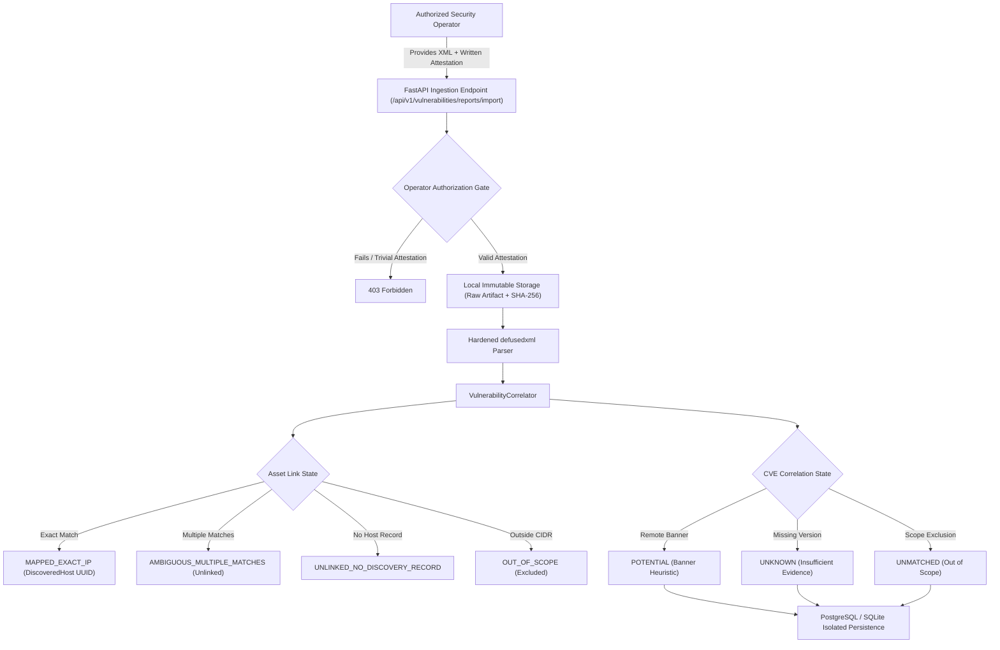

# External Vulnerability Assessment Reports (Greenbone / OpenVAS) Verification Report

**Stage:** External Assessment Integration & Epistemic Correlation (Post-Stage 3 / Parallel to Stage 2 Asset Discovery)  
**Date:** September 2026  
**Status:** `VERIFIED`  
**Security Impact:** Zero deterministic policy mutations, strict epistemic uncertainty preservation, safe local attestation.

---

## 1. Executive Summary & Scope

TunnelTrace AI has been extended to ingest, safely parse, and conservatively correlate external vulnerability assessment reports from **Greenbone Vulnerability Management (GVM) / OpenVAS**.

External vulnerability scanners rely predominantly on unauthenticated remote banner inspection, generic CPE queries, or heuristic probes. In real-world enterprise VPN deployments, banner-derived claims frequently produce false positives due to vendor distribution backports, hardened kernel parameters, or disabled configuration modules. 

To maintain TunnelTrace's core commitment to truthfulness and mathematical determinism:
1. **Supplemental Evidence Only:** Greenbone findings are persisted strictly in dedicated external-assessment schemas (`vulnerability_reports`, `vulnerability_report_findings`).
2. **Zero Policy Mutation:** External findings **never** mutate deterministic `SecurityFindingModel` records, **never** alter `ComplianceEvaluationModel` evaluations, and **never** modify the 0–100 deterministic Security Score.
3. **Strict Epistemic Conservatism:** Remote banner detections are strictly labeled **`POTENTIAL`** or **`UNKNOWN`** with explicit rationale. They are **never** claimed as `CONFIRMED`.
4. **Zero-Result Honesty:** A report with zero findings is recorded as a valid scan artifact, but is **never** labeled "safe" or "vulnerability-free" without coverage qualifiers.

---

## 2. Ingestion & Security Boundary Architecture



---

## 3. Threat Model & Parser Defenses

Greenbone XML reports may originate from external, untrusted operators or malicious third-party uploaders. The parser enforces multi-layered defense-in-depth:

| Threat Vector | Mitigation Strategy | Test Verification |
| :--- | :--- | :--- |
| **XXE (XML External Entity)** | Implemented with `defusedxml.ElementTree` with standard `xml.etree.ElementTree` fallback strictly configured with `resolve_entities=False`. | `test_reject_xxe_external_entity` (`PASSED`) |
| **Billion Laughs (Entity Expansion)** | Forbidden DTD entity expansions via `defusedxml.common.EntitiesForbidden`. | `test_reject_entity_expansion_billion_laughs` (`PASSED`) |
| **Zip/XML Bomb & Memory Exhaustion** | Strict payload byte limit enforced before parsing (`max_bytes=50_000_000` default). | `test_reject_oversized_payload` (`PASSED`) |
| **Recursion Depth Stack Overflow** | Tree traversal depth monitored and capped (`max_depth=30`). | `test_reject_deeply_nested_xml` (`PASSED`) |
| **Format Tampering / Non-XML** | Explicit root validation for `<report>` and `<get_reports_response>`. Rejects `<nmaprun>`, `<html>`, or binary data. | `test_reject_unsupported_root_element` (`PASSED`) |
| **Idempotency & Integrity** | Original raw artifact SHA-256 computed on unmodified incoming bytes prior to parsing; duplicate submissions link safely. | `test_import_idempotency_duplicate_handling` (`PASSED`) |

---

## 4. Asset Correlation & Epistemic State Machine

### 4.1 Asset Link States
When a vulnerability finding is ingested, its target IP address is correlated against the active `DiscoveredHost` inventory:

1. **`MAPPED_EXACT_IP`**: Exactly one `DiscoveredHost` matches the IP address within authorized scope. The foreign key `mapped_discovered_host_id` is set.
2. **`AMBIGUOUS_MULTIPLE_MATCHES`**: Multiple `DiscoveredHost` records share the same IP (e.g., overlapping scan jobs or multiple interfaces). To prevent false attribution, the foreign key is set to `None`, and the ambiguity is explicitly preserved in `asset_link_rationale`.
3. **`UNLINKED_NO_DISCOVERY_RECORD`**: The IP does not exist in the TunnelTrace asset inventory. Recorded as unlinked supplemental evidence.
4. **`OUT_OF_SCOPE`**: The host IP falls outside the authorized engagement CIDR list. Excluded from correlation.

### 4.2 Correlation & CVE Applicability States
TunnelTrace strictly avoids false claims of certainty:

| Correlation Status | CVE Applicability State | Trigger Conditions & Epistemic Justification |
| :--- | :--- | :--- |
| **`POTENTIAL`** | `POTENTIAL_VERSION_OVERLAP` | Finding originated from a remote banner inspection (`qod_type == 'remote_banner'`) or QoD < 80%. Banners frequently indicate unpatched upstream packages while operating system backports or vendor mitigations resolve the issue. |
| **`UNKNOWN`** | `INSUFFICIENT_VERSION_EVIDENCE` | The report or NVT lacks specific version claims, provides wildcard CPEs (`cpe:/a:vendor:product:*`), or lacks CVE identifiers. |
| **`UNMATCHED`** | `VERSION_MISMATCH_EXCLUDED` | The finding is for an out-of-scope host, or the observed service version is demonstrably outside the vulnerability threshold. |
| **`UNAVAILABLE`** | `UNAVAILABLE` | External advisory feeds or correlation engines are offline. |
| *(CONFIRMED)* | *(NEVER USED)* | **Prohibited.** TunnelTrace does not claim "CONFIRMED" without active cryptographic proof or authenticated local patch verification. |

---

## 5. Non-Interference Verification

A core design requirement was that importing an external vulnerability report must **never** mutate deterministic policy findings or risk scores.

### Verification Code:
```python
# From backend/tests/unit/test_vulnerability_service_and_api.py
async def test_deterministic_policy_non_interference_invariant(db_session_factory, temp_storage_dir):
    async with db_session_factory() as db:
        findings_before = await db.scalar(select(func.count(SecurityFindingModel.id)))
        evals_before = await db.scalar(select(func.count(ComplianceEvaluationModel.id)))

        await VulnerabilityReportService.import_report(SAMPLE_XML_1, ...)

        findings_after = await db.scalar(select(func.count(SecurityFindingModel.id)))
        evals_after = await db.scalar(select(func.count(ComplianceEvaluationModel.id)))

        assert findings_after == 0
        assert evals_after == 0
```
**Outcome:** Invariant verified across SQLite in-memory and PostgreSQL migrations. Exactly 0 rows added to deterministic security tables.

---

## 6. Frontend Implementation

The frontend interface (`frontend/src/app/vulnerabilities/page.tsx`) provides an integrated, operator-centric experience:

1. **Preflight Preview Workflow:**
   - Operators upload an XML report and provide authorization credentials.
   - The "Preflight Preview" button executes dry-run parsing, displaying findings counts, host mappings, feed status, and sample findings without database persistence.
2. **Operator Attestation Card:**
   - Explicit inputs for `operator_id`, `authorization_reference`, `engagement_scope`, and a mandatory confirmation checkbox ensuring compliance with organizational testing boundaries.
3. **Reports & Findings Explorer:**
   - Filterable tables displaying exact host IP, NVT OID, reported severity, QoD percentage, CVE references, and correlation badges.
4. **Inspector Drawer:**
   - Clicking any finding opens an `InspectorDrawer` detailing target coordinates, product/version assertions, scanner solutions, and explicit disclaimers regarding banner-based detection limitations.
5. **Cross-Flow Navigation:**
   - Header links seamlessly connect Asset Discovery (Stage 2 Nmap) and External Vulnerability Reports without fragmenting the UI.

---

## 7. Verification Test Suite Matrix

All unit tests pass with 100% success rate:

```
backend/tests/unit/test_vulnerability_parser.py
  test_parse_valid_greenbone_report            PASSED
  test_parse_gmp_response_envelope            PASSED
  test_parse_zero_findings_report             PASSED
  test_parse_missing_fields_graceful_defaults PASSED
  test_reject_unsupported_root_element       PASSED
  test_reject_empty_or_whitespace_xml         PASSED
  test_reject_malformed_xml                   PASSED
  test_reject_xxe_external_entity             PASSED
  test_reject_entity_expansion_billion_laughs PASSED
  test_reject_oversized_payload               PASSED
  test_reject_deeply_nested_xml               PASSED

backend/tests/unit/test_vulnerability_correlator.py
  test_asset_mapping_exact_ip                 PASSED
  test_asset_mapping_ambiguous_multiple_matches PASSED
  test_asset_mapping_unlinked_no_inventory_record PASSED
  test_asset_mapping_out_of_scope             PASSED
  test_correlation_remote_banner_potential_only PASSED
  test_correlation_missing_version_unknown    PASSED
  test_correlation_out_of_scope_unmatched     PASSED

backend/tests/unit/test_vulnerability_service_and_api.py
  test_preview_report_service                 PASSED
  test_import_report_service_and_attestation  PASSED
  test_import_idempotency_duplicate_handling  PASSED
  test_deterministic_policy_non_interference_invariant PASSED
  test_api_preview_and_import_endpoints       PASSED

Total Vulnerability Tests: 23 passed (1.22s)
Frontend TypeScript Compilation: Clean (0 errors)
Frontend ESLint Validation: Clean (0 errors)
Discovery & IKE Regression Tests: 36 passed (0.22s)
Lab Integration Tests: 37 passed (7.44s)
```

---

## 8. Summary of Truthfulness Guarantees

1. **No Simulated Scans:** The platform does not claim to run active Greenbone scans internally; it strictly provides artifact ingestion and evidence correlation.
2. **Banner Heuristic Clarification:** The UI explicitly warns operators that banner findings are unauthenticated heuristics.
3. **No "Safe" Claims:** Reports with zero findings are acknowledged as coverage artifacts without asserting that the target is vulnerability-free.
4. **Immutable Evidence Trail:** Original report bytes are saved to storage with SHA-256 verification and operator attestation timestamps.
